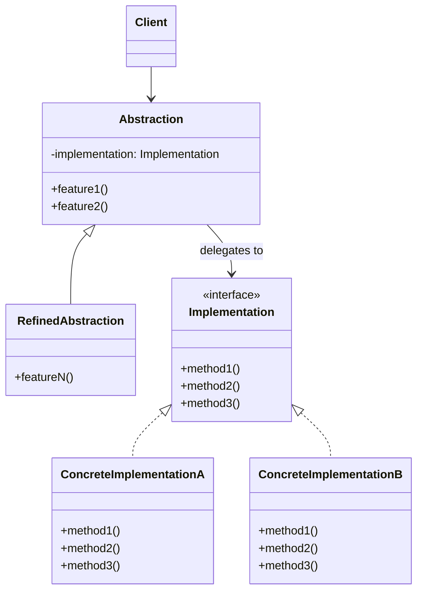

---
tags:
- design-patterns
- oop
- software-design
- software-engineering
---

> *Source: Dive Into Design Patterns by Alexander Shvets, "Bridge" (pp. 164–178)*

## Intent

> Bridge is a structural design pattern that lets you split a large class or a set of closely related classes into two separate hierarchies—abstraction and implementation—which can be developed independently of each other.

---

## Problem

Two independent dimensions of variation cause an exponential explosion of subclasses when modeled with inheritance alone.

**The Shape × Color explosion.** Start with a `Shape` base class and two subclasses: `Circle` and `Square`. Now add color: `Red` and `Blue`. Since each shape needs every color variant, you get four class combinations (`BlueCircle`, `RedCircle`, `BlueSquare`, `RedSquare`). Adding a `Triangle` shape forces two more subclasses (one per color). Adding a new color afterwards forces *three* more subclasses (one per shape). The hierarchy grows in geometric progression — unmaintainable beyond a few combinations.

**Cross-platform GUIs.** A GUI app supporting multiple front-end variants (regular customer, admin) and multiple OS backends (Windows, Linux, macOS) becomes a giant spaghetti bowl. Hundreds of conditionals connect different GUI types with various APIs. Monolithic changes require understanding the *entire* codebase. Adding a new GUI or a new OS triggers yet more combinatorial growth.

> The root cause: trying to extend a class in two or more orthogonal (independent) dimensions through inheritance alone.

---

## Solution

The Bridge pattern replaces inheritance with **object composition**. You extract one dimension into its own class hierarchy and give the original class a reference to it. The original class then *delegates* work to the linked object instead of owning everything itself.

**Shape × Color, solved.** Extract color-related code into a `Color` hierarchy with `Red` and `Blue` subclasses. `Shape` gets a reference field pointing to a `Color` object. The shape delegates color-related work to the linked color. That reference acts as a **bridge** between the two hierarchies. Adding a new color no longer touches the shape hierarchy — and vice versa.

**Abstraction vs. Implementation (GoF terms).** The *abstraction* is the high-level control layer (e.g., the GUI). It doesn't do real work; it delegates to the *implementation* layer (e.g., the OS API). These are conceptual roles, not programming-language constructs. You can extend both hierarchies independently: new GUIs without touching OS code, new OS support without touching GUI code.

The pattern turns one monolithic class hierarchy into several **related, composable hierarchies** that evolve independently.

---

## Structure

| Role | Responsibility |
|------|----------------|
| **Abstraction** | High-level control logic. Maintains a reference to an `Implementation` object and delegates all real work to it. |
| **Implementation** (interface) | Declares the interface common to all concrete implementations. The abstraction communicates with implementations *only* through these methods. Usually provides primitive operations, while the abstraction defines higher-level operations built on those primitives. |
| **Concrete Implementations** | Platform-specific code. All follow the same `Implementation` interface. |
| **Refined Abstractions** | Variants of control logic. Like their parent, they work with any implementation through the general interface. |
| **Client** | Works with the abstraction. Links the abstraction to a concrete implementation (typically via the abstraction's constructor), then forgets about the implementation details. |



---

## Pseudocode (from source)

The example divides a monolithic app that manages devices and their remote controls. `Device` classes act as the *implementation*; `Remote` classes act as the *abstraction*.

```
// The "abstraction" — maintains a reference to a device and
// delegates all real work to it.
class RemoteControl is
    protected field device: Device

    constructor RemoteControl(device: Device) is
        this.device = device

    method togglePower() is
        if (device.isEnabled()) then
            device.disable()
        else
            device.enable()

    method volumeDown() is
        device.setVolume(device.getVolume() - 10)
    method volumeUp() is
        device.setVolume(device.getVolume() + 10)
    method channelDown() is
        device.setChannel(device.getChannel() - 1)
    method channelUp() is
        device.setChannel(device.getChannel() + 1)


// Refined abstraction — extends the remote independently of devices.
class AdvancedRemoteControl extends RemoteControl is
    method mute() is
        device.setVolume(0)


// The "implementation" interface — primitive operations that all
// devices must support. Doesn't have to match the abstraction's
// interface; the two can be entirely different.
interface Device is
    method isEnabled()
    method enable()
    method disable()
    method getVolume()
    method setVolume(percent)
    method getChannel()
    method setChannel(channel)


// All devices follow the same interface.
class Tv implements Device is
    // ...

class Radio implements Device is
    // ...


// Client code — creates a device, passes it to the remote.
tv = new Tv()
remote = new RemoteControl(tv)
remote.togglePower()

radio = new Radio()
remote = new AdvancedRemoteControl(radio)
```

> ✅ Pseudocode reproduced directly from source.

---

## Applicability

- **Divide and organize a monolithic class with several variants of functionality.** When one class must work with multiple database servers, rendering engines, or notification channels, Bridge splits it into manageable hierarchies. Changes to one variant no longer force changes across the whole class.

- **Extend a class in several orthogonal (independent) dimensions.** When the class grows along multiple axes (form × color, GUI × platform, domain × infrastructure), Bridge extracts a separate hierarchy for each dimension. The original class delegates instead of absorbing everything.

- **Switch implementations at runtime.** Bridge makes implementation replacement as simple as assigning a new value to a reference field. This is also the main reason people sometimes confuse Bridge with **Strategy** — the *intent* differs even when the structure looks similar.

---

## How to Implement

1. Identify the orthogonal dimensions (abstraction/platform, domain/infrastructure, front-end/back-end).
2. Define the operations the client needs in the base abstraction class.
3. Determine the operations available on all platforms and declare them in the general implementation interface.
4. Create concrete implementation classes for each platform — all following the implementation interface.
5. Add a reference field for the implementation type in the abstraction class. Delegate most work to that field.
6. Create refined abstractions by extending the base abstraction for each high-level logic variant.
7. Client passes an implementation object to the abstraction's constructor, then works only with the abstraction.

---

## Pros and Cons

### ✅ Pros
- Platform-independent classes and apps — implementations are interchangeable as long as they follow the common interface.
- Client code works with high-level abstractions and is never exposed to platform details.
- **Open/Closed Principle.** New abstractions and implementations can be introduced independently without modifying existing code.
- **Single Responsibility Principle.** High-level logic lives in the abstraction; platform details live in the implementation.

### ❌ Cons
- Applying the pattern to a highly cohesive class may introduce unnecessary complexity — you're splitting something that wasn't meant to be split.

---

## Relations with Other Patterns

- **Bridge vs. Adapter.** Bridge is usually *designed up-front* to let parts of an application evolve independently. Adapter is commonly used *after the fact* to make existing, otherwise-incompatible classes work together. Same structure, different timing and intent.

- **Bridge, State, Strategy, Adapter.** All four are based on composition (delegating work to other objects) and have very similar class diagrams. The difference is the *problem each solves*. A pattern communicates intent, not just structure.

- **Bridge + Abstract Factory.** When certain abstractions defined by Bridge can only work with specific implementations, Abstract Factory can encapsulate those relations and hide the pairing complexity from the client.

- **Bridge + Builder.** The director class plays the role of the abstraction, while different builders act as implementations.

---

## Summary Checklist

- [ ] Two or more orthogonal (independent) dimensions of variation have been identified.
- [ ] A common `Implementation` interface declares primitive operations available on all platforms.
- [ ] Concrete implementation classes exist for each platform, all following the same interface.
- [ ] The base `Abstraction` class holds a reference to an `Implementation` object and delegates work to it.
- [ ] Refined abstractions extend the base for high-level logic variants.
- [ ] The client links an abstraction to a concrete implementation (typically via constructor injection).
- [ ] After construction, the client works solely with the abstraction — implementation details are hidden.
- [ ] Adding a new platform or a new abstraction variant requires no changes to existing code.

---

## Related

[[adapter]], [[strategy]], [[abstract-factory]], [[builder]], [[state]], [[decorator]], **solid-principles**
