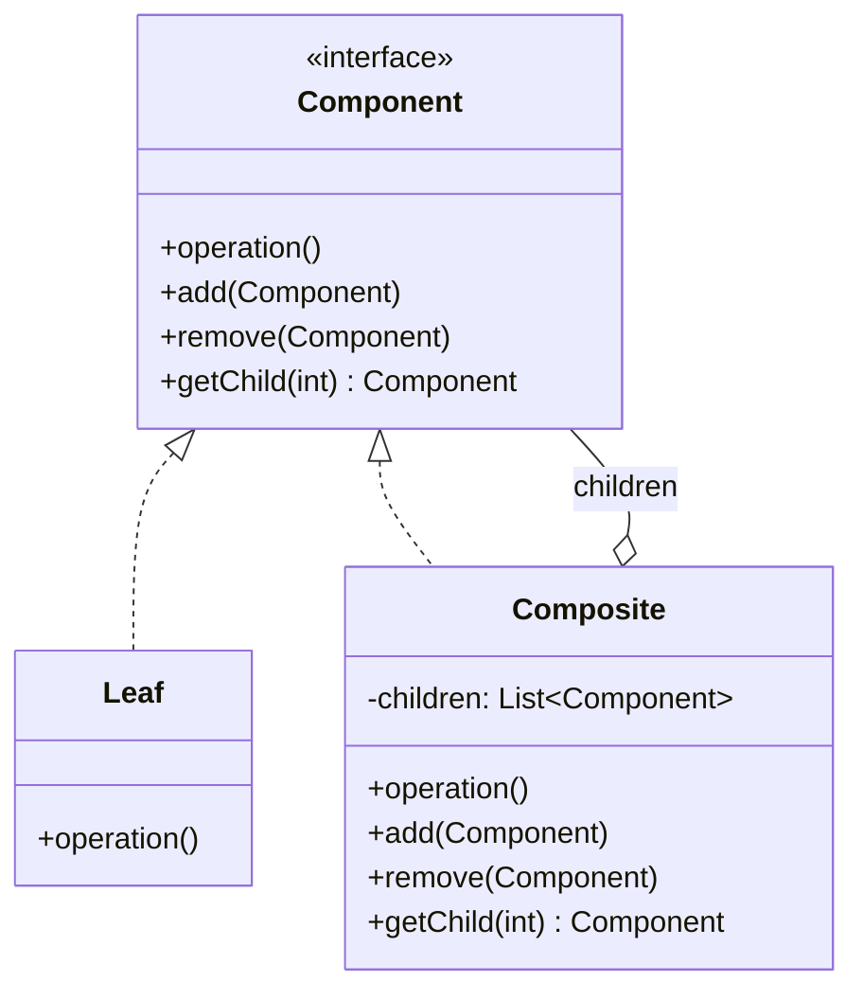

---
tags:
- design-patterns
- oop
- software-design
- software-engineering
---

> *Source: Dive Into Design Patterns by Alexander Shvets, "Composite" (pp. 179–192)*

## Intent
> Composite is a structural design pattern that lets you compose objects into tree structures and then work with these structures as if they were individual objects.

Also known as: **Object Tree**.

---

## Problem

When the core model of your application can be represented as a tree, you face a fundamental challenge: how do you treat individual objects and groups of objects uniformly?

Consider an ordering system with `Product` and `Box` objects. A `Box` can contain multiple `Product`s as well as smaller `Box`es, which in turn can hold more `Product`s or even smaller `Box`es — an upside-down tree. An order might consist of simple products, boxes stuffed with products, boxes inside boxes, and so forth.

The direct approach — unwrapping every box, iterating all products, and calculating the total — becomes awkward or impossible. You must know the concrete classes of every object, the nesting level of boxes, and handle branching logic at every depth. This coupling explodes as the tree grows.

The core tension: **individual objects and compositions of objects require different treatment in naive code**, even though conceptually they represent the same thing from the client's perspective.

---

## Solution

The Composite pattern introduces a **common interface** — the *Component* — that both leaves (simple objects) and composites (containers) implement. This interface declares the operations that make sense for both.

- For a **leaf** (e.g., a `Product`), the method simply returns its own value.
- For a **composite** (e.g., a `Box`), the method iterates over its children, calls the same method on each, and aggregates the result.

A box can add packaging costs on top. If a child is itself a box, it recursively delegates to its own children. The entire tree is traversed through polymorphism — no explicit type-checking or unwrapping required.

The key insight: **the client doesn't need to know whether it's working with a simple object or a complex composition.** When a method is called, objects themselves pass the request down the tree.

### Real-World Analogy

Military hierarchies: an army consists of divisions, divisions consist of brigades, brigades consist of platoons, platoons consist of squads, and squads consist of individual soldiers. Orders are given at the top and cascade down through every level — each level knows how to receive an order and delegate it to subordinates without caring about the concrete composition below.

---

## Structure




1. **Component** — Interface declaring operations common to both simple and complex elements of the tree. May optionally declare child-management methods (`add`, `remove`, `getChild`).

2. **Leaf** — Basic element with no sub-elements. Does most of the real work since it has no one to delegate to.

3. **Composite (Container)** — Element that has sub-elements (leaves or other composites). Doesn't know the concrete classes of its children; works with all sub-elements via the `Component` interface. Delegates work to children, processes intermediate results, and returns the final result to the client.

4. **Client** — Works with all elements through the `Component` interface. Can treat simple and complex elements identically.

---

## Pseudocode

Geometric shapes editor example — the `CompoundGraphic` class acts as a container that holds any number of sub-shapes, including other compound shapes.

```text
// The component interface declares common operations for both
// simple and complex objects of a composition.
interface Graphic is
    method move(x, y)
    method draw()

// The leaf class represents end objects of a composition. A
// leaf object can't have any sub-objects. Usually, it's leaf
// objects that do the actual work, while composite objects only
// delegate to their sub-components.
class Dot implements Graphic is
    field x, y

    constructor Dot(x, y) { ... }

    method move(x, y) is
        this.x += x, this.y += y

    method draw() is
        // Draw a dot at X and Y.

// All component classes can extend other components.
class Circle extends Dot is
    field radius

    constructor Circle(x, y, radius) { ... }

    method draw() is
        // Draw a circle at X and Y with radius R.

// The composite class represents complex components that may
// have children. Composite objects usually delegate the actual
// work to their children and then "sum up" the result.
class CompoundGraphic implements Graphic is
    field children: array of Graphic

    // A composite object can add or remove other components
    // (both simple or complex) to or from its child list.
    method add(child: Graphic) is
        // Add a child to the array of children.

    method remove(child: Graphic) is
        // Remove a child from the array of children.

    method move(x, y) is
        foreach (child in children) do
            child.move(x, y)

    // A composite executes its primary logic in a particular
    // way. It traverses recursively through all its children,
    // collecting and summing up their results. Since the
    // composite's children pass these calls to their own
    // children and so forth, the whole object tree is traversed
    // as a result.
    method draw() is
        // 1. For each child component:
        //     - Draw the component.
        //     - Update the bounding rectangle.
        // 2. Draw a dashed rectangle using the bounding coordinates.

// The client code works with all the components via their base
// interface. This way the client code can support simple leaf
// components as well as complex composites.
class ImageEditor is
    field all: CompoundGraphic

    method load() is
        all = new CompoundGraphic()
        all.add(new Dot(1, 2))
        all.add(new Circle(5, 3, 10))
        // ...

    // Combine selected components into one complex composite component.
    method groupSelected(components: array of Graphic) is
        group = new CompoundGraphic()
        foreach (component in components) do
            group.add(component)
            all.remove(component)
        all.add(group)
        // All components will be drawn.
        all.draw()
```

✅ Pseudocode faithfully reproduced from source (pp. 186–188), with minor formatting normalization.

---

## Applicability

| When | Why |
|------|-----|
| You need to implement a **tree-like object structure** | The pattern provides two basic element types sharing a common interface: simple leaves and complex containers. Containers can hold both leaves and other containers, enabling nested recursive trees. |
| You want **client code to treat simple and complex elements uniformly** | All elements share the `Component` interface. The client doesn't worry about the concrete class of objects it works with — everything is accessed through the same contract. |

### How to Implement

1. Ensure the core model can be represented as a tree. Break it into simple elements and containers.
2. Declare the **component interface** with methods that make sense for both simple and complex components.
3. Create **leaf classes** to represent simple elements. Multiple different leaf classes are allowed.
4. Create a **container class** with an array field storing sub-element references. Declare the array with the component interface type. Container methods delegate to sub-elements.
5. Define **child-management methods** (`add`, `remove`) in the container. Optionally declare them in the component interface (violates ISP, but enables uniform tree composition).

---

## Pros and Cons

✅ **Pros**
- **Simplified tree operations** — Use polymorphism and recursion to traverse and process complex tree structures elegantly.
- **Open/Closed Principle** — Introduce new element types without breaking existing code. Existing code works with the object tree through the component interface.

❌ **Cons**
- **Overgeneralized interface** — Providing a common interface for classes whose functionality differs too much can make the component contract hard to comprehend. Leaf classes end up with meaningless stub methods for child-management operations.

---

## Relations with Other Patterns

| Pattern | Relationship |
|---------|-------------|
| **[[builder]]** | Use Builder when constructing complex Composite trees; its construction steps can be programmed to work recursively. |
| **[[chain-of-responsibility]]** | Often combined with Composite: when a leaf gets a request, it can pass it up the chain through parent components to the root. |
| **[[iterator]]** | Use Iterators to traverse Composite trees. |
| **[[visitor]]** | Use Visitor to execute an operation over an entire Composite tree without polluting component classes with operation logic. |
| **[[flyweight]]** | Implement shared leaf nodes of the Composite tree as Flyweights to save RAM. |
| **[[decorator]]** | Similar structure diagrams — both rely on recursive composition. A Decorator is like a Composite with a single child. Key difference: Decorator *adds* responsibilities to the wrapped object; Composite *sums up* children's results. They can cooperate: use Decorator to extend behavior of a specific object inside a Composite tree. |
| **[[prototype]]** | Designs heavy on Composite and Decorator can benefit from Prototype: clone complex structures instead of rebuilding them from scratch. |

---

## Summary Checklist

- [ ] Core model representable as a **tree**? (simple elements + containers)
- [ ] **Component interface** declared with operations common to both leaves and composites?
- [ ] **Leaf classes** created — they do the actual work, no children?
- [ ] **Composite container class** with child array (typed as Component interface)?
- [ ] Container methods **delegate to children** and aggregate results?
- [ ] Child-management methods (`add`/`remove`) defined in container?
- [ ] Tradeoff evaluated: **place child-management in Component interface** (uniform access, violates ISP) vs. **only in Composite** (safe interface, but client must know type)?
- [ ] **Client code** interacts solely through the Component interface?
- [ ] New leaf/composite types addable without changing existing code? (OCP check)

---

## Related
[[decorator]] | [[iterator]] | [[visitor]] | [[chain-of-responsibility]] | [[builder]] | [[flyweight]] | [[prototype]] | **solid-principles**
