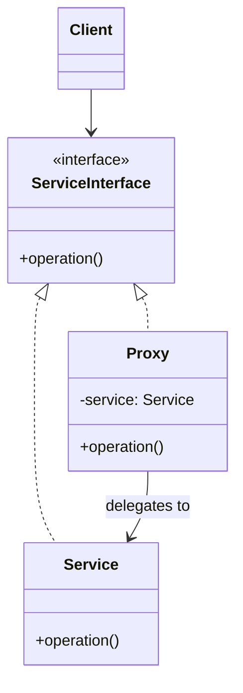

---
tags:
- design-patterns
- oop
- software-design
- software-engineering
---

> *Source: Dive Into Design Patterns by Alexander Shvets, "Proxy" (pp. 235–246)*

## Intent

> Proxy is a structural design pattern that lets you provide a substitute or placeholder for another object. A proxy controls access to the original object, allowing you to perform something either before or after the request gets through to the original object.

## Problem

You have an object that is expensive to create, resource-heavy, or lives on a remote server. You need it, but not all the time. You want to:

- **Lazy-load** it only when actually needed, not at startup.
- **Control access** so only authorized clients can invoke it.
- **Log every request** without modifying the original class.
- **Cache results** to avoid redundant expensive operations.

The naive fix — pushing deferred-init or logging code directly into every client — causes duplication and violates SRP. You can't always modify the service class itself (e.g. closed 3rd-party library, `final` class).

## Solution

Create a **proxy class** that implements the **same interface** as the real service. The proxy:

1. Receives the client's request.
2. Performs its extra work (lazy init, access check, logging, caching).
3. Delegates to the real service.

The proxy *disguises itself* as the service. Neither the client nor the real service knows the proxy is there. You can swap a proxy for the real object without touching any client code.

**Real-world analogy:** A credit card is a proxy for a bank account, which is a proxy for cash. All three share the same "pay" interface. The consumer avoids carrying cash; the merchant receives funds electronically without risk of theft.

## Structure

| Component | Role |
|---|---|
| **Service Interface** | Declares the common interface that both the real service and the proxy implement. |
| **Service** | The concrete class containing real business logic. |
| **Proxy** | Holds a reference to the service. Performs pre/post processing (lazy init, access control, logging, caching), then delegates to the service. Often manages the full lifecycle of the service object. |
| **Client** | Works with both services and proxies through the interface. Never knows (or cares) which one it holds. |




## Pseudocode ✅ (from source)

*Video-caching proxy for a 3rd-party YouTube library.*

```java
// The interface of a remote service.
interface ThirdPartyYouTubeLib {
    method listVideos()
    method getVideoInfo(id)
    method downloadVideo(id)
}

// Concrete service — calls YouTube API. Slow; no caching built in.
// Cannot be modified (3rd-party / final).
class ThirdPartyYouTubeClass implements ThirdPartyYouTubeLib {
    method listVideos() {
        // Send an API request to YouTube.
    }
    method getVideoInfo(id) {
        // Get metadata about some video.
    }
    method downloadVideo(id) {
        // Download a video file from YouTube.
    }
}

// Proxy: same interface, adds caching.
class CachedYouTubeClass implements ThirdPartyYouTubeLib {
    private field service: ThirdPartyYouTubeLib
    private field listCache, videoCache
    field needReset

    constructor CachedYouTubeClass(service: ThirdPartyYouTubeLib) {
        this.service = service
    }

    method listVideos() {
        if (listCache == null || needReset)
            listCache = service.listVideos()
        return listCache
    }

    method getVideoInfo(id) {
        if (videoCache == null || needReset)
            videoCache = service.getVideoInfo(id)
        return videoCache
    }

    method downloadVideo(id) {
        if (!downloadExists(id) || needReset)
            service.downloadVideo(id)
    }
}

// Client — unchanged. Works through the interface.
class YouTubeManager {
    protected field service: ThirdPartyYouTubeLib

    constructor YouTubeManager(service: ThirdPartyYouTubeLib) {
        this.service = service
    }

    method renderVideoPage(id) {
        info = service.getVideoInfo(id)
        // Render the video page.
    }

    method renderListPanel() {
        list = service.listVideos()
        // Render the list of video thumbnails.
    }

    method reactOnUserInput() {
        renderVideoPage()
        renderListPanel()
    }
}

// Wiring — proxy wraps the real service transparently.
class Application {
    method init() {
        aYouTubeService = new ThirdPartyYouTubeClass()
        aYouTubeProxy = new CachedYouTubeClass(aYouTubeService)
        manager = new YouTubeManager(aYouTubeProxy)
        manager.reactOnUserInput()
    }
}
```

The `YouTubeManager` never knows it received a proxy. Repeated calls to the same video hit the cache instead of re-downloading.

## Applicability

| Variant | When to Use |
|---|---|
| **Virtual Proxy (Lazy Init)** | Heavyweight service wastes resources by being always up. Delay creation until first real use. |
| **Protection Proxy (Access Control)** | Only specific clients should invoke the service. Proxy checks credentials before forwarding. |
| **Remote Proxy** | Service lives on a remote server. Proxy handles network serialization, connection, and error handling transparently. |
| **Logging Proxy** | Keep an audit trail of every request. Proxy logs each call before delegating. |
| **Caching Proxy** | Cache expensive results and manage cache lifecycle. Proxy keyed on request parameters. |
| **Smart Reference** | Dismiss heavyweight objects when no active clients remain. Proxy tracks references and frees resources when count drops to zero. Also detects unchanged objects for reuse. |

## Pros and Cons

### ✅ Pros

- **Transparent control** — Clients don't know they're talking to a proxy.
- **Lifecycle management** — Proxy owns the service; clients need not care about creation/destruction.
- **Works with unavailable services** — Proxy handles the case where the real service isn't ready or reachable.
- **Open/Closed Principle** — Introduce new proxy variants without touching the service or any client.

### ❌ Cons

- **More classes** — Each proxy variant adds a new class; codebase complexity grows.
- **Added latency** — The proxy's extra work (network hop, access check) may delay the response.

## Relations with Other Patterns

| Pattern | Similarity | Difference |
|---|---|---|
| **[[adapter]]** | Both wrap another object | Adapter provides a *different* interface. Proxy preserves the *same* interface. |
| **[[decorator]]** | Same structure (composition + delegation) | Decorator adds *behavior* and composition is controlled by the *client*. Proxy manages the service's *lifecycle* and is transparent to the client. |
| **[[facade]]** | Both buffer a complex entity and may initialize it | Facade exposes a *simplified* (different) interface. Proxy keeps the *same* interface as the service. |

- **Decorator vs Proxy:** Both compose and delegate. The key difference is intent: *Decorator* enhances behavior under client control; *Proxy* controls access/lifecycle without client awareness. A proxy usually *owns* its service object; a decorator never does.
- **Adapter vs Proxy:** Adapter translates interfaces; Proxy keeps the interface identical. Use Adapter when you need to integrate incompatible types; use Proxy when you want to intercept calls to a compatible one.

## Summary Checklist

- [ ] Extracted a common **Service Interface** (or made proxy a subclass when extraction isn't possible).
- [ ] Proxy class implements the same interface and holds a reference to the real service.
- [ ] Proxy performs its added concern (lazy init, access check, logging, caching), *then* delegates to the service.
- [ ] Proxy typically owns and manages the full lifecycle of the service object.
- [ ] Client code receives the interface and works without knowing whether it holds a proxy or the real service.
- [ ] Consider a factory method or static creation method to decide proxy vs. real service at construction time.
- [ ] Consider lazy initialization of the service object inside the proxy.

## Related

- [[adapter]]
- [[decorator]]
- [[facade]]
- [[flyweight]]
- [[singleton]]
- **solid-principles**
