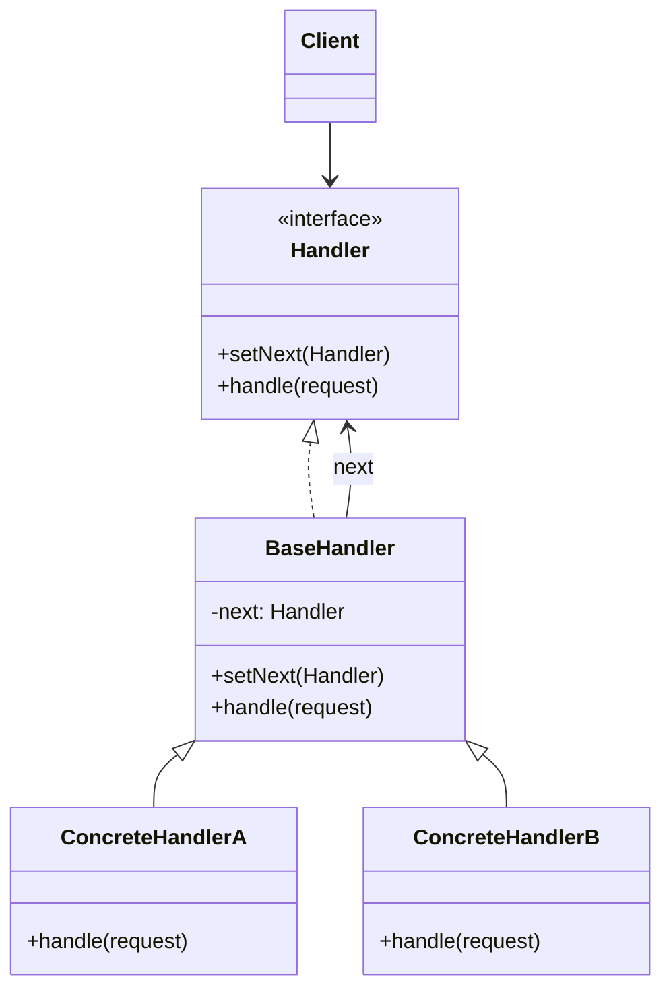

---
tags:
- design-patterns
- oop
- software-design
- software-engineering
---

> *Source: Dive Into Design Patterns by Alexander Shvets, "Chain of Responsibility" (pp. 251–268)*

## Intent

> Chain of Responsibility is a behavioral design pattern that lets you pass requests along a chain of handlers. Upon receiving a request, each handler decides either to process the request or to pass it to the next handler in the chain.

---

## Problem

Consider an online ordering system. Access is gated by a growing list of sequential checks:

1. **Authentication** — verify user credentials before anything else.
2. **Authorization** — administrative users need full access to all orders.
3. **Data sanitization** — raw data must be cleaned before reaching the core system.
4. **Brute-force protection** — filter repeated failed requests from the same IP.
5. **Caching** — return cached results on duplicate requests to improve performance.

Each check was bolted on over months. The code became a bloated tangle of if-else blocks. Changing one check could break another. The worst part: when reusing those checks for other system components, code had to be duplicated because different components needed different subsets of checks. The system grew incomprehensible and expensive to maintain.

---

## Solution

The pattern transforms each check into a **stand-alone handler object** — a class with a single method that performs the check. Handlers are then **linked into a chain**: each handler stores a reference to the next handler. A request travels along the chain until every handler has had a chance to process it.

A handler can decide **not** to pass the request further, effectively stopping all downstream processing.

**Two canonical approaches:**

| Approach | Behavior |
|---|---|
| **All-handlers** | Every handler performs its processing, then passes the request along (e.g., authentication → sanitization → caching). |
| **First-capable** | Each handler decides whether it can handle the request. If it can, it processes it and stops the chain. Otherwise, it passes it on. Common in GUI event propagation (button → panel → form → window). |

All handler classes implement the **same interface**. This lets you compose chains at runtime with any combination of concrete handlers, without coupling client code to their implementations.

> **Real-world analogy:** Calling tech support. You start with an auto-responder (nine canned solutions), get escalated to a live operator (reads from the manual), and finally reach an engineer who actually solves the problem. Each level either handles your issue or passes you along.

---

## Structure


| Role | Responsibility |
|---|---|
| **Handler** | Declares the interface with a method for handling requests. May include a method for setting the next handler. |
| **Base Handler** (optional) | Boilerplate: stores a reference to the next handler. Default behavior is forwarding to the next handler if it exists. |
| **Concrete Handlers** | Contain the actual processing logic. Each decides (a) whether to process the request and (b) whether to pass it along. Self-contained and immutable — all data via constructor. |
| **Client** | Composes the chain (once or dynamically) and sends requests to any handler in it — not necessarily the first. |



---

## Pseudocode

> ❌ Pseudocode provided by source. GUI contextual help system combining **Composite** + **Chain of Responsibility**.

```
// The handler interface
interface ComponentWithContextualHelp is
  method showHelp()

// Base class for simple components
abstract class Component implements ComponentWithContextualHelp is
  field tooltipText: string
  protected field container: Container

  method showHelp() is
    if (tooltipText != null)
      // Show tooltip.
    else
      container.showHelp()

// Containers hold children; chain relationships established here
abstract class Container extends Component is
  protected field children: array of Component

  method add(child) is
    children.add(child)
    child.container = this

// Simple component — default behavior is sufficient
class Button extends Component is
  // ...

// Complex component — overrides default with modal help
class Panel extends Container is
  field modalHelpText: string

  method showHelp() is
    if (modalHelpText != null)
      // Show a modal window with help text.
    else
      super.showHelp()

// Another complex component — opens wiki page
class Dialog extends Container is
  field wikiPageURL: string

  method showHelp() is
    if (wikiPageURL != null)
      // Open the wiki help page.
    else
      super.showHelp()

// Client code
class Application is
  method createUI() is
    dialog = new Dialog("Budget Reports")
    dialog.wikiPageURL = "http://..."
    panel = new Panel(0, 0, 400, 800)
    panel.modalHelpText = "This panel does..."
    ok = new Button(250, 760, 50, 20, "OK")
    ok.tooltipText = "This is an OK button that..."
    cancel = new Button(320, 760, 50, 20, "Cancel")
    panel.add(ok)
    panel.add(cancel)
    dialog.add(panel)

  method onF1KeyPress() is
    component = this.getComponentAtMouseCoords()
    component.showHelp()
```

**How it works:** When F1 is pressed on a GUI element, `showHelp()` is called. If the element has its own help (tooltip, modal text, wiki URL), it displays it. Otherwise, it delegates to its container. The request **bubbles up** through the object tree — Button → Panel → Dialog — until a handler can satisfy it. This leverages the Composite pattern's tree structure to form the chain implicitly.

---

## Applicability

Use Chain of Responsibility when:

- The program must process **different kinds of requests in various ways**, but the exact types and sequences are **unknown at development time**.
- Multiple handlers must execute in a **specific, pre-defined order**.
- The **set of handlers and their order needs to change at runtime** — insert, remove, or reorder handlers dynamically via setters.

---

## Pros and Cons

| ✅ Pros | ❌ Cons |
|---|---|
| You control the **order** of request handling. | Some requests may **end up unhandled** — no handler picks them up. |
| **Single Responsibility Principle**: decouple invocation from execution. | |
| **Open/Closed Principle**: introduce new handlers without modifying existing client code. | |

---

## Relations with Other Patterns

| Pattern | Relationship |
|---|---|
| **Command** | CoR passes requests sequentially along a dynamic chain; Command establishes a fixed unidirectional connection. Handlers can be implemented as Commands, or the request itself can be a Command object executed across chained contexts. |
| **Mediator** | Mediator eliminates direct sender–receiver connections, forcing indirect communication. CoR keeps senders and receivers loosely coupled through a sequential chain. |
| **Observer** | Observers dynamically subscribe/unsubscribe. CoR has a fixed chain structure. Both decouple senders from receivers, but in fundamentally different ways. |
| **Composite** | Frequently used together. A leaf component passes a request up the parent chain to the root — the Composite tree *is* the chain. |
| **Decorator** | Very similar class structures — both use recursive composition. Key difference: **CoR handlers can stop the chain at any point** and execute arbitrary, independent operations. **Decorators must not break the flow** and always extend behavior consistently with the base interface. |

---

## Summary Checklist

- [ ] Is there a sequence of checks or operations that must be performed in order?
- [ ] Do the checks need to be composed or reordered at runtime?
- [ ] Are you duplicating validation/auth/sanitization logic across components?
- [ ] Can a handler stop the chain early (fail-fast semantics)?
- [ ] Can the chain be derived from an existing object tree (Composite)?
- [ ] Have you handled the edge case where **no handler processes the request**?
- [ ] Are all handlers implementing a **single interface** to prevent tight coupling?
- [ ] Does each handler respect SRP — one reason to change?

---

## Related

[[command]] | [[mediator]] | [[observer]] | [[composite]] | [[decorator]] | **solid-principles**
