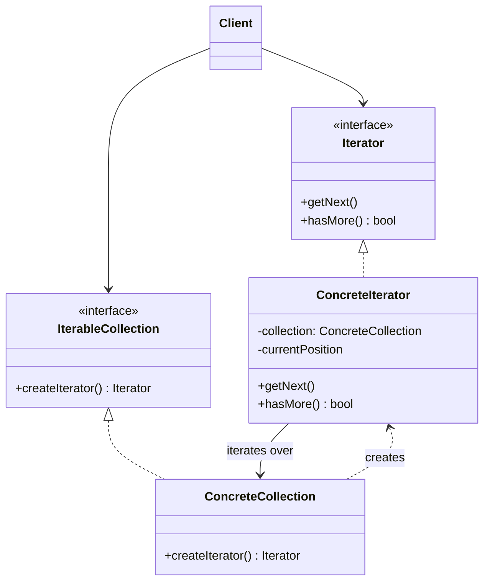

---
tags:
- design-patterns
- oop
- software-design
- software-engineering
---

> *Source: Dive Into Design Patterns by Alexander Shvets, "Iterator" (pp. 290–304)*

## Intent

> Iterator is a behavioral design pattern that lets you traverse elements of a collection without exposing its underlying representation (list, stack, tree, etc.).

---

## Problem

Collections are among the most used data types in programming. Most collections store elements in simple lists, but others are built on stacks, trees, graphs, and other complex data structures. Regardless of internal structure, every collection must provide a way to access its elements sequentially without revisiting the same elements repeatedly.

Looping over a flat list is trivial. Traversing a tree is not: one day you might need depth-first traversal; the next, breadth-first; the next week, random access. Embedding all these traversal algorithms directly into the collection class creates several problems:

- **Blurred responsibility.** The collection's primary job is efficient data storage. Piling on traversal algorithms dilutes that focus.
- **Inappropriate coupling.** Some traversal algorithms are application-specific and don't belong in a generic collection class.
- **Client coupling.** Because every collection type exposes a different access mechanism, client code must know the concrete collection class to iterate over it. Switching collection types forces changes throughout the client code.

---

## Solution

The Iterator pattern extracts traversal behavior into a separate object—the **iterator**. An iterator encapsulates all traversal details: the current position, how many elements remain, and the algorithm itself. Several iterators can traverse the same collection simultaneously and independently.

All iterators implement a **common interface**, typically providing one primary method for fetching the next element. The client calls this method until nothing is returned, signaling the end of the collection. Because the client depends only on the iterator interface, it works with any collection type and any traversal algorithm without modification. To add a new traversal strategy, you create a new iterator class—no changes to the collection or the client.

**Real-world analogy:** Visiting Rome's sights. You can wander randomly (inefficient), use a smartphone navigation app, or hire a local guide. Each option is an "iterator" over the same collection of attractions, offering a different traversal experience.

---

## Structure

1. **Iterator** (interface) — Declares operations for traversal: `getNext()`, `hasMore()`, current position, restart, etc.

2. **Concrete Iterators** — Implement specific traversal algorithms. Each iterator tracks its own traversal state independently, enabling multiple concurrent iterations over the same collection.

3. **Collection** (interface) — Declares one or more factory methods that return iterators. The return type must be the `Iterator` interface so concrete collections can return different iterator implementations.

4. **Concrete Collections** — Return new instances of the appropriate concrete iterator each time the client requests one. The collection passes itself (`this`) to the iterator's constructor to establish the link.

5. **Client** — Works with collections and iterators exclusively through their interfaces. Typically obtains iterators from the collection rather than creating them directly.



---

## Pseudocode

The example uses a social network profile iterator. The `SocialNetwork` interface declares factory methods for producing iterators; `Facebook` and `LinkedIn` are concrete implementations. The `ProfileIterator` interface exposes `getNext()` and `hasMore()`. The `FacebookIterator` concrete class holds a reference to the `Facebook` collection, a `currentPosition` pointer, and a lazily-initialized `cache` of profiles fetched via the social graph API. `SocialSpammer` is the client—it receives any `ProfileIterator` and sends emails without knowing which social network or traversal algorithm is in use. The `Application` class wires everything together at runtime.

```text
// Collection interface
interface SocialNetwork is
    method createFriendsIterator(profileId): ProfileIterator
    method createCoworkersIterator(profileId): ProfileIterator

// Concrete collection
class Facebook implements SocialNetwork is
    method createFriendsIterator(profileId) is
        return new FacebookIterator(this, profileId, "friends")
    method createCoworkersIterator(profileId) is
        return new FacebookIterator(this, profileId, "coworkers")

// Iterator interface
interface ProfileIterator is
    method getNext(): Profile
    method hasMore(): bool

// Concrete iterator
class FacebookIterator implements ProfileIterator is
    private field facebook: Facebook
    private field profileId, type: string
    private field currentPosition
    private field cache: array of Profile

    constructor FacebookIterator(facebook, profileId, type) is
        this.facebook = facebook
        this.profileId = profileId
        this.type = type

    private method lazyInit() is
        if (cache == null)
            cache = facebook.socialGraphRequest(profileId, type)

    method getNext() is
        if (hasMore())
            result = cache[currentPosition]
            currentPosition++
            return result

    method hasMore() is
        lazyInit()
        return currentPosition < cache.length

// Client — works with any iterator
class SocialSpammer is
    method send(iterator: ProfileIterator, message: string) is
        while (iterator.hasMore())
            profile = iterator.getNext()
            System.sendEmail(profile.getEmail(), message)

// Application wiring
class Application is
    field network: SocialNetwork
    field spammer: SocialSpammer

    method config() is
        if working with Facebook
            this.network = new Facebook()
        if working with LinkedIn
            this.network = new LinkedIn()
        this.spammer = new SocialSpammer()

    method sendSpamToFriends(profile) is
        iterator = network.createFriendsIterator(profile.getId())
        spammer.send(iterator, "Very important message")

    method sendSpamToCoworkers(profile) is
        iterator = network.createCoworkersIterator(profile.getId())
        spammer.send(iterator, "Very important message")
```

Key takeaway: you can pass an iterator to a client instead of the entire collection, hiding the collection and allowing runtime changes to traversal strategy—all without coupling the client to concrete classes.

---

## Applicability

| Use when… | Rationale |
|---|---|
| Your collection has a complex internal structure (tree, graph) that you want to hide from clients. | The iterator provides simple `getNext()` / `hasMore()` methods while encapsulating the complexity. It also *protects* the collection from careless or malicious direct manipulation. |
| You want to eliminate duplicated traversal code scattered throughout the application. | Bulky iteration algorithms placed in business logic blur responsibility and reduce maintainability. Moving them into designated iterator classes keeps the application lean. |
| Your code needs to traverse different data structures, or the structure type is unknown ahead of time. | The common `Iterator` and `Collection` interfaces decouple the client from concrete types. Any collection-implementing iterator pair works with existing client code. |

**When not to use:** If your application only deals with simple, flat collections, the Iterator pattern may be overkill. Direct traversal of specialized collections can also be marginally more efficient than going through an iterator abstraction.

---

## How to Implement

1. **Declare the iterator interface.** At minimum, include `getNext()`. Optionally add `hasMore()`, `current()`, `previous()`, `reset()`.

2. **Declare the collection interface** with a factory method that returns the iterator interface type. Define multiple methods if the collection supports distinct iteration modes (e.g., friends vs. coworkers).

3. **Implement concrete iterators.** Link each iterator to a specific collection instance, typically via the constructor. Store iteration state (current position, visited nodes, etc.) as private fields.

4. **Implement the collection interface** in concrete collection classes. The collection passes itself to the iterator's constructor. This is the only place where concrete iterator classes are referenced—the client never sees them.

5. **Refactor client code** to replace manual traversal loops with iterator usage. The client fetches a fresh iterator each time it needs to iterate.

---

## Pros and Cons

### ✅ Pros

- **Single Responsibility Principle.** Bulky traversal algorithms are extracted into dedicated classes, cleaning up both collections and client code.
- **Open/Closed Principle.** New collection types and new iterators can be introduced and passed to existing client code without modification.
- **Parallel iteration.** Each iterator holds its own state; multiple iterators can traverse the same collection concurrently without interference.
- **Pausable iteration.** Since state lives in the iterator object, you can pause, store, and resume iteration later.

### ❌ Cons

- **Overkill for simple collections.** If your app only iterates over arrays or lists, the pattern adds unnecessary indirection.
- **Performance overhead.** Traversing via an iterator may be slightly less efficient than direct, specialized traversal of certain data structures.

---

## Relations with Other Patterns

- **[Composite](../02-Structural/composite.md)** — Iterators are the natural way to traverse Composite tree structures.
- **[Factory Method](../01-Creational/factory-method.md)** — Use Factory Method alongside Iterator so collection subclasses can return different types of iterators compatible with those collections.
- **[Memento](memento.md)** — Use Memento to capture the current iteration state and roll it back if needed.
- **[Visitor](visitor.md)** — Combine Visitor with Iterator to traverse a complex data structure and execute operations over heterogeneous elements.
- **[Command](command.md)** — Commands can use iterators internally when they need to operate over collections.

---

## Summary Checklist

- [ ] Iterator extracts traversal logic from a collection into a separate object.
- [ ] Common `Iterator` interface decouples client code from collection internals and traversal algorithms.
- [ ] Each iterator maintains its own state → parallel iteration and pause/resume are free.
- [ ] Collection interface provides factory methods that return the iterator interface type (not concrete classes).
- [ ] Client obtains iterators from the collection; it never instantiates concrete iterators directly.
- [ ] Adding new traversal strategies means creating a new iterator class—collections and clients stay unchanged (OCP).
- [ ] Best applied to complex data structures (trees, graphs) or when traversal code is duplicated across the app.
- [ ] Avoid for simple flat collections where the abstraction isn't worth the indirection cost.
