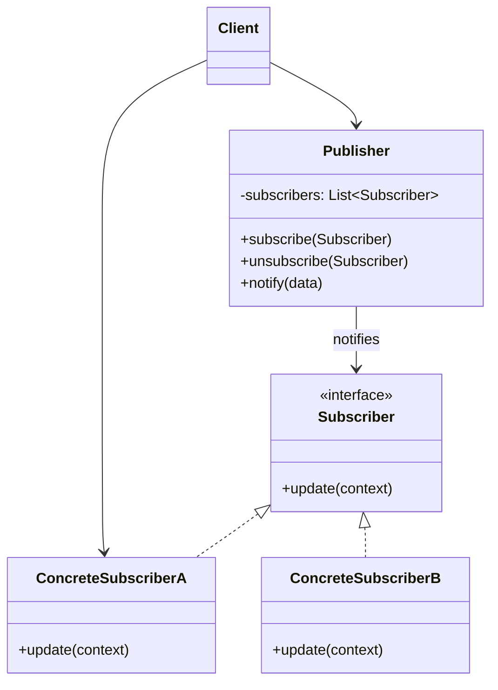

---
tags:
- design-patterns
- oop
- software-design
- software-engineering
---

> *Source: Dive Into Design Patterns by Alexander Shvets, "Observer" (pp. 337–352)*

# Observer

> Observer is a behavioral design pattern that lets you define a subscription mechanism to notify multiple objects about any events that happen to the object they're observing.

**Also known as:** Event-Subscriber, Listener

---

## Problem

Consider two object types: a `Customer` and a `Store`. The customer is eagerly waiting for a specific product (e.g., a new iPhone model) to become available.

**Polling approach (customer visits store every day):** Most trips are wasted while the product is still en route. The customer wastes time checking availability.

**Push approach (store sends mass emails):** The store notifies every customer every time any product arrives. This saves some customers from pointless trips, but spams others who have no interest in new products.

The core conflict: **either the customer wastes time checking, or the store wastes resources notifying the wrong people.** Neither side has a way to target communication efficiently.

---

## Solution

The pattern introduces two roles:

| Role | Description |
|------|-------------|
| **Publisher** (Subject) | The object with interesting state that issues events |
| **Subscriber** | Objects that want to track changes to the publisher's state |

The Observer pattern adds a **subscription mechanism** to the publisher class:

1. An **array field** storing references to subscriber objects.
2. **Public methods** for adding (`subscribe`) and removing (`unsubscribe`) subscribers.

Whenever an important event happens, the publisher iterates over its subscriber list and calls a specific **notification method** on each one.

**Decoupling through interfaces:** All subscribers implement the same `Subscriber` interface. The publisher communicates only through that interface — never directly with concrete subscriber classes. This lets you add new subscriber types without touching the publisher.

If multiple publisher types exist, make them share a common publisher interface (with just subscription methods) so subscribers can observe any publisher without coupling to concrete classes.

### Real-World Analogy

A **newspaper or magazine subscription.** You don't check the store for each new issue — the publisher sends it to your mailbox directly. The publisher maintains a list of subscribers and their interests. Subscribers can unsubscribe anytime.

---

## Structure


1. **Publisher** — Issues events of interest. Contains subscription infrastructure (`subscribe`/`unsubscribe`/`notify`). When an event occurs, iterates over subscribers and calls `update()` on each.

2. **Subscriber interface** — Declares the notification contract. Usually a single `update()` method with optional parameters for contextual event data.

3. **Concrete Subscribers** — Implement `update()` to respond to publisher events. The publisher is never coupled to these concrete classes.

4. **Client** — Creates publisher and subscriber objects separately, then registers subscribers with publishers.

5. **Context data** — Publishers often pass themselves (`this`) or event-specific data as arguments to `update()`, letting subscribers fetch what they need.



---

## Pseudocode ✅

*Source pseudocode from the book — an event manager / text editor notification system.*

### Publisher: EventManager (composition-based)

```
class EventManager is
    private field listeners: hash map of event types and listeners

    method subscribe(eventType, listener) is
        listeners.add(eventType, listener)

    method unsubscribe(eventType, listener) is
        listeners.remove(eventType, listener)

    method notify(eventType, data) is
        foreach (listener in listeners.of(eventType)) do
            listener.update(data)
```

### Concrete Publisher: Editor

```
class Editor is
    public field events: EventManager
    private field file: File

    constructor Editor() is
        events = new EventManager()

    method openFile(path) is
        this.file = new File(path)
        events.notify("open", file.name)

    method saveFile() is
        file.write()
        events.notify("save", file.name)
```

### Subscriber Interface

```
interface EventListener is
    method update(filename)
```

### Concrete Subscribers

```
class LoggingListener implements EventListener is
    private field log: File
    private field message: string

    constructor LoggingListener(log_filename, message) is
        this.log = new File(log_filename)
        this.message = message

    method update(filename) is
        log.write(replace('%s', filename, message))

class EmailAlertsListener implements EventListener is
    private field email: string
    private field message: string

    constructor EmailAlertsListener(email, message) is
        this.email = email
        this.message = message

    method update(filename) is
        system.email(email, replace('%s', filename, message))
```

### Client: Application

```
class Application is
    method config() is
        editor = new Editor()

        logger = new LoggingListener(
            "/path/to/log.txt",
            "Someone has opened the file: %s")
        editor.events.subscribe("open", logger)

        emailAlerts = new EmailAlertsListener(
            "admin@example.com",
            "Someone has changed the file: %s")
        editor.events.subscribe("save", emailAlerts)
```

**Key implementation choice:** The `Editor` delegates subscription management to a separate `EventManager` object (composition over inheritance). This approach works when the concrete publisher already extends another class. The `EventManager` can be upgraded to a centralized event dispatcher, letting any object act as a publisher.

---

## Applicability

✅ **Use Observer when changes to one object require changing others, and the actual set of dependent objects is unknown beforehand or changes dynamically.**

*Example:* Custom GUI button classes — let clients hook custom code via subscriber classes that fire on button press. The subscription mechanism lives in the button; custom code plugs in through the subscriber interface.

✅ **Use Observer when some objects must observe others, but only for a limited time or in specific cases.**

The subscription list is dynamic. Subscribers join and leave at runtime as needed.

---

## Pros and Cons

| Pros | Cons |
|------|------|
| **Open/Closed Principle.** Introduce new subscriber classes without changing the publisher's code (and vice versa if there's a publisher interface). | Subscribers are notified in **random order**. No guarantee of notification sequence. |
| **Runtime flexibility.** Establish and break relations between objects dynamically. | Risk of memory leaks if subscribers aren't unsubscribed before disposal (dangling references in the publisher's list). |

---

## How to Implement (Summary)

1. Split business logic: core functionality → **publisher**; everything else → **subscriber classes**.
2. Declare a **subscriber interface** with at minimum a single `update()` method.
3. Declare a **publisher interface** with `subscribe`/`unsubscribe` methods. Publishers work with subscribers only via the subscriber interface.
4. Place subscription infrastructure in either an **abstract base publisher** (inheritance) or a **separate helper object** (composition, when extending existing classes).
5. Concrete publishers call `notify()` on all subscribers whenever important events occur.
6. Concrete subscribers implement `update()` — either receiving context data as arguments, fetching it from the publisher, or using a permanent publisher reference via constructor.
7. Client creates subscribers and registers them with appropriate publishers.

---

## Relations with Other Patterns

| Pattern | Relationship |
|---------|-------------|
| **[[mediator]]** | Mediator eliminates direct component dependencies through a central object; Observer establishes dynamic one-way connections. They combine well: mediator acts as publisher, components as subscribers. A pure Mediator with permanent links doesn't resemble Observer. |
| **[[chain-of-responsibility]]** | Chain passes a request sequentially along a dynamic chain until handled. Observer broadcasts to all subscribers simultaneously. |
| **[[command]]** | Command establishes unidirectional sender→receiver connections. Observer adds dynamic subscribe/unsubscribe to that model. |
| **[[state]]** | State pattern often uses Observer to notify interested objects of state transitions. |
| **[[strategy]]** | Both rely on interfaces for decoupling, but Strategy swaps algorithms while Observer manages notification subscriptions. |

> *Summary of communication patterns:* Chain of Responsibility → sequential delegation. Command → unidirectional links. Mediator → indirect via central object. Observer → dynamic subscription broadcasting.

---

## Summary Checklist

- [ ] One-to-many dependency: change in one object → automatic notification to all dependents
- [ ] Publisher holds subscriber list + `subscribe()` / `unsubscribe()` / `notify()` methods
- [ ] All subscribers implement a common interface; publisher never depends on concrete subscribers
- [ ] Subscribers can join or leave at runtime
- [ ] Supports Open/Closed Principle — new subscribers without publisher changes
- [ ] Watch for: random notification order, potential memory leaks from lingering subscriptions
- [ ] Composition-based subscription management (EventManager helper) for existing class hierarchies

---

## Related

[[mediator]] | [[chain-of-responsibility]] | [[command]] | [[state]] | [[strategy]] | **solid-principles**
