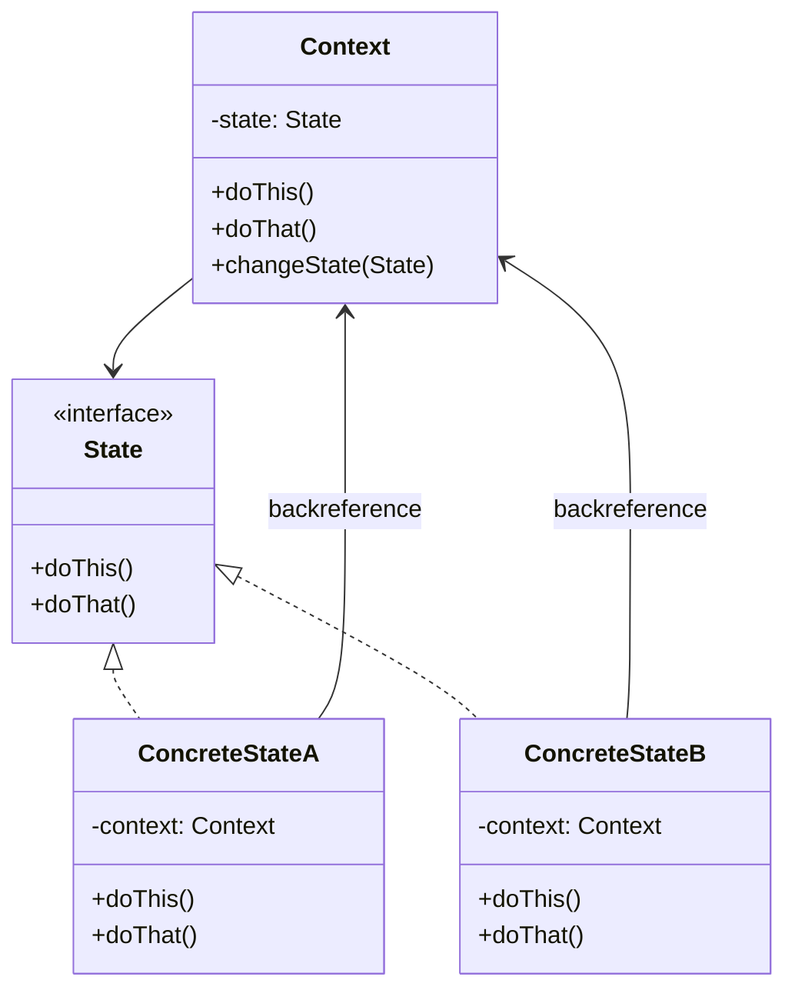

---
tags:
- design-patterns
- oop
- software-design
- software-engineering
---

> *Source: Dive Into Design Patterns by Alexander Shvets, "State" (pp. 353–368)*

## Intent

> State is a behavioral design pattern that lets an object alter its behavior when its internal state changes. It appears as if the object changed its class.

## Problem

Objects often need to behave differently depending on their internal state. The naive approach is a **finite-state machine** implemented with massive `if`/`switch` conditionals scattered across every state-dependent method.

Consider a `Document` publishing workflow with three states:

| State | Behavior of `publish()` |
|---|---|
| **Draft** | Moves document to moderation |
| **Moderation** | Publishes document *only if* current user is an administrator |
| **Published** | Does nothing |

```java
class Document is
    field state: string

    method publish() is
        switch (state)
            "draft":
                state = "moderation"
                break
            "moderation":
                if (currentUser.role == "admin")
                    state = "published"
                break
            "published":
                // Do nothing.
                break
```

**The core weakness:** As more states and behaviors are added, every method grows monstrous conditionals. Any change to transition logic forces you to touch conditionals in *all* methods. The design-stage prediction of all possible states and transitions is difficult, so a lean state machine inevitably bloats over time.

## Solution

The State pattern suggests:

1. **Create a class for each possible state** of the object.
2. **Extract all state-specific behavior** into those classes.
3. The original object — called the **context** — stores a reference to *one* state object representing its current state and **delegates all state-related work** to that object.
4. To **transition**, replace the active state object with another that represents the new state.

All state classes follow the **same interface**, so the context works with them polymorphically. Crucially, **concrete states may be aware of each other and initiate transitions** — this is the key difference from Strategy.

> **Real-world analogy:** Smartphone buttons behave differently depending on device state: unlocked (execute functions), locked (show unlock screen), low charge (show charging screen).

## Structure

1. **Context** — Stores a reference to a concrete state object; delegates all state-specific work to it via the state interface. Exposes a setter (`changeState`) for switching states.
2. **State interface** — Declares state-specific methods that must make sense for *all* concrete states (no dead methods).
3. **Concrete States** — Implement state-specific behavior. May hold a **backreference** to the context to fetch data and initiate transitions. Intermediate abstract classes can encapsulate shared behavior.
4. Both context and concrete states can **set the next state** and trigger the transition by replacing the state object linked to the context.



## Pseudocode

*Audio player with three states: `ReadyState`, `PlayingState`, `LockedState`.*

```java
// The AudioPlayer class acts as a context. It also maintains a
// reference to an instance of one of the state classes that
// represents the current state of the audio player.
class AudioPlayer is
    field state: State
    field UI, volume, playlist, currentSong

    constructor AudioPlayer() is
        this.state = new ReadyState(this)

    // Context delegates handling user input to a state
    // object. Naturally, the outcome depends on what state
    // is currently active, since each state can handle the
    // input differently.
    UI = new UserInterface()
    UI.lockButton.onClick(this.clickLock)
    UI.playButton.onClick(this.clickPlay)
    UI.nextButton.onClick(this.clickNext)
    UI.prevButton.onClick(this.clickPrevious)

    // Other objects must be able to switch the audio player's
    // active state.
    method changeState(state: State) is
        this.state = state

    // UI methods delegate execution to the active state.
    method clickLock() is
        state.clickLock()
    method clickPlay() is
        state.clickPlay()
    method clickNext() is
        state.clickNext()
    method clickPrevious() is
        state.clickPrevious()

    // A state may call some service methods on the context.
    method startPlayback() is
        // ...
    method stopPlayback() is
        // ...
    method nextSong() is
        // ...
    method previousSong() is
        // ...
    method fastForward(time) is
        // ...
    method rewind(time) is
        // ...

// The base state class declares methods that all concrete
// states should implement and also provides a backreference to
// the context object associated with the state. States can use
// the backreference to transition the context to another state.
abstract class State is
    protected field player: AudioPlayer

    // Context passes itself through the state constructor. This
    // may help a state fetch some useful context data if it's
    // needed.
    constructor State(player) is
        this.player = player

    abstract method clickLock()
    abstract method clickPlay()
    abstract method clickNext()
    abstract method clickPrevious()

// Concrete states implement various behaviors associated with a
// state of the context.
class LockedState extends State is

    // When you unlock a locked player, it may assume one of two
    // states.
    method clickLock() is
        if (player.playing)
            player.changeState(new PlayingState(player))
        else
            player.changeState(new ReadyState(player))

    method clickPlay() is
        // Locked, so do nothing.

    method clickNext() is
        // Locked, so do nothing.

    method clickPrevious() is
        // Locked, so do nothing.

// They can also trigger state transitions in the context.
class ReadyState extends State is
    method clickLock() is
        player.changeState(new LockedState(player))

    method clickPlay() is
        player.startPlayback()
        player.changeState(new PlayingState(player))

    method clickNext() is
        player.nextSong()

    method clickPrevious() is
        player.previousSong()

class PlayingState extends State is
    method clickLock() is
        player.changeState(new LockedState(player))

    method clickPlay() is
        player.stopPlayback()
        player.changeState(new ReadyState(player))

    method clickNext() is
        if (event.doubleclick)
            player.nextSong()
        else
            player.fastForward(5)

    method clickPrevious() is
        if (event.doubleclick)
            player.previous()
        else
            player.rewind(5)
```

✅ *Pseudocode reproduced from source.*

## Applicability

- **Object behavior varies by state, with many states, and state-specific code changes frequently.** Extract state code into distinct classes so new states or changes are isolated.
- **A class is polluted with massive conditionals that select behavior based on field values.** Extract each conditional branch into the corresponding state class's methods.
- **Duplicate code exists across similar states and transitions of a condition-based state machine.** Compose hierarchies of state classes; pull shared code into abstract base classes.

## How to Implement

1. Decide on the **context** class (existing state-dependent class, or new one).
2. Declare the **state interface** — mirror only methods that contain state-specific behavior.
3. For each actual state, create a class deriving from the state interface. Move context code related to that state into the new class. If state code depends on private context members: make them public, wrap behavior as a public context method, or nest state classes (if language supports it).
4. In the context, add a **reference field** of the state interface type and a public **setter** for it.
5. Replace empty state conditionals in context methods with **delegation calls** to the state object.
6. To switch states, instantiate the target state class and pass it to the context. This can happen in the context itself, within states, or in client code.

## Pros and Cons

| ✅ Pros | ❌ Cons |
|---|---|
| **Single Responsibility Principle.** State-related code is organized into separate classes. | **Overkill** for state machines with only a few states or rarely-changing logic. |
| **Open/Closed Principle.** New states can be introduced without modifying existing state classes or the context. | |
| **Simplifies context code** by eliminating bulky state machine conditionals. | |

## Relations with Other Patterns

- **Bridge**, **State**, **Strategy** (and to some degree **Adapter**) share similar structures — all are based on **composition** (delegating work to other objects). However, they each solve *different* problems. A pattern is not merely a code structure recipe; it communicates the problem being solved.
- **State can be considered an extension of Strategy.** Both change context behavior by delegating to helper objects via composition. **Strategy** makes helper objects completely independent and unaware of each other. **State** does *not* restrict dependencies between concrete states — it lets them alter the context's state at will.

## Summary Checklist

- [ ] Identify the **context** class with state-dependent behavior
- [ ] Declare a **state interface** with methods for state-specific operations
- [ ] Create a **concrete state class** for each possible state
- [ ] Store a **reference to the current state** in the context
- [ ] Provide a **setter** (`changeState`) to swap state objects
- [ ] **Delegate** context methods to the current state object
- [ ] Concrete states hold a **backreference** to the context for data access and transitions
- [ ] States **initiate transitions** by calling `context.changeState(newState)`
- [ ] Extract shared behavior into **abstract intermediate state classes** to avoid duplication
- [ ] Prefer State over conditionals when the number of states is large or grows frequently

## Related

- [[strategy]] — Same structure (composition + delegation), but strategies are independent and unaware of each other; State allows states to know and transition to one another.
- [[bridge]] — Similar delegation-based structure but solves orthogonal dimension separation (abstraction vs. implementation), not internal state changes.
- [[observer]] — Can be combined with State to notify observers when state transitions occur.
- [[memento]] — Complements State for undo/rollback scenarios: Memento captures snapshots, State manages which snapshot is current.
- [[chain-of-responsibility]] — Both avoid hard-wired decision logic, but Chain passes along a linked list while State switches a single active delegate.
- **solid-principles** — State enforces SRP (one class per state concern) and OCP (new states without modifying existing ones).
