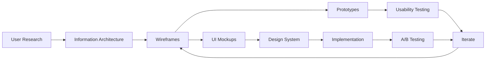

# UX/UI Design — Overview

> *Purpose: A practical guide to the UX/UI design process — from user research through wireframes, prototypes, mockups, to usability testing and A/B testing.*

## The Design Process

## The Four Phases

| Phase | Focus | Key Deliverables |
|---|---|---|
| 🔍 **Research** | Understand users, needs, behaviors | Personas, journey maps, research reports |
| 📐 **UX Design** | Structure, flow, information architecture | Wireframes, prototypes, user flows |
| 🎨 **UI Design** | Visual design, components, systems | Mockups, design systems, style guides |
| 🧪 **Testing & Iteration** | Validate with real users | Usability tests, A/B tests, analytics |

## Files in This Folder

| File | Focus |
|---|---|
| [[30 User Research Methods]] | Interviews, surveys, personas, journey maps, contextual inquiry |
| [[31 UX Design Process]] | Information architecture, wireframes, prototypes, user flows |
| [[32 UI Design Process]] | Visual design, mockups, design systems, component libraries |
| [[33 Usability Testing and AB Testing]] | Usability tests, A/B testing, analytics, iteration |
| [[UX UI Essential Documents]] | Document checklist by phase (similar to BOK essential docs) |

## How UX/UI Relates to Other Disciplines

| Discipline | UX/UI Connection |
|---|---|
| **BABOK** (Business Analysis) | Requirements → User Stories → Wireframes |
| **SWEBOK** (Software Engineering) | UI specs → Frontend implementation → Testing |
| **PMBOK** (Project Management) | Design sprints, stakeholder management |
| **SEBOK** (Systems Engineering) | Human-system interface design |
| **Lean/Agile** | Iterative design, MVP, continuous feedback |

## Quick Decision Guide

| Your Situation | Start Here |
|---|---|
| New project, need to understand users | **User Research** |
| Have requirements, need to design the interface | **UX Design** |
| Have wireframes, need visual polish | **UI Design** |
| Have a design, need to validate it | **Testing** |
| Need a complete design process | Start with Research → UX → UI → Test |

## UX vs UI — What's the Difference?

| Aspect | UX (User Experience) | UI (User Interface) |
|---|---|---|
| **Focus** | How it works | How it looks |
| **Concerns** | Usability, flow, structure | Visual design, aesthetics, branding |
| **Deliverables** | Wireframes, prototypes, user flows | Mockups, design systems, style guides |
| **Research** | User needs, behaviors, pain points | Visual trends, brand consistency |
| **Testing** | Usability testing, task analysis | Visual inspection, accessibility |
| **Tools** | Figma (wireframes), Miro, UserTesting | Figma (UI), Sketch, Adobe XD |

**UX comes first.** You can't design beautiful interfaces if you don't know what users need. UI without UX is just decoration.

## Related

- [[Software Methodology - Overview|Software Methodology]] — Agile/Lean processes that include design
- [[Essential Documents - Overview|Essential Documents]] — Document checklists for all disciplines
- [[Body of Knowledge - Overview|Body of Knowledge]] — Full BOK vaults
