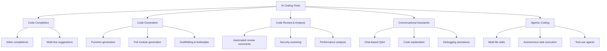
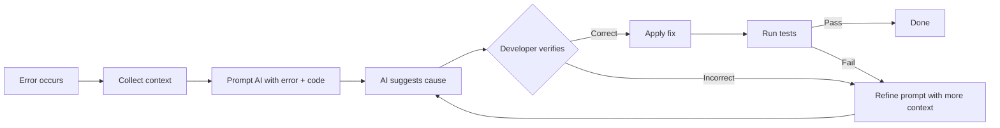
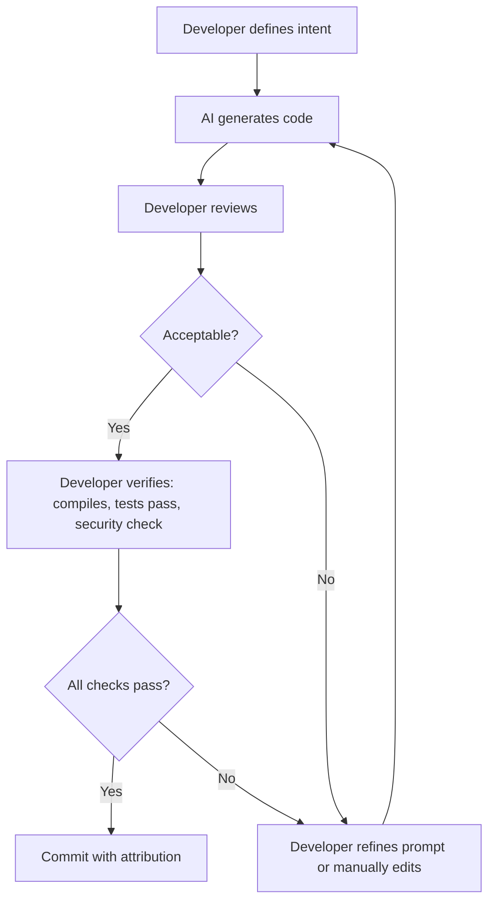
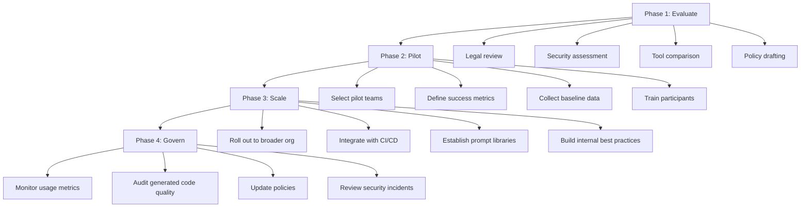

# 12. AI-Assisted Programming

> **SWEBOK v4 KA 4.5**: Software Construction Activities — including modern tools and practices that augment the construction process with artificial intelligence.

AI-assisted programming represents a paradigm shift in how software is constructed. Rather than replacing the developer, current AI tools act as intelligent collaborators that accelerate code writing, review, testing, and debugging. This note covers the landscape of AI coding tools, their capabilities, limitations, and responsible adoption practices.

---

## 1. The AI Coding Landscape

### 1.1 Evolution of Developer Assistance

The history of developer tooling shows a steady progression toward higher levels of abstraction and automation:

| Era | Capability | Example Tools |
|-----|-----------|---------------|
| 1960s–1980s | Syntax highlighting, basic autocomplete | IDE editors |
| 1990s–2000s | Intelligent code completion, refactoring | Eclipse, IntelliJ IDEA |
| 2010s | Pattern-based completion, linters | Kite, TabNine (statistical) |
| 2020s | LLM-powered generation and conversation | GitHub Copilot, ChatGPT, Claude, Cursor |
| 2025+ | Agentic coding, multi-file orchestration | Cursor Composer, Devin, Claude Code |

The leap from statistical completion to large language model (LLM) generation fundamentally changed what "autocomplete" means: instead of completing the next token or function name, modern tools can generate entire functions, classes, test suites, and architectural scaffolding from natural language descriptions.

### 1.2 Categories of AI Coding Tools

| Category | Primary Function | Example Tools |
|----------|-----------------|---------------|
| **Inline Completion** | Predict and insert next code tokens as developer types | GitHub Copilot, Codeium, Supermaven |
| **Code Generation** | Generate functions, classes, or modules from natural language prompts | ChatGPT, Claude, Amazon CodeWhisperer |
| **Code Review** | Automated PR review, bug detection, style enforcement | CodeRabbit, Codacy AI, Sourcery |
| **Conversational** | Interactive Q&A about code, architecture, debugging | ChatGPT, Claude, Gemini |
| **Agentic/IDE** | Autonomous multi-step coding with tool use | Cursor, Windsurf, Claude Code, GitHub Copilot Workspace |

---

## 2. AI Code Completion vs. Code Generation

### 2.1 Code Completion

Code completion operates in the editor flow: the AI observes context (current file, open tabs, imports) and suggests the next lines or tokens. The developer remains in control, accepting or rejecting each suggestion.

**Characteristics:**
- Low latency (sub-second response)
- Contextual to the current file and cursor position
- Developer validates every suggestion before committing
- Works best for repetitive patterns, boilerplate, and standard idioms
- Typically uses smaller, faster models fine-tuned for code

**Effective use cases:**
- Writing getter/setter methods
- Implementing standard interface methods (toString, equals, hashCode)
- Completing test case patterns
- Writing CRUD operations
- Finishing loop bodies and conditional blocks

### 2.2 Code Generation

Code generation operates at a higher level: the developer describes intent in natural language, and the AI produces complete code artifacts.

**Characteristics:**
- Higher latency (seconds to minutes)
- Requires prompt engineering skill
- Output often requires review and modification
- Can produce entire files or multi-file scaffolds
- Uses larger, more capable models

**Effective use cases:**
- Prototyping new features or APIs
- Generating boilerplate project structures
- Writing utility functions from specifications
- Creating data transformation pipelines
- Building unit test suites from function signatures

### 2.3 Comparison Matrix

| Dimension | Code Completion | Code Generation |
|-----------|----------------|-----------------|
| Granularity | Tokens to lines | Functions to modules |
| Developer role | Gatekeeper (accept/reject) | Reviewer (evaluate/modify) |
| Context needed | Current file + open tabs | Natural language spec + codebase |
| Latency | Sub-second | Seconds to minutes |
| Risk of error | Lower (small suggestions) | Higher (larger output) |
| Skill required | Minimal | Prompt engineering |
| Productivity gain | 10-30% estimated | 30-80% for suitable tasks |

---

## 3. Prompt Engineering for Code

Effective use of AI coding tools requires skill in prompt engineering: the art of communicating intent clearly enough that the AI produces useful output.

### 3.1 Core Prompt Strategies

1. **Be specific about the task**: "Write a Python function that validates email addresses using regex" is better than "email validator"
2. **Provide context**: Include relevant types, interfaces, and constraints
3. **Specify the language and framework**: "Using Express.js with TypeScript and Prisma ORM"
4. **Include examples**: Show input/output pairs for data transformation tasks
5. **State constraints**: "Must handle null inputs gracefully", "O(n log n) time complexity required"
6. **Iterate and refine**: Treat the first output as a draft, not a final product

### 3.2 Prompt Patterns for Construction

| Pattern | Example Prompt | Use Case |
|---------|---------------|----------|
| **Specification** | "Create a REST API endpoint that accepts JSON with fields X, Y, validates them, and stores in PostgreSQL" | New feature implementation |
| **Refactoring** | "Refactor this function to use the Strategy pattern, extracting each case into a separate class" | Code improvement |
| **Translation** | "Convert this Java class to equivalent Kotlin with idiomatic style" | Language migration |
| **Testing** | "Write comprehensive unit tests for this function covering edge cases, null inputs, and boundary conditions" | Test generation |
| **Debugging** | "This function throws NullPointerException on line 42 when input is empty. Explain the root cause and fix it" | Bug resolution |
| **Documentation** | "Generate JSDoc comments for all public methods in this class, including @param and @return tags" | Documentation |

### 3.3 Context Window Management

Modern LLMs have context windows ranging from 128K to 1M+ tokens, but effective context management remains important:

- **Relevant context**: Include the files directly related to the task
- **Type definitions**: Always include interfaces and type definitions the AI must respect
- **Existing patterns**: Show examples of how similar code is written in the codebase
- **Constraints**: Include coding standards, naming conventions, architectural rules
- **Exclude noise**: Remove irrelevant files that waste context window space

---

## 4. AI Pair Programming

### 4.1 The AI Pair Programming Model

Traditional pair programming involves two developers: one writes code (driver), the other reviews and thinks strategically (navigator). AI pair programming adapts this model:

| Role | Traditional Pair | AI Pair |
|------|-----------------|---------|
| **Driver** | Developer A types code | AI generates code |
| **Navigator** | Developer B reviews, suggests | Developer reviews AI output, provides direction |
| **Feedback loop** | Verbal, immediate | Iterative prompts, developer corrections |
| **Switch** | Time-boxed rotations | Developer initiates new requests |

### 4.2 Benefits of AI Pair Programming

- **24/7 availability**: The AI partner is always available, no scheduling needed
- **No ego**: The AI does not get defensive about code criticism
- **Broad knowledge**: Exposure to patterns and solutions across many languages and domains
- **Patient explanation**: Will explain concepts as many times as needed
- **No context switching cost**: Can discuss code without pulling a human colleague out of their flow

### 4.3 Limitations vs. Human Pair Programming

- **No domain expertise**: AI lacks understanding of the specific business context
- **No architectural judgment**: Cannot make long-term design trade-off decisions
- **No accountability**: Cannot own a codebase or make commitments
- **No creativity**: Generates statistically likely patterns, not novel solutions
- **No social learning**: Does not build team culture or shared understanding

See also: [[02_Design_in_Construction]] for design judgment that AI cannot replace.

---

## 5. AI-Assisted Debugging

### 5.1 Debugging Workflow with AI

### 5.2 Effective Debugging Prompts

- **Include the full stack trace**, not just the error message
- **Show the relevant code**, not just the line that crashes
- **Describe expected vs. actual behavior**
- **Mention recent changes** that might have introduced the bug
- **Include environment details** when relevant (OS, runtime version, dependencies)

### 5.3 AI Debugging Capabilities

| Capability | Effectiveness | Notes |
|-----------|--------------|-------|
| Stack trace analysis | High | Excellent at matching errors to common causes |
| Logic error detection | Medium | Can miss subtle business logic bugs |
| Race condition analysis | Low-Medium | Understands patterns but may miss timing specifics |
| Memory leak detection | Medium | Can identify common patterns (closures, event listeners) |
| Performance profiling | Low | Cannot run the actual code; suggests common bottlenecks |
| Security vulnerability detection | Medium-High | Good at known vulnerability patterns |

---

## 6. AI for Test Generation

### 6.1 Test Generation Strategies

AI can generate tests at multiple levels:

| Test Level | AI Capability | Quality Expectation |
|-----------|--------------|-------------------|
| **Unit tests** | High | Good coverage of happy path; may miss domain-specific edge cases |
| **Integration tests** | Medium | Needs clear API contracts and mock specifications |
| **Property-based tests** | Medium | Can generate from property descriptions |
| **Fuzzing inputs** | Medium | Good at generating boundary values |
| **E2E tests** | Low-Medium | Needs detailed user flow specifications |

### 6.2 Best Practices for AI Test Generation

1. **Provide the function signature and docstring** as context
2. **Specify the testing framework** (Jest, pytest, JUnit, etc.)
3. **Request specific coverage**: "Test edge cases for null, empty string, and very large inputs"
4. **Always review generated tests**: AI may write tests that pass but don't actually verify correct behavior (tautological tests)
5. **Use AI to augment, not replace**: Generate initial test suites with AI, then add domain-specific tests manually

See also: [[07_Code_Quality_and_Testing]] for comprehensive testing practices.

### 6.3 Risks of AI-Generated Tests

- **False confidence**: Tests that pass but don't test the right thing
- **Missing domain edge cases**: AI doesn't know that your business closes on bank holidays
- **Overfitting to implementation**: Tests that match the code's logic rather than its specification
- **Snapshot proliferation**: AI may generate excessive snapshot tests that mask real changes

---

## 7. AI Code Review

### 7.1 Automated AI Code Review

AI-powered code review tools integrate into pull request workflows:

| Tool | Integration | Capabilities |
|------|------------|-------------|
| CodeRabbit | GitHub, GitLab | PR summaries, inline comments, code suggestions |
| Sourcery | GitHub | Refactoring suggestions, code quality metrics |
| Codacy AI | GitHub, Bitbucket | Security, style, complexity analysis |
| Amazon CodeGuru | AWS CodeCommit, GitHub | Performance and security recommendations |
| Qodo (CodiumAI) | GitHub, GitLab | PR review, test generation |

### 7.2 What AI Review Catches Well

- **Style violations**: Inconsistent naming, formatting, import ordering
- **Common bugs**: Null pointer risks, resource leaks, off-by-one errors
- **Security patterns**: SQL injection, XSS, hardcoded credentials
- **Documentation gaps**: Missing docstrings, outdated comments
- **Complexity issues**: Functions that are too long or deeply nested

### 7.3 What AI Review Misses

- **Architectural consistency**: Whether the change aligns with the system's design philosophy
- **Business logic correctness**: Whether the code does what the business requires
- **Performance in context**: Whether the change will cause problems under actual production load
- **Team conventions**: Unwritten agreements about how things are done
- **Strategic trade-offs**: Whether a quick fix or proper solution is more appropriate

See also: [[10_Code_Style_and_Documentation]] for code review standards.

---

## 8. Limitations and Risks

### 8.1 Hallucinated APIs and Libraries

LLMs generate code based on statistical patterns from training data. This can lead to:

- **Fabricated API methods**: `array.sortByProperty('name')` when no such method exists
- **Non-existent libraries**: `import { useMagicState } from 'react-magic-hooks'`
- **Outdated syntax**: Generating code for older API versions
- **Incorrect function signatures**: Wrong parameter order or missing required parameters

**Mitigation strategies:**
- Always verify generated code compiles and runs
- Check that imported libraries exist and have the referenced APIs
- Use IDE features to validate imports and type signatures
- Maintain an internal knowledge base of approved libraries

### 8.2 Security Vulnerabilities

AI-generated code can introduce security risks:

| Risk | Example | Mitigation |
|------|---------|-----------|
| SQL injection | String concatenation in queries | Use parameterized queries; review all DB access |
| Hardcoded credentials | API keys in source code | Use environment variables; scan with secret detectors |
| Insecure defaults | `verify=False` in HTTP clients | Enforce security linters; mandatory security review |
| Path traversal | Unsanitized file path inputs | Validate and sanitize all file operations |
| Deserialization attacks | `pickle.loads()` on untrusted data | Use safe serialization formats; validate inputs |
| Dependency vulnerabilities | Using packages with known CVEs | Automated dependency scanning in CI |

### 8.3 License Compliance

AI models are trained on code from diverse sources with various licenses:

- **Copyleft contamination**: AI may suggest GPL-licensed code into a proprietary project
- **License attribution**: Generated code may not include required attribution notices
- **Unknown provenance**: Difficult to determine if generated code is original or memorized from training data
- **Legal uncertainty**: The legal status of AI-generated code varies by jurisdiction

**Organizational response:**
- Use license scanning tools (FOSSA, Snyk, Black Duck) on all AI-generated code
- Establish policies for acceptable licenses in generated code
- Maintain an approved snippet library
- Document AI usage in source code for legal audit trails

### 8.4 Bias in Generated Code

AI models inherit biases from their training data:

- **Language bias**: Better support for popular languages (Python, JavaScript) than niche ones (Rust, Haskell, COBOL)
- **Pattern bias**: Favors common patterns even when a domain-specific pattern is more appropriate
- **Stack bias**: Recommends popular frameworks even when simpler solutions exist
- **Recency bias**: May suggest newer APIs that lack ecosystem maturity

### 8.5 Technical Debt Amplification

Without proper governance, AI can accelerate technical debt:

- **Volume over quality**: Easy to generate large amounts of mediocre code
- **Copy-paste culture**: AI suggestions can encourage duplication over abstraction
- **False productivity**: Lines of code generated is not a measure of progress
- **Skill atrophy**: Over-reliance may erode developers' ability to reason about code

---

## 9. Responsible AI Coding Practices

### 9.1 The Human-in-the-Loop Principle

The most critical practice in AI-assisted programming is maintaining human oversight:

**Non-negotiable practices:**
1. **Every line of AI-generated code must be reviewed by a human** before merging
2. **All AI-generated code must pass existing test suites**
3. **Security-sensitive code (auth, payments, data access) requires manual review regardless of AI generation**
4. **AI-generated code is subject to the same quality standards as human-written code**

### 9.2 Verification Checklist

| Check | Description | Tool Support |
|-------|-------------|-------------|
| **Compiles/Lints** | Code passes static analysis | ESLint, Pylint, golangci-lint |
| **Tests pass** | Existing and new tests pass | CI/CD pipeline |
| **Types check** | Type safety verified | TypeScript, mypy, Flow |
| **Security scan** | No known vulnerabilities | Snyk, Semgrep, CodeQL |
| **License check** | No incompatible licenses | FOSSA, licensee |
| **Style conformance** | Follows team conventions | Prettier, Black, gofmt |
| **Performance** | No obvious performance regressions | Benchmarks, profiling |

### 9.3 Attribution and Transparency

Organizations should establish clear policies on AI-generated code attribution:

- **Commit messages**: Note when code was AI-assisted (e.g., `Co-authored-by: AI Assistant`)
- **Code comments**: Optionally annotate complex AI-generated sections
- **Documentation**: Disclose AI tool usage in project documentation
- **Legal compliance**: Some jurisdictions and organizations require disclosure

### 9.4 Data Privacy Considerations

| Concern | Risk | Mitigation |
|---------|------|-----------|
| **Code sent to cloud** | Proprietary code may be transmitted to AI providers | Use on-premises or private cloud models |
| **Training data leakage** | AI may memorize and reproduce training data | Review generated code for similarities to known projects |
| **PII in prompts** | Personal data in code may be sent to third parties | Sanitize inputs; use data classification |
| **Model provider policies** | Some providers use inputs for model training | Review and negotiate data processing agreements |

---

## 10. AI Coding in Enterprise Contexts

### 10.1 IP and Legal Considerations

Enterprise adoption of AI coding tools requires careful legal evaluation:

- **Ownership of generated code**: Who owns AI-generated code? (varies by jurisdiction)
- **Patent implications**: Can AI-generated inventions be patented?
- **Trade secret exposure**: Does sending code to cloud AI compromise trade secrets?
- **Contractor and vendor agreements**: How do existing IP agreements interact with AI-generated code?

### 10.2 Model Selection for Enterprise

| Criterion | Cloud API Models | Self-Hosted Models | Local/Edge Models |
|-----------|-----------------|-------------------|------------------|
| **Code quality** | Highest (GPT-4, Claude) | High (Code Llama, DeepSeek) | Medium (StarCoder, smaller models) |
| **Latency** | Network-dependent | Low (local network) | Lowest (on-device) |
| **Data privacy** | Code leaves premises | Stays on corporate infra | Stays on device |
| **Cost** | Per-token pricing | GPU infrastructure cost | Hardware cost |
| **Customization** | Limited (fine-tuning APIs) | Full control | Full control |
| **Compliance** | Depends on provider | Full compliance control | Full compliance control |

### 10.3 Enterprise Adoption Framework

### 10.4 Impact on Developer Productivity Metrics

Measuring AI's impact on productivity requires nuanced metrics:

| Metric | Traditional Measure | AI-Era Consideration |
|--------|-------------------|---------------------|
| **Lines of code** | More is better | **Meaningless** with AI; quality matters more |
| **Story points** | Velocity tracking | Points completed may inflate without real value |
| **Cycle time** | Time from start to deployed | May decrease, but review time may increase |
| **Bug rate** | Defects per KLOC | Need to distinguish AI-introduced bugs |
| **Code review time** | Time to approve PRs | May increase if reviewers must verify AI output |
| **Developer satisfaction** | Surveys | Track burnout, sense of ownership, skill development |

**Better productivity signals for AI-assisted development:**
- Time to first working prototype
- Percentage of time on creative problem-solving vs. boilerplate
- Defect escape rate (bugs found in production)
- Developer-reported confidence in code quality
- Time spent on code review vs. code generation

---

## 11. AI Coding and Software Engineering Principles

AI-assisted programming does not replace the fundamental principles covered in earlier notes. Instead, it changes how those principles are applied:

| Principle | Without AI | With AI |
|-----------|-----------|---------|
| **[[01_Construction_Foundations\|Construction Foundations]]** | Developer writes all code manually | Developer specifies intent, AI generates, developer verifies |
| **[[02_Design_in_Construction\|Design in Construction]]** | Developer makes all design decisions | AI suggests patterns; developer evaluates fitness |
| **[[03_Working_Classes\|Working Classes]]** | Developer implements class hierarchies | AI scaffolds classes; developer refines responsibilities |
| **[[04_High_Quality_Routines\|High Quality Routines]]** | Developer crafts function signatures | AI generates functions; developer validates contracts |
| **[[05_Variables_and_Data\|Variables and Data]]** | Developer manages all data structures | AI suggests structures; developer verifies correctness |
| **[[06_Control_Structures\|Control Structures]]** | Developer writes all control flow | AI generates standard patterns; developer reviews logic |
| **[[07_Code_Quality_and_Testing\|Code Quality and Testing]]** | Developer writes all tests | AI generates test scaffolds; developer adds domain tests |
| **[[08_Performance_Tuning\|Performance Tuning]]** | Developer profiles and optimizes | AI suggests optimizations; developer measures impact |
| **[[10_Code_Style_and_Documentation\|Code Style and Documentation]]** | Developer maintains all docs | AI generates docs; developer verifies accuracy |
| **[[11_Software_Craftsmanship\|Software Craftsmanship]]** | Developer builds skills through practice | Risk of skill atrophy; intentional practice still needed |

---

## 12. Future Directions

### 12.1 Emerging Trends

- **Agentic coding**: AI agents that can autonomously execute multi-step tasks (read code, run tests, make changes, verify)
- **Multi-modal coding**: Combining natural language, diagrams, screenshots, and voice as input modalities
- **Domain-specific models**: Fine-tuned models for specific frameworks, industries, or codebases
- **Continuous learning**: Models that learn from the organization's codebase and conventions
- **Formal verification integration**: AI that can prove correctness properties of generated code

### 12.2 The Evolving Developer Role

The role of the software developer is shifting from "writer of code" to:
- **Architect of intent**: Defining what should be built at higher levels of abstraction
- **Quality guardian**: Ensuring AI-generated code meets standards
- **System integrator**: Composing AI-generated components into coherent systems
- **Domain expert**: Providing the business context that AI lacks
- **Ethical steward**: Ensuring responsible use of AI in software development

---

## 13. Summary

| Topic | Key Takeaway |
|-------|-------------|
| Code completion | Augments the typing process; developer stays in control |
| Code generation | Generates larger artifacts from natural language; requires review |
| Prompt engineering | A new skill for developers; specificity and context improve results |
| AI pair programming | Available 24/7, broad knowledge, but no domain expertise |
| Debugging | Effective for common patterns; less so for timing and concurrency |
| Test generation | Good for scaffolding; must verify tests actually validate behavior |
| Code review | Catches common patterns; misses business logic and architecture |
| Risks | Hallucination, security, licensing, bias, technical debt |
| Responsible use | Human-in-the-loop, verification, attribution, privacy |
| Enterprise | Legal review, model selection, governance framework required |

> **The fundamental principle**: AI is a powerful tool for software construction, but it does not replace engineering judgment. The developer who understands [[01_Construction_Foundations|construction fundamentals]], [[02_Design_in_Construction|design principles]], and [[11_Software_Craftsmanship|craftsmanship values]] will use AI effectively. The developer who does not understand these principles will produce poor code faster.

---

## References

- SWEBOK v4, Chapter 04: Software Construction
- [[01_Construction_Foundations]] through [[11_Software_Craftsmanship]]
- [[API/API_Design_Principles]] for API construction standards
- GitHub Copilot research: "Productivity assessment of neural code completion" (2022)
- Google: "Measuring the Impact of AI on Developer Productivity" (2024)
- Microsoft: "The Impact of AI on Developer Productivity: Evidence from GitHub Copilot" (2023)
