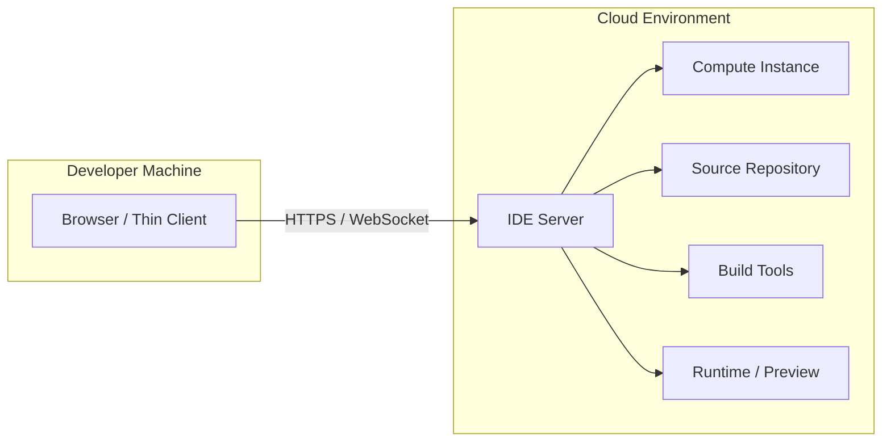
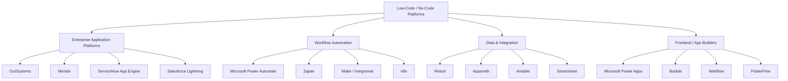
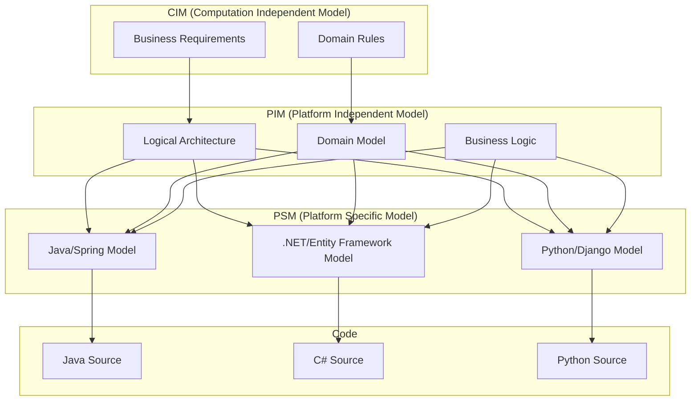
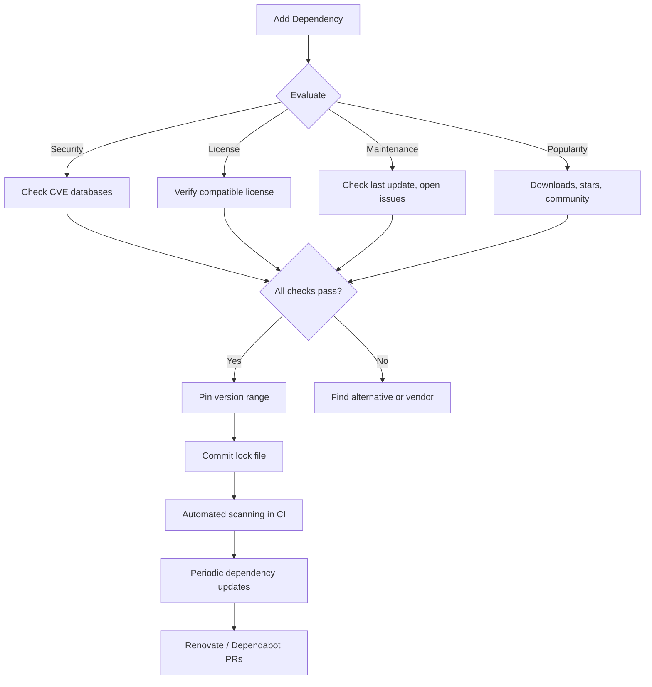
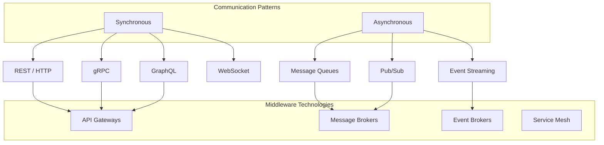
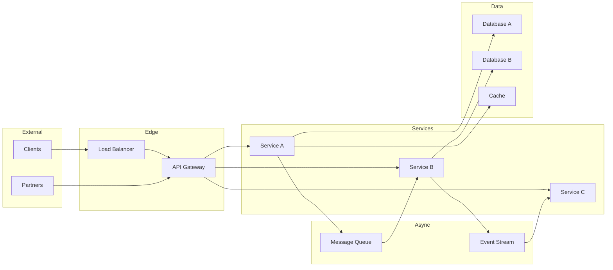
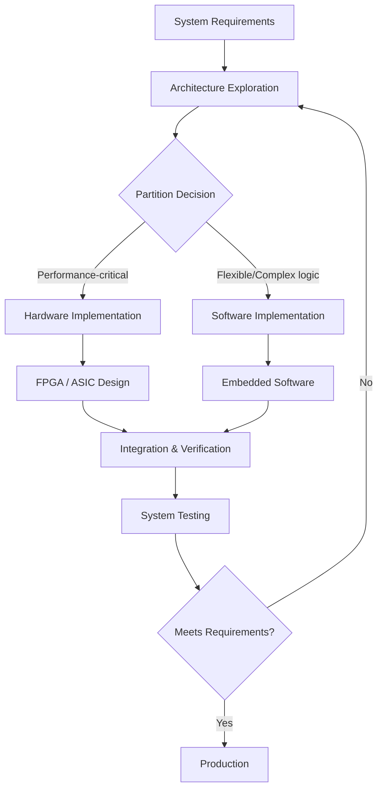

# 13. Modern Construction Technologies

> **SWEBOK v4 KA 4.4–4.5**: Software Construction Activities and Technologies — covering the evolving landscape of development environments, platforms, toolchains, and construction approaches that shape modern software engineering.

The construction phase of software engineering is no longer limited to writing code in a local IDE. Modern construction spans cloud-based development environments, containerized workflows, low-code platforms, model-driven construction, sophisticated dependency management, and middleware integration. This note covers these technologies and their implications for software construction practice.

---

## 1. Cloud-Based Development Environments

### 1.1 Overview

Cloud-based IDEs (Integrated Development Environments) move the development workspace from a local machine to a remote server. Developers access a full development environment through a browser or thin client, with computation, storage, and tooling hosted in the cloud.



### 1.2 Major Platforms

| Platform | Provider | Architecture | Key Features |
|----------|---------|-------------|-------------|
| **GitHub Codespaces** | GitHub/Microsoft | VS Code in browser + GitHub integration | Prebuilt dev containers, GitHub Actions integration, per-usage billing |
| **Gitpod** | Gitpod GmbH | Theia IDE + Docker workspaces | Git-based workspace config, prebuilds, multi-IDE support (VS Code, JetBrains) |
| **AWS Cloud9** | Amazon | AWS-hosted IDE | Direct AWS service integration, Lambda development, terminal access |
| **Replit** | Replit | Browser-native IDE | Collaborative editing, instant deployment, 50+ language support |
| **StackBlitz** | StackBlitz | WebContainers (in-browser Node.js) | Instant npm project loading, no server required for Node.js |
| **Google Cloud Workstations** | Google | Managed dev environments | VPC integration, persistent disks, customizable images |

### 1.3 Advantages of Cloud IDEs

| Advantage | Description |
|-----------|-------------|
| **Zero setup time** | New team members productive in minutes, not days |
| **Consistent environments** | Eliminates "works on my machine" problems |
| **Scalable compute** | Access powerful machines (GPU, high memory) for builds and testing |
| **Collaboration** | Real-time pair programming and shared terminals |
| **Security** | Code stays on server; developer device holds no sensitive data |
| **Device independence** | Develop from any device with a browser (tablet, Chromebook, phone) |
| **Cost efficiency** | Pay for compute only when actively developing |

### 1.4 Challenges and Trade-offs

| Challenge | Description | Mitigation |
|-----------|-------------|-----------|
| **Latency** | Network delays affect typing responsiveness | Use nearby regions; prefer thin protocols |
| **Offline work** | No access without internet | Gitpod supports local companion; maintain local fallback |
| **Vendor lock-in** | Deep integration ties to platform | Use standard dev container configs (`.devcontainer/`) |
| **Cost at scale** | Persistent environments can be expensive | Auto-shutdown policies; prebuilds reduce build time |
| **Extension limits** | Some VS Code extensions require local filesystem | Use web-compatible extensions; server-side alternatives |
| **Debugging** | Remote debugging adds complexity | Platform-specific debug adapters; SSH tunnel support |

### 1.5 Dev Containers (Development Containers)

Dev Containers provide a standardized, containerized development environment specification:

```json
{
  "name": "My Project",
  "image": "mcr.microsoft.com/devcontainers/python:3.12",
  "features": {
    "ghcr.io/devcontainers/features/node:1": { "version": "18" },
    "ghcr.io/devcontainers/features/docker-in-docker:2": {}
  },
  "postCreateCommand": "pip install -r requirements.txt",
  "customizations": {
    "vscode": {
      "extensions": [
        "ms-python.python",
        "ms-python.vscode-pylance"
      ],
      "settings": {
        "python.defaultInterpreterPath": "/usr/local/bin/python"
      }
    }
  },
  "forwardPorts": [8000, 5432],
  "postStartCommand": "echo 'Environment ready!'"
}
```

**The Dev Container Specification** (by Microsoft) enables:
- **Reproducible environments**: Same container on Codespaces, Gitpod, local VS Code, and CI
- **Team consistency**: Everyone uses the same tools, versions, and configurations
- **Onboarding acceleration**: `.devcontainer/` in the repo means instant setup
- **CI parity**: Same containers used in development and build pipelines

See also: [[09_System_Considerations]] for environment and system configuration concerns.

---

## 2. Low-Code and Zero-Code Platforms

### 2.1 Definitions

| Term | Definition | Target User |
|------|-----------|------------|
| **Low-code** | Visual development with minimal hand-coding; custom code possible | Citizen developers, professional developers |
| **Zero-code (No-code)** | Entirely visual/declarative development; no coding at all | Business users, domain experts |
| **Pro-code** | Traditional hand-coding with full control | Professional developers |

### 2.2 Platform Landscape



### 2.3 Platform Comparison

| Platform | Type | Strengths | Limitations | Best For |
|----------|------|-----------|-------------|----------|
| **OutSystems** | Enterprise low-code | Full-stack, scalable, enterprise governance | Expensive, vendor lock-in | Large enterprise apps |
| **Mendix** | Enterprise low-code | Model-driven, multi-cloud, collaboration | Learning curve for complex apps | Enterprise digital transformation |
| **Microsoft Power Apps** | Low-code | Office 365 integration, Dataverse, low cost | Limited for complex logic | Internal business apps, forms |
| **Retool** | Internal tools | Database-first, developer-friendly, flexible | Focused on internal tools | Admin panels, dashboards, CRUD |
| **Appsmith** | Internal tools (open source) | Self-hostable, extensible, free | Smaller ecosystem | Internal tools with data control |
| **Bubble** | Zero-code web apps | Full visual development, plugin ecosystem | Performance at scale, vendor lock-in | MVPs, startups, web apps |
| **Webflow** | Zero-code websites | Design precision, CMS, hosting | Limited app logic | Marketing sites, content sites |
| **Zapier** | Workflow automation | 6000+ integrations, easy to use | Limited for complex workflows | Simple automation between SaaS |

### 2.4 When to Use Low-Code

| Use Low-Code When | Use Pro-Code When |
|-------------------|-------------------|
| Standard CRUD operations | Complex algorithms or data processing |
| Internal tools and dashboards | Customer-facing products at scale |
| Rapid prototyping and MVPs | Performance-critical systems |
| Business process automation | Deep system integration requirements |
| Limited development resources | Full control over architecture needed |
| Short-lived applications | Long-lived, evolving systems |
| Standard UI patterns | Custom, pixel-perfect UI requirements |

### 2.5 Risks of Low-Code Adoption

- **Vendor lock-in**: Migrating away from a low-code platform can be extremely difficult
- **Scalability ceilings**: Performance and cost may not scale linearly
- **Shadow IT**: Business units building without IT oversight can create security and compliance risks
- **Technical debt**: Generated code may be hard to maintain or extend
- **Skill ceiling**: Complex requirements quickly hit the platform's limits
- **Integration complexity**: Connecting to legacy systems may still require custom code

### 2.6 The Professional Developer's Role

Low-code does not eliminate the need for professional developers. Instead, it changes their role:

- **Platform governance**: Setting standards for what can be built on low-code platforms
- **Integration architecture**: Designing how low-code apps connect to enterprise systems
- **Complex component development**: Building custom connectors, APIs, and components
- **Quality assurance**: Reviewing low-code applications for security, performance, and reliability
- **Platform selection**: Evaluating and recommending appropriate platforms for each use case

See also: [[01_Construction_Foundations]] for the enduring principles that apply regardless of the construction tool.

---

## 3. Model-Driven Construction

### 3.1 Model-Driven Architecture (MDA)

MDA, defined by the Object Management Group (OMG), separates the specification of system functionality from its implementation on specific platforms:



| MDA Level | Description | Example |
|-----------|-------------|---------|
| **CIM** | Business-level model, technology-agnostic | "Customers place orders for products" |
| **PIM** | Platform-independent design model | UML class diagrams, state machines, sequence diagrams |
| **PSM** | Platform-specific model | JPA entities, Entity Framework DbContext |
| **Code** | Generated implementation code | Java classes, C# classes, Python modules |

### 3.2 Executable Models and xUML

Executable UML (xUML) extends traditional UML with the goal of creating models that can be directly executed or compiled:

- **Precise semantics**: Every model element has a well-defined execution meaning
- **Action semantics**: Detailed behavior specified in a platform-independent action language
- **Translation, not generation**: Models are translated (compiled) rather than generating code templates
- **Model as source of truth**: The model IS the code, not a documentation artifact

**xUML advantages:**
- Platform independence (same model compiles to multiple targets)
- Higher abstraction level reduces defects
- Executable specifications serve as living documentation
- Enables model-level testing and simulation

**xUML challenges:**
- Tool maturity and ecosystem support
- Developer skill requirements (UML modeling expertise)
- Debugging at the model level
- Integration with existing codebases and tools
- Limited adoption compared to traditional coding

### 3.3 Domain-Specific Languages (DSLs)

DSLs are a practical form of model-driven construction:

| Type | Examples | Description |
|------|---------|-------------|
| **Internal DSLs** | Ruby DSLs, Kotlin DSLs, Scala DSLs | Hosted within a general-purpose language |
| **External DSLs** | SQL, HTML, CSS, regex, Terraform HCL | Separate language with own parser |
| **Graphical DSLs** | BPMN editors, UML tools, Stateflow | Visual modeling with code generation |

**Well-known DSLs in software construction:**

| DSL | Domain | Purpose |
|-----|--------|---------|
| **SQL** | Data queries | Declarative database operations |
| **HTML/CSS** | Web presentation | Declarative UI structure and styling |
| **Terraform HCL** | Infrastructure | Declarative infrastructure as code |
| **GraphQL** | API queries | Declarative API query language |
| **Protobuf / gRPC** | Serialization/RPC | Interface definition and code generation |
| **OpenAPI / Swagger** | REST APIs | API specification and scaffold generation |
| **YAML (CI/CD)** | Build pipelines | Declarative CI/CD configuration |

See also: [[API/API_Design_Principles]] for API specification-driven construction.

---

## 4. Dependency Management and Supply Chain Security

### 4.1 Package Managers

Modern software construction relies heavily on third-party packages managed through package managers:

| Ecosystem | Package Manager | Registry | Lock File |
|-----------|----------------|---------|-----------|
| **Java / JVM** | Maven, Gradle | Maven Central | `pom.xml` (Maven), `build.gradle` (Gradle) |
| **JavaScript / TypeScript** | npm, yarn, pnpm | npm Registry | `package-lock.json`, `yarn.lock`, `pnpm-lock.yaml` |
| **Python** | pip, Poetry, uv, PDM | PyPI | `requirements.txt`, `poetry.lock`, `uv.lock` |
| **Go** | Go modules | Go proxy (proxy.golang.org) | `go.sum` |
| **Rust** | Cargo | crates.io | `Cargo.lock` |
| **Ruby** | Bundler | RubyGems | `Gemfile.lock` |
| **C# / .NET** | NuGet | NuGet.org | `packages.lock.json` |
| **Swift** | Swift Package Manager | Swift Package Registry | `Package.resolved` |
| **PHP** | Composer | Packagist | `composer.lock` |

### 4.2 Dependency Management Best Practices



**Key practices:**
1. **Pin versions**: Use exact versions or tight ranges in production
2. **Commit lock files**: Always commit `package-lock.json`, `Cargo.lock`, etc.
3. **Minimal dependencies**: Evaluate whether a dependency is worth the supply chain risk
4. **Regular updates**: Use Renovate or Dependabot to keep dependencies current
5. **Audit dependencies**: Run `npm audit`, `pip audit`, `cargo audit` in CI
6. **Prefer well-maintained packages**: Check commit history, issue response time, maintainer count

### 4.3 Software Bill of Materials (SBOM)

An SBOM is a formal, machine-readable inventory of software components and dependencies:

| Standard | Format | Description |
|----------|--------|-------------|
| **SPDX** | RDF, JSON, YAML, tag-value | Linux Foundation standard; comprehensive metadata |
| **CycloneDX** | JSON, XML | OWASP standard; security-focused |
| **SWID Tags** | XML | ISO/IEC 19770-2; software identification |

**SBOM use cases:**
- **Vulnerability management**: Quickly identify affected components when a CVE is disclosed
- **License compliance**: Audit all transitive dependency licenses
- **Regulatory compliance**: Meet requirements (e.g., US Executive Order 14028, EU CRA)
- **Supply chain transparency**: Understand what's in your software

**SBOM generation tools:**
| Tool | Ecosystem | Method |
|------|-----------|--------|
| **Syft** | Multi-ecosystem | Scans container images and filesystems |
| **CycloneDX generators** | Per-ecosystem | Native integrations (npm, pip, maven) |
| **Microsoft SBOM Tool** | Multi-ecosystem | Build-time generation |
| **Tern** | Containers | Container image analysis |

### 4.4 Supply Chain Attacks

Software supply chain attacks target the dependency ecosystem:

| Attack Type | Description | Example |
|------------|-------------|---------|
| **Typosquatting** | Malicious packages with names similar to popular ones | `colourama` mimicking `colorama` (Python) |
| **Dependency confusion** | Malicious packages published to public registries that shadow internal package names | Alex Birsan's research (2021) |
| **Maintainer account takeover** | Compromising a package maintainer's credentials | `event-stream` incident (2018) |
| **Malicious code injection** | Injecting malicious code into legitimate packages | `ua-parser-js` compromise (2021) |
| **Build system compromise** | Attacking CI/CD systems to inject malware during builds | SolarWinds (2020) |
| **Protestware** | Maintainer intentionally adding destructive code | `node-ipc` (2022), `colors.js` (2022) |

**Defenses against supply chain attacks:**

| Defense | Description | Tools |
|---------|-------------|-------|
| **Lock files** | Pin exact dependency versions and hashes | All major package managers |
| **Signature verification** | Verify package integrity | npm provenance, Sigstore |
| **Dependency scanning** | Check for known vulnerabilities | Snyk, Dependabot, Trivy, Grype |
| **Scoped registries** | Use private registries for internal packages | Artifactory, Nexus, Verdaccio |
| **Namespace protection** | Reserve package names on public registries | npm organizations, PyPI verified |
| **SBOM monitoring** | Track dependencies and get alerts on new CVEs | Dependency-Track, Socket.dev |
| **Reproducible builds** | Ensure builds produce identical output | Nix, Bazel, deterministic build toolchains |

### 4.5 License Compliance

| License Type | Examples | Obligations | Risk Level |
|-------------|---------|-------------|-----------|
| **Permissive** | MIT, Apache-2.0, BSD | Attribution, notice preservation | Low |
| **Weak copyleft** | LGPL, MPL-2.0 | Modifications to the library must be shared | Medium |
| **Strong copyleft** | GPL-2.0, GPL-3.0 | Derivative works must be GPL-licensed | High (for proprietary) |
| **Network copyleft** | AGPL-3.0 | Source must be available to network users | Very High |
| **Creative Commons** | CC-BY, CC-BY-SA, CC0 | Attribution, share-alike (not recommended for code) | Variable |

**License compliance tools:**
- **FOSSA**: Enterprise license compliance scanning
- **licensee** (GitHub): Detects licenses in repositories
- **REUSE** (FSFE): Ensures every file has license information
- **ScanCode Toolkit**: Comprehensive license detection

---

## 5. Middleware and Integration Technologies

### 5.1 Integration Patterns

Modern software construction involves connecting disparate systems through various middleware technologies:



### 5.2 Message Queues and Event Brokers

| Technology | Type | Throughput | Ordering | Persistence | Best For |
|-----------|------|-----------|----------|------------|---------|
| **RabbitMQ** | Message broker | Medium | Per-queue | Durable queues | Task queues, RPC, routing |
| **Apache Kafka** | Event streaming | Very high | Per-partition | Log-based retention | Event sourcing, stream processing, high-throughput |
| **Amazon SQS** | Managed queue | High | FIFO option | Managed | AWS-native workloads |
| **Amazon SNS** | Pub/sub | High | None | At-least-once | Fan-out notifications |
| **Azure Service Bus** | Message broker | Medium-High | Sessions | Durable | Enterprise messaging |
| **Redis Streams** | In-memory streaming | Very high | Per-stream | Optional (AOF) | Real-time processing, caching |
| **NATS** | Messaging | Very high | Per-subject | JetStream | IoT, edge, microservices |
| **Apache Pulsar** | Multi-protocol | Very high | Per-partition | Tiered storage | Multi-tenant, geo-replication |

### 5.3 ESB vs. API Gateway

| Aspect | ESB (Enterprise Service Bus) | API Gateway |
|--------|------------------------------|-------------|
| **Era** | SOA (2000s) | Microservices (2010s+) |
| **Protocol** | Multi-protocol (SOAP, REST, JMS, FTP) | Primarily HTTP/REST and gRPC |
| **Intelligence** | Centralized routing, transformation, orchestration | Edge concerns: auth, rate limiting, routing |
| **Complexity** | Heavyweight, monolithic | Lightweight, focused |
| **Transformation** | Built-in message transformation (XSLT, mapping) | Minimal; services own their representations |
| **Examples** | IBM Integration Bus, MuleSoft, Oracle ESB | Kong, AWS API Gateway, Envoy, Traefik, NGINX |
| **Modern replacement** | API Gateway + Service Mesh + Event Streaming | API Gateway for north-south; Service Mesh for east-west |

**Modern integration architecture:**



### 5.4 Service Mesh

A service mesh manages service-to-service communication in microservices architectures:

| Feature | Description | Implementations |
|---------|-------------|----------------|
| **Traffic management** | Load balancing, canary deploys, traffic splitting | Istio, Linkerd, Consul Connect |
| **Security** | mTLS, authorization policies | Istio, Linkerd |
| **Observability** | Distributed tracing, metrics, logging | Istio + Jaeger, Linkerd + Prometheus |
| **Resilience** | Circuit breaking, retries, timeouts | All major meshes |

**Sidecar proxy pattern:** Each service instance gets a proxy (Envoy) that handles all network traffic, transparently adding security, observability, and traffic management without code changes.

---

## 6. Hardware/Software Co-Design for Embedded Systems

### 6.1 Co-Design Principles

Hardware/software co-design involves designing hardware and software components of a system simultaneously rather than sequentially:



### 6.2 Construction Considerations for Embedded Systems

| Concern | Description | Challenge |
|---------|-------------|-----------|
| **Resource constraints** | Limited memory, CPU, power | Every byte and cycle matters |
| **Real-time requirements** | Hard/soft deadlines | Deterministic execution needed |
| **Hardware interfaces** | GPIO, SPI, I2C, UART, CAN | Direct hardware manipulation |
| **Cross-compilation** | Build on host, run on target | Toolchain management, debugging |
| **Firmware updates** | OTA (over-the-air) updates | Reliability, rollback, partitioning |
| **Power management** | Battery-operated devices | Sleep modes, wake triggers, duty cycling |
| **Safety standards** | IEC 61508, ISO 26262, DO-178C | Certification, traceability, formal methods |

### 6.3 Embedded Development Tools

| Category | Tools | Purpose |
|----------|-------|---------|
| **RTOS** | FreeRTOS, Zephyr, ThreadX | Real-time task scheduling |
| **Frameworks** | Arduino, ESP-IDF, STM32 HAL | Hardware abstraction |
| **Build systems** | PlatformIO, CMake, Yocto/BitBake | Cross-platform embedded builds |
| **Debugging** | JTAG/SWD debuggers, logic analyzers, oscilloscopes | Hardware-level debugging |
| **Simulation** | QEMU, Renode, Proteus | Virtual hardware testing |
| **Formal verification** | CBMC, Frama-C, SPARK/Ada | Proving correctness properties |

### 6.4 Heterogeneous System Construction

Modern systems often combine multiple processing architectures:

| Component | Processor Type | Language / Framework |
|-----------|---------------|---------------------|
| **Cloud backend** | x86/ARM servers | Java, Python, Go, Node.js |
| **Edge gateway** | ARM (Raspberry Pi, Jetson) | Python, C++, Rust |
| **Embedded controller** | Microcontroller (ARM Cortex-M) | C, C++, Rust |
| **FPGA acceleration** | Programmable logic | VHDL, Verilog, SystemVerilog |
| **GPU compute** | CUDA cores | CUDA, OpenCL, Vulkan compute |
| **Mobile client** | ARM (iOS/Android) | Swift, Kotlin, Flutter |

**Cross-compilation and deployment:**
- Build pipelines must target multiple architectures
- Docker multi-architecture builds (`docker buildx`)
- CI/CD must run tests on target hardware or simulators
- Version synchronization across firmware, middleware, and cloud components

---

## 7. Construction for Heterogeneous Systems

### 7.1 Challenges of Heterogeneous Construction

| Challenge | Description |
|-----------|-------------|
| **Multiple languages** | Different components written in different languages |
| **Multiple runtimes** | Different execution environments and operating systems |
| **Communication** | Components must communicate across boundaries (IPC, RPC, messaging) |
| **Consistency** | Version management across all components |
| **Testing** | Integration testing across multiple platforms |
| **Deployment** | Coordinated deployment of heterogeneous components |
| **Monitoring** | Unified observability across diverse systems |

### 7.2 Strategies for Heterogeneous Systems

```mermaid
flowchart TD
    A[Heterogeneous System] --> B[Common Interface Standards]
    A --> C[Shared Build Infrastructure]
    A --> D[Unified Testing Strategy]
    A --> E[Coordinated Release Process]

    B --> B1[OpenAPI / gRPC for APIs]
    B --> B2[Protobuf / Avro for data formats]
    B --> B3[CloudEvents for event schemas]

    C --> C1[Monorepo or polyglot repo strategy]
    C --> C2[Docker multi-stage builds]
    C --> C3[Shared CI/CD pipelines]

    D --> D1[Contract testing (Pact)]
    D --> D2[Integration test environments]
    D --> D3[Hardware-in-the-loop testing]

    E --> E1[Version compatibility matrix]
    E --> E2[Feature flags for coordination]
    E --> E3[Canary and blue-green deployments]
```

### 7.3 API-First Construction

In heterogeneous systems, APIs become the primary construction artifact:

| Practice | Description |
|----------|-------------|
| **Design-first** | Define the API contract before implementation |
| **Contract testing** | Verify that implementations match the contract |
| **Code generation** | Generate client and server stubs from API specifications |
| **Versioning** | Explicit API versioning strategy (URL, header, or query param) |
| **Documentation** | Auto-generated from specification (Swagger UI, Redoc) |

See also: [[API/API_Design_Principles]] for detailed API construction practices.

### 7.4 Event-Driven Architecture

Event-driven architecture (EDA) is a natural fit for heterogeneous systems:

| Pattern | Description | Use Case |
|---------|-------------|---------|
| **Event notification** | Notify other systems that something happened | Decoupled microservices |
| **Event-carried state transfer** | Event contains all data needed by consumer | Reducing synchronous queries |
| **Event sourcing** | Store all state changes as events | Audit trail, temporal queries |
| **CQRS** | Separate read and write models | High-read or high-write systems |
| **Saga** | Distributed transaction via event choreography | Multi-service transactions |

---

## 8. Infrastructure as Code (IaC)

### 8.1 IaC Tools

| Tool | Type | Language | Cloud Support |
|------|------|---------|--------------|
| **Terraform / OpenTofu** | Declarative | HCL | Multi-cloud |
| **Pulumi** | Imperative/Declarative | TypeScript, Python, Go, C# | Multi-cloud |
| **AWS CDK** | Imperative | TypeScript, Python, Java, Go | AWS |
| **AWS CloudFormation** | Declarative | JSON/YAML | AWS |
| **Azure Bicep** | Declarative | Bicep DSL | Azure |
| **Google Cloud Deployment Manager** | Declarative | YAML/Jinja2 | GCP |
| **Ansible** | Declarative | YAML | Multi-cloud + on-prem |
| **Chef / Puppet** | Declarative | Ruby / DSL | Multi-cloud + on-prem |

### 8.2 IaC Best Practices

1. **Version control all infrastructure**: Treat infrastructure code like application code
2. **Immutable infrastructure**: Replace rather than modify (no SSH into servers)
3. **State management**: Secure remote state (Terraform state in S3 + DynamoDB)
4. **Module reuse**: Create reusable modules for common patterns
5. **Drift detection**: Regularly verify actual state matches declared state
6. **Security scanning**: Use tools like `tfsec`, `checkov`, `kics` to scan IaC for security issues

See also: [[09_System_Considerations]] for system-level construction concerns.

---

## 9. Containerization and Orchestration

### 9.1 Container Technologies

| Technology | Purpose | Description |
|-----------|---------|-------------|
| **Docker** | Container runtime | Package and run applications in isolated containers |
| **Podman** | Container runtime (daemonless) | Drop-in Docker replacement, rootless by default |
| **containerd** | Container runtime (low-level) | Industry-standard runtime used by Docker and K8s |
| **Buildah** | Image building | Build OCI images without a daemon |
| **Kaniko** | Image building (in K8s) | Build images in Kubernetes without Docker daemon |

### 9.2 Multi-Stage Docker Builds

Multi-stage builds keep final images small and secure:

```dockerfile
# Stage 1: Build
FROM node:20-alpine AS builder
WORKDIR /app
COPY package*.json ./
RUN npm ci --only=production
COPY . .
RUN npm run build

# Stage 2: Production
FROM node:20-alpine AS production
WORKDIR /app
RUN addgroup -g 1001 -S appgroup && adduser -S appuser -u 1001
COPY --from=builder /app/dist ./dist
COPY --from=builder /app/node_modules ./node_modules
COPY --from=builder /app/package.json ./
USER appuser
EXPOSE 3000
CMD ["node", "dist/main.js"]
```

### 9.3 Orchestration with Kubernetes

| Concept | Purpose | Example |
|---------|---------|---------|
| **Pod** | Smallest deployable unit | One or more containers sharing network/storage |
| **Deployment** | Declarative pod management | Rolling updates, replicas, rollbacks |
| **Service** | Network abstraction | Stable endpoint for pod groups |
| **Ingress** | External access | HTTP routing, TLS termination |
| **ConfigMap / Secret** | Configuration | Externalize config and credentials |
| **HorizontalPodAutoscaler** | Scaling | Auto-scale based on CPU/memory/custom metrics |
| **Helm Charts** | Package management | Templated Kubernetes manifests |

---

## 10. Build Systems and CI/CD

### 10.1 Modern Build Tools

| Ecosystem | Build Tool | Language | Key Feature |
|-----------|-----------|---------|-------------|
| **JVM** | Gradle, Maven | Groovy/Kotlin, XML | Incremental builds, plugin ecosystem |
| **JavaScript** | Vite, esbuild, Turbopack | JavaScript/Rust | Sub-second rebuilds |
| **Go** | Go build | Go | Built-in, fast compilation |
| **Rust** | Cargo | Rust/TOML | Integrated package management |
| **C/C++** | CMake, Meson, Bazel | Various | Cross-platform, complex builds |
| **Multi-ecosystem** | Bazel, Buck2, Pants | Starlark, Python | Hermetic, reproducible, distributed |
| **Multi-ecosystem** | Nx, Turborepo | JavaScript | Monorepo build orchestration |

### 10.2 CI/CD Pipeline as Construction Tool


See also: [[07_Code_Quality_and_Testing]] for testing integration in CI/CD pipelines.

---

## 11. Summary

| Technology Area | Key Insight |
|----------------|-------------|
| **Cloud IDEs** | Eliminate environment setup; enable device-independent development; trade latency for consistency |
| **Dev Containers** | Standardized, reproducible environments across local, cloud, and CI |
| **Low-Code** | Accelerates simple applications; professional developers still needed for governance and complex systems |
| **Model-Driven** | Higher abstraction through models and DSLs; practical where domain models are stable |
| **Dependency Management** | Lock files, SBOMs, and scanning are essential; supply chain security is a first-class concern |
| **Middleware** | Modern integration favors API gateways and event streaming over heavyweight ESBs |
| **Embedded/Co-Design** | Hardware/software co-design requires specialized tools and cross-compilation workflows |
| **Heterogeneous Systems** | API-first design and event-driven architecture enable multi-language, multi-platform construction |
| **IaC & Containers** | Infrastructure as code and containerization are foundational to modern construction |

> **The fundamental principle**: Modern construction technologies change HOW we build software, but the principles in [[01_Construction_Foundations|Construction Foundations]], [[02_Design_in_Construction|Design in Construction]], and [[11_Software_Craftsmanship|Software Craftsmanship]] remain the foundation. A developer who understands these principles will use any tool effectively; a developer who does not will build poorly with any tool, no matter how modern.

---

## References

- SWEBOK v4, Chapter 04: Software Construction
- [[01_Construction_Foundations]] through [[11_Software_Craftsmanship]]
- [[API/API_Design_Principles]] for API-centric construction
- Dev Container Specification: https://containers.dev
- OWASP Software Component Verification Standard (SCVS)
- US Executive Order 14028: Improving the Nation's Cybersecurity (SBOM requirements)
- NIST SP 800-218: Secure Software Development Framework (SSDF)
- OWASP CycloneDX and SPDX SBOM standards
