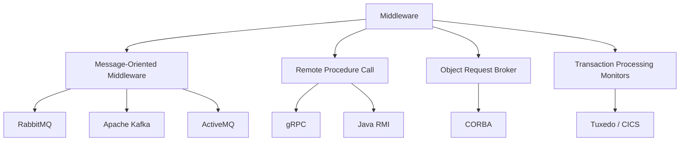
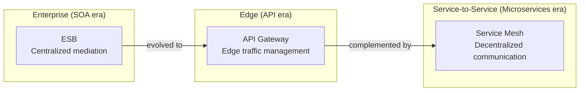
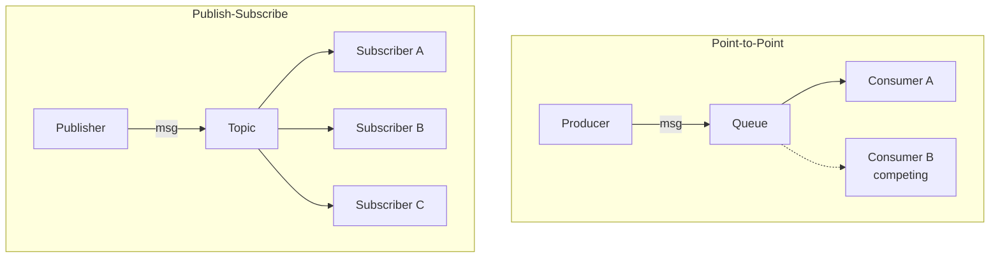
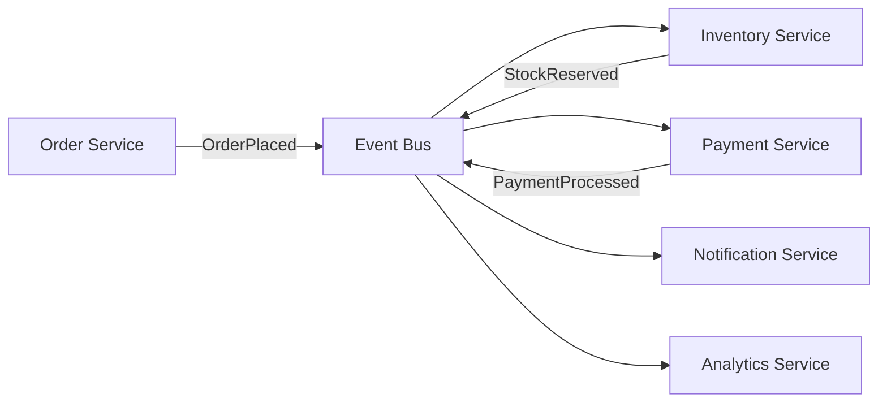
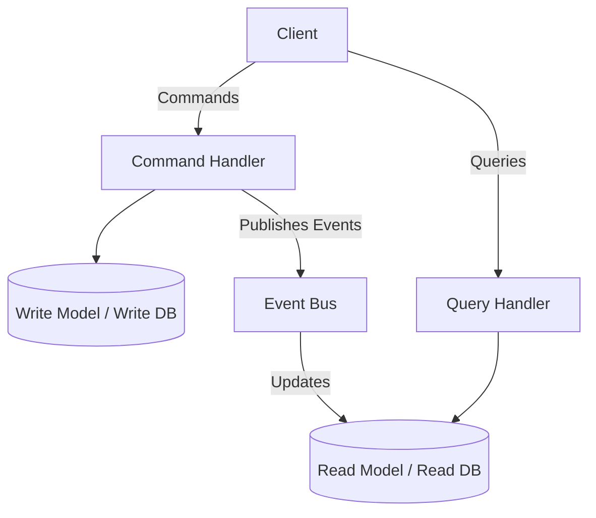
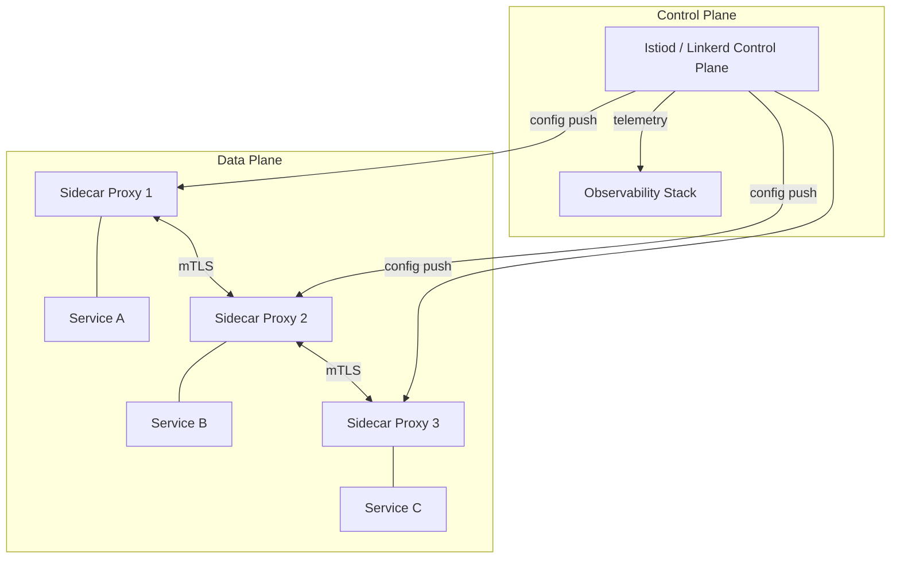
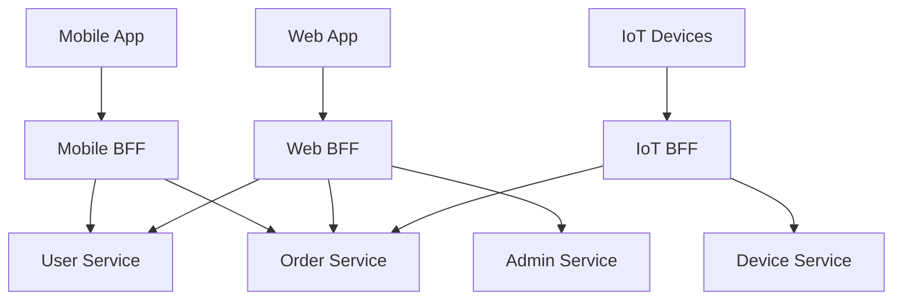
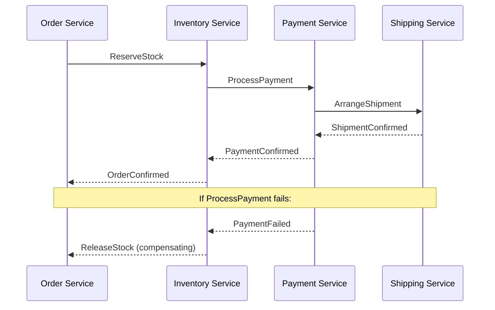

# Middleware and Integration

> **SWEBOK Reference:** Knowledge Area 4 (Software Construction), Section 4.4 — Construction for Heterogeneous, Embedded, and Distributed Systems; Middleware and Integration.

Middleware is software that sits between the operating system / network layer and the application layer, providing communication, data exchange, and coordination services across heterogeneous systems. Integration is the broader discipline of connecting disparate software components, services, and systems so they function as a coherent whole.

---

## 1 Middleware Categories



### 1.1 Message-Oriented Middleware (MOM)

MOM enables asynchronous, decoupled communication between distributed components through messages.

| System | Protocol | Pattern | Throughput | Use Case |
|--------|----------|---------|------------|----------|
| **RabbitMQ** | AMQP 0-9-1 | Exchange/Queue routing | Moderate | Enterprise messaging, task queues |
| **Apache Kafka** | Proprietary TCP | Distributed log | Very high | Event streaming, log aggregation |
| **ActiveMQ** | AMQP, STOMP, MQTT, OpenWire | Queue/Topic | Moderate | Legacy integration, JMS workloads |
| **ZeroMQ** | ZMTP (in-process, IPC, TCP) | Socket-level patterns | Very high | Low-latency, microservice sockets |
| **Amazon SQS** | HTTPS (proprietary) | Queue-based | High (managed) | Cloud-native async processing |
| **NATS** | NATS protocol | Pub/Sub, Queue Groups | Extremely high | Lightweight IoT, microservices |

#### Key MOM Concepts

- **Message:** A self-contained unit of data with headers (routing, correlation, TTL) and a body (payload).
- **Queue:** A named buffer that holds messages until a consumer retrieves them (point-to-point).
- **Topic:** A named channel to which multiple subscribers can listen (publish-subscribe).
- **Exchange (RabbitMQ):** A routing entity that receives messages from producers and routes them to queues based on bindings and routing keys.
- **Consumer Group (Kafka):** A set of consumers that cooperatively consume from a topic partition, enabling parallel processing.
- **Offset (Kafka):** A sequential ID that tracks the consumer's position in a partition log.

### 1.2 Remote Procedure Call (RPC)

RPC middleware allows a program to execute a procedure on a remote system as if it were a local call.

| System | Serialization | Transport | IDL | Key Feature |
|--------|--------------|-----------|-----|-------------|
| **gRPC** | Protocol Buffers | HTTP/2 | `.proto` files | Streaming, code generation, multiplexing |
| **Java RMI** | Java serialization | JRMP | Java interfaces | Native Java integration |
| **Apache Thrift** | Binary, JSON, compact | TCP | `.thrift` files | Multi-language support |
| **JSON-RPC** | JSON | HTTP | None | Simplicity, language-agnostic |
| **XML-RPC** | XML | HTTP | None | Legacy compatibility |

#### gRPC in Detail

```protobuf
syntax = "proto3";

service OrderService {
  rpc CreateOrder (OrderRequest) returns (OrderResponse);
  rpc StreamUpdates (OrderRequest) returns (stream OrderUpdate);
}

message OrderRequest {
  string customer_id = 1;
  repeated OrderItem items = 2;
}

message OrderResponse {
  string order_id = 1;
  string status = 2;
}
```

gRPC supports four communication patterns:
1. **Unary:** Single request, single response.
2. **Server streaming:** Single request, stream of responses.
3. **Client streaming:** Stream of requests, single response.
4. **Bidirectional streaming:** Stream of requests and responses.

### 1.3 Object Request Broker (ORB) / CORBA

CORBA (Common Object Request Broker Architecture) was defined by the OMG to enable interoperability across heterogeneous object systems.

| Component | Description |
|-----------|-------------|
| **IDL (Interface Definition Language)** | Language-neutral interface specification |
| **IIOP (Internet Inter-ORB Protocol)** | Wire protocol for ORB-to-ORB communication |
| **Object Adapter (POA)** | Manages object activation, reference generation, and method dispatch |
| **IOR (Interoperable Object Reference)** | Encoded reference containing host, port, object key |
| **CORBA Services** | Naming, Event, Transaction, Security, Persistent State |

**Status:** CORBA is largely legacy. Modern replacements include gRPC, REST/HTTP, and microservice architectures. However, CORBA's design patterns (IDL-based contracts, location transparency, language independence) persist in contemporary middleware.

### 1.4 Transaction Processing Monitors (TPM)

TPMs manage distributed transactions, ensuring ACID properties across multiple resource managers.

| System | Vendor | Use Case |
|--------|--------|----------|
| **Tuxedo** | Oracle | High-volume OLTP, legacy banking |
| **CICS** | IBM | Mainframe transaction processing |
| **Encina** | IBM (historical) | Distributed TP |

TPMs handle:
- **Connection pooling** and request routing.
- **Two-phase commit (2PC)** coordination across resource managers.
- **Load balancing** across transaction servers.
- **Recovery** and logging for crash resilience.

---

## 2 Enterprise Service Bus (ESB) vs API Gateway vs Service Mesh

These three architectural components address different integration concerns along the evolution of distributed systems.



### 2.1 Detailed Comparison

| Dimension | ESB | API Gateway | Service Mesh |
|-----------|-----|-------------|--------------|
| **Architecture** | Centralized bus | Centralized edge proxy | Decentralized sidecar proxies |
| **Primary Purpose** | Mediation, transformation, routing | API management, security, rate limiting | Service-to-service observability, traffic control |
| **Protocol Support** | Multi-protocol (SOAP, REST, JMS, FTP, JDBC) | Primarily HTTP/REST, gRPC | L4/L7 (HTTP, gRPC, TCP) |
| **Transformation** | Rich (XSLT, data mapping, enrichment) | Limited (header manipulation, response transformation) | Minimal (header manipulation) |
| **Security** | WS-Security, SAML, custom | OAuth2, API keys, JWT, mTLS | mTLS, RBAC |
| **Scaling** | Scale the bus itself | Scale edge proxies | Each service scales independently |
| **Failure Domain** | Bus failure affects all services | Gateway failure affects external traffic | Per-service isolation |
| **Examples** | MuleSoft, WSO2, IBM Integration Bus | Kong, AWS API Gateway, Apigee | Istio, Linkerd, Consul Connect |
| **Best For** | Legacy enterprise integration, protocol bridging | External API management, BFF pattern | Internal microservice communication |

### 2.2 When to Use What

- **ESB:** You have heterogeneous legacy systems needing protocol translation, complex message transformation, and centralized orchestration.
- **API Gateway:** You expose APIs to external consumers and need authentication, rate limiting, request/response transformation at the edge.
- **Service Mesh:** You have many microservices and need transparent mTLS, retries, circuit breaking, and observability without code changes.

### 2.3 Anti-Patterns

| Anti-Pattern | Component | Problem |
|--------------|-----------|---------|
| **God Bus** | ESB | All business logic in the bus; services become anemic |
| **Gateway Lock-in** | API Gateway | Business logic in gateway policies; hard to test/migrate |
| **Mesh Overkill** | Service Mesh | Deploying mesh for < 10 services; operational overhead exceeds benefit |
| **Orchestration Creep** | ESB | ESB orchestrates workflows instead of services owning their flows |

---

## 3 Message Patterns

### 3.1 Core Messaging Patterns



| Pattern | Description | Guarantees | Use Case |
|---------|-------------|------------|----------|
| **Point-to-Point** | One producer, one consumer per message. Queue holds messages. | At-least-once delivery; load balancing among competing consumers | Task distribution, work queues |
| **Publish-Subscribe** | One producer, many consumers. Topic fans out messages. | Each subscriber gets a copy | Event notification, broadcast |
| **Request-Reply** | Synchronous-over-async: request message carries a correlation ID; reply goes to a reply-to queue. | Correlation-based matching | Async RPC, sagas |
| **Fan-Out** | Single message triggers delivery to multiple destinations. | Varies (transactional or best-effort) | Cache invalidation, multi-region replication |
| **Dead Letter Queue (DLQ)** | Messages that fail processing (exceed retry count, are malformed, or expire) are routed to a dedicated queue. | No message loss; manual or automated review | Poison message handling, debugging |

### 3.2 Message Delivery Guarantees

| Guarantee | Mechanism | Trade-off |
|-----------|-----------|-----------|
| **At-most-once** | Fire and forget; no ack required | Fastest; may lose messages |
| **At-least-once** | Consumer acks after processing; redelivery on timeout | No loss; may duplicate (idempotency needed) |
| **Exactly-once** | Idempotent producers + transactional consumers + deduplication | Strongest; highest latency and complexity |

> **Note:** True exactly-once delivery is extremely difficult. Kafka achieves "effectively exactly-once" within its ecosystem via idempotent producers and transactional semantics.

### 3.3 Message Correlation Patterns

- **Correlation ID:** A unique identifier in message headers linking a reply to its original request.
- **Message Sequence:** Ordering guarantees via partition keys (Kafka) or sequence numbers.
- **Aggregator:** Collects multiple related messages and releases a single combined message when a condition is met (e.g., all parts received, or timeout).
- **Resequencer:** Reorders out-of-sequence messages before delivery.
- **Claim Check:** Stores large payloads in external storage; passes only a reference in the message to reduce broker load.

---

## 4 Integration Patterns

### 4.1 Integration Styles Comparison

| Style | Coupling | Latency | Data Consistency | Complexity | Example |
|-------|----------|---------|------------------|------------|---------|
| **File Transfer** | Loose | High (batch) | Eventually consistent | Low | ETL pipelines, nightly batch sync |
| **Shared Database** | Tight | Low | Strong (single source) | Moderate | Monolith modules, legacy ERP |
| **Remote Procedure Call** | Moderate | Low (sync) | Immediate | Moderate | gRPC microservices, SOAP web services |
| **Messaging** | Loose | Moderate | Eventually consistent | Moderate | Order processing, event notification |
| **Event-Driven** | Very loose | Low-Moderate | Eventually consistent | High | CQRS, event sourcing, saga orchestration |

### 4.2 File Transfer Integration

- Systems exchange data via files (CSV, XML, JSON, Parquet).
- Often scheduled (cron, Airflow DAGs).
- Strengths: simple, auditable, works across network boundaries.
- Weaknesses: high latency, no real-time, file format coupling.

### 4.3 Shared Database Integration

- Multiple applications read/write to the same database.
- Strengths: immediate consistency, no translation layer.
- Weaknesses: tight coupling, schema changes affect all consumers, scaling bottleneck.

### 4.4 Remote Procedure Call Integration

- Synchronous request-response over the network.
- Strengths: familiar programming model, low latency.
- Weaknesses: temporal coupling (caller blocks), cascading failures, distributed monolith risk.

### 4.5 Messaging Integration

- Asynchronous message exchange via brokers.
- Strengths: temporal decoupling, load leveling, guaranteed delivery.
- Weaknesses: eventual consistency, debugging complexity, message ordering challenges.

### 4.6 Event-Driven Integration

- Components react to events (facts about things that happened) rather than calling each other directly.



---

## 5 Event-Driven Architecture (EDA)

### 5.1 Event Sourcing

Instead of storing current state, event sourcing stores every state change as an immutable event.

| Concept | Description |
|---------|-------------|
| **Event Store** | Append-only log of domain events |
| **Projection** | Materialized view built by replaying events |
| **Snapshot** | Cached state at a point in time to avoid replaying all events |
| **Event Upcasting** | Transforming old event schemas to new versions during replay |

**Benefits:** Complete audit trail, temporal queries ("state at time T"), replay for debugging, natural fit for CQRS.

**Challenges:** Event schema evolution, eventual consistency of projections, snapshot management.

### 5.2 CQRS (Command Query Responsibility Segregation)

CQRS separates the write model (commands) from the read model (queries).



| Aspect | Write Side | Read Side |
|--------|-----------|-----------|
| **Model** | Domain-rich, normalized | Denormalized, query-optimized |
| **Database** | Relational (PostgreSQL) | Document (Elasticsearch, MongoDB) or cache (Redis) |
| **Scaling** | Scale for write throughput | Scale for read throughput independently |
| **Consistency** | Strong within aggregate | Eventually consistent |

### 5.3 Event Streaming with Kafka

| Component | Role |
|-----------|------|
| **Broker Cluster** | Stores topics across partitions; handles replication |
| **Producer** | Publishes records to topics |
| **Consumer** | Reads records from topic partitions |
| **Consumer Group** | Set of consumers sharing the partition load |
| **ZooKeeper / KRaft** | Metadata management and leader election |
| **Kafka Connect** | Source/sink connectors for external systems |
| **Kafka Streams** | Stream processing library (joins, aggregations, windowing) |
| **Schema Registry** | Manages Avro/Protobuf/JSON schemas for data contracts |

**Kafka Guarantees:**
- Messages within a partition are ordered.
- A committed message is not lost (replication factor >= 3, min.insync.replicas >= 2).
- At-least-once delivery by default; exactly-once with idempotent producers and transactions.

---

## 6 Service Mesh

### 6.1 Architecture

A service mesh provides a dedicated infrastructure layer for handling service-to-service communication. The **sidecar proxy** pattern is central: each service instance has an adjacent proxy that intercepts all network traffic.



### 6.2 Service Mesh Comparison

| Feature | Istio | Linkerd | Consul Connect |
|---------|-------|---------|----------------|
| **Proxy** | Envoy | Linkerd2-proxy (Rust) | Envoy |
| **Complexity** | High | Low | Moderate |
| **mTLS** | Yes (Citadel CA) | Yes (built-in) | Yes (Vault integration) |
| **Traffic Management** | Rich (VirtualService, DestinationRule) | Basic (TrafficSplit) | Service router/splitter |
| **Multi-cluster** | Yes | Yes | Native (WAN federation) |
| **Observability** | Kiali, Jaeger, Prometheus | Built-in dashboard, Viz | Consul dashboard |
| **Best For** | Large-scale, complex routing | Simplicity, fast adoption | Multi-runtime (VMs + K8s) |

### 6.3 Service Mesh Capabilities

| Capability | Description |
|-----------|-------------|
| **Traffic Management** | Canary releases, blue-green deploys, traffic splitting, retries, timeouts, circuit breaking |
| **Security** | mTLS between services, certificate rotation, RBAC policies, JWT validation |
| **Observability** | Distributed tracing, request-level metrics, access logs, service dependency graphs |
| **Resilience** | Automatic retries, exponential backoff, outlier detection, fault injection |

---

## 7 API Gateway

### 7.1 API Gateway Comparison

| Feature | Kong | AWS API Gateway | Apigee (Google) | Azure APIM |
|---------|------|----------------|------------------|------------|
| **Deployment** | Self-hosted or cloud | Managed (AWS) | Managed (GCP) | Managed (Azure) |
| **Protocol** | HTTP, gRPC, WebSocket | HTTP, WebSocket | HTTP, gRPC | HTTP, WebSocket, GraphQL |
| **Auth** | OAuth2, JWT, LDAP, Key Auth | IAM, Cognito, Lambda authorizer | OAuth2, SAML, API keys | OAuth2, JWT, certificates |
| **Rate Limiting** | Plugin-based | Built-in | Built-in | Built-in |
| **Plugin Ecosystem** | Rich (Lua, Go, Python) | Lambda integration | Extensions, policies | Policies (XML-based) |
| **Analytics** | Plugin (Vitals) | CloudWatch, X-Ray | Built-in analytics | Built-in analytics |

### 7.2 API Gateway Functions

| Function | Description |
|----------|-------------|
| **Request Routing** | Route requests to appropriate backend services based on path, method, headers |
| **Rate Limiting** | Throttle requests per client, per endpoint, or globally |
| **Authentication / Authorization** | Validate tokens, API keys, client certificates before forwarding |
| **Request/Response Transformation** | Header manipulation, body transformation, protocol translation |
| **Caching** | Cache responses at the gateway to reduce backend load |
| **API Versioning** | Route to different backend versions based on URL path or header |
| **Circuit Breaking** | Stop forwarding requests to failing backends |
| **Request Coalescing (BFF)** | Aggregate multiple backend calls into a single client response |

### 7.3 Backend for Frontend (BFF) Pattern



Each BFF is tailored to a specific frontend's needs, reducing over-fetching and under-fetching.

---

## 8 Cross-Cutting Integration Concerns

### 8.1 Resilience Patterns

| Pattern | Description | Implementation |
|---------|-------------|----------------|
| **Circuit Breaker** | Stop calling a failing service after N failures; half-open probe after timeout | Resilience4j, Hystrix (legacy), Istio |
| **Retry with Backoff** | Retry failed calls with exponential delay and jitter | gRPC retry policy, Istio VirtualService |
| **Bulkhead** | Isolate failures to a subset of resources (thread pools, connection pools) | Resilience4j Bulkhead, Hystrix thread pools |
| **Timeout** | Cap the maximum wait time for a response | Per-call timeout configuration |
| **Fallback** | Return a default or cached response when a call fails | Application-level implementation |

### 8.2 Data Consistency Across Services

| Approach | Consistency | Complexity | Use Case |
|----------|------------|------------|----------|
| **Two-Phase Commit (2PC)** | Strong | High | Financial transactions, legacy systems |
| **Saga Pattern** | Eventual | Moderate | Long-running business processes |
| **Outbox Pattern** | Eventual | Moderate | Reliable event publishing from services |
| **Event Sourcing** | Eventual | High | Full audit trail, temporal queries |

#### Saga Pattern

A saga is a sequence of local transactions. Each step publishes an event or message that triggers the next step. If a step fails, compensating transactions undo prior steps.



### 8.3 Observability in Distributed Systems

| Pillar | Tools | What It Captures |
|--------|-------|-----------------|
| **Metrics** | Prometheus, Grafana, Datadog | Request rate, error rate, latency percentiles (RED/USE methods) |
| **Logging** | ELK Stack, Loki, Splunk | Structured logs with correlation IDs for request tracing |
| **Tracing** | Jaeger, Zipkin, OpenTelemetry | End-to-end request flow across services; latency breakdown |

**OpenTelemetry** provides a vendor-neutral standard for traces, metrics, and logs, with SDKs for most languages.

---

## 9 Summary and Key Takeaways

| Topic | Key Insight |
|-------|-------------|
| **MOM** | Choose Kafka for streaming/logs, RabbitMQ for task routing, NATS for lightweight pub/sub |
| **RPC** | gRPC for performance and streaming; REST for simplicity and browser compatibility |
| **ESB vs Gateway vs Mesh** | ESB for legacy mediation; Gateway for edge API management; Mesh for service-to-service in microservices |
| **Message Patterns** | At-least-once is practical; exactly-once requires idempotency throughout the stack |
| **Event Sourcing + CQRS** | Powerful for audit and scalability but adds eventual consistency complexity |
| **Service Mesh** | Start with Linkerd for simplicity; adopt Istio for advanced traffic management |
| **Saga** | Preferred over 2PC for distributed transactions in microservices |

---

## Related Notes

- [[13_Construction_Technologies_and_Tools]] — Construction tools and coding practices
- [[15_Heterogeneous_and_Embedded]] — Embedded and cross-domain construction
- [[09_Software_Architecture]] — Architectural patterns including microservices
- [[11_Software_Quality]] — Quality attributes: interoperability, reliability
- [[12_Test_Process_and_Measures]] — Integration testing strategies

---

## References

1. SWEBOK v4, Chapter 4: Software Construction, Section 4.4.
2. Hohpe, G., & Woolf, B. (2003). *Enterprise Integration Patterns*. Addison-Wesley.
3. Richardson, C. (2018). *Microservices Patterns*. Manning Publications.
4. Burns, B., & Beda, J. (2019). *Kubernetes: Up and Running* (2nd ed.). O'Reilly.
5. Narkhede, N., Shapira, G., & Palino, T. (2017). *Kafka: The Definitive Guide*. O'Reilly.
6. Kleppmann, M. (2017). *Designing Data-Intensive Applications*. O'Reilly.
