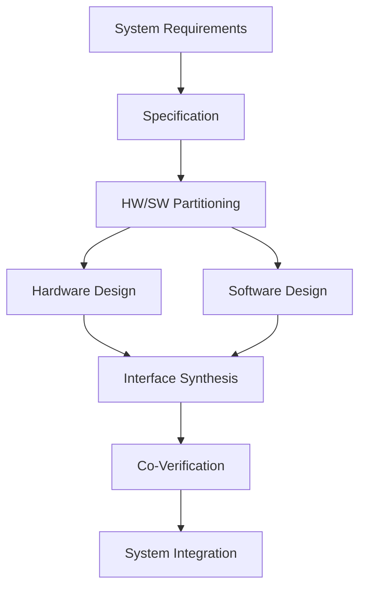
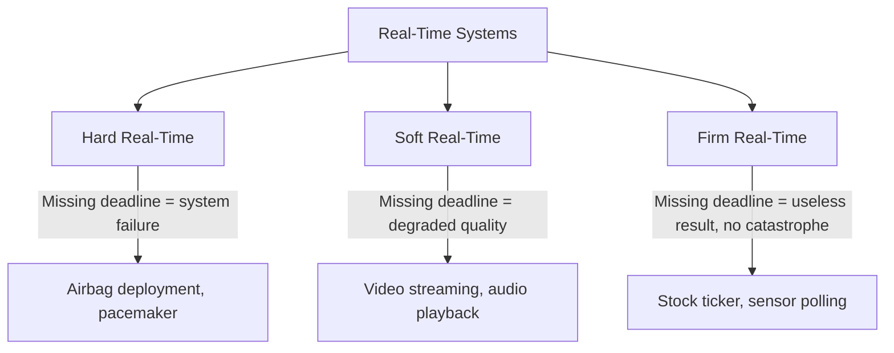
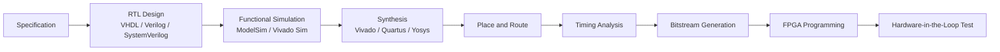
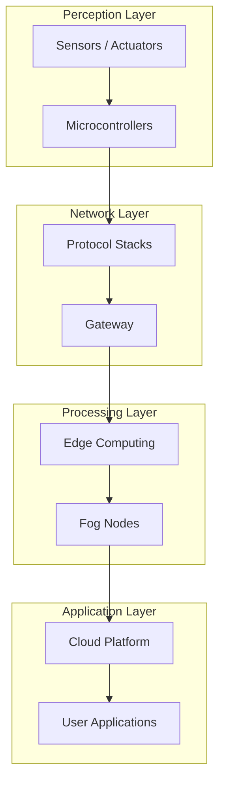
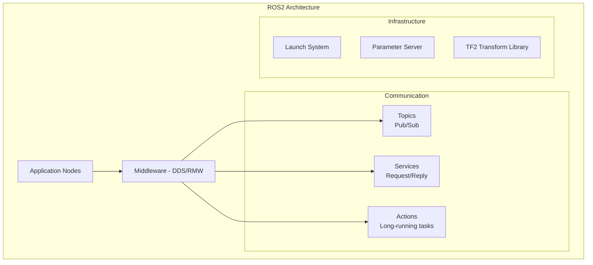
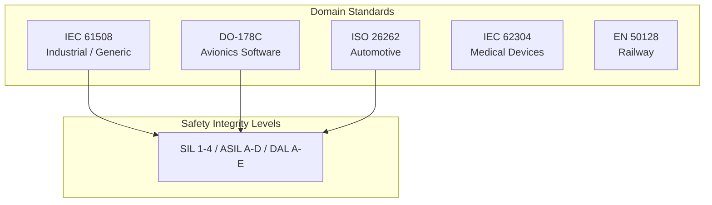
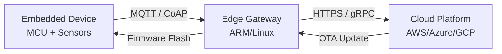

# Heterogeneous and Embedded Construction

> **SWEBOK Reference:** Knowledge Area 4 (Software Construction), Section 4.4 — Construction for Heterogeneous, Embedded, and Distributed Systems.

Heterogeneous and embedded software construction involves building systems where software interacts closely with specialized hardware, operates under resource constraints (memory, power, real-time deadlines), and often spans multiple computing platforms (MCUs, FPGAs, edge processors, cloud backends). This note covers the key domains, tools, and practices.

---

## 1 Hardware/Software Co-Design

Hardware/software co-design is the simultaneous design of hardware and software components to meet system-level requirements for performance, power, cost, and flexibility.



### 1.1 HW/SW Partitioning

| Criterion | Hardware Implementation | Software Implementation |
|-----------|----------------------|------------------------|
| **Performance** | High (parallel, custom datapath) | Lower (sequential, general-purpose) |
| **Power** | Lower for fixed functions | Higher (CPU active cycles) |
| **Flexibility** | Low (fixed at fabrication) | High (reprogrammable) |
| **Cost per unit** | Higher NRE, lower per-unit (ASIC) | Lower NRE, higher per-unit (CPU cycles) |
| **Time to market** | Longer (fabrication) | Shorter (compile and deploy) |
| **Best for** | Tight loops, DSP, cryptography, protocol offload | Control logic, UI, complex algorithms, evolving requirements |

**Partitioning algorithms:**
- **Heuristic-based:** Greedy assignment based on execution frequency and speedup ratio.
- **Graph-based:** Model task dependency as a graph; partition using min-cut or clustering.
- **Multi-objective optimization:** Use Pareto-optimal solutions considering performance, power, cost simultaneously.

### 1.2 Interface Synthesis

Once HW and SW are partitioned, the interface between them must be designed:

| Aspect | Design Decisions |
|--------|-----------------|
| **Communication Protocol** | AXI, Avalon, Wishbone (bus-based); custom FIFO; shared memory |
| **Data Width** | Match FPGA fabric (32/64-bit) to processor bus width |
| **Handshaking** | Valid/ready protocol for flow control |
| **Interrupt vs Polling** | Interrupt for latency-sensitive; polling for high-throughput |
| **DMA (Direct Memory Access)** | Offload bulk data transfer from CPU to DMA controller |

### 1.3 Co-Verification

Co-verification validates that HW and SW work correctly together before fabrication:

| Technique | Level | Speed | Fidelity |
|-----------|-------|-------|----------|
| **Software Simulation** | RTL + ISS (Instruction Set Simulator) | Slow | Cycle-accurate |
| **FPGA Prototyping** | FPGA + real SW | Fast | Near-real-time |
| **Emulation** | Hardware emulator (Palladium, ZeBu) | Moderate | Cycle-accurate |
| **Virtual Prototyping** | SystemC/TLM models | Fast | Transaction-level |

---

## 2 Embedded Systems Construction

### 2.1 Embedded System Characteristics

| Characteristic | Description |
|---------------|-------------|
| **Resource Constrained** | Limited RAM (KB to MB), flash (KB to MB), CPU cycles |
| **Real-Time** | Must meet timing deadlines deterministically |
| **Power Constrained** | Battery-powered or energy-harvesting devices |
| **Reliability** | Must run for years without reboot (watchdog timers, ECC) |
| **Direct HW Interaction** | Register manipulation, interrupt handlers, DMA |
| **No OS or RTOS** | Bare-metal or lightweight RTOS |

### 2.2 Real-Time Constraints



| Type | Deadline Consequence | Examples | Design Approach |
|------|---------------------|----------|-----------------|
| **Hard Real-Time** | Catastrophic failure | ABS braking, flight control | Worst-case analysis, rate-monotonic scheduling |
| **Firm Real-Time** | Result becomes worthless but no harm | Industrial control loop | Earliest-deadline-first, jitter analysis |
| **Soft Real-Time** | Degraded quality | Media playback | Best-effort, average-case optimization |

### 2.3 RTOS (Real-Time Operating System)

| RTOS | License | Footprint | Key Features |
|------|---------|-----------|-------------|
| **FreeRTOS** | MIT | ~6-12 KB ROM | Preemptive tasks, queues, semaphores, timers; huge ecosystem |
| **Zephyr** | Apache 2.0 | ~10-50 KB | Multi-arch, Bluetooth/WiFi stacks, device tree, west build |
| **VxWorks** | Commercial | ~20+ KB | DO-178C certifiable, POSIX API, wind river tooling |
| **QNX Neutrino** | Commercial | ~100+ KB | Microkernel, POSIX, certified for automotive (ISO 26262) |
| **ThreadX (Azure RTOS)** | MIT | ~2 KB | Deterministic, fast context switch, GUIX integration |
| **RIOT** | LGPL | ~1.5 KB | IoT-focused, Unix-like API, multi-threading |

**RTOS vs General-Purpose OS:**

| Aspect | RTOS | GPOS (Linux, Windows) |
|--------|------|----------------------|
| **Scheduling** | Priority-based preemptive, deterministic | Fair (CFS), best-effort |
| **Latency** | Bounded (microseconds) | Unbounded (milliseconds) |
| **Memory Protection** | Optional (MPU-based) | Full (MMU-based) |
| **Footprint** | KB | MB to GB |
| **Certification** | Often certifiable (DO-178C, IEC 61508) | Difficult to certify |

### 2.4 Memory Constraints

| Memory Type | Characteristics | Usage |
|------------|----------------|-------|
| **Flash** | Non-volatile, limited write cycles (~10K-100K) | Code storage, configuration |
| **SRAM** | Fast, volatile, expensive per bit | Stack, heap, data buffers |
| **EEPROM** | Non-volatile, byte-writable, slow | Calibration data, small config |
| **FRAM** | Non-volatile, fast writes, high endurance | High-write-frequency data |

**Memory management in embedded:**
- Static allocation preferred (no malloc/free fragmentation risk).
- Memory pools for fixed-size allocations.
- Stack size analysis via static tools (GCC `-fstack-usage`, IAR stack analyzer).
- Avoid dynamic allocation in hard real-time paths.

### 2.5 Power Management

| Technique | Description |
|-----------|-------------|
| **Sleep Modes** | MCU idle, standby, deep-sleep; wake via interrupt or timer |
| **Clock Gating** | Disable clock to unused peripherals |
| **Voltage Scaling** | Dynamic voltage and frequency scaling (DVFS) |
| **Peripheral Duty Cycling** | Activate sensors/transceivers only when needed |
| **Energy Harvesting** | Solar, piezoelectric, RF harvesting for ultra-low-power devices |

### 2.6 Bare-Metal Programming

When no RTOS is used, the developer manages everything directly:

```c
// Vector table, startup code, main loop
void main(void) {
    SystemInit();       // Clock, GPIO, peripheral setup
    while (1) {
        read_sensors();
        process_data();
        update_actuators();
        enter_sleep();  // Low-power wait for next interrupt
    }
}

// Interrupt Service Routine
void TIM2_IRQHandler(void) {
    TIM2->SR &= ~TIM_SR_UIF;  // Clear interrupt flag
    sensor_flag = 1;            // Signal main loop
}
```

Key concerns: interrupt latency, stack overflow detection, watchdog feeding, register-level peripheral access.

---

## 3 FPGA Development

### 3.1 FPGA Design Flow



### 3.2 HDL Languages

| Language | Standard | Strengths | Weaknesses |
|----------|----------|-----------|------------|
| **VHDL** | IEEE 1076 | Strong typing, readability, defense/aerospace | Verbose |
| **Verilog** | IEEE 1364 | Concise, widely used | Weak typing, easy to write ambiguous code |
| **SystemVerilog** | IEEE 1800 | Assertions, coverage, OOP for verification | Complex, steep learning curve |
| **Chisel** | Scala-based | Generator-based design, parameterization | Niche, requires Scala knowledge |
| **Amaranth (nMigen)** | Python-based | Python ecosystem, rapid prototyping | Limited vendor tool support |
| **Vitis HLS** | C/C++ | High-level synthesis, software engineers | Less control over hardware |

### 3.3 FPGA vs ASIC vs CPU

| Aspect | FPGA | ASIC | CPU |
|--------|------|------|-----|
| **Flexibility** | Reprogrammable | Fixed at fabrication | Fully programmable |
| **Performance** | High (parallel) | Highest | Moderate (sequential) |
| **Power** | Moderate | Lowest | Highest |
| **NRE Cost** | Low | Very high ($1M+) | None |
| **Time to Market** | Weeks | Months to years | Days |
| **Best for** | Prototyping, acceleration, low-volume | High-volume, extreme performance | General computation |

### 3.4 Hardware-in-the-Loop (HIL) Testing

HIL testing connects the FPGA design to a simulation environment that models the physical plant:

| Tool | Vendor | Description |
|------|--------|-------------|
| **Vivado ILA/VIO** | Xilinx/AMD | In-system logic analyzer and virtual I/O |
| **SignalTap** | Intel/Altera | Embedded logic analyzer |
| **MATLAB/Simulink HIL** | MathWorks | Model-based HIL with FPGA-in-the-loop |
| **cocotb** | Open-source | Python-based testbench for HDL simulation |

---

## 4 IoT Construction

### 4.1 IoT Architecture Layers



### 4.2 IoT Protocol Stacks

| Protocol | Transport | Pattern | QoS | Payload | Use Case |
|----------|-----------|---------|-----|---------|----------|
| **MQTT** | TCP | Pub/Sub via broker | 0, 1, 2 | Binary | General IoT messaging, sensor data |
| **CoAP** | UDP | Request/Response | Confirmable/Non-confirmable | Compact binary | Constrained devices, REST-like |
| **LwM2M** | CoAP or SMS | Client/Server | Per-operation | CBOR/TLV | Device management, firmware update |
| **DDS** | UDP/TCP | Pub/Sub, decentralized | 20+ levels | Binary | Real-time, industrial IoT, robotics |
| **AMQP** | TCP | Queue-based | At-least-once | Binary | Enterprise IoT, message queuing |
| **HTTP/REST** | TCP | Request/Response | N/A | JSON/XML | Non-constrained devices, web integration |
| **LoRaWAN** | LoRa (PHY) | Class A/B/C | N/A | <243 bytes | Long-range, low-power, rural IoT |
| **NB-IoT / LTE-M** | Cellular | IP-based | Carrier-managed | Variable | Wide-area IoT, asset tracking |

#### MQTT QoS Levels

| Level | Name | Mechanism | Guarantee |
|-------|------|-----------|-----------|
| **QoS 0** | At most once | Fire and forget | Message may be lost |
| **QoS 1** | At least once | PUBACK acknowledgment | Delivered at least once; may duplicate |
| **QoS 2** | Exactly once | Four-step handshake (PUBREC/PUBREL/PUBCOMP) | Delivered exactly once; highest overhead |

### 4.3 Constrained Device Operating Systems

| OS | Target | Min RAM | Min Flash | Networking | License |
|----|--------|---------|-----------|------------|---------|
| **RIOT** | 8-32 bit MCUs | ~1.5 KB | ~5 KB | IPv6/6LoWPAN, CoAP, MQTT | LGPL |
| **Contiki-NG** | 8-16 bit MCUs | ~10 KB | ~30 KB | RPL, CoAP, 6LoWPAN | BSD |
| **FreeRTOS** | 32 bit MCUs | ~1 KB | ~5 KB | FreeRTOS+TCP, MQTT | MIT |
| **Zephyr** | 16-64 bit MCUs | ~8 KB | ~16 KB | Full stack (WiFi, BLE, Thread) | Apache 2.0 |
| **TinyOS** | 8 bit MCUs | ~1 KB | ~4 KB | 6LoWPAN | BSD |
| **Mbed OS** | ARM Cortex-M | ~8 KB | ~25 KB | WiFi, BLE, LoRa, 6LoWPAN | Apache 2.0 |

### 4.4 Edge Computing Frameworks

| Framework | Description | Key Features |
|-----------|-------------|-------------|
| **AWS IoT Greengrass** | Run Lambda functions and ML models at the edge | Device shadows, OTA updates, local messaging |
| **Azure IoT Edge** | Deploy cloud workloads to edge devices | Module system, OPC-UA, offline support |
| **EdgeX Foundry** | Open-source edge computing framework | Microservices architecture, device services, export services |
| **KubeEdge** | Kubernetes-native edge computing | Cloud-edge collaboration, device twin |
| **Open Horizon** | IBM edge workload orchestration | Autonomous deployment, policy-based management |
| **LFEDGE / eKuiper** | Lightweight edge streaming SQL engine | SQL-based rules, MQTT integration |

---

## 5 Robotics Software

### 5.1 ROS/ROS2 Architecture



| Feature | ROS1 | ROS2 |
|---------|------|------|
| **Middleware** | Custom TCP/UDP (roscpp) | DDS (DDS-XRCE for micro-ROS) |
| **DDS Implementations** | N/A | FastDDS, CycloneDDS, Connext |
| **Real-Time** | No | Yes (with RT-patched kernel + DDS config) |
| **Multi-robot** | Complex | Native (DDS discovery, namespaces) |
| **Security** | None | SROS2 (DDS Security, access control) |
| **Build System** | catkin | colcon (ament_cmake, ament_python) |
| **Lifecycle** | None | Managed nodes (configure, activate, deactivate, cleanup) |
| **Embedded** | Limited | micro-ROS (FreeRTOS, Zephyr on MCUs) |

### 5.2 Sensor Fusion

| Technique | Description | Common Use |
|-----------|-------------|------------|
| **Kalman Filter** | Optimal linear state estimation | IMU + GPS fusion, object tracking |
| **Extended Kalman Filter (EKF)** | Linearization for nonlinear systems | SLAM, robot localization |
| **Unscented Kalman Filter (UKF)** | Sigma-point approach, no Jacobian needed | Highly nonlinear systems |
| **Particle Filter** | Monte Carlo sampling for state estimation | Robot localization (AMCL) |
| **Complementary Filter** | Simple frequency-domain fusion | IMU (gyro + accelerometer) |
| **Deep Sensor Fusion** | Neural network-based multi-modal fusion | Autonomous driving (camera + lidar) |

### 5.3 Actuator Control

| Control Method | Description | Application |
|---------------|-------------|-------------|
| **PID Control** | Proportional-Integral-Derivative feedback loop | Motor speed, temperature, position |
| **Model Predictive Control (MPC)** | Optimizes over a prediction horizon | Autonomous driving, drone flight |
| **Inverse Kinematics** | Compute joint angles for desired end-effector pose | Robotic arms |
| **Trajectory Planning** | Plan smooth paths through waypoints | Mobile robots, manipulation |

---

## 6 Cross-Compilation and Toolchains

### 6.1 Cross-Compilation Concepts

Cross-compilation builds code on a **host** machine (e.g., x86 Linux/Windows) for execution on a **target** machine (e.g., ARM Cortex-M, RISC-V).

| Component | Description | Examples |
|-----------|-------------|----------|
| **Compiler** | Generates target machine code | GCC ARM (`arm-none-eabi-gcc`), LLVM/Clang, IAR, Keil |
| **Linker** | Combines object files per linker script | `ld`, vendor-specific |
| **Linker Script** | Defines memory layout (flash, RAM addresses) | `.ld` files for each MCU |
| **Debugger** | Connects to target via JTAG/SWD | GDB + OpenOCD, J-Link GDB Server |
| **Flasher** | Programs binary to target flash | OpenOCD, J-Link, STM32CubeProgrammer |
| **C Runtime (CRT)** | Startup code, vector table | `crt0.o`, `startup_<mcu>.s` |
| **Standard Library** | Minimal libc for embedded (newlib-nano, picolibc) | printf, malloc, math |

### 6.2 Build Systems for Embedded

| Build System | Description | Strengths |
|-------------|-------------|-----------|
| **CMake** | Cross-platform build generator | Widely supported, IDE integration |
| **Make / GNU Make** | Traditional build tool | Simple, well-understood |
| **PlatformIO** | Embedded development ecosystem | Multi-platform, dependency management, CI integration |
| **West (Zephyr)** | Meta-tool for Zephyr RTOS | Workspace management, flash/debug integration |
| **Bazel** | Scalable build system | Reproducible builds, hermetic |
| **Meson + Ninja** | Fast build system | Speed, readability |

### 6.3 Yocto and Buildroot

| Feature | Yocto | Buildroot |
|---------|-------|-----------|
| **Approach** | Recipe-based, package-level control | Configuration-based, whole-system build |
| **Complexity** | High (steep learning curve) | Moderate (menuconfig-style) |
| **Output** | Complete Linux distribution (rootfs, kernel, bootloader) | Complete Linux image |
| **Package Management** | opkg/rpm/deb | None (fixed image) |
| **Reproducibility** | High (sstate cache) | High |
| **Best For** | Production Linux devices, complex BSPs | Simple Linux devices, prototyping |
| **Build Time** | Long (hours for clean build) | Short (minutes) |

### 6.4 Firmware Flashing Methods

| Method | Interface | Speed | Use Case |
|--------|-----------|-------|----------|
| **SWD (Serial Wire Debug)** | 2-wire (SWDIO, SWCLK) | Moderate | ARM Cortex-M programming and debugging |
| **JTAG** | 4-5 wire | Moderate | Multi-chip chaining, boundary scan |
| **UART Bootloader** | Serial (TX, RX) | Slow | Field updates, no debug probe needed |
| **USB DFU** | USB | Fast | Mass production, bootloader-based |
| **OTA (Over-the-Air)** | WiFi/BLE/Cellular | Variable | Remote field updates |
| **ISP (In-System Programming)** | SPI/I2C | Moderate | External flash, production programming |

---

## 7 Safety-Critical Construction

### 7.1 Safety Standards Overview



| Standard | Domain | Highest Level | Software Levels |
|----------|--------|--------------|-----------------|
| **DO-178C** | Avionics | DAL A (catastrophic) | DAL A through DAL E |
| **ISO 26262** | Automotive | ASIL D (life-threatening) | ASIL A through ASIL D |
| **IEC 61508** | Industrial (generic) | SIL 4 | SIL 1 through SIL 4 |
| **IEC 62304** | Medical devices | Class C (death/injury) | Class A, B, C |
| **EN 50128** | Railway | SIL 4 | SIL 0 through SIL 4 |

### 7.2 Coding Standards for Safety

| Standard | Language | Focus | Rules |
|----------|----------|-------|-------|
| **MISRA C:2012** | C | Safety-critical embedded C | ~143 rules (required, advisory, mandatory); no dynamic memory, limited pointer use |
| **MISRA C++:2023** | C++ | Safety-critical embedded C++ | Subset of C++ features; no exceptions in some levels, no RTTI |
| **CERT C/C++** | C/C++ | Security-focused | Secure coding practices; buffer overflow prevention, integer safety |
| **AUTOSAR C++14** | C++ | Automotive | Based on MISRA + AUTOSAR guidelines for modern C++ |
| **JSF AV C++** | C++ | Fighter jet (F-35) | Extremely restrictive subset; no heap allocation, no templates |

#### MISRA C:2012 Key Rule Categories

| Category | Example Rules |
|----------|--------------|
| **Standard C Environment** | Rule 1.1: Program shall contain no violations of standard C syntax |
| **Unused Code** | Rule 2.1: Dead code shall not be present |
| **Comments** | Rule 3.1: No ambiguous comment sequences (/* within /*) |
| **Character Sets** | Rule 4.1: Only escape sequences defined in standard |
| **Identifiers** | Rule 5.1: External identifiers distinct in first 31 characters |
| **Types** | Rule 6.1: Bit-fields shall only be declared with appropriate types |
| **Literals** | Rule 7.2: Unsigned integer constant should have 'u' suffix |
| **Declarations** | Rule 8.x: Storage class, scope, linkage rules |
| **Initialization** | Rule 9.x: All objects initialized before use |
| **Essential Type** | Rule 10.x: No implicit type conversions that lose information |
| **Pointer Type Conversion** | Rule 11.x: Restricted pointer casting |
| **Expressions** | Rule 12.x: Side effects evaluation order, sizeof |
| **Control Statement** | Rule 15.x: Braces required, no goto, limited switch fallthrough |
| **Switch Statements** | Rule 16.x: Default required, non-empty final clause |
| **Functions** | Rule 17.x: No recursion, parameters match prototype |
| **Pointers and Arrays** | Rule 18.x: No pointer arithmetic beyond array bounds |
| **Overlapping Storage** | Rule 19.x: Union usage restrictions |
| **Preprocessing** | Rule 20.x: Macro hygiene, include guards |
| **Standard Libraries** | Rule 21.x: Restricted stdlib functions (no malloc, no stdio in production) |
| **Resources** | Rule 22.x: Memory allocation/deallocation pairing |

### 7.3 Static Analysis for Safety

| Tool | Standards | Languages | Integration |
|------|----------|-----------|-------------|
| **Polyspace** | MISRA, CERT, CWE | C, C++ | MATLAB/Simulink, CI/CD |
| **Coverity** | MISRA, CERT | C, C++, Java, Python | CI/CD, IDE plugins |
| **Parasoft C/C++test** | MISRA, CERT, AUTOSAR | C, C++ | CI/CD, IDE |
| **LDRA** | DO-178C, IEC 61508 | C, C++, Ada | Requirements traceability |
| **PC-lint / PC-lint Plus** | MISRA | C, C++ | IDE, build integration |
| **cppcheck** | MISRA (partial) | C, C++ | CI/CD, free/open-source |
| **Helix QAC** | MISRA, CERT, AUTOSAR | C, C++ | Enterprise CI/CD |
| **Astrée** | DO-178C, IEC 61508 | C | Formal verification, no false negatives for runtime errors |

### 7.4 Safety-Critical Development Practices

| Practice | Description |
|----------|-------------|
| **MISRA Compliance** | Restrict language to safe subset; enforce with static analysis |
| **Defensive Programming** | Assert preconditions, validate inputs, handle all error paths |
| **No Dynamic Memory** | All memory allocated at compile time; no malloc/free in production code |
| **No Recursion** | Bounded call depth; static stack analysis |
| **Code Coverage** | MC/DC (Modified Condition/Decision Coverage) required at highest safety levels |
| **Formal Methods** | Model checking, theorem proving for critical algorithms |
| **Requirements Traceability** | Every requirement traced to test cases and source code |
| **Independent Verification** | Separate team verifies code against requirements |
| **Configuration Management** | Strict version control, build reproducibility, change impact analysis |

### 7.5 Safety Integrity Level and Coverage Requirements

| Level | DO-178C | ISO 26262 | MC/DC Coverage | Structural Coverage |
|-------|---------|-----------|----------------|-------------------|
| Highest | DAL A | ASIL D | Required | Statement + Branch + MC/DC |
| High | DAL B | ASIL C | Recommended | Statement + Branch |
| Medium | DAL C | ASIL B | Not required | Statement + Branch |
| Low | DAL D | ASIL A | Not required | Statement |
| Lowest | DAL E | QM | Not required | None |

---

## 8 Cross-Domain Integration Patterns

### 8.1 Cloud-to-Edge-to-Device Pipeline



### 8.2 Digital Twin Pattern

| Component | Description |
|-----------|-------------|
| **Physical Asset** | Real-world device (motor, robot, building) |
| **Digital Model** | Physics-based or ML-based simulation in the cloud |
| **Data Pipeline** | Sensor data from device to cloud model |
| **Feedback Loop** | Insights from twin applied back to device (parameter tuning, predictive maintenance) |

### 8.3 Over-the-Air (OTA) Update Architecture

| Stage | Description |
|-------|-------------|
| **Image Staging** | Build and sign firmware image in CI/CD |
| **Deployment** | Push update manifest to device management platform |
| **Notification** | Device polls or receives push notification |
| **Download** | Device downloads image (often delta/differential to save bandwidth) |
| **Verification** | Signature check, CRC/integrity verification |
| **Installation** | Write to inactive bank (A/B partitioning), mark for boot |
| **Rollback** | If boot fails (watchdog), revert to previous bank |

---

## 9 Summary and Key Takeaways

| Topic | Key Insight |
|-------|-------------|
| **HW/SW Co-Design** | Partition based on performance/power/cost trade-offs; co-verify early |
| **RTOS** | Choose based on certification needs (FreeRTOS for prototyping, VxWorks/QNX for certification) |
| **FPGA** | HDL design flow; HIL testing before fabrication; HLS for software engineers |
| **IoT Protocols** | MQTT for general IoT, CoAP for constrained devices, DDS for real-time |
| **ROS2** | DDS-based middleware, real-time capable, micro-ROS for embedded |
| **Cross-Compilation** | Toolchain = compiler + linker + debugger + flasher; Yocto for production Linux |
| **Safety-Critical** | MISRA C for safe subsets; static analysis mandatory; MC/DC at highest levels |

---

## Related Notes

- [[14_Middleware_and_Integration]] — Middleware and integration patterns
- [[13_Construction_Technologies_and_Tools]] — General construction tools
- [[08_Software_Requirements]] — Requirements for embedded and safety-critical systems
- [[09_Software_Architecture]] — Embedded and real-time architectures
- [[11_Software_Quality]] — Safety, reliability, and quality attributes

---

## References

1. SWEBOK v4, Chapter 4: Software Construction, Section 4.4.
2. MISRA C:2012 (including Amendment 2 and 3). MISRA Consortium.
3. DO-178C: Software Considerations in Airborne Systems and Equipment Certification. RTCA.
4. ISO 26262: Road Vehicles: Functional Safety. ISO.
5. IEC 61508: Functional Safety of Electrical/Electronic/Programmable Electronic Safety-Related Systems. IEC.
6. Marwedel, P. (2018). *Embedded System Design* (3rd ed.). Springer.
7. Quigley, M., et al. (2009). ROS: an open-source Robot Operating System. *ICRA Workshop*.
8. O'Kane, J. M. (2014). *A Gentle Introduction to ROS*. CreateSpace.
9. Wolf, W. (2012). *Computers as Components* (3rd ed.). Morgan Kaufmann.
