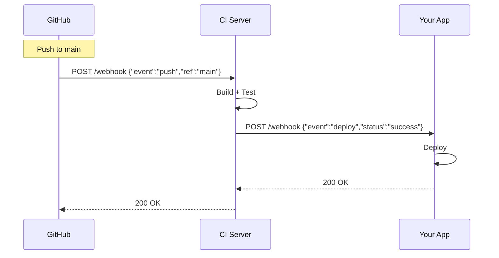

---
tags:
- api
- programming
- protocols
---

# 02 WebHook

A WebHook is a user-defined HTTP callback. Instead of polling "has anything changed?", the server calls YOUR endpoint when something happens. It's the "don't call us, we'll call you" pattern.

---

## Polling vs WebHook

```
❌ Polling:
   Your App → "Anything new?" → Their Server → "Nope."
   Your App → "Anything new?" → Their Server → "Nope."
   Your App → "Anything new?" → Their Server → "Nope."
   (wasteful, slow, rate-limited)

✅ WebHook:
   Their Server → "Event happened!" → Your App
   (instant, efficient, event-driven)
```

---

## How WebHooks Work



---

## Security — Verify the Sender

Anyone can POST to your webhook endpoint. You must verify it's actually from who you think.

### Signature Verification (HMAC)

```java
@PostMapping("/webhook/github")
public ResponseEntity<String> handleGithubWebhook(
        @RequestBody String payload,
        @RequestHeader("X-Hub-Signature-256") String signature) {
    
    // Compute expected signature
    String computed = "sha256=" + HmacUtils.hmacSha256Hex(webhookSecret, payload);
    
    if (!MessageDigest.isEqual(computed.getBytes(), signature.getBytes())) {
        return ResponseEntity.status(403).body("Invalid signature");
    }
    
    // Process the event
    processEvent(payload);
    return ResponseEntity.ok().build();
}
```

| Provider | Signature Header |
|----------|-----------------|
| GitHub | `X-Hub-Signature-256` |
| Stripe | `Stripe-Signature` |
| Slack | `X-Slack-Signature` |
| Shopify | `X-Shopify-Hmac-SHA256` |

---

## Idempotency — Handle Duplicates

WebHook providers may deliver the same event multiple times. Your handler must be idempotent.

```java
@PostMapping("/webhook/stripe")
public ResponseEntity<String> handleStripeWebhook(
        @RequestBody String payload,
        @RequestHeader("Stripe-Signature") String signature,
        @RequestHeader("X-Request-Id") String requestId) {
    
    // Already processed?
    if (eventRepository.existsByExternalId(requestId)) {
        return ResponseEntity.ok().build();  // Acknowledge, skip processing
    }
    
    Event event = constructEvent(payload, signature);
    processEvent(event);
    
    // Mark as processed
    eventRepository.save(new ProcessedEvent(requestId));
    return ResponseEntity.ok().build();
}
```

---

## Retry & Timeout

| Provider Behavior | Your Responsibility |
|------------------|-------------------|
| Retries on failure (non-2xx) | Always return 2xx quickly, process async if needed |
| Retries on timeout | Respond in < 5 seconds |
| May deliver out of order | Handle events independently (or sequence them) |
| May deliver duplicates | Be idempotent |

---

## Sources

- GitHub Webhooks — https://docs.github.com/en/webhooks
- Stripe Webhooks — https://stripe.com/docs/webhooks
