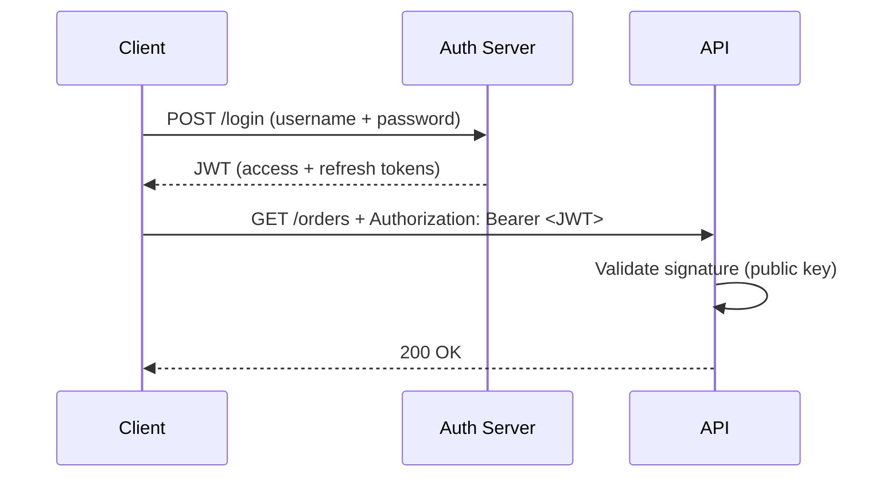
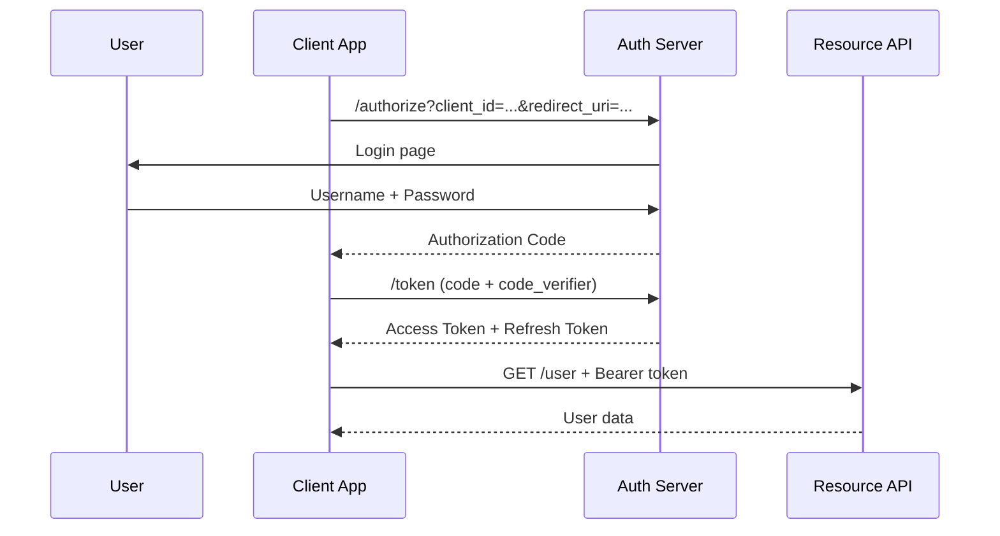

---
tags:
- api
- programming
- protocols
---

# 03 API Authentication

Authentication answers: **who are you?** Every API endpoint must know — or it must explicitly be public. This file covers JWT, OAuth2, API keys, and session vs token auth.

---

## Auth Methods Comparison

| Method | How It Works | Best For | Complexity |
|--------|-------------|----------|:----------:|
| **API Key** | Static key in header | Server-to-server, simple integrations | Low |
| **JWT** | Self-contained signed token | Stateless services, microservices | Medium |
| **OAuth2** | Delegated authorization | Third-party access, user login | High |
| **Session Cookie** | Server-side session | Monoliths, server-rendered apps | Low |
| **mTLS** | Mutual certificate verification | Zero-trust, service mesh | High |

---

## JWT (JSON Web Token)



### Token Structure

```
eyJhbGciOiJSUzI1NiJ9.eyJzdWIiOiIxMjMifQ.signature
 └── Header ────┘ └── Payload ──┘ └─ Sig ─┘

Header:  {"alg": "RS256", "typ": "JWT"}
Payload: {"sub": "123", "roles": ["customer"], "exp": 1716123456}
```

### Access Token vs Refresh Token

| | Access Token | Refresh Token |
|---|:-----------:|:------------:|
| **Lifetime** | Short (15 min) | Long (7–30 days) |
| **Used for** | API calls | Getting new access tokens |
| **Stored** | Memory (browser) | HttpOnly cookie or secure storage |
| **Revocable** | No (stateless) | Yes (server-side check) |

---

## OAuth2 Flow (Authorization Code + PKCE)



---

## API Key — Simple but Limited

```bash
curl -H "X-API-Key: sk_live_abc123" https://api.example.com/orders
```

| ✅ | ❌ |
|----|-----|
| Dead simple to implement | No user identity — just "this key has access" |
| Great for service-to-service | If leaked, anyone can use it |
| Rate limit per key | Can't expire or rotate easily |

> Use API keys for simple server-to-server calls. Use OAuth2/JWT when you need user identity, scopes, or expiration.

---

## Spring Boot + Spring Security

```java
@Configuration
@EnableWebSecurity
public class SecurityConfig {
    
    @Bean
    public SecurityFilterChain filterChain(HttpSecurity http) throws Exception {
        http
            .authorizeHttpRequests(auth -> auth
                .requestMatchers("/public/**").permitAll()
                .requestMatchers("/admin/**").hasRole("ADMIN")
                .anyRequest().authenticated()
            )
            .oauth2ResourceServer(oauth2 -> oauth2
                .jwt(Customizer.withDefaults())
            );
        return http.build();
    }
}
```

---

## Sources

- JWT — https://jwt.io/
- OAuth2 — https://oauth.net/2/
- Spring Security — https://docs.spring.io/spring-security/reference/
