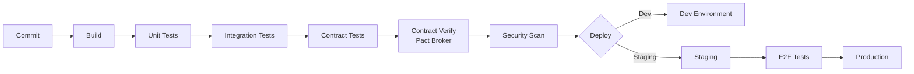

---
tags:
- api
- programming
- protocols
---

# 04 API CI/CD

APIs need testing, versioning, and deployment pipelines just like any other software. But APIs have unique challenges: contract changes break consumers, versioning is political, and rollbacks are harder when external clients depend on you.

---

## Testing Pyramid for APIs

```
        ┌──────┐
        │ E2E  │  ← Full integration: deploy, call real endpoints
       ┌┴──────┴┐
       │ Contract│ ← Consumer-Driven Contract tests (Pact, Spring Cloud Contract)
      ┌┴────────┴┐
      │ Integration│ ← Test against real DB, real dependencies
     ┌┴──────────┴┐
     │    Unit     │ ← Test business logic in isolation
     └────────────┘
```

---

## Contract Testing

Contract testing verifies that the API provider and consumer agree on the contract — without deploying both services.

```java
// Provider test (Spring Cloud Contract)
@SpringBootTest(webEnvironment = WebEnvironment.MOCK)
@AutoConfigureMockMvc
public class OrderContractTest {
    
    @Autowired
    private MockMvc mockMvc;
    
    @Test
    public void shouldReturnOrder() throws Exception {
        // Given
        given(orderService.findById("123")).willReturn(sampleOrder());
        
        // When/Then
        mockMvc.perform(get("/orders/123"))
            .andExpect(status().isOk())
            .andExpect(jsonPath("$.id").value("123"))
            .andExpect(jsonPath("$.status").value("CONFIRMED"));
    }
}
```

```groovy
// Contract definition (Groovy DSL)
Contract.make {
    request {
        method GET()
        url "/orders/123"
    }
    response {
        status 200
        body([
            id: "123",
            status: "CONFIRMED"
        ])
    }
}
```

### Pact (Consumer-Driven)

Consumer defines expectations. Provider verifies them. Both sides get fast feedback.

```
Consumer → "I expect GET /orders/123 to return {id, status}"
Provider → "I verify I can fulfill that expectation"
```

---

## API Versioning in CI/CD

| Strategy | Pipeline Approach |
|----------|------------------|
| **URL versioning** (`/v1/`, `/v2/`) | Deploy v2 alongside v1. Route traffic. Deprecate v1 later. |
| **Header versioning** | Same as URL — deploy parallel versions. |
| **No breaking changes** | GraphQL approach: add fields, deprecate old ones. No /v2/ needed. |

---

## CI/CD Pipeline



---

## Deployment Checklist

- [ ] Contract tests pass (provider + consumer)
- [ ] OpenAPI spec is valid and up-to-date
- [ ] Breaking changes documented with migration guide
- [ ] Deprecated endpoints have `Sunset` / `Deprecation` headers
- [ ] Rate limits configured and tested
- [ ] Monitoring dashboards updated for new endpoints
- [ ] Rollback plan documented

---

## Sources

- Spring Cloud Contract — https://spring.io/projects/spring-cloud-contract
- Pact — https://pact.io/
- OpenAPI Generator — https://openapi-generator.tech/
