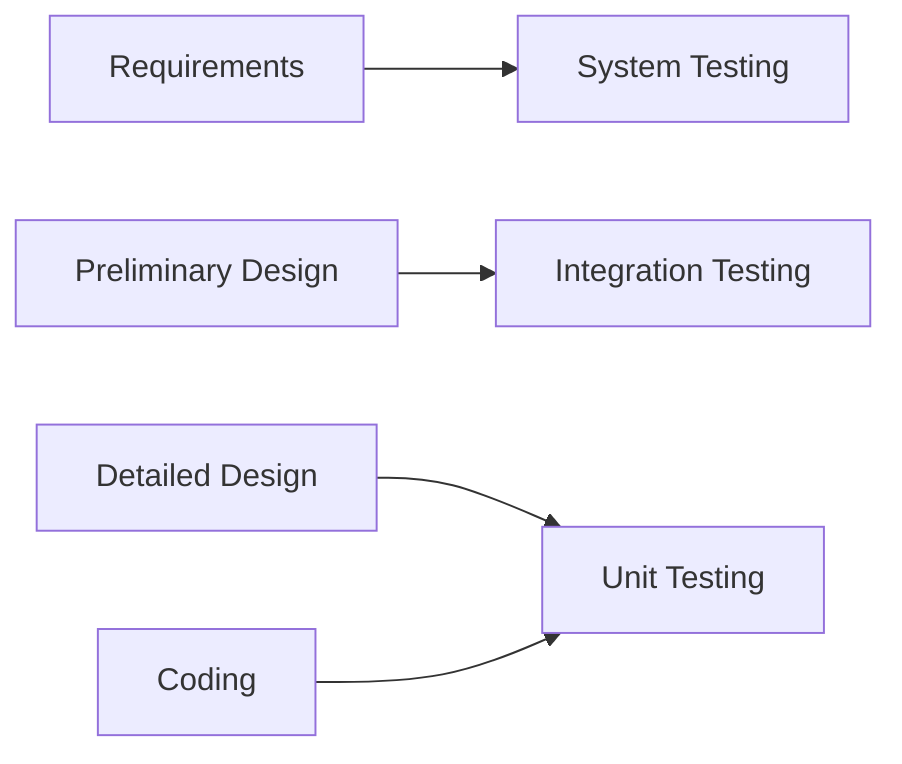
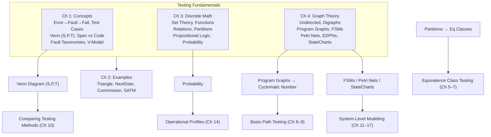

---
tags:
  - testing
  - fundamentals
  - discrete-math
  - graph-theory
  - software-testing
source: "Jorgensen, Software Testing: A Craftsman's Approach, 4th Ed., Ch 1–4"
created: 2026-07-21
---

# 01 — Testing Fundamentals

> **Source:** Jorgensen Ch 1–4: A Perspective on Testing, Examples, Discrete Math for Testers, Graph Theory for Testers.
> **Purpose:** Foundational definitions, mental models, mathematical tools, and graph-theoretic frameworks that underpin all testing methods in later chapters.

---

## 1. Core Testing Concepts (Ch 1)

### 1.1 The Error → Failure Chain

A causal trail runs through every bug:

| Term | Definition | Synonym |
|------|------------|---------|
| **Error** | A human mistake during development | Mistake |
| **Fault** | The *representation* of an error in an artifact (spec, design, code) | Defect, Bug |
| **Failure** | Incorrect behaviour when the faulty code executes | — |
| **Incident** | The symptom that alerts a user/tester to a failure | — |

Two critical subtypes:

- **Fault of Commission** — entering something incorrect into a representation.
- **Fault of Omission** — failing to enter correct information. *Harder to detect and resolve.*

> A fault may never execute, or may lie dormant for a long time. Reviews (Ch 22) can find faults of omission before they become failures.

**Testing Life Cycle** (Figure 1.1): Requirements → Design → Coding produce faults. Testing finds incidents → faults are isolated, classified, and resolved. Resolution itself can introduce *new* faults (regression).

---

### 1.2 Test Cases

A test case is a recognised work product. A complete test case contains:

1. **Identifier** — unique test case ID
2. **Purpose** — brief statement (e.g., business rule)
3. **Preconditions** — state required before execution
4. **Inputs** — actual test data
5. **Expected Outputs** — the hard part (oracle problem)
6. **Expected Postconditions** — state after execution
7. **Execution History** — date, tester, version, pass/fail

> **The Oracle Problem:** How do you know the expected output? In reference testing, expert users judge acceptability. Academically, we postulate an "oracle."

Test cases are valuable — at least as valuable as source code. They must be **developed, reviewed, used, managed, and saved.**

---

### 1.3 The Venn Diagram Model

The most powerful mental model in the book. Three sets in the universe of program behaviours:

| Set | Meaning |
|-----|---------|
| **S** | **S**pecified behaviours (what the spec says) |
| **P** | **P**rogrammed behaviours (what the code actually does) |
| **T** | **T**est cases (what we verify) |

**Two-set view (S, P):**
- S ∩ P = "correct" portion (specified AND implemented)
- S − P = faults of omission (specified but not implemented)
- P − S = faults of commission (implemented but not specified, e.g., Trojan horses)

**Three-set view (S, P, T)** — eight regions:

| Region | In S? | In P? | In T? | Meaning |
|--------|-------|-------|-------|---------|
| 1 | ✓ | ✓ | ✓ | Tested, correct behaviour |
| 2 | ✓ | ✓ | ✗ | Correct but untested |
| 3 | ✗ | ✓ | ✓ | Tested, unspecified behaviour (Trojan horse?) |
| 4 | ✓ | ✗ | ✓ | Test case for unimplemented feature |
| 5 | ✓ | ✗ | ✗ | Specified but never built or tested |
| 6 | ✗ | ✓ | ✗ | Unspecified, untested code |
| 7 | ✗ | ✗ | ✓ | Test for behaviour that is neither specified nor implemented |
| 8 | ✗ | ✗ | ✗ | Irrelevant behaviour |

> **Key Insight:** Neither specification-based nor code-based testing alone is sufficient. Spec-based testing can't find extra (unspecified) behaviours; code-based testing can't find missing (unspecified) behaviours. A **judicious combination** provides both confidence and measurement.

---

### 1.4 Two Fundamental Approaches

#### Specification-Based (Black-Box / Functional)
- Only the specification is used.
- **Advantages:** Implementation-independent (survives refactoring); can be developed in parallel with coding.
- **Disadvantages:** Redundancies and gaps among test cases.
- Methods: boundary value analysis, robustness testing, equivalence class partitioning, decision tables.

> Any program is a function mapping inputs (domain) → outputs (range). The "black box" view: inputs → [unknown internals] → outputs.

#### Code-Based (White-Box / Structural)
- The implementation source code is used.
- **Advantages:** Strong theoretical basis via graph theory; supports precise **coverage metrics**; management can measure progress.
- **Disadvantages:** Cannot detect missing behaviours; test set is bounded by what was programmed.
- Methods: statement coverage, branch coverage, path testing, data-flow testing.

> Graph theory (Ch 4) and discrete math (Ch 3) provide the theoretical foundation.

---

### 1.5 Fault Taxonomies (IEEE Std 1044)

| Category | Examples |
|----------|----------|
| **Input/Output** | Correct input rejected; incorrect input accepted; wrong format; missing/spurious result; timing errors |
| **Logic** | Missing/duplicate cases; extreme condition neglected; wrong operator (`<` vs `≤`); incorrect loop iteration; test of wrong variable |
| **Computation** | Incorrect algorithm; wrong operand/operation; parenthesis error; insufficient precision (round-off, truncation) |
| **Interface** | Incorrect interrupt handling; call to wrong/nonexistent procedure; parameter mismatch; incompatible types |
| **Data** | Incorrect initialization; wrong flag/index; scaling/units error; off-by-one; inconsistent data; incorrect subscript/type/scope |

> Fault occurrence patterns: one-time only, intermittent, recurring, or repeatable.

---

### 1.6 Levels of Testing (V-Model)

The waterfall model maps development phases to testing levels

| Level | Scope | Primary Approach |
|-------|-------|-----------------|
| **Unit** | Individual modules/classes/functions | Code-based (structural) |
| **Integration** | Interactions between units | Mixed |
| **System** | End-to-end, against requirements | Specification-based (functional) |

---

## 2. Classical Testing Examples (Ch 2)

Three unit-level examples recur throughout the book:

### Triangle Problem
- Input: three integers `a, b, c` (1 ≤ each ≤ 200).
- Must satisfy triangle inequality: `a < b + c`, `b < a + c`, `c < a + b`.
- Output: Equilateral, Isosceles, Scalene, or NotATriangle.
- Classic for boundary value and equivalence class testing.

### NextDate Function
- Input: `month, day, year`.
- Output: date of the following day.
- Complexity sources: month-length rules, leap-year logic (divisible by 4, except century years unless divisible by 400).
- Classic for decision-table testing.

### Commission Problem
- Input: locks ($45), stocks ($30), barrels ($25) sold.
- Commission: 10% up to $1000, 15% on next $800, 20% above $1800.
- Sentinel-controlled loop (telegraph convention: `locks = -1` terminates).
- Classic for data-flow and slice-based testing.

System-level examples (Ch 11–17): **SATM** (ATM), **Currency Converter** (GUI), **Saturn Windshield Wiper** (FSM), **Garage Door Controller** (system-of-systems).

---

## 3. Discrete Math for Testers (Ch 3)

### 3.1 Set Theory

- **Set:** A collection of elements. Defined by listing, decision rule, or construction from other sets.
- **Empty set (∅):** Contains no elements; unique.
- **Cardinality:** |A| = number of elements in A.
- **Universe of Discourse:** The containing set for a discussion. *Assumed universes are a common source of miscommunication.*

#### Set Operations

| Operation | Notation | Definition |
|-----------|----------|------------|
| Union | A ∪ B | {x : x ∈ A ∨ x ∈ B} |
| Intersection | A ∩ B | {x : x ∈ A ∧ x ∈ B} |
| Complement | A′ | {x : x ∉ A} |
| Relative Complement | A − B | {x : x ∈ A ∧ x ∉ B} |
| Symmetric Difference | A ⊕ B | {x : x ∈ A ⊕ x ∈ B} = (A ∪ B) − (A ∩ B) |
| Cartesian Product | A × B | {⟨x, y⟩ : x ∈ A ∧ y ∈ B} |

> |A × B| = |A| × |B| — Cartesian products grow multiplicatively, explaining why multi-variable testing generates many test cases.

#### Set Relations

| Relation | Notation | Meaning |
|----------|----------|---------|
| Subset | A ⊆ B | a ∈ A ⇒ a ∈ B |
| Proper Subset | A ⊂ B | A ⊆ B ∧ B − A ≠ ∅ |
| Equality | A = B | A ⊆ B ∧ B ⊆ A |

#### Partitions

A **partition** of A: subsets A₁, A₂, …, Aₙ such that:
1. A₁ ∪ A₂ ∪ … ∪ Aₙ = A  (completeness)
2. i ≠ j ⇒ Aᵢ ∩ Aⱼ = ∅  (non-redundancy)

> **Critical for testers:** Partitions guarantee completeness (no gaps) and non-redundancy. The hard part is finding the *right* partition.

#### Key Set Identities

- **DeMorgan's Laws:** (A ∪ B)′ = A′ ∩ B′  and  (A ∩ B)′ = A′ ∪ B′
- **Distributive:** A ∪ (B ∩ C) = (A ∪ B) ∩ (A ∪ C)
- Identity, Domination, Idempotent, Commutative, Associative laws

---

### 3.2 Functions

A function `f: A → B` is a subset of A × B such that each domain element maps to **exactly one** range element (well-behaved / deterministic).

| Type | Definition |
|------|-----------|
| **Onto (surjective)** | f(A) = B — every range element is "hit" |
| **Into** | f(A) ⊂ B — some range elements are unused |
| **One-to-one (injective)** | aᵢ ≠ aⱼ ⇒ f(aᵢ) ≠ f(aⱼ) |
| **Many-to-one** | distinct domain elements can map to same range element |

> One-to-one AND onto ⇒ inverse function exists (useful as a cross-check for test cases, e.g., NextDate ↔ YesterDate).

#### Function Composition
If `f: A → B`, `g: B → C`, `h: C → D`, then `h ∘ g ∘ f(a) = h(g(f(a)))`.

> Composed chains are problematic for testers when the range of one function is a proper subset of the domain of the next. The commission program is an example: `f₁(locks, stocks, barrels) = sales`, `f₂(sales) = commission`.

---

### 3.3 Relations

A relation R ⊆ A × B is any subset of a Cartesian product (functions are a special, well-behaved case).

#### Cardinality of Relations

| Cardinality | Meaning |
|-------------|---------|
| One-to-one | Each a maps to at most one b, each b from at most one a |
| Many-to-one | Multiple a's can map to same b |
| One-to-many | One a can map to multiple b's |
| Many-to-many | Both directions allow multiple mappings |

#### Participation

| Term | Meaning |
|------|---------|
| **Total** | Every element of A participates |
| **Partial** | Some element of A does not participate |
| **Onto** | Every element of B participates |
| **Into** | Some element of B does not participate |

> "Total vs partial" = mandatory vs optional participation — the essence of exception handling.

#### Properties of Relations on a Single Set (R ⊆ A × A)

| Property | Definition |
|----------|-----------|
| **Reflexive** | ∀a ∈ A, ⟨a, a⟩ ∈ R |
| **Symmetric** | ⟨a, b⟩ ∈ R ⇒ ⟨b, a⟩ ∈ R |
| **Antisymmetric** | ⟨a, b⟩, ⟨b, a⟩ ∈ R ⇒ a = b |
| **Transitive** | ⟨a, b⟩, ⟨b, c⟩ ∈ R ⇒ ⟨a, c⟩ ∈ R |

#### Two Important Relation Types

| Type | Properties | Examples |
|------|-----------|----------|
| **Ordering Relation** | Reflexive + Antisymmetric + Transitive | ≥, ⊆, ancestor of |
| **Equivalence Relation** | Reflexive + Symmetric + Transitive | equality, congruence |

> **Critical insight:** Every equivalence relation induces a partition (equivalence classes), and every partition induces an equivalence relation. This is the mathematical basis for **equivalence class testing**: test one element per class and assume the rest behave similarly.

---

### 3.4 Propositional Logic

| Connective | Symbol | Meaning |
|------------|--------|---------|
| Conjunction | p ∧ q | True iff both true |
| Disjunction | p ∨ q | True iff at least one true |
| Negation | ∼p | True iff p is false |
| Exclusive-or | p ⊕ q | True iff exactly one is true |
| Implication | p → q | False only when p=T, q=F |
| Bi-conditional | p ↔ q | (p → q) ∧ (q → p) |

#### Key Logical Equivalences

| Law | Expression |
|-----|-----------|
| DeMorgan | ∼(p ∧ q) ⇔ ∼p ∨ ∼q |
| DeMorgan | ∼(p ∨ q) ⇔ ∼p ∧ ∼q |
| Distributive | p ∧ (q ∨ r) ⇔ (p ∧ q) ∨ (p ∧ r) |
| Contrapositive | p → q ⇔ ∼q → ∼p |

> **Isomorphism:** Set operations (∪, ∩, ′) and logical connectives (∨, ∧, ∼) are structurally identical. This lets testers translate between set-based and logic-based reasoning.

---

### 3.5 Probability Theory

**Laplace definition:** Pr(E) = |E| / |S| (favourable / total equally likely outcomes).

**Truth-set formulation:** For proposition p about universe U, the truth set T(p) = {x ∈ U : p is true}. Then **Pr(p) = |T(p)| / |U|**.

Key identities:
- Pr(∼p) = 1 − Pr(p)
- Pr(p ∧ q) = Pr(p) × Pr(q)  (independent events)
- Pr(p ∨ q) = Pr(p) + Pr(q) − Pr(p ∧ q)

> **Pitfall for testers:** Choosing the wrong universe of discourse (e.g., probability of 29-day month changes if you consider leap years, century rules, or a 4-year cycle).

---

## 4. Graph Theory for Testers (Ch 4)

Graph theory is the mathematical backbone of **code-based (structural) testing**. Program graphs, control-flow graphs, and coverage metrics all rest on these definitions.

### 4.1 Undirected Graphs

**Graph G = (V, E):** finite set V of nodes (vertices), set E of edges (unordered pairs).

#### Key Definitions

| Concept | Definition |
|---------|-----------|
| **Degree** deg(n) | Number of edges incident on node n |
| **Incidence Matrix** | m×n matrix; 1 if node i is endpoint of edge j |
| **Adjacency Matrix** | m×m symmetric matrix; 1 if edge between node i and j |
| **Path** | Sequence of edges where adjacent edges share a node |
| **Connected** | Two nodes are connected iff they are in the same path |
| **Component** | Maximal set of connected nodes |
| **Condensation Graph** | Replace each component with a single condensing node |

> **Connectedness is an equivalence relation** on nodes → induces a partition into components. Components are **independent** and can be tested separately.

#### Cyclomatic Number

**V(G) = e − n + p**  (edges − nodes + components)

> In Ch 8, V(G) is the number of **basis paths** in a program graph — the foundation of McCabe's cyclomatic complexity.

---

### 4.2 Directed Graphs (Digraphs)

**D = (V, E):** edges are now **ordered pairs** ⟨nᵢ, nⱼ⟩, with direction from initial to terminal node.

#### Node Types

| Type | indegree | outdegree | Example |
|------|----------|-----------|---------|
| **Source** | = 0 | > 0 | Program entry, external input |
| **Sink** | > 0 | = 0 | Program exit, external output |
| **Transfer** | > 0 | > 0 | Interior computation |
| **Isolated** | = 0 | = 0 | Dead/unreachable code |

#### Adjacency Matrix (Directed)

- Row sum = outdegree(node)
- Column sum = indegree(node)
- **Not symmetric** (direction matters)
- Powers of the adjacency matrix reveal paths of length k.

#### Paths in Digraphs

| Term | Definition |
|------|-----------|
| **Directed Path** | Terminal of eᵢ = initial of eᵢ₊₁ |
| **Cycle** | Directed path that starts and ends at same node |
| **Chain** | Path where each interior node has indegree = outdegree = 1 |
| **Semipath** | Sequence where direction is ignored for at least one adjacent pair |

#### Reachability Matrix

**R = I + A + A² + A³ + … + Aᵏ**  (where k = longest path length)

R(i, j) = 1 iff there exists a directed path from node i to node j.

#### n-Connectedness

| Level | Meaning |
|-------|---------|
| **0-connected** | No path or semipath |
| **1-connected** | Semipath exists but no directed path |
| **2-connected** | Directed path exists one way |
| **3-connected** | Directed paths exist both ways (cycle) |

> 3-connectedness is an equivalence relation → partition into **strong components**. Condensing strong components yields a **DAG** (directed acyclic graph) — no loops remain. This solves the "millions of paths from nested loops" problem.

---

### 4.3 Graphs for Testing

#### 4.3.1 Program Graphs

The most common application of digraphs in testing:

- **Nodes:** Program statements (or statement fragments).
- **Edges:** Flow of control — edge from i to j iff statement j can execute immediately after i.

**Structured programming constructs** map cleanly to digraphs:
- **Sequence:** linear chain of nodes
- **Selection (if-then / if-then-else):** source node branches to two paths, converging at sink
- **Iteration (while / do-until):** cycle (loop) back to decision node
- **Case/Switch:** source node branches to N paths

> Single-entry/single-exit ⇒ unique source and sink nodes. McCabe's cyclomatic complexity measures the number of independent paths.

**Issues:** Non-executable statements (comments, declarations) are ignored. Topologically possible paths may be **semantically infeasible** (contradictory conditions).

#### 4.3.2 Finite State Machines (FSMs)

A directed graph where:
- **Nodes** = states
- **Edges** = transitions, labelled with **event / action** (event triggers transition; action is the response)

**Execution semantics:**
- Exactly one **active state** at any time.
- Events occur one at a time, causing instantaneous transitions.
- An **initial state** has no incoming transitions; a **final state** has no outgoing transitions.
- A sequence of events selects a path of states/transitions.

> FSMs are ubiquitous in requirements specification (real-time systems, OO analysis, UML State Machines).

#### 4.3.3 Petri Nets

A **bipartite directed graph** with two node sets:
- **Places (P):** can hold tokens; drawn as circles.
- **Transitions (T):** drawn as bars/rectangles.
- **Edges:** only between place↔transition (In ⊆ P × T, Out ⊆ T × P).

**Marking:** A tuple ⟨n₁, n₂, …, nₚ⟩ — number of tokens in each place.

**Execution rules:**
1. A transition is **enabled** if every input place has ≥ 1 token.
2. When an enabled transition **fires:** remove 1 token from each input place, add 1 token to each output place.

> **Petri net conflict:** Two transitions share an input place; firing one disables the other. Models concurrency and race conditions.

> **FSMs are a special case of Petri nets** — every FSM can be expressed as a Petri net.

#### 4.3.4 Event-Driven Petri Nets (EDPNs)

Extension of Petri nets for event-driven systems:

**Tripartite graph:** Places split into two types:
- **Port Events (triangles):** input/output events from/to the environment
- **Data Places (circles):** internal state data
- **Transitions (bars):** actions

EDPNs express four of five basic system constructs: data, events, actions, threads. They model event quiescence — an important concept in object-oriented systems.

#### 4.3.5 StateCharts

StateCharts combine **Venn diagrams** (for hierarchical state containment) with **directed graphs** (for transitions). They are:

- Among the most rigorous specification techniques.
- The control notation chosen for **UML** (Unified Modeling Language).
- Supported by CASE tools.

> StateCharts use Venn-diagram containment to express **orthogonal regions** (concurrent substates) and hierarchical state nesting — capabilities that plain FSMs lack.

---

## 5. Summary: How Everything Connects

## Related

- [[Software Testing Overview]] — All testing topics
- [[02_Boundary_and_Equivalence]] — Boundary value and equivalence class techniques
- [[03_Decision_Table_and_Path]] — Decision table and path testing
- [[04_Data_Flow_and_Retrospective]] — Data flow and define/use testing
