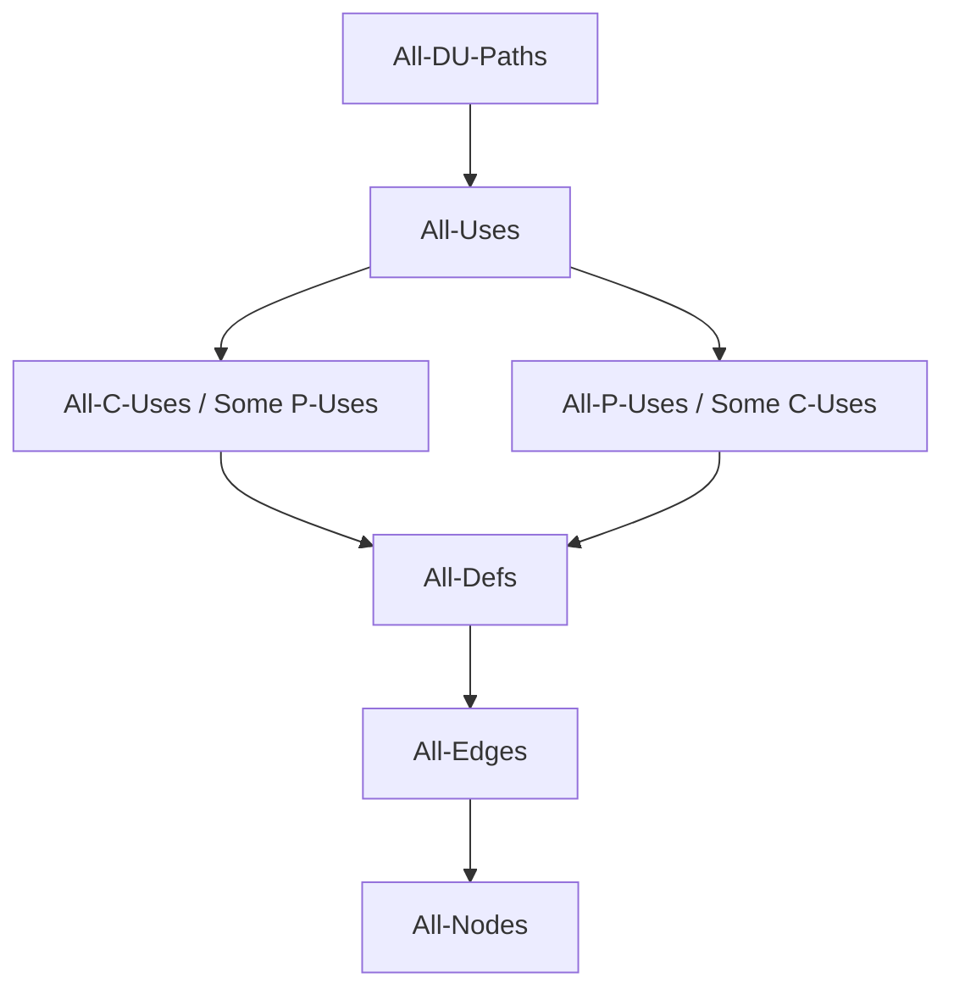

---
tags:
  - testing
  - data-flow
  - slices
  - unit-testing
  - software-testing
  - coverage-metrics
  - code-based-testing
---

# Data Flow Testing & Retrospective on Unit Testing

> **Source:** Jorgensen, *Software Testing: A Craftsman's Approach*, Chapters 9–10
> **Sibling notes:** [[01_Testing_Fundamentals]], [[02_Boundary_and_Equivalence]], [[03_Decision_Table_and_Path]], [[05_Integration_and_System]]

## Chapter 9 — Data Flow Testing

Data flow testing focuses on the points at which variables receive values (definitions) and the points at which those values are used. It serves as a "reality check" on path testing — while cumbersome at the unit level, it is well suited for object-oriented code. Two mainline forms exist: **define/use testing** (Rapps–Weyuker metrics) and **slice-based testing**.

### 9.1 Define/Use Testing

#### Core Definitions

Given a program *P* with program graph *G(P)* and variables *V*:

| Term | Notation | Meaning |
|------|----------|---------|
| **Defining Node** | `DEF(v, n)` | Node *n* defines (assigns/inputs) variable *v* |
| **Usage Node** | `USE(v, n)` | Node *n* uses (reads) variable *v* |
| **Predicate Use (P-use)** | | `USE(v, n)` where statement *n* is a predicate (outdegree ≥ 2) |
| **Computation Use (C-use)** | | `USE(v, n)` where statement *n* is a computation (outdegree ≤ 1) |
| **Definition/Use Path (du-path)** | | A path from `DEF(v, m)` to `USE(v, n)` |
| **Definition-Clear Path (dc-path)** | | A du-path with no other defining nodes of *v* in between |

#### Define/Reference Anomalies

Static analysis can detect three classic faults without executing code:

1. **Variable defined but never used** — dead definition, possible missing logic
2. **Variable used before defined** — uninitialized value, likely bug
3. **Variable defined twice before use** — first definition killed, possible logic error

> These were historically detected via compiler-generated concordances (still popular with COBOL).

#### Commission Problem Example

The commission program computes commission on locks, stocks, and barrels sold. Key data flow points:

- **locks** variable: defined at nodes 13 (prime read) and 19 (loop re-read); used at node 14 (P-use, while-loop sentinel) and 16 (C-use, accumulation). Four du-paths:
  - `p1 = <13, 14>` — prime → P-use
  - `p2 = <13, 14, 15, 16>` — prime → C-use through loop body
  - `p3 = <19, 20, 14>` — loop re-read → P-use
  - `p4 = <19, 20, 14, 15, 16>` — loop re-read → C-use

- **totalLocks**: defined at 10 (init) and 16 (accumulation); used at 16, 21, 24. Du-path `p6 = <10, …, 16, …, 21>` is not definition-clear because node 16 re-defines totalLocks inside the loop.

- **sales**: single defining node at 27 → all du-paths are automatically definition-clear. Multiple C-uses and P-uses branch from it.

- **commission**: defined at six nodes (31, 32, 33, 36, 37, 39); used finally at 41. Analysis is tedious — the "built-up" intermediate definitions create many du-paths, some infeasible.

#### Rapps–Weyuker Data Flow Coverage Metrics

Hierarchy (top = strongest, bottom = weakest):


All-Paths



| Metric | Requirement |
|--------|-------------|
| **All-Defs** | For every variable *v*, a dc-path from every defining node to at least one use |
| **All-Uses** | For every variable *v*, dc-paths from every defining node to *every* use |
| **All-P-Uses/Some C-Uses** | dc-paths from defining nodes to all P-uses; if no P-use exists, at least one C-use |
| **All-C-Uses/Some P-Uses** | dc-paths from defining nodes to all C-uses; if no C-use exists, at least one P-use |
| **All-DU-Paths** | dc-paths covering all definition-use pairs, limited to single loop traversals or cycle-free |

> These "subsumption" relationships give testers a refined spectrum between the impractical All-Paths and the minimal All-Edges.

#### Data Flow Testing for OO Code

In procedural code, define/use is context-free (assumed within a unit). OO changes this:

- **Aggregation**: variables span class boundaries
- **Inheritance**: definitions and uses can be in different classes in a hierarchy
- **Dynamic binding/polymorphism**: the actual definition/use target is resolved at runtime

→ Data flow testing for OO moves from **unit level** to **integration level**.

### 9.2 Slice-Based Testing

A **program slice** is the set of program statements that contribute to (or affect) the value of a variable at some point in the program. Originated in Weiser's 1979 dissertation; took ~20 years to reach industrial practice.

#### Formal Definition

> Given a program *P* and variable *v*, a **static backward slice** *S(v, n)* is the set of all statement fragment numbers in *P* that contribute to the value of *v* at node *n*.

#### Slice Dimensions

| Dimension | Backward | Forward |
|-----------|----------|---------|
| **Static** | All statements that could affect *v* at *n* (intension) | All statements that could be affected by *v* at *n* |
| **Dynamic** | Statements in a specific execution that affected *v* at *n* | Statements in a specific execution affected by *v* at *n* |

#### Extended Variable Usage Types

| Type | Symbol | Meaning |
|------|--------|---------|
| Predicate use | P-use | Used in a decision (if, while) |
| Computation use | C-use | Used in arithmetic/assignment RHS |
| Output use | O-use | Used for output (print, write) |
| Location use | L-use | Pointers, subscripts, addresses |
| Iteration use | I-use | Internal counters, loop indices |

**Definition types**: I-def (defined by input) and A-def (defined by assignment).

#### Slice Splicing

Gallagher & Lyle's concept: build a program bottom-up by coding and testing compilable slices separately, then "splicing" them together. A precursor to agile/extreme programming practices.

The commission program can be split into four slices:
1. **Slice 1**: locks loop → lockSales → sales (sentinel-controlled input)
2. **Slice 2**: stocks accumulation → stockSales → sales
3. **Slice 3**: barrels accumulation → barrelSales → sales
4. **Slice 4**: commission calculation from sales value

→ Each slice is independently compilable and testable before merging.

#### Slice Lattice

Slices form a partially ordered set under subset inclusion (⊆). The lattice (Figure 9.10 in Jorgensen) shows how smaller slices compose into larger ones — useful for understanding data dependencies and guiding integration test order.

#### Style Guidelines for Slicing

1. Never slice on a variable that doesn't appear in the target statement fragment
2. Keep slices on one variable (multi-variable slices = union of single-variable slices)
3. Slice at all A-def nodes (assignment statements) — shows all du-paths of contributing variables
4. O-use slices can be expressed as unions of A-def/I-def slices
5. Slice at all P-use nodes — shows how predicate variables got their values (very useful for decision-heavy programs like Triangle and NextDate)
6. Consider making slices compilable: add data declarations so each slice is independently executable

#### Program Slicing Tools

Manual slicing is not viable at scale. Selected tools:

| Tool | Language | Type |
|------|----------|------|
| Kamkar | Pascal | Dynamic |
| Spyder | ANSI C | Dynamic |
| Unravel | ANSI C | Static |
| CodeSonar | C, C++ | Static |
| Indus/Kaveri | Java | Static |
| JSlice | Java | Dynamic |
| SeeSlice | C | Dynamic |

> Slicing tools are primarily used for **program comprehension** in maintenance, not for primary test design. Interprocedural slicing is essential for large systems.

---

## Chapter 10 — Retrospective on Unit Testing

### When Should Unit Testing Stop?

Seven possible answers, from worst to ideal:

| # | Answer | Assessment |
|---|--------|------------|
| 1 | When you run out of time | Common, unfortunate |
| 2 | When continued testing causes no new *failures* | Supported by reliability models |
| 3 | When continued testing reveals no new *faults* | Better; also model-supported |
| 4 | When you cannot think of new test cases | Good *if* you've followed systematic precepts; bad if due to lack of motivation |
| 5 | When you reach a point of diminishing returns | Strong appeal — cost/risk trade-off must be clear |
| 6 | **When mandated coverage has been attained** | Pretty good answer; structural coverage as cross-check on functional testing |
| 7 | When all faults have been removed | Cannot be guaranteed |

> **The coverage answer (#6)**: using structural testing as a cross-check on functional testing yields powerful results.

### 10.1 The Test Method Pendulum

Testing methods swing between two extremes of **low semantic content**, becoming more effective (and more difficult) as they move toward the center:

```
        Code-based testing                    Spec-based testing
              │                                      │
    Path Testing  ────  Data Flow  ────  Slice       │
         │                    │                │     │
         ▼                    ▼                ▼     ▼
    (topological only)   (detects some     (closest    Boundary Value
                         infeasible paths)  to code     Testing (gaps &
                                           semantics)  redundancies
                                                       invisible)
                                                           │
                                              Equivalence Class Testing
                                              (uses "similar treatment" idea)
                                                           │
                                              Decision Table Testing
                                              (handles complex logical combos)
```

**Key insight from the pendulum**:
- **Toward extremes**: test case identification gets *easier* but *less effective*; easier to automate
- **Toward center**: higher semantic meaning → harder to automate → *more effective*
- Path-based testing obscures infeasible paths (purely topological)
- Data flow testing detects dependencies that create infeasible paths
- Slice-based testing gets closest to code semantics
- On the spec side: boundary value alone → equivalence classes → decision tables progressively add semantic meaning

### The Structural/Functional Cross-Check

The best view of structural testing:

1. Use properties of the source code to identify **appropriate coverage metrics** (e.g., multiple-condition coverage for complex logic; loop coverage for iteration-heavy modules)
2. Use these metrics as a **cross-check on functional test cases**
3. When desired coverage is not attained → follow interesting paths to identify **additional special-value test cases**

This resolves the gaps/redundancies problem that plagues pure specification-based testing: you can recognize which program paths are exercised by functional cases and which are missed.

### McCabe's Insight

> *"These are purely criteria that measure the quality of testing, and not a procedure to identify test cases."* — McCabe, 1982

Basis path testing gives a *lower boundary* on how much testing is necessary. It is a metric, not a recipe.

---

## Key Takeaways

1. **Data flow testing bridges path testing and semantic understanding** — du-paths capture how data moves through a program, revealing faults that pure control-flow testing misses.

2. **The Rapps–Weyuker hierarchy** provides a systematic spectrum of coverage rigor, from All-Defs (minimal) to All-DU-Paths (comprehensive but often infeasible).

3. **Define/reference anomalies** (defined-but-unused, used-before-defined, twice-defined) are classic faults detectable by static analysis.

4. **Program slices** decompose a program into functionally meaningful components — powerful for comprehension, maintenance, and bottom-up testing via slice splicing.

5. **Slices form a lattice** under subset inclusion, showing how data dependencies compose hierarchically.

6. **The test method pendulum** teaches that the most effective testing combines structural and specification-based approaches, using coverage metrics as a cross-check rather than a goal.

7. **When to stop**: coverage attainment (#6) is the most practical answer — structural coverage validates that functional testing has adequate breadth.

8. **Neither extreme suffices alone**: pure spec-based testing hides gaps/redundancies; pure code-based testing cannot reveal missing functionality. The craftsman uses both.
