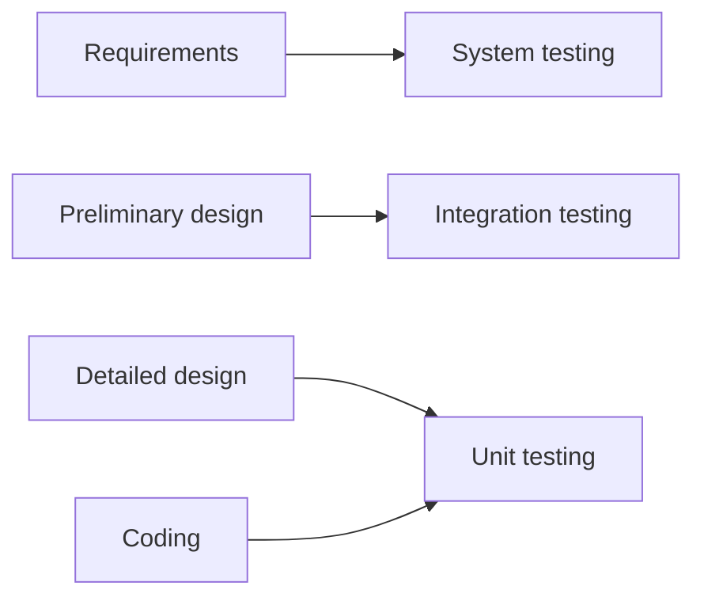

---
tags:
  - testing
  - model-based
  - life-cycle
  - software-testing
---

# Model-Based & Lifecycle Testing

> **Source:** Jorgensen, *Software Testing: A Craftsman's Approach*, Chapters 11–12
> **Focus:** How software development life cycles shape testing strategy, and how behavioral models drive test case generation (MBT).

---

## Part 1 — Life Cycle–Based Testing (Ch 11)

Different development life cycles mandate different testing approaches. We shift focus from *how* to test (unit-level techniques from earlier chapters) to *what* to test — and when.

---

### 11.1 Traditional Waterfall Testing

The waterfall model (Figure 11.1) defines three canonical levels still used today:

| Level | Basis for Test Cases | What/How Cycle |
|---|---|---|
| **Unit testing** | Detailed design of the unit | Detailed design → Coding |
| **Integration testing** | Preliminary design (functional decomposition) | Preliminary design → Detailed design |
| **System testing** | Requirements specification | Requirements → Preliminary design |

**The V-Model** (Figure 11.2) emphasizes symmetry: each development phase on the left has a corresponding testing phase on the right.





#### Key Characteristics

- **Functional testing presumption** at higher levels (system, integration)
- **Bottom–up testing order** (unit → integration → system) by abstraction level
- Top–down development and functional decomposition drive integration
- Stubs replace lower-level units; drivers replace higher-level units; "big bang" avoids both

#### Pros and Cons (from Agresti, 1986)

| Pros | Cons |
|------|------|
| Fits hierarchical management structures | Very long feedback cycle (customer absent) |
| Clear exit criteria for each phase | Emphasizes analysis over synthesis |
| Parallel unit development shortens schedule | Requires massive parallel staffing |
| — | **"Perfect foresight" required** — faults/omissions at requirements penetrate all phases |

The completeness problem is central: all successor life cycles *assume incompleteness* and rely on iteration to gradually arrive at completeness.

---

### 11.2 Testing in Iterative Life Cycles

Common shift: from **decomposition** (waterfall) to **composition** (iterative). Analogy: negative sculpture (chipping away marble — one mistake kills the work) vs. positive sculpture (adding/removing wax — errors are fixable). The agile world is positive sculpture.

#### 11.2.1 Waterfall Spin-Offs

Three main derivatives, all using a series of **builds/increments**:

| Model | Build Identification | Distinguishing Feature |
|-------|---------------------|----------------------|
| **Incremental** | Flatten staff profile | Fixed build sequence planned upfront |
| **Evolutionary** | Customer feedback drives next builds | Time-to-market priority; "locked in" customers |
| **Spiral** (Boehm, 1988) | Risk-based, rapid prototyping + go/no-go | Four quadrants: objectives → risk → develop/test → plan next |

**Within each build:** normal waterfall phases (detailed design → coding → testing) plus a critical split in system testing:

```
System testing splits into:
├── Regression testing — ensure previous build's functionality still works
└── Progression testing — verify new functionality
```

**Regression testing** is essential due to the ripple effect (~20% of changes introduce new faults). Two approaches:

1. Repeat all previous tests (works well in automated environments)
2. Devise a smaller, focused set

**Soap Opera Tests:** Long, complex regression test cases (like TV soap operas) that can fail in many ways — if one fails, more focused testing localizes the fault.

**Advantages over waterfall:** Earlier synthesis → earlier customer feedback → two deficiencies of waterfall mitigated.

#### 11.2.2 Specification-Based Life Cycle Models

**Rapid Prototyping** (Figure 11.4):
- "Quick and dirty" prototype → customer feedback → iterate → then build correctly
- Drastically shortens specification-to-customer feedback loop
- Implication for system testing: where are the requirements? Capture customer scenarios as system test cases (precursors to user stories)

**Executable Specifications** (Figure 11.5):
- Requirements modeled in executable formalisms (FSMs, StateCharts, Petri nets)
- Customer "executes" the spec to observe intended behavior
- Best for **reactive/event-driven systems** where event ordering matters
- Key benefit: test cases can be mechanically derived from the model — a form of **structural testing at the system level**
- Can be combined with any iterative model

---

### 11.3 Agile Testing

Four defining characteristics of all agile life cycles:

1. **Customer-driven**
2. **Bottom–up development**
3. **Flexibility** with changing requirements
4. **Early delivery** of fully functional components

A project ends when the customer has no more user stories.

#### 11.3.1 Extreme Programming (XP)

- User stories → Release plan → Iteration plan → Pair programming → Unit test → Acceptance test → Small release
- **Pair programming:** continuous code walkthrough (one coder, one reviewer)
- **No overall preliminary design** — this is inherently bottom–up
- Testing at unit and acceptance levels

#### 11.3.2 Test-Driven Development (TDD)

```
User story → Tasks → Write test cases FIRST → Run (fail) → Write "just enough" code → Run (pass) → Refactor? → Next story
```

| Stage | Action |
|-------|--------|
| **RED** | Write test cases for non-existent code — they fail |
| **GREEN** | Write minimum code to pass all tests |
| **REFACTOR** | Clean up code; re-run full test suite (≈ regression) |

**Key insights:**
- Tests ARE the specification → specification-based AND code-based testing
- Requires automated test environment (nUnit family)
- Greatly simplified fault isolation

**Problems with TDD:**
1. Bottom–up prohibits high-level design — late user stories may break earlier design choices; refactoring must occur at *design level* too
2. No guarantee that TDD developers write perfect test cases
3. Late user stories may be inconsistent with earlier ones
4. No cross-check at the user-story level

#### 11.3.3 Scrum

Most widely used agile life cycle. New vocabulary for old ideas:

| Scrum Term | Traditional Equivalent |
|------------|----------------------|
| Sprint (2–4 weeks) | Iteration |
| Daily stand-up | Status meeting |
| Sprint backlog | Requirements for one sprint |
| Product backlog | Full requirements |
| Product owner | Customer |
| Scrum master | Team lead/supervisor |

**Testing in Scrum:**
- **Unit level** — at each day's end (daily build)
- **Integration/system level** — at sprint end (small release = deliverable product)
- Sprint definition ≈ preliminary design (identifying sequence of sprints)

---

### 11.4 Agile Model–Driven Development

The Go analogy: success requires both **strategy** (overall design) and **tactics** (unit-level development). Agile flavors are strong on tactics, weak on strategy.

#### 11.4.1 Agile Model–Driven Development (AMDD — Ambler)

- **Model just enough** for the current user story
- Implement with TDD
- Distinct design step (agnostics call this "Big Design Up Front" / BDUF)
- Recognition that design HAS a place in agile — but no room for integration/system testing

#### 11.4.2 Model–Driven Agile Development (MDAD — Jorgensen's proposal)

**Compromise:** TDD as the *tactic* + overall model as the *strategy*.

```
Requirements → Project modeling → Iteration modeling → TDD → Iteration integration → Final system testing
```

All **three levels of testing** (unit, integration, system) are present — the strategy/overall model supports Model-Based Testing.

---

## Part 2 — Model-Based Testing (Ch 12)

Model-Based Testing (MBT) is the meeting place of software modeling and testing. The process of creating a model yields deeper insight into the system being tested — especially with executable models (FSMs, Petri nets, StateCharts).

### The MBT Process

```
1. Model the system
2. Identify threads of system behavior in the model
3. Transform threads into test cases
4. Execute test cases on the actual system
5. Revise the model(s) as needed and repeat
```

Adequacy of MBT always depends on the **accuracy of the model**. Behavior threads → system-level test cases are readily derived from behavioral models (Chapter 14 covers this in depth).

---

### 12.2 Appropriate Models

Choosing an appropriate model depends on:

1. **Expressive power** of the model
2. **Nature of the system** being modeled
3. **Analyst's ability** to use the model

The challenge mirrors epistemology: languages evolve to meet expressive needs — modeling languages are no different.

#### 12.2.1 Peterson's Lattice

James Peterson (1981) developed a lattice of computational models where arrows mean **"more expressive than."**

```
Extended Petri nets
      ↑
Vector replacement/additions systems  ←  UCLA graphs
      ↑
Petri nets  ←  Message systems
      ↑
Semaphore (P,V) systems
      ↑
Marked graphs  ←  Finite State Machines
```

**Key relationships:**
- Semaphore systems cannot be expressed as FSMs (Peterson proved this)
- Marked graphs are formal duals of FSMs (formalized data flow diagrams)
- The lattice answers: "is this model powerful enough for my application?"

**Golden rule:** Choose a model that is **both necessary and sufficient** — neither too weak (important behaviors untested) nor too strong (wasted modeling effort).

#### StateCharts in Peterson's Lattice

StateCharts (Harel) are at least equivalent to, and probably more expressive than, most Petri net extensions:

```
Extended Petri nets  ←  StateCharts
```

- StateCharts express **true concurrency** (concurrent regions) — not expressible in standard Petri nets
- Swim Lane Petri Nets (DeVries, 2013) attempt to bridge this gap using UML swim lanes for parallel activities
- Event-Driven Petri Nets extend this further for systems-of-systems (Chapter 17)

#### 12.2.2 Expressive Capabilities

Peterson analyzed four mainline models by what behavioral issues they can represent:

| Capability | FSM | Marked Graph | Semaphore System | Petri Net |
|---|---|---|---|---|
| Data flow | ✓ | ✓ | | |
| Control flow | ✓ | | | |
| Conflict | | | ✓ | ✓ |
| Mutual exclusion | | | ✓ | ✓ |
| Fair scheduling | | | | ✓ |
| Communication | | | | ✓ |
| Synchronization | | | | ✓ |

#### 12.2.3 Modeling Issues: Structure vs. Behavior

| Structure Models (what a system IS) | Behavior Models (what a system DOES) |
|---|---|
| Data flow diagrams | Decision tables |
| Entity/relation models | Finite state machines |
| Hierarchy charts | StateCharts |
| Class/object diagrams | Petri nets |

Behavioral models have **varying degrees of expressive capability** — the technical equivalent of being able to express nuanced concepts in different languages. MBT leans heavily on behavioral models because they directly yield threads of system behavior → test cases.

---

## Key Takeaways

1. **Life cycle choice determines testing strategy.** Waterfall prescribes bottom–up by abstraction; agile redistributes testing into daily/sprint cycles with heavy regression.
2. **Regression testing is the price of iteration.** Every build/increment demands verification that old functionality still works — automated testing makes this practical.
3. **TDD inverts specification and testing.** Tests become the spec; the code is written to satisfy tests. This provides excellent fault isolation but offers no cross-story consistency check.
4. **MBT depends on model choice.** Peterson's lattice guides model selection — pick a model that is necessary and sufficient. StateCharts sit near the top of current expressive power.
5. **Behavior models → test cases.** Threads of system behavior extracted from FSMs, Petri nets, or StateCharts can be mechanically transformed into system-level test cases.
6. **MDAD bridges agile and traditional.** TDD tactics + overall model strategy retains all three test levels (unit, integration, system) while keeping the agile speed.

---

## Related Notes

- [[02 Test-Driven Development]] — TDD in detail
- [[01 Test Planning & Design]] — Test strategy and planning
- [[02 Functional Testing]] — Black-box techniques (equivalence classes, boundary value, decision tables)
- Chapter 13 (next): Model-based strategies for **integration testing**
- Chapter 14: Model-based **system testing**
- Chapter 17: Testing **systems of systems** with Swim Lane Petri Nets
