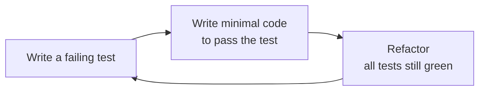
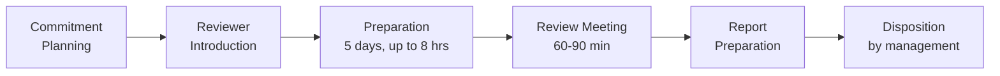

---
tags:
  - testing
  - tdd
  - mutation-testing
  - reviews
  - software-testing
---

# 08 Emerging Topics

> **Source:** Jorgensen, *Software Testing: A Craftsman's Approach*, 4th ed., Chapters 18–22.
> **Topics:** Exploratory testing, Test-Driven Development (TDD), All Pairs testing, mutation testing, fuzzing, fault insertion, and software technical reviews.

---

## 18 — Exploratory Testing

**Exploratory testing** is *simultaneous learning, test design, and test execution* (James Bach, 2003). Unlike scripted testing where all test cases are predetermined, exploratory testing uses the results of one test to design the next.

### The Lewis and Clark Analogy

| Principle | Testing Equivalent |
|-----------|-------------------|
| They knew what they were looking for (a route to the Pacific) | Tester has a clear **charter** |
| They had appropriate staffing and resources | Proper tools and domain knowledge |
| They learned as they explored | Feedback from tests drives new tests |
| They were given plenty of time | Exploration needs unhurried focus |
| They documented what they saw | Tests and results are recorded |

### Exploratory vs. Special Value Testing

| | Special Value Testing | Exploratory Testing |
|---|---|---|
| **Driver** | Tester's past experience | Tester's curiosity + **feedback** from test outcomes |
| **Feedback loop** | Only pass/fail | Results determine the nature of follow-up tests |
| **Analogy** | Professor gives oral exam | Professor asks follow-up questions when a student shows weakness |

### The Commission Problem Example

The salesperson systematically explored a faulty commission calculation:

1. **Isolate coefficients** — tested each item (locks, stocks, barrels) individually → coefficients were correct
2. **Probe boundary** — tested near the $1000 commission threshold
3. **Algebraic deduction** — from the failed cases, deduced the formula used `sales – $1100` instead of `sales – $1000`

### Key Observations

| # | Observation |
|---|-------------|
| 1 | Exploratory testing is **difficult in agile environments** — it presumes a completed application to explore |
| 2 | Effectiveness is **inherently dependent on domain experience** — a CS professor can't effectively examine a history major |
| 3 | Requires **highly motivated, curious, creative** testers |
| 4 | **Defies predictive measurement** — you can't estimate how many faults remain |
| 5 | Management boils down to: **clear charter + documented tests and results** |
| 6 | Effectiveness is **inversely proportional to system size and complexity** — an individual tester has a comprehension threshold |

---

## 19 — Test-Driven Development (TDD)

> *"Test a little, code a little, refactor a little more."*

TDD is an agile practice where test cases are written **before** the corresponding code. A test fails initially, just enough code is written to make it pass, then refactoring occurs while all previous tests continue to pass.

### The TDD Cycle

### Key Characteristics

| Characteristic | Description |
|---------------|-------------|
| **Fault isolation** | If a new test fails, the fault can only be in the **most recently added code** |
| **Always working** | At every point, all previous tests pass — something always works |
| **User-story driven** | Development is guided by a sequence of user stories from the customer |
| **Bottom-up** | Code grows incrementally from the smallest units upward |
| **Refactoring crucial** | Without refactoring, bottom-up TDD produces inelegant code; refactoring gradually improves design |

### The xUnit Ecosystem

TDD depends on automated test frameworks. The xUnit family includes:

| Framework | Language | Framework | Language |
|-----------|----------|-----------|----------|
| **JUnit** | Java | **PyUnit** | Python |
| **CppUnit** | C++ | **NUnit** | .NET |
| **CUnit** | C | **PHPUnit** | PHP |
| **DUnit** | Delphi | **SUnit** | Smalltalk (original) |
| **jsUnit** | JavaScript | **HttpUnit** | Web apps |

### TDD vs. MDD (Model-Driven Development): isLeap Example

Jorgensen compares two implementations of the `isLeap(year)` function:

| Aspect | MDD (Decision Table) | TDD (Incremental Tests) |
|--------|---------------------|------------------------|
| **Approach** | Top-down model → code | Bottom-up tests → code |
| **Cyclomatic complexity** | 4 (nested IFs) | 2 (compound condition) |
| **Actual test cases needed** | 4 (same set) | 4 (same set — MC/DC required) |
| **Maintenance** | Model helps understand the "big picture" | Tests help recreate/isolate faults |
| **Metaphor** | **Eagle** — sees the big picture | **Mouse** — sees every detail |

> **Conclusion:** Both are logically equivalent. Nested-IF complexity in MDD is just moved to **condition complexity** in TDD — it doesn't disappear. Each approach has complementary strengths.

### Pros, Cons & Open Questions

| Pros | Cons |
|------|------|
| Always something works — never completely broken | Impossible/cumbersome without test frameworks |
| Excellent fault isolation | Depends on tester ingenuity for good test cases |
| Extensive framework support | Bottom-up nature provides little design opportunity |
| Can be handed off to another pair mid-development | Unlikely to reveal "deeper" faults (data flow, thread interactions) |

| Open Question | Concern |
|---------------|---------|
| **Scale-up to large apps** | How much can one developer keep in mind? |
| **Complexity** | Can TDD handle reliability/safety-critical systems? |
| **Long-term maintenance** | Are test cases sufficient documentation? (TDD advocates say yes — but time will tell) |

### Granularity Choices

| Large-Grain Stories | Fine-Grain Stories (TDD) |
|--------------------|------------------------|
| "A date can be input and displayed" | "A day can be input" / "A month can be input" / "A year can be input" |
| "Invalid dates can be recognized" | "Day=31 in 30-day month" / "Day≥29 in Feb" / "Feb 29 in common year" / etc. |

Larger granularity ("story-driven development") reduces refactoring frequency and introduces a small element of top-down design.

---

## 20 — A Closer Look at All Pairs Testing

The **All Pairs** (pairwise) technique exercises every pair of input variable values in at least one test case. It originates from **orthogonal arrays** in statistical design of experiments.

### The NIST Claim

> Wallace & Kuhn (2000): 98% of defects in software-controlled medical devices were due to the interaction of **pairs** of variables.

This study drove enormous interest in pairwise testing, particularly in the agile community.

### Four Critical Assumptions (and Their Violations)

| Assumption | Counter-Example | Consequence |
|-----------|-----------------|-------------|
| **1. Meaningful equivalence classes exist** | Triangle program — sides are physical variables; only valid/invalid boundaries apply | Can't generate triangles, only data validity checks |
| **2. Inputs are independent** | NextDate — day/month, month/year dependencies | Generates invalid dates (Feb 31, etc.); misses 3-variable interactions (Feb 28 common year) |
| **3. Input order is irrelevant** | Currency converter GUI — Compute button is context-sensitive | Different input orders produce different test sets; some error contexts never tested |
| **4. Faults are due only to pairs** | NextDate Feb 28 leap year → requires day, month, *and* year | Three-variable interactions are invisible to All Pairs |

### The Input Order Problem

Simply **reordering equivalence classes** in the allpairs.exe input file produces different test case sets:

| Input Order A | Input Order B |
|---------------|---------------|
| Tests 2 currency conversions | Tests 1 currency conversion |
| Generates error messages 1, 4, 2/5 | Generates error messages 3, 4, 5 |

> The algorithm packs the most pairs into **early test cases** — order of class presentation matters.

### The Fallacy of Extension

The NIST study never stressed **test case compression**. It analyzed 109 real failure reports and found that only 3 failures (2%) involved more than two conditions. But the popular narrative extended this to "All Pairs compresses 10²⁰ test cases into 180" — the NIST paper's own example of a device with 20 inputs × 10 settings is **not representative** of the medical devices they studied (which had few inputs with discrete settings).

### When Is All Pairs Appropriate?

| | Single Processor | Multiple Processors |
|---|---|---|
| **Static** (all inputs available upfront) | ✅ All Pairs potentially OK | ⚠️ Can't deal with input orders |
| **Dynamic** (inputs in time sequence) | ⚠️ Potentially problematic | ❌ Not appropriate |

### Recommendations: Ask These Questions

If **all** are answered "yes," All Pairs risk is reduced:

- Are the inputs exclusively **data** (not events)?
- Are the variables **logical** (not physical)?
- Are the variables **independent**?
- Do variables have **useful equivalence classes**?
- Is the input **order irrelevant** (static + single processor)?
- Can **expected outputs** be determined?

---

## 21 — Evaluating Test Cases

> *"Quis custodiet ipsos custodes?"* — Juvenal: Who guards the guards? Who tests the test cases?

Three approaches to evaluating test case quality: **mutation testing**, **fuzzing**, and **fault insertion (fishing creel counts)**.

### 21.1 Mutation Testing

**Mutation testing** makes small syntactic changes to source code and checks whether the existing test suite detects (kills) the mutants.

#### Core Definitions

| Term | Definition |
|------|------------|
| **Mutant P′** | A version of program P with one small syntactic change |
| **Killed mutant** | At least one test case in T fails on P′ |
| **Live mutant** | All tests pass on P′ — either P′ ≡ P (equivalent) or T is insufficient |
| **Mutation score** | `killed / total` — higher = more confidence in test suite |
| **Equivalent mutant** | Syntactically different but semantically identical to original — **formally undecidable** |

#### Common Mutation Operators

| Set | Members | Example Mutation |
|-----|---------|-----------------|
| **Arithmetic (A)** | `+, –, *, /, %` | `a + b` → `a * b` |
| **Relational (R)** | `<, <=, ==, ≠, >, >=` | `a < b` → `a <= b` |
| **Logical (L)** | `∧, ∨, ⊕, ∼, →` | `a && b` → `a \|\| b` |

PIT (a free Java mutation tool) uses mutators like:
- `CONDITIONALS_BOUNDARY_MUTATOR` — changes `<` to `<=`, etc.
- `MATH_MUTATOR` — replaces `+` with `-`, `*` with `/`
- `NEGATE_CONDITIONALS_MUTATOR` — negates boolean conditions
- `RETURN_VALS_MUTATOR` — flips return values

#### PIT Results: Three Examples

| Example | Mutants | Killed | Score | Note |
|---------|---------|--------|-------|------|
| **isLeap** | ~7 (selected) | 7 | 1.00 | All caught — test suite is adequate |
| **isTriangle** | 10 | 10 | 1.00 | All caught |
| **Commission** | 21 | 19 | 0.905 | 2 condition boundary mutants **survived** → tests need improvement |

### 21.2 Fuzzing

Fuzzing presents **random character strings** as inputs to programs. Originated at Univ. of Wisconsin (Miller et al., 1989) when modem line noise caused UNIX utility failures.

| Advantage | Disadvantage |
|-----------|-------------|
| Reveals situations a tester would never think of | Expected output cannot be defined (only crash/no-crash) |
| Simple to automate | Error messages are the usual oracle |

> Similar to "automatic dialers" in telephone switching systems that generate large numbers of random calls to estimate lost-call ratios.

### 21.3 Fishing Creel Counts & Fault Insertion

A method borrowed from **wildlife management**:

1. Known faults are **inserted** into the code (like stocking hatchery trout with clipped fins)
2. The existing test suite is run on the "stocked" code
3. If the tests find **all** inserted faults → high confidence
4. If they find only **half** → the "wild fault" population is likely ~2× what has been found

| Assumption |
|------------|
| Demographic profile of **inserted faults** must be representative of the "wild fault" population |

---

## 22 — Software Technical Reviews

> *"A stitch in time saves nine."* — Francis Baily, 1797

Software technical reviews are a form of **static testing**: they identify faults in work products *before* execution, not failures at runtime.

### The Economics: Why Reviews Pay Off

**Boehm's Fault Resolution Cost Curve** (1981): The cost to fix a defect increases **exponentially** with how late it's found.

| When Found | Relative Cost |
|------------|:---:|
| Requirements / Design | **1×** |
| Coding | 5× |
| Development Testing | 10× |
| Acceptance Testing | 20× |
| Operations (production) | **100×** |

**Wiegers (1995)** reports:
- Fixing a defect found in inspection: **$146**
- Fixing a defect found by a customer: **$2,900**
- **Cost/benefit ratio: 0.0503**

### Review Roles

| Role | Responsibility |
|------|---------------|
| **Producer** | Created the work product; present but may not contribute as reviewer |
| **Review Leader** | Schedules, ensures materials, conducts meeting, writes report |
| **Recorder** | Takes notes during the meeting; helps finalize the report |
| **Reviewers** | Objectively examine work product; identify issues with severity levels; submit ballot |

#### Role Duplication (Smaller Teams)

| Pairing | Feasibility |
|---------|-------------|
| Leader = Producer | ⚠️ Walkthrough only; poor idea if producer is insecure |
| Leader = Recorder | ✅ Can work, but difficult |
| Leader = Reviewer | ✅ Works, but time-consuming |

### Three Review Types

| Aspect | Walkthrough | Technical Inspection | Audit |
|--------|:-----------:|:--------------------:|:-----:|
| **Coverage** | Broad, sketchy | Deep | Varies by auditor |
| **Driver** | Producer | Checklist | Standard |
| **Preparation** | Low | **High** | Could be very high |
| **Formality** | Low | High | Rigid |
| **Effectiveness** | Low | **High** | Low |
| **Primary Goal** | Varied | Defect discovery | Conformance |

### The Industrial-Strength Inspection Process

#### Stage Details

| Stage | Key Activities |
|-------|---------------|
| **1. Commitment Planning** | Producer + supervisor identify review team and leader; both must approve; management commits resources |
| **2. Reviewer Introduction** | Review leader assembles team, delivers packet, work product is **frozen**; recorder selected; meeting scheduled |
| **3. Preparation** | 5 working days, up to 8 hrs budgeted; reviewers use checklist; submit individual issues spreadsheets + ballots 1 day before meeting |
| **4. Review Meeting** | Leader merges & prioritizes issues into agenda; issues identified (NOT resolved); consensus on recommendation |
| **5. Report** | Leader + recorder write formal report: issues, statistics, recommendation; **technical responsibility ends here** |
| **6. Disposition** | Supervisor decides; resolved work product promoted to **configuration item** (frozen, no further changes without demotion) |

### The Inspection Packet

| Item | Purpose |
|------|---------|
| **Work product requirements** | Defines "what" the work product must satisfy |
| **Frozen work product** | Everyone reviews the same version — no mid-review changes |
| **Standards and checklists** | What to look for; refined over time; proprietary in many orgs |
| **Review issues spreadsheet** | Individual reviewers list issues by location, checklist item, severity |
| **Review report forms** | Ballots with hours spent, severity summary, recommendation |

### Fault Severity

Simple 3–4 level classification:
- **Severity 1:** Typos, formatting
- **Severity 2:** Missing edge cases, minor logic issues
- **Severity 3:** Missing functionality, architectural problems
- **Severity 4 (Showstopper):** Work product not ready for review — returned to producer

> Study finding: Only reviewers who spent **6–8 hours** of preparation found the really severe faults. Reviewers spending 1–2 hours only found severity-1 issues.

### Key Success Factors

| Factor |
|--------|
| Documented inspection process |
| Formal review training |
| **Budgeted** preparation time |
| Sufficient lead time |
| Thoughtful selection of inspection team |
| Refined review checklist |
| Technically competent participants |
| Buy-in by both technical AND management personnel |

### Review Etiquette & Pitfalls

| What Works | What Kills Reviews |
|-----------|-------------------|
| Follow the agenda | Participants see it as a waste of time |
| Issues are identified, not resolved in the meeting | The wrong people are at the meeting |
| All materials are open to the org (accountability) | No prior preparation |
| Producer resolves action items **after** the meeting | Discussion is easily side-tracked |
| Consensus on recommendations | Time spent fixing problems instead of identifying them |

---

## Cross-Chapter Themes

| Theme | Chapters |
|-------|----------|
| **Feedback-driven testing** | 18 (Exploratory), 19 (TDD), 21 (Mutation) |
| **Test case sufficiency** | 20 (All Pairs), 21 (Mutation, Fuzzing, Creel Counts) |
| **Cost of finding defects late** | 22 (Reviews), 21 (Mutation measures test quality) |
| **Human skill dependency** | 18 (domain knowledge), 19 (tester ingenuity), 22 (reviewer competence) |
| **Process discipline** | 19 (TDD rhythm), 20 (methodical equivalence class selection), 22 (formal inspection stages) |

---

## Sources

- Jorgensen, Paul C. *Software Testing: A Craftsman's Approach*, 4th ed., CRC Press, 2014.
  - Chapter 18: Exploratory Testing
  - Chapter 19: Test-Driven Development
  - Chapter 20: A Closer Look at All Pairs Testing
  - Chapter 21: Evaluating Test Cases (Mutation Testing, Fuzzing, Fault Insertion)
  - Chapter 22: Software Technical Reviews
- Bach, J., *Exploratory Testing Explained*, 2003.
- Boehm, B., *Software Engineering Economics*, Prentice-Hall, 1981.
- Wallace, D.R. and Kuhn, D.R., *Converting System Failure Histories into Future Win Situations*, NIST, 2000.
- Ammann, P. and Offutt, J., *Introduction to Software Testing*, Cambridge University Press, 2008.
- Wiegers, K., *Improving Quality through Software Inspections*, 1995.
- Miller, B. et al., *An Empirical Study of the Reliability of UNIX Utilities*, 1989.

## Related

- [[Software Testing Overview]] — All testing topics
- [[05_Integration_and_System]] — System testing context
- [[07_OO_and_Complexity]] — Mutation and complexity
- [[QA/QA Overview|QA Overview]] — Practical QA processes
