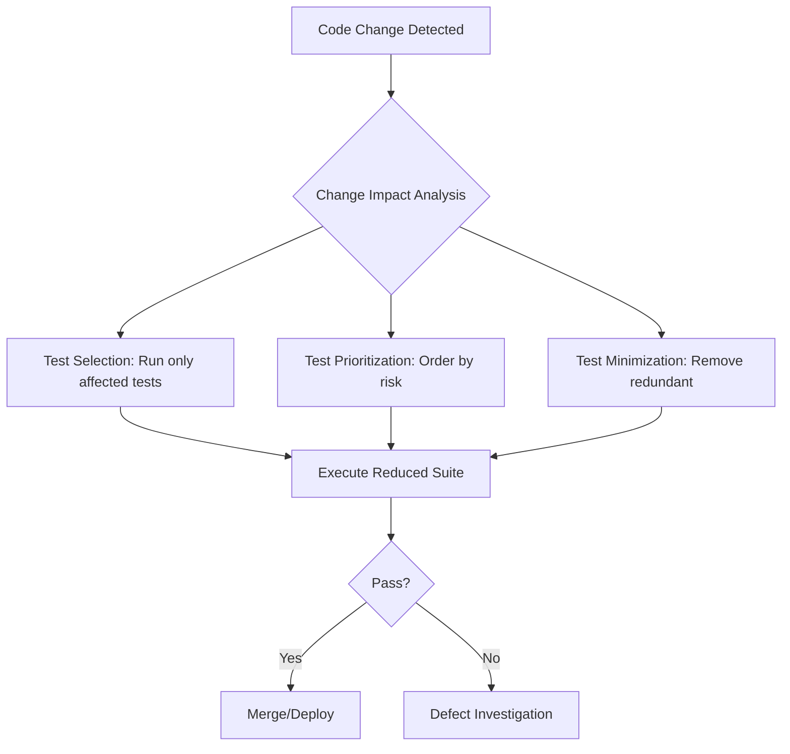
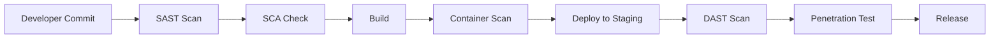
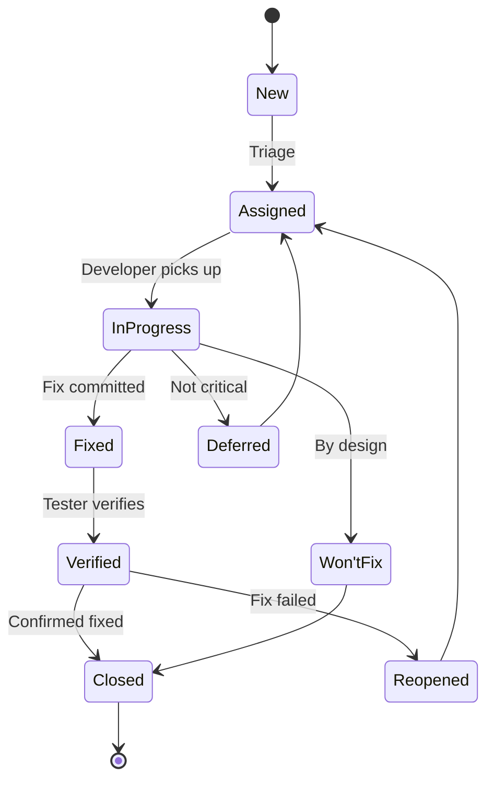
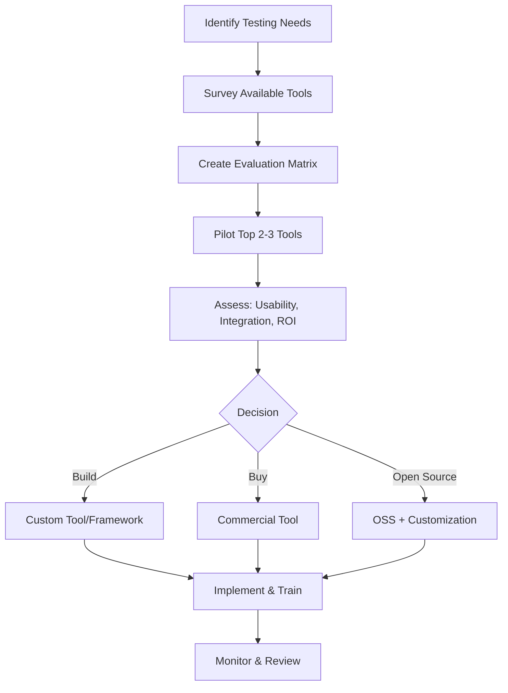
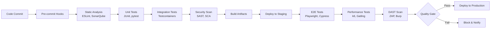
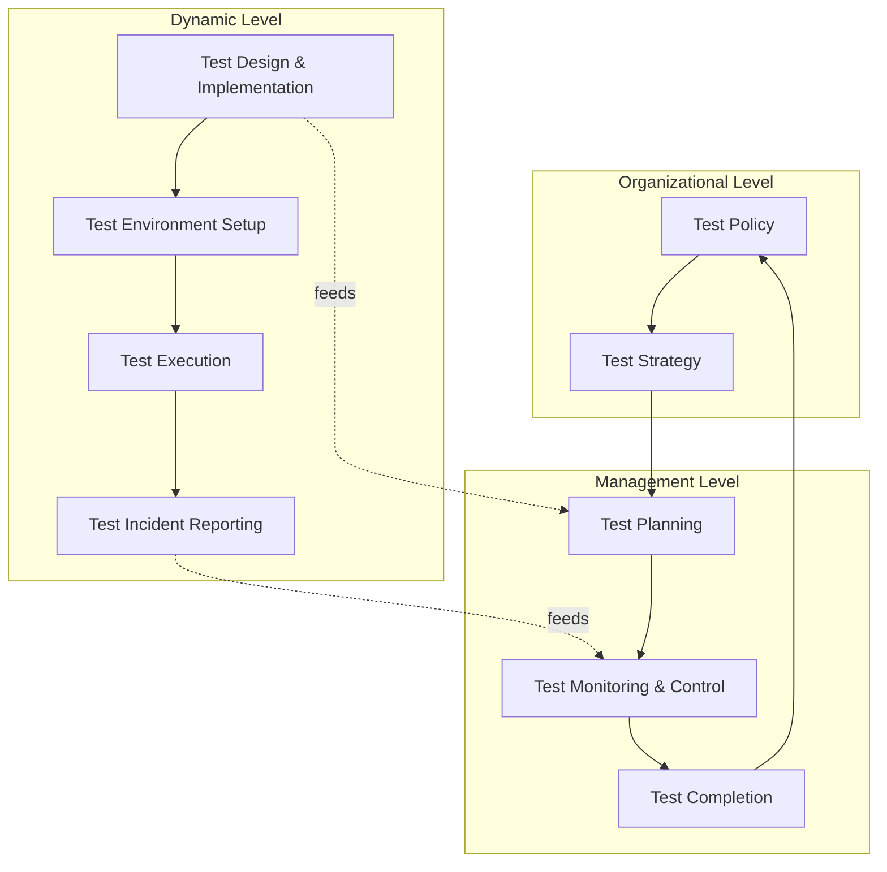
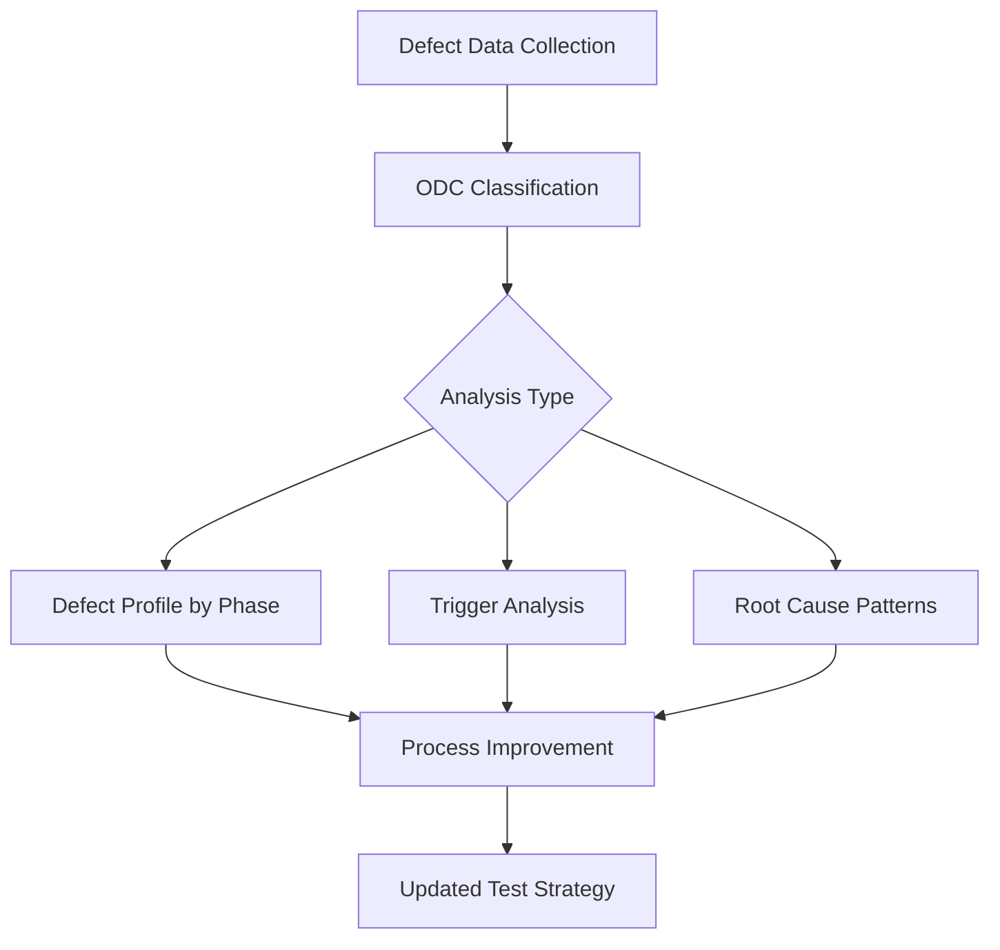
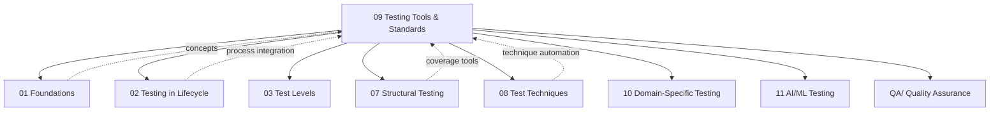

# Testing Tools and Standards

> **SWEBOK KA 5.8** - Testing Tools and Standards
> This note covers the landscape of software testing tools, international standards governing testing processes, and maturity models for assessing testing capability.

---

## Table of Contents

- [[#1. Overview]]
- [[#2. Testing Tool Categories]]
  - [[#2.1 Test Harnesses and Frameworks]]
  - [[#2.2 Test Case Generators]]
  - [[#2.3 Capture/Replay Tools]]
  - [[#2.4 Test Oracles]]
  - [[#2.5 Coverage Analyzers]]
  - [[#2.6 Code Tracers and Profilers]]
  - [[#2.7 Regression Testing Tools]]
  - [[#2.8 Security Testing Tools]]
  - [[#2.9 Load and Stress Testing Tools]]
  - [[#2.10 Defect Tracking Systems]]
  - [[#2.11 Cross-Browser Testing Tools]]
  - [[#2.12 Mobile Testing Tools]]
  - [[#2.13 API Testing Tools]]
  - [[#2.14 Web Testing Tools]]
  - [[#2.15 Static Analysis Tools]]
- [[#3. Tool Selection Criteria]]
- [[#4. Tool Integration in CI/CD Pipelines]]
- [[#5. Testing Standards]]
  - [[#5.1 ISO/IEC/IEEE 29119 Series]]
  - [[#5.2 IEEE 1012 - V&V]]
  - [[#5.3 ISO/IEC 25010 - Quality Model]]
  - [[#5.4 ISO/IEC 20246 - Work Product Reviews]]
  - [[#5.5 ISO/IEC/IEEE 32675 - DevOps Testing]]
- [[#6. Testing Maturity Models]]
  - [[#6.1 TMMi]]
  - [[#6.2 CMMI Testing Process Areas]]
  - [[#6.3 SPICE Testing]]
  - [[#6.4 ODC]]
- [[#7. Relationships to Other KAs]]
- [[#8. Summary]]

---

## 1. Overview

Testing tools and standards form the infrastructure that enables systematic, repeatable, and measurable testing processes. Without appropriate tooling, testing remains ad hoc and labor-intensive. Without standards, testing practices lack consistency and cannot be objectively evaluated across organizations.

SWEBOK v4 identifies testing tools and standards as a cross-cutting concern that supports all other testing activities described in [[01_Foundations_of_Testing|Foundations of Testing]] through [[08_Test_Techniques|Test Techniques]].

**Key relationships:**
- Tools automate techniques from [[08_Test_Techniques|Test Techniques]] (coverage, fault-based, etc.)
- Standards provide the process framework for [[02_Testing_in_the_Software_Lifecycle|Testing in the Software Lifecycle]]
- Maturity models assess organizational capability across all testing KAs

---

## 2. Testing Tool Categories

### 2.1 Test Harnesses and Frameworks

A **test harness** (or test driver) provides the scaffolding needed to execute tests: it invokes the software under test (SUT) with test inputs, captures outputs, and compares actual vs. expected results.

| Framework | Type | Language/Platform | Key Features |
|-----------|------|-------------------|--------------|
| JUnit | Unit testing | Java | Annotations, assertions, parameterized tests |
| pytest | Unit/Integration | Python | Fixtures, parametrize, plugins |
| NUnit | Unit testing | .NET | Attributes, assertions, test categories |
| xUnit.net | Unit testing | .NET | Theory-based testing, dependency injection |
| TestNG | Integration | Java | Parallel execution, test suites, data providers |
| RSpec | BDD | Ruby | Given-When-Then, matchers |
| Cucumber | BDD | Multi-language | Gherkin DSL, step definitions |
| Robot Framework | Acceptance | Multi-language | Keyword-driven, tabular syntax |

**Test harness architecture:**

```
┌─────────────────────────────────────────────┐
│              Test Framework                  │
├──────────┬──────────┬──────────┬────────────┤
│ Test     │ Test     │ Assertion│ Reporting  │
│ Discovery│ Execution│ Engine   │ Engine     │
├──────────┴──────────┴──────────┴────────────┤
│           Test Fixture / Setup               │
├─────────────────────────────────────────────┤
│        Software Under Test (SUT)             │
├─────────────────────────────────────────────┤
│     Mocks / Stubs / Test Doubles             │
└─────────────────────────────────────────────┘
```

### 2.2 Test Case Generators

Test case generators automate the creation of test inputs based on specifications, models, or code structure.

| Generator Type | Approach | Example Tools |
|---------------|----------|---------------|
| **Random** | Random input within domain boundaries | Randoop, QuickCheck, Hypothesis |
| **Combinatorial** | Pairwise/covering arrays | PICT, ACTS, Jenny |
| **Model-based** | From state machines or UML models | Spec Explorer, GraphWalker, ModelJUnit |
| **Search-based** | Genetic algorithms, hill climbing | EvoSuite, evoMaster |
| **Grammar-based** | From BNF/PEG grammars | CSmith (C compilers), LangFuzz |
| **Specification-based** | From formal specifications | JML tools, Spec# |
| **Mutation-based** | Seeded faults for test assessment | PIT (Java), mutmut (Python) |

**Key concepts:**
- **Combinatorial explosion**: With N parameters each having V values, exhaustive testing requires V^N tests. Pairwise testing reduces this to O(V^2) while covering all two-way interactions.
- **Test suite minimization**: Removing redundant tests that do not improve fault detection capability.

### 2.3 Capture/Replay Tools

Capture/replay tools record user interactions with a GUI and replay them for regression testing.

| Tool | Type | Key Features |
|------|------|--------------|
| Selenium WebDriver | Browser automation | Multi-language, cross-browser, open source |
| Playwright | Browser automation | Auto-wait, multi-browser, tracing |
| Cypress | Browser automation | Time travel, real-time reloads |
| Katalon Studio | Full suite | Record and playback, script mode |
| TestComplete | Commercial | Hybrid object recognition, AI-powered |
| Ranorex | Commercial | Desktop, web, mobile |

**Challenges with capture/replay:**
- **Brittle selectors**: UI changes break recorded scripts
- **Maintenance overhead**: Scripts must be updated with each UI change
- **Dynamic content**: AJAX, SPAs complicate synchronization
- **Best practice**: Use Page Object Model (POM) to abstract UI details

### 2.4 Test Oracles

A **test oracle** determines whether a test has passed or failed. The "oracle problem" is fundamental: how do we know the expected output?

| Oracle Type | Description | Applicability |
|-------------|-------------|---------------|
| **Specification oracle** | Expected output from specification | Well-specified systems |
| **Human oracle** | Manual verification by tester | Exploratory, usability testing |
| **Consistency oracle** | Compare against previous runs | Regression testing |
| **Redundant implementation** | Independent implementation | Safety-critical systems |
| **Metamorphic oracle** | Relations between outputs | See [[11_AI_ML_Testing_and_Emerging|AI/ML Testing]] |
| **Statistical oracle** | Statistical properties of output | Performance testing |
| **Log oracle** | Check log messages | Integration testing |
| **Assertion oracle** | In-code assertions | Unit testing |

### 2.5 Coverage Analyzers

Coverage analyzers measure which parts of the code (or specification) have been exercised by tests. See [[07_Structural_Testing_Techniques|Structural Testing Techniques]] for coverage criteria details.

| Tool | Language | Coverage Types |
|------|----------|----------------|
| JaCoCo | Java | Line, branch, instruction, cyclomatic |
| Istanbul/nyc | JavaScript | Statement, branch, function, line |
| coverage.py | Python | Statement, branch |
| gcov/lcov | C/C++ | Line, branch, function |
| dotCover | .NET | Statement, branch |
| SonarQube | Multi-language | Aggregated, quality gates |

**Coverage metrics hierarchy:**

```
Statement Coverage (weakest)
    ↓
Branch/Decision Coverage
    ↓
Condition Coverage
    ↓
MC/DC (Modified Condition/Decision Coverage)
    ↓
Path Coverage (strongest, generally impractical)
```

### 2.6 Code Tracers and Profilers

Code tracers record execution paths, while profilers measure resource consumption.

| Tool | Purpose | Platform |
|------|---------|----------|
| strace/ltrace | System/library call tracing | Linux |
| DTrace | Dynamic tracing | Unix/Solaris |
| Perf | Performance profiling | Linux |
| VisualVM | JVM profiling | Java |
| py-spy | Python profiling | Python |
| Valgrind | Memory debugging, profiling | C/C++ |
| Intel VTune | CPU/memory profiling | Multi-platform |
| Chrome DevTools | Browser profiling | JavaScript/Web |

### 2.7 Regression Testing Tools

Regression testing tools manage and optimize test suite execution after code changes.

| Tool/Approach | Description |
|---------------|-------------|
| **Test suite minimization** | Remove redundant tests that cover same code |
| **Test case prioritization** | Order tests by fault detection likelihood |
| **Test selection** | Run only tests affected by changes |
| **Firefighter** | ML-based test prioritization |
| **Ekstazi** | Regression test selection for Java |
| **STARTS** | Class-level test selection |
| **LintDiff/diff-cover** | Coverage of changed lines only |

**Regression testing optimization strategies:**



### 2.8 Security Testing Tools

Security testing tools identify vulnerabilities and ensure compliance with security requirements. See also [[10_Domain_Specific_Testing|Domain-Specific Testing]] for compliance contexts.

| Category | Tools | Purpose |
|----------|-------|---------|
| **SAST** | SonarQube, Checkmarx, Fortify | Static code vulnerability scanning |
| **DAST** | OWASP ZAP, Burp Suite, Nikto | Dynamic web application scanning |
| **IAST** | Contrast Security, Seeker | Instrumented runtime analysis |
| **SCA** | Snyk, Dependabot, OWASP Dep-Check | Dependency vulnerability scanning |
| **Fuzzing** | AFL, libFuzzer, OSS-Fuzz | Random input generation for crashes |
| **Penetration** | Metasploit, Nmap, SQLMap | Active exploitation testing |
| **Container** | Trivy, Clair, Anchore | Container image scanning |

**Security testing integration:**



### 2.9 Load and Stress Testing Tools

Performance testing tools simulate concurrent users and measure system behavior under load.

| Tool | Type | Key Features |
|------|------|--------------|
| JMeter | Load testing | GUI + CLI, protocol support, distributed |
| Gatling | Load testing | Scala DSL, async, HTML reports |
| k6 | Load testing | JavaScript, developer-friendly, Grafana integration |
| Locust | Load testing | Python-based, distributed, web UI |
| Artillery | Load testing | YAML config, serverless support |
| wrk/wrk2 | HTTP benchmarking | C-based, high throughput |
| Vegeta | HTTP load testing | Go-based, constant rate |
| Tsung | Distributed load | Erlang-based, multi-protocol |

**Performance testing types:**

| Type | Purpose | Duration | Load Pattern |
|------|---------|----------|--------------|
| **Load** | Verify expected behavior under normal/peak load | Moderate | Stepped up to expected |
| **Stress** | Find breaking point | Short-Medium | Beyond normal capacity |
| **Soak/Endurance** | Detect memory leaks, degradation | Long (hours-days) | Sustained normal load |
| **Spike** | Test sudden traffic bursts | Short | Sudden sharp increase |
| **Scalability** | Measure scaling characteristics | Variable | Incrementally increasing |
| **Baseline** | Establish performance benchmarks | Moderate | Fixed load |

### 2.10 Defect Tracking Systems

| Tool | Type | Key Features |
|------|------|--------------|
| Jira | Commercial | Workflows, integrations, agile boards |
| GitHub Issues | Hosted | Git integration, labels, milestones |
| Bugzilla | Open source | Mature, configurable, email integration |
| MantisBT | Open source | Lightweight, web-based |
| Azure DevOps | Commercial | Full ALM integration |
| Linear | Commercial | Modern UI, keyboard-driven |
| YouTrack | Commercial | JetBrains ecosystem, agile boards |

**Defect lifecycle:**



### 2.11 Cross-Browser Testing Tools

| Tool | Type | Key Features |
|------|------|--------------|
| BrowserStack | Cloud | Real devices, 3000+ browsers |
| Sauce Labs | Cloud | Automated + manual, CI integration |
| LambdaTest | Cloud | Live + automated, smart UI testing |
| Playwright Test | Open source | Multi-browser, screenshot comparison |
| Percy | Visual regression | Automated visual testing |

### 2.12 Mobile Testing Tools

| Tool | Platform | Type |
|------|----------|------|
| Appium | iOS/Android | Cross-platform automation |
| Espresso | Android | Native Android UI testing |
| XCUITest | iOS | Native iOS UI testing |
| Detox | React Native | Gray-box E2E testing |
| Maestro | Mobile | Simple YAML-based flows |
| Firebase Test Lab | Cloud | Device farm, cloud execution |
| AWS Device Farm | Cloud | Real device testing |

### 2.13 API Testing Tools

| Tool | Type | Key Features |
|------|------|--------------|
| Postman | GUI + CLI | Collections, environments, mock servers |
| REST Assured | Java library | BDD-style API testing |
| Karate | DSL | API + UI + performance, BDD syntax |
| Insomnia | GUI | Open source, GraphQL support |
| Pact | Contract testing | Consumer-driven contracts |
| Dredd | Validation | API Blueprint/OpenAPI validation |
| Schemathesis | Property-based | Fuzz testing from OpenAPI specs |

### 2.14 Web Testing Tools

| Category | Tools | Purpose |
|----------|-------|---------|
| **E2E** | Cypress, Playwright, Selenium | Full user workflow testing |
| **Visual** | Percy, Chromatic, BackstopJS | Visual regression detection |
| **Accessibility** | axe, Lighthouse, Pa11y | WCAG compliance |
| **Performance** | Lighthouse, WebPageTest, Sitespeed.io | Page load metrics |
| **SEO** | Screaming Frog, Lighthouse | Search optimization |

### 2.15 Static Analysis Tools

Static analysis examines code without executing it, detecting potential defects, security vulnerabilities, and code quality issues.

| Tool | Languages | Focus |
|------|-----------|-------|
| SonarQube | 30+ languages | Quality gates, code smells, bugs |
| ESLint | JavaScript/TypeScript | Linting, code style |
| Pylint/flake8/ruff | Python | Linting, style, type checking |
| PMD/SpotBugs | Java | Bug patterns, code style |
| clang-tidy | C/C++ | Modernization, bug detection |
| Coverity | Multi-language | Deep defect analysis |
| Semgrep | Multi-language | Custom pattern matching |

---

## 3. Tool Selection Criteria

Selecting testing tools requires systematic evaluation against organizational needs.

| Criterion | Description | Weight |
|-----------|-------------|--------|
| **Technology fit** | Supports SUT technology stack | Critical |
| **Team skills** | Learning curve matches team expertise | High |
| **Integration** | Works with existing CI/CD, IDE, ALM tools | High |
| **Scalability** | Handles project size and complexity | High |
| **Cost** | License, maintenance, training costs | Medium |
| **Community** | Documentation, support, ecosystem | Medium |
| **Maintainability** | Test script maintainability | High |
| **Reporting** | Test results, dashboards, analytics | Medium |
| **Extensibility** | Plugin architecture, custom extensions | Medium |
| **Vendor stability** | Long-term viability of tool vendor | Medium |

**Decision framework:**



---

## 4. Tool Integration in CI/CD Pipelines

Modern testing is inseparable from CI/CD. Tools must integrate into automated pipelines.

**Typical CI/CD testing pipeline:**



**Pipeline integration patterns:**

| Pattern | Description | Use Case |
|---------|-------------|----------|
| **Shift-left** | Run tests earlier in pipeline | Fast feedback |
| **Parallel execution** | Run tests concurrently | Reduce pipeline time |
| **Test environments** | Ephemeral environments per PR | Isolation |
| **Quality gates** | Block promotion on test failure | Release gating |
| **Canary testing** | Deploy to subset of users | Production validation |
| **Feature flags** | Test features in production safely | Progressive rollout |

**CI/CD platform integration:**

| Platform | Test Integration Features |
|----------|--------------------------|
| GitHub Actions | Marketplace actions, matrix builds, artifacts |
| GitLab CI | Built-in test reports, coverage visualization |
| Jenkins | Plugins for every tool, pipeline as code |
| Azure DevOps | Test plans, analytics, release gates |
| CircleCI | Parallelism, orbs, test insights |

---

## 5. Testing Standards

### 5.1 ISO/IEC/IEEE 29119 Series

The **ISO/IEC/IEEE 29119** series is the definitive international standard for software testing, replacing earlier fragmented national standards.

| Part | Title | Scope |
|------|-------|-------|
| **29119-1** | Concepts | Vocabulary, definitions, testing concepts |
| **29119-2** | Test Processes | Test processes at organizational, management, and dynamic levels |
| **29119-3** | Test Documentation | Templates for test plans, designs, cases, procedures, reports |
| **29119-4** | Test Techniques | Specification-based, structure-based, experience-based techniques |
| **29119-5** | Keyword-Driven Testing | Keyword-driven test automation framework |

**29119-2 Process Model:**



**29119-3 Key Documents:**

| Document | Purpose |
|----------|---------|
| Test Plan | Defines scope, approach, resources, schedule |
| Test Design Specification | Identifies test conditions, coverage items |
| Test Case Specification | Input data, expected results, preconditions |
| Test Procedure Specification | Steps to execute test cases |
| Test Suite | Logical grouping of test cases |
| Test Execution Log | Records of test execution results |
| Test Summary Report | Summary of testing activities and results |
| Test Incident Report | Details of anomalies found during testing |

**29119-4 Techniques (aligned with [[08_Test_Techniques|Test Techniques]]):**

| Category | Techniques |
|----------|------------|
| **Specification-based** | Equivalence partitioning, BVA, decision tables, state transition, combinatorial, use case, syntax testing |
| **Structure-based** | Statement, branch, condition, MC/DC, path coverage |
| **Experience-based** | Error guessing, exploratory testing, checklist-based |
| **Regression** | Retest all, test selection, test prioritization |

### 5.2 IEEE 1012 - V&V

**IEEE 1012** (Standard for System, Software, and Hardware Verification and Validation) defines processes for V&V throughout the lifecycle.

**Key concepts:**
- **Verification**: Are we building the product right? (conformance to specification)
- **Validation**: Are we building the right product? (fitness for intended use)
- V&V activities mapped to each system lifecycle phase
- Integrity levels (1-4) determine rigor of V&V activities

**Integrity Levels:**

| Level | Description | V&V Rigor |
|-------|-------------|-----------|
| 1 | Low impact of failure | Basic V&V |
| 2 | Moderate impact | Standard V&V |
| 3 | High impact | Rigorous V&V |
| 4 | Catastrophic impact | Most rigorous V&V |

**IEEE 1012 V&V Activities:**

| Activity | Focus |
|----------|-------|
| Requirements V&V | Completeness, consistency, feasibility |
| Design V&V | Traceability, architectural soundness |
| Code V&V | Standards compliance, correctness |
| Test V&V | Test adequacy, defect analysis |
| Installation V&V | Deployment verification |
| Maintenance V&V | Regression assessment |

### 5.3 ISO/IEC 25010 - Quality Model

**ISO/IEC 25010** (Systems and software engineering - Quality model) defines quality characteristics used to derive testing objectives.

**Product Quality Model (8 characteristics):**

| Characteristic | Sub-characteristics | Testing Focus |
|---------------|---------------------|---------------|
| **Functional Suitability** | Functional completeness, correctness, appropriateness | Functional testing |
| **Performance Efficiency** | Time behavior, resource utilization, capacity | Performance testing |
| **Compatibility** | Co-existence, interoperability | Integration testing |
| **Usability** | Recognizability, learnability, operability, user error protection, UI aesthetics, accessibility, usability testing | Usability testing |
| **Reliability** | Maturity, availability, fault tolerance, recoverability | Reliability testing |
| **Security** | Confidentiality, integrity, non-repudiation, accountability, authenticity | Security testing |
| **Maintainability** | Modularity, reusability, analysability, modifiability, testability | Code review, static analysis |
| **Portability** | Adaptability, installability, replaceability | Portability testing |

**Quality in Use Model (5 characteristics):**

| Characteristic | Description |
|---------------|-------------|
| **Effectiveness** | Accuracy and completeness of goals |
| **Efficiency** | Resources expended vs. results |
| **Satisfaction** | Comfort, trust, pleasure |
| **Freedom from risk** | Economic, health/safety, environmental risk mitigation |
| **Context coverage** | Completeness in all contexts of use |

### 5.4 ISO/IEC 20246 - Work Product Reviews

**ISO/IEC 20246** standardizes review processes for software work products.

**Review Types:**

| Type | Formality | Preparation | Participants | Purpose |
|------|-----------|-------------|--------------|---------|
| **Ad hoc review** | Very low | None | 2+ | Quick feedback |
| **Walkthrough** | Low | Author prepares | Author + peers | Education, defect finding |
| **Technical review** | Medium | Reviewers prepare | Trained reviewers | Defect finding, technical assessment |
| **Inspection** | High | Rigorous | Trained inspectors | Systematic defect finding, process improvement |

**Review Process:**


**Inspection Metrics:**
- **Defect density**: Defects per KLOC or per page
- **Inspection rate**: Pages or KLOC per hour
- **Defect detection rate**: Defects found per inspection hour
- **Rework effort**: Time to fix found defects

### 5.5 ISO/IEC/IEEE 32675 - DevOps Testing

**ISO/IEC/IEEE 32675** (DevOps: Building Reliable and Secure Organizations) addresses testing within DevOps practices.

**DevOps Testing Principles:**

| Principle | Description |
|-----------|-------------|
| **Continuous testing** | Testing at every stage of the pipeline |
| **Shift-left** | Earlier defect detection |
| **Shift-right** | Production monitoring, canary releases |
| **Infrastructure as Code testing** | Test deployment configurations |
| **Pipeline as Code testing** | Test CI/CD pipeline definitions |
| **Immutable infrastructure** | Replace rather than patch |

**DevOps Testing Pipeline:**

```mermaid
graph TD
    subgraph "Plan"
        A[Requirements] --> B[Test Strategy]
    end
    subgraph "Code"
        C[Development] --> D[Pre-commit Tests]
    end
    subgraph "Build"
        E[CI Build] --> F[Unit + Integration Tests]
        F --> G[SAST + SCA]
    end
    subgraph "Test"
        H[Deploy to Test] --> I[E2E Tests]
        I --> J[Performance Tests]
    end
    subgraph "Release"
        K[Deploy to Staging] --> L[Acceptance Tests]
    end
    subgraph "Deploy"
        M[Canary Deployment] --> N[Smoke Tests]
    end
    subgraph "Operate"
        O[Production] --> P[Monitoring]
        P --> Q[Chaos Engineering]
    end
    subgraph "Monitor"
        R[Analytics] --> S[Feedback Loop]
    end
```



---

## 6. Testing Maturity Models

### 6.1 TMMi

The **Test Maturity Model integration (TMMi)** is the de facto standard for testing process improvement.

| Level | Name | Focus Areas |
|-------|------|-------------|
| **1** | Initial | Testing is chaotic, no process |
| **2** | Managed | Test policy, planning, monitoring, design, environment |
| **3** | Defined | Test organization, training, lifecycle, non-functional testing, peer reviews |
| **4** | Measured | Test measurement, software quality evaluation, advanced reviews |
| **5** | Optimization | Defect prevention, quality control, test process optimization |

**TMMi Level 2 Process Areas:**

```
┌─────────────────────────────────────────┐
│         Level 2: Managed                │
├──────────┬──────────┬──────────┬────────┤
│ Test     │ Test     │ Test     │ Test   │
│ Planning │ Monitoring│ Design  │ Environ│
│ & Control│ & Control│ & Exec  │ ment   │
└──────────┴──────────┴──────────┴────────┘
```

**TMMi vs CMMI Mapping:**

| TMMi Level | CMMI Equivalent | Key Difference |
|------------|-----------------|----------------|
| 2 | CMMI 2 | TMMi has testing-specific PAs |
| 3 | CMMI 3 | TMMi adds non-functional testing |
| 4 | CMMI 4 | TMMi adds SQE (Software Quality Evaluation) |
| 5 | CMMI 5 | TMMi adds defect prevention |

### 6.2 CMMI Testing Process Areas

**CMMI** (Capability Maturity Model Integration) includes testing-related process areas across its levels.

**Relevant CMMI Process Areas:**

| Process Area | Level | Testing Relevance |
|-------------|-------|-------------------|
| **Verification** | 3 | Peer reviews, testing strategy |
| **Validation** | 3 | Acceptance testing, operational testing |
| **Process and Product Quality Assurance** | 2 | Process compliance, product conformity |
| **Measurement and Analysis** | 2 | Test metrics, defect analysis |
| **Causal Analysis and Resolution** | 5 | Root cause analysis of defects |
| **Requirements Development** | 3 | Testable requirements |

### 6.3 SPICE Testing

**SPICE** (Software Process Improvement and Capability dEtermination), now ISO/IEC 33000 series, provides process assessment for testing.

**Testing-relevant processes in SPICE (ISO/IEC 33020):**

| Process | ID | Description |
|---------|----|-------------|
| Software Verification | SPL.2 | Verify work products against specifications |
| Software Validation | SPL.3 | Validate software against customer needs |
| Software Quality Assurance | SPL.4 | Ensure quality through process compliance |
| Software Review | SPL.5 | Systematic examination of work products |

**Capability Levels (ISO/IEC 33020):**

| Level | Name | Description |
|-------|------|-------------|
| 0 | Incomplete | Process not implemented |
| 1 | Performed | Process implemented, achieves purpose |
| 2 | Managed | Process planned, monitored, controlled |
| 3 | Established | Process using defined organizational process |
| 4 | Predictable | Process measured, controlled statistically |
| 5 | Innovating | Process continuously improved |

### 6.4 ODC

**Orthogonal Defect Classification (ODC)** is a classification scheme for defects that enables statistical analysis of testing effectiveness.

**ODC Attributes:**

| Attribute | Categories | Purpose |
|-----------|-----------|---------|
| **Trigger** | What activated the defect | Process improvement |
| **Impact** | Effect on user (performance, function, etc.) | Prioritization |
| **Target** | What was fixed (code, design, docs) | Root cause |
| **Type** | Nature of fix (assignment, checking, etc.) | Defect pattern analysis |
| **Qualifier** | Missing, incorrect, extra | Process insight |
| **Source** | Internal, external, mixed | Attribution |
| **Activity** | Where found in lifecycle | Lifecycle analysis |
| **Age** | New code, old code, regressed | Maintenance insight |

**ODC Analysis Applications:**



**ODC Example Analysis:**

| Defect Type | Count | Percentage | Implication |
|-------------|-------|------------|-------------|
| Assignment | 45 | 22% | Code review focus |
| Checking | 38 | 19% | Logic testing needed |
| Interface | 32 | 16% | Integration testing |
| Function | 28 | 14% | Requirements clarity |
| Timing | 22 | 11% | Concurrency testing |
| Algorithm | 18 | 9% | Design review |
| Documentation | 15 | 7% | Doc review process |

---

## 7. Relationships to Other KAs



**Cross-references:**
- [[01_Foundations_of_Testing|Foundations of Testing]]: Defines the concepts that tools implement
- [[02_Testing_in_the_Software_Lifecycle|Testing in the Software Lifecycle]]: Process context for tool deployment
- [[03_Test_Levels|Test Levels]]: Different tools for different test levels
- [[07_Structural_Testing_Techniques|Structural Testing Techniques]]: Coverage tools implement these
- [[08_Test_Techniques|Test Techniques]]: Tools automate these techniques
- [[10_Domain_Specific_Testing|Domain-Specific Testing]]: Specialized tools per domain
- [[11_AI_ML_Testing_and_Emerging|AI/ML Testing and Emerging]]: New tool categories
- [[QA/|Quality Assurance]]: Standards and maturity models support QA

---

## 8. Summary

Testing tools and standards provide the infrastructure for systematic, measurable, and repeatable testing:

| Aspect | Key Takeaway |
|--------|--------------|
| **Tools** | 15+ categories cover the full testing lifecycle from test generation to defect tracking |
| **Selection** | Systematic evaluation against technology fit, team skills, integration needs, and cost |
| **CI/CD** | Testing tools must integrate into automated pipelines with quality gates |
| **Standards** | ISO/IEC/IEEE 29119 is the definitive testing standard; IEEE 1012 covers V&V; ISO/IEC 25010 defines quality characteristics |
| **Maturity** | TMMi provides 5-level testing maturity assessment; CMMI and SPICE complement with broader process frameworks |
| **ODC** | Orthogonal Defect Classification enables statistical analysis of defect patterns for process improvement |

The testing tool landscape continues to evolve with AI-assisted testing, low-code test automation, and observability-driven testing approaches.

---

## See Also

- [[01_Foundations_of_Testing|Foundations of Testing]]
- [[02_Testing_in_the_Software_Lifecycle|Testing in the Software Lifecycle]]
- [[08_Test_Techniques|Test Techniques]]
- [[10_Domain_Specific_Testing|Domain-Specific Testing]]
- [[11_AI_ML_Testing_and_Emerging|AI/ML Testing and Emerging]]

---

## References

1. SWEBOK v4, Chapter 05: Software Testing
2. ISO/IEC/IEEE 29119:2021, Software and systems engineering - Software testing
3. IEEE 1012-2016, Standard for System, Software, and Hardware Verification and Validation
4. ISO/IEC 25010:2023, Systems and software engineering - Quality model
5. ISO/IEC 20246:2017, Software and systems engineering - Work product reviews
6. ISO/IEC/IEEE 32675:2022, DevOps: Building Reliable and Secure Organizations
7. TMMi Foundation, Test Maturity Model Integration
8. CMMI Institute, Capability Maturity Model Integration
9. ISO/IEC 33020:2019, Process assessment - Process measurement framework
10. Chillarege, R. et al. (1992). Orthogonal Defect Classification. IEEE Trans. Software Engineering.