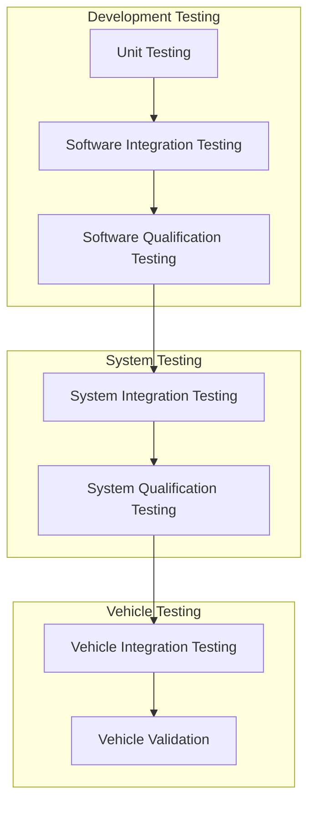
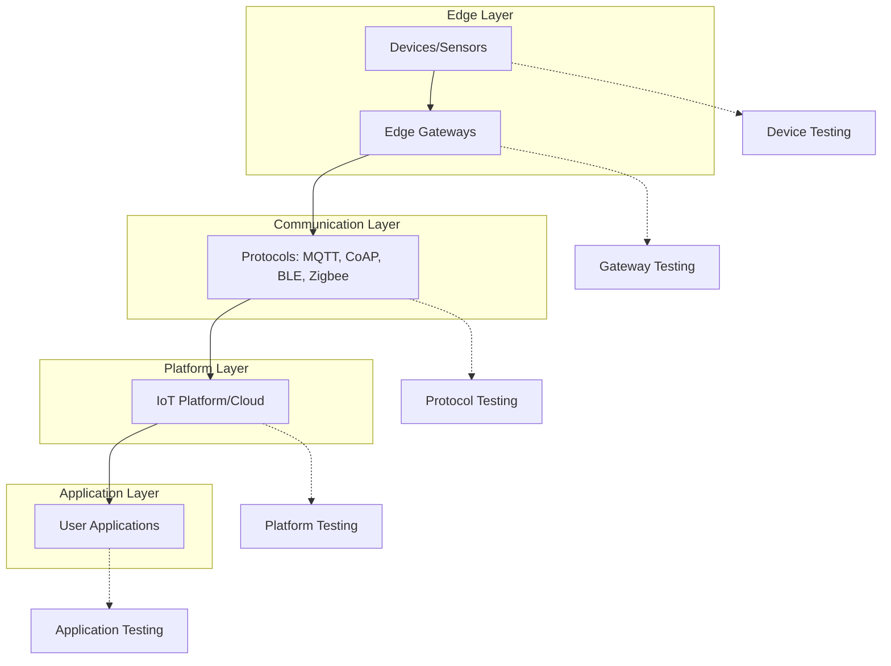
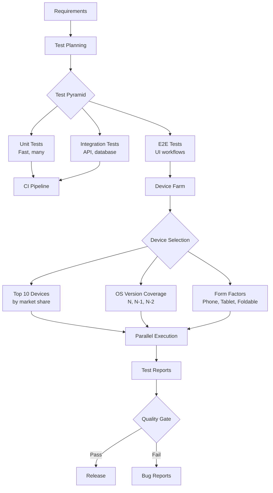
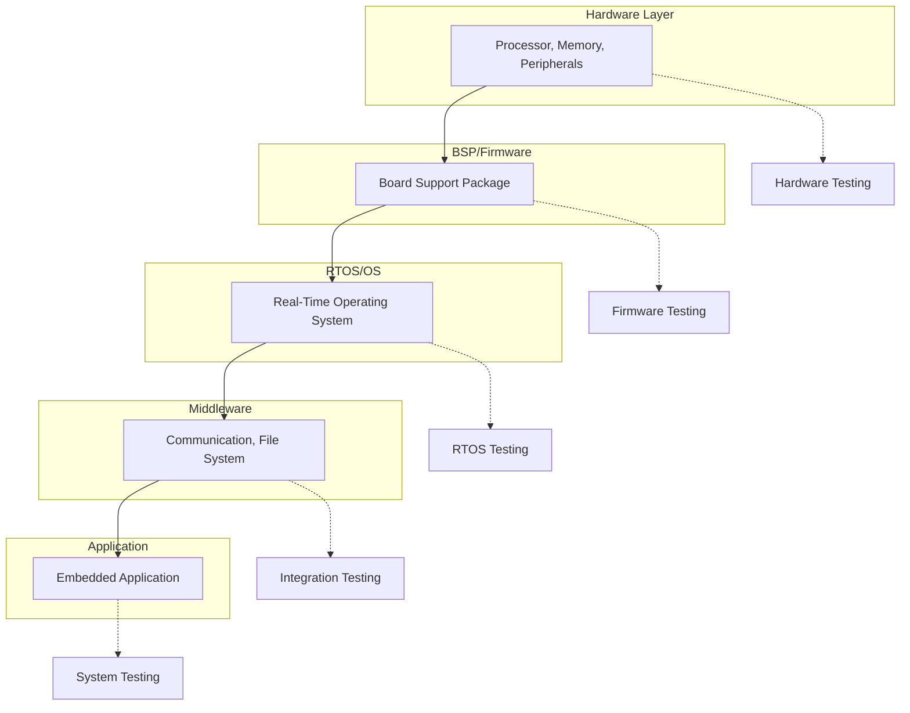
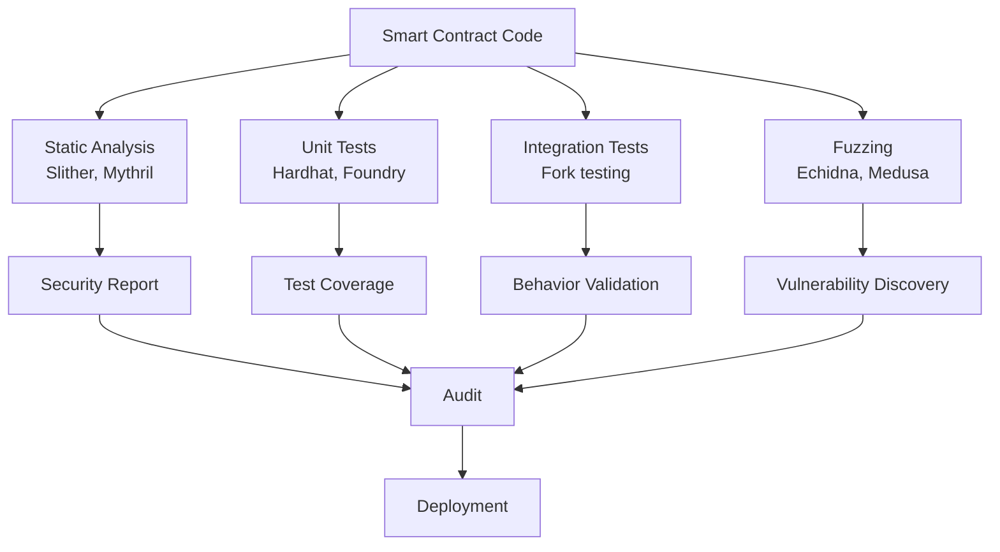
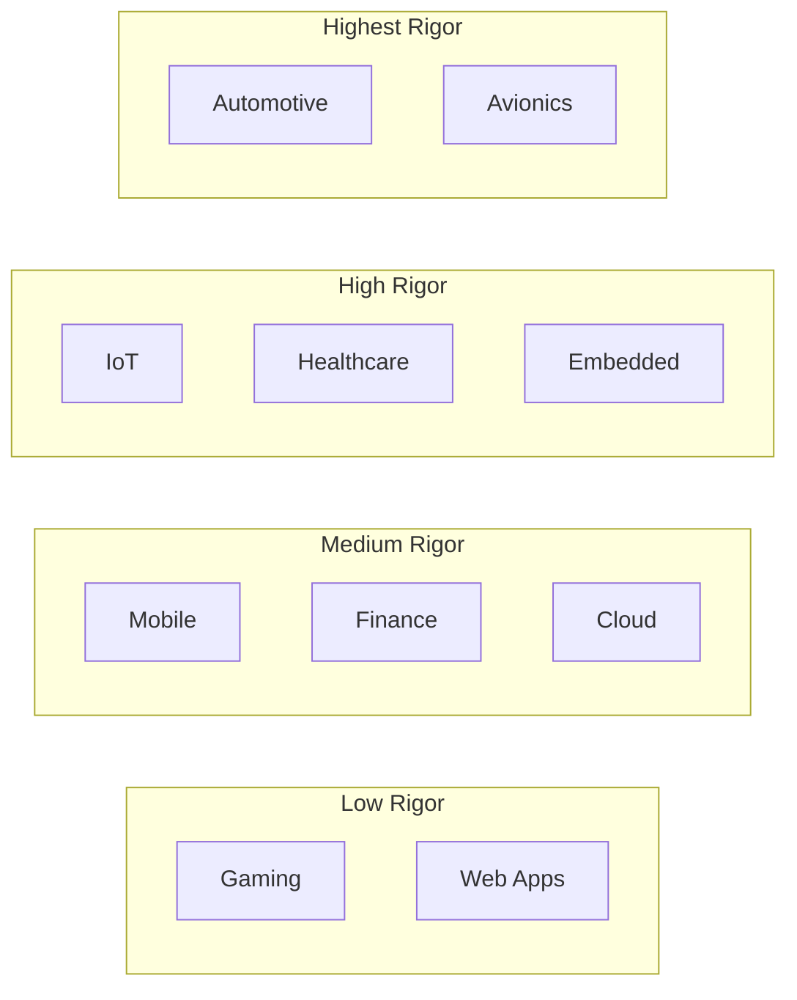
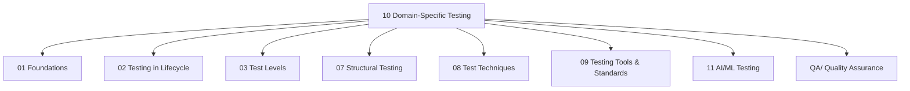

# Domain-Specific Testing

> **SWEBOK KA 5.6** - Domain-Specific Testing
> This note covers testing challenges, practices, standards, and techniques specific to critical application domains where software failures can have severe consequences.

---

## Table of Contents

- [[#1. Overview]]
- [[#2. Automotive Testing]]
- [[#3. IoT Testing]]
- [[#4. Healthcare Testing]]
- [[#5. Mobile Testing]]
- [[#6. Avionics Testing]]
- [[#7. Finance Testing]]
- [[#8. Gaming Testing]]
- [[#9. Embedded and Real-Time Systems Testing]]
- [[#10. Cloud Testing]]
- [[#11. Blockchain Testing]]
- [[#12. Cross-Domain Comparison]]
- [[#13. Relationships to Other KAs]]

---

## 1. Overview

Domain-specific testing addresses the unique challenges, standards, and practices that emerge when software operates in specialized contexts. While general testing principles from [[01_Foundations_of_Testing|Foundations of Testing]] apply universally, each domain introduces constraints related to:

- **Regulatory compliance**: Mandatory standards (ISO 26262, DO-178C, IEC 62304)
- **Safety requirements**: Human life or physical harm implications
- **Environmental constraints**: Hardware integration, network variability, resource limits
- **Domain-specific failure modes**: Timing faults, protocol violations, data integrity
- **Specialized tooling**: Hardware-in-the-loop simulators, protocol analyzers, domain-specific frameworks

**Domain impact on testing:**

| Domain | Safety Critical | Regulatory | Real-Time | Hardware Integration | Data Sensitivity |
|--------|----------------|------------|-----------|---------------------|-----------------|
| Automotive | Yes | ISO 26262 | Yes | Yes | Moderate |
| IoT | Varies | FCC, CE | Often | Yes | Moderate |
| Healthcare | Yes | FDA, IEC 62304 | Often | Often | HIPAA |
| Mobile | No | App stores | No | Limited | Moderate |
| Avionics | Yes | DO-178C | Yes | Yes | High |
| Finance | No | SOX, PCI-DSS | Often | No | Very High |
| Gaming | No | ESRB | Yes | GPU/Controller | Low |
| Embedded/RTOS | Often | Varies | Yes | Yes | Varies |
| Cloud | No | SOC2 | No | No | Varies |
| Blockchain | No | Emerging | No | No | Public |

---

## 2. Automotive Testing

### 2.1 ISO 26262 Overview

**ISO 26262** (Road vehicles - Functional safety) is the primary standard for automotive software safety, derived from IEC 61508.

**Automotive Safety Integrity Levels (ASIL):**

| ASIL | Risk Level | Rigor | Example Systems |
|------|-----------|-------|-----------------|
| A | Lowest | Basic | Interior lights, rear camera display |
| B | Low | Moderate | Headlights, cruise control |
| C | High | Rigorous | Adaptive cruise control, lane keeping |
| D | Highest | Most rigorous | Airbags, braking, steering |

**ASIL Testing Requirements:**

| Technique | ASIL A | ASIL B | ASIL C | ASIL D |
|-----------|--------|--------|--------|--------|
| Requirements-based testing | ++ | ++ | ++ | ++ |
| Equivalence classes + BVA | + | ++ | ++ | ++ |
| Fault injection testing | + | + | ++ | ++ |
| Hardware-in-loop testing | + | + | ++ | ++ |
| Back-to-back testing | + | + | + | ++ |
| Boundary value analysis | + | ++ | ++ | ++ |
| Error guessing | + | + | ++ | ++ |
| Statement coverage | ++ | ++ | ++ | ++ |
| Branch coverage | + | ++ | ++ | ++ |
| MC/DC coverage | + | + | ++ | ++ |

(++ = highly recommended, + = recommended)

### 2.2 Safety Testing Levels

### 2.3 HIL Testing

**Hardware-in-the-Loop (HIL)** testing simulates vehicle hardware to test embedded software without physical hardware.

| HIL Component | Purpose |
|---------------|---------|
| Real-time simulator | Executes vehicle models (engine, transmission, etc.) |
| I/O interface | Connects to ECU (Electronic Control Unit) under test |
| Fault injection unit | Simulates sensor failures, bus errors |
| Signal conditioning | Adapts signals between simulator and ECU |
| Test automation | Executes test sequences, collects results |

**HIL Test Scenarios:**

| Scenario | What It Tests | Example |
|----------|--------------|---------|
| Sensor failure | ECU response to faulty input | Wheel speed sensor dropout |
| Bus communication | CAN/LIN protocol handling | Message timeout, corruption |
| Power supply | Voltage variations, cranking | Cold start, battery drain |
| Environmental | Temperature, vibration effects | Component behavior across range |
| Diagnostic | OBD-II compliance | DTC setting, readiness monitors |

### 2.4 Automotive Testing Challenges

| Challenge | Description | Mitigation |
|-----------|-------------|------------|
| **ECU complexity** | Modern vehicles have 100+ ECUs | Modular testing, HIL simulation |
| **Real-time constraints** | Strict timing requirements | Worst-case execution time analysis |
| **Over-the-air updates** | Software updates to vehicles | Staged rollout, rollback capability |
| **V2X communication** | Vehicle-to-everything protocols | Protocol conformance, security testing |
| **Autonomous driving** | ML-based perception | Scenario-based testing, simulation |
| **Interoperability** | Multi-vendor systems | Interface testing, standard compliance |

---

## 3. IoT Testing

### 3.1 IoT Architecture and Test Levels

### 3.2 IoT Testing Categories

| Category | Focus | Techniques |
|----------|-------|------------|
| **Device testing** | Firmware, sensors, actuators | Hardware-in-loop, power testing |
| **Protocol testing** | MQTT, CoAP, BLE, Zigbee, LoRaWAN | Conformance, interoperability |
| **Edge testing** | Gateway logic, local processing | Latency, failover |
| **Cloud testing** | Platform scalability, data ingestion | Load testing, data integrity |
| **Security testing** | Device auth, data encryption | Penetration, fuzzing |
| **Power testing** | Battery life, energy harvesting | Endurance, power profiling |

### 3.3 Protocol Testing

| Protocol | Layer | Testing Focus |
|----------|-------|---------------|
| MQTT | Application (pub/sub) | QoS levels, retained messages, will messages |
| CoAP | Application (REST) | Confirmable/non-confirmable, observe |
| BLE | Link layer | Pairing, bonding, GATT services |
| Zigbee | Network | Mesh routing, device discovery |
| LoRaWAN | MAC | Class A/B/C, duty cycle compliance |
| Thread | Network | Mesh formation, commissioning |
| Matter | Application | Multi-admin, fabric management |

### 3.4 IoT-Specific Challenges

| Challenge | Description | Testing Approach |
|-----------|-------------|-----------------|
| **Device heterogeneity** | Thousands of device types | Compatibility matrix, device farms |
| **Network variability** | Intermittent connectivity | Network simulation, offline testing |
| **Scale** | Millions of devices | Simulated device farms, stress testing |
| **Firmware updates** | OTA update reliability | Fail-safe testing, rollback testing |
| **Battery life** | Power-constrained devices | Power profiling, sleep mode testing |
| **Physical access** | Devices in remote locations | Remote diagnostics, self-test mechanisms |
| **Security** | Resource-constrained crypto | Lightweight crypto verification, key management testing |

---

## 4. Healthcare Testing

### 4.1 Regulatory Framework

| Standard/Regulation | Scope | Testing Implications |
|---------------------|-------|---------------------|
| **FDA 21 CFR Part 11** | Electronic records | Audit trails, electronic signatures |
| **IEC 62304** | Medical device software | Software lifecycle, risk classification |
| **IEC 62366** | Usability engineering | Usability testing, use error analysis |
| **ISO 14971** | Risk management | Risk-based testing, hazard analysis |
| **HIPAA** | Data privacy | PHI protection, access controls |
| **HL7 FHIR** | Health data exchange | Interoperability testing |

### 4.2 IEC 62304 Software Safety Classification

| Class | Risk Level | Documentation | Testing Rigor |
|-------|-----------|---------------|---------------|
| A | No injury possible | Minimal | Basic testing |
| B | Non-serious injury | Moderate | Systematic testing |
| C | Death or serious injury | Comprehensive | Rigorous testing |

**IEC 62304 Process Requirements by Class:**

| Activity | Class A | Class B | Class C |
|----------|---------|---------|---------|
| Software development planning | Required | Required | Required |
| Requirements analysis | Required | Required | Required |
| Architectural design | Required | Required | Required |
| Detailed design | Optional | Required | Required |
| Unit implementation | Required | Required | Required |
| Unit testing | Optional | Required | Required |
| Integration testing | Required | Required | Required |
| System testing | Required | Required | Required |
| Risk management | Required | Required | Required |
| Configuration management | Required | Required | Required |
| Problem resolution | Required | Required | Required |

### 4.3 Healthcare-Specific Testing

| Test Type | Focus | Example |
|-----------|-------|---------|
| **Clinical validation** | Does it work in clinical context? | Diagnostic accuracy studies |
| **Interoperability** | HL7 FHIR conformance | EHR data exchange |
| **Usability** | Use error prevention | Alarm fatigue, workflow integration |
| **Privacy** | PHI protection | De-identification, encryption |
| **Reliability** | 24/7 availability | Failover, disaster recovery |
| **Audit trail** | Regulatory compliance | Complete traceability |

### 4.4 HIPAA Compliance Testing

| Requirement | Testing Focus |
|-------------|---------------|
| **Access controls** | Role-based access, minimum necessary |
| **Audit controls** | Log all access to PHI |
| **Transmission security** | Encryption in transit (TLS) |
| **Integrity controls** | Detection of PHI modification |
| **Person/entity authentication** | Multi-factor authentication |
| **Automatic logoff** | Session timeout enforcement |

---

## 5. Mobile Testing

### 5.1 Mobile Testing Challenges

| Challenge | Description | Impact |
|-----------|-------------|--------|
| **Device fragmentation** | Thousands of device/OS combinations | Massive compatibility matrix |
| **Screen diversity** | Sizes, resolutions, aspect ratios | UI layout testing |
| **Touch interactions** | Gestures, multi-touch, pressure | Gesture testing complexity |
| **Network conditions** | 3G/4G/5G, WiFi, offline | Network simulation required |
| **Battery constraints** | Power consumption impact | Battery profiling |
| **OS versions** | Rapid OS update cycles | Version compatibility |
| **App store requirements** | Store-specific guidelines | Submission testing |

### 5.2 Mobile Test Types

| Test Type | Focus | Tools |
|-----------|-------|-------|
| **Functional** | Feature correctness | Appium, Espresso, XCUITest |
| **Compatibility** | Device/OS matrix | Firebase Test Lab, BrowserStack |
| **Performance** | App startup, memory, CPU | Android Profiler, Instruments |
| **Usability** | Touch gestures, navigation | Manual testing, heatmaps |
| **Interrupt** | Calls, notifications, low battery | Automated interrupt injection |
| **Network** | Offline, slow, switching | Charles Proxy, Network Link Conditioner |
| **Localization** | Languages, RTL, date formats | Pseudolocalization testing |
| **Security** | Data storage, communication | MobSF, Drozer |

### 5.3 Mobile Testing Strategy

### 5.4 Mobile Performance Metrics

| Metric | Target | Measurement |
|--------|--------|-------------|
| App startup time | < 2 seconds | Time from launch to interactive |
| Frame rate | 60 fps (16.67ms/frame) | GPU profiling |
| Memory usage | < 100MB typical | Memory profiler |
| Battery drain | < 5% per hour active | Battery historian |
| App size | < 50MB download | Build analysis |
| Network requests | Minimize, batch | Network profiler |
| Crash rate | < 1% sessions | Crash reporting |

---

## 6. Avionics Testing

### 6.1 DO-178C Overview

**DO-178C** (Software Considerations in Airborne Systems and Equipment Certification) is the primary standard for avionics software.

**Software Levels (Design Assurance Levels):**

| Level | Failure Condition | Objectives | Example |
|-------|------------------|------------|---------|
| A | Catastrophic | 71 | Flight control, engine control |
| B | Hazardous | 69 | Flight management, thrust reversal |
| C | Major | 62 | Cabin pressure, autopilot |
| D | Minor | 26 | Passenger entertainment |
| E | No effect | 0 | Non-aviation software |

### 6.2 DO-178C Testing Objectives

| Objective | Level A | Level B | Level C | Level D |
|-----------|---------|---------|---------|---------|
| Requirements-based testing | Yes | Yes | Yes | Yes |
| Normal range test cases | Yes | Yes | Yes | Yes |
| Robustness test cases | Yes | Yes | Yes | No |
| Statement coverage | Yes | Yes | Yes | Yes |
| Decision coverage | Yes | Yes | Yes | No |
| MC/DC coverage | Yes | No | No | No |
| Data coupling testing | Yes | Yes | No | No |
| Control coupling testing | Yes | Yes | Yes | No |

### 6.3 Formal Methods in Avionics

**DO-333** (Formal Methods Supplement to DO-178C) provides guidance for using formal methods as evidence for certification.

| Formal Method | Application | Benefit |
|---------------|-------------|---------|
| **Model checking** | State space exploration | Exhaustive verification |
| **Theorem proving** | Mathematical proofs of properties | Highest assurance |
| **Abstract interpretation** | Runtime error detection | Sound static analysis |
| **Refinement** | Specification to implementation | Correctness by construction |

### 6.4 Avionics Testing Challenges

| Challenge | Description | Approach |
|-----------|-------------|----------|
| **Hardware-software interaction** | Tight coupling with avionics hardware | HIL testing, simulation |
| **Real-time constraints** | Hard deadlines for safety-critical functions | Worst-case timing analysis |
| **Environmental conditions** | Temperature, vibration, radiation | Environmental testing |
| **Certification evidence** | Regulatory approval requirements | Traceability, independence |
| **Regression** | Any change requires re-certification | Impact analysis, selective re-testing |

---

## 7. Finance Testing

### 7.1 Regulatory Requirements

| Regulation | Scope | Testing Focus |
|------------|-------|---------------|
| **SOX (Sarbanes-Oxley)** | Financial reporting | Internal controls, audit trails |
| **PCI-DSS** | Payment card data | Encryption, access controls, scanning |
| **Basel III** | Banking risk | Stress testing, risk models |
| **MiFID II** | Investment services | Transaction reporting, best execution |
| **GDPR** | Data privacy | Consent management, data portability |
| **Dodd-Frank** | Derivatives | Trade reporting, margin requirements |

### 7.2 Financial Testing Categories

| Category | Focus | Techniques |
|----------|-------|------------|
| **Transaction integrity** | Correctness of financial calculations | Exact-match validation, reconciliation |
| **Performance under load** | Trading system throughput | High-frequency load testing |
| **Failover/recovery** | Business continuity | Disaster recovery testing |
| **Compliance** | Regulatory adherence | Compliance validation suites |
| **Security** | Financial data protection | Penetration, fraud simulation |
| **Batch processing** | End-of-day, settlement | Batch job validation |
| **Data migration** | System upgrades | Parallel run testing |

### 7.3 Financial Performance Testing

| Metric | Trading System | Banking System | Payment System |
|--------|---------------|----------------|----------------|
| Throughput | 1M+ orders/sec | 10K+ tx/sec | 50K+ tx/sec |
| Latency | < 1ms | < 100ms | < 500ms |
| Availability | 99.999% | 99.99% | 99.99% |
| Recovery time | < 1 min | < 15 min | < 5 min |

### 7.4 Financial Testing Challenges

| Challenge | Description | Mitigation |
|-----------|-------------|------------|
| **Calculation accuracy** | Floating-point precision | Decimal arithmetic, exact comparison |
| **Regulatory change** | Frequent rule updates | Configurable compliance rules |
| **High-frequency trading** | Ultra-low latency requirements | Latency profiling, co-location testing |
| **Cross-system reconciliation** | Multiple systems must agree | Automated reconciliation |
| **Fraud detection** | Must catch fraudulent patterns | A/B testing of fraud models |

---

## 8. Gaming Testing

### 8.1 Game Testing Categories

| Category | Focus | Techniques |
|----------|-------|------------|
| **Functional** | Game mechanics, quests, items | Systematic playthrough, boundary testing |
| **Performance** | Frame rate, load times | Profiling across hardware |
| **Compatibility** | GPU, driver, resolution matrix | Automated compatibility suite |
| **Multiplayer** | Networking, synchronization | Simulated players, latency injection |
| **Localization** | Languages, cultural adaptation | Pseudolocalization, cultural review |
| **Balance** | Game economy, difficulty | Simulation, analytics |
| **Regression** | Updates don't break existing | Automated regression suite |
| **Player experience** | Fun, engagement, onboarding | Playtesting, analytics |

### 8.2 Game Performance Testing

| Metric | Target | Measurement |
|--------|--------|-------------|
| Frame rate | 30/60/120 fps | GPU profiler |
| Frame time consistency | Low jitter | Percentile analysis (P99) |
| Load times | < 5 seconds | Timer instrumentation |
| Memory usage | Within platform budget | Memory profiler |
| Draw calls | < platform limit | Render profiler |
| Network bandwidth | Within budget | Packet analysis |
| Latency (multiplayer) | < 100ms RTT | Network simulation |

### 8.3 Game-Specific Challenges

| Challenge | Description | Testing Approach |
|-----------|-------------|-----------------|
| **Non-determinism** | Random events, physics | Seed-controlled testing |
| **Large state space** | Many possible game states | Automated playthrough, fuzzing |
| **Real-time constraints** | 16.67ms frame budget | Performance profiling |
| **Platform diversity** | PC hardware, consoles, mobile | Multi-platform CI |
| **Live service** | Always-online, patches | Canary deployments, hotfix testing |
| **Anti-cheat** | Cheat detection | Cheat simulation, security testing |

---

## 9. Embedded and Real-Time Systems Testing

### 9.1 Embedded System Testing Layers

### 9.2 Real-Time Testing Concerns

| Concern | Description | Testing Approach |
|---------|-------------|-----------------|
| **Timing constraints** | Deadlines must be met | Worst-case execution time (WCET) analysis |
| **Determinism** | Same input produces same output at same time | Repeated execution testing |
| **Priority inversion** | Low-priority task blocks high-priority | Priority inheritance testing |
| **Resource contention** | Shared resources, mutexes | Concurrency testing |
| **Interrupt handling** | Interrupt latency, nesting | Interrupt storm testing |
| **Stack overflow** | Limited stack size | Stack usage analysis |
| **Memory leaks** | No dynamic allocation often | Static analysis, memory profiling |

### 9.3 HIL Testing for Embedded

| Component | Purpose |
|-----------|---------|
| Target hardware | Actual processor/board under test |
| Stimulus generators | Simulated sensors, inputs |
| Response analyzers | Measure outputs, timing |
| Fault injection | Simulate hardware faults |
| Environment model | Simulate physical environment |
| Test controller | Orchestrate test execution |

### 9.4 Embedded Testing Challenges

| Challenge | Description | Mitigation |
|-----------|-------------|------------|
| **Resource constraints** | Limited memory, CPU, power | Static analysis, profiling |
| **Hardware dependency** | Need physical hardware | Simulation, emulation, HIL |
| **Real-time verification** | Timing correctness | Formal timing analysis |
| **Firmware updates** | Field update mechanisms | Fail-safe update testing |
| **Long lifecycle** | 10-20 year product life | Regression testing, backward compatibility |

---

## 10. Cloud Testing

### 10.1 Cloud Testing Dimensions

| Dimension | Focus | Techniques |
|-----------|-------|------------|
| **Multi-tenancy** | Isolation, noisy neighbors | Load isolation testing |
| **Elastic scaling** | Auto-scaling behavior | Spike testing, scale testing |
| **Service availability** | SLA compliance | Chaos engineering, failover |
| **Data sovereignty** | Geographic data placement | Compliance testing |
| **Provider lock-in** | Portability | Multi-cloud testing, abstraction |
| **Cost optimization** | Resource efficiency | Cost monitoring, right-sizing |

### 10.2 Cloud-Specific Testing

| Test Type | Purpose | Tools |
|-----------|---------|-------|
| **Infrastructure testing** | IaC validation | Terraform plan/apply, CloudFormation |
| **Container testing** | Image, orchestration | Hadolint, kube-bench, kind |
| **Serverless testing** | Function behavior, cold start | SAM local, Serverless Framework |
| **Service mesh testing** | Traffic management | Istio testing, fault injection |
| **Chaos testing** | Resilience verification | Chaos Monkey, Litmus, Gremlin |
| **Cost testing** | Budget compliance | Infracost, cloud cost estimators |

### 10.3 Cloud Testing Challenges

| Challenge | Description | Approach |
|-----------|-------------|----------|
| **Environment parity** | Dev/staging/prod differences | IaC, environment templates |
| **Ephemeral resources** | Resources created/destroyed | Test environment management |
| **Network variability** | Latency, packet loss | Network simulation |
| **Service dependencies** | Third-party APIs | Service virtualization, contract testing |
| **Observability** | Distributed tracing | OpenTelemetry, structured logging |
| **Cost** | Testing at scale is expensive | Synthetic monitoring, sampling |

---

## 11. Blockchain Testing

### 11.1 Blockchain Testing Categories

| Category | Focus | Techniques |
|----------|-------|------------|
| **Smart contract testing** | Contract logic, security | Unit testing, formal verification |
| **Consensus testing** | Agreement mechanism | Simulation, adversarial testing |
| **Performance testing** | TPS, finality | Load testing, benchmarking |
| **Security testing** | Vulnerabilities, attacks | Audit, fuzzing, formal methods |
| **Interoperability** | Cross-chain communication | Bridge testing, protocol conformance |
| **Node testing** | Network participation | Network simulation |

### 11.2 Smart Contract Testing

### 11.3 Blockchain-Specific Challenges

| Challenge | Description | Testing Approach |
|-----------|-------------|-----------------|
| **Immutability** | Cannot patch deployed contracts | Thorough pre-deployment testing |
| **Gas optimization** | Transaction costs | Gas profiling, optimization testing |
| **Reentrancy** | Classic vulnerability | Static analysis, pattern detection |
| **Front-running** | Transaction ordering attacks | MEV simulation |
| **Oracle manipulation** | External data feeds | Oracle testing, circuit breakers |
| **Upgradability** | Proxy patterns | Upgrade testing, storage layout verification |

---

## 12. Cross-Domain Comparison

### 12.1 Testing Rigor Comparison

### 12.2 Domain-Specific Standards Summary

| Domain | Primary Standards | Testing Standards |
|--------|------------------|-------------------|
| Automotive | ISO 26262, AUTOSAR | ISO 26262 Part 6 |
| IoT | IEEE 2413, oneM2M | Protocol-specific (MQTT, CoAP) |
| Healthcare | IEC 62304, FDA 21 CFR | IEC 62304, IEC 62366 |
| Mobile | Platform guidelines | App store review guidelines |
| Avionics | DO-178C, DO-254 | DO-178C, DO-330 |
| Finance | SOX, PCI-DSS, Basel III | PCI-DSS scanning requirements |
| Gaming | ESRB, platform cert | Platform certification requirements |
| Embedded | IEC 61508, MISRA | IEC 61508 SIL requirements |
| Cloud | SOC2, ISO 27001 | Cloud-native testing practices |
| Blockchain | Emerging regulations | Smart contract audit standards |

### 12.3 Common Testing Needs Across Domains

Despite domain differences, several testing needs are universal:

| Need | Description | Relevance |
|------|-------------|-----------|
| **Traceability** | Link requirements to tests | All safety-critical domains |
| **Test automation** | Repeatable, efficient testing | All domains |
| **Risk-based testing** | Focus on highest-risk areas | All domains |
| **Continuous integration** | Fast feedback loops | All modern domains |
| **Performance testing** | System meets SLAs | All domains |
| **Security testing** | Protection against threats | All domains handling sensitive data |

---

## 13. Relationships to Other KAs

**Cross-references:**
- [[01_Foundations_of_Testing|Foundations of Testing]]: Core concepts apply to all domains
- [[02_Testing_in_the_Software_Lifecycle|Testing in the Software Lifecycle]]: Domain standards dictate lifecycle processes
- [[03_Test_Levels|Test Levels]]: Domain requirements determine test level emphasis
- [[07_Structural_Testing_Techniques|Structural Testing Techniques]]: Coverage requirements vary by domain safety level
- [[08_Test_Techniques|Test Techniques]]: Techniques adapted for domain contexts
- [[09_Testing_Tools_and_Standards|Testing Tools and Standards]]: Domain-specific tools and standards
- [[11_AI_ML_Testing_and_Emerging|AI/ML Testing and Emerging]]: AI testing in autonomous vehicles, healthcare AI
- [[QA/|Quality Assurance]]: Quality standards and processes

---

## See Also

- [[01_Foundations_of_Testing|Foundations of Testing]]
- [[03_Test_Levels|Test Levels]]
- [[08_Test_Techniques|Test Techniques]]
- [[09_Testing_Tools_and_Standards|Testing Tools and Standards]]
- [[11_AI_ML_Testing_and_Emerging|AI/ML Testing and Emerging]]

---

## References

1. SWEBOK v4, Chapter 05: Software Testing
2. ISO 26262:2018, Road vehicles - Functional safety
3. DO-178C:2011, Software Considerations in Airborne Systems and Equipment Certification
4. IEC 62304:2006+A1:2015, Medical device software - Software life cycle processes
5. IEC 61508:2010, Functional safety of electrical/electronic/programmable electronic safety-related systems
6. FDA 21 CFR Part 11, Electronic Records; Electronic Signatures
7. PCI-DSS v4.0, Payment Card Industry Data Security Standard
8. ISO/IEC 27001:2022, Information security management systems
9. NIST SP 800-53, Security and Privacy Controls
10. IEEE 2413-2019, Standard for an Architectural Framework for IoT