# AI/ML Testing and Emerging Topics

> **SWEBOK KA 5.7** - Testing AI-Based Systems and Emerging Topics
> This note covers testing challenges unique to AI/ML systems, specialized techniques for validating non-deterministic software, and emerging testing paradigms including chaos engineering and contract testing.

---

## Table of Contents

- [[#1. Overview]]
- [[#2. AI/ML System Testing Challenges]]
- [[#3. Data Quality Testing]]
- [[#4. Model Validation Metrics]]
- [[#5. Metamorphic Testing for ML]]
- [[#6. Fairness and Bias Testing]]
- [[#7. Adversarial Testing]]
- [[#8. MLOps Testing]]
- [[#9. Model Explainability Testing]]
- [[#10. Emerging Testing Topics]]
  - [[#10.1 Chaos Engineering]]
  - [[#10.2 Contract Testing]]
  - [[#10.3 API Testing Patterns]]
  - [[#10.4 IoT Testing Patterns]]
- [[#11. Relationships to Other KAs]]
- [[#12. Summary]]

---

## 1. Overview

AI/ML systems present fundamentally different testing challenges compared to traditional software. While conventional software follows deterministic logic where the same input always produces the same output, ML systems learn patterns from data and exhibit non-deterministic, data-dependent behavior.

**Key differences between traditional and AI/ML testing:**

| Aspect | Traditional Software | AI/ML Systems |
|--------|---------------------|---------------|
| **Behavior source** | Explicitly coded rules | Learned from data |
| **Determinism** | Deterministic | Probabilistic |
| **Test oracle** | Specification available | No explicit specification |
| **Failure mode** | Logic errors | Data quality, model drift |
| **Correctness** | Binary (pass/fail) | Statistical (accuracy %) |
| **Coverage** | Code coverage meaningful | Code coverage insufficient |
| **Maintenance** | Code changes | Data and model changes |
| **Explainability** | Traceable logic | Black-box decisions |

**Testing pyramid for AI/ML:**

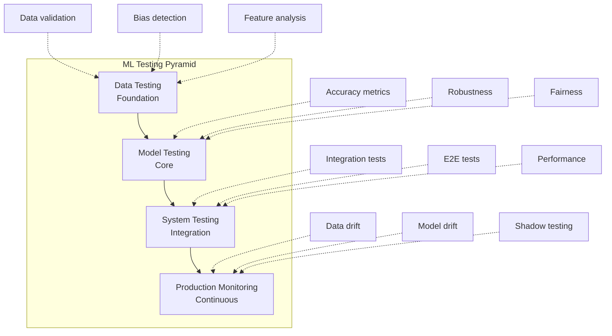

---

## 2. AI/ML System Testing Challenges

### 2.1 Core Challenges

| Challenge | Description | Impact |
|-----------|-------------|--------|
| **Non-deterministic outputs** | Same input may produce different outputs (stochastic models) | Cannot use traditional pass/fail assertions |
| **Data-dependent behavior** | Model behavior depends on training data distribution | Test data may not represent production |
| **No explicit specification** | No formal specification of expected behavior | Oracle problem is fundamental |
| **Distribution shift** | Production data differs from training data | Model performance degrades silently |
| **Emergent behavior** | Complex interactions in deep learning | Difficult to predict failure modes |
| **Adversarial sensitivity** | Small input perturbations cause large output changes | Security and reliability concerns |
| **Feedback loops** | Model predictions influence future data | Bias amplification |
| **Explainability gap** | Cannot trace decisions to specific logic | Debugging and compliance challenges |

### 2.2 Testing Strategy for AI/ML

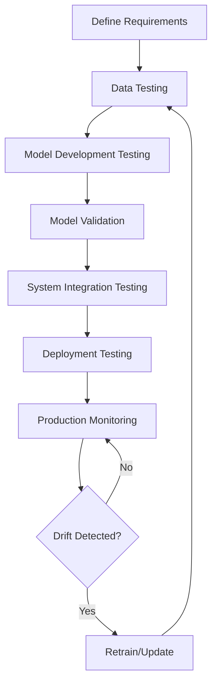

### 2.3 AI/ML Test Categories

| Category | What It Tests | When |
|----------|--------------|------|
| **Data tests** | Training data quality, distribution | Before training |
| **Feature tests** | Feature engineering correctness | During development |
| **Model tests** | Model performance, fairness, robustness | After training |
| **Integration tests** | Model in system context | Before deployment |
| **Inference tests** | Production serving correctness | During deployment |
| **Monitoring tests** | Ongoing model health | In production |

---

## 3. Data Quality Testing

Data quality is the foundation of ML system reliability. "Garbage in, garbage out" applies with particular force to ML.

### 3.1 Data Validation Dimensions

| Dimension | Description | Testing Approach |
|-----------|-------------|-----------------|
| **Completeness** | No missing values where required | Null checks, missing value analysis |
| **Accuracy** | Values reflect reality | Cross-reference validation, outlier detection |
| **Consistency** | Same entity represented consistently | Deduplication, format validation |
| **Timeliness** | Data is current | Freshness checks, staleness detection |
| **Validity** | Values within acceptable ranges | Schema validation, range checks |
| **Uniqueness** | No duplicate records | Duplicate detection |

### 3.2 Training Data Validation

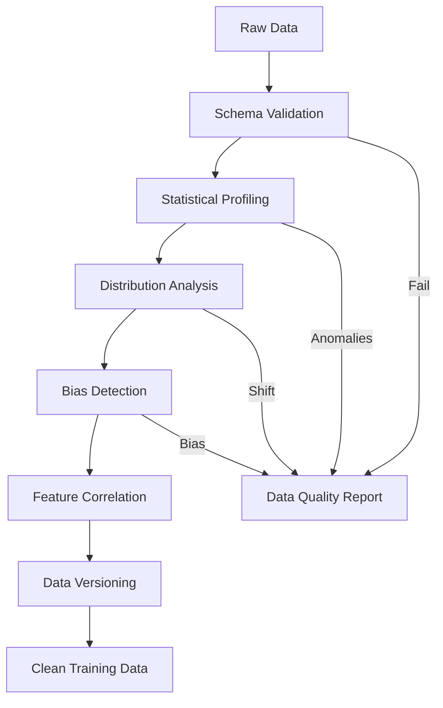

**Data validation checks:**

| Check | Purpose | Tool |
|-------|---------|------|
| Schema validation | Column types, required fields | Great Expectations, Pandera |
| Statistical profiling | Distributions, correlations | pandas-profiling, ydata-profiling |
| Data drift detection | Distribution changes over time | Alibi Detect, Evidently |
| Bias detection | Protected attribute imbalance | Aequitas, Fairlearn |
| Feature importance | Relevant features identified | SHAP, permutation importance |
| Data leakage | Target information in features | Manual analysis, correlation |

### 3.3 Data Drift Detection

| Drift Type | Description | Detection Method |
|------------|-------------|-----------------|
| **Covariate drift** | P(X) changes | KS test, PSI, MMD |
| **Prior probability drift** | P(Y) changes | Proportion tests |
| **Concept drift** | P(Y|X) changes | Performance monitoring |
| **Feature drift** | Individual feature distributions | Per-feature statistical tests |

**Population Stability Index (PSI):**

```
PSI = Σ (Actual% - Expected%) × ln(Actual% / Expected%)

PSI < 0.1: No significant change
PSI 0.1-0.25: Moderate change, investigate
PSI > 0.25: Significant change, retrain
```

### 3.4 Tools for Data Quality Testing

| Tool | Focus | Key Features |
|------|-------|--------------|
| Great Expectations | Data validation | Expectations, profiling, docs |
| Pandera | DataFrame validation | Type checking, statistical checks |
| Evidently | ML monitoring | Drift reports, data quality |
| Deepchecks | ML validation | Train-test checks, model evaluation |
| TFDV (TensorFlow) | TF data validation | Schema, skew, drift |

---

## 4. Model Validation Metrics

### 4.1 Classification Metrics

| Metric | Formula | Interpretation | When to Use |
|--------|---------|----------------|-------------|
| **Accuracy** | (TP+TN)/(TP+TN+FP+FN) | Overall correctness | Balanced classes |
| **Precision** | TP/(TP+FP) | Of predicted positive, how many correct | Cost of false positive high |
| **Recall (Sensitivity)** | TP/(TP+FN) | Of actual positive, how many found | Cost of false negative high |
| **F1 Score** | 2×(Precision×Recall)/(Precision+Recall) | Harmonic mean of precision and recall | Imbalanced classes |
| **Specificity** | TN/(TN+FP) | Of actual negative, how many correct | Need to avoid false alarms |
| **AUC-ROC** | Area under ROC curve | Discrimination ability across thresholds | Threshold-independent evaluation |
| **AUC-PR** | Area under PR curve | Precision-recall tradeoff | Highly imbalanced classes |
| **Cohen's Kappa** | (p_o-p_e)/(1-p_e) | Agreement beyond chance | Multi-class, imbalanced |
| **Matthews Correlation** | (TP×TN-FP×FN)/√((TP+FP)(TP+FN)(TN+FP)(TN+FN)) | Balanced measure for imbalanced data | Binary classification |

**Confusion Matrix:**

|  | Predicted Positive | Predicted Negative |
|--|-------------------|-------------------|
| **Actual Positive** | True Positive (TP) | False Negative (FN) |
| **Actual Negative** | False Positive (FP) | True Negative (TN) |

### 4.2 Regression Metrics

| Metric | Formula | Interpretation |
|--------|---------|----------------|
| **MAE** | Mean(\|y - ŷ\|) | Average absolute error |
| **MSE** | Mean((y - ŷ)²) | Average squared error |
| **RMSE** | √MSE | Error in original units |
| **R²** | 1 - SS_res/SS_tot | Proportion of variance explained |
| **MAPE** | Mean(\|y - ŷ\|/\|y\|) × 100 | Percentage error |
| **Median AE** | Median(\|y - ŷ\|) | Robust to outliers |

### 4.3 Ranking and Recommendation Metrics

| Metric | Description | Use Case |
|--------|-------------|----------|
| **NDCG** | Normalized Discounted Cumulative Gain | Search ranking |
| **MAP** | Mean Average Precision | Information retrieval |
| **MRR** | Mean Reciprocal Rank | Question answering |
| **Hit Rate** | Proportion with correct item in top-K | Recommendation |
| **Coverage** | Proportion of items recommended | Recommendation diversity |

### 4.4 Metric Selection Guide

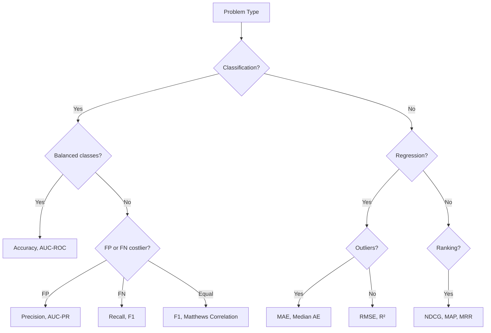

### 4.5 Statistical Significance Testing

When comparing models, statistical tests determine if differences are significant.

| Test | Use Case | Assumption |
|------|----------|------------|
| **Paired t-test** | Compare two models on same data | Normal distribution of differences |
| **Wilcoxon signed-rank** | Non-parametric paired comparison | No normality assumption |
| **McNemar's test** | Compare classification errors | Binary classification |
| **5×2 cv paired t-test** | Cross-validated comparison | Handles Type I error inflation |
| **Bootstrap** | Confidence intervals for metrics | No distributional assumptions |

---

## 5. Metamorphic Testing for ML

### 5.1 The Oracle Problem for ML

The **oracle problem** is particularly acute for ML: there is no explicit specification defining the correct output for every input. Metamorphic testing addresses this by defining relations between inputs and their expected outputs.

### 5.2 Metamorphic Relations

A **metamorphic relation (MR)** specifies how the output should change when the input is transformed.

| Domain | Metamorphic Relation | Example |
|--------|---------------------|---------|
| **Image classification** | Rotation invariance | Rotated image should have same label |
| **Image classification** | Translation invariance | Shifted image should have same label |
| **NLP** | Synonym substitution | Replacing words with synonyms should preserve sentiment |
| **NLP** | Case invariance | Lowercase text should have same classification |
| **Search** | Result consistency | Adding irrelevant terms should not change top results significantly |
| **Recommendation** | Permutation invariance | Reordering input should not change recommendations |
| **Regression** | Scaling | Multiplying input by constant should scale output proportionally |
| **Object detection** | Scale invariance | Scaled image should detect same objects |

### 5.3 Metamorphic Testing Process

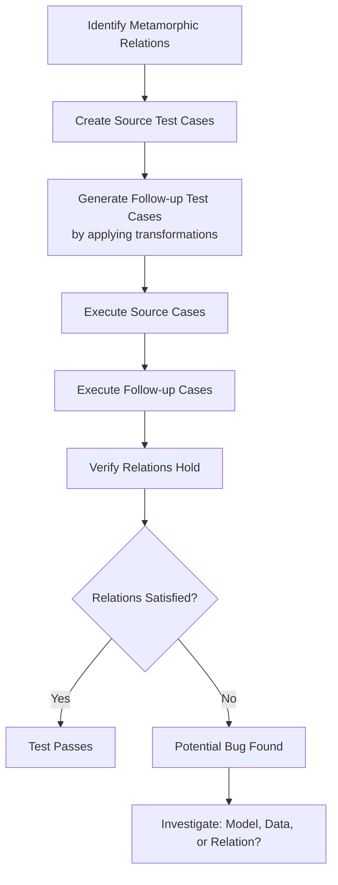

### 5.4 Metamorphic Relation Categories

| Category | Description | Example MR |
|----------|-------------|------------|
| **Invariance** | Output unchanged after transformation | Rotation invariance in image classification |
| **Increasing** | Output increases monotonically | More features should not decrease accuracy |
| **Decreasing** | Output decreases monotonically | More noise should decrease confidence |
| **Permutation** | Output unchanged when order changes | Shuffling features should not change prediction |
| **Compositional** | Combined transformations | Rotation + scaling should preserve classification |
| **Additive** | Adding information | Adding relevant features should not decrease performance |

### 5.5 Tools for Metamorphic Testing

| Tool | Focus | Key Features |
|------|-------|--------------|
| DeepCrime | Deep learning mutation | Metamorphic relation testing |
| DeepTest | Autonomous driving | Image transformation testing |
| TextFooler | NLP adversarial | Text perturbation testing |
| Custom frameworks | Domain-specific | Transformation libraries + assertion |

---

## 6. Fairness and Bias Testing

### 6.1 Types of Bias

| Bias Type | Description | Example |
|-----------|-------------|---------|
| **Historical bias** | Training data reflects past discrimination | Hiring data biased against women |
| **Representation bias** | Underrepresentation of groups | Facial recognition trained on light skin |
| **Measurement bias** | Proxy variables encode bias | ZIP code as proxy for race |
| **Aggregation bias** | One model for diverse populations | Medical model trained on one ethnicity |
| **Evaluation bias** | Benchmark does not represent deployment | Testing on easy demographics |
| **Deployment bias** | Model used for unintended purpose | Credit score used for hiring |

### 6.2 Fairness Metrics

| Metric | Definition | Interpretation |
|--------|-----------|----------------|
| **Demographic parity** | P(Ŷ=1\|A=a) = P(Ŷ=1\|A=b) | Equal positive prediction rates |
| **Equalized odds** | P(Ŷ=1\|Y=y,A=a) = P(Ŷ=1\|Y=y,A=b) | Equal TPR and FPR across groups |
| **Equal opportunity** | P(Ŷ=1\|Y=1,A=a) = P(Ŷ=1\|Y=1,A=b) | Equal TPR across groups |
| **Predictive parity** | P(Y=1\|Ŷ=1,A=a) = P(Y=1\|Ŷ=1,A=b) | Equal precision across groups |
| **Calibration** | P(Y=1\|S=s,A=a) = P(Y=1\|S=s,A=b) | Equal accuracy per score level |
| **Individual fairness** | Similar individuals get similar predictions | Consistency measure |
| **Counterfactual fairness** | Prediction unchanged if protected attribute changed | Causal fairness |

### 6.3 Fairness Testing Process

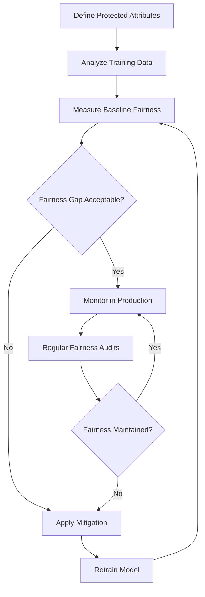

### 6.4 Fairness Mitigation Techniques

| Stage | Technique | Description |
|-------|-----------|-------------|
| **Pre-processing** | Re-sampling | Balance representation in training data |
| **Pre-processing** | Re-weighting | Weight samples to reduce bias |
| **Pre-processing** | Disparate impact remover | Transform features to remove bias |
| **In-processing** | Adversarial debiasing | Adversary tries to predict protected attribute |
| **In-processing** | Fairness constraints | Add fairness penalty to loss function |
| **In-processing** | Prejudice remover | Regularizer for fairness |
| **Post-processing** | Threshold adjustment | Different thresholds per group |
| **Post-processing** | Calibration | Equalize calibration across groups |

### 6.5 Fairness Testing Tools

| Tool | Provider | Key Features |
|------|----------|--------------|
| Fairlearn | Microsoft | Fairness metrics, mitigation algorithms |
| Aequitas | UChicago | Bias audit toolkit |
| AI Fairness 360 | IBM | Comprehensive bias detection and mitigation |
| What-If Tool | Google | Visual fairness exploration |
| Themis-ML | U Washington | Discrimination-aware ML |
| ResponsibleAI | Microsoft | RAI dashboard for model assessment |

---

## 7. Adversarial Testing

### 7.1 Types of Adversarial Attacks

| Attack Type | Stage | Description | Example |
|-------------|-------|-------------|---------|
| **Evasion** | Inference | Modify inputs to cause misclassification | Adversarial images |
| **Poisoning** | Training | Inject malicious training data | Backdoor attacks |
| **Model extraction** | Inference | Steal model by querying | Model stealing |
| **Model inversion** | Inference | Reconstruct training data | Privacy attacks |
| **Membership inference** | Inference | Determine if data was in training | Privacy attacks |
| **Backdoor** | Training | Hidden trigger causes misclassification | Trojan attacks |

### 7.2 Evasion Attack Methods

| Method | Type | Description |
|--------|------|-------------|
| **FGSM** | White-box | Fast Gradient Sign Method, single-step |
| **PGD** | White-box | Projected Gradient Descent, iterative |
| **C&W** | White-box | Carlini & Wagner, optimization-based |
| **DeepFool** | White-box | Minimal perturbation to cross boundary |
| **JSMA** | White-box | Jacobian-based Saliency Map Attack |
| **Boundary Attack** | Black-box | Decision-based, no gradient access |
| **HopSkipJump** | Black-box | Efficient decision-based attack |
| **Square Attack** | Black-box | Score-based, random search |

### 7.3 Adversarial Testing Process

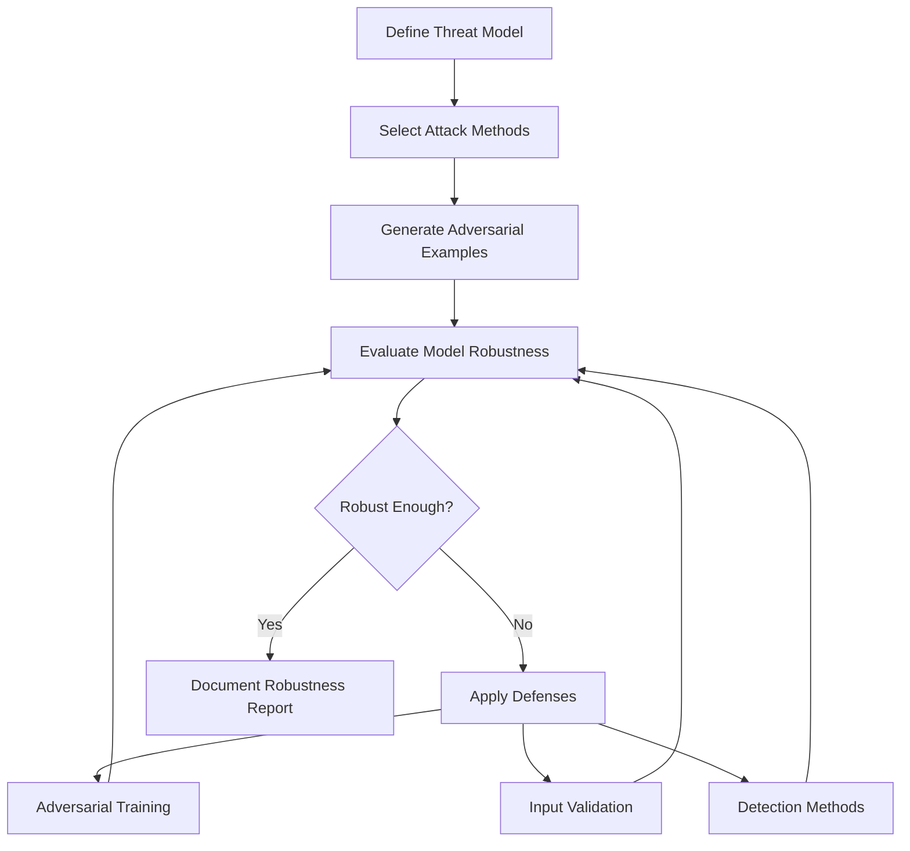

### 7.4 Defense Mechanisms

| Defense | Category | Description |
|---------|----------|-------------|
| **Adversarial training** | Training | Include adversarial examples in training |
| **Input preprocessing** | Inference | Denoising, feature squeezing |
| **Certified defenses** | Training | Provably robust models (randomized smoothing) |
| **Detection** | Inference | Detect adversarial inputs before prediction |
| **Ensemble** | Inference | Multiple models for robustness |
| **Gradient masking** | Training | Obfuscate gradients (limited effectiveness) |

### 7.5 Adversarial Testing Tools

| Tool | Focus | Key Features |
|------|-------|--------------|
| CleverHans | Evasion attacks | FGSM, PGD, C&W implementations |
| Foolbox | Evasion attacks | Multiple frameworks, black/white box |
| ART (Adversarial Robustness Toolbox) | Comprehensive | Attacks, defenses, metrics |
| TextAttack | NLP attacks | Text adversarial examples |
| Robustness Benchmarks | Evaluation | ImageNet-C, CIFAR-10-C |

---

## 8. MLOps Testing

### 8.1 MLOps Testing Layers

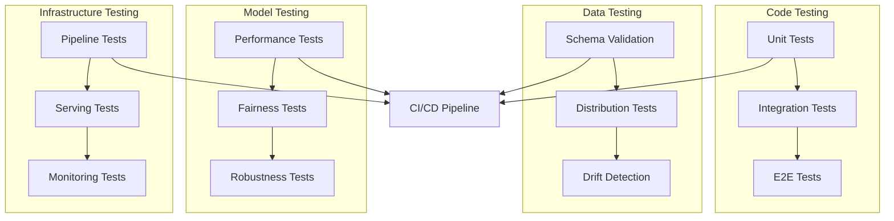

### 8.2 Pipeline Testing

| Test Type | What It Tests | When |
|-----------|--------------|------|
| **Data pipeline tests** | Data ingestion, transformation, validation | Before training |
| **Training pipeline tests** | Model training reproducibility | Every training run |
| **Serving pipeline tests** | Model deployment, inference | Before deployment |
| **Feature pipeline tests** | Feature computation correctness | Continuous |
| **Monitoring pipeline tests** | Alerting, metric collection | Continuous |

### 8.3 Model Monitoring in Production

| Metric | What It Monitors | Alert Threshold |
|--------|-----------------|-----------------|
| **Prediction distribution** | Output distribution shift | PSI > 0.1 |
| **Feature drift** | Input distribution shift | KS test p < 0.01 |
| **Performance degradation** | Accuracy/relevance decline | > 5% drop |
| **Latency** | Inference time | P99 > SLA |
| **Error rate** | Failed predictions | > 1% errors |
| **Data quality** | Missing/invalid inputs | > 5% invalid |
| **Resource utilization** | CPU, memory, GPU | > 80% sustained |

### 8.4 Shadow and Canary Testing

| Strategy | Description | Risk Level |
|----------|-------------|------------|
| **Shadow deployment** | New model runs alongside old, no user impact | Lowest |
| **A/B testing** | Split traffic between models | Low |
| **Canary deployment** | Gradual rollout to increasing traffic | Medium |
| **Blue-green** | Instant switch between versions | Medium |
| **Multi-armed bandit** | Dynamic traffic allocation based on performance | Low |

**Shadow deployment architecture:**

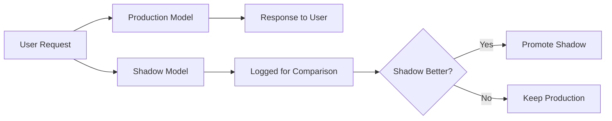

### 8.5 MLOps Testing Tools

| Tool | Focus | Key Features |
|------|-------|--------------|
| MLflow | Experiment tracking | Metrics, params, model registry |
| Weights & Biases | Experiment tracking | Visualization, sweeps, reports |
| Evidently | Monitoring | Data drift, model quality |
| NannyML | Monitoring | Performance estimation without ground truth |
| Great Expectations | Data validation | Expectations, profiling |
| DVC | Data versioning | Data + model versioning |
| Seldon Core | Model serving | Deployment, monitoring, explainability |
| BentoML | Model serving | Packaging, deployment, serving |

---

## 9. Model Explainability Testing

### 9.1 Why Explainability Matters

| Stakeholder | Need | Approach |
|-------------|------|----------|
| **End users** | Trust, understanding | Simple explanations |
| **Developers** | Debugging, improvement | Feature importance, error analysis |
| **Regulators** | Compliance, fairness | Audit trails, bias reports |
| **Business** | Decision justification | Business-friendly explanations |

### 9.2 Explainability Methods

| Method | Type | Scope | Description |
|--------|------|-------|-------------|
| **LIME** | Model-agnostic | Local | Perturb input, observe output changes |
| **SHAP** | Model-agnostic | Global + Local | Shapley values from game theory |
| **Attention visualization** | Model-specific | Local | Show attention weights in transformers |
| **Grad-CAM** | Model-specific | Local | Gradient-based class activation maps |
| **Partial Dependence** | Model-agnostic | Global | Marginal effect of features |
| **ICE Plots** | Model-agnostic | Local | Individual conditional expectations |
| **Counterfactual** | Model-agnostic | Local | Minimal input change to flip prediction |
| **Anchors** | Model-agnostic | Local | Sufficient conditions for prediction |
| **Integrated Gradients** | Model-specific | Local | Attribution along straight-line path |

### 9.3 Explainability Testing Process

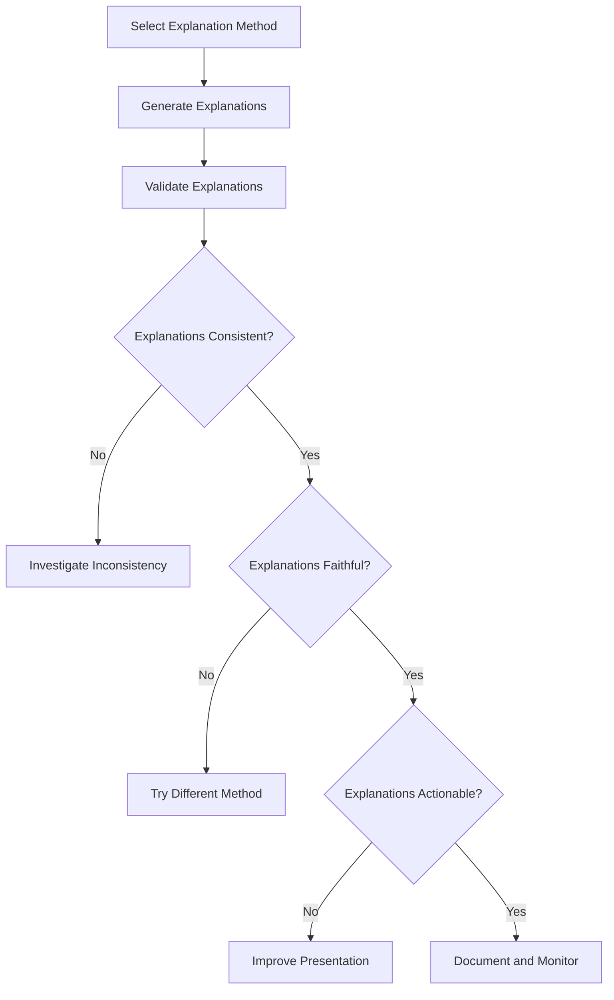

### 9.4 Explainability Testing Checklist

| Check | Description | Pass Criteria |
|-------|-------------|---------------|
| **Consistency** | Same input produces same explanation | Deterministic |
| **Stability** | Similar inputs produce similar explanations | Smooth attribution |
| **Faithfulness** | Explanation reflects model behavior | Perturbation confirms |
| **Completeness** | All important features identified | Coverage of decision factors |
| **Comprehensibility** | Human can understand explanation | User study validation |
| **Actionability** | User can act on explanation | Counterfactual validity |

### 9.5 Explainability Tools

| Tool | Provider | Key Features |
|------|----------|--------------|
| SHAP | U Washington | TreeSHAP, DeepSHAP, KernelSHAP |
| LIME | Tulane | Local surrogate models |
| Captum | Facebook | PyTorch explainability |
| InterpretML | Microsoft | Glass-box models, explanations |
| Alibi Explain | Seldon | Counterfactual, anchors |
| TensorBoard | Google | Attention visualization |

---

## 10. Emerging Testing Topics

### 10.1 Chaos Engineering

**Chaos engineering** proactively tests system resilience by introducing controlled failures in production.

**Principles of Chaos Engineering:**

| Principle | Description |
|-----------|-------------|
| **Steady state hypothesis** | Define normal system behavior |
| **Vary real-world events** | Simulate infrastructure failures, network issues |
| **Run experiments in production** | Test in the real environment |
| **Automate experiments** | Continuous, repeatable chaos |
| **Minimize blast radius** | Start small, increase scope |

**Chaos Engineering Process:**

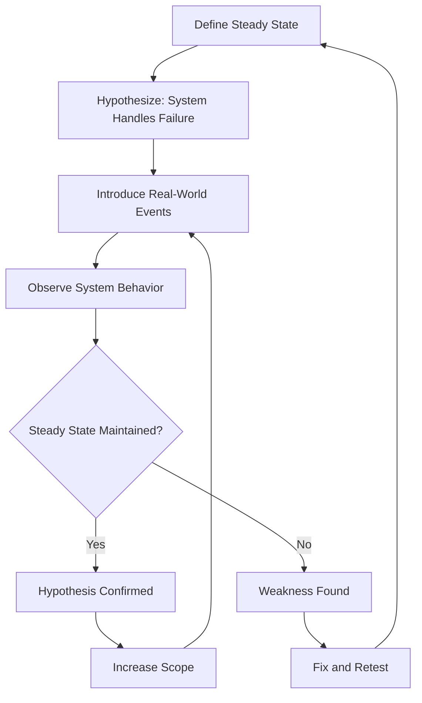

**Chaos Engineering Experiments:**

| Experiment | What It Tests | Tools |
|------------|--------------|-------|
| **Instance termination** | Service recovery | Chaos Monkey |
| **Network latency** | Timeout handling | TC, Pumba |
| **Network partition** | Split-brain handling | iptables, Toxiproxy |
| **CPU stress** | Load shedding | stress-ng |
| **Memory pressure** | OOM handling | stress-ng |
| **Disk failure** | Data persistence | dm-delay, Chaos Mesh |
| **DNS failure** | Service discovery resilience | CoreDNS plugins |
| **Certificate expiry** | TLS handling | cert-manager |

**Chaos Engineering Tools:**

| Tool | Platform | Key Features |
|------|----------|--------------|
| Chaos Monkey | AWS | Random instance termination |
| Litmus | Kubernetes | ChaosHub, experiments |
| Chaos Mesh | Kubernetes | Dashboard, rich experiments |
| Gremlin | Multi-cloud | Enterprise chaos platform |
| Toxiproxy | Network | Network fault injection |
| Pumba | Docker | Container chaos |

### 10.2 Contract Testing

**Contract testing** verifies that services can communicate with each other by testing the contract between consumer and provider.

**Contract Testing vs Integration Testing:**

| Aspect | Contract Testing | Integration Testing |
|--------|-----------------|-------------------|
| **Speed** | Fast (no real services) | Slow (real services) |
| **Isolation** | Each service independently | All services together |
| **Failure scope** | Specific contract violation | Any integration issue |
| **Maintenance** | Contract updates | Environment management |

**Contract Testing Process:**

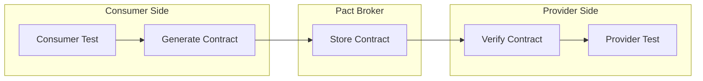

**Contract Testing Tools:**

| Tool | Framework | Key Features |
|------|-----------|--------------|
| Pact | Multi-language | Consumer-driven, Pact Broker |
| Spring Cloud Contract | JVM | Groovy DSL, stubs |
| Dredd | API Blueprint/OpenAPI | HTTP validation |
| Schemathesis | OpenAPI | Property-based, fuzz testing |
| Specmatic | OpenAPI | Contract-first development |

### 10.3 API Testing Patterns

| Pattern | Description | When to Use |
|---------|-------------|-------------|
| **Contract testing** | Verify API contracts | Microservices |
| **Schema validation** | Validate request/response schemas | All APIs |
| **Property-based testing** | Random inputs within constraints | API robustness |
| **Fuzz testing** | Unexpected/malicious inputs | API security |
| **Snapshot testing** | Compare against saved responses | Regression detection |
| **Consumer-driven** | Consumers define expectations | Microservices |
| **Provider-side** | Provider validates its own API | API development |

**API Testing Pyramid:**

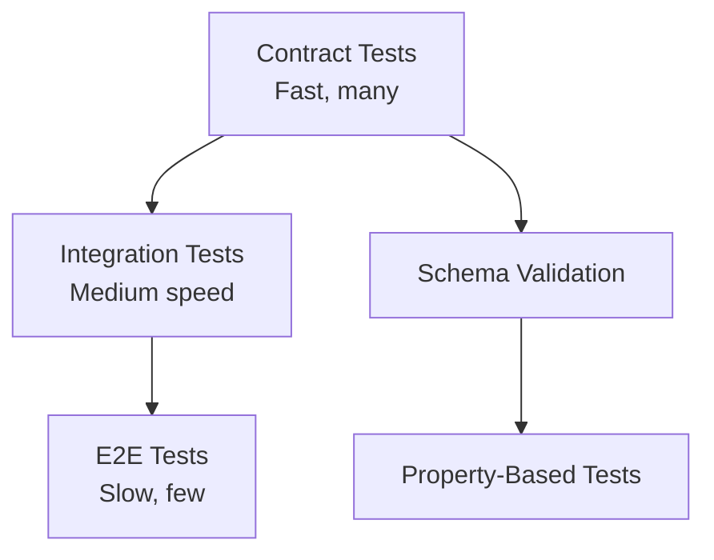

### 10.4 IoT Testing Patterns

| Pattern | Description | Application |
|---------|-------------|-------------|
| **Device simulation** | Simulate devices for scalability testing | Large-scale testing |
| **Protocol conformance** | Verify protocol implementation | MQTT, CoAP, BLE |
| **Edge computing testing** | Test local processing logic | Gateway, fog computing |
| **OTA update testing** | Verify firmware update mechanism | Remote device management |
| **Power profiling** | Measure battery consumption | Battery-powered devices |
| **Network simulation** | Simulate connectivity conditions | Intermittent networks |

---

## 11. Relationships to Other KAs

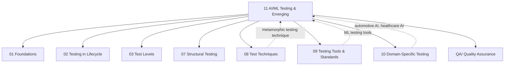

**Cross-references:**
- [[01_Foundations_of_Testing|Foundations of Testing]]: Core testing concepts adapted for AI/ML
- [[02_Testing_in_the_Software_Lifecycle|Testing in the Software Lifecycle]]: MLOps lifecycle integration
- [[03_Test_Levels|Test Levels]]: AI/ML test levels (data, model, system)
- [[07_Structural_Testing_Techniques|Structural Testing Techniques]]: Coverage concepts for ML
- [[08_Test_Techniques|Test Techniques]]: Metamorphic testing as a technique
- [[09_Testing_Tools_and_Standards|Testing Tools and Standards]]: ML testing tools
- [[10_Domain_Specific_Testing|Domain-Specific Testing]]: AI in automotive, healthcare, finance
- [[QA/|Quality Assurance]]: Quality standards for AI systems

---

## 12. Summary

AI/ML testing and emerging topics represent the frontier of software testing practice:

| Area | Key Insight |
|------|-------------|
| **AI/ML challenges** | Non-deterministic, data-dependent behavior requires fundamentally different testing approaches |
| **Data quality** | Foundation of ML reliability; schema validation, drift detection, bias detection are essential |
| **Metrics** | Choose metrics aligned with business objectives; statistical significance matters |
| **Metamorphic testing** | Addresses the oracle problem by defining input-output relations |
| **Fairness** | Multiple fairness metrics exist; no single metric suffices; continuous monitoring required |
| **Adversarial testing** | ML models are vulnerable to adversarial inputs; defense is an ongoing arms race |
| **MLOps** | Testing extends beyond development to production monitoring and continuous validation |
| **Explainability** | Critical for trust, compliance, and debugging; multiple methods with different tradeoffs |
| **Chaos engineering** | Proactive resilience testing through controlled failure injection |
| **Contract testing** | Essential for microservice architectures; verifies service communication contracts |

The testing discipline continues to evolve with technology, requiring testers to develop new skills in data science, statistics, and domain expertise.

---

## See Also

- [[01_Foundations_of_Testing|Foundations of Testing]]
- [[08_Test_Techniques|Test Techniques]]
- [[09_Testing_Tools_and_Standards|Testing Tools and Standards]]
- [[10_Domain_Specific_Testing|Domain-Specific Testing]]

---

## References

1. SWEBOK v4, Chapter 05: Software Testing
2. Zhang, J.M. et al. (2020). Machine Learning Testing: Survey, Landscapes and Horizons. IEEE TSE.
3. Chen, T.Y. et al. (2016). Metamorphic Testing: A Review of Challenges and Opportunities. ACM CSUR.
4. Mehrabi, N. et al. (2021). A Survey on Bias and Fairness in Machine Learning. ACM CSUR.
5. Goodfellow, I. et al. (2018). Attacking Machine Learning with Adversarial Examples. OpenAI.
6. Breck, E. et al. (2017). The ML Test Score: A Rubric for ML Production Readiness. Google.
7. Amershi, S. et al. (2019). Software Engineering for Machine Learning: A Case Study. ICSE.
8. Principles of Chaos Engineering, https://principlesofchaos.org
9. Pact Contract Testing, https://docs.pact.io
10. ML Test Score, https://developers.google.com/machine-learning/guides/rules-of-ml