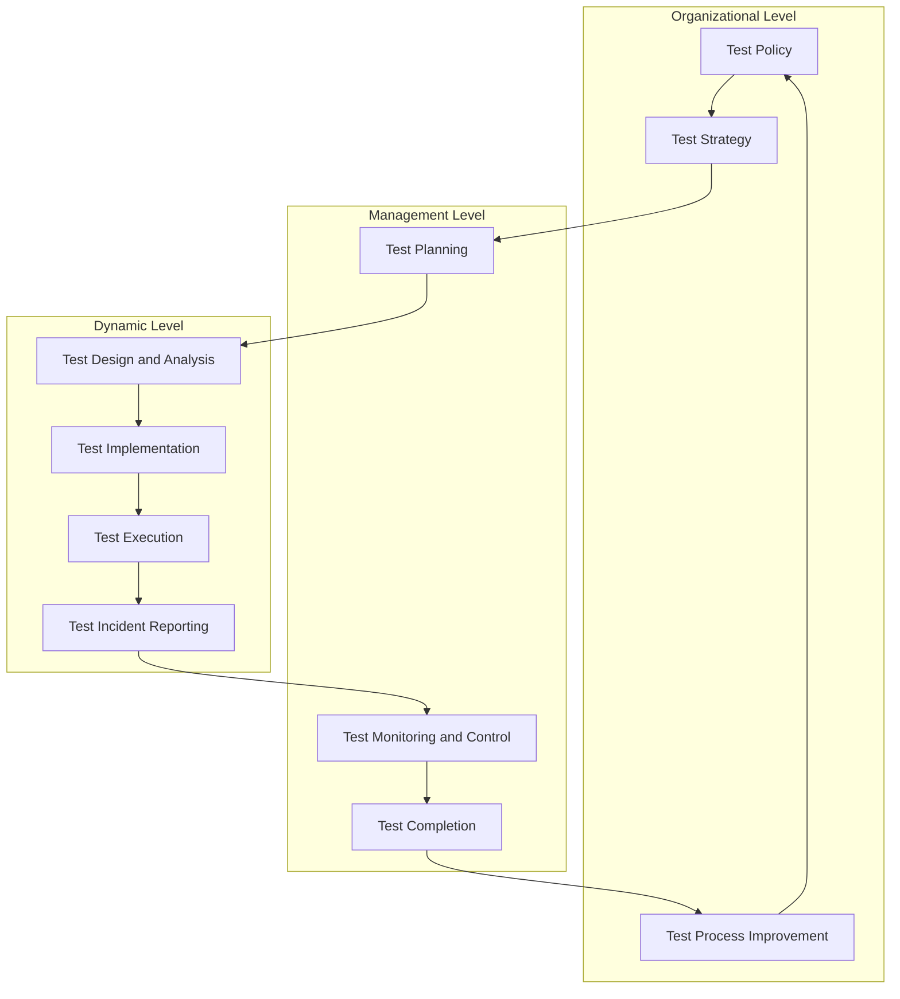
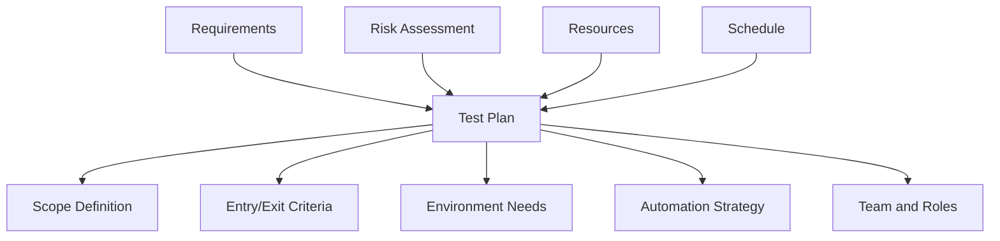
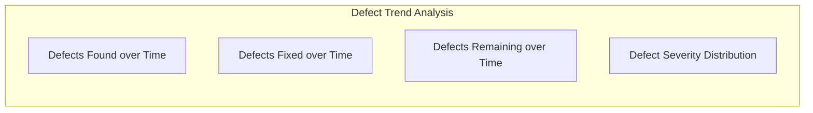
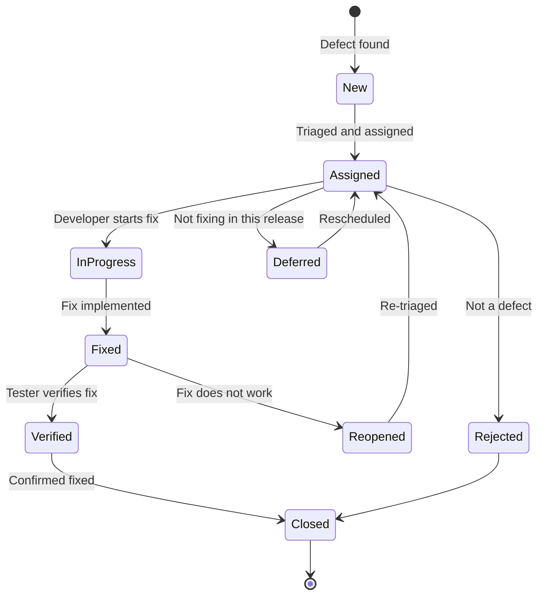
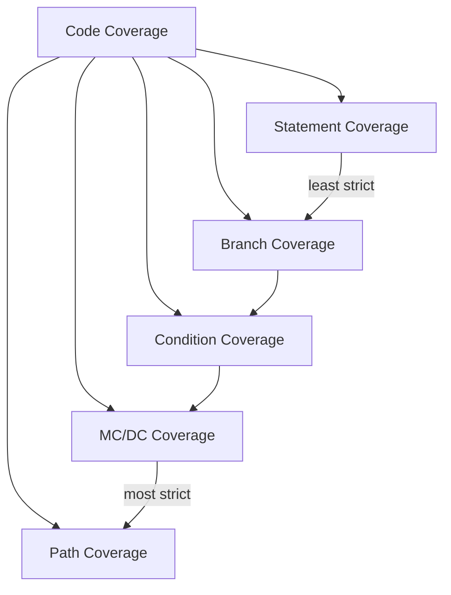
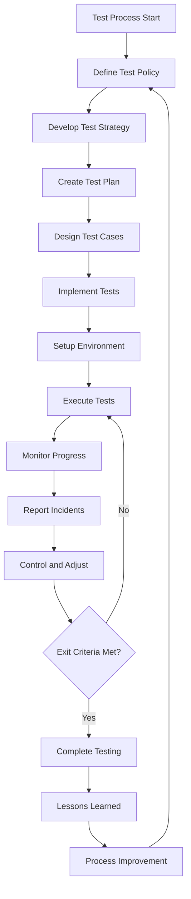

# Test Process and Measures

> **SWEBOK Reference:** Knowledge Area 5 (Software Testing), Section 5.5 — Test Process and Test Measures.

Testing is not a single activity but a structured process with defined levels, roles, and measurable outcomes. This note covers the three-layer test process model and the consolidated test measures used to assess both the system under test and the testing effort itself.

---

## 1 Three-Layer Test Process Model

The SWEBOK test process is organized into three layers: **organizational**, **management**, and **dynamic** (technical). Each layer has distinct concerns, artifacts, and stakeholders.



---

## 2 Organizational Level

### 2.1 Test Policy

The test policy is a high-level document (typically organizational) that defines:

| Element | Description |
|---------|-------------|
| **Definition of Testing** | What testing means within the organization |
| **Objectives** | Why testing is performed (defect detection, confidence building, risk mitigation) |
| **Guiding Principles** | Testing shows presence of defects, exhaustive testing is impossible, early testing, defect clustering, pesticide paradox, context-dependent, absence-of-errors fallacy |
| **Measures** | What metrics the organization tracks (defect density, coverage, test effectiveness) |
| **Process Standards** | Alignment with standards (ISO 29119, CMMI, IEEE 829) |

### 2.2 Test Strategy

The test strategy translates the organizational policy into a project-specific approach:

| Strategy Element | Description |
|-----------------|-------------|
| **Scope** | What is in/out of testing scope |
| **Test Levels** | Unit, integration, system, acceptance |
| **Test Types** | Functional, non-functional, structural, change-related |
| **Risk-Based Prioritization** | Allocate effort proportional to risk |
| **Entry/Exit Criteria** | When to start/stop each test level |
| **Test Automation** | What to automate, tool selection, maintenance plan |
| **Environment Strategy** | Test environments needed, data management |
| **Regression Strategy** | When and how much to retest |

### 2.3 Test Process Improvement

| Model | Focus | Levels/Steps | Description |
|-------|-------|-------------|-------------|
| **TMMi (Test Maturity Model Integration)** | Test process maturity | 5 levels: Initial, Managed, Defined, Measured, Optimization | Structured improvement path for testing organizations |
| **TPI Next** | Test process improvement | 16 key areas, 4 maturity levels | Business-driven, matrix-based improvement model |
| **CTP (Critical Testing Processes)** | Essential test processes | 12 critical processes | Focus on high-impact processes first |
| **STEP (Systematic Test and Evaluation Process)** | Requirements-based testing | 3 levels | Content-centric, aligned with IEEE standards |
| **ISO 29199** | Test process standard | Process definitions | International standard for test processes |

#### TMMi Levels

| Level | Name | Characteristics | Key Process Areas |
|-------|------|----------------|-------------------|
| 1 | **Initial** | Chaotic, ad hoc testing | None |
| 2 | **Managed** | Basic test planning and monitoring | Test Policy, Test Planning, Test Monitoring, Test Design, Test Environment |
| 3 | **Defined** | Standardized, integrated into SDLC | Test Organization, Test Training, Test Lifecycle, Non-Functional Testing, Peer Reviews |
| 4 | **Measured** | Quantitatively managed | Test Measurement, Product Quality Evaluation, Advanced Peer Reviews |
| 5 | **Optimization** | Continuous improvement | Defect Prevention, Quality Control, Test Process Optimization |

---

## 3 Management Level

### 3.1 Test Planning

Test planning defines what testing will be done and how.



#### Test Plan Contents (IEEE 829 / ISO 29199)

| Section | Content |
|---------|---------|
| **Test Plan Identifier** | Unique identifier, version history |
| **References** | Requirements docs, design docs, risk register |
| **Scope** | Features to test, features not to test |
| **Approach** | Test levels, types, techniques per feature |
| **Entry Criteria** | Conditions to begin testing (build available, environment ready, test data prepared) |
| **Exit Criteria** | Conditions to stop testing (coverage targets met, defect thresholds, schedule) |
| **Suspension/Resumption** | Criteria to pause and resume testing |
| **Test Deliverables** | Test cases, test scripts, test reports, defect logs |
| **Environmental Needs** | Hardware, software, tools, test data |
| **Responsibilities** | Roles: test manager, test analyst, test engineer, test environment manager |
| **Schedule** | Milestones, dependencies, resource allocation |
| **Risks and Contingencies** | Identified risks and mitigation plans |
| **Approvals** | Sign-off authority |

### 3.2 Test Monitoring and Control

Test monitoring tracks progress against the plan; test control adjusts the plan based on findings.

#### Progress Metrics

| Metric | Formula | Purpose |
|--------|---------|---------|
| **Test Case Execution Rate** | Executed / Total Planned | Track execution progress |
| **Test Case Pass Rate** | Passed / Executed | Track quality of build |
| **Test Case Fail Rate** | Failed / Executed | Track defect discovery rate |
| **Blocked Test Cases** | Blocked / Total | Track environment/readiness issues |
| **Requirements Coverage** | Requirements with tests / Total requirements | Track coverage completeness |
| **Defect Discovery Rate** | Defects found / Time period | Track testing effectiveness over time |
| **Defect Arrival Rate** | New defects / Time period | Track build quality trends |
| **Defect Closure Rate** | Defects closed / Time period | Track fix throughput |

#### Defect Trends



| Trend Analysis | Interpretation |
|---------------|---------------|
| **Found > Fixed** | Defect backlog growing; increase fix capacity |
| **Found < Fixed** | Product stabilizing; approaching readiness |
| **Found approaching zero** | Testing may be near completion |
| **High severity increasing** | Critical issues emerging; may need to halt testing |
| **Defect clustering** | Few modules have most defects; focus testing effort |

#### Coverage Tracking

| Coverage Type | What It Measures | Tool Support |
|--------------|-----------------|-------------|
| **Requirements Coverage** | % of requirements with at least one test | Requirements traceability matrix (RTM) |
| **Code Coverage** | % of code exercised by tests | JaCoCo, gcov, Istanbul, Coverage.py |
| **Risk Coverage** | % of identified risks with mitigation tests | Risk register cross-reference |
| **Feature Coverage** | % of features with tests | Test management tools (TestRail, Zephyr) |

### 3.3 Test Completion

Test completion activities occur when exit criteria are met or testing is concluded.

| Activity | Description |
|----------|-------------|
| **Exit Criteria Evaluation** | Check all criteria against actual metrics |
| **Before-Release Assessment** | Go/no-go decision based on remaining risks |
| **Test Summary Report** | Document scope, approach, results, metrics, recommendations |
| **Lessons Learned** | What worked, what didn't, process improvement suggestions |
| **Test Artifact Archiving** | Archive test cases, scripts, data, results for future reference |
| **Handover to Maintenance** | Transition test assets for regression testing in maintenance phase |

#### Exit Criteria Checklist

| Criterion | Measurement | Threshold Example |
|-----------|-------------|-------------------|
| **Test case execution** | % executed | >= 100% of planned tests |
| **Test case pass rate** | % passed | >= 95% |
| **Code coverage** | Statement/branch coverage | >= 80% statement, >= 70% branch |
| **Open defects** | Count by severity | Zero critical, <= 3 major |
| **Requirements coverage** | % covered | 100% |
| **Risk mitigation** | % high risks addressed | 100% |
| **Performance benchmarks** | Response time, throughput | Within defined SLAs |

---

## 4 Dynamic Level (Technical Activities)

### 4.1 Test Design and Analysis

Test design translates requirements and risk information into executable test cases.

#### Design Approaches

| Approach | Basis | Strengths | Weaknesses |
|----------|-------|-----------|------------|
| **Requirements-Based** | Functional/non-functional requirements | Direct validation of specifications | Misses unspecified behavior |
| **Risk-Based** | Risk assessment (likelihood x impact) | Focuses effort on critical areas | May miss low-risk but common defects |
| **Experience-Based** | Tester knowledge, past defects, heuristics | Finds defects that formal methods miss | Dependent on tester skill, not systematic |
| **Model-Based** | Behavioral models (state machines, flow graphs) | Comprehensive, automatable | Model creation cost, model accuracy |
| **Combinatorial** | Input parameter combinations (pairwise, orthogonal) | Systematic coverage of interactions | May generate many tests, not all combinations relevant |

#### Risk-Based Test Prioritization

| Risk Level | Testing Approach | Example |
|-----------|-----------------|---------|
| **Critical** | Exhaustive testing, multiple techniques, independent verification | Safety-critical functions, financial transactions |
| **High** | Thorough testing, boundary analysis, negative testing | Authentication, data integrity |
| **Medium** | Standard testing, equivalence partitioning | Business logic, UI workflows |
| **Low** | Basic positive-path testing, exploratory | Help text, cosmetic features |

### 4.2 Test Implementation

| Activity | Description | Artifacts |
|----------|-------------|-----------|
| **Test Script Development** | Manual steps or automated scripts | Test scripts, automation code |
| **Test Data Creation** | Prepare input data, expected outputs, boundary values | Test data files, data generators |
| **Test Environment Setup** | Configure hardware, software, network, databases | Environment configuration, Docker compose, IaC |
| **Test Harness Construction** | Build stubs, drivers, mock objects for isolated testing | Mock services, stub APIs |
| **Traceability Matrix** | Link test cases to requirements | RTM spreadsheet or tool-managed |

### 4.3 Test Execution

| Mode | Description | When to Use |
|------|-------------|-------------|
| **Sequential** | Execute test cases in planned order | Regression suites, smoke tests |
| **Parallel** | Execute test cases simultaneously on multiple environments | Large suites, cross-browser testing, CI/CD |
| **Exploratory** | Simultaneous test design, execution, and learning | Early testing, unclear requirements, session-based |
| **Session-Based Exploratory** | Time-boxed exploration with charter and notes | Structured exploratory testing |
| **Regression** | Re-execute previously passed tests after changes | After bug fixes, feature additions, refactoring |

#### Exploratory Testing Session Structure

| Element | Description |
|---------|-------------|
| **Charter** | Mission statement: what to explore, with what resources, to find what kind of problems |
| **Time Box** | Fixed duration (typically 60-120 minutes) |
| **Test Notes** | Record of what was tested, observations, questions |
| **Debrief** | Review findings, update test charters, assess coverage |

### 4.4 Test Incident Reporting

#### Defect Severity Classification

| Severity | Description | Examples |
|----------|-------------|---------|
| **Critical / S1** | System crash, data loss, security breach, no workaround | Application crash on login, data corruption |
| **Major / S2** | Major feature broken, no workaround | Payment processing fails, incorrect calculations |
| **Minor / S3** | Feature partially broken, workaround exists | Export fails for specific format, filter not persistent |
| **Trivial / S4** | Cosmetic, typo, minor UI issue | Misspelled label, alignment issue |

#### Defect Lifecycle



#### Root Cause Categories

| Category | Description | Prevention |
|----------|-------------|-----------|
| **Coding Error** | Logic error, off-by-one, null pointer | Code review, static analysis, unit tests |
| **Requirements Gap** | Missing or ambiguous requirement | Requirements review, use case analysis |
| **Design Flaw** | Architectural or design deficiency | Design review, modeling |
| **Environment Issue** | Configuration, deployment, data problem | Environment management, IaC |
| **Integration Error** | Interface mismatch, protocol error | Contract testing, integration tests |
| **Third-Party Issue** | Bug in library, framework, or external service | Vendor management, version pinning |

---

## 5 Consolidated Test Measures: SUT (System Under Test) Measures

### 5.1 Defect Density by Severity

**Formula:**

$$\text{Defect Density} = \frac{\text{Number of Defects}}{\text{Size of Artifact}}$$

Size can be measured in KLOC (thousands of lines of code), function points, or story points.

| Severity | Calculation | Benchmark (typical) |
|----------|-------------|-------------------|
| **Critical** | Critical defects / KLOC | < 0.1 |
| **Major** | Major defects / KLOC | < 0.5 |
| **Minor** | Minor defects / KLOC | < 2.0 |
| **Total** | All defects / KLOC | < 5.0 (varies by domain) |

**By artifact type:**

| Artifact | Typical Defect Density |
|----------|----------------------|
| Requirements | 1-3 defects per function point |
| Design | 0.5-1.5 defects per function point |
| Code | 1-25 defects per KLOC (varies by language and domain) |
| Web application | 5-15 defects per KLOC |
| Safety-critical (avionics) | < 0.1 defects per KLOC after verification |

### 5.2 Defect Removal Effectiveness (DRE)

**Formula:**

$$\text{DRE} = \frac{\text{Defects removed during testing}}{\text{Defects present before testing}} \times 100\%$$

In practice, since "defects present before testing" is unknown, it is approximated as:

$$\text{DRE} \approx \frac{\text{Defects found in testing}}{\text{Defects found in testing} + \text{Defects found after release}} \times 100\%$$

| DRE Value | Interpretation |
|-----------|---------------|
| **> 95%** | Excellent; very few defects escape to production |
| **85-95%** | Good; industry average for mature organizations |
| **70-85%** | Acceptable; improvement opportunities exist |
| **< 70%** | Poor; significant defects escaping to production |

### 5.3 Reliability Growth Models

Reliability growth models predict software reliability based on observed failure data during testing.

#### Musa Model (Execution Time)

$$\mu(\tau) = \mu_0 \left(1 - e^{-\frac{\tau}{\beta}}\right)$$

Where $\mu(\tau)$ = expected failures by execution time $\tau$, $\mu_0$ = total expected failures, $\beta$ = scale parameter.

| Parameter | Meaning |
|-----------|---------|
| **$\mu_0$** | Total number of defects in the software |
| **$\beta$** | Failure rate decrease factor (higher = faster reliability growth) |
| **$\tau$** | Execution time (CPU hours) |

#### Goel-Okumoto (NHPP) Model

$$m(t) = a(1 - e^{-bt})$$

Where $m(t)$ = expected number of failures by time $t$, $a$ = expected total failures, $b$ = failure detection rate per fault.

| Parameter | Meaning |
|-----------|---------|
| **$a$** | Expected total number of faults |
| **$b$** | Per-fault failure detection rate |

**Key property:** The failure rate decreases as faults are found and fixed (reliability growth).

#### Jelinski-Moranda Model

$$\lambda_i = \phi(N - i + 1)$$

Where $\lambda_i$ = failure rate after $(i-1)$ faults have been removed, $N$ = initial number of faults, $\phi$ = proportionality constant.

| Parameter | Meaning |
|-----------|---------|
| **$N$** | Initial fault count |
| **$\phi$** | Individual fault contribution to failure rate |
| **$\lambda_i$** | Failure rate between $(i-1)$th and $i$th failure |

**Assumptions:** Each fault contributes equally to the failure rate; faults are removed perfectly (no new faults introduced).

#### Model Comparison

| Model | Type | Parameters | Assumptions | Best For |
|-------|------|-----------|-------------|----------|
| **Musa** | Execution-time | $\mu_0$, $\beta$ | Exponential failure intensity decrease | System testing with execution time tracking |
| **Goel-Okumoto** | Calendar-time NHPP | $a$, $b$ | Non-homogeneous Poisson process | General reliability growth assessment |
| **Jelinski-Moranda** | Failure-count | $N$, $\phi$ | Equal fault contribution, perfect removal | Early reliability estimation |
| **Littlewood-Verrall** | Bayesian | Variable | Fault sizes vary; prior distribution | When fault heterogeneity is expected |

### 5.4 Failure Rate

$$\text{Failure Rate} = \frac{\text{Number of Failures}}{\text{Total Execution Time}}$$

- Measured in failures per hour, failures per 1000 hours, or FIT (failures in time = failures per $10^9$ hours).
- Failure rate should decrease over time as defects are fixed (reliability growth).

### 5.5 Mean Time Between Failures (MTBF)

$$\text{MTBF} = \frac{\text{Total Operating Time}}{\text{Number of Failures}}$$

MTBF is applicable to systems expected to continue operating after failures (repairable systems).

### 5.6 Mean Time to Failure (MTTF)

$$\text{MTTF} = \frac{\text{Total Operating Time}}{\text{Number of Units Tested}}$$

MTTF is applicable to non-repairable components (a component fails and is discarded/replaced).

| Metric | System Type | Interpretation |
|--------|------------|---------------|
| **MTBF** | Repairable | Average time between consecutive failures |
| **MTTF** | Non-repairable | Average time until first failure |
| **MTTR** | Repairable | Mean Time To Repair (restore after failure) |
| **Availability** | Both | $A = \frac{MTBF}{MTBF + MTTR}$ |

---

## 6 Consolidated Test Measures: Test Effectiveness Measures

### 6.1 Code Coverage Measures



| Coverage Type | Definition | Formula | Strength |
|--------------|-----------|---------|----------|
| **Statement Coverage** | % of executable statements executed | Executed Statements / Total Statements | Weakest; misses branches |
| **Branch Coverage (Decision)** | % of branches (if/else, case) taken | Executed Branches / Total Branches | Catches missing else paths |
| **Condition Coverage** | % of Boolean sub-expressions evaluated to both true and false | Evaluated Conditions / Total Conditions | Catches compound predicates |
| **Decision/Condition Coverage** | Combination of branch and condition | Both branch and condition = 100% | Stronger than either alone |
| **MC/DC (Modified Condition/Decision Coverage)** | Each condition independently affects the decision outcome | Each condition shown to independently affect decision | Strong; required by DO-178C DAL A/B |
| **Multiple Condition Coverage** | All combinations of condition values | $2^n$ combinations for $n$ conditions | Exponential; often impractical |
| **Path Coverage** | All possible execution paths | Executed Paths / Total Paths | Strongest; exponential in loops |

#### MC/DC Example

```c
// Decision: if (A && (B || C))
// MC/DC requires showing each of A, B, C independently affects the outcome

// Test 1: A=T, B=T, C=F -> Result = T  (A matters: change A to F -> F)
// Test 2: A=F, B=T, C=F -> Result = F
// Test 3: A=T, B=F, C=T -> Result = T  (C matters: change C to F -> F)
// Test 4: A=T, B=F, C=F -> Result = F
// Test 5: A=T, B=T, C=F -> Result = T  (B matters: change B to F, C=T -> T, but B=F,C=F -> F)
```

### 6.2 Mutation Score

Mutation testing evaluates test suite quality by introducing small changes (mutants) to the source code and checking if tests detect them.

**Formula:**

$$\text{Mutation Score} = \frac{\text{Killed Mutants}}{\text{Total Mutants} - \text{Equivalent Mutants}} \times 100\%$$

| Concept | Description |
|---------|-------------|
| **Mutant** | A version of the code with a single syntactic change |
| **Killed** | A mutant that causes at least one test to fail |
| **Survived** | A mutant that passes all tests (weakness in test suite) |
| **Equivalent** | A mutant that is semantically identical to the original (cannot be killed) |

#### Common Mutation Operators

| Operator | Description | Example |
|----------|-------------|---------|
| **Arithmetic Replacement** | Change arithmetic operator | `+` to `-`, `*` to `/` |
| **Relational Replacement** | Change comparison operator | `<` to `<=`, `==` to `!=` |
| **Logical Replacement** | Change logical operator | `&&` to `\|\|`, `!` removed |
| **Statement Deletion** | Remove a statement | Delete assignment, delete method call |
| **Constant Replacement** | Change a constant value | `0` to `1`, `true` to `false` |
| **Return Value** | Change return value | `return x` to `return -x` |

**Tools:** PIT (Java), mutmut (Python), Stryker (JavaScript/TypeScript), mull (C/C++).

| Mutation Score | Interpretation |
|---------------|---------------|
| **> 90%** | Excellent test suite; few surviving mutants |
| **70-90%** | Good; some gaps in test assertions |
| **50-70%** | Moderate; significant test weaknesses |
| **< 50%** | Weak; many mutants survive; tests are superficial |

### 6.3 Fault Injection Effectiveness

Fault injection intentionally introduces faults to verify that the system handles them correctly.

| Type | Technique | Purpose |
|------|-----------|---------|
| **Compile-Time** | Mutate source code | Test error-handling paths |
| **Runtime** | Inject faults via API, library interposition | Test resilience in production-like conditions |
| **Network** | Drop packets, delay, corrupt (Chaos Monkey, tc, toxiproxy) | Test network fault tolerance |
| **Hardware** | Bit-flip in memory, voltage variation | Test hardware fault tolerance (safety-critical) |

**Effectiveness measure:**

$$\text{Fault Injection Effectiveness} = \frac{\text{Faults correctly handled by system}}{\text{Total faults injected}} \times 100\%$$

### 6.4 Test Case Effectiveness Ratio

$$\text{Test Case Effectiveness} = \frac{\text{Defects found by test case}}{\text{Total test cases executed}} \times 100\%$$

Alternatively:

$$\text{Test Case Effectiveness} = \frac{\text{Defects detected}}{\text{Total defects present (estimated)}} \times 100\%$$

| Metric | What It Measures | Use |
|--------|-----------------|-----|
| **Test Case Effectiveness Ratio** | Defects per test case | Compare test design quality |
| **Defect Detection Percentage (DDP)** | % of total defects found by testing | Assess test phase effectiveness |
| **Test Efficiency** | Defects found per test hour | Resource allocation |

### 6.5 Requirements Traceability Matrix (RTM) Coverage

The RTM maps requirements to test cases to ensure complete coverage.

| Requirement ID | Requirement Description | Test Case IDs | Coverage Status |
|---------------|------------------------|---------------|-----------------|
| REQ-001 | User shall login with valid credentials | TC-001, TC-002, TC-003 | Covered |
| REQ-002 | System shall lock account after 5 failed attempts | TC-004, TC-005 | Covered |
| REQ-003 | Password must meet complexity requirements | TC-006 | Partially covered |
| REQ-004 | Session shall timeout after 30 minutes | None | Not covered |

**RTM Coverage Metrics:**

$$\text{Requirements Coverage} = \frac{\text{Requirements with at least one test}}{\text{Total requirements}} \times 100\%$$

$$\text{Bidirectional Traceability} = \text{Forward (req -> test)} + \text{Backward (test -> req)}$$

| Coverage Status | Definition | Action |
|----------------|-----------|--------|
| **Covered** | At least one test case exists and is executed | None |
| **Partially Covered** | Test exists but does not cover all aspects | Enhance test cases |
| **Not Covered** | No test case maps to requirement | Create test cases or document risk acceptance |
| **Orphan Test** | Test exists but maps to no requirement | Validate test necessity; may be exploratory or regression |

---

## 7 Test Measures Summary Table

| Category | Measure | Formula/Description | Target |
|----------|---------|-------------------|--------|
| **SUT** | Defect Density | Defects / KLOC | < 5.0 (domain-dependent) |
| **SUT** | DRE | Found in test / (found in test + found after release) | > 95% |
| **SUT** | Reliability Growth | Musa, Goel-Okumoto, Jelinski-Moranda models | Increasing MTBF |
| **SUT** | Failure Rate | Failures / Time | Decreasing trend |
| **SUT** | MTBF | Operating time / Failures | > SLA requirement |
| **SUT** | MTTF | Operating time / Units tested | > design specification |
| **Test** | Statement Coverage | Executed statements / Total | >= 80% |
| **Test** | Branch Coverage | Executed branches / Total | >= 70% |
| **Test** | MC/DC Coverage | Independent condition effect | 100% (safety-critical) |
| **Test** | Mutation Score | Killed mutants / (total - equivalent) | > 70% |
| **Test** | Fault Injection Effectiveness | Correctly handled / Injected | > 95% |
| **Test** | Test Case Effectiveness | Defects found / Test cases executed | Context-dependent |
| **Test** | Requirements Coverage | Requirements with tests / Total | 100% |

---

## 8 Testing Process in Practice

### 8.1 Test Process Flow



### 8.2 Integration with Development Lifecycle

| SDLC Phase | Testing Activity | Key Measures |
|-----------|-----------------|-------------|
| **Requirements** | Requirements review, acceptance test criteria | Requirements coverage |
| **Design** | Test design, integration test planning | Design defect density |
| **Construction** | Unit testing, code coverage | Statement/branch coverage, mutation score |
| **Integration** | Integration testing | Interface defect density |
| **System** | System testing, non-functional testing | DRE, reliability growth |
| **Acceptance** | UAT, alpha/beta testing | Customer-found defects |
| **Maintenance** | Regression testing | Regression defect rate |

---

## 9 Summary and Key Takeaways

| Topic | Key Insight |
|-------|-------------|
| **3-Layer Process** | Organizational (policy/strategy), Management (plan/monitor/complete), Dynamic (design/execute/report) |
| **Test Planning** | Define scope, approach, criteria, resources; risk-based prioritization |
| **Test Monitoring** | Track execution rate, pass/fail rate, defect trends, coverage |
| **Test Completion** | Evaluate exit criteria, summarize findings, archive artifacts, lessons learned |
| **Defect Density** | Normalize defect counts by size; benchmark against industry |
| **DRE** | Measure testing effectiveness; target > 95% |
| **Reliability Growth** | Model defect removal trajectory; predict remaining defects |
| **Code Coverage** | Statement < Branch < Condition < MC/DC < Path |
| **Mutation Score** | Assess test suite quality beyond code coverage |
| **RTM** | Ensure every requirement has test coverage; bidirectional traceability |

---

## Related Notes

- [[13_Software_Testing_Techniques]] — Black-box and white-box test techniques
- [[14_Software_Testing_Levels]] — Unit, integration, system, acceptance testing
- [[11_Software_Quality]] — Quality attributes and quality models
- [[08_Software_Requirements]] — Requirements as the basis for test design
- [[10_Software_Evolution]] — Regression testing in maintenance

---

## References

1. SWEBOK v4, Chapter 5: Software Testing, Section 5.5.
2. ISO/IEC/IEEE 29119: Software Testing Standards (Parts 1-5).
3. IEEE 829: Standard for Software and System Test Documentation.
4. TMMi Foundation. *TMMi Assessment Guidelines*.
5. Musa, J. D., Iannino, A., & Okumoto, K. (1987). *Software Reliability: Measurement, Prediction, Application*. McGraw-Hill.
6. Myers, G. J., Sandler, C., & Badgett, T. (2011). *The Art of Software Testing* (3rd ed.). Wiley.
7. Craig, R. D., & Jaskiel, S. P. (2002). *Systematic Software Testing*. Artech House.
8. van Veenendaal, E. (Ed.). (2012). *Standard Glossary of Terms Used in Software Testing*. ISTQB.
9. DO-178C: Software Considerations in Airborne Systems and Equipment Certification. RTCA, 2011.
