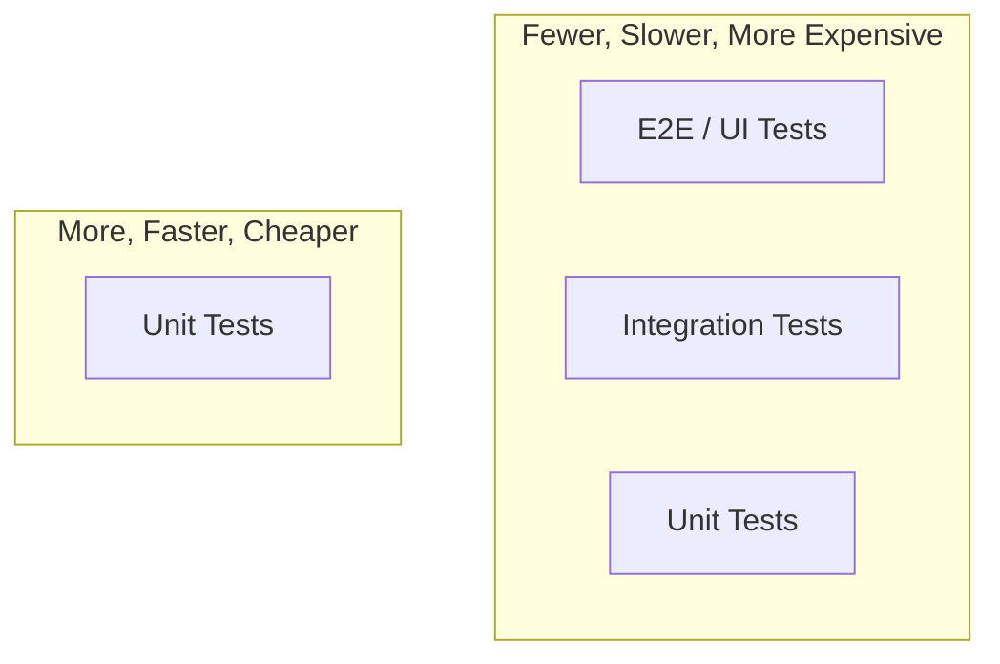

---
tags:
- programming
- qa
- testing
---

# 01 Testing Mindset & Approaches

QA is not about proving the software works. It's about finding where it doesn't — before your users do. The tester's mindset is skepticism, curiosity, and the willingness to break things.

---

## QA vs QC vs Testing

| Term | Meaning |
|------|---------|
| **QA** (Quality Assurance) | Process-oriented: prevent defects before they happen. Standards, reviews, process improvement. |
| **QC** (Quality Control) | Product-oriented: find defects after they exist. Testing, inspection. |
| **Testing** | The actual act of executing software to find defects. A subset of QC. |

---

## The Tester Mindset

| Trait | What It Means |
|-------|--------------|
| **Skepticism** | Don't trust the developer. Trust the evidence. |
| **Curiosity** | "What happens if I..." is the tester's favorite question. |
| **Persistence** | One pass is not enough. Reproduce, isolate, report. |
| **Communication** | A bug you can't explain is a bug that won't get fixed. |
| **Business awareness** | What matters to the user matters to the tester. |

### Confirmation Bias Trap

> Developers test to confirm their code works. Testers test to discover where it doesn't. These are opposite mindsets. **Never let the developer be the only tester of their own code.**

---

## Testing Approaches

### Static vs Dynamic

| | Static Testing | Dynamic Testing |
|---|:---:|:---:|
| **Runs code?** | No | Yes |
| **Examples** | Code review, static analysis, walkthrough | Unit tests, integration tests, manual testing |
| **Finds** | Logic errors, style, security patterns | Runtime behavior, integration issues |

### Black Box vs White Box vs Gray Box

| | Black Box | Gray Box | White Box |
|---|:---:|:---:|:---:|
| **Knows internals?** | No | Partial (DB schema, API) | Yes (source code) |
| **Tests based on** | Requirements, specs | Architecture knowledge | Code structure |
| **Who does it** | QA, users | QA with dev input | Developers |
| **Examples** | UAT, exploratory testing | API testing, integration testing | Unit testing, code coverage |

---

## Testing Levels (The Test Pyramid)

| Level | Scope | Speed | Who |
|-------|-------|:-----:|-----|
| **Unit** | Single function/class | Milliseconds | Developers |
| **Integration** | Multiple units + real deps | Seconds | Developers |
| **E2E / UI** | Full system from user perspective | Minutes | QA / Automation |

> **Rule of thumb:** 70% unit, 20% integration, 10% E2E. If you have more E2E than unit tests, you're doing it wrong.

---

## Sources

- ISTQB Foundation Level Syllabus
- Myers, Glenford. *The Art of Software Testing*, 3rd ed., Wiley, 2011.
