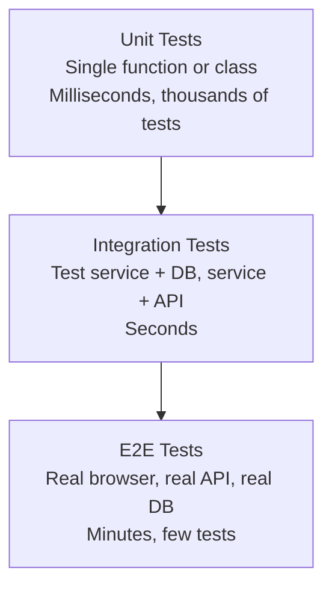

---
tags:
- programming
- qa
- testing
---

# 02 Functional Testing

Functional testing verifies that the software does what it's supposed to do. It tests **what** the system does — given input X, output should be Y.

---

## The Test Pyramid in Practice



---

## Unit Testing

Test a single unit of code in isolation. Fast. Reliable. No external dependencies.

```java
@Test
void shouldCalculateOrderTotal() {
    // Given
    Order order = new Order();
    order.addItem(new Item("Book", 2999));       // $29.99
    order.addItem(new Item("Pen", 499));          // $4.99
    
    // When
    long total = order.calculateTotal();
    
    // Then
    assertEquals(3498, total);  // $34.98
}
```

> Clean Code deep dive: **[[Unit Testing]]** in the Clean Code vault.

---

## Integration Testing

Test multiple units working together — with real dependencies.

```java
@SpringBootTest(webEnvironment = WebEnvironment.RANDOM_PORT)
@Testcontainers
class OrderControllerIntegrationTest {
    
    @Container
    static PostgreSQLContainer<?> postgres = 
        new PostgreSQLContainer<>("postgres:16");
    
    @Autowired
    private TestRestTemplate rest;
    
    @Test
    void shouldCreateAndRetrieveOrder() {
        // Create
        OrderRequest request = new OrderRequest("user-1", "product-1", 2);
        ResponseEntity<Order> createResp = rest.postForEntity(
            "/orders", request, Order.class);
        assertEquals(201, createResp.getStatusCodeValue());
        
        // Retrieve
        String id = createResp.getBody().getId();
        ResponseEntity<Order> getResp = rest.getForEntity(
            "/orders/" + id, Order.class);
        assertEquals("CONFIRMED", getResp.getBody().getStatus());
    }
}
```

---

## System Testing

Test the entire system end-to-end. Real browser, real API, real database.

| Tool | Best For |
|------|----------|
| **Selenium** | Cross-browser E2E, legacy |
| **Cypress** | Modern web apps, developer-friendly |
| **Playwright** | Multi-browser, auto-wait, fastest |
| **RestAssured** | Java API testing |

---

## Regression Testing

Re-run existing tests after every change to ensure nothing broke.

| Approach | When |
|----------|------|
| **Full regression** | Before major release |
| **Smoke testing** | Every build — "does the app boot and not crash?" |
| **Sanity testing** | Quick check after a small fix — "did this specific thing get fixed?" |
| **Selective regression** | Test only modules that changed |

---

## Acceptance Testing

The final question: "Will the user accept this?"

| Type | Who | When |
|------|-----|------|
| **UAT** (User Acceptance Testing) | Real users | Before release |
| **Alpha** | Internal team | Pre-beta |
| **Beta** | External early adopters | Before GA |
| **A/B Testing** | Real users (split traffic) | In production |

> Clean Coder deep dive: **[[Acceptance Testing]]**

---

## Sources

- ISTQB Foundation Level Syllabus
- TestContainers — https://testcontainers.com/
