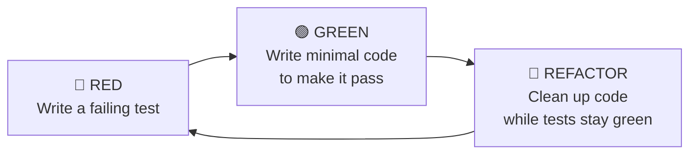

---
tags:
- programming
- qa
- testing
---

# 02 Test-Driven Development

TDD flips the script: write the test first, watch it fail, write the code to make it pass, then refactor. It's a design discipline, not a testing technique.

---

## Red → Green → Refactor



| Phase | What You Do | Rule |
|-------|-------------|------|
| **RED** | Write exactly ONE failing test | Don't write code yet. Watch it fail. |
| **GREEN** | Write the minimum code to pass | Don't refactor. Don't write extra features. Just pass. |
| **REFACTOR** | Clean up duplication, improve design | Tests must stay green. No new functionality. |

---

## The Three Laws of TDD (Uncle Bob)

1. **You may not write production code unless it is to make a failing unit test pass.**
2. **You may not write more of a unit test than is sufficient to fail.**
3. **You may not write more production code than is sufficient to pass the test.**

---

## Example: FizzBuzz TDD Style

```java
@Test void shouldReturn1For1() {
    assertEquals("1", FizzBuzz.of(1));           // 🔴 RED: FizzBuzz doesn't exist
}

// 🟢 GREEN: minimal code
class FizzBuzz {
    static String of(int n) { return "1"; }     // Hardcoded — just enough to pass
}

@Test void shouldReturn2For2() {
    assertEquals("2", FizzBuzz.of(2));           // 🔴 RED: fails, returns "1"
}

// 🟢 GREEN: generalize
class FizzBuzz {
    static String of(int n) { return String.valueOf(n); }
}

@Test void shouldReturnFizzFor3() {
    assertEquals("Fizz", FizzBuzz.of(3));        // 🔴 RED
}

// 🟢 GREEN: add rule
static String of(int n) {
    if (n == 3) return "Fizz";
    return String.valueOf(n);
}
// ... continue: Buzz for 5, FizzBuzz for 15, refactor duplication
```

---

## BDD (Behavior-Driven Development)

TDD for business requirements. Write scenarios in Gherkin:

```gherkin
Feature: Order Checkout

  Scenario: Customer places an order with valid payment
    Given a customer with items in their cart
    And a valid credit card on file
    When the customer completes checkout
    Then the order is created with status "CONFIRMED"
    And payment is charged for the total amount
    And the cart is emptied
```

| Tool | Language |
|------|----------|
| **Cucumber** | Java, Ruby, JavaScript |
| **SpecFlow** | .NET |
| **Behave** | Python |

---

## ATDD (Acceptance Test-Driven Development)

Tests are written collaboratively by dev, QA, and product owner BEFORE development starts. The test IS the specification.

```
Product Owner: "User should be able to cancel an order before it ships"
QA + Dev:      Write acceptance test: cancel unshipped order → status=CANCELLED
Dev:            Implement until test passes
```

> Clean Coder deep dive: **[[Acceptance Testing]]** and **[[Test Driven Development]]**

---

## When NOT to TDD

| Scenario | Why Not |
|----------|---------|
| Exploratory / spike code | You don't know what you're building yet |
| UI layout experimentation | TDD doesn't help with visual design |
| Throwaway prototypes | Tests on code you'll delete = waste |

---

## Sources

- Beck, Kent. *Test-Driven Development: By Example*, Addison-Wesley, 2002.
- Martin, Robert C. *The Clean Coder*, Chapter 5.
