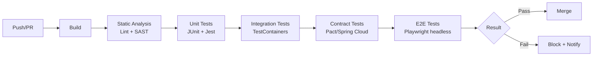

---
tags:
- programming
- qa
- testing
---

# 03 CI/CD & Headless Testing

Tests that only run on a developer's machine are useless. CI/CD pipelines run tests automatically on every commit — blocking broken code from reaching production.

---

## CI Pipeline for Testing



---

## GitHub Actions Example

```yaml
name: Test Pipeline
on: [push, pull_request]

jobs:
  test:
    runs-on: ubuntu-latest
    services:
      postgres:
        image: postgres:16
        env:
          POSTGRES_DB: testdb
          POSTGRES_PASSWORD: test
        ports:
          - 5432:5432
    
    steps:
      - uses: actions/checkout@v4
      
      - name: Set up JDK 17
        uses: actions/setup-java@v4
        with:
          java-version: 17
      
      - name: Backend Tests
        run: ./mvnw verify
      
      - name: Frontend Tests
        run: |
          cd frontend
          npm ci
          npm test -- --coverage
      
      - name: E2E Tests (Playwright)
        run: |
          npx playwright install --with-deps chromium
          npx playwright test
      
      - name: Upload Coverage
        uses: codecov/codecov-action@v4
```

---

## Headless Testing

Run browser tests without a visible UI — faster, CI-friendly.

```javascript
// Playwright config for CI
const config = {
    use: {
        headless: true,
        viewport: { width: 1280, height: 720 },
    },
    workers: 4,  // Parallel execution
    retries: 2,  // Retry flaky tests
};
```

---

## Parallel Execution

Split tests across multiple workers to cut total runtime.

| Tool | Parallel Support |
|------|:---------------:|
| JUnit 5 | `junit-platform.properties` → `junit.jupiter.execution.parallel.enabled=true` |
| Playwright | `workers: 4` in config, or sharding across CI runners |
| Cypress | Cypress Dashboard (paid) or custom sharding |

---

## Flaky Test Management

| Strategy | How |
|----------|-----|
| **Retry** | Auto-retry failed tests 2–3 times (Playwright: `retries: 2`) |
| **Quarantine** | Move consistently flaky tests to a separate suite |
| **Fix or delete** | Flaky tests erode trust. If it's flaky > 5% of runs, fix it or delete it. |

---

## Sources

- GitHub Actions — https://docs.github.com/en/actions
- Playwright CI — https://playwright.dev/docs/ci
- JUnit 5 Parallel Execution — https://junit.org/junit5/docs/current/user-guide/
