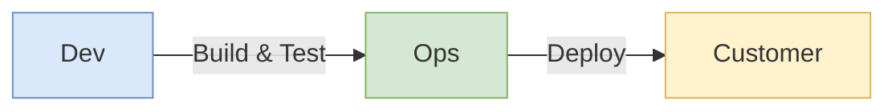
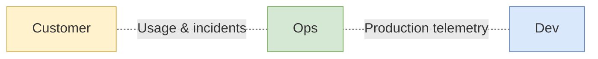

---
tags:
  - devops
  - three-ways
  - flow
  - feedback
  - learning
  - software-engineering-operations
source: "DevOps Handbook Part I — Kim, Humble, Debois, Willis"
created: 2026-07-21
---

# 01 — The Three Ways: Flow, Feedback, and Continual Learning

## Overview

Part I of *The DevOps Handbook* lays the theoretical foundation for DevOps by showing how decades of management and manufacturing philosophy converged into the Three Ways. DevOps is the outcome of applying Lean principles — originally developed for the Toyota Production System — to the **technology value stream**. The Three Ways (Flow, Feedback, Continual Learning & Experimentation) are the principles from which all DevOps behaviors and patterns are derived.

---

## 1. A Brief History of DevOps

DevOps is not a single invention but a **convergence of movements** (John Willis's "convergence of DevOps"):

### Lean Movement (1980s–1990s)

- **Toyota Production System** codified Value Stream Mapping, Kanban Boards, and Total Productive Maintenance in the 1980s.
- Two core Lean tenets:
  1. **Manufacturing lead time** is the best predictor of quality, customer satisfaction, and employee happiness.
  2. **Small batch sizes** are the best predictor of short lead times.
- Lean principles: systems thinking, constancy of purpose, scientific thinking, flow & pull (vs. push), quality at the source, leading with humility, respecting every individual.

### Agile Manifesto (2001)

- Seventeen software thought-leaders created a lightweight alternative to heavyweight waterfall processes.
- Key principle: *"Deliver working software frequently, from a couple of weeks to a couple of months, with a preference to the shorter timescale."*
- Emphasized small batch sizes, incremental releases, small self-motivated teams, and high-trust management.
- Many key DevOps moments occurred within the Agile community or at Agile conferences.

### Agile Infrastructure & Velocity Movement (2008–2009)

- **2008 Agile Conference (Toronto):** Patrick Debois and Andrew Schafer held a "birds of a feather" session on applying Agile to infrastructure.
- **2009 Velocity Conference:** John Allspaw and Paul Hammond presented *"10 Deploys per Day: Dev and Ops Cooperation at Flickr"* — a seminal talk on shared Dev/Ops goals and continuous integration.
- **2009 DevOpsDays (Ghent):** Patrick Debois, inspired by the Velocity talk, created the first DevOpsDays. The term "DevOps" was coined there.

### Continuous Delivery Movement (2006–2009)

- Jez Humble and David Farley extended CI to **Continuous Delivery**: code and infrastructure always in a deployable state; all trunk changes can be safely deployed to production.
- First presented at Agile 2006; independently developed by Tim Fitz in 2009 ("Continuous Deployment").

### Toyota Kata (2009)

- Mike Rother studied Toyota for 20 years and discovered that the Lean community had missed the most important practice: the **Improvement Kata**.
- Every organization has work routines; the Improvement Kata creates structure for the **daily, habitual practice of improvement**.
- The constant cycle: establish desired future state → set weekly target outcomes → continually improve daily work.

### Additional Foundations

DevOps also builds upon:
- **Infrastructure as Code** (Mark Burgess, Luke Kanies, Adam Jacob) — treating Operations work like application code.
- **Continuous Integration** (Grady Booch, Extreme Programming)
- **Continuous Deployment** (Etsy, Wealthfront, Eric Ries/IMVU)

---

## 2. Value Streams

### Manufacturing Value Stream

> *"The sequence of activities an organization undertakes to deliver upon a customer request, including the dual flows of information and material."*
> — Karen Martin & Mike Osterling

In manufacturing, the value stream is visible: a customer order triggers raw materials onto the plant floor. Fast, predictable lead times come from:
- Smooth and even flow of work
- **Small batch sizes**
- **Reducing WIP (Work in Process)**
- Preventing defects from reaching downstream work centers
- Constantly optimizing toward global goals

### Technology Value Stream

> The process required to convert a **business hypothesis** into a **technology-enabled service** that delivers value to the customer.

```
Business Idea → Development (User Stories, Code) → Version Control → 
Integration & Test → Deployment → Production (Value Delivered)
```

Value is created **only when services are running in production**. Deployment must not cause chaos — no outages, impairments, security, or compliance failures.

### Deployment Lead Time (the book's focus)

**Definition:** Time from when an engineer checks a change into version control → change is successfully running in production.

**Two phases of work:**

| Phase | Nature | Characteristics |
|-------|--------|----------------|
| Design & Development | Lean Product Development | Highly variable, creative, uncertain |
| Testing & Operations | Lean Manufacturing | Predictable, mechanistic, minimized variability |

**Goal:** Testing and Operations happen **simultaneously** with Design/Development — not sequentially in large batches. Achieved via small batches + quality built into every step.

### Lead Time vs. Processing Time

| Metric | Clock Starts | Clock Ends |
|--------|-------------|------------|
| **Lead Time** | When request is made | When request is fulfilled |
| **Processing Time** (touch time) | When work actually begins | When work is completed |

> Lead time is what the customer experiences. Fast flow requires reducing time spent **waiting in queues**.

### Common Scenario vs. DevOps Ideal

| | Typical | DevOps Ideal |
|---|---------|-------------|
| **Lead Time** | Months | Minutes (or hours) |
| **Architecture** | Tightly-coupled monolith | Modular, loosely-coupled |
| **Testing** | Manual, scarce envs | Automated, exploratory |
| **Deployment** | Heroics required at each stage | Self-service, automated |
| **Failures** | Global disruptions | Small, contained failures |

### %C/A — Percent Complete and Accurate

> *"The percentage of time downstream customers receive work that is 'usable as is' — without correction, missing information, or clarification."*

The third key metric alongside lead time and processing time. Reflects quality of output at each value stream step.

---

## 3. The Three Ways — Overview

From *The Phoenix Project*, the Three Ways are the underpinning principles from which **all observed DevOps behaviors and patterns** are derived.


### First Way — Flow (Left → Right)



Accelerate the delivery of work from Development to Operations to the customer. Make work visible, limit WIP, reduce batch sizes, reduce handoffs.

### Second Way — Feedback (Right → Left)



Amplify feedback loops so corrections can be made continuously. See problems as they happen, swarm and solve, push quality to the source.

### Third Way — Continual Learning (⟳)


Create a culture of continual experimentation, taking risks, and learning from failure. Institutionalize improvement, convert local discoveries to global practices, inject resilience.


| Way | Direction | Core Principle |
|-----|-----------|----------------|
| **First Way: Flow** | Left → Right | Accelerate delivery from Dev to Ops to Customer |
| **Second Way: Feedback** | Right → Left | Create ever-safer systems through fast, constant feedback |
| **Third Way: Learning** | Cultural | High-trust culture, scientific experimentation, organizational learning |

---

## 4. The First Way: The Principles of Flow

> Fast and smooth flow of work from Development to Operations, to deliver value to customers quickly. **Optimize for the global goal, not local goals.**

### 4.1 Make Our Work Visible

- Technology work is **invisible** — unlike physical manufacturing, we can't see where flow is impeded or work is piling up.
- Transferring work in tech is too easy (one click to reassign a ticket) — work bounces between teams, problems stay hidden.
- **Solution:** Visual work boards (Kanban, sprint boards). Work starts on the left (backlog), flows through columns (work centers), finishes on the right ("Done" / "In Production").
- **Work is done only when the application is running successfully in production**, not when Development finishes coding.
- Making all work visible enables prioritization against global goals and single-tasking on highest-priority items.

### 4.2 Limit Work in Process (WIP)

- In manufacturing, disruptions are visible and costly (scrapping WIP). In tech, interruptions are invisible but **more damaging** due to cognitive complexity.
- Multitasking severely degrades performance — especially for cognitively complex technology work.
- **Kanban WIP limits:** codify and enforce an upper limit on cards per column. Nothing can be worked on unless first represented as a card.
- WIP is a **leading indicator** of lead time (Dominica DeGrandis).
- Limiting WIP exposes problems: when blocked, instead of starting new work, **find and fix the cause of the delay**.
- > *"Stop starting. Start finishing."* — David J. Andersen

### 4.3 Reduce Batch Sizes

- Large batches → skyrocketing WIP, high variability, long lead times, poor quality.
- **Single-piece flow** is the theoretical lower limit.
- **Envelope game simulation (Lean Thinking):**
  - Large batch (fold all 10, then insert all 10, then seal all 10, then stamp all 10): first completed envelope at **310 seconds**; error found at 200 seconds, entire batch must be redone.
  - Small batch (complete one envelope entirely before starting next): first completed at **40 seconds** (8× faster); error only requires redoing one.
- **Technology equivalent:** Continuous deployment = single-piece flow. Each version-control change is integrated, tested, and deployed to production.
- > *"The batch size is the unit at which work-products move between stages."* — Eric Ries

### 4.4 Reduce the Number of Handoffs

- Long deployment lead times often mean hundreds (or thousands) of operations between version control and production.
- Each handoff requires communication: requesting, specifying, signaling, coordinating, prioritizing, scheduling, deconflicting, testing, verifying.
- Each handoff is a potential **queue** where work waits on shared resources.
- **Knowledge is lost with every handoff** — enough handoffs and the original context is completely lost.
- **Countermeasure:** Automate significant portions of the work, or reorganize teams to deliver value independently without constant dependency on others.

### 4.5 Continually Identify and Elevate Our Constraints

> *"In any value stream, there is always a direction of flow, and there is always one and only constraint; any improvement not made at that constraint is an illusion."* — Dr. Eliyahu Goldratt

**Goldratt's Five Focusing Steps:**
1. Identify the system's constraint.
2. Decide how to exploit the constraint.
3. Subordinate everything else to the above decisions.
4. Elevate the constraint.
5. If the constraint is broken, go back to step 1 — don't let inertia create a new constraint.

**Typical DevOps constraint progression:**
1. **Environment creation** → Create on-demand, self-serviced environments
2. **Code deployment** → Automate deployments completely (self-service by developers)
3. **Test setup and run** → Automate and parallelize tests
4. **Overly tight architecture** → Create loosely-coupled architecture for autonomous teams
5. **Development / Product Owners** *(desired end state)* → The constraint should be here: limited only by good business hypotheses and the ability to develop code to test them.

### 4.6 Eliminate Hardships and Waste in the Value Stream

Shigeo Shingo defined seven manufacturing wastes. Modern Lean reframes "eliminating waste" as **reducing hardship and drudgery in daily work through continual learning**.

**Categories of waste/hardship in the technology value stream (Poppendieck + additions):**

| Waste | Description |
|-------|-------------|
| **Partially done work** | Work-in-queue, un-reviewed documents — loses value over time |
| **Extra processes** | Documentation/reviews/approvals that don't add value |
| **Extra features** | "Gold plating" — features not needed by customer or organization |
| **Task switching** | Context switching across multiple projects and value streams |
| **Waiting** | Delays between work centers — increases cycle time |
| **Motion** | Effort to move information between work centers; non-colocated teams |
| **Defects** | Incorrect/missing/unclear information — harder to fix the longer detection is delayed |
| **Nonstandard/manual work** | Dependencies on non-rebuilding servers, manual environments |
| **Heroics** | Unreasonable acts becoming daily routine (2 AM production fixes, hundreds of tickets per release) |

**Goal:** Make these wastes visible and systematically eliminate them to achieve fast flow.

---

## 5. The Second Way: The Principles of Feedback

> Fast and constant feedback from right to left at all stages of the value stream. Create an **ever-safer and more resilient system of work.**

### 5.1 Working Safely Within Complex Systems

- **Complex systems** defy any single person's ability to understand the whole. Tightly-coupled components make system-level behavior unpredictable.
- Dr. Charles Perrow (Three Mile Island): impossible to understand how a nuclear reactor behaves in all circumstances.
- Dr. Sidney Dekker: in complex systems, **doing the same thing twice won't necessarily produce the same result** — static checklists and best practices are insufficient.
- **Failure is inherent and inevitable in complex systems.** We must design a safe system of work where errors are detected quickly, long before catastrophe.

**Dr. Steven Spear's four conditions for safe complex systems:**
1. Complex work is managed so that problems in design and operations are **revealed**.
2. Problems are **swarmed and solved**, resulting in quick construction of new knowledge.
3. New local knowledge is **exploited globally** throughout the organization.
4. Leaders **create other leaders** who continually grow these capabilities.

### 5.2 See Problems as They Occur

- Constantly test design and operating assumptions. Increase information flow — sooner, faster, cheaper, with clarity between cause and effect.
- **The more assumptions we invalidate, the faster we find and fix problems.**
- Feedback and feedforward loops are critical to learning organizations (Dr. Peter Senge, *The Fifth Discipline*).

**Manufacturing contrast:**
- **GM Fremont plant:** No procedures to detect problems or know what to do when found. Engines in backward, missing steering wheels, cars towed off assembly line.
- **High-performing manufacturing:** Every operation measured and monitored; defects and deviations quickly found and acted upon.

**Technology value stream:** Create automated build, integration, and test processes that immediately detect when a change takes us out of a deployable state. Pervasive telemetry shows how all system components are operating in production.

> *"When I headed up quality engineering, I described my job as 'creating feedback cycles.' Feedback is critical because it allows us to steer."* — Elisabeth Hendrickson

### 5.3 Swarm and Solve Problems to Build New Knowledge

**Toyota Andon Cord:**
- Above every work center is a cord that anyone can pull when something goes wrong.
- Team leader is immediately alerted. If the problem can't be resolved within ~55 seconds, **the entire production line is halted**.
- The entire organization mobilizes to assist until a successful countermeasure is developed.

**Why swarming is necessary:**
1. Prevents the problem from progressing downstream (cost and effort increase exponentially; technical debt accumulates).
2. Prevents the work center from starting new work (which would introduce new errors).
3. Without immediate action, the same problem will recur in the next cycle.

**Technology equivalent:** Create the equivalent of an Andon cord — when a production incident occurs or a change breaks the CI/CD pipeline, **swarm to fix it and prevent new work until resolved**.

> Swarming is the *"disciplined cycle of real-time problem recognition, diagnosis, and treatment... the Shewhart cycle (Plan-Do-Check-Act) accelerated to warp speed."* — Dr. Steven Spear

### 5.4 Keep Pushing Quality Closer to the Source

- Adding more inspection steps and approval processes **increases** the likelihood of future failures in complex systems.
- Decision effectiveness decreases as it moves further from where the work is performed.
- Ineffective quality controls: tedious manual tasks that should be automated, approvals from distant busy people, obsolete documentation, large batches sent to committees.

**Instead:**
- Everyone finds and fixes problems in their area of control as part of daily work.
- Use **peer reviews** for proposed changes.
- Automate quality checks typically done by QA or InfoSec.
- Tests performed **on demand** — developers test and even deploy their own code.
- Quality, security, and availability become **everyone's responsibility**.

> *"It's impossible for a developer to learn anything when someone yells at them for something they broke six months ago — that's why we need to provide feedback to everyone as quickly as possible, in minutes, not months."* — Gary Gruver

### 5.5 Enable Optimizing for Downstream Work Centers

- **Design for Manufacturability** (1980s): design parts so they can't be assembled wrong (asymmetrical parts, impossible-to-over-tighten screws).
- Lean defines **two types of customers:**
  1. **External customer** — pays for the service
  2. **Internal customer** — receives and processes work immediately after us
- **Our most important customer is our next step downstream.**
- In technology: **Design for Operations** — operational non-functional requirements (architecture, performance, stability, testability, configurability, security) prioritized as highly as user features.

---

## 6. The Third Way: The Principles of Continual Learning & Experimentation

> Creating a culture of continual learning and experimentation. Individual knowledge → Team knowledge → Organizational knowledge.

### 6.1 Enabling Organizational Learning and a Safety Culture

**Low-performing organizations:** Rigidly defined work, culture of fear, workers punished for mistakes, suggestions suppressed, "name, blame, shame."

**High-performing organizations:** Dynamic system of work, line workers perform experiments, rigorous standardization, documentation of results.

**Dr. Ron Westrum's three organizational cultures:**

| Type | Characteristics | Response to Failure |
|------|----------------|---------------------|
| **Pathological** | Fear, threats, hoarded/distorted information | Hidden |
| **Bureaucratic** | Rules, processes, departmental "turf" | Judgment → punishment or mercy |
| **Generative** | Active information seeking and sharing, shared responsibility | Reflection and genuine inquiry |

> **Generative culture** was one of the top predictors of patient safety in healthcare AND IT/organizational performance in technology.

**In technology:** Conduct **blameless post-mortems** after every incident → understand how the accident occurred → agree on countermeasures → improve the system.

> *"By removing blame, you remove fear; by removing fear, you enable honesty; and honesty enables prevention."* — Bethany Macri, Etsy

> *"Organizations become ever more self-diagnosing and self-improving, skilled at detecting problems and solving them."* — Dr. Steven Spear

### 6.2 Institutionalize the Improvement of Daily Work

- In the absence of improvements, processes **degrade over time** due to chaos and entropy (Mike Rother, *Toyota Kata*).
- Avoiding fixes → problems and technical debt accumulate → all time spent on workarounds, no cycles for productive work.

> *"Even more important than daily work is the improvement of daily work."* — Mike Orzen

**How to improve daily work:**
- Reserve time in each development interval to pay down technical debt, fix defects, refactor.
- Schedule **kaizen blitzes** — periods where engineers self-organize to fix any problem they want.
- Fix daily problems that have been worked around for months/years → then detect and respond to ever-weaker failure signals.

**Alcoa case study (Paul O'Neill, CEO):**
- 1987: 2% of 90,000 employees injured per year (~7 injuries per day).
- O'Neill's first goal: **zero injuries.** Within 24 hours of any injury, notified to ensure learnings were generated.
- Result: 95% reduction in injury rate over 10 years. Then started reporting near misses too.
- > *"Coping, fire fighting, and making do were gradually replaced... by a dynamic of identifying opportunities for process and product improvement."* — Dr. Spear

### 6.3 Transform Local Discoveries into Global Improvements

- When teams/individuals create expertise, convert **tacit knowledge** (hard to transfer) into **explicit, codified knowledge** (becomes others' expertise through practice).
- Ensures everyone works with the **cumulative and collective experience of the entire organization**.

**US Navy Nuclear Power Propulsion Program (Naval Reactors):**
- Over 5,700 reactor-years of operation **without a single reactor-related casualty or escape of radiation.**
- Intense commitment to scripted procedures and standardized work.
- Incident reports for ANY departure from procedure, no matter how minor.
- Procedures and system designs constantly updated based on learnings.
- New crews benefit from 5,700 accident-free reactor-years of collective knowledge.

**Technology equivalents:**
- Searchable blameless post-mortem reports
- Shared source code repositories spanning the entire organization
- Shared libraries and configurations embodying the organization's best collective knowledge

### 6.4 Inject Resilience Patterns into Our Daily Work

**Low performers** buffer against disruptions by adding "flab" — more inventory, more equipment, more people (increases cost).

**High performers** achieve the same by:
- Improving daily operations
- Continually introducing **tension** to elevate performance
- Engineering **resilience** into the system

**Aisin Seiki mattress factory experiment:**
- Two production lines (100 units/day each).
- On slow days, route all production to one line → experiment to increase capacity and identify vulnerabilities.
- If overloading caused failure, switch to the second line.
- Result: continually increased capacity **without adding equipment or hiring**.

> This process of applying stress to increase resilience was named **antifragility** by Nassim Nicholas Taleb.

**Technology equivalents:**
- Always reduce deployment lead times, increase test coverage, decrease test execution times, re-architect if needed.
- **Game Day exercises** — rehearse large-scale failures (e.g., turning off entire data centers).
- **Chaos Monkey** (Netflix) — randomly kill processes and servers in production to ensure resilience.

### 6.5 Leaders Reinforce a Learning Culture

- Greatness is NOT achieved by leaders making all the right decisions. The leader's role is to **create the conditions so their team can discover greatness in their daily work.**
- Leaders and frontline workers are **mutually dependent**: leaders aren't close enough to the work; frontline workers lack broader organizational context and authority.
- Leaders must **elevate the value of learning and disciplined problem solving.**

**Mike Rother's Coaching Kata** (mirrors the scientific method):
1. State True North goals (e.g., "sustain zero accidents" — Alcoa; "double throughput within a year" — Aisin).
2. Cascaded into iterative, shorter-term goals.
3. Establish target conditions at the value stream level (e.g., "reduce lead time by 10% within the next two weeks").

**Coaching questions the leader asks:**
- What was your last step and what happened?
- What did you learn?
- What is your condition now?
- What is your next target condition?
- What obstacle are you working on now?
- What is your next step? What is your expected outcome?
- When can we check?

> Toyota is *"an organization defined primarily by the unique behavior routines it continually teaches to all its members."* — Mike Rother

---

## 7. Part I Conclusion

The principles of Flow, Feedback, and Continual Learning form the foundation for successful DevOps organizations. These principles are not independent — **improving flow and feedback requires an iterative, scientific approach** that includes:

1. Framing a target condition
2. Stating a hypothesis of what will help get there
3. Designing and conducting experiments
4. Evaluating the results

The outcomes are not only **better performance** but also **increased resilience, higher job satisfaction, and improved organizational adaptability.**

---

## Key Concepts Summary

| Concept | Description |
|---------|-------------|
| **Value Stream** | Sequence of activities to deliver a customer request (information + material flows) |
| **Technology Value Stream** | Process of converting a business hypothesis into a technology-enabled service |
| **Deployment Lead Time** | Time from version-control check-in to running successfully in production |
| **Processing Time** | Time actually spent working (excludes queue time) |
| **%C/A** | Percent Complete and Accurate — quality of output received by downstream |
| **Single-Piece Flow** | Batch size of one; the theoretical limit for minimizing lead time |
| **WIP (Work in Process)** | Work started but not yet completed; a leading indicator of lead time |
| **Andon Cord** | Toyota practice: anyone can halt production to swarm on a problem |
| **Blameless Post-Mortem** | Incident analysis focused on system improvement, not individual blame |
| **Improvement Kata** | Daily, habitual practice of improvement through scientific method |
| **Antifragility** | Systems that gain strength from stress and disorder (Taleb) |
| **Generative Culture** | Westrum's highest organizational type: information-seeking, shared responsibility |
| **Theory of Constraints** | Goldratt: every system has exactly one constraint; improvements elsewhere are illusions |

---

## Related Notes

- [[Software Engineering Operations Overview]]
- Lean Manufacturing Principles
- Toyota Production System
- Continuous Delivery
- Site Reliability Engineering
- Chaos Engineering
