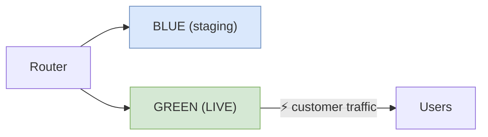
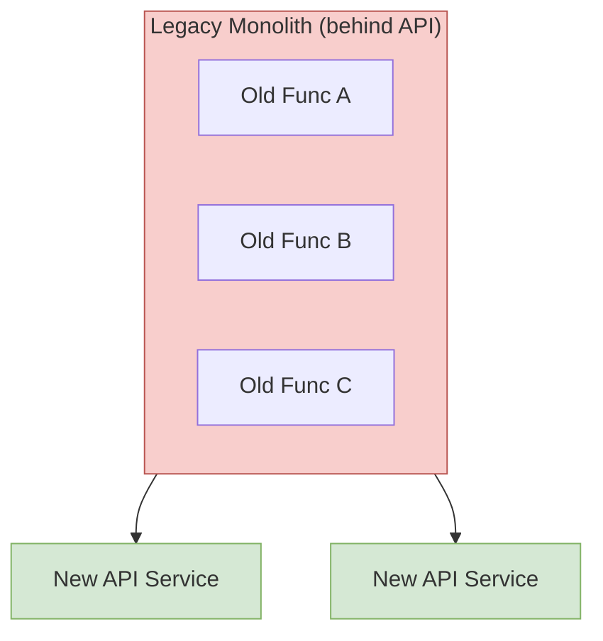

---
tags:
  - devops
  - ci-cd
  - deployment-pipeline
  - testing
  - flow
  - software-engineering-operations
  - continuous-delivery
  - architecture
  - microservices
---

# Accelerating Flow — The Deployment Pipeline & Low-Risk Releases

> **Source:** *The DevOps Handbook*, Part III — "The Technical Practices of Flow" (Chapters 12–13)
> **Purpose:** Enable fast, safe flow from Development to Operations via automated deployment pipelines, decoupled releases, and evolutionary architecture.

---

## The Problem: The Deployment Downward Spiral

When deployments are manual, time-consuming, painful, and error-prone, teams deploy less frequently. Less frequent deployments mean larger batch sizes, which increase the risk of unexpected outcomes and make fixes harder. This creates a **self-reinforcing downward spiral**:

```
Painful deployments → Deploy less often → Larger batch size →
Higher risk → More painful deployments → (repeat)
```

**The goal:** Make deployments a **routine, low-risk part of everyone's daily work** — automated, repeatable, and predictable.

---

## Automate the Deployment Process

### Step 1: Document and Simplify

1. **Document every step** of the current deployment process (value stream mapping, wiki)
2. **Simplify and automate** as many manual steps as possible
3. **Re-architect** to remove steps, especially long-running ones
4. **Reduce handoffs** to minimize errors and knowledge loss

### What to Automate

| Step | Description |
|------|-------------|
| Packaging | Package code in ways suitable for deployment |
| Images/Containers | Create pre-configured VM images or containers |
| Middleware | Automate deployment and configuration of middleware |
| Copying | Copy packages/files onto production servers |
| Restarting | Restart servers, applications, or services |
| Config | Generate configuration files from templates |
| Smoke Tests | Run automated smoke tests post-deployment |
| Testing | Run testing procedures |
| Database | Script and automate database migrations |

### Deployment Pipeline Requirements

| Requirement | Why |
|-------------|-----|
| **Deploy the same way everywhere** | Production deployments succeed because they've been practiced dozens of times in lower environments |
| **Smoke test deployments** | Verify connectivity to all supporting systems (DB, message bus, external services) and run a test transaction — **fail the deployment** if any smoke test fails |
| **Maintain consistent environments** | Dev, test, and production must stay synchronized via a common build mechanism |

When deployment problems occur: **pull the Andon cord** and swarm the problem.

### Tools

Jenkins Build Pipeline plugin, ThoughtWorks Go.cd, Snap CI, Microsoft Visual Studio Team Services, Pivotal Concourse.

---

## Case Study: CSG International — Daily Deployments

- **Context:** One of the largest US bill-printing operations. Production releases were twice per year (28-week intervals), while dev deployments happened daily.
- **Problem:** "Practice team" (Dev) practiced daily in low-risk environments; "game team" (Ops) got few attempts, practicing only in high-risk production with different constraints (security, firewalls, load balancers, SAN).
- **Solution:** Created a **Shared Operations Team (SOT)** managing all environments and performing daily deployments to dev/test, plus production releases every 14 weeks.
- **Why it worked:** Daily deployments created motivation to automate and fix issues — problems left unfixed would recur the next day. Deployments were performed ~100 times before production release.
- **Results:**
  - Production incidents: ↓ 91%
  - MTTR: ↓ 80%
  - Deployment lead time: 14 days → 1 day
  - 50% of customers received value in half the time

**Key insight:** "We made non-production environments as similar to production as possible... Early exposure to production-class environments altered the designs of the architecture."

---

## Enable Automated Self-Service Deployments

### Who Should Deploy?

> Puppet Labs 2013 State of DevOps Report: **No statistically significant difference** in change success rates between orgs where Dev deployed vs. Ops deployed.

When there are shared goals, transparency, and accountability, **it doesn't matter who deploys**. The goal is a code promotion process that anyone (Dev or Ops) can perform without manual steps or handoffs.

### Three Pillars of Self-Service

| Pillar | Practice |
|--------|----------|
| **Build** | Pipeline creates packages from version control deployable to any environment, including production |
| **Test** | Anyone can run any/all automated test suite on their workstation or test systems |
| **Deploy** | Anyone can deploy packages to any environment via scripts checked into version control |

---

## Integrate Code Deployment into the Pipeline

Once deployment is automated, the pipeline must provide:

1. Packages from CI that are **production-ready**
2. **At-a-glance** readiness of production environments
3. **Push-button, self-service** deployment of any suitable version
4. **Automated audit records** (what commands, which machines, when, who authorized, output)
5. **Smoke tests** confirming system operation and config correctness
6. **Fast feedback** — deployer must quickly know if deployment succeeded

> 2014 State of DevOps Report: High performers had deployment lead times in **minutes or hours**; lowest performers measured in **months**.

---

## Case Study: Etsy — Self-Service Continuous Deployment

- **Culture:** Anyone can deploy — Dev, Ops, Infosec. New engineers deploy on day one. Board members and even dogs have deployed.
- **Process:** Engineers queue in chat room (~15 people daily deploying ~25 changesets). Notified when it's their turn.
- **Testing pipeline:**
  - 4,500 unit tests on workstation (<1 minute, external calls stubbed)
  - 7,000+ trunk tests on CI servers (11 minutes, parallelized across 10 Jenkins machines)
  - Smoke tests (cURL-driven PHPUnit)
  - Functional tests (GUI-driven, end-to-end) on a **production server taken out of rotation** ("Princess")
- **Tool:** Deployinator — push-button deploys, chat notifications with diff links, email summaries
- **Result:** 2009 = stress and fear; by 2011 = routine, 25–50 deploys/day

---

## Decouple Deployments from Releases

**Critical distinction:**

| Term | Definition |
|------|------------|
| **Deployment** | Installing a specified version of software to a given environment. May or may not involve releasing features to customers. |
| **Release** | Making a feature (or set of features) available to all customers or a segment of customers. Should **not require changing application code**. |

**Why decouple:** When deployment and release are conflated, accountability is blurred. Decoupling empowers Dev/Ops to own fast, frequent deployments, while Product owns business outcomes of releases.

### Two Release Pattern Categories

| Category | Mechanism | Examples |
|----------|-----------|----------|
| **Environment-based** | Two+ environments, only one receives live traffic; release = traffic switch | Blue-green, canary, cluster immune system |
| **Application-based** | Modify application to selectively expose features via config changes | Feature toggles, dark launches |

---

## Environment-Based Release Patterns

### Blue-Green Deployment





1. Two identical production environments (blue and green)
2. Only one serves live traffic at a time
3. Deploy new version to inactive environment → test → switch traffic
4. **Rollback:** Switch traffic back to the old environment

**Benefits:**
- Deploy during business hours (no more midnight/weekend deploys)
- Simple to retrofit onto existing systems
- Dramatically improves work conditions for deploy teams

**Database challenge:** Two app versions sharing one database. Solutions:
- **Two databases** (blue and green DBs): backup blue DB, restore to green, switch traffic. Risk: potential transaction loss on rollback.
- **Decouple DB changes from app changes** (expand/contract pattern): only additive DB changes, never mutate existing objects, app makes no assumptions about DB version.

### Case Study: Dixons Retail — Blue-Green for Point-of-Sale

- Applied blue-green to thick-client POS systems (not just web services)
- Used slow network links to push new POS client installers weeks ahead in inactive state
- Store managers chose when to release — far better than centralized IT choosing
- Result: smoother, faster release; higher manager satisfaction; minimal store disruption

### Canary Release

```
Internal Employees (A1) → Small % Customers (A2) → All Customers (A3)
         ↓ fail                    ↓ fail                ↓ success
       Rollback                 Rollback             Release complete
```

- Deploy to successively larger/more critical environments
- Monitor at each stage; roll back on problems; promote on success
- Named after coal miners' canaries (early warning of danger)

### Cluster Immune System

- Extends canary by linking **production monitoring with the release process**
- **Automatically rolls back** when user-facing performance deviates outside expected range (e.g., conversion rate drops below 15-20%)
- Protects against defects hard to find in automated tests (e.g., CSS change hiding a critical page element)
- Reduces time to detect and respond to degraded performance

---

## Application-Based Release Patterns

### Feature Toggles

Wrap application logic or UI elements with a conditional statement based on configuration:

```
if (featureFlag.isEnabled("new-search")) {
    // new search functionality
} else {
    // old search
}
```

**What feature toggles enable:**

| Capability | Example |
|------------|---------|
| **Easy rollback** | Disable a problematic feature without rolling back the entire release |
| **Graceful degradation** | Under high load, disable CPU-intensive features to serve more users |
| **Resilience in SOA** | Deploy features that depend on unfinished services; toggle on when ready. Toggle off if downstream service fails. |
| **Dark launching** | Deploy all functionality to production but keep it hidden from users; test with production traffic for weeks before launch |
| **Progressive rollouts** | Expose to 1% → 5% → 25% → 100% of customers, halting if problems found |

**Testing rule:** Automated acceptance tests should run with **all feature toggles on**.

**Tools:** Facebook Gatekeeper, Etsy Feature API, Netflix Archaius library.

### Dark Launching

Deploy all functionality to production, keep it hidden behind feature toggles, then test with live production traffic before the actual release.

**Process:**
1. Deploy code to production (feature hidden)
2. Modify user sessions to make invisible calls to new features — log/discard results
3. Start with 1% of users, progressively increase
4. Find and fix problems under realistic production loads
5. On launch day: change toggle setting → feature goes live

> Flickr (2009): "Dark launching increases everyone's confidence almost to the point of apathy, as far as fear of load-related issues are concerned."

### Case Study: Facebook Chat Dark Launch (2008)

- **Challenge:** 70M+ daily active users; keeping everyone aware of friends' online/offline states is computationally O(n³)
- **Approach:** Year-long development with daily production deploys
  - Chat visible only to Chat team → internal employees → hidden from external users via Gatekeeper
  - Every user's browser loaded a test harness: invisible chat messages sent to back-end service already in production
  - Every Facebook user became part of a massive load-testing program
- **Launch:** Incremental rollout — internal → 1% → 5% → progressively larger segments
- **Result:** "The secret for going from zero to seventy million users overnight is to avoid doing it all in one fell swoop."

---

## Continuous Delivery vs. Continuous Deployment

> Jez Humble (2015): "The key thing we should care about is not the form, but the outcomes: deployments should be low-risk, push-button events we can perform on demand."

| Practice | Definition | Production Deploy |
|----------|------------|-------------------|
| **Continuous Delivery** | All developers work in small batches on trunk; trunk is always in a releasable state; can release on demand at push of a button during business hours | Manual approval |
| **Continuous Deployment** | CDelivery + good builds are deployed to production on a regular basis through self-service (typically at least once per day per developer, or automatically on every commit) | Fully automated |

**Continuous Delivery is the prerequisite for Continuous Deployment**, just as CI is prerequisite for CDelivery. CDelivery applies to almost every context (embedded systems, COTS, mobile apps); CDeployment is most applicable to web services.

---

## Chapter 13: Architect for Low-Risk Releases

### Why Architecture Matters

> 2015 State of DevOps Report: **Architecture is one of the top predictors** of engineer productivity and the ability to make changes quickly and safely.

Tightly-coupled architectures create:
- Global failures from small changes
- Enormous coordination overhead (days/weeks of meetings for every small change)
- Fear of integrating and deploying → less frequent deploys → downward spiral
- Developers spending only 15% of time coding (rest in meetings)

### Evolutionary Architecture

> "Any successful product or organization's architecture will necessarily evolve over its life cycle." — Jez Humble

- eBay and Google are each on their **fifth entire rewrite**
- The right architecture at startup (monolith for rapid prototyping) is wrong at scale (microservices for independent team velocity)
- Goal: safely migrate from current architecture to the architecture that serves current organizational needs

### Architectural Archetypes

| Stage | Architecture | Pros | Cons |
|-------|-------------|------|------|
| **Startup** | Monolith | Rapid prototyping, easy pivots, simple deployment | Doesn't scale with team/organization size |
| **Growth** | Service-Oriented (SOA) | Independent team deployment, isolation, scalability | Operational complexity, network latency |
| **At Scale** | Microservices | Small 2-pizza teams, independent tech choices, rapid innovation | Distributed system complexity, requires mature DevOps practices |

### Case Study: Amazon's Evolutionary Architecture (2002)

- **Before (1996-2001):** Monolithic Obidos application — all business logic, display logic, and functionality in one tangle
- **Problem:** "It couldn't evolve anymore" — complex sharing relationships meant nothing could be scaled independently
- **Transformation:** Two-tier monolith → fully-distributed, decentralized services platform
- **Three lessons:**
  1. Strict service orientation achieves unprecedented isolation, ownership, and control
  2. Prohibiting direct DB access lets you scale/reliability-improve service state without involving clients
  3. Each service has a dedicated team completely responsible for it — scoping, architecting, building, and operating
- **Results:** 15,000 deploys/day (2011) → 136,000 deploys/day (2015)

### The Strangler Application Pattern

> Coined by Martin Fowler (2004), inspired by strangler vines that gradually envelop and replace their host tree.




**Process:**
1. Place existing functionality behind an API — stop making changes to it
2. Implement all **new** functionality in the desired architecture
3. Call old system through versioned APIs when necessary
4. Over time, legacy application shrinks; may disappear entirely

**Versioned APIs (immutable services):** Create a new API version when arguments change; migrate dependent teams. Never allow new services to get tightly-coupled again (e.g., direct DB access).

### Case Study: Blackboard Learn — Strangler Pattern (2011)

- **Context:** Legacy J2EE codebase dating to 1997, with fragments of Perl still embedded
- **Symptoms:** Build/integration/test took 24-36 hours for feedback; lines of code increasing but commits decreasing
- **Solution:** "Building Blocks" — separate modules decoupled from monolith, accessed through fixed APIs
- **Results:**
  - Monolith codebase shrunk as developers moved to Building Blocks
  - "Every developer given a choice would work in the Building Block codebase — more autonomy, freedom, and safety"
  - Exponential growth in Building Block commits and code
  - Mistakes → small local failures instead of global catastrophes

---

## Part III Summary

| Practice | What It Achieves |
|----------|-----------------|
| **Automated deployment pipeline** | Same deployment process across all environments; push-button deploys |
| **Self-service deployments** | Dev or Ops can deploy; no handoffs or tickets |
| **Decoupled deployment & release** | Deploy anytime (business hours); release when business is ready |
| **Blue-green deployments** | Instant rollback; test in production-identical environment |
| **Canary releases** | Progressive exposure; automated rollback on problems |
| **Feature toggles** | Per-feature control; dark launching; graceful degradation |
| **Dark launching** | Test with production traffic for weeks before release day |
| **Continuous Delivery** | Trunk always releasable; release on demand |
| **Evolutionary architecture** | Safely migrate from monolith to microservices as org needs change |
| **Strangler pattern** | Incrementally replace legacy systems without risky big-bang rewrites |

**Ultimate outcome:** Deployment lead times from **months to minutes**. Releases become routine, not high-drama events. Operations work becomes **humane**.

---

## Related Notes

- [[Fundamental/13 CI CD Pipelines|CI/CD Pipelines]] — Practical pipeline implementation with GitHub Actions, GitLab CI, Jenkins
- [[Fundamental/14 Docker & Containerization|Docker & Containerization]] — Container-based deployment infrastructure
- [[Software Engineering Operations Overview]] — SWEBOK v4 overview of operations engineering

---

## Key Case Studies Reference

| Organization | Practice Demonstrated | Key Metric |
|-------------|----------------------|------------|
| **CSG International** | Daily deployments, environment parity | Incidents ↓91%, MTTR ↓80% |
| **Etsy** | Self-service deployment, Deployinator | 25-50 deploys/day |
| **Facebook** | Dark launching, feature toggles (Gatekeeper) | Chat scaled 0→70M users overnight |
| **Dixons Retail** | Blue-green for POS thick clients | Smoother releases, store-manager autonomy |
| **Amazon** | Evolutionary architecture, SOA | 15K→136K deploys/day |
| **Blackboard Learn** | Strangler pattern (Building Blocks) | Exponential dev productivity gain |
