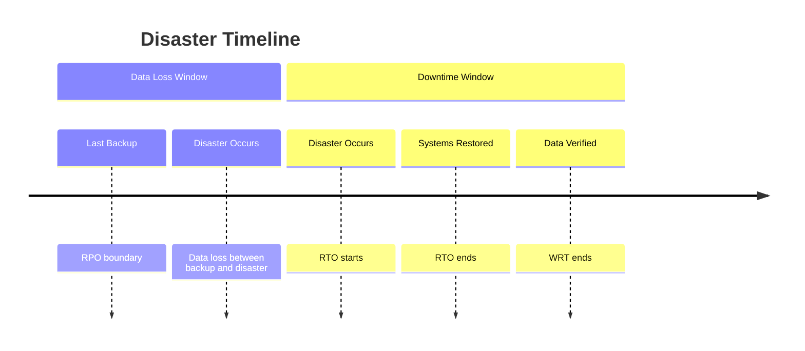
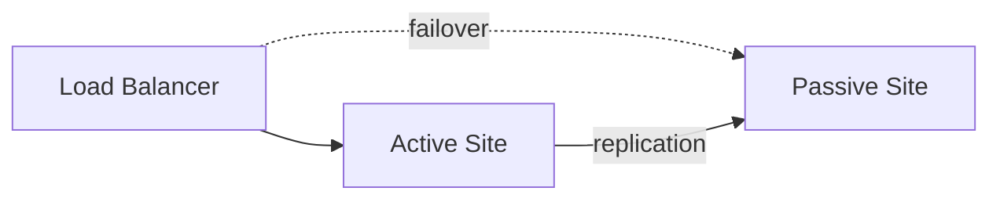
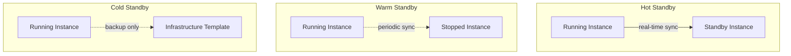
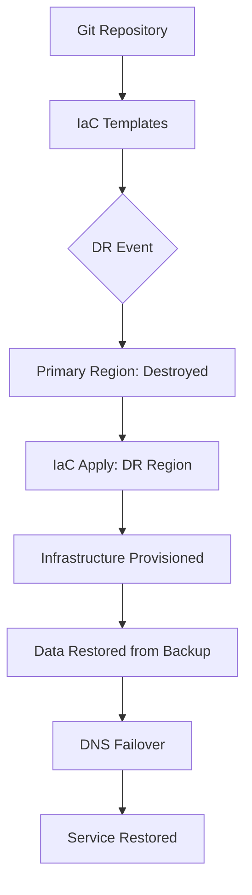

---
tags:
  - software-engineering
  - swebok
  - ka06
  - operations
  - capacity-management
  - disaster-recovery
  - site-reliability
source: "SWEBOK v4 Chapter 06"
aliases:
  - Capacity Planning
  - Disaster Recovery
  - DR Planning
  - RPO/RTO
created: 2026-07-21
---

# 07 — Capacity Management & Disaster Recovery

> **Source:** SWEBOK v4 Chapter 06 — Software Engineering Operations, Section 6.2
> **Focus:** Ensuring systems can handle current and future workloads, and that services can be recovered within acceptable time and data-loss boundaries after a disruptive event.

---

## Overview

Capacity management and disaster recovery are two pillars of operational planning that determine whether a system can **sustain** its workload and **survive** catastrophic failure. Capacity management answers: *"Do we have enough resources?"* Disaster recovery answers: *"What happens when everything goes wrong?"*

Together, they form the backbone of operational resilience. A system that scales perfectly but cannot recover from a datacenter outage is just as fragile as one that recovers instantly but collapses under a traffic spike. SWEBOK KA 6.2 treats these as interrelated planning activities that must be driven by business requirements (SLAs, cost constraints, regulatory mandates) and validated through regular rehearsal.

---

## Part A: Capacity Management

### 1. What Is Capacity Management?

Capacity management is the discipline of ensuring that IT resources (compute, storage, network, database connections, external service quotas) are sufficient to meet current and projected demand at acceptable cost and performance levels.

Key responsibilities:

| Responsibility | Description |
|---|---|
| **Sizing** | Determine resource requirements for a given workload |
| **Monitoring** | Track actual utilization against baselines |
| **Forecasting** | Project future demand from historical trends and business plans |
| **Optimization** | Right-size resources to eliminate waste |
| **Planning** | Produce a capacity plan with costed options for leadership |

> *"Capacity management is not about having infinite resources; it is about having the right resources at the right time at the right cost."*

---

### 2. Sizing Models and Workload Estimation

#### 2.1 Workload Characterization

Before sizing infrastructure, characterize the workload:

| Dimension | Example Metric |
|---|---|
| **Request rate** | 5,000 HTTP requests/sec at peak |
| **Data volume** | 2 TB new data per day |
| **Concurrent users** | 50,000 simultaneous sessions |
| **Transaction complexity** | Average 12 DB queries per request |
| **Read/write ratio** | 80% reads / 20% writes |
| **Seasonality** | 3x traffic during holiday sales |

Workload characterization feeds into **sizing models** — mathematical or simulation-based representations of how a system behaves under load.

#### 2.2 Sizing Approaches

| Approach | When to Use | Method |
|---|---|---|
| **Analytical modeling** | Well-understood, linear systems | Queueing theory (M/M/c, M/G/1), Little's Law |
| **Simulation** | Complex, non-linear interactions | Discrete-event simulation (e.g., SimPy) |
| **Benchmarking** | Comparing hardware/software options | Standard workloads (TPC-C, YCSB) |
| **Empirical measurement** | Existing production systems | Load testing + APM data extrapolation |
| **Rule-of-thumb** | Quick initial estimates | "1 vCPU per 100 req/s" (validate later) |

**Little's Law** is the most fundamental sizing relationship:

$$L = \lambda W$$

Where $L$ is the average number of concurrent requests, $\lambda$ is the arrival rate, and $W$ is the average response time. If you know any two, you can derive the third.

#### 2.3 Performance Baselines

A **performance baseline** is a snapshot of system behavior under known conditions. Baselines enable capacity planning by providing reference points:

| Baseline Type | Description | Use Case |
|---|---|---|
| **Idle baseline** | System with no load | Detect resource leaks |
| **Normal load** | Typical production traffic | Day-to-day capacity checks |
| **Peak load** | Highest observed traffic | Stress test target |
| **Breaking point** | Load at which SLAs are violated | Safety margin calculation |

Baselines should be captured after every significant change (new feature, infrastructure resize, configuration change) and stored as time-series data for trend analysis.

---

### 3. Capacity Planning Process

#### 3.1 The Capacity Plan

A capacity plan is a formal document that:

1. **States current utilization** across all resource types
2. **Projects future demand** for 3, 6, and 12 month horizons
3. **Identifies constraints** (physical limits, licensing, budget)
4. **Presents costed options** — each with trade-offs:

| Option | Description | Cost | Risk | Timeline |
|---|---|---|---|---|
| **Option A: Do nothing** | Accept current risk | $0 | High — projected demand exceeds capacity in 4 months | N/A |
| **Option B: Vertical scale-up** | Upgrade to larger instances | $8K/mo | Low — proven approach | 1 week |
| **Option C: Horizontal scale-out** | Add 4 more app servers | $12K/mo | Medium — requires load balancer tuning | 2 weeks |
| **Option D: Architecture change** | Migrate to serverless | $15K/mo (variable) | High — re-architecture needed | 3 months |

#### 3.2 SLA-Driven Capacity Planning

Capacity decisions must be driven by **Service Level Agreements** (see [[08_Service_Operations_and_Support|Service Operations]]):

| SLA Metric | Target | Capacity Implication |
|---|---|---|
| Availability | 99.95% (22 min downtime/month) | N+1 redundancy minimum |
| P95 latency | < 200ms | Headroom for GC pauses, DB slow queries |
| P99 latency | < 500ms | Sufficient queue depth, connection pools |
| Throughput | 10,000 req/s sustained | Horizontal scaling or vertical headroom |
| Error rate | < 0.1% | Circuit breakers, retry budgets |

**Headroom planning**: Always provision 20-30% above peak expected load to absorb:
- Traffic spikes
- Instance failures (N-1 scenarios)
- Background tasks (backups, compactions)
- Deployment overhead (rolling restarts)

---

### 4. Vertical vs. Horizontal Scaling

| Aspect | Vertical (Scale Up) | Horizontal (Scale Out) |
|---|---|---|
| **Approach** | Bigger machine (more CPU/RAM/disk) | More machines |
| **Complexity** | Low — same architecture | High — requires stateless design, load balancing |
| **Limit** | Hardware ceiling (single machine max) | Theoretically unlimited |
| **Downtime** | Often requires restart | Zero-downtime with rolling deploys |
| **Cost curve** | Exponential (enterprise hardware) | Linear (commodity hardware) |
| **State management** | Simple — local state | Complex — distributed state, consistency |
| **Fault tolerance** | Single point of failure | Redundancy by design |
| **Best for** | Databases (initially), legacy apps, stateful services | Web apps, microservices, stateless workloads |

**Practical guidance**: Start vertical until you hit constraints, then go horizontal. Many systems benefit from a hybrid: vertically scaled database + horizontally scaled application tier.

#### 4.1 Auto-Scaling Strategies

| Strategy | Trigger | Example |
|---|---|---|
| **Reactive** | Metric threshold exceeded | CPU > 70% for 5 min → add instance |
| **Predictive** | Scheduled/forecasted | Scale up at 8am weekdays, down at midnight |
| **Scheduled** | Known events | Black Friday pre-scaling |
| **ML-based** | Learned patterns | Cloud ML predicts demand from historical patterns |

Auto-scaling requires stateless application design. Stateful services (databases, caches) need different strategies: read replicas, sharding, or managed services.

---

### 5. Performance Monitoring for Capacity

Capacity planning without monitoring is guessing. Key metrics:

| Layer | Metrics | Tools |
|---|---|---|
| **Infrastructure** | CPU utilization, memory pressure, disk I/O, network bandwidth | Prometheus + node_exporter, CloudWatch |
| **Application** | Request rate, error rate, latency percentiles (P50/P95/P99) | APM (Datadog, New Relic, OpenTelemetry) |
| **Database** | Query throughput, connection pool usage, replication lag, buffer hit ratio | pg_stat_statements, MySQL Performance Schema |
| **Queue/Cache** | Queue depth, consumer lag, cache hit rate, eviction rate | Kafka consumer lag, Redis INFO |
| **External** | Third-party API latency, rate limit headroom | Synthetic monitoring |

> See also: [[Fundamental/13 CI CD Pipelines|CI/CD Pipelines]] for deployment-time capacity checks and [[03_Accelerating_Flow|Accelerating Flow]] for optimizing throughput.

---

## Part B: Disaster Recovery

### 6. Disaster Recovery Fundamentals

Disaster recovery (DR) is the set of policies, tools, and procedures to recover technology systems after a catastrophic event. Events include:

- **Natural disasters**: Earthquakes, floods, hurricanes
- **Infrastructure failures**: Datacenter power loss, network partition
- **Cyber attacks**: Ransomware, data destruction
- **Human error**: Accidental deletion, misconfiguration
- **Supply chain**: Cloud provider outage, DNS failure

#### 6.1 RPO and RTO

The two most critical DR metrics:

| Metric | Definition | Question It Answers | Example |
|---|---|---|---|
| **RPO** (Recovery Point Objective) | Maximum acceptable data loss measured in time | *"How much data can we afford to lose?"* | RPO = 1 hour → must have backups at least every hour |
| **RTO** (Recovery Time Objective) | Maximum acceptable downtime | *"How quickly must we be back online?"* | RTO = 30 min → automated failover required |
| **RTO + RPO together** | Define the full recovery contract | Both data loss AND downtime windows | RPO 1h + RTO 30min = last hour's data lost, service back in 30 min |

Derived metrics:

| Metric | Definition |
|---|---|
| **MTTR** (Mean Time to Recover) | Actual average recovery time — must be < RTO |
| **MTD** (Maximum Tolerable Downtime) | Absolute ceiling beyond which the business cannot survive |
| **WRT** (Work Recovery Time) | Time to verify data integrity and consistency after recovery |

**RPO drives backup frequency. RTO drives architecture choices.**

| RTO Requirement | Architecture Pattern |
|---|---|
| Hours | Manual restore from backup |
| 30-60 min | Warm standby with automated scripts |
| 5-15 min | Hot standby with automated failover |
| < 5 min | Active-active multi-region |
| Zero downtime | Active-active with zero-downtime deploys |

---

### 7. Backup Strategies

#### 7.1 Backup Types

| Type | What It Backs Up | Speed | Storage | Restore Speed | Use Case |
|---|---|---|---|---|---|
| **Full** | Entire dataset | Slow (reads everything) | High | Fast (single restore) | Weekly/monthly baseline |
| **Incremental** | Changes since last backup of any type | Fast | Low | Slow (full + all incrementals) | Daily/hourly backups |
| **Differential** | Changes since last full backup | Medium | Medium | Medium (full + latest differential) | Compromise approach |
| **Continuous** | Real-time replication (WAL shipping, binlog) | Real-time | Variable | Fast (point-in-time recovery) | Low-RPO requirements |
| **Snapshot** | Point-in-time block-level copy | Very fast | Variable | Fast | VM/container backups |

#### 7.2 Backup Rotation Schemes

**The 3-2-1 Rule**: 3 copies of data, on 2 different media types, with 1 copy offsite.

| Scheme | Description | Pros | Cons |
|---|---|---|---|
| **GFS (Grandfather-Father-Son)** | Daily (son), weekly (father), monthly (grandfather) | Well-understood, balances retention vs storage | Requires planning for retention periods |
| **Tower of Hanoi** | Rotating levels of granularity | Efficient storage usage | Complex to understand |
| **FIFO (First In, First Out)** | Keep last N backups | Simple | No long-term retention |
| **Forever Incremental** | One full + continuous incrementals | Low storage, fast daily backups | Restore chain dependency |

**GFS Example:**

| Retention | Copies | Interval |
|---|---|---|
| Son (daily) | 7 | Daily for 1 week |
| Father (weekly) | 4 | Weekly for 1 month |
| Grandfather (monthly) | 12 | Monthly for 1 year |
| Great-grandfather (yearly) | 3 | Yearly for 3 years |

#### 7.3 Offsite and Cloud Storage

| Storage Tier | Access Time | Cost | Use Case |
|---|---|---|---|
| **Hot** (S3 Standard, Azure Hot) | Milliseconds | $$$ | Active backups, recent recovery points |
| **Cool** (S3 IA, Azure Cool) | Milliseconds | $$ | Older backups, compliance archives |
| **Cold** (S3 Glacier, Azure Archive) | Minutes to hours | $ | Long-term retention, regulatory |
| **Offsite tape/vault** | Hours to days | ¢ | Deep archive, air-gapped protection |

**Air-gapped backups** are critical for ransomware resilience: backups that are physically or logically disconnected from the production network cannot be encrypted by an attacker who compromises production systems.

---

### 8. Failover Patterns

#### 8.1 Active-Passive

| Aspect | Detail |
|---|---|
| **How it works** | Active site handles all traffic; passive site is on standby |
| **Data sync** | Synchronous or asynchronous replication |
| **Failover time** | Minutes (manual) to seconds (automated health checks) |
| **Cost** | 2x infrastructure, but passive can be smaller |
| **Risk** | "Failover fright" — passive may not work if never tested |

#### 8.2 Active-Active

| Aspect | Detail |
|---|---|
| **How it works** | All sites handle traffic simultaneously |
| **Data sync** | Multi-master replication, eventual consistency, or conflict resolution |
| **Failover time** | Near-zero (traffic rerouted by DNS/load balancer) |
| **Cost** | 2x+ infrastructure (both sites fully provisioned) |
| **Challenge** | Data consistency, conflict resolution, split-brain |

#### 8.3 Standby Tiers

| Tier | RTO | Cost | Description |
|---|---|---|---|
| **Hot standby** | Seconds to minutes | High | Running systems, data replicated in real-time, automated failover |
| **Warm standby** | Minutes to 1 hour | Medium | Systems configured but not running, data replicated periodically |
| **Cold standby** | Hours to days | Low | Infrastructure blueprints ready, backups available, manual provisioning |

---

### 9. Recovery Rehearsal

> *"Hope is not a strategy."* — Recovery must be practiced, not just documented.

#### 9.1 Types of Rehearsal

| Practice | Scope | Frequency | Description |
|---|---|---|---|
| **Tabletop exercise** | Process | Quarterly | Walk through DR plan verbally; identify gaps |
| **DR drill** | Infrastructure | Semi-annually | Execute failover to DR site; measure actual RTO/RPO |
| **Game day** | Full system | Annually | Planned disruption event; entire team participates |
| **Chaos engineering** | Continuous | Ongoing | Automated fault injection in production (see below) |
| **Backup restore test** | Data | Monthly | Verify backups can actually be restored |

#### 9.2 Chaos Engineering

Chaos engineering is the discipline of experimenting on a system to build confidence in its ability to withstand turbulent conditions in production. Popularized by Netflix's Chaos Monkey.

| Tool | Description |
|---|---|
| **Chaos Monkey** | Randomly terminates instances in production |
| **Chaos Kong** | Simulates entire region failure |
| **Litmus** | Kubernetes-native chaos framework |
| **Gremlin** | Commercial chaos engineering platform |
| **AWS Fault Injection Simulator** | Managed chaos for AWS services |

**Chaos engineering principles:**
1. Define a "steady state" (normal behavior metrics)
2. Hypothesize that steady state will continue during disruption
3. Introduce real-world faults (server crash, network latency, disk failure)
4. Try to disprove the hypothesis
5. Automate findings into permanent resilience improvements

> See also: [[05_Continual_Learning|Continual Learning]] for the feedback loop that chaos engineering closes.

---

### 10. Infrastructure as Code for DR

Infrastructure as Code (IaC) transforms DR from a manual, error-prone process into a repeatable, version-controlled one.

| IaC Tool | DR Capability |
|---|---|
| **Terraform** | Multi-provider infrastructure provisioning; state files enable re-creation |
| **AWS CloudFormation** | Stack-based provisioning with drift detection |
| **Pulumi** | IaC in general-purpose languages; complex logic in DR scripts |
| **Ansible** | Configuration management; post-provisioning setup |

**DR with IaC workflow:**

**Benefits of IaC for DR:**
- **Reproducibility**: Identical environments every time
- **Version control**: Track changes to DR infrastructure
- **Testing**: Validate DR by applying to a test environment
- **Speed**: Automated provisioning vs. manual setup
- **Documentation**: The code IS the documentation

---

### 11. Multi-Region and Multi-Cloud Strategies

#### 11.1 Multi-Region

| Strategy | Description | RPO/RTO | Complexity |
|---|---|---|---|
| **Backup-restore** | Backups replicated to another region; manual restore | RPO: hours, RTO: hours | Low |
| **Pilot light** | Minimal infrastructure running in DR region; scale up on failover | RPO: minutes, RTO: 15-30 min | Medium |
| **Warm standby** | Scaled-down but fully functional copy | RPO: seconds, RTO: 5-15 min | Medium-High |
| **Multi-site active-active** | Full infrastructure in 2+ regions | RPO: near-zero, RTO: near-zero | High |

#### 11.2 Multi-Cloud

| Motivation | Approach | Trade-off |
|---|---|---|
| Avoid vendor lock-in | Abstraction layers (Terraform, Kubernetes) | Increased complexity |
| Regulatory requirements | Workload-specific cloud selection | Operational overhead |
| Best-of-breed services | Use each cloud's strengths | Integration complexity |
| DR across providers | Active in one cloud, standby in another | Data transfer costs |

**Multi-cloud reality check**: True multi-cloud (same app running on multiple clouds simultaneously) is extremely complex. Most organizations mean **multi-cloud adjacent** — different workloads on different clouds, with shared networking.

---

## Integration with Other KAs

| Related Topic | Connection |
|---|---|
| [[01_The_Three_Ways|The Three Ways]] | Flow (fast recovery), Feedback (monitoring-driven capacity), Learning (chaos engineering) |
| [[02_Where_to_Start|Where to Start]] | Start capacity planning with visible constraints |
| [[04_Amplifying_Feedback|Amplifying Feedback Telemetry]] | Monitoring feeds capacity planning and DR validation |
| [[06_DevSecOps_and_Compliance|DevSecOps]] | Backup encryption, access controls for DR infrastructure |
| [[Fundamental/13 CI CD Pipelines|CI/CD Pipelines]] | Deployment capacity checks, automated DR validation |
| [[Fundamental/14 Docker & Containerization|Docker & Containerization]] | Container orchestration enables auto-scaling and failover |
| [[08_Service_Operations_and_Support|Service Operations]] | SLA definitions drive RPO/RTO and capacity targets |

---

## Key Takeaways

1. **Capacity management is continuous**, not a one-time activity. Monitor, forecast, plan, implement, repeat.
2. **RPO and RTO are business decisions**, not technical ones. They drive architecture choices, not the other way around.
3. **Backups are worthless if untested.** Regular restore testing is non-negotiable.
4. **IaC transforms DR** from manual runbooks into repeatable, testable code.
5. **Chaos engineering** closes the gap between DR documentation and actual recovery capability.
6. **The 3-2-1 rule** (3 copies, 2 media, 1 offsite) remains the gold standard for backup strategy.
7. **Start with vertical scaling** for simplicity; go horizontal when you hit limits or need fault tolerance.
8. **Auto-scaling requires stateless design** — plan your architecture accordingly.

---

## Glossary

| Term | Definition |
|---|---|
| **RPO** | Recovery Point Objective — maximum tolerable data loss |
| **RTO** | Recovery Time Objective — maximum tolerable downtime |
| **MTTR** | Mean Time to Recover — actual average recovery time |
| **MTD** | Maximum Tolerable Downtime — absolute business survival limit |
| **WRT** | Work Recovery Time — time to verify data after recovery |
| **GFS** | Grandfather-Father-Son backup rotation scheme |
| **Failover** | Automatic or manual switch to a standby system |
| **Split-brain** | Two nodes believe they are both primary |
| **Headroom** | Capacity reserve above projected peak load |
| **Pilot light** | Minimal DR infrastructure that can be scaled up quickly |

---

*See also: [[Software Engineering Operations Overview]] for the full KA 06 map.*
