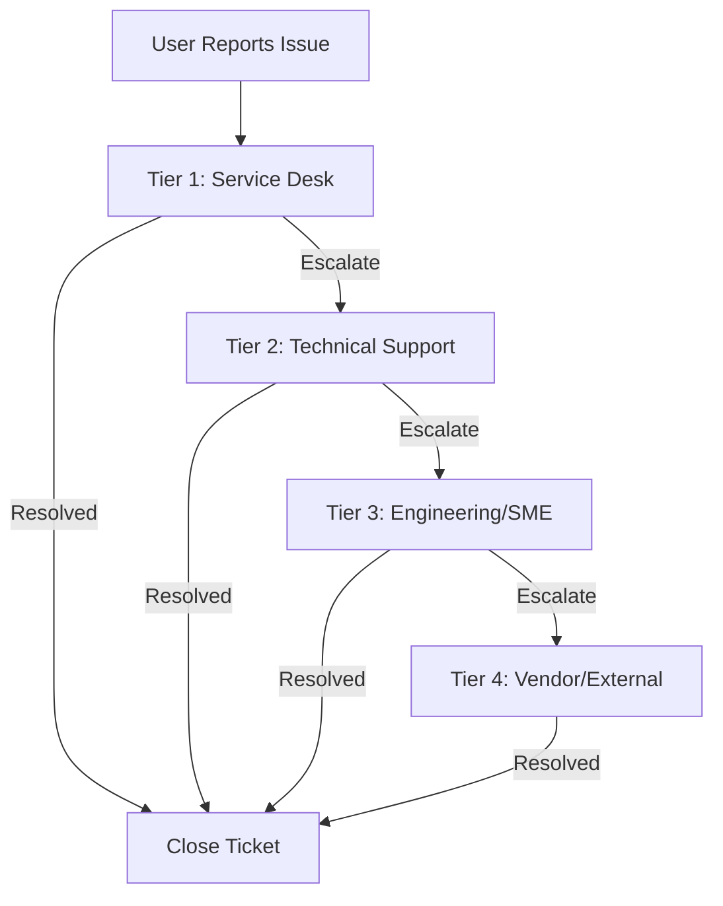
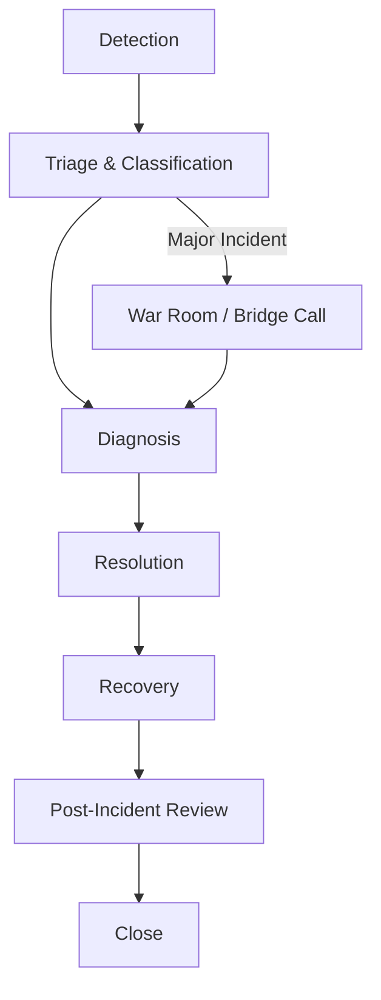
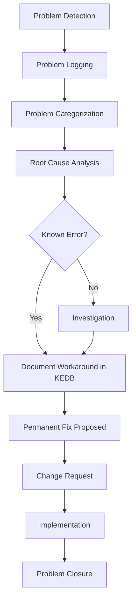
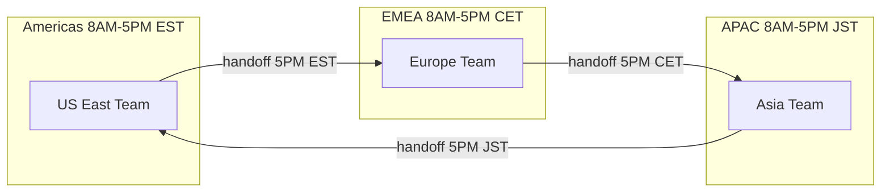
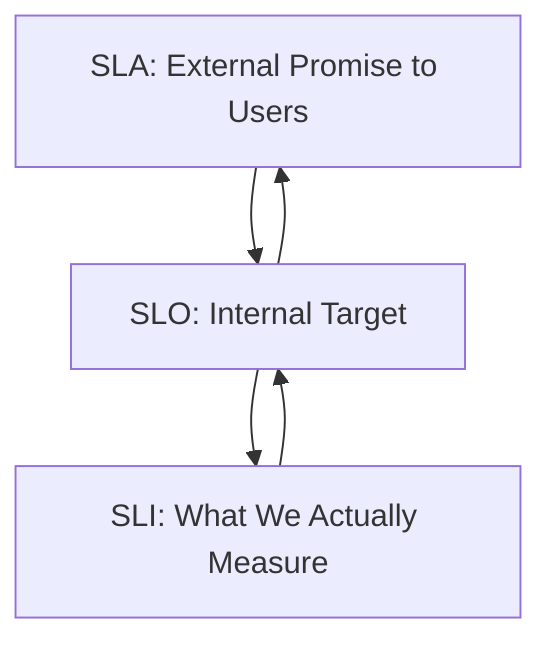

---
tags:
  - software-engineering
  - swebok
  - ka06
  - operations
  - service-operations
  - service-support
  - incident-management
source: "SWEBOK v4 Chapter 06"
aliases:
  - Service Operations
  - Service Support
  - Incident Management
  - Problem Management
  - Service Desk
created: 2026-07-21
---

# 08 — Service Operations & Support

> **Source:** SWEBOK v4 Chapter 06 — Software Engineering Operations, Section 6.4
> **Focus:** The operational disciplines that keep services running and users supported: service reporting, service desk operations, incident and problem management, support models, and service level management.

---

## Overview

Service operations is where software meets its users. A feature that works in development but cannot be monitored, supported, or reported on in production is not done. SWEBOK KA 6.4 covers the organizational and process machinery that ensures software services are delivered, measured, and improved continuously.

This note covers five interconnected domains:

1. **Service Reporting** — what to measure and how to communicate it
2. **Service Desk Operations** — the front door for all user issues
3. **Incident vs. Problem Management** — fixing symptoms vs. fixing causes
4. **Operations Support Models** — how to structure teams for 24/7 coverage
5. **Service Level Management** — the contracts that bind everything together

---

## Part A: Service Reporting

### 1. Purpose of Service Reporting

Service reporting transforms raw operational data into actionable intelligence for stakeholders. Without reporting, monitoring data sits unused and leadership makes decisions based on intuition rather than evidence.

**Key principle**: Every report must have an audience, a decision it enables, and an action it drives.

### 2. Types of Service Reports

| Report Type | Audience | Frequency | Purpose |
|---|---|---|---|
| **System health dashboard** | Operations team | Real-time | Current state of all services |
| **Availability report** | Management, customers | Monthly | SLA compliance tracking |
| **Incident summary** | Leadership, engineering | Weekly | Trend analysis, recurring issues |
| **Capacity report** | Infrastructure team | Monthly | Resource utilization and forecasting |
| **Security posture report** | CISO, compliance | Monthly/Quarterly | Vulnerability status, patch compliance |
| **Change report** | Change advisory board | Per-change | Impact assessment, approval tracking |
| **Cost report** | Finance, leadership | Monthly | Cloud spend, operational costs |

### 3. Key Performance Indicators (KPIs)

#### 3.1 Availability and Reliability KPIs

| KPI | Formula | Target Example |
|---|---|---|
| **Availability** | Uptime / (Uptime + Downtime) × 100 | 99.95% |
| **MTBF** (Mean Time Between Failures) | Total uptime / Number of failures | > 720 hours |
| **MTTR** (Mean Time to Recover) | Total downtime / Number of incidents | < 30 minutes |
| **Error rate** | Failed requests / Total requests | < 0.1% |
| **SLA compliance** | Time within SLA / Total time × 100 | > 99.9% |

#### 3.2 Performance KPIs

| KPI | Definition | Target Example |
|---|---|---|
| **P50 latency** | Median response time | < 50ms |
| **P95 latency** | 95th percentile response time | < 200ms |
| **P99 latency** | 99th percentile response time | < 500ms |
| **Throughput** | Requests processed per second | > 10,000 req/s |
| **Saturation** | Resource utilization (CPU, memory, disk) | < 70% at peak |

#### 3.3 Operational KPIs

| KPI | Definition | Target Example |
|---|---|---|
| **Change failure rate** | Failed changes / Total changes | < 5% |
| **Deployment frequency** | Deployments per time period | Multiple per day |
| **Lead time for changes** | Commit to production | < 1 hour |
| **Incident resolution time** | Time from detection to resolution | < 1 hour (P1) |
| **First contact resolution** | Resolved at first interaction | > 70% |

### 4. System Health Dashboards

A well-designed operations dashboard follows the **monitoring hierarchy**:

```mermaid
flowchart TB
    subgraph Level 1: Overview
        SLO[SLO Status: Green/Yellow/Red]
        ALERT[Active Alerts: 3]
        DEPLOY[Last Deploy: 2h ago]
    end
    subgraph Level 2: Service Health
        API[API: Healthy]
        DB[Database: Warning]
        CACHE[Cache: Healthy]
        QUEUE[Queue: Backlog 5K]
    end
    subgraph Level 3: Detail
        LATENCY[Latency P99: 450ms]
        ERRORS[Error Rate: 0.08%]
        CPU[CPU: 65%]
        DISK[Disk: 78%]
    end
    Level 1 --> Level 2
    Level 2 --> Level 3
```

**Dashboard design principles:**
- **Level 1**: At-a-glance status — can I go back to sleep? (for on-call)
- **Level 2**: Service-level health — which component is degraded?
- **Level 3**: Deep metrics — what exactly is wrong?
- Use color coding: Green (healthy), Yellow (warning), Red (critical)
- Avoid vanity metrics — every metric should drive a decision

### 5. Security Posture Reporting

| Metric | Description | Reporting Frequency |
|---|---|---|
| **Open vulnerabilities** | By severity (Critical/High/Medium/Low) | Weekly |
| **Patch compliance** | % of systems at current patch level | Monthly |
| **Mean time to patch** | Time from CVE disclosure to patch applied | Monthly |
| **Failed login attempts** | Brute force detection, account lockouts | Daily |
| **Certificate expiry** | TLS certificates expiring within 30/60/90 days | Weekly |
| **Access review status** | % of access reviews completed | Quarterly |

### 6. Configuration Change Reporting

| Metric | Description |
|---|---|
| **Changes per period** | Total changes approved, rejected, implemented |
| **Change success rate** | % of changes without rollback |
| **Emergency changes** | Changes outside normal process (should decrease over time) |
| **Unauthorized changes** | Changes detected without approval (should be zero) |
| **Change lead time** | Request to implementation duration |

> See also: [[06_DevSecOps_and_Compliance|DevSecOps & Compliance]] for security integration and change management practices.

---

## Part B: Service Desk Operations

### 7. The Service Desk Function

The service desk is the **single point of contact (SPOC)** between IT and users. It handles incidents, service requests, and acts as the communication channel for planned changes and outages.

**Core responsibilities:**
- Incident detection and logging
- First-level diagnosis and resolution
- Escalation to specialist teams
- Service request fulfillment
- Communication during major incidents
- Knowledge base maintenance

### 8. Support Tier Model



| Tier | Role | Skills | Resolution Target | Examples |
|---|---|---|---|---|
| **T1** | Service desk / Help desk | General IT knowledge, scripts, KB | 70% of tickets | Password reset, access requests, how-to questions |
| **T2** | Technical support | Deep product/system knowledge | 20% of tickets | Configuration issues, performance problems, integration failures |
| **T3** | Engineering / SME | Code-level debugging, architecture | 8% of tickets | Bug fixes, root cause analysis, design changes |
| **T4** | External vendor | Vendor-specific expertise | 2% of tickets | Third-party software bugs, hardware failures, cloud provider issues |

### 9. Escalation Procedures

**Functional escalation** (tier to tier): Issue moves to a team with deeper expertise.

**Hierarchical escalation** (management involvement): Used when:
- SLA breach is imminent
- Customer is VIP or executive
- Multiple teams are involved with no clear owner
- Communication has broken down

**Escalation matrix:**

| Severity | T1 Timeout | T2 Timeout | Management Alert | Executive Alert |
|---|---|---|---|---|
| **P1 (Critical)** | 15 min | 30 min | 1 hour | 2 hours |
| **P2 (High)** | 30 min | 2 hours | 4 hours | N/A |
| **P3 (Medium)** | 4 hours | 8 hours | 24 hours | N/A |
| **P4 (Low)** | 24 hours | 48 hours | N/A | N/A |

### 10. Knowledge Management

A mature service desk maintains a **Known Error Database (KEDB)** and a **Knowledge Base (KB)**:

| Repository | Content | Purpose |
|---|---|---|
| **Knowledge Base** | How-to articles, troubleshooting guides, FAQs | Empower T1 to resolve without escalation |
| **Known Error Database** | Documented problems with workarounds | Immediate resolution for known issues |
| **Configuration Management Database (CMDB)** | Asset and configuration relationships | Impact analysis, root cause tracing |

**Knowledge-centered service (KCS) principles:**
1. Create knowledge as a by-product of solving problems
2. Evolve knowledge based on demand and usage
3. Reuse, improve, and create knowledge articles collaboratively
4. Reward learning, collaboration, and knowledge sharing

---

## Part C: Incident Management vs. Problem Management

### 11. Definitions

| Concept | Definition | Goal | Timeframe |
|---|---|---|---|
| **Incident** | An unplanned interruption to a service or reduction in service quality | **Restore service** as quickly as possible | Minutes to hours |
| **Problem** | The root cause of one or more incidents | **Eliminate the root cause** to prevent recurrence | Days to weeks |
| **Known Error** | A problem with a documented root cause and workaround | Provide workaround while permanent fix is developed | Until permanent fix |

> **Analogy**: If the building is on fire, incident management puts out the fire. Problem management investigates why the fire started and installs sprinklers.

### 12. Incident Management Lifecycle



**Incident severity classification:**

| Severity | Impact | Response Time | Resolution Target | Communication |
|---|---|---|---|---|
| **SEV-1 (Critical)** | Complete service outage or data loss | 15 min | 1 hour | All-hands, executive notification, status page |
| **SEV-2 (High)** | Major feature degraded, significant user impact | 30 min | 4 hours | Team lead, affected stakeholders |
| **SEV-3 (Medium)** | Minor feature degraded, workaround available | 4 hours | 24 hours | Standard ticket workflow |
| **SEV-4 (Low)** | Cosmetic issue, informational | 24 hours | 1 week | Standard ticket workflow |

### 13. Problem Management Lifecycle



**Root Cause Analysis techniques:**

| Technique | Description | Best For |
|---|---|---|
| **5 Whys** | Ask "why" repeatedly until root cause is found | Simple incidents with clear causal chain |
| **Fishbone diagram** | Categorize potential causes (People, Process, Technology, Environment) | Complex incidents with multiple potential causes |
| **Fault tree analysis** | Top-down Boolean logic of failure modes | Safety-critical systems |
| **Timeline analysis** | Map events chronologically | Complex incidents with many actors |
| **Blameless post-mortem** | Focus on systems, not individuals | Building a learning culture |

### 14. Incident vs. Problem: Key Differences

| Aspect | Incident Management | Problem Management |
|---|---|---|
| **Focus** | Speed of resolution | Accuracy of root cause |
| **Trigger** | User reports or monitoring alert | Trend analysis, recurring incidents |
| **Approach** | Workaround first | Investigation first |
| **Success metric** | MTTR | Number of recurring incidents eliminated |
| **Staffing** | Operations, service desk | Engineering, architecture |
| **Culture** | "Get it working" | "Why did it break?" |

> See also: [[04_Amplifying_Feedback|Amplifying Feedback]] for the telemetry systems that detect incidents and [[05_Continual_Learning|Continual Learning]] for the blameless post-mortem culture.

---

## Part D: Operations Support Models

### 15. Support Model Options

| Model | Description | Pros | Cons | Best For |
|---|---|---|---|---|
| **Follow-the-sun** | Teams in different time zones hand off work | 24/7 coverage without night shifts | Handoff errors, coordination overhead | Global organizations |
| **Dedicated team** | Single team owns the service | Deep knowledge, accountability | Burnout without rotation | Critical, complex services |
| **On-call rotation** | Engineers rotate being available after hours | Cost-effective, shared burden | Alert fatigue, work-life impact | Most engineering teams |
| **Outsourced operations** | Third-party manages operations | Cost reduction, access to skills | Less control, knowledge loss | Non-core services |
| **Hybrid** | Mix of in-house + outsourced | Flexibility | Complexity | Large organizations |

### 16. Follow-the-Sun Model



**Handoff checklist:**
- Open incidents with current status and next actions
- Planned maintenance or changes
- Ongoing investigations
- Escalation context and communications
- Environmental anomalies or monitoring gaps

### 17. On-Call Best Practices

| Practice | Description |
|---|---|
| **Rotation schedule** | Never the same person two weeks in a row |
| **Secondary on-call** | Backup if primary doesn't respond within 5 min |
| **Alert quality** | Every alert must be actionable; tune noisy alerts |
| **Runbooks** | Documented procedures for common alerts |
| **Incident commander** | Designated leader for major incidents |
| **Compensation** | On-call pay or time-in-lieu |
| **Post-call rest** | Day off after a night of pages |
| **Blameless culture** | No punishment for pages or mistakes |

> See also: [[03_Accelerating_Flow|Accelerating Flow]] for reducing toil and [[01_The_Three_Ways|The Three Ways]] for the feedback principles behind effective alerting.

---

## Part E: Service Level Management

### 18. SLA, SLO, and SLI Definitions

These three terms form a hierarchy from user-facing promise to technical measurement:



| Term | Definition | Owner | Example |
|---|---|---|---|
| **SLI** (Service Level Indicator) | A quantitative measure of a service's behavior | Engineering | "99.97% of requests succeeded with < 200ms latency this month" |
| **SLO** (Service Level Objective) | Target value for an SLI | Engineering + Product | "99.9% of requests should succeed with < 200ms latency" |
| **SLA** (Service Level Agreement) | External contract with consequences for breach | Business + Legal | "If availability < 99.9%, customer receives 10% credit" |

**Relationship:**
- **SLIs** are what you measure (raw data)
- **SLOs** are what you aim for (internal targets, more strict than SLAs)
- **SLAs** are what you promise (external contracts, with financial penalties)

> **Golden rule**: Set SLOs tighter than SLAs to create a safety buffer. If SLA = 99.9%, set SLO = 99.95%.

### 19. Common SLI Categories

| Category | SLI Examples | Measurement |
|---|---|---|
| **Availability** | Successful requests / Total requests | Uptime checks, health endpoints |
| **Latency** | Request duration at P50/P95/P99 | Application performance monitoring |
| **Throughput** | Requests processed per second | Load balancer metrics |
| **Correctness** | Requests returning correct results | Synthetic tests, data validation |
| **Freshness** | Time since data was last updated | Replication lag monitoring |
| **Coverage** | % of data processed within time window | Batch job completion rates |

### 20. Error Budgets

An **error budget** is the inverse of an SLO. If your SLO is 99.9% availability, your error budget is 0.1% — the amount of unavailability you can "spend" on deployments, experiments, and incidents.

| Month | SLO | Error Budget | Budget Used | Budget Remaining |
|---|---|---|---|---|
| January | 99.9% (43.8 min downtime) | 43.8 min | 12 min (incidents) | 31.8 min |
| February | 99.9% | 40.3 min | 45 min (bad deploy) | **-4.7 min (over budget)** |
| March | 99.9% | 43.8 min | 5 min | 38.8 min |

**Error budget policy:**

| Budget Status | Action |
|---|---|
| **> 50% remaining** | Normal deployment velocity; experiment freely |
| **25-50% remaining** | Increase testing; slow down risky changes |
| **< 25% remaining** | Only critical fixes; freeze non-essential changes |
| **Exhausted (0%)** | Full deployment freeze; focus entirely on reliability |

Error budgets create a **shared incentive** between development (want to ship features) and operations (want stability). When the budget is healthy, dev ships faster. When it's depleted, everyone focuses on reliability. This eliminates the traditional dev vs. ops conflict.

### 21. Service Reviews

Regular service reviews ensure accountability and continuous improvement:

| Review Type | Frequency | Participants | Agenda |
|---|---|---|---|
| **Operational review** | Weekly | Ops team | Open incidents, recent changes, monitoring gaps |
| **Service review** | Monthly | Ops + Product + Engineering | SLI trends, error budget burn, upcoming changes |
| **Business review** | Quarterly | Leadership + all stakeholders | SLA compliance, cost trends, capacity forecasts, strategic decisions |

**Service review template:**
1. SLI dashboard review (actual vs. SLO)
2. Error budget status and burn rate
3. Incident summary (count, severity, MTTR trends)
4. Problem management status (open problems, known errors)
5. Change summary (volume, success rate, emergency changes)
6. Capacity and cost trends
7. Action items from previous review
8. Upcoming risks (traffic events, dependencies, end-of-life)

---

## Integration with Other KAs

| Related Topic | Connection |
|---|---|
| [[01_The_Three_Ways|The Three Ways]] | Feedback loop (monitoring → reporting → improvement), Flow (fast incident resolution) |
| [[02_Where_to_Start|Where to Start]] | Start with incident management; add problem management incrementally |
| [[03_Accelerating_Flow|Accelerating Flow]] | Reduce handoffs in escalation, automate common resolutions |
| [[04_Amplifying_Feedback|Amplifying Feedback Telemetry]] | Telemetry feeds SLIs, dashboards, and incident detection |
| [[05_Continual_Learning|Continual Learning]] | Blameless post-mortems, knowledge management, problem management |
| [[06_DevSecOps_and_Compliance|DevSecOps]] | Security incident management, compliance reporting |
| [[07_Capacity_and_Disaster_Recovery|Capacity & DR]] | SLA-driven capacity planning, RPO/RTO as SLI targets |
| [[Fundamental/13 CI CD Pipelines|CI/CD Pipelines]] | Change management, deployment frequency KPIs |

---

## Key Takeaways

1. **Service reporting must be audience-specific.** Operations needs dashboards; leadership needs summaries; customers need SLA compliance.
2. **The service desk is the front door.** Invest in T1 knowledge bases to resolve 70%+ of tickets without escalation.
3. **Incident management restores service; problem management prevents recurrence.** Both are essential; don't skip problem management because incidents are "fixed."
4. **Blameless post-mortems** are the foundation of a learning culture. Focus on systems, not individuals.
5. **SLIs → SLOs → SLAs** form a measurement hierarchy. Measure what matters, aim higher internally than you promise externally.
6. **Error budgets** align development velocity with operational reliability. They replace subjective arguments with data-driven decisions.
7. **Follow-the-sun** works for global organizations; on-call rotations work for most teams. The key is runbooks, alert quality, and compensation.
8. **Every report must drive an action.** If a report doesn't help someone make a decision, stop producing it.

---

## Glossary

| Term | Definition |
|---|---|
| **SLA** | Service Level Agreement — external contract with consequences |
| **SLO** | Service Level Objective — internal target for an SLI |
| **SLI** | Service Level Indicator — quantitative measure of service behavior |
| **Error budget** | Inverse of SLO; allowed unreliability for the period |
| **MTBF** | Mean Time Between Failures |
| **MTTR** | Mean Time to Recover |
| **CMDB** | Configuration Management Database |
| **KEDB** | Known Error Database |
| **KCS** | Knowledge-Centered Service |
| **SPOC** | Single Point of Contact |
| **CAB** | Change Advisory Board |
| **War room** | Dedicated space/team for major incident resolution |
| **Post-mortem** | Structured review after an incident to extract lessons |

---

*See also: [[Software Engineering Operations Overview]] for the full KA 06 map.*
