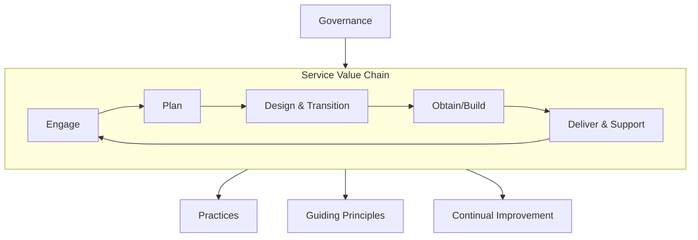
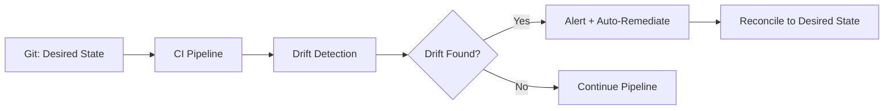
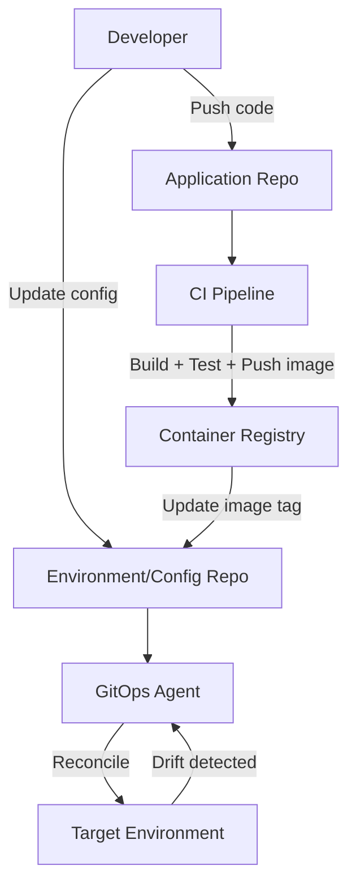

---
tags:
  - software-engineering
  - swebok
  - ka06
  - operations
  - iso29110
  - itil
  - gitops
  - platform-engineering
source: "SWEBOK v4 Chapter 06"
aliases:
  - ISO 29110
  - ITIL v4
  - GitOps
  - Platform Engineering
  - Environment Parity
created: 2026-07-21
---

# 09 — Operations Standards & Practices

> **Source:** SWEBOK v4 Chapter 06 — Software Engineering Operations, Section 6.5
> **Focus:** Standards, frameworks, and modern practices that structure operational work: ISO/IEC 29110, ITIL v4, environment parity, operational risk management, end-to-end automation, GitOps, and platform engineering.

---

## Overview

Operational excellence requires more than tools and talent; it requires **structured practices** grounded in standards and continuously refined through experience. SWEBOK KA 6.5 covers the standards and frameworks that provide this structure, along with modern engineering practices (GitOps, platform engineering) that are reshaping how operations is done.

This note covers:

1. **ISO/IEC 29110** — Lifecycle profiles for Very Small Entities
2. **ITIL v4** — The IT service management framework
3. **Environment Parity** — Keeping dev, staging, and production consistent
4. **Operational Risk Management** — Identifying and mitigating operational risks
5. **End-to-End Automation** — From provisioning to remediation
6. **GitOps** — Git as the single source of truth for infrastructure
7. **Platform Engineering** — Internal developer platforms and golden paths

---

## Part A: ISO/IEC 29110

### 1. What Is ISO/IEC 29110?

ISO/IEC 29110 is a series of standards and guides titled **"Lifecycle profiles for Very Small Entities (VSEs)"**. A VSE is an enterprise, organization, or part of an organization with **up to 25 people**. The standard acknowledges that small organizations cannot adopt heavyweight frameworks like ISO 12207 or CMMI without adaptation.

| Aspect | Detail |
|---|---|
| **Full title** | ISO/IEC 29110: Systems and Software Engineering — Lifecycle Profiles for Very Small Entities |
| **Target** | Very Small Entities (VSEs): 1-25 people |
| **Structure** | 5-part standard with profiles, process definitions, assessment guidelines |
| **Profiles** | Entry, Basic, Intermediate, Advanced |
| **Based on** | ISO/IEC 12207 (software lifecycle) and ISO/IEC 15288 (system lifecycle) |

### 2. Standard Structure

| Part | Title | Purpose |
|---|---|---|
| **Part 1** | Overview | Defines VSEs, profiles, and the overall framework |
| **Part 2** | Framework and taxonomy | Classifies VSE profiles and associated process groups |
| **Part 3** | Assessment guidelines | How to assess a VSE's conformance to a profile |
| **Part 4** | Profile specifications | Detailed process definitions for each profile level |
| **Part 5** | Management and engineering guide | Practical implementation guidance for VSEs |

### 3. Lifecycle Profiles

The standard defines four profiles of increasing maturity:


| Profile | Team Size | Process Scope | Typical Use |
|---|---|---|---|
| **Entry** | 1-3 people | Minimal: project management, software implementation | Startups, solo developers, prototypes |
| **Basic** | 4-10 people | Adds: requirements, design, testing, configuration management | Small product teams |
| **Intermediate** | 11-18 people | Adds: risk management, quality assurance, reviews | Growing companies with multiple teams |
| **Advanced** | 19-25 people | Full lifecycle: acquisition, operation, maintenance, reuse | Established VSEs with complex products |

### 4. Process Definitions

ISO/IEC 29110 defines processes grouped into categories:

| Process Group | Processes | Description |
|---|---|---|
| **Project Management (PM)** | Project Planning, Project Monitoring & Control, Product Acceptance | Plan, track, and deliver the project |
| **Software Implementation (SI)** | Software Requirements, Software Design, Software Construction, Software Integration & Tests, Product Delivery | Build and deliver the software |
| **Support (SU)** | Configuration Management, Quality Assurance, Problem Resolution | Cross-cutting support activities |
| **Operational (OP)** | Operation, Maintenance | Post-delivery operations (Advanced profile) |

**Each process is defined with:**
- **Purpose**: What the process achieves
- **Outcomes**: Measurable results
- **Base practices**: Activities that achieve the outcomes
- **Work products**: Outputs of the practices

### 5. ISO 29110 Assessment

Assessment evaluates a VSE against a specific profile:

| Assessment Level | Method | Output |
|---|---|---|
| **Self-assessment** | Internal evaluation using the standard's checklist | Gap analysis, improvement roadmap |
| **Lightweight assessment** | External evaluator reviews documentation and interviews | Conformance statement |
| **Full assessment** | Formal audit by certified assessor | Certificate of conformance |

**Assessment criteria for each process:**
1. Are work products defined and produced?
2. Are base practices performed?
3. Are outcomes achieved?
4. Is the process institutionalized (not just a one-time effort)?

### 6. ISO 29110 vs. Other Frameworks

| Framework | Target | Overhead | Best For |
|---|---|---|---|
| **ISO/IEC 29110** | VSEs (1-25 people) | Low | Small teams wanting structured practices |
| **ISO/IEC 12207** | All organizations | Medium-High | Large organizations, contractual compliance |
| **CMMI** | All organizations | High | Maturity model adoption, government contracts |
| **ISO 9001** | All organizations | Medium | Quality management systems |

> **Key insight**: ISO 29110 is not a "lite" version of larger standards; it is a **right-sized** adaptation that acknowledges VSEs have different constraints and strengths.

---

## Part B: ITIL v4

### 7. What Is ITIL v4?

ITIL (Information Technology Infrastructure Library) is the most widely adopted framework for IT service management (ITSM). ITIL v4, released in 2018, shifted from process-heavy v3 to a more flexible, value-driven approach.

| Aspect | ITIL v3 | ITIL v4 |
|---|---|---|
| **Focus** | Processes and lifecycle stages | Practices and value co-creation |
| **Structure** | 5 lifecycle stages, 26 processes | Service Value System (SVS), 34 practices |
| **Philosophy** | Prescriptive | Adaptive, integrable with Agile/DevOps |
| **Key concept** | Service lifecycle | Service Value Chain |

### 8. ITIL v4 Service Value System (SVS)



**The Service Value Chain activities:**

| Activity | Purpose |
|---|---|
| **Plan** | Ensure understanding of vision, status, and improvement direction |
| **Improve** | Ensure continual improvement of products, services, and practices |
| **Engage** | Understand stakeholder needs, provide transparency, build relationships |
| **Design & Transition** | Ensure products and services meet stakeholder expectations |
| **Obtain/Build** | Ensure service components are available when and where needed |
| **Deliver & Support** | Ensure services are delivered and supported according to specifications |

### 9. ITIL v4 Guiding Principles

| Principle | Description | DevOps Alignment |
|---|---|---|
| **Focus on value** | Every activity should link to value for stakeholders | Value stream mapping |
| **Start where you are** | Don't build from scratch; assess current state | Evolutionary change |
| **Progress iteratively with feedback** | Small steps, frequent feedback | Agile, CI/CD |
| **Collaborate and promote visibility** | Break silos, share information | DevOps culture |
| **Think and work holistically** | Systems thinking, end-to-end service | Value streams |
| **Keep it simple and practical** | Minimum viable process | Lean thinking |
| **Optimize and automate** | Automate what's valuable; optimize before automating | Infrastructure as Code |

### 10. Key ITIL v4 Practices for Operations

| Practice | Category | Description |
|---|---|---|
| **Incident Management** | Service Restoration | Minimize impact of incidents; restore service quickly |
| **Problem Management** | Preventive | Reduce likelihood and impact of incidents by addressing root causes |
| **Change Enablement** | Change | Maximize success of IT changes by ensuring risks are assessed |
| **Release Management** | Deployment | Make new/changed services available for use |
| **Service Desk** | User-facing | Capture demand for incident resolution and service requests |
| **Service Level Management** | Service Quality | Set clear, business-based targets for service levels |
| **Monitoring and Event Management** | Detection | Observe services and filter events to identify required actions |
| **IT Asset Management** | Governance | Plan and manage full lifecycle of IT assets |
| **Configuration Management** | Knowledge | Maintain information about configuration items and relationships |
| **Continual Improvement** | Strategy | Align IT services with changing business needs |

> See also: [[08_Service_Operations_and_Support|Service Operations]] for detailed incident/problem management and [[06_DevSecOps_and_Compliance|DevSecOps]] for change management integration.

---

## Part C: Environment Parity

### 11. The Environment Spectrum

| Environment | Purpose | Data | Access | Stability Requirement |
|---|---|---|---|---|
| **Development** | Active coding, experimentation | Synthetic / mocked | Developers | Low — break freely |
| **Integration / CI** | Automated build and test | Synthetic | Automated | Medium — must be reliable for CI |
| **Staging / Pre-production** | Final validation before release | Production-like (masked) | QA + limited dev | High — mirrors production |
| **Production** | Live user traffic | Real | Operations + controlled access | Highest — change-averse |

### 12. Environment Parity Problem

**Configuration drift** occurs when environments diverge over time:

| Drift Type | Example | Risk |
|---|---|---|
| **Infrastructure drift** | Staging has 2 app servers; production has 4 | Load-related bugs only appear in production |
| **Configuration drift** | Different timeout values in staging vs. production | Intermittent failures in production |
| **Data drift** | Staging has clean test data; production has messy real data | Edge cases only surface in production |
| **Dependency drift** | Staging uses API v2; production uses API v1 | Integration failures after promotion |
| **Version drift** | Different OS patches, library versions | Subtle behavioral differences |

### 13. Promotion Strategies

| Strategy | Description | Pros | Cons |
|---|---|---|---|
| **Manual promotion** | Human deploys to each environment | Full control | Error-prone, slow |
| **Pipeline promotion** | CI/CD deploys automatically through stages | Consistent, fast | Requires pipeline investment |
| **GitOps promotion** | Git branch/tag merge triggers promotion | Auditable, reproducible | Requires GitOps tooling |
| **Blue/green promotion** | Deploy to parallel environment, switch traffic | Zero-downtime, easy rollback | 2x infrastructure cost |
| **Canary promotion** | Gradually route traffic to new version | Risk mitigation | Complex traffic management |

### 14. Configuration Drift Detection

| Tool | Approach | What It Detects |
|---|---|---|
| **Terraform Plan** | Compares state file to actual infrastructure | Infrastructure drift |
| **AWS Config** | Monitors resource configurations | Cloud resource drift |
| **Chef InSpec** | Compliance-as-code checks | Configuration and compliance drift |
| **Datadog Drift Detection** | Compares deployed vs. desired state | Kubernetes manifest drift |
| **Ansible --check** | Dry-run mode shows what would change | Configuration drift |

**Drift detection in CI/CD:**



---

## Part D: Operational Risk Management

### 15. Risk in Operations

Operational risk is the risk of loss resulting from inadequate or failed internal processes, people, systems, or external events. In software operations, this includes:

| Risk Category | Examples |
|---|---|
| **Infrastructure** | Hardware failure, cloud provider outage, capacity exhaustion |
| **Application** | Bugs in production, memory leaks, race conditions |
| **Security** | Data breach, ransomware, unauthorized access |
| **Human** | Misconfiguration, accidental deletion, knowledge loss |
| **Process** | Failed deployment, inadequate testing, poor change management |
| **External** | Third-party service failure, regulatory changes, supply chain attacks |
| **Data** | Data corruption, data loss, data privacy violation |

### 16. Risk Assessment Framework

| Step | Activity | Output |
|---|---|---|
| **1. Identify** | Catalog operational risks through brainstorming, incident history, threat modeling | Risk register |
| **2. Analyze** | Assess likelihood and impact of each risk | Risk scores |
| **3. Evaluate** | Prioritize risks against risk appetite | Prioritized risk list |
| **4. Treat** | Apply mitigation strategies (avoid, mitigate, transfer, accept) | Risk treatment plan |
| **5. Monitor** | Continuously track risk indicators | Risk dashboard |

**Risk scoring matrix:**

| | Low Impact | Medium Impact | High Impact | Critical Impact |
|---|---|---|---|---|
| **Very Likely** | Medium | High | Critical | Critical |
| **Likely** | Low | Medium | High | Critical |
| **Possible** | Low | Medium | High | High |
| **Unlikely** | Low | Low | Medium | High |
| **Rare** | Low | Low | Low | Medium |

### 17. Mitigation Strategies

| Strategy | Description | Example |
|---|---|---|
| **Avoid** | Eliminate the risk by changing approach | Don't store sensitive data you don't need |
| **Mitigate** | Reduce likelihood or impact | Add redundancy, improve monitoring |
| **Transfer** | Shift risk to another party | Insurance, managed services, SLAs with penalties |
| **Accept** | Acknowledge and prepare for the risk | Document contingency plan for low-impact risks |
| **Detect** | Improve detection speed | Monitoring, alerting, anomaly detection |
| **Recover** | Improve recovery capability | DR planning, backup testing, runbooks |

### 18. Risk Monitoring

| Indicator | What It Signals |
|---|---|
| **Increasing MTTR** | Recovery capability degrading |
| **Rising change failure rate** | Quality of changes declining |
| **Alert fatigue** | Monitoring noise drowning real signals |
| **Single points of failure** | Dependency concentration risk |
| **Knowledge concentration** | Bus factor < 2 on critical systems |
| **Unpatched vulnerabilities** | Security exposure growing |
| **Certificate/key expiry** | Preventable outage looming |

> See also: [[07_Capacity_and_Disaster_Recovery|Capacity & DR]] for infrastructure risk mitigation and [[06_DevSecOps_and_Compliance|DevSecOps]] for security risk management.

---

## Part E: End-to-End Automation

### 19. Automation Spectrum

The goal of end-to-end automation is to minimize human intervention in routine operational tasks, freeing humans for higher-value work.

| Operational Activity | Manual | Partially Automated | Fully Automated |
|---|---|---|---|
| **Infrastructure provisioning** | Click through console | IaC with manual apply | IaC with CI/CD pipeline |
| **Configuration management** | SSH and edit configs | Ansible playbooks | Immutable infrastructure |
| **Deployment** | Manual upload and restart | CI/CD with approval gates | GitOps with auto-sync |
| **Monitoring** | Check dashboards manually | Automated alerting | Auto-remediation |
| **Scaling** | Add servers manually | Auto-scaling policies | ML-predicted scaling |
| **Recovery** | Manual failover | Automated failover with alerts | Self-healing systems |
| **Incident response** | Manual triage and escalation | Automated triage, runbook execution | Auto-remediation with circuit breakers |

### 20. Automation Maturity Model


| Level | Description | Example |
|---|---|---|
| **L0: Manual** | Human performs every step | SSH into server, edit config, restart service |
| **L1: Scripted** | Individual tasks automated with scripts | Bash script to deploy to one server |
| **L2: Orchestrated** | Multiple tasks composed into workflows | CI/CD pipeline: build → test → deploy → verify |
| **L3: Self-Service** | Developers trigger automation via APIs/CLIs | Internal developer portal with one-click deploy |
| **L4: Autonomous** | System detects issues and remediates automatically | Auto-scaling, self-healing, chaos engineering feedback |

---

## Part F: GitOps Practices

### 21. What Is GitOps?

GitOps is an operational framework that applies DevOps best practices (version control, collaboration, CI/CD) to **infrastructure automation**. The core principle: **Git is the single source of truth** for both application code and infrastructure configuration.

| Principle | Description |
|---|---|
| **Declarative configuration** | Desired state is declared, not scripted (Kubernetes manifests, Terraform HCL) |
| **Version controlled** | All configuration lives in Git; changes are pull requests |
| **Automated delivery** | Changes merged to Git are automatically applied to infrastructure |
| **Continuous reconciliation** | Agents continuously compare actual state to desired state and reconcile |

### 22. GitOps Workflow



### 23. GitOps Tools

| Tool | Focus | Key Feature |
|---|---|---|
| **Argo CD** | Kubernetes GitOps | Declarative GitOps for K8s, sync status UI |
| **Flux** | Kubernetes GitOps | CNCF project, source controllers |
| **Terraform + Atlantis** | Infrastructure GitOps | PR-based Terraform plan/apply |
| **Crossplane** | Infrastructure GitOps | K8s-native infrastructure provisioning |
| **Helm + Argo** | Application GitOps | Helm chart-based deployments |

### 24. GitOps Benefits and Challenges

| Benefit | Challenge |
|---|---|
| **Auditability**: Every change is a Git commit with author, timestamp, and review | **Secret management**: Sensitive data must be encrypted (SOPS, Sealed Secrets) |
| **Rollability**: Revert a Git commit to roll back | **Multi-environment**: Managing per-environment overlays (Kustomize) |
| **Collaboration**: PRs enable review and discussion | **Drift**: Manual changes outside Git create reconciliation conflicts |
| **Consistency**: Same workflow for app code and infra | **Learning curve**: Teams must learn declarative paradigm |
| **Security**: Reduced access to production clusters | **Complexity**: Additional tooling and agent management |

---

## Part G: Platform Engineering

### 25. What Is Platform Engineering?

Platform engineering is the discipline of building and maintaining **Internal Developer Platforms (IDPs)** that provide self-service capabilities to development teams. It is the evolution of operations from "ticket-based IT" to "product-oriented platform."

| Concept | Description |
|---|---|
| **Internal Developer Platform (IDP)** | A self-service layer that abstracts infrastructure complexity |
| **Platform team** | Engineers who build and maintain the IDP as a product |
| **Golden paths** | Opinionated, supported workflows for common tasks |
| **Self-service** | Developers provision resources without tickets or ops involvement |
| **Paved road** | The easy, supported way to do something (vs. the wilderness) |

### 26. IDP Components

```mermaid
flowchart TB
    subgraph Developer Experience
        CLI[CLI Tools]
        PORTAL[Developer Portal]
        TEMPLATES[Project Templates]
    end
    subgraph Platform Services
        CI[CI/CD Pipelines]
        OBS[Observability Stack]
        SECRETS[Secret Management]
        CATALOG[Service Catalog]
    end
    subgraph Infrastructure
        K8S[Kubernetes Clusters]
        DB[Managed Databases]
        NET[Networking]
        STORAGE[Object Storage]
    end
    Developer Experience --> Platform Services
    Platform Services --> Infrastructure
```

| Component | Purpose | Example Tools |
|---|---|---|
| **Developer portal** | Central UI for platform services | Backstage (Spotify), Port, Cortex |
| **Service catalog** | Registry of all services and their owners | Backstage, OpsLevel |
| **Project templates** | Scaffolding for new services | Cookiecutter, Backstage templates, Yeoman |
| **CI/CD pipelines** | Standardized build and deploy | GitHub Actions templates, Tekton |
| **Observability** | Centralized logging, metrics, tracing | Grafana stack, Datadog |
| **Secret management** | Secure credential storage and rotation | Vault (HashiCorp), AWS Secrets Manager |
| **Cost management** | Per-team cost visibility and optimization | Kubecost, CloudHealth |

### 27. Golden Paths

A **golden path** is the organization's recommended, well-supported way to accomplish a common task. It is not the only way; it is the **easiest and best-supported** way.

| Golden Path | What It Provides | What It Abstracts |
|---|---|---|
| **New service** | Template + CI/CD + monitoring + on-call | Boilerplate setup, infrastructure provisioning |
| **New API endpoint** | Code template + OpenAPI + gateway config | API gateway, rate limiting, auth |
| **Database provisioning** | Self-service DB + backups + monitoring | Instance sizing, replication, encryption |
| **Production access** | Just-in-time access + audit logging | IAM roles, bastion hosts, session recording |
| **Incident response** | Automated triage + war room + post-mortem template | PagerDuty, Slack channels, Confluence pages |

### 28. Platform Team as Product Team

| Product Practice | Platform Application |
|---|---|
| **User research** | Interview developers about pain points |
| **Roadmap** | Prioritize platform features by developer impact |
| **Backlog** | Track platform work like product work |
| **Metrics** | Developer satisfaction (DevEx), adoption rate, time-to-first-deploy |
| **Documentation** | Treat docs as a first-class product |
| **Support** | Platform team provides T2 support for platform services |
| **Deprecation** | Gracefully sunset old patterns with migration paths |

**Platform team metrics:**

| Metric | Description | Target |
|---|---|---|
| **Time to first deploy** | New service to production | < 1 day |
| **Developer NPS** | Developer satisfaction with platform | > 40 |
| **Golden path adoption** | % of teams using recommended paths | > 80% |
| **Self-service rate** | % of requests fulfilled without ops tickets | > 90% |
| **Platform reliability** | Uptime of platform services (CI/CD, portal) | > 99.9% |

---

## Integration with Other KAs

| Related Topic | Connection |
|---|---|
| [[01_The_Three_Ways|The Three Ways]] | Flow (automation reduces handoffs), Feedback (monitoring/reconciliation), Learning (platform iteration) |
| [[02_Where_to_Start|Where to Start]] | ISO 29110 for VSEs starting their journey; platform engineering as maturity grows |
| [[03_Accelerating_Flow|Accelerating Flow]] | Golden paths reduce friction; GitOps eliminates deployment bottlenecks |
| [[04_Amplifying_Feedback|Amplifying Feedback]] | Drift detection, risk monitoring, observability in IDPs |
| [[05_Continual_Learning|Continual Learning]] | ITIL continual improvement, platform team retrospectives |
| [[06_DevSecOps_and_Compliance|DevSecOps]] | Compliance as code, security in GitOps pipelines |
| [[07_Capacity_and_Disaster_Recovery|Capacity & DR]] | IaC for DR, environment parity for testing |
| [[08_Service_Operations_and_Support|Service Operations]] | ITIL practices for incident/problem/change management |
| [[Fundamental/13 CI CD Pipelines|CI/CD Pipelines]] | CI/CD as foundation for GitOps and platform automation |
| [[Fundamental/14 Docker & Containerization|Docker & Containerization]] | Containers as the unit of deployment in GitOps |

---

## Key Takeaways

1. **ISO/IEC 29110** provides right-sized process guidance for small teams (1-25 people) that cannot adopt heavyweight frameworks. Start with the Entry or Basic profile.
2. **ITIL v4** is flexible and compatible with DevOps. Its 34 practices and guiding principles (especially "optimize and automate") align well with modern operations.
3. **Environment parity** prevents "works on my machine" failures. Use IaC, drift detection, and pipeline promotion to keep environments consistent.
4. **Operational risk management** is a continuous activity, not a one-time assessment. Monitor leading indicators (MTTR, change failure rate, bus factor).
5. **End-to-end automation** progresses from manual (L0) to autonomous (L4). Most organizations should target L2-L3; L4 requires significant investment.
6. **GitOps** makes infrastructure changes auditable, reversible, and collaborative. Git is the source of truth; agents reconcile reality to desired state.
7. **Platform engineering** treats the internal developer platform as a product. Golden paths, self-service, and developer experience are the metrics that matter.
8. **Standards and practices are complementary**, not competing. Use ISO 29110 for process structure, ITIL for service management, GitOps for delivery, and platform engineering for developer productivity.

---

## Glossary

| Term | Definition |
|---|---|
| **VSE** | Very Small Entity (1-25 people) |
| **ITIL** | Information Technology Infrastructure Library |
| **SVS** | Service Value System (ITIL v4 core model) |
| **IDP** | Internal Developer Platform |
| **Golden path** | Organization's recommended, well-supported workflow |
| **Configuration drift** | Divergence between desired and actual state |
| **GitOps** | Operational framework using Git as single source of truth |
| **SOPS** | Secrets OPerationS — encrypted files in Git |
| **Reconciliation** | Process of bringing actual state in line with desired state |
| **Platform engineering** | Discipline of building internal developer platforms |
| **Paved road** | Easy, supported way to accomplish a task |
| **DevEx** | Developer Experience |
| **CAB** | Change Advisory Board |
| **KEDB** | Known Error Database |

---

*See also: [[Software Engineering Operations Overview]] for the full KA 06 map.*
