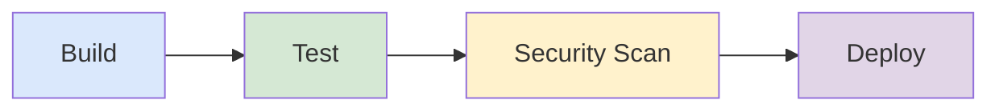

---
tags:
  - programming
  - fundamental
  - devops
  - ci-cd
---

# CI/CD Pipelines

CI/CD is the backbone of modern software delivery. It automates building, testing, and deploying code so teams ship faster with fewer bugs. Mastering pipelines separates professional engineering from hobby coding.

---

## What is CI/CD?

| Concept | Definition | Trigger |
|---|---|---|
| **Continuous Integration (CI)** | Automatically build and test every push to shared repository | Every commit/PR |
| **Continuous Delivery (CD)** | CI + automated release to staging; production deploy requires manual approval | Merge to main |
| **Continuous Deployment (CD)** | CI + fully automated deploy to production with no human gate | Merge to main |

```
CI only:          Code → Build → Test ✅
Continuous Delivery: Code → Build → Test → Deploy to Staging → [Manual] → Production
Continuous Deploy:   Code → Build → Test → Deploy to Staging → Deploy to Production
```

---

## Pipeline Stages





| Stage | Purpose | Tools |
|---|---|---|
| **Build** | Compile code, resolve dependencies | Maven, Gradle, npm |
| **Test** | Unit, integration, contract tests | JUnit, Jest, Testcontainers |
| **Security Scan** | SAST, dependency CVE scan, container scan | Trivy, Snyk, OWASP |
| **Deploy** | Push artifact to environment | Helm, kubectl, AWS ECS |

---

## GitHub Actions

### Java/Maven + Node.js with Caching & Matrix

```yaml
name: CI Pipeline

on:
  push:
    branches: [main, develop]
  pull_request:
    branches: [main]

jobs:
  build-java:
    runs-on: ubuntu-latest
    strategy:
      matrix:
        java-version: [17, 21]
    steps:
      - uses: actions/checkout@v4

      - name: Set up JDK ${{ matrix.java-version }}
        uses: actions/setup-java@v4
        with:
          java-version: ${{ matrix.java-version }}
          distribution: temurin
          cache: maven

      - name: Build with Maven
        run: mvn clean verify -B

      - name: Upload test reports
        if: always()
        uses: actions/upload-artifact@v4
        with:
          name: test-reports-java${{ matrix.java-version }}
          path: target/surefire-reports/

  build-frontend:
    runs-on: ubuntu-latest
    defaults:
      run:
        working-directory: ./frontend
    steps:
      - uses: actions/checkout@v4

      - uses: actions/setup-node@v4
        with:
          node-version: 20
          cache: npm
          cache-dependency-path: frontend/package-lock.json

      - run: npm ci
      - run: npm run lint
      - run: npm test -- --coverage
      - run: npm run build

  security-scan:
    runs-on: ubuntu-latest
    needs: build-java
    steps:
      - uses: actions/checkout@v4
      - name: Run Trivy vulnerability scanner
        uses: aquasecurity/trivy-action@master
        with:
          scan-type: fs
          severity: CRITICAL,HIGH

  deploy:
    runs-on: ubuntu-latest
    needs: [build-java, build-frontend, security-scan]
    if: github.ref == 'refs/heads/main'
    environment: production
    steps:
      - uses: actions/checkout@v4
      - name: Deploy
        run: echo "Deploying to production..."
        env:
          DEPLOY_TOKEN: ${{ secrets.DEPLOY_TOKEN }}
```

---

## GitLab CI

```yaml
image: maven:3.9-eclipse-temurin-21

stages:
  - build
  - test
  - scan
  - deploy

cache:
  paths:
    - .m2/repository/

build:
  stage: build
  script:
    - mvn clean compile -B

test:
  stage: test
  script:
    - mvn verify -B
  artifacts:
    reports:
      junit: target/surefire-reports/*.xml

security-scan:
  stage: scan
  image: aquasec/trivy:latest
  script:
    - trivy fs --severity HIGH,CRITICAL .

deploy-staging:
  stage: deploy
  script:
    - ./deploy.sh staging
  environment:
    name: staging
  only:
    - develop

deploy-production:
  stage: deploy
  script:
    - ./deploy.sh production
  environment:
    name: production
  when: manual
  only:
    - main
```

---

## Jenkins (Declarative Pipeline)

```groovy
pipeline {
    agent any

    tools {
        maven 'Maven-3.9'
        jdk 'JDK-21'
    }

    environment {
        DOCKER_REGISTRY = 'registry.example.com'
        APP_NAME = 'my-app'
    }

    stages {
        stage('Build') {
            steps {
                sh 'mvn clean compile -B'
            }
        }

        stage('Test') {
            parallel {
                stage('Unit Tests') {
                    steps {
                        sh 'mvn test -B'
                    }
                    post {
                        always {
                            junit 'target/surefire-reports/*.xml'
                        }
                    }
                }
                stage('Integration Tests') {
                    steps {
                        sh 'mvn verify -Pintegration -B'
                    }
                }
            }
        }

        stage('Security Scan') {
            steps {
                sh 'trivy fs --severity HIGH,CRITICAL .'
            }
        }

        stage('Deploy to Staging') {
            when { branch 'main' }
            steps {
                sh './deploy.sh staging'
            }
        }

        stage('Deploy to Production') {
            when { branch 'main' }
            input {
                message 'Deploy to production?'
                ok 'Yes, deploy!'
            }
            steps {
                sh './deploy.sh production'
            }
        }
    }

    post {
        failure {
            slackSend channel: '#deployments', message: "Build FAILED: ${env.JOB_NAME}"
        }
    }
}
```

---

## Pipeline Design Patterns

### Parallel Stages

❌ **Running everything sequentially:**
```yaml
# Slow — tests wait for lint, lint waits for build
jobs:
  build:
    ...
  test:
    needs: build
  lint:
    needs: test  # ❌ unnecessary dependency
```

✅ **Run independent tasks in parallel:**
```yaml
jobs:
  build:
    ...
  test:
    needs: build
  lint:
    needs: build  # ✅ test and lint run at the same time
```

### Matrix Builds

```yaml
strategy:
  matrix:
    java: [17, 21]
    os: [ubuntu-latest, windows-latest]
  fail-fast: false  # don't cancel other jobs on first failure
```

This produces 4 jobs: Java 17 × Ubuntu, Java 17 × Windows, Java 21 × Ubuntu, Java 21 × Windows.

### Caching Dependencies

❌ **No caching — download everything every time:**
```yaml
steps:
  - run: mvn clean verify  # ❌ downloads all deps from scratch
```

✅ **Cache Maven/npm:**
```yaml
steps:
  - uses: actions/setup-java@v4
    with:
      cache: maven  # ✅ caches ~/.m2/repository
  - uses: actions/setup-node@v4
    with:
      cache: npm  # ✅ caches node_modules
```

### Artifact Management

```yaml
# Upload
- uses: actions/upload-artifact@v4
  with:
    name: app-jar
    path: target/*.jar
    retention-days: 7

# Download in later job
- uses: actions/download-artifact@v4
  with:
    name: app-jar
    path: artifacts/
```

---

## Environment Promotion

```
feature branch → dev → staging → production
     (CI)        (auto)  (auto)   (manual gate)
```

| Environment | Purpose | Deploy Trigger | Approval |
|---|---|---|---|
| **dev** | Developer testing | PR merge to develop | None |
| **staging** | QA / UAT | Merge to main | None |
| **production** | Live users | Merge to main | Manual approval |

---

## Secrets Management

| Platform | Mechanism | Access |
|---|---|---|
| **GitHub** | Repository/Environment Secrets | `${{ secrets.MY_SECRET }}` |
| **GitLab** | CI/CD Variables (masked, protected) | `$MY_SECRET` |
| **Jenkins** | Credentials plugin | `credentials('my-id')` |
| **HashiCorp Vault** | Dynamic secrets, short-lived tokens | Vault agent / JWT auth |

❌ **Never hardcode secrets:**
```yaml
# ❌ NEVER do this
env:
  DB_PASSWORD: "supersecret123"
```

✅ **Use platform secret management:**
```yaml
# ✅ Always use secrets
env:
  DB_PASSWORD: ${{ secrets.DB_PASSWORD }}
```

---

## Common Pitfalls

| Pitfall | Why It Hurts | Fix |
|---|---|---|
| ❌ Sequential stages | Slow feedback (30+ min builds) | ✅ Parallelize independent stages |
| ❌ No caching | Wastes bandwidth and time | ✅ Cache Maven/npm/Docker layers |
| ❌ Hardcoded secrets | Security breach, leaked in logs | ✅ Use platform secrets/Vault |
| ❌ No rollback strategy | Stuck with broken deploys | ✅ Blue-green or canary with rollback |
| ❌ Flaky tests ignored | Erodes trust in pipeline | ✅ Quarantine and fix flaky tests |
| ❌ Huge monolith build | All-or-nothing failures | ✅ Split into independent modules |

---

## Related Notes

- [[04 API CI-CD]]
- [[03 CI-CD & Headless Testing]]
- [[07 Deployment Strategies]]

---

## Sources

- [GitHub Actions Documentation](https://docs.github.com/en/actions)
- [GitLab CI/CD Documentation](https://docs.gitlab.com/ee/ci/)
- [Jenkins Pipeline Documentation](https://www.jenkins.io/doc/book/pipeline/)
- [The Twelve-Factor App — CI/CD](https://12factor.net/)
