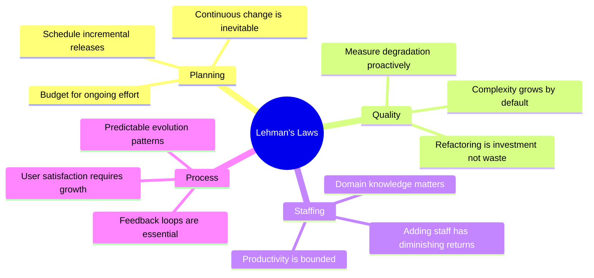
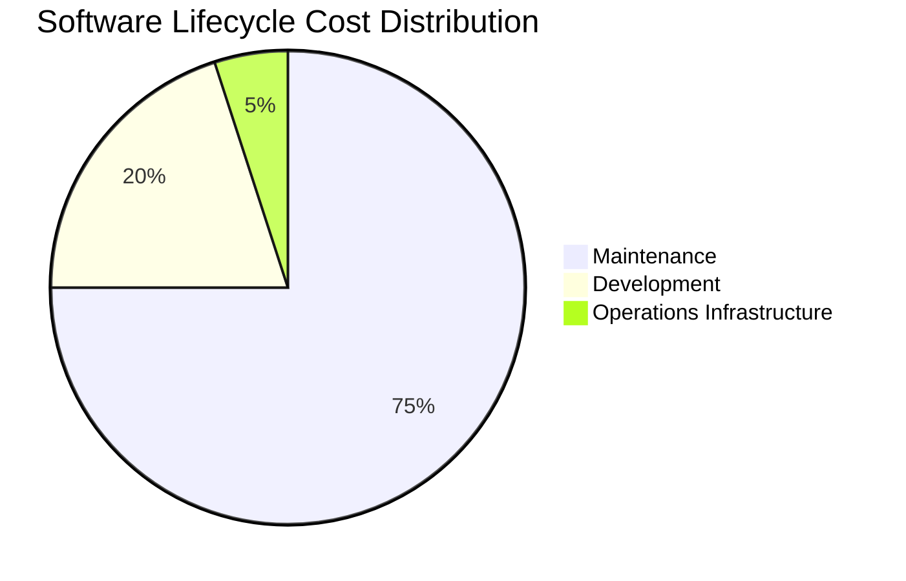
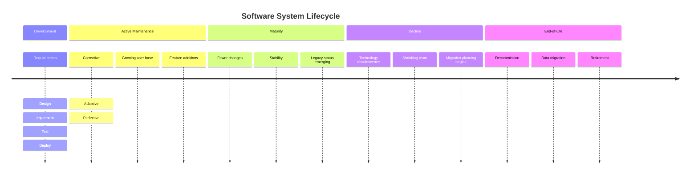

---
tags:
  - software-engineering
  - swebok
  - ka07
  - maintenance-fundamentals
  - lehmans-laws
source: "SWEBOK v4 Chapter 07"
created: 2026-07-21
---

# 07 - Maintenance Fundamentals

> **KA 7.1** Software maintenance is the totality of activities required to provide cost-effective support to software. Activities are performed during the software lifecycle to modify existing software products, correct faults, improve performance, or adapt to a changed environment.

This note covers the foundational concepts of software maintenance: its definition and nature, Lehman's Laws of Software Evolution, standardized maintenance categories, cost dynamics, and how maintenance differs from development.

Related notes on hands-on techniques: [[01_Changing_Software]], [[02_Sensing_and_Seams]], [[03_Adding_Features]], [[04_Getting_Tests_in_Place]], [[05_Large_Scale_Changes]], [[06_Dependency_Breaking_Catalog]].

See also: [[Software Maintenance Overview]] for a high-level map of this KA.

---

## 1. Definition and Nature of Maintenance

**Software maintenance** is the process of modifying a software system or component after delivery to correct faults, improve performance or other attributes, or adapt the product to a changed environment (ISO/IEC/IEEE 14764).

### 1.1 Why Software Must Be Maintained

Software systems are not static artifacts. They exist within evolving ecosystems:

- **Environment changes**: operating systems, libraries, hardware platforms, regulations, and business rules shift constantly.
- **Residual defects**: no non-trivial software ships without latent faults; testing can only show the presence of bugs, never their absence.
- **Evolving user needs**: as users become familiar with a system they discover new requirements, leading to feature requests and workflow refinements.
- **Performance tuning**: real-world usage patterns differ from development benchmarks; production systems require optimization.
- **Technology lifecycle**: dependencies reach end-of-life, APIs are deprecated, and security protocols are updated.

### 1.2 Maintenance Is Not "Just Bug Fixing"

A common misconception treats maintenance as a low-skill activity limited to patching defects. In reality:

| Dimension | Misconception | Reality |
|-----------|--------------|---------|
| Scope | Fix bugs only | Corrective + adaptive + perfective + preventive + additive + emergency |
| Skill | Junior developer work | Requires deep system understanding, often more than initial development |
| Cost | Small fraction of budget | 60-80%+ of total lifecycle cost |
| Duration | Short bursts | Continues for the entire operational life (often 10-20+ years) |
| Risk | Low risk | High: changes to complex, poorly documented legacy code |

### 1.3 Relationship to Development

```mermaid
flowchart LR
    subgraph Development
        A[Requirements] --> B[Design]
        B --> C[Implementation]
        C --> D[Testing]
        D --> E[Delivery]
    end
    subgraph Maintenance
        E --> F[Operation]
        F --> G[Problem/Change Detection]
        G --> H[Analysis]
        H --> I[Modification]
        I --> J[Regression Testing]
        J --> F
    end
    style Maintenance fill:#1a1a2e,stroke:#e94560
```



Maintenance begins the moment software is delivered. The transition is gradual: the last few defects found in early operation are typically development oversights, but most maintenance activity addresses genuine evolution needs.

---

## 2. Lehman's Laws of Software Evolution

Manny Lehman and colleagues formulated empirical laws describing how large E-type (embedded in the real world) software systems evolve. These laws are among the most cited empirical results in software engineering and provide a theoretical foundation for maintenance planning.

### 2.1 The Eight Laws

| # | Law Name | Statement | Implication for Maintenance |
|---|----------|-----------|----------------------------|
| 1 | **Continuing Change** | A program that is used in a real-world environment must change, or become progressively less useful in that environment. | Maintenance is inevitable; planning for change is not optional. |
| 2 | **Increasing Complexity** | As a program evolves, its complexity increases unless work is done to reduce it. | Without deliberate restructuring, entropy accumulates and future changes become costlier. |
| 3 | **Self-Regulation** | Program evolution is self-regulating, with close to normal distribution of measures of product attributes. | Release planning, staffing, and defect rates follow statistically predictable patterns. |
| 4 | **Conservation of Organizational Stability** | The average effective global activity rate on a system is invariant over its lifetime. | You cannot arbitrarily accelerate maintenance by adding more people (Brooks's Law corollary). |
| 5 | **Conservation of Familiarity** | During the active life of a program, the incremental change in successive releases is approximately constant. | Large releases risk user rejection; incremental delivery is preferred. |
| 6 | **Continuing Growth** | Functional content of a system must be continually increased to maintain user satisfaction. | Systems must grow in features to remain competitive; pure maintenance without growth leads to decline. |
| 7 | **Declining Quality** | The quality of a system will appear to be declining unless it is rigorously maintained and adapted. | Quality assurance must be continuous, not a one-time gate. |
| 8 | **Feedback System** | Program evolution is a multi-level, multi-loop, multi-agent feedback system. | Feedback from users, operations, and metrics must drive maintenance decisions. |

### 2.2 Practical Implications



### 2.3 Validation and Modern Context

Lehman's laws have been validated across numerous large-scale projects (IBM OS/360, Lucent, Linux kernel). Modern DevOps practices (continuous integration, continuous delivery, infrastructure as code) can be understood as engineering responses to these laws:

- **CI/CD pipelines** operationalize Laws 1 and 5 (continuous incremental change).
- **Automated refactoring and code quality gates** address Law 2 (complexity growth).
- **Sprint retrospectives and observability** implement Law 8 (feedback systems).
- **Feature flags and trunk-based development** enable Law 6 (continuing growth) without destabilizing releases.

---

## 3. Standardized Maintenance Categories

ISO/IEC/IEEE 14764 defines four primary categories; two additional categories are commonly recognized in the literature.

### 3.1 The Six Categories

| Category | Definition | Example | Typical Share |
|----------|-----------|---------|---------------|
| **Corrective** | Diagnosing and fixing faults (bugs). | Null pointer exception patched after customer report. | 20-25% |
| **Adaptive** | Modifying software to work in a changed environment. | Migrating from Java 8 to Java 21; updating API calls after OS upgrade. | 15-25% |
| **Perfective** | Improving performance, maintainability, or other quality attributes. | Optimizing database queries; improving UI response time. | 30-40% |
| **Preventive** | Making changes to reduce the probability of future faults. | Refactoring spaghetti code; adding input validation; updating dependencies before EOL. | 5-15% |
| **Additive** | Adding new functionality that extends the system's capabilities. | New report type; new payment gateway integration. | 10-20% |
| **Emergency** | Unscheduled corrective maintenance to restore service. | Hotfix for production outage on Black Friday. | < 5% |

### 3.2 Category Relationships

```mermaid
graph TD
    M[Maintenance Activity] --> C[Corrective]
    M --> A[Adaptive]
    M --> P[Perfective]
    M --> PR[Preventive]
    M --> AD[Additive]
    M --> E[Emergency]

    C -->|bug found| F[Fault Report]
    E -->|urgent bug| F
    A -->|environment changed| CR[Change Request]
    P -->|improvement goal| CR
    AD -->|new requirement| NR[New Requirement]
    PR -->|proactive| IP[Improvement Plan]

    F --> TR[Triage]
    CR --> TR
    NR --> TR
    IP --> TR

    TR --> P1[High Priority]
    TR --> P2[Medium Priority]
    TR --> P3[Low Priority / Backlog]

    style M fill:#16213e,stroke:#0f3460
    style E fill:#e94560,stroke:#c81d4e
```



### 3.3 Maintenance vs. Development: Key Differences

| Aspect | Development | Maintenance |
|--------|------------|-------------|
| **Starting point** | Blank slate or prototype | Existing codebase (often years old) |
| **Requirements** | Specified in documents | Often implicit, discovered through code analysis |
| **Code understanding** | You wrote it recently | You must reverse-engineer understanding |
| **Test infrastructure** | Built alongside code | May be missing; must be retrofitted (see [[04_Getting_Tests_in_Place]]) |
| **Documentation** | Created as-you-go | Often outdated or missing |
| **Change coupling** | Changes affect known modules | Changes ripple through poorly understood dependencies |
| **Risk** | Controlled by design | Bounded by regression safety net |
| **Team** | Project team with shared context | Rotating staff with varying domain knowledge |
| **Schedule** | Planned milestones | Ongoing + reactive (break/fix) |
| **Budget** | Capital expenditure | Operational expenditure (ongoing) |

---

## 4. Maintenance Cost Drivers

### 4.1 The 80/20 Reality

Industry data consistently shows that **60-80% of total software lifecycle cost** is consumed by maintenance. Some estimates for long-lived systems (military, banking, telecommunications) place this figure above 90%.



### 4.2 Factors That Drive Maintenance Cost

#### Technical Factors

| Factor | High Cost When... | Low Cost When... |
|--------|------------------|-----------------|
| Code quality | Spaghetti code, no patterns | Clean architecture, SOLID principles |
| Documentation | Missing or outdated | Accurate, living documentation |
| Test coverage | None or low (see [[04_Getting_Tests_in_Place]]) | High automated coverage |
| Module coupling | Tight coupling, god classes (see [[06_Dependency_Breaking_Catalog]]) | Loose coupling, clear interfaces |
| Technology age | Obsolete language/platform | Current, well-supported stack |
| Architecture | Monolithic, layered violations | Modular, service-oriented |
| Data model | Denormalized, undocumented schema | Clean schema with migrations |

#### Organizational Factors

| Factor | High Cost When... | Low Cost When... |
|--------|------------------|-----------------|
| Staff turnover | High churn, knowledge loss | Stable team, knowledge transfer |
| Original team | Disbanded, no handover | Available for consultation |
| Domain complexity | Highly specialized (finance, aerospace) | Well-understood business domain |
| Process maturity | Ad hoc, no change control | Defined maintenance process |
| Tool support | Manual builds, no CI/CD | Automated pipelines |
| Regulatory burden | Heavy compliance requirements | Minimal regulatory impact |

### 4.3 The Cost of Delay

Maintenance debt compounds. A defect that costs $1 to fix during design may cost:

| Phase Detected | Relative Cost |
|---------------|---------------|
| Requirements/Design | 1x |
| Implementation | 5x |
| Testing | 15x |
| Production (after release) | 30-100x |

This exponential cost curve is why **preventive maintenance** (refactoring, dependency updates, security patching) is so much cheaper than **reactive emergency maintenance**.

### 4.4 Estimation Models

Common models for estimating maintenance effort:

- **COCOMO II Maintenance Model**: Estimates annual change traffic based on the Annual Change Traffic (ACT) parameter, typically 5-20% of code base modified per year.
- **Function Point Analysis**: Uses enhancement function points to estimate effort for adaptive and perfective changes.
- **Story Point Estimation**: Agile teams estimate maintenance work alongside feature work in sprint planning.

```
Maintenance Effort = f(ACT, Understanding Complexity, 
                       Assessment Difficulty, 
                       Modification Difficulty,
                       Test Rigor, 
                       System Size)
```

---

## 5. The Maintenance Lifecycle

### 5.1 From Delivery to End-of-Life



### 5.2 The Maintenance Feedback Loop

All maintenance activities share a common feedback cycle:

1. **Trigger**: Defect report, change request, environmental event, or proactive observation.
2. **Triage**: Classify the request (corrective/adaptive/perfective/preventive/adaptive/emergency). Assign priority.
3. **Analysis**: Understand the impact. What code is affected? What tests exist? What documentation exists?
4. **Plan**: Design the change. Estimate effort. Schedule.
5. **Implement**: Make the change. Write or update tests.
6. **Validate**: Run regression tests. Verify the fix. Get review/approval.
7. **Deploy**: Release to production.
8. **Monitor**: Confirm the change works in production. Collect feedback.
9. **Learn**: Update documentation, share knowledge, feed back into process improvement.

This cycle maps directly to the ISO/IEC/IEEE 14764 process areas described in [[08_Maintenance_Processes_and_Staffing]].

---

## 6. Maintenance in Modern Practices

### 6.1 DevOps and Continuous Everything

Modern DevOps practices have transformed maintenance:

| Traditional Maintenance | DevOps Maintenance |
|------------------------|-------------------|
| Scheduled release windows | Continuous deployment |
| Manual regression testing | Automated test suites |
| Change Advisory Board for every change | Risk-based change approval |
| Production monitoring is reactive | Observability-driven proactive detection |
| Operations and development are separate teams | Shared ownership (you build it, you run it) |

### 6.2 SRE and Maintenance Budgets

Site Reliability Engineering (SRE) formalizes maintenance budgets through **error budgets**:

- Define an SLO (e.g., 99.9% availability).
- Calculate the error budget (e.g., 0.1% = ~43 minutes/month downtime).
- Spend the budget on both feature velocity AND maintenance work.
- When the budget is exhausted, all effort shifts to reliability/maintenance.

### 6.3 Technical Debt as Maintenance Backlog

Technical debt is a useful metaphor for accumulated maintenance needs:

- **Deliberate debt**: "We know this needs refactoring; we'll do it next sprint."
- **Accidental debt**: "We didn't realize the architecture wouldn't scale."
- **Bit rot**: "The code was fine when written, but the world moved on."

Effective organizations treat their technical debt backlog as a first-class product backlog item, not as something to be addressed "when we have time."

---

## 7. Summary

| Concept | Key Takeaway |
|---------|-------------|
| Definition | Maintenance = modifying delivered software to correct, adapt, improve, or prevent |
| Lehman's Laws | 8 empirical laws governing how software evolves; validated over decades |
| Categories | Corrective, Adaptive, Perfective, Preventive, Additive, Emergency |
| Cost | 60-80%+ of lifecycle cost; exponential cost of late detection |
| vs. Development | Fundamentally different: starts with existing code, missing docs, and technical debt |
| Modern context | DevOps, CI/CD, SRE, and technical debt management are evolution of maintenance practice |

---

## 8. References

- ISO/IEC/IEEE 14764:2022. *Software Life Cycle Processes: Maintenance*.
- Lehman, M.M. (1980). "Programs, Life Cycles, and Laws of Software Evolution." *Proceedings of the IEEE*, 68(9), 1060-1076.
- Lehman, M.M. & Belady, L.A. (1985). *Program Evolution: Processes of Software Change*. Academic Press.
- SWEBOK v4, Chapter 7: Software Maintenance.
- Bennett, K.H. & Rajlich, V.T. (2000). "Software Maintenance and Evolution: A Roadmap." *ICSE 2000*.
- Pigoski, T.M. (1997). *Practical Software Maintenance*. Wiley.
- Pressman, R.S. & Maxim, B.R. *Software Engineering: A Practitioner's Approach*, Ch. 29.
