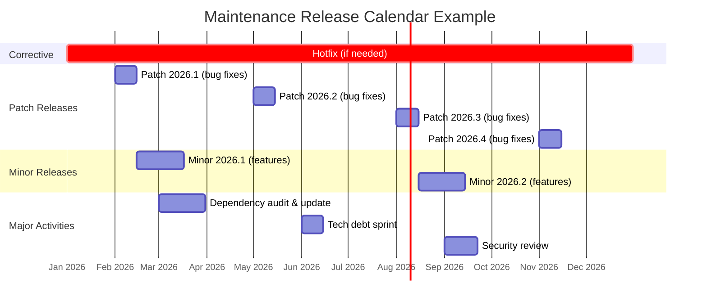
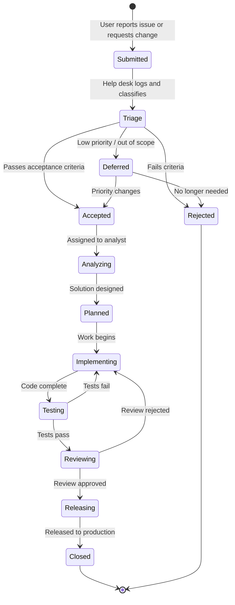
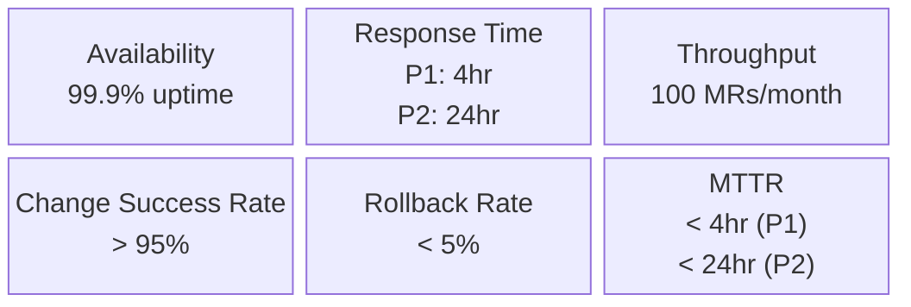

---
tags:
  - software-engineering
  - swebok
  - ka07
  - maintenance-processes
  - staffing
  - iso14764
source: "SWEBOK v4 Chapter 07"
created: 2026-07-21
---

# 08 - Maintenance Processes and Staffing

> **KA 7.2-7.3** This note covers the standardized maintenance process defined by ISO/IEC/IEEE 14764, maintenance planning at multiple levels, change request management, help-desk operations, SLA/SLO management, staffing and organizational models, and outsourcing/offshoring strategies.

Prerequisites: [[07_Maintenance_Fundamentals]] (categories, Lehman's Laws, cost drivers).

---

## 1. ISO/IEC/IEEE 14764 Maintenance Process Areas

The ISO/IEC/IEEE 14764 standard defines a comprehensive process for software maintenance aligned with ISO/IEC/IEEE 12207. It describes seven primary process areas.

### 1.1 Process Overview

```mermaid
flowchart TD
    subgraph Core Process Areas
        P[Process Implementation] --> PA[Problem and Modification Analysis]
        PA --> M[Modification Implementation]
        M --> R[Review and Acceptance]
        R --> D[Migration]
        D --> RET[Retirement]
    end
    
    subgraph Support
        HELP[Help Desk / MR Acceptance] --> PA
        CONF[Configuration Management] --> M
        QA[Quality Assurance] --> R
    end
    
    subgraph Triggers
        MR[Modification Request] --> PA
        PR[Problem Report] --> PA
        ENV[Environmental Change] --> D
    end
    
    style P fill:#16213e,stroke:#0f3460
    style PA fill:#1a1a2e,stroke:#e94560
    style M fill:#0f3460,stroke:#533483
```

### 1.2 Detailed Process Areas

| Process Area | Purpose | Key Activities | Inputs | Outputs |
|-------------|---------|---------------|--------|---------|
| **Prepare for Maintenance** | Establish and maintain the maintenance organization and infrastructure. | Define policies, acquire tools, train staff, establish CM baseline. | Stakeholder requirements, organizational context. | Maintenance plan, procedures, trained staff. |
| **Problem and Modification Analysis** | Analyze problem reports and modification requests to determine scope and approach. | Reproduce the problem, analyze root cause, assess impact, estimate effort, propose solutions. | Problem reports, modification requests, system documentation. | Analysis reports, proposed changes, effort estimates. |
| **Modification Implementation** | Design, code, and test changes. | Design the change, implement code, write/update unit tests, perform integration testing. | Approved change proposals, design documents, code. | Modified software, updated tests, release notes. |
| **Review and Acceptance** | Verify that modifications meet requirements and do not introduce regressions. | Code review, regression testing, acceptance testing, release management. | Modified software, test results, acceptance criteria. | Accepted release, test reports. |
| **Migration** | Transfer software from one operational environment to another. | Data migration, platform migration, interface adaptation, coexistence planning. | Migration requirements, target environment specs. | Migrated system, migration reports. |
| **Retirement** | Withdraw a system from active service. | Data archival, user notification, system decommissioning, documentation. | Retirement decision, archival requirements. | Retired system, archived data, lessons learned. |
| **Help Desk / Support** | Provide front-line user support and triage incoming requests. | Issue logging, initial diagnosis, escalation, knowledge base management. | User issues, system monitoring alerts. | Problem reports, modification requests. |

### 1.3 Process Flow Detail

```mermaid
flowchart LR
    U[User / Customer] -->|Reports Issue| HD[Help Desk]
    HD -->|Logs| MR[/Problem Report / Modification Request/]
    MR -->|Triage| AA{Accept or Reject?}
    AA -->|Reject| NR[Notify Requester + Reason]
    AA -->|Accept| AN[Problem/Modification Analysis]
    AN -->|Root Cause + Scope| PA[Plan Change]
    PA -->|Design| IM[Implement Modification]
    IM -->|Code + Tests| RA[Review / Acceptance]
    RA -->|Pass| RL[Release / Deploy]
    RA -->|Fail| IM
    RL -->|Close| CL[Close MR]
    CL -->|Feedback| U
    
    style MR fill:#e94560,stroke:#c81d4e
    style RA fill:#0f3460,stroke:#533483
```

---

## 2. Maintenance Planning

Maintenance planning operates at four levels, from strategic to tactical.

### 2.1 Four Levels of Planning

| Level | Scope | Timeframe | Owner | Key Outputs |
|-------|-------|-----------|-------|-------------|
| **Strategic** | Organizational maintenance strategy | 1-3 years | VP Engineering / CTO | Maintenance budget, tooling strategy, outsourcing decisions, technology roadmap |
| **Tactical** | Product maintenance plans | Quarterly | Product Manager / Maintenance Manager | Release calendar, staffing plan, training plan, SLA definitions |
| **Operational** | Sprint/iteration maintenance work | 1-4 weeks | Team Lead / Scrum Master | Sprint backlog, on-call rotation, MR/PR queue management |
| **Immediate** | Emergency and hotfix handling | Hours to days | On-call Engineer | Hotfix procedure, escalation path, rollback plan |

### 2.2 The Maintenance Plan

A formal maintenance plan (per ISO 14764) should address:

1. **Scope**: Which systems, subsystems, and interfaces are maintained.
2. **Organization**: Team structure, roles, responsibilities, reporting lines.
3. **Process**: Which processes from ISO 14764 are adopted and how.
4. **Resources**: Staffing levels, tools, infrastructure, budget.
5. **Schedule**: Release cadence, maintenance windows, blackout periods.
6. **Metrics**: What is measured, how, and against what targets.
7. **Quality**: Standards, reviews, testing requirements, acceptance criteria.
8. **Risk**: Known risks and mitigation strategies.
9. **Communication**: Stakeholder reporting, escalation procedures.

### 2.3 Release Planning

---

## 3. Modification Request (MR) and Problem Report (PR) Management

### 3.1 The MR/PR Lifecycle

### 3.2 Acceptance and Rejection Criteria

Not every reported issue should be accepted for resolution. Clear criteria prevent maintenance backlog explosion.

#### Acceptance Criteria

| Criterion | Question |
|-----------|----------|
| **Reproducibility** | Can the problem be reproduced? Is there a clear test case? |
| **Validity** | Is this a genuine fault or valid requirement? |
| **Impact** | Does it affect users, revenue, compliance, or safety? |
| **Scope** | Is it within the system's maintenance scope? |
| **Feasibility** | Can it be fixed with reasonable effort and risk? |
| **Duplicate** | Is this already tracked as an existing MR/PR? |

#### Rejection Criteria

| Criterion | Rationale |
|-----------|-----------|
| **Not reproducible** | Cannot diagnose or verify fix without a test case |
| **By design** | The observed behavior is intentional |
| **Out of scope** | Relates to a third-party component, not the maintained system |
| **Superseded** | Covered by an existing, higher-priority MR/PR |
| **Cannot fix** | Technically infeasible or unacceptably high risk |
| **Insufficient information** | Requester does not provide needed details after follow-up |

### 3.3 Prioritization Framework

| Priority | Definition | SLA Target | Example |
|----------|-----------|------------|---------|
| **P1 - Critical** | System down, data loss, security breach | Fix within 4 hours | Production database corruption |
| **P2 - High** | Major feature broken, workaround exists | Fix within 24 hours | Payment processing intermittent failure |
| **P3 - Medium** | Feature impaired, workaround acceptable | Fix within 1 week | Report formatting incorrect |
| **P4 - Low** | Cosmetic issue, enhancement | Next planned release | UI alignment, spelling error |

---

## 4. Help-Desk Operations

### 4.1 Help-Desk Structure

```mermaid
flowchart TD
    subgraph Tier 1 - First Line Support
        T1[Help Desk Agent]
        KB[Knowledge Base]
        FAQ[FAQ / Self-Service]
    end
    
    subgraph Tier 2 - Technical Support
        T2[Technical Support Engineer]
        LOG[Log Analysis]
        REPRO[Reproduction]
    end
    
    subgraph Tier 3 - Maintenance Engineering
        T3[Maintenance Engineer]
        ROOT[Root Cause Analysis]
        FIX[Code Fix]
    end
    
    subgraph Tier 4 - Vendor / External
        T4[Third-Party Vendor]
        PATCH[Vendor Patch]
    end
    
    U[User] -->|Initial Contact| T1
    T1 -->|Look up| KB
    T1 -->|Self-service| FAQ
    T1 -->|Escalate| T2
    T2 -->|Analyze logs| LOG
    T2 -->|Reproduce| REPRO
    T2 -->|Escalate| T3
    T3 -->|Deep analysis| ROOT
    T3 -->|Fix code| FIX
    T3 -->|Escalate| T4
    T4 -->|Vendor fix| PATCH
    
    style T1 fill:#16213e,stroke:#0f3460
    style T2 fill:#1a1a2e,stroke:#e94560
    style T3 fill:#0f3460,stroke:#533483
    style T4 fill:#533483,stroke:#e94560
```

### 4.2 Help-Desk Metrics

| Metric | Description | Target (example) |
|--------|-------------|-----------------|
| **First Contact Resolution (FCR)** | % resolved without escalation | 60-70% |
| **Mean Time to Acknowledge (MTTA)** | Time from report to first response | < 15 min (P1), < 1 hr (P2) |
| **Mean Time to Resolve (MTTR)** | Time from report to resolution | < 4 hr (P1), < 24 hr (P2) |
| **Customer Satisfaction (CSAT)** | Post-resolution survey score | > 4.0/5.0 |
| **Escalation Rate** | % escalated to Tier 2+ | < 30% |
| **Reopen Rate** | % of resolved issues reopened | < 5% |

### 4.3 Knowledge Management

A well-maintained knowledge base is the backbone of efficient help-desk operations:

- **Known error database (KEDB)**: Documented workarounds for known faults.
- **Resolution articles**: Step-by-step guides for common issues.
- **FAQ**: Proactive answers to frequently asked questions.
- **Runbooks**: Automated and manual procedures for operational tasks.

---

## 5. Service Level Management

### 5.1 SLA vs. SLO vs. SLI

| Term | Definition | Example |
|------|-----------|---------|
| **SLI** (Service Level Indicator) | A quantitative measure of a service aspect. | Request latency: p99 = 250ms |
| **SLO** (Service Level Objective) | Target value for an SLI. | p99 latency < 500ms |
| **SLA** (Service Level Agreement) | Contractual agreement including consequences of missing SLOs. | If availability < 99.9%, 10% service credit |

### 5.2 SLA Components for Maintenance

### 5.3 Error Budgets

Modern SRE practices use error budgets to balance reliability and velocity:

- **Budget = 1 - SLO target** (e.g., 1 - 99.9% = 0.1% = ~43 min/month downtime).
- **When budget remains**: Invest in feature velocity and perfective maintenance.
- **When budget is exhausted**: Shift all effort to reliability and corrective maintenance.
- **Policy**: Published and enforced by the team; prevents both over-reliability and under-reliability.

---

## 6. Staffing and Organizational Models

### 6.1 Organizational Options

| Model | Description | Pros | Cons |
|-------|-------------|------|------|
| **Single Team** | Same team does development and maintenance. | Full context, no handover, balanced career. | Context switching, may neglect maintenance for features. |
| **Separate Maintenance Team** | Dedicated maintenance team, separate from development. | Specialization, uninterrupted focus, maintenance expertise. | Knowledge silos, career stigma, handover cost. |
| **Rotating Role** | Developers rotate through maintenance duty. | Shared knowledge, empathy for maintenance, balanced workload. | Ramp-up time, inconsistency, resistance. |
| **Follow-the-Sun** | Distributed teams across time zones hand off work. | 24/7 coverage, no night shifts. | Communication overhead, knowledge fragmentation. |
| **Outsourced** | External team handles maintenance. | Cost reduction, access to talent. | Knowledge loss, vendor lock-in, quality risk. |

### 6.2 Staffing Considerations

#### Knowledge Retention

Knowledge loss is the single greatest risk to maintenance effectiveness:

- **Domain knowledge**: Understanding of business rules, regulations, and user workflows.
- **System knowledge**: Understanding of architecture, design decisions, and code structure.
- **Operational knowledge**: Understanding of deployment, monitoring, and incident response.

**Mitigation strategies:**

| Strategy | Effectiveness | Cost |
|----------|--------------|------|
| Pair maintenance with documentation | High | Medium |
| Maintain architectural decision records (ADRs) | High | Low |
| Rotate developers through maintenance | Medium | Medium |
| Record knowledge-sharing sessions | Medium | Low |
| Hire back retired developers as consultants | High (short-term) | High |
| Use code-level documentation (not just prose) | Medium | Low |

#### Career Satisfaction

Maintenance work is often perceived negatively. Addressing this requires:

- **Title and role parity**: "Software Engineer" not "Maintenance Developer".
- **Rotation**: Developers do both maintenance and feature work.
- **Impact visibility**: Highlight when maintenance prevents outages or enables features.
- **Tool investment**: Good tools make maintenance less painful.
- **Technical growth**: Refactoring, modernization, and architecture work count as development.
- **On-call compensation**: Fair pay for on-call and emergency response.

### 6.3 Skills Required

| Skill | Why | How to Develop |
|-------|-----|----------------|
| Reading unfamiliar code | Maintenance starts with understanding | Practice with open-source codebases; see [[02_Sensing_and_Seams]] |
| Debugging | Isolating faults in complex systems | Systematic debugging practice; see [[04_Getting_Tests_in_Place]] |
| Refactoring | Improving code without changing behavior | Study [[06_Dependency_Breaking_Catalog]]; practice with legacy code |
| Impact analysis | Understanding change ripple effects | Code dependency analysis; see [[05_Large_Scale_Changes]] |
| Regression testing | Ensuring changes don't break existing functionality | Test automation; see [[04_Getting_Tests_in_Place]] |
| Documentation | Writing and maintaining accurate docs | Living documentation practices |
| Communication | Explaining technical issues to non-technical stakeholders | Practice clear, concise written communication |
| Patience and persistence | Working through poorly documented, complex systems | Build system understanding incrementally |

---

## 7. Outsourcing and Offshoring Maintenance

### 7.1 Sourcing Models

```mermaid
graph TD
    S[Sourcing Decision] --> SS[Single Source]
    S --> MS[Multi-Source]
    
    SS --> ONE[One vendor handles all maintenance]
    MS --> SPEC[Specialization: vendor per system/module]
    MS --> GEO[Geographic: nearshore + offshore]
    MS --> HYB[Hybrid: internal + external]
    
    style S fill:#16213e,stroke:#0f3460
```

| Model | Description | Best For | Risk |
|-------|-------------|----------|------|
| **Single Source** | One vendor handles all maintenance. | Small organizations, simple systems. | Vendor lock-in, single point of failure. |
| **Multi-Source** | Multiple vendors, each responsible for specific systems or layers. | Large organizations, diverse portfolio. | Coordination overhead, finger-pointing. |
| **Hybrid** | Internal team handles critical/existing systems; outsourced team handles extensions/modifications. | Organizations wanting to retain core knowledge. | Two-tier staffing, morale issues. |

### 7.2 Contract Structures

| Contract Type | Payment Model | Risk Allocation | Best For |
|--------------|---------------|-----------------|----------|
| **Time and Materials (T&M)** | Pay per hour/days worked | Customer bears effort risk | Unpredictable work, exploratory analysis |
| **Fixed Price** | Agreed price per deliverable | Vendor bears effort risk | Well-defined, repeatable changes |
| **Managed Service** | Monthly fee for defined service | Shared risk via SLAs | Ongoing, predictable maintenance load |
| **Staff Augmentation** | Pay per person-month | Customer manages directly | Filling skill gaps, temporary capacity |
| **Outcome-Based** | Payment tied to business outcomes | Vendor bears outcome risk | When outcomes are measurable and predictable |

### 7.3 Offshore Maintenance Challenges

| Challenge | Description | Mitigation |
|-----------|-------------|------------|
| **Communication** | Time zone, language, cultural differences. | Overlap hours, clear written specs, video calls. |
| **Knowledge Transfer** | Significant upfront effort to transfer domain and system knowledge. | Structured KT plan, shadowing, recorded sessions. |
| **Quality** | Initial quality may be lower as team ramps up. | Detailed acceptance criteria, code reviews, automated testing. |
| **Velocity** | Ramp-up period before reaching full productivity. | Realistic timeline expectations, gradual scope increase. |
| **Tooling** | Different environments, access restrictions, VPN issues. | Provide cloud-based development environments. |
| **Turnover** | High turnover in offshore locations. | Knowledge documentation, cross-training, relationship building. |

### 7.4 Decision Framework

When deciding whether to outsource maintenance, consider:

```mermaid
flowchart TD
    Q1{Is the system core to competitive advantage?}
    Q1 -->|Yes| Q2{Do you have internal expertise?}
    Q1 -->|No| OUT[Consider outsourcing]
    
    Q2 -->|Yes| INT[Keep internal]
    Q2 -->|No| Q3{Can you build internal expertise?}
    
    Q3 -->|Yes| BUILD[Hire + train, then internal]
    Q3 -->|No| HYBRID[Hybrid: outsource + internal oversight]
    
    Q4{Is the work highly repeatable and well-defined?}
    Q4 -->|Yes| FIXED[Fixed-price contract]
    Q4 -->|No| TANDM[Time and materials]
    
    style INT fill:#16213e,stroke:#0f3460
    style OUT fill:#e94560,stroke:#c81d4e
    style HYBRID fill:#533483,stroke:#0f3460
```

---

## 8. Maintenance Process Maturity

Organizations can assess their maintenance process maturity against models aligned with ISO standards:

| Level | Name | Characteristics |
|-------|------|----------------|
| 0 | **Not Performed** | No defined maintenance process; ad hoc firefighting. |
| 1 | **Performed** | Maintenance activities occur but are not planned or managed. |
| 2 | **Managed** | Maintenance is planned, tracked, and has defined processes. |
| 3 | **Established** | Organization-wide standards and procedures are in place. |
| 4 | **Predictable** | Metrics-driven; can predict effort, cost, and quality. |
| 5 | **Optimizing** | Continuous improvement based on quantitative feedback. |

---

## 9. Summary

| Concept | Key Takeaway |
|---------|-------------|
| ISO 14764 Process | 7 process areas from preparation through retirement |
| Maintenance Planning | 4 levels: strategic, tactical, operational, immediate |
| MR/PR Management | Formal lifecycle with acceptance/rejection criteria and prioritization |
| Help Desk | Tiered support (T1-T4) with knowledge base and metrics |
| SLA/SLO | SLI measures, SLO targets, SLA contracts with error budgets |
| Staffing | Knowledge retention is the top risk; career parity is essential |
| Outsourcing | Single/multi/hybrid models; contract type should match work predictability |

---

## 10. References

- ISO/IEC/IEEE 14764:2022. *Software Life Cycle Processes: Maintenance*.
- ISO/IEC/IEEE 12207:2017. *Systems and Software Engineering: Software Life Cycle Processes*.
- SWEBOK v4, Chapter 7: Software Maintenance.
- Pigoski, T.M. (1997). *Practical Software Maintenance*. Wiley.
- Grubb, P. & Takang, A. (2003). *Software Maintenance: Concepts and Practice*. World Scientific.
- Bennett, K.H. & Rajlich, V.T. (2000). "Software Maintenance and Evolution: A Roadmap." *ICSE 2000*.
- Beyer, S. & Trinkler, H. (2004). "The Role of Outsourcing in Software Maintenance." *Journal of Software Maintenance*.
