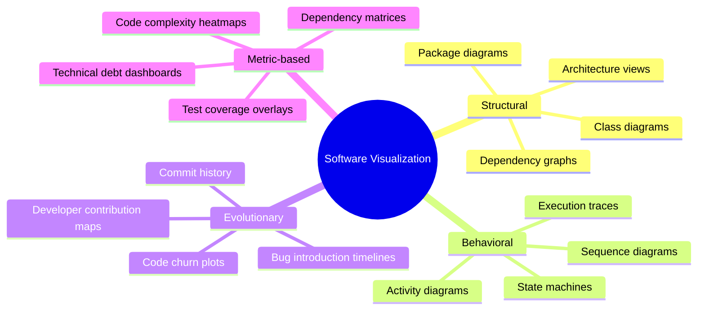
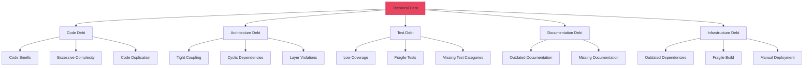
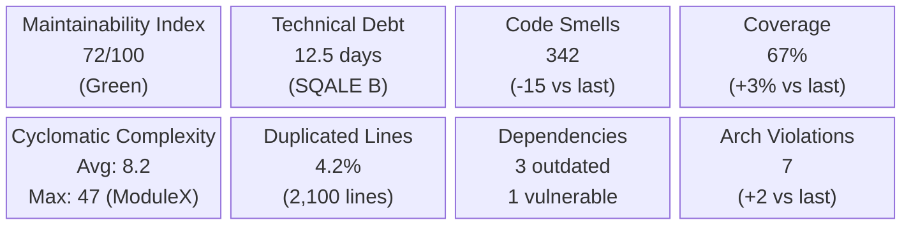

---
tags:
  - software-engineering
  - swebok
  - ka07
  - maintenance-tools
  - reverse-engineering
  - technical-debt
  - software-visualization
source: "SWEBOK v4 Chapter 07"
created: 2026-07-21
---

# 09 - Maintenance Tools and Techniques

> **KA 7.4-7.5** This note covers the tools and techniques that support software maintenance: reverse engineering, software visualization, technical debt measurement, static and dynamic analysis, and maintenance maturity models.

Prerequisites: [[07_Maintenance_Fundamentals]], [[08_Maintenance_Processes_and_Staffing]].

For hands-on techniques for understanding and modifying legacy code, see: [[01_Changing_Software]], [[02_Sensing_and_Seams]], [[03_Adding_Features]], [[04_Getting_Tests_in_Place]], [[05_Large_Scale_Changes]], [[06_Dependency_Breaking_Catalog]].

---

## 1. Reverse Engineering

Reverse engineering in software maintenance is the process of analyzing a system to identify its components, their interrelationships, and to create representations of the system in another form or at a higher level of abstraction.

### 1.1 Definitions

| Term | Definition |
|------|-----------|
| **Reverse Engineering** | Analyzing a system to identify components and their relationships and to create representations at a higher abstraction level. |
| **Design Recovery** | A subset of reverse engineering in which domain knowledge, external information, and deduction or fuzzy reasoning are added to the observations of the subject system. |
| **Re-documentation** | Creating or revising a semantically equivalent representation within the same relative abstraction level. |
| **Restructuring** | Transforming from one representation to another at the same relative abstraction level while preserving the system's external behavior. |

### 1.2 Levels of Reverse Engineering

```mermaid
flowchart TD
    subgraph "Abstraction Levels"
        D[Domain Level] --> R[Requirements Level]
        R --> S[Design/Architecture Level]
        S --> I[Implementation Level]
    end
    
    subgraph "Reverse Engineering Activities"
        DR[Design Recovery] -->|produces| D
        AR[Architecture Recovery] -->|produces| S
        CR[Code Comprehension] -->|produces| I
        RD[Re-Documentation] -->|same level| I
    end
    
    subgraph "Source Artifacts"
        CODE[Source Code]
        BINARY[Binary/Bytecode]
        CONFIG[Configuration Files]
        DB[Database Schema]
        API[API Definitions]
        TEST[Test Suites]
    end
    
    CODE --> CR
    BINARY --> CR
    CONFIG --> AR
    DB --> AR
    API --> AR
    TEST --> DR
    
    style D fill:#e94560,stroke:#c81d4e
    style S fill:#533483,stroke:#0f3460
    style I fill:#0f3460,stroke:#16213e
```



### 1.3 Reverse Engineering Techniques

| Technique | Description | Tools/Methods |
|-----------|-------------|---------------|
| **Code reading** | Manual examination of source code to understand logic and structure. | IDE, code editor with syntax highlighting. |
| **Static analysis** | Examining code without execution to extract structure, dependencies, and metrics. | SonarQube, Understand, Source Insight, Lattix. |
| **Dynamic analysis** | Observing program behavior during execution. | Profilers, debuggers, logging, tracing tools. |
| **Pattern matching** | Identifying known design patterns, anti-patterns, or idioms in code. | Custom scripts, AST analysis tools. |
| **Program slicing** | Extracting the subset of code that affects or is affected by a particular variable or statement. | CodeSurfer, Frama-C, custom slicers. |
| **Feature location** | Mapping high-level features to code locations. | Concept assignment, information retrieval, dynamic analysis. |
| **Architecture recovery** | Reconstructing the high-level architecture from code artifacts. | SAVE, Bauhaus, Arcs, dependency analysis tools. |

### 1.4 Design Recovery Process

Design recovery goes beyond code analysis to reconstruct higher-level abstractions:

```mermaid
flowchart LR
    subgraph Inputs
        CODE[Source Code]
        DOCS[Available Documentation]
        DOMAIN[Domain Knowledge]
        EXPERT[Expert Knowledge]
        HIST[Historical Information]
    end
    
    subgraph Process
        ANALYZE[Analyze Artifacts]
        ABSTRACT[Create Abstractions]
        VALIDATE[Validate Against Knowledge]
        ITERATE[Iterate and Refine]
    end
    
    subgraph Outputs
        ARCH[Architecture Description]
        DESIGN[Design Model]
        BEHAVIOR[Behavioral Model]
        DATA[Data Model]
    end
    
    CODE --> ANALYZE
    DOCS --> ANALYZE
    DOMAIN --> VALIDATE
    EXPERT --> VALIDATE
    HIST --> ANALYZE
    
    ANALYZE --> ABSTRACT
    ABSTRACT --> VALIDATE
    VALIDATE --> ITERATE
    ITERATE --> ABSTRACT
    
    ABSTRACT --> ARCH
    ABSTRACT --> DESIGN
    ABSTRACT --> BEHAVIOR
    ABSTRACT --> DATA
    
    style Process fill:#1a1a2e,stroke:#e94560
```



### 1.5 Re-documentation

Re-documentation creates or updates documentation at the same abstraction level as the source:

| Type | Description | Example |
|------|-------------|---------|
| **Inline documentation** | Comments and annotations within source code. | Javadoc, docstrings, code comments. |
| **Cross-reference listings** | Maps showing relationships between code elements. | Call graphs, variable usage maps. |
| **Control flow diagrams** | Visual representation of program execution paths. | Flowcharts, control flow graphs. |
| **Data flow diagrams** | Visual representation of data transformations. | Data flow graphs, data dictionaries. |
| **Entity-relationship diagrams** | Database schema representation. | ER diagrams, schema documentation. |
| **API documentation** | Interface specifications and usage guides. | Swagger/OpenAPI, API reference docs. |

---

## 2. Software Visualization

Software visualization uses graphical representations to help developers understand, analyze, and communicate about software systems.

### 2.1 Types of Software Visualization



### 2.2 Dependency Analysis and Visualization

Dependency analysis is one of the most valuable visualization techniques for maintenance:

#### Dependency Matrix

A dependency matrix shows which modules depend on which:

```
           | Module A | Module B | Module C | Module D |
-----------+----------+----------+----------+----------+
Module A   |    -     |    -->   |          |    -->   |
Module B   |          |    -     |    -->   |          |
Module C   |    -->   |          |    -     |    -->   |
Module D   |          |          |          |    -     |
```

- **Rows** are the source of the dependency.
- **Columns** are the target.
- **-->** indicates a dependency relationship.
- **Empty** cells indicate no dependency.

#### Dependency Graphs

```mermaid
graph LR
    A[Web Controller] --> B[Service Layer]
    A --> C[DTO Mapper]
    B --> D[Repository]
    B --> E[External API Client]
    D --> F[Database]
    E --> G[Payment Gateway]
    
    style A fill:#16213e,stroke:#0f3460
    style D fill:#533483,stroke:#0f3460
    style E fill:#e94560,stroke:#c81d4e
```



#### Dependency Analysis Metrics

| Metric | Description | What It Reveals |
|--------|-------------|----------------|
| **Afferent Coupling (Ca)** | Number of modules that depend on this module. | How many modules are affected by changes. |
| **Efferent Coupling (Ce)** | Number of modules this module depends on. | How many external changes can affect this module. |
| **Instability (I)** | I = Ce / (Ca + Ce). Range [0, 1]. | High I = unstable, hard to change. Low I = stable. |
| **Abstractness (A)** | Ratio of abstract classes/interfaces to total classes. | High A = flexible but potentially over-engineered. |
| **Distance from Main Sequence** | D = |A + I - 1|. | High D = design problem (too abstract+stable or too concrete+unstable). |

### 2.3 Evolution History Visualization

Understanding how code has evolved over time is critical for maintenance:

| Visualization | What It Shows | Maintenance Use |
|--------------|---------------|-----------------|
| **Code Churn Plot** | Lines added/removed per time period. | High churn = unstable, high maintenance cost areas. |
| **Hotspot Analysis** | Files changed most frequently across commits. | Identify code that needs refactoring or better testing. |
| **Developer Activity Map** | Who changed what, when. | Identify knowledge silos, bus factor risks. |
| **Bug Introduction Timeline** | When and where bugs were introduced. | Identify systemic quality issues. |
| **Code Age Heatmap** | Age of code lines (by last modification date). | Very old code may be poorly understood. |
| **Commit Dependency Graph** | How changes relate across commits. | Understand change coupling and cascading effects. |

### 2.4 Runtime Behavior Visualization

| Technique | Description | Tools |
|-----------|-------------|-------|
| **Execution traces** | Record method calls during runtime. | JaCoCo, strace, dtrace, OpenTelemetry |
| **Call graphs** | Visualize which functions call which. | gprof, Java Flight Recorder, dot/graphviz |
| **Flame graphs** | Stack trace visualization showing where time is spent. | Brendan Gregg's flamegraph tool, async-profiler |
| **Sequence diagrams** | Generate from runtime traces. | PlantUML (from traces), sequence diagram generators |
| **Memory maps** | Visualize heap allocation and garbage collection. | VisualVM, MAT, heap dumps |

---

## 3. Technical Debt Measurement

Technical debt quantifies the implied cost of future rework caused by choosing an easy solution now instead of a better approach.

### 3.1 Categories of Technical Debt



### 3.2 Measurement Dimensions

#### Size Metrics

| Metric | Definition | Maintenance Relevance |
|--------|-----------|----------------------|
| **Lines of Code (LOC)** | Physical lines of source code. | Baseline size metric; larger systems have more maintenance surface. |
| **Source Lines of Code (SLOC)** | Executable lines (excludes comments, blanks). | More accurate size for effort estimation. |
| **Function Points** | Normalized measure of functional size. | Language-independent; useful for cross-system comparison. |
| **Number of Files** | Count of source files. | Indicates structural complexity and modularity. |
| **Number of Modules/Packages** | Count of logical groupings. | Indicates architectural decomposition. |

#### Complexity Metrics

| Metric | Definition | Threshold | Maintenance Relevance |
|--------|-----------|-----------|----------------------|
| **Cyclomatic Complexity** | Number of independent execution paths. | < 10 simple, 10-20 moderate, > 20 complex | High complexity = harder to understand, test, and maintain. |
| **Cognitive Complexity** | How difficult code is to understand (SonarQube model). | < 15 acceptable | Better predictor of maintainability than cyclomatic. |
| **Depth of Inheritance** | Levels in the class hierarchy. | < 5 preferred | Deep hierarchies are hard to understand and change. |
| **Coupling Between Objects** | Number of classes a class is coupled to. | < 5 preferred | High coupling = ripple effects on changes. |
| **Response For a Class (RFC)** | Number of methods that can be executed in response to a message. | < 50 preferred | Large RFC = high complexity, hard to test. |
| **Weighted Methods per Class** | Sum of complexity of all methods in a class. | < 50 preferred | Large classes with complex methods are maintenance nightmares. |

#### Code Smells

Common code smells that indicate maintenance risk:

| Smell | Description | Impact |
|-------|-------------|--------|
| **Long Method** | Method with too many lines (> 50). | Hard to understand, test, and reuse. |
| **God Class** | Class that does too much. | Single point of failure, high change risk. |
| **Feature Envy** | Method that uses data from another class more than its own. | Wrong abstraction boundaries. |
| **Data Clumps** | Groups of data items that appear together repeatedly. | Missing abstraction. |
| **Primitive Obsession** | Using primitives instead of small objects for simple concepts. | Missing domain modeling. |
| **Switch Statements** | Long switch/if-else chains. | Violates Open/Closed Principle. |
| **Parallel Inheritance** | Creating a subclass in one hierarchy requires creating one in another. | Tight coupling between hierarchies. |
| **Lazy Class** | Class that doesn't do enough to justify its existence. | Unnecessary complexity. |
| **Speculative Generality** | Code built for future use that never materializes. | Dead code, maintenance burden. |
| **Temporary Field** | Instance variable only used in certain circumstances. | Confusing, indicates wrong object model. |

### 3.3 Architectural Violations

| Violation Type | Description | Detection Method |
|---------------|-------------|-----------------|
| **Layer violations** | Upper layer directly accesses lower layer, skipping intermediate layers. | Dependency analysis, ArchUnit tests. |
| **Cyclic dependencies** | Module A depends on B, B depends on A. | Dependency graph analysis. |
| **Dependency rule violations** | Domain code depends on infrastructure. | Architecture fitness functions. |
| **API boundary violations** | Internal modules exposed through public API. | API surface analysis. |
| **Unauthorized dependencies** | Module depends on forbidden module. | Dependency constraint rules. |

### 3.4 Composite Debt Metrics

| Metric | Formula | Interpretation |
|--------|---------|----------------|
| **Technical Debt Ratio (TDR)** | (Remediation Cost) / (Total Development Cost) | Percentage of effort needed to fix debt. |
| **Technical Debt Index (TDI)** | TDR x Code Base Size | Absolute debt in person-hours. |
| **Maintainability Index (MI)** | 171 - 5.2 ln(Halstead Volume) - 0.23(Cyclomatic Complexity) - 16.2 ln(LOC) + 50 sin(sqrt(2.4 x Comments)) | 0-100 scale; higher = more maintainable. |
| **SQALE Rating** | A-E grade based on debt density. | A = < 5% debt density, E = > 50%. |

### 3.5 Technical Debt Dashboard

A typical technical debt dashboard aggregates multiple metrics:



---

## 4. Static and Dynamic Analysis Tools

### 4.1 Static Analysis

Static analysis examines source code (or bytecode) without executing it.

| Tool Category | Purpose | Examples |
|--------------|---------|---------|
| **Linters** | Enforce coding standards and style. | ESLint, Pylint, Checkstyle, Clippy. |
| **Bug Finders** | Detect potential bugs and code smells. | SpotBugs, ErrorProne, Infer, PMD. |
| **Security Scanners** | Find security vulnerabilities. | SonarQube, Fortify, Checkmarx, Semgrep. |
| **Code Metrics** | Calculate complexity, coupling, and size metrics. | SonarQube, Understand, Lizard, Radon. |
| **Dependency Analyzers** | Map and analyze module dependencies. | Lattix, Structure101, jDepend, ArchUnit. |
| **Architecture Analyzers** | Verify architectural constraints. | ArchUnit, Degraph, Dependency-Track. |

### 4.2 Dynamic Analysis

Dynamic analysis observes program behavior during execution.

| Tool Category | Purpose | Examples |
|--------------|---------|---------|
| **Profilers** | Measure time and memory usage. | Java Flight Recorder, perf, Valgrind, py-spy. |
| **Code Coverage** | Measure which code is executed by tests. | JaCoCo, gcov, coverage.py, Istanbul. |
| **Memory Analyzers** | Detect leaks, analyze heap. | MAT, VisualVM, Valgrind, Delve. |
| **Tracers** | Record execution flow. | strace, dtrace, OpenTelemetry, Jaeger. |
| **Fuzzers** | Generate random inputs to find crashes. | AFL, libFuzzer, Hypothesis. |
| **Mutation Testing** | Introduce faults to evaluate test effectiveness. | PIT (Java), mutmut (Python), Stryker. |

### 4.3 Program Slicing

Program slicing extracts the subset of a program that affects (or is affected by) a particular computation. It is a powerful technique for understanding maintenance changes.

#### Types of Slices

| Type | Direction | Question |
|------|-----------|----------|
| **Backward Slice** | From a point backward | "What code influences this variable at this point?" |
| **Forward Slice** | From a point forward | "What code is affected if this variable changes?" |
| **Static Slice** | Over all possible inputs | "What code could affect this variable in any execution?" |
| **Dynamic Slice** | For a specific input | "What code actually affected this variable for this input?" |

#### Slicing Example

```python
# Original code
def process_order(order):
    subtotal = order.quantity * order.price       # L1
    tax_rate = get_tax_rate(order.region)          # L2
    tax = subtotal * tax_rate                      # L3
    shipping = calculate_shipping(order.weight)    # L4
    discount = apply_discount(order.coupon)        # L5
    total = subtotal + tax + shipping - discount   # L6
    save_to_database(order.id, total)              # L7
    return total                                    # L8

# Backward slice from L6 for variable 'total'
# Shows only the code that contributes to 'total':
def process_order_sliced(order):
    subtotal = order.quantity * order.price       # L1 -> contributes to total
    tax_rate = get_tax_rate(order.region)          # L2 -> contributes to total
    tax = subtotal * tax_rate                      # L3 -> contributes to total
    shipping = calculate_shipping(order.weight)    # L4 -> contributes to total
    discount = apply_discount(order.coupon)        # L5 -> contributes to total
    total = subtotal + tax + shipping - discount   # L6 -> target
    # L7 and L8 are excluded: they use 'total' but don't affect it
```

### 4.4 Cross-Reference Tools

Cross-reference tools generate tables showing relationships between program elements:

| Cross-Reference Type | What It Maps | Example Output |
|---------------------|--------------|----------------|
| **Call graph** | Which functions call which. | `main() -> process() -> validate()` |
| **Variable usage** | Where each variable is defined, read, modified. | `x: defined L10, read L15, L20, modified L25` |
| **Type usage** | Where each type/class is used. | `User: used in AuthService, UserRepository, UserController` |
| **Module dependencies** | Which modules import/depend on which. | `auth -> database, auth -> crypto, api -> auth` |
| **Include/Import graph** | Transitive dependency chain. | `main.py -> utils.py -> config.py -> env.py` |

---

## 5. Maintenance Maturity Models

### 5.1 Standards Alignment

Maintenance maturity models align with multiple standards:

```mermaid
flowchart TD
    MM[Maintenance Maturity] --> ISO12207[ISO/IEC/IEEE 12207<br/>Software Life Cycle Processes]
    MM --> ISO14764[ISO/IEC/IEEE 14764<br/>Software Maintenance]
    MM --> ISO15504[ISO/IEC 15504 / SPICE<br/>Process Assessment]
    MM --> ITIL[ITIL<br/>IT Service Management]
    MM --> COBIT[COBIT<br/>IT Governance]
    
    ISO14764 --> PROC[Process Areas]
    ISO15504 --> ASSESS[Assessment Framework]
    ITIL --> SRVC[Service Management]
    COBIT --> GOV[Governance]
    
    PROC --> MATURITY[Maturity Levels]
    ASSESS --> MATURITY
    SRVC --> MATURITY
    GOV --> MATURITY
    
    style MM fill:#e94560,stroke:#c81d4e
    style MATURITY fill:#16213e,stroke:#0f3460
```



### 5.2 Maturity Levels

| Level | Name | Process | People | Tools | Metrics |
|-------|------|---------|--------|-------|---------|
| **1** | Initial | Ad hoc, chaotic | Untrained, reactive | None or basic | None |
| **2** | Repeatable | Basic planning and tracking | Some training, assigned roles | Basic (IDE, debugger) | Basic (bug counts, time to fix) |
| **3** | Defined | Standardized, documented | Trained team, defined roles | Integrated tool suite | Process metrics (cycle time, defect density) |
| **4** | Managed | Quantitatively managed | Skilled, metrics-aware | Automated analysis, dashboards | Predictive models, SPC charts |
| **5** | Optimizing | Continuous improvement | Expert, innovative | AI-assisted, automated | Optimization-driven, feedback loops |

### 5.3 Assessment Dimensions

A maintenance maturity assessment typically evaluates:

| Dimension | Key Questions |
|-----------|--------------|
| **Process** | Are maintenance processes defined, documented, and followed? Is there a change control process? |
| **Organization** | Is there a defined maintenance organization? Are roles and responsibilities clear? |
| **Tools** | Are appropriate tools in place for analysis, testing, and deployment? |
| **Metrics** | Are maintenance metrics collected, analyzed, and used for decision-making? |
| **Quality** | Are quality standards defined and enforced? Is there systematic testing? |
| **Knowledge** | Is knowledge managed and transferred effectively? Is documentation maintained? |
| **Planning** | Is maintenance planned at strategic, tactical, and operational levels? |
| **Continuous Improvement** | Is there a feedback loop for process improvement? |

### 5.4 ISO/IEC 15504 (SPICE) Process Assessment

ISO/IEC 15504 provides a framework for assessing process capability:

| Capability Level | Name | Indicators |
|-----------------|------|------------|
| **0** | Incomplete | Process not implemented or fails to achieve purpose. |
| **1** | Performed | Process achieves its purpose; base practices are performed. |
| **2** | Managed | Process is planned, monitored, and work products are controlled. |
| **3** | Established | Process uses a defined process tailored from organizational standards. |
| **4** | Predictable | Process operates within defined limits; quantitative management. |
| **5** | Optimizing | Process is continually improved to meet business goals. |

### 5.5 ITIL Alignment

ITIL (Information Technology Infrastructure Library) provides service management practices relevant to maintenance:

| ITIL Practice | Maintenance Application |
|--------------|----------------------|
| **Incident Management** | Emergency corrective maintenance; restoring service after failure. |
| **Problem Management** | Root cause analysis of recurring faults; preventive maintenance planning. |
| **Change Management** | Controlled modification implementation; risk assessment of changes. |
| **Release Management** | Planning and executing software releases; rollback procedures. |
| **Service Level Management** | Defining and monitoring SLAs/SLOs for maintenance services. |
| **Knowledge Management** | Maintaining the known error database; documenting resolutions. |
| **Continual Improvement** | Measuring and improving maintenance process effectiveness. |

### 5.6 COBIT Alignment

COBIT (Control Objectives for Information and Related Technologies) provides governance guidance:

| COBIT Domain | Maintenance Application |
|-------------|----------------------|
| **Align, Plan and Organize** | Strategic maintenance planning; resource allocation. |
| **Build, Acquire and Implement** | Modification implementation; change management. |
| **Deliver, Service and Support** | Help desk operations; incident and problem management. |
| **Monitor, Evaluate and Assess** | Maintenance metrics; process assessment; compliance monitoring. |

---

## 6. Tool Selection Guide

### 6.1 Tool Categories for Maintenance

| Category | Purpose | Selection Criteria |
|----------|---------|-------------------|
| **IDE** | Code editing, navigation, debugging. | Language support, refactoring, code navigation. |
| **Version Control** | Track changes, manage branches. | Git compatibility, branching model support. |
| **Static Analysis** | Code quality, security, metrics. | Language support, rule customization, CI integration. |
| **Dynamic Analysis** | Runtime profiling, coverage. | Performance overhead, reporting quality. |
| **Testing** | Automated testing frameworks. | Language support, mocking, reporting. |
| **Dependency Analysis** | Module and library dependency management. | Visualization, constraint checking, vulnerability scanning. |
| **Documentation** | Generate and maintain documentation. | Auto-generation, versioning, search. |
| **Monitoring** | Production system observability. | Alerting, dashboards, log aggregation. |

### 6.2 Build vs. Buy Decision

```mermaid
flowchart TD
    Q1{Is it a core maintenance capability?}
    Q1 -->|Yes| Q2{Do you have the expertise to build?}
    Q1 -->|No| BUY[Buy / Subscribe]
    
    Q2 -->|Yes| Q3{Is the cost justified?}
    Q2 -->|No| BUY
    
    Q3 -->|Yes| BUILD[Build in-house]
    Q3 -->|No| OPEN[Use open-source + customize]
    
    BUY --> EVAL[Evaluated: ROI, vendor stability, integration, lock-in]
    BUILD --> EVAL2[Evaluated: maintenance cost, opportunity cost]
    OPEN --> EVAL3[Evaluated: community health, license, support]
    
    style BUY fill:#16213e,stroke:#0f3460
    style BUILD fill:#e94560,stroke:#c81d4e
    style OPEN fill:#533483,stroke:#0f3460
```



---

## 7. Summary

| Concept | Key Takeaway |
|---------|-------------|
| Reverse Engineering | Analyze code to produce higher-level representations; design recovery adds domain knowledge |
| Software Visualization | Dependency analysis, evolution tracing, and runtime visualization aid understanding |
| Technical Debt | Measured across size, complexity, code smells, and architectural violations |
| Static Analysis | Examine code without execution: linters, bug finders, security scanners, metrics |
| Dynamic Analysis | Observe runtime behavior: profilers, coverage, memory analysis, tracing |
| Program Slicing | Extract code subsets that affect or are affected by a specific computation |
| Maturity Models | Aligned with ISO 12207, 14764, 15504, ITIL, COBIT; 5 levels from Initial to Optimizing |
| Tool Selection | Match tool category to maintenance need; evaluate build vs. buy vs. open-source |

---

## 8. References

- SWEBOK v4, Chapter 7: Software Maintenance.
- ISO/IEC/IEEE 14764:2022. *Software Life Cycle Processes: Maintenance*.
- ISO/IEC 15504 (SPICE). *Information Technology: Process Assessment*.
- Chikofsky, E.J. & Cross, J.H. (1990). "Reverse Engineering and Design Recovery: A Taxonomy." *IEEE Software*, 7(1), 13-17.
- Muller, H.A. et al. (1993). "Reverse Engineering: A Roadmap." *ICSE 2000*.
- SonarQube Documentation. https://docs.sonarqube.org/
- Lehman, M.M. (1980). "Programs, Life Cycles, and Laws of Software Evolution." *Proceedings of the IEEE*, 68(9).
- Feathers, M. (2004). *Working Effectively with Legacy Code*. Prentice Hall.
- Fowler, M. (1999). *Refactoring: Improving the Design of Existing Code*. Addison-Wesley.
- Weiser, M. (1984). "Program Slicing." *IEEE Transactions on Software Engineering*, 10(4), 352-357.
