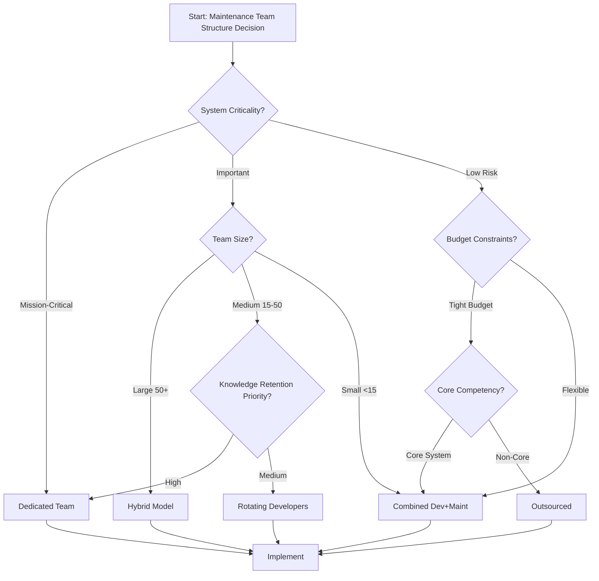
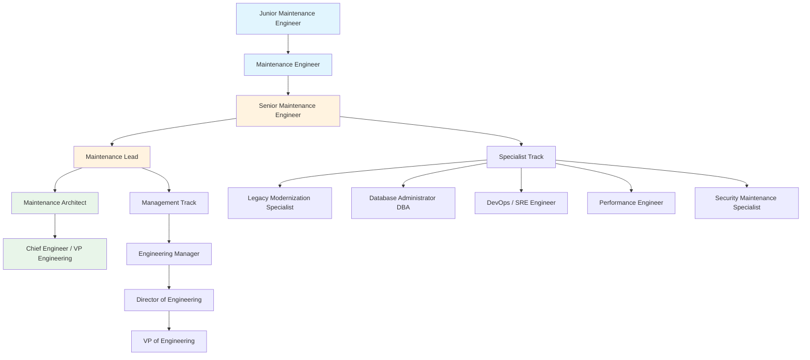
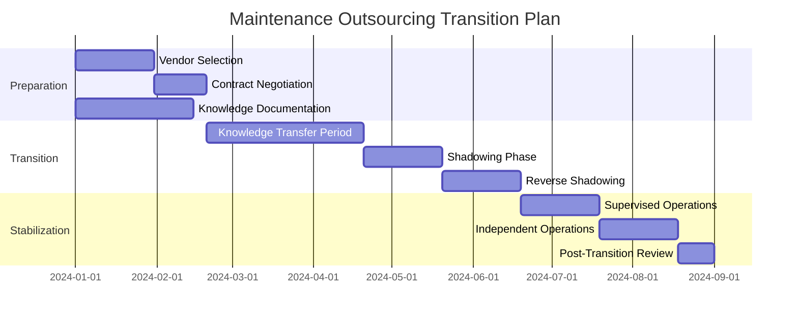
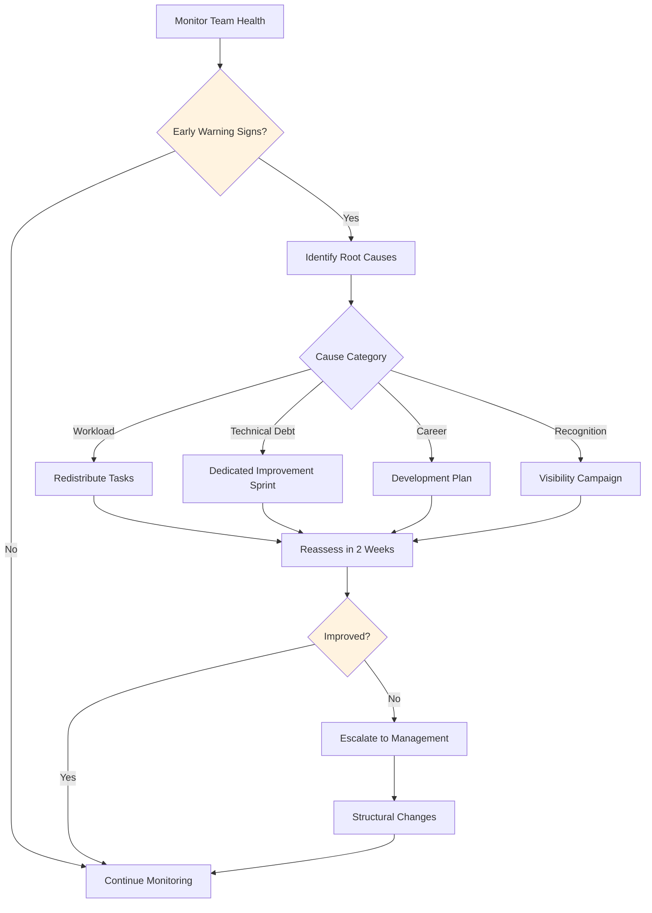

# Staffing and Organizational Models for Software Maintenance

> **SWEBOK KA 7.2** - Addresses how organizations structure, staff, and manage maintenance teams, including outsourcing strategies and personnel development.

## 1. Organizational Models for Maintenance

Software maintenance organizations adopt different structural approaches based on system criticality, team size, budget, and strategic priorities.

### 1.1 Five Primary Organizational Models

| Model | Description | Advantages | Disadvantages | Best For |
|-------|-------------|------------|---------------|----------|
| **Dedicated Maintenance Team** | Separate team exclusively handles all maintenance activities | Deep domain expertise, consistent ownership, predictable costs | Knowledge silos, potential isolation from development, career stagnation | Large legacy systems, high-change-rate systems |
| **Rotating Developers** | Development team members rotate through maintenance duties on a schedule | Fresh perspectives, knowledge spreading, empathy for maintenance | Context-switching overhead, inconsistent quality, learning curve each rotation | Small organizations, teams with 15-30 developers |
| **Combined Development + Maintenance** | Same team owns both new development and maintenance for a product | Full lifecycle ownership, natural knowledge transfer, prioritization flexibility | Maintenance often deprioritized, resource conflicts, burnout risk | Product companies, continuous delivery environments |
| **Outsourced Maintenance Team** | External vendor handles maintenance under contract | Cost reduction, scalability, access to specialized skills | Knowledge loss, communication overhead, vendor dependency, security concerns | Non-core systems, cost-sensitive organizations |
| **Hybrid Model** | Combination: core team + outsourced routine tasks + rotating specialists | Flexibility, cost optimization, risk distribution | Complexity in coordination, multiple vendor management, governance overhead | Large enterprises, multi-system portfolios |

### 1.2 Model Selection Decision Framework



### 1.3 Organizational Structure Comparison

| Aspect | Centralized | Decentralized | Federated |
|--------|-------------|---------------|-----------|
| **Reporting** | Single maintenance manager | Distributed across product lines | Matrix: functional + product |
| **Resource Sharing** | Easy pool allocation | Dedicated per product | Flexible with governance |
| **Knowledge Management** | Centralized documentation | Product-specific knowledge | Shared practices, local knowledge |
| **Standardization** | High | Low | Medium |
| **Responsiveness** | May be slow for niche products | Fast for local decisions | Balanced |
| **Career Paths** | Clear vertical path | Product-specialized paths | Multiple growth vectors |

## 2. Staffing Decisions and Knowledge Retention

### 2.1 Knowledge Retention Strategies

Knowledge retention is the most critical staffing challenge in maintenance. Loss of key personnel can severely impact maintenance capability.

| Strategy | Implementation | Effectiveness | Cost |
|----------|---------------|---------------|------|
| **Documentation as Knowledge Transfer** | Comprehensive system docs, ADRs, runbooks, decision logs | Medium-High (if maintained) | High initial, Medium ongoing |
| **Pair Maintenance** | Two engineers work together on complex changes; one shadows, one leads | High | Medium (2x person-hours) |
| **Code Ownership Models** | Defined ownership of modules/components | High | Low |
| **Knowledge Base / Wiki** | Searchable repository of maintenance knowledge, FAQs, troubleshooting guides | Medium | Medium ongoing |
| **Cross-Training Programs** | Structured rotation through different system components | High | Medium-High |
| **Brown Bag Sessions** | Informal knowledge-sharing presentations | Medium | Low |
| **Recording Incident Resolutions** | Post-incident reviews documented with root cause and fix | High | Low per incident |
| **Mentorship Programs** | Senior maintenance engineers mentor juniors | High | Medium |

### 2.2 Code Ownership Models

Code ownership defines who has authority and responsibility for specific code components.

| Model | Description | Pros | Cons | When to Use |
|-------|-------------|------|------|-------------|
| **Strong Ownership** | Single person owns each module; all changes require owner approval | Deep expertise, accountability, quality control | Bus factor = 1, bottleneck, knowledge silos | Critical subsystems, regulatory compliance areas |
| **Weak Ownership** | Primary owner but others can make changes with review | Balance of expertise and flexibility | Less accountability, inconsistent standards | Most production codebases |
| **Collective Ownership** | Entire team owns all code equally | No single point of failure, broad knowledge | Reduced individual accountability, diffusion of responsibility | Small mature teams, high-trust environments |
| **Component Ownership** | Team (not individual) owns each component | Team redundancy, shared expertise | Requires team coordination | Medium-large organizations |

### 2.3 Documentation as Knowledge Transfer

Effective documentation for maintenance knowledge transfer includes:

- **Architecture Decision Records (ADRs)**: Capture *why* design decisions were made, not just *what* was built
- **Runbooks**: Step-by-step operational procedures for common maintenance tasks
- **System Context Diagrams**: Show how the system fits into the broader ecosystem
- **Data Dictionaries**: Document data models, relationships, and business rules
- **API Contracts**: Interface specifications with examples and error handling
- **Troubleshooting Guides**: Decision trees for diagnosing common issues
- **Change Logs**: History of significant modifications with rationale

### 2.4 Pair Maintenance Practice

```
┌─────────────────────────────────────────────────┐
│              Pair Maintenance Session            │
├─────────────────────────────────────────────────┤
│                                                  │
│  ┌──────────┐    ┌──────────┐                   │
│  │ Driver   │    │ Navigator│                   │
│  │ (writes  │◄──►│ (reviews │                   │
│  │  code)   │    │  & guides)│                  │
│  └──────────┘    └──────────┘                   │
│       │               │                          │
│       ▼               ▼                          │
│  ┌──────────────────────────┐                   │
│  │    Shared Understanding   │                   │
│  │  • Code structure        │                   │
│  │  • Design rationale      │                   │
│  │  • Domain knowledge      │                   │
│  │  • Operational patterns  │                   │
│  └──────────────────────────┘                   │
│                                                  │
│  Rotation: Switch roles every 30-60 minutes     │
│  Outcome: Both gain maintenance knowledge       │
└─────────────────────────────────────────────────┘
```

## 3. Career Paths in Maintenance

### 3.1 Career Progression Ladder



### 3.2 Specialization Paths

| Specialization | Focus Areas | Key Skills | Growth Trajectory |
|----------------|-------------|------------|-------------------|
| **Legacy Modernization** | Migrating old systems to modern platforms, strangler fig patterns, incremental refactoring | COBOL/legacy languages, migration tools, architecture patterns | Modernization Architect, Cloud Migration Lead |
| **Database Administration** | Database maintenance, performance tuning, schema evolution, backup/recovery | SQL optimization, replication, partitioning, migration tools | Data Architect, Data Platform Lead |
| **DevOps / SRE** | CI/CD pipeline maintenance, infrastructure as code, monitoring, incident response | Docker, Kubernetes, Terraform, observability tools | SRE Manager, Platform Engineering Lead |
| **Performance Engineering** | System profiling, bottleneck identification, capacity planning, optimization | Profiling tools, load testing, resource management | Performance Architect, Capacity Planning Lead |
| **Security Maintenance** | Vulnerability patching, security updates, compliance maintenance, threat response | Security scanning tools, penetration testing, compliance frameworks | Security Architect, CISO track |

### 3.3 Skills Matrix for Maintenance Engineers

| Skill Category | Junior | Mid | Senior | Lead |
|----------------|--------|-----|--------|------|
| **Debugging** | Follow runbooks | Independent diagnosis | Root cause analysis | Design debugging tooling |
| **Code Reading** | Understand modules | Understand system | Understand architecture | Evaluate architecture |
| **Testing** | Write unit tests | Design test suites | Test strategy | Quality architecture |
| **Communication** | Report issues | Write documentation | Present to stakeholders | Influence strategy |
| **Mentoring** | Learn from others | Peer learning | Mentor juniors | Develop team capability |
| **Estimation** | Task-level | Feature-level | Project-level | Portfolio-level |

## 4. Outsourcing and Offshoring Maintenance

### 4.1 Sourcing Models

| Model | Structure | Control | Cost | Risk |
|-------|-----------|---------|------|------|
| **Single-Source** | One vendor handles all outsourced maintenance | High vendor dependency | Lowest per-unit | Highest (single point of failure) |
| **Multi-Sourcing** | Multiple vendors, each handling different components/systems | Moderate, vendor competition | Medium | Medium (integration complexity) |
| **Best-of-Breed** | Specialized vendors for different maintenance types (e.g., DB, app, infra) | Complex governance | Higher coordination cost | Medium-High |
| **Hybrid Insource/Outsource** | Core maintenance in-house, routine/outsourceable tasks to vendors | High on core, delegated on routine | Optimized | Low-Medium |

### 4.2 Service Level Agreements (SLAs), SLIs, and SLOs

| Concept | Definition | Example | Maintenance Application |
|---------|-----------|---------|------------------------|
| **SLI** (Service Level Indicator) | Quantifiable measure of service level | Response time p99 | Time to acknowledge incident |
| **SLO** (Service Level Objective) | Internal target for SLI | p99 < 500ms | MTTR < 4 hours for P1 |
| **SLA** (Service Level Agreement) | Contractual commitment with consequences | 99.9% uptime or credit | Fix critical bugs within 24 hours or penalty |

**Typical Maintenance SLA Components:**

| SLA Component | Description | Example Metrics |
|---------------|-------------|-----------------|
| **Availability** | System uptime guarantee | 99.9% monthly uptime |
| **Response Time** | Time to acknowledge issues | P1: 15 min, P2: 1 hour, P3: 4 hours |
| **Resolution Time** | Time to fix issues | P1: 4 hours, P2: 24 hours, P3: 5 days |
| **Change Success Rate** | Percentage of changes without rollback | > 95% |
| **Defect Escape Rate** | Bugs found in production vs. testing | < 5% of total defects |
| **Backlog Management** | Issue resolution velocity | Clear backlog within 2 sprints |
| **Reporting** | Regular status reporting | Weekly summary, monthly metrics |

### 4.3 Vendor Selection Criteria

| Criterion | Weight | Evaluation Method |
|-----------|--------|-------------------|
| **Technical Capability** | High | Skills assessment, case studies, references |
| **Domain Experience** | High | Industry-specific maintenance experience, case studies |
| **Cost** | Medium-High | Total cost of ownership analysis, not just hourly rates |
| **Communication** | Medium | English proficiency, timezone overlap, communication tools |
| **Security & Compliance** | High | ISO 27001, SOC 2, data handling policies |
| **Scalability** | Medium | Ability to ramp up/down, bench strength |
| **Cultural Fit** | Medium | Work culture compatibility, methodology alignment |
| **References** | Medium | Client testimonials, retention rates |
| **Financial Stability** | Low-Medium | Company financials, market position |
| **Location** | Low-Medium | Timezone, travel requirements, data residency |

### 4.4 Transition Planning



### 4.5 Knowledge Transfer Period

The knowledge transfer period is critical for successful outsourcing:

| Phase | Duration | Activities | Deliverables |
|-------|----------|------------|--------------|
| **Documentation** | 4-6 weeks | Document all systems, processes, tribal knowledge | System docs, runbooks, architecture diagrams |
| **Training** | 2-4 weeks | Vendor team learns systems through structured training | Training materials, Q&A logs |
| **Shadowing** | 4-6 weeks | Vendor observes and assists internal team | Shadowing reports, competency assessments |
| **Reverse Shadowing** | 4-6 weeks | Vendor leads, internal team observes and corrects | Independence readiness assessment |
| **Supervised Independence** | 4 weeks | Vendor operates independently with internal oversight | Performance metrics, quality reports |
| **Full Handover** | 2 weeks | Internal team steps back, final review | Handover sign-off, escalation contacts |

### 4.6 Cultural and Timezone Challenges

| Challenge | Impact | Mitigation Strategies |
|-----------|--------|----------------------|
| **Timezone Gaps** | Delayed issue resolution, reduced collaboration hours | Overlap hours mandate (min 4 hours), follow-the-sun model, async communication protocols |
| **Language Barriers** | Miscommunication, requirement misunderstanding | English proficiency requirements, written communication standards, glossaries |
| **Cultural Work Norms** | Different expectations about deadlines, quality, escalation | Cultural awareness training, explicit process definitions, regular check-ins |
| **Holiday Calendar Differences** | Unavailability during critical periods | Shared calendar, holiday coverage plans, backup personnel |
| **Decision-Making Styles** | Hierarchical vs. flat, consensus vs. individual | Clear escalation paths, defined authority levels, decision logs |
| **Quality Standards** | Varying interpretations of "done" or "acceptable" | Explicit acceptance criteria, definition of done, quality gates |

### 4.7 XaaS and API Enablement for Maintenance

Modern maintenance outsourcing leverages service-oriented and API-driven approaches:

| Approach | Description | Maintenance Benefit |
|----------|-------------|---------------------|
| **Maintenance-as-a-Service (MaaS)** | Vendor provides maintenance as a managed service | Predictable costs, defined SLAs, vendor accountability |
| **Platform-as-a-Service** | Maintenance tools and environments provided as PaaS | Standardized tooling, reduced setup overhead |
| **API-First Maintenance** | All system interactions through well-defined APIs | Clear contracts, versioned interfaces, testable boundaries |
| **Monitoring-as-a-Service** | External monitoring with vendor-managed alerting and response | 24/7 coverage, specialized tooling, incident management |
| **Automated Patch Management** | Vendor-managed patching through automated pipelines | Reduced manual effort, consistent patching, compliance tracking |

## 5. Maintenance Team Metrics

### 5.1 Key Performance Indicators

| Metric | Definition | Target Range | Industry Benchmark |
|--------|-----------|--------------|-------------------|
| **MTTR** (Mean Time to Repair) | Average time from incident detection to resolution | P1: < 1 hour, P2: < 4 hours | Varies by industry |
| **Change Failure Rate** | % of changes causing incidents or requiring rollback | < 5% | Elite: 0-15%, Low: 46-60% |
| **Deployment Frequency** | How often maintenance changes are deployed | Daily to Weekly | Elite: on-demand, Low: monthly+ |
| **Backlog Aging** | Average age of open maintenance issues | < 30 days for bugs | Varies |
| **Customer Satisfaction (CSAT)** | User satisfaction with maintenance responsiveness | > 80% | Varies |
| **Lead Time for Changes** | Time from change request to production deployment | < 1 week | Elite: < 1 hour |
| **Availability** | System uptime percentage | > 99.9% | Depends on SLA |
| **Defect Density** | Defects per KLOC or per function point | Decreasing trend | Varies by domain |
| **Rework Rate** | % of fixes that need rework | < 10% | Varies |
| **Knowledge Coverage** | % of system components with at least 2 knowledgeable engineers | > 80% | N/A |

### 5.2 Metrics Dashboard Framework

```
┌─────────────────────────────────────────────────────────────────┐
│                 Maintenance Metrics Dashboard                    │
├─────────────────────────────────────────────────────────────────┤
│                                                                  │
│  ┌─────────────────┐  ┌─────────────────┐  ┌─────────────────┐ │
│  │   MTTR (P1)     │  │ Change Failure  │  │   CSAT Score    │ │
│  │   ⏱️ 45 min     │  │    Rate         │  │   ⭐ 87%        │ │
│  │   Target: <1hr  │  │    📉 3.2%      │  │   Target: >80%  │ │
│  │   ✅ On Target  │  │    Target: <5%  │  │   ✅ On Target  │ │
│  └─────────────────┘  │    ✅ On Target  │  └─────────────────┘ │
│                       └─────────────────┘                       │
│  ┌─────────────────┐  ┌─────────────────┐  ┌─────────────────┐ │
│  │  Deploy Freq    │  │ Backlog Aging   │  │ Knowledge       │ │
│  │  📦 12/week     │  │  📅 18 days avg │  │ Coverage        │ │
│  │  Target: weekly │  │  Target: <30d   │  │ 📚 78%          │ │
│  │  ✅ Above       │  │  ✅ On Target   │  │  Target: >80%   │ │
│  └─────────────────┘  └─────────────────┘  │  ⚠️ Below       │ │
│                                             └─────────────────┘ │
│  ┌──────────────────────────────────────────────────────────┐  │
│  │ Backlog Trend (last 12 weeks)                            │  │
│  │ ████████████████████████████████████████ 45 new           │  │
│  │ ██████████████████████████████████████████ 48 closed      │  │
│  │ Net: -3 (healthy)                                        │  │
│  └──────────────────────────────────────────────────────────┘  │
└─────────────────────────────────────────────────────────────────┘
```

### 5.3 DORA Metrics Applied to Maintenance

| DORA Metric | Maintenance Interpretation | Elite | High | Medium | Low |
|-------------|---------------------------|-------|------|--------|-----|
| **Deployment Frequency** | How often fixes reach production | On-demand (multiple/day) | Daily-Weekly | Weekly-Monthly | Monthly+ |
| **Lead Time for Changes** | Time from fix committed to deployed | < 1 hour | 1 day - 1 week | 1 week - 1 month | > 1 month |
| **Change Failure Rate** | % of maintenance changes causing incidents | 0-15% | 16-30% | 16-30% | 46-60% |
| **MTTR** | Time to restore service after incident | < 1 hour | < 1 day | < 1 week | > 1 week |

## 6. Maintenance Burnout and Retention

### 6.1 Causes of Maintenance Burnout

| Cause | Description | Severity | Frequency |
|-------|-------------|----------|-----------|
| **On-Call Fatigue** | Frequent after-hours pages, disrupted sleep, constant alertness | High | Common |
| **Incident Fatigue** | Repeated firefighting, high-stress incident response | High | Common |
| **Technical Debt Frustration** | Working with poorly maintained code, inability to improve systems | Medium-High | Very Common |
| **Lack of Recognition** | Maintenance seen as "less valuable" than new development | Medium | Very Common |
| **Repetitive Work** | Same types of fixes, limited novelty or growth | Medium | Common |
| **Unclear Career Path** | Perception that maintenance is a dead-end career | Medium | Common |
| **Tooling Frustration** | Outdated or inadequate maintenance tools | Medium | Common |
| **Scope Creep** | Maintenance tasks expanding without additional resources | Medium-High | Common |

### 6.2 On-Call Rotation Best Practices

| Practice | Description | Benefit |
|----------|-------------|---------|
| **Rotating Schedule** | No single person on-call for more than 1 week at a time | Prevents sustained fatigue |
| **Follow-the-Sun** | Timezone-based on-call coverage | Eliminates night shifts |
| **Escalation Tiers** | L1 (triage) → L2 (investigation) → L3 (specialist) | Distributes load, appropriate expertise |
| **Post-Incident Rest** | Mandatory rest after major incidents | Prevents compounding fatigue |
| **Compensation** | On-call pay, overtime, or compensatory time off | Fair compensation for disruption |
| **Automation** | Auto-remediation for known issues, self-healing systems | Reduces page volume |
| **Quiet Hours** | Non-critical alerts batched during off-hours | Protects sleep |
| **Runbook Quality** | Clear, tested runbooks for common issues | Reduces cognitive load during incidents |

### 6.3 Strategies for Morale and Retention

| Strategy | Implementation | Expected Impact |
|----------|---------------|-----------------|
| **Dedicated Improvement Time** | 20% time for technical debt reduction, tooling, automation | High - addresses root frustration |
| **Recognition Programs** | Celebrate maintenance achievements, not just feature launches | Medium-High - combats undervaluation |
| **Career Development** | Clear promotion paths, skill development budgets, conference attendance | High - addresses growth concerns |
| **Rotation Opportunities** | Periodic rotation to development or other teams | Medium - prevents stagnation |
| **Tooling Investment** | Modern maintenance tools, monitoring, automation | Medium - reduces daily friction |
| **Workload Management** | Sustainable pace, realistic commitments, WIP limits | High - prevents burnout |
| **Team Building** | Regular team activities, psychological safety, open communication | Medium - builds cohesion |
| **Maintenance Innovation** | Hackathons focused on maintenance improvements, automation contests | Medium - adds creativity |
| **Transparent Metrics** | Show how maintenance work impacts business outcomes | Medium - connects work to value |

### 6.4 Burnout Prevention Framework



## 7. Maintenance Team Sizing

### 7.1 Sizing Factors

| Factor | Impact on Team Size | Formula/Guideline |
|--------|-------------------|-------------------|
| **System Size** | Larger systems need more maintainers | 1 maintainer per 50-100 KLOC (varies by complexity) |
| **Change Rate** | Higher change rate needs more capacity | Team capacity ≥ expected change volume |
| **System Complexity** | Complex systems need specialized skills | Factor of 1.5-3x for high complexity |
| **Service Level Requirements** | Tighter SLAs need more coverage | 24/7 coverage requires 4-5x single-shift staffing |
| **Technical Debt** | High debt increases maintenance effort | Factor of 1.2-2x for significant debt |
| **Automation Level** | More automation reduces manual effort | Factor of 0.5-0.8x for well-automated systems |
| **Team Experience** | Experienced teams handle more per person | Factor of 0.7-1.0x for senior teams |

### 7.2 Coverage Models

| Coverage Model | Staffing Requirement | Use Case |
|----------------|---------------------|----------|
| **Business Hours** | 1-2 maintainers minimum | Non-critical internal tools |
| **Extended Hours** | 2-3 maintainers minimum | Business-critical applications |
| **24/7 Coverage** | 4-6 maintainers minimum (with on-call rotation) | Customer-facing production systems |
| **24/7 with Follow-the-Sun** | 3 teams across timezones, 2-3 per team | Global enterprise systems |

## Summary

Effective maintenance staffing requires careful alignment of organizational model with system needs, robust knowledge retention strategies, clear career paths, and attention to team wellbeing. Key takeaways:

1. **No single model fits all** - Choose organizational structure based on system criticality, team size, and business context
2. **Knowledge retention is paramount** - Invest in documentation, pair practices, and cross-training to mitigate key-person risk
3. **Career paths matter** - Clear progression tracks (technical and management) prevent maintenance talent drain
4. **Outsourcing requires governance** - SLAs, transition planning, and knowledge transfer are essential for vendor success
5. **Metrics drive improvement** - Track DORA metrics and maintenance-specific KPIs to identify and address issues
6. **Burnout is preventable** - Dedicated improvement time, recognition, and sustainable on-call rotations maintain team health

## References

- SWEBOK v4, Chapter 7: Software Maintenance
- IEEE 1219: Standard for Software Maintenance
- ISO/IEC 14764: Software Engineering - Software Life Cycle Processes - Maintenance
- DORA State of DevOps Reports
- Google SRE Book: On-Call and Incident Management
