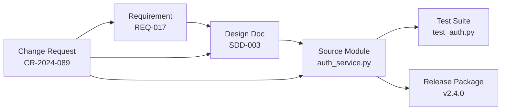
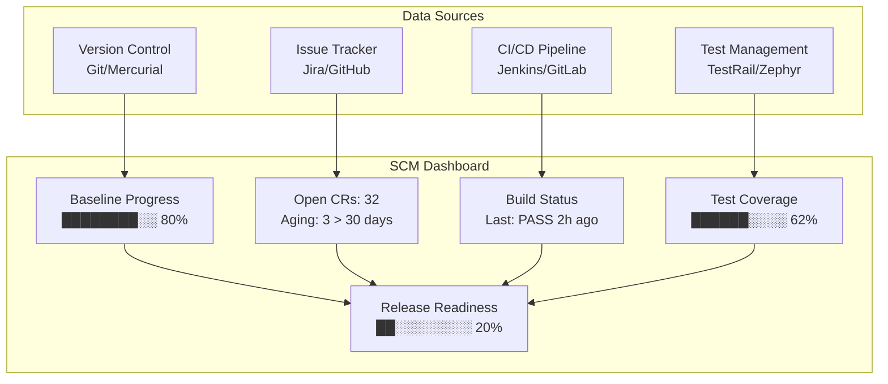
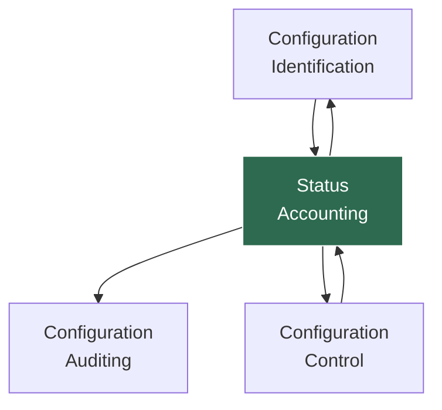

# Configuration Status Accounting (CSA)

Configuration Status Accounting (CSA) is the recording and reporting of information needed to manage a configuration effectively, including a listing of all approved configuration identification and status of proposed changes to the configuration. SWEBOK v4 identifies CSA as one of the core SCM activities (KA 8.4), providing the visibility layer that makes [[01_Master_Repository_Pattern|repository]], [[02_Mainline_Pattern|mainline]], and [[03_Active_Development_Line|active development]] practices auditable.

> **Key Idea:** CSA transforms raw CI data into actionable status information, enabling managers, engineers, and auditors to understand *what* was built, *when*, and *why*.

---

## Purpose and Scope

CSA serves as the **nervous system** of SCM. While [[04_Private_Version_Control|version control]] captures changes and [[05_Task_Level_Commit|commits]] record intent, CSA aggregates, correlates, and presents this data in forms suitable for decision-making and compliance.

### Core Objectives

| Objective | Description |
|-----------|-------------|
| **Traceability** | Link every CI to its governing specification, change request, and test result |
| **Visibility** | Provide real-time and historical views of configuration state |
| **Accountability** | Record who approved what, when, and under which authority |
| **Compliance Evidence** | Generate artifacts required by regulatory or contractual obligations |
| **Trend Analysis** | Identify patterns in change traffic, defect density, and backlog growth |

---

## CSA Data Model

CSA maintains a structured record of every Configuration Item (CI) across its lifecycle. The data model typically includes:

### CI Record Fields

```
┌─────────────────────────────────────────────────────┐
│                  CI Record                           │
├─────────────────┬───────────────────────────────────┤
│ CI Identifier   │ Unique ID (e.g., SCM-0042)       │
│ CI Name         │ Human-readable name               │
│ Version         │ Current version identifier        │
│ Status          │ Draft / Baselined / Released / EOL│
│ Owner           │ Responsible individual/team       │
│ Baseline        │ Baseline(s) containing this CI    │
│ Related CRs     │ Change Requests that modified CI  │
│ Dependencies    │ CIs this one depends on           │
│ Last Modified   │ Timestamp of most recent change   │
│ Approval Record │ Chain of approvals with dates     │
└─────────────────┴───────────────────────────────────┘
```

### Relationship Tracking



CSA must capture these bidirectional relationships so that impact analysis can answer: *if requirement REQ-017 changes, which design docs, source files, tests, and releases are affected?*

---

## Change Traffic Metrics

One of CSA's most valuable outputs is the measurement of change activity over time. These metrics inform release readiness, process improvement, and risk assessment.

### Core Change Metrics

| Metric | Formula | Interpretation |
|--------|---------|----------------|
| **Change Request Rate** | CRs opened per week/sprint | Indicates stability or churn |
| **Change Closure Rate** | CRs closed per week/sprint | Throughput of the change process |
| **Backlog Size** | Open CRs at point in time | Accumulated unresolved work |
| **CR Aging** | Days since CR opened, by status | Identifies stalled requests |
| **First-Pass Resolution %** | CRs resolved without rework / total | Process effectiveness |
| **Change Density** | CRs per KLOC or per CI | Concentration of change activity |
| **Defect-to-Change Ratio** | Defect CRs / Enhancement CRs | Product maturity indicator |

### Trend Visualization

```
Change Requests Over Time (Sprint View)
    40│
    35│          ╭──╮
    30│      ╭──╮│  │╭──╮
    25│  ╭──╮│  ││  ││  │╭──╮
    20│  │  ││  ││  ││  ││  │
    15│──╯  ╰╯  ╰╯  ╰╯  ╰╯  ╰──   ← Opened
    10│
     5│──────╮        ╭─────────   ← Closed
     0│      ╰────────╯
      └──┬──┬──┬──┬──┬──┬──┬──
        S1 S2 S3 S4 S5 S6 S7 S8

    Legend: Upper = Opened, Lower = Closed
    Gap indicates backlog growth
```

### Aging Analysis Table

| CR Status | 0-7 days | 8-14 days | 15-30 days | 31+ days | Total |
|-----------|----------|-----------|------------|----------|-------|
| New | 5 | 2 | 1 | 0 | 8 |
| Under Evaluation | 3 | 4 | 2 | 1 | 10 |
| Approved | 2 | 1 | 0 | 0 | 3 |
| In Implementation | 1 | 3 | 5 | 2 | 11 |
| **Total** | **11** | **10** | **8** | **3** | **32** |

Red flags: CRs older than 30 days in "Under Evaluation" or "In Implementation" may indicate process bottlenecks.

---

## Implementation Status Reporting

CSA produces regular status reports that aggregate CI state, change activity, and baseline progression.

### Report Types

1. **Baseline Status Report** -- Lists all baselines, their contents, and current status
2. **Change Status Report** -- Summarizes open, closed, and deferred CRs
3. **Configuration Audit Readiness Report** -- Identifies gaps before [[08_Configuration_Auditing|FCA/PCA audits]]
4. **Release Configuration Report** -- Details the exact CI versions included in a release
5. **Trend Report** -- Shows metric trajectories over multiple reporting periods

### Baseline Status Example

| Baseline ID | Date | CIs | Version | Status | Open CRs Against |
|-------------|------|-----|---------|--------|-----------------|
| BL-2024-001 | 2024-01-15 | 42 | 1.0 | Released | 0 |
| BL-2024-002 | 2024-03-20 | 45 | 1.1 | Released | 2 (deferred) |
| BL-2024-003 | 2024-06-10 | 48 | 2.0-rc1 | In Test | 12 |
| BL-2024-004 | 2024-07-01 | 48 | 2.0-rc2 | In Test | 5 |

---

## Governance and Compliance Evidence

In regulated industries (aerospace, medical devices, automotive), CSA is not optional -- it is a contractual and regulatory requirement.

### Compliance Frameworks and CSA Requirements

| Framework | CSA Requirement |
|-----------|----------------|
| **DO-178C** (Avionics) | Full traceability from requirements to object code; configuration index maintained |
| **IEC 62304** (Medical) | Software configuration items identified and tracked; change records maintained |
| **ISO 26262** (Automotive) | Configuration management plan documented; status of CIs tracked |
| **CMMI** | CM practices at ML2; measurement and analysis at ML4 |
| **ISO 9001:2015** | Documented information controlled; changes identified and traceable |

### Evidence Artifacts

CSA must produce and maintain these artifacts for audit readiness:

- **Configuration Identification List (CIL)** -- Complete inventory of CIs
- **Baseline Records** -- Snapshot of each baseline with approval signatures
- **Change Request Log** -- Complete history of all CRs with dispositions
- **Approval Records** -- Evidence of authorized approvals for each change
- **Status Accounting Reports** -- Periodic summaries of configuration state
- **Traceability Matrix** -- Requirements-to-implementation-to-test mapping
- **Deviation and Waiver Records** -- See [[09_Change_Control_and_Compliance|change control governance]]

---

## Dashboards for SCM Visibility

Modern CSA leverages dashboards to provide real-time visibility into configuration state.

### Dashboard Components



### Key Dashboard Widgets

| Widget | Data Source | Refresh Rate | Purpose |
|--------|------------|--------------|---------|
| Baseline Burnup | CSA database | Daily | Track baseline progression toward release |
| CR Velocity Chart | Issue tracker | Per sprint | Measure change throughput |
| Aging Heatmap | CSA database | Daily | Highlight stalled CRs |
| Build Pipeline Status | CI server | Real-time | Show last N build results |
| Dependency Graph | Repository + CSA | On change | Visualize CI relationships |
| Traceability Coverage | Requirements tool | Weekly | Show coverage gaps |

---

## SCSA in Agile and DevOps Contexts

Traditional CSA was designed for heavyweight, document-centric processes. Agile and DevOps demand a leaner, automation-first approach.

### Agile Adaptations

| Traditional CSA | Agile CSA |
|----------------|-----------|
| Manual status reports | Automated dashboards |
| Formal baseline documents | Git tags + release notes |
| Paper-based CR logs | Issue tracker workflows |
| Quarterly status reviews | Sprint retrospectives |
| Configuration audits at milestones | Continuous compliance checks |

### DevOps Integration

In DevOps environments, CSA is embedded into the CI/CD pipeline:

1. **Commit-time**: Automatic CI record updates, traceability links from commit messages to issues
2. **Build-time**: SBOM generation, dependency tracking, build metadata capture
3. **Test-time**: Test result aggregation, coverage reporting, quality gate evaluation
4. **Deploy-time**: Deployment manifest recording, environment state tracking
5. **Monitor-time**: Production configuration drift detection, runtime version verification

### Automation Examples

```yaml
# GitLab CI: Automated CSA artifact generation
csa_report:
  stage: report
  script:
    - generate_sbom --format spdx-json --output sbom.json
    - traceability_check --requirements requirements.csv --commits git log
    - cr_status_export --jira-project PROJ --output cr_report.csv
    - baseline_snapshot --tag $CI_COMMIT_TAG --output baseline.json
  artifacts:
    paths: [sbom.json, cr_report.csv, baseline.json]
    reports:
      dependency_scanning: sbom.json
```

### Lean SCSA Practices

- **Commit-message conventions** -- Enforce `CR-1234: description` format for automatic traceability
- **Git tags as baselines** -- Semantic version tags replace formal baseline documents
- **PR templates** -- Pull request forms capture CR ID, impact analysis, testing evidence
- **Automated traceability** -- Tools like Azure DevOps or Jira auto-link requirements, code, tests
- **Continuous compliance** -- Policy-as-code tools (OPA, Checkov) enforce configuration rules in pipelines

---

## CSA Tooling

| Tool Category | Examples | CSA Function |
|--------------|----------|--------------|
| **ALM Platforms** | Jira, Azure DevOps, IBM DOORS | CR tracking, traceability, reporting |
| **Version Control** | Git, Subversion, Perforce | CI identification, change history |
| **CI/CD** | Jenkins, GitLab CI, GitHub Actions | Build status, deployment records |
| **SCM-specific** | IBM ClearCase, PTC Integrity | Full lifecycle CSA for regulated environments |
| **SBOM Tools** | Syft, CycloneDX, SPDX tools | Dependency tracking, license compliance |
| **Dashboards** | Grafana, Power BI, custom DORA dashboards | Visualization, trend analysis |

---

## Relationship to Other SCM Activities



- **Identification** provides the CIs and baselines that CSA tracks
- **Control** generates the change records that CSA aggregates
- **Auditing** consumes CSA reports to verify configuration integrity
- See [[08_Configuration_Auditing]] and [[09_Change_Control_and_Compliance]] for the downstream activities

---

## Summary

| Aspect | Key Takeaway |
|--------|-------------|
| **What** | Recording and reporting CI status, baselines, and change activity |
| **Why** | Enables informed decision-making, audit readiness, and process improvement |
| **How** | Automated data collection, structured reports, dashboard visualization |
| **When** | Continuously; formal reports at milestones and sprint boundaries |
| **Who** | SCM team produces; managers, engineers, auditors consume |
| **Agile** | Lean, automated, integrated into CI/CD pipelines |

---

## Related Notes

- [[01_Master_Repository_Pattern]] -- Single source of truth for CIs
- [[02_Mainline_Pattern]] -- Mainline as baseline enabler
- [[03_Active_Development_Line]] -- Development activity tracked by CSA
- [[04_Private_Version_Control]] -- Developer-level change recording
- [[05_Task_Level_Commit]] -- Commit-level traceability
- [[08_Configuration_Auditing]] -- FCA/PCA consume CSA outputs
- [[09_Change_Control_and_Compliance]] -- CCB and CR workflows generate CSA data
- Version Control/ -- Tools and practices for CI management
