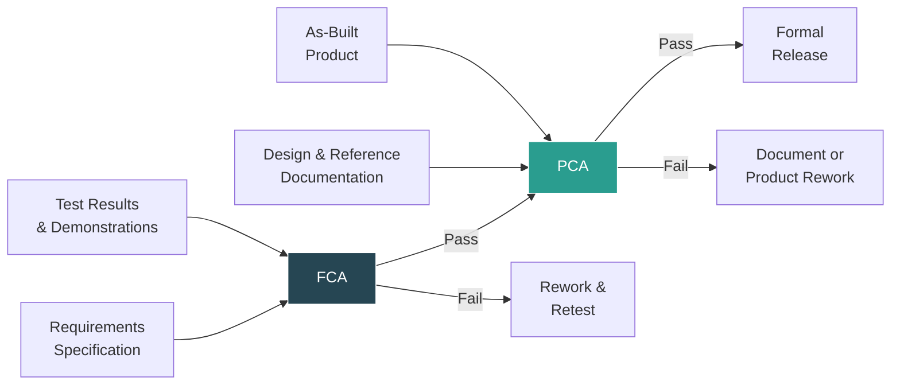
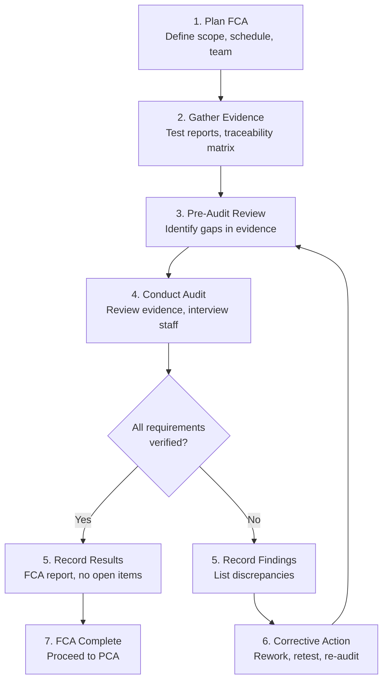
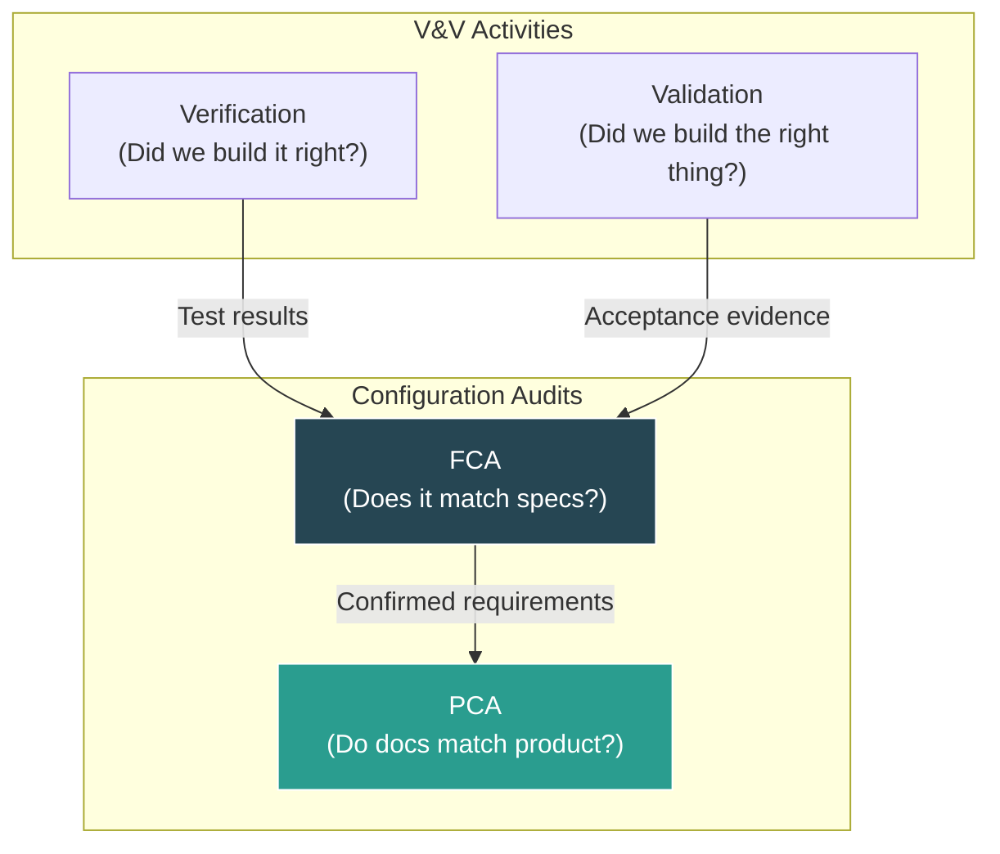
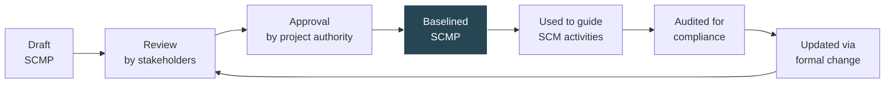
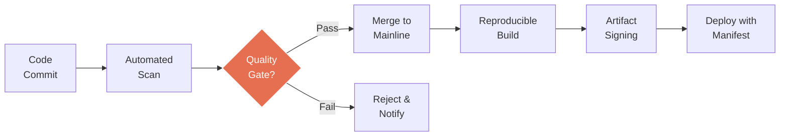

# Configuration Auditing

Configuration auditing verifies that the software product and its supporting documentation are consistent, complete, and correct. SWEBOK v4 (KA 8.5) defines two primary audit types: **Functional Configuration Audit (FCA)** and **Physical Configuration Audit (PCA)**, supplemented by in-process audits that provide continuous assurance throughout development. These audits are the formal gates that confirm the SCM processes described in [[07_SCSA_and_Status_Accounting|Status Accounting]] and [[09_Change_Control_and_Compliance|Change Control]] are actually working.

> **Key Idea:** FCA answers "does it do what the spec says?" while PCA answers "does the documentation match what was actually built?"

---

## Audit Types Overview

| Audit | Question Answered | Compares | Timing |
|-------|-------------------|----------|--------|
| **FCA** | Does the software item perform as specified? | Functional requirements vs. tested behavior | After testing complete, before release |
| **PCA** | Does the documentation match the as-built product? | Design/reference docs vs. actual deliverables | After FCA, before formal release |
| **In-Process Audit** | Are SCM processes being followed? | Process plan vs. actual practice | Continuous, at milestones |



---

## Functional Configuration Audit (FCA)

### Purpose

FCA verifies that the software configuration item (CI) satisfies its functional and performance requirements as defined in the governing specification (e.g., Software Requirements Specification, Interface Requirements Document).

### What FCA Examines

1. **Requirements Coverage** -- Every requirement in the specification has corresponding test evidence
2. **Test Execution Records** -- Tests were actually run, not just planned
3. **Test Results** -- All tests passed, or deviations are documented with approved waivers
4. **Performance Criteria** -- Non-functional requirements (latency, throughput, reliability) are met
5. **Interface Compliance** -- External and internal interfaces match their specifications
6. **Anomaly Resolution** -- All known defects have been dispositioned (fixed, deferred with approval, or waived)

### FCA Checklist

| # | Item | Evidence Required | Status |
|---|------|-------------------|--------|
| 1 | All functional requirements traced to tests | Traceability matrix | ☐ |
| 2 | All tests executed | Test execution logs | ☐ |
| 3 | All tests passed or deviation approved | Test reports + waiver records | ☐ |
| 4 | Performance requirements verified | Performance test results | ☐ |
| 5 | Interface specifications verified | Interface test results | ☐ |
| 6 | Known anomalies dispositioned | Defect records with closure status | ☐ |
| 7 | Regression testing performed | Regression test suite results | ☐ |
| 8 | User documentation reviewed | User manual draft + review records | ☐ |

### FCA Procedure



### FCA Entry Criteria

Before an FCA can be conducted, the following must be in place:

- All planned testing for the CI is complete
- Test procedures and results are documented and available
- The traceability matrix is current and complete
- All change requests affecting the CI have been dispositioned
- The [[07_SCSA_and_Status_Accounting|CSA]] database reflects the current state of all CIs

---

## Physical Configuration Audit (PCA)

### Purpose

PCA verifies that the design and reference documentation is consistent with the as-built software product. Where FCA validates *behavior*, PCA validates *documentation fidelity*.

### What PCA Examines

1. **Document-to-Product Consistency** -- Design documents accurately describe the as-built software
2. **Version Consistency** -- All deliverable components are at the correct, approved version
3. **Completeness** -- All required deliverables are present (source code, binaries, docs, data)
4. **Baseline Integrity** -- The product matches its approved baseline
5. **Build Reproducibility** -- The product can be rebuilt from source using documented procedures
6. **Labeling and Packaging** -- Media, containers, and labels match specifications

### PCA Checklist

| # | Item | Evidence Required | Status |
|---|------|-------------------|--------|
| 1 | Source code matches design docs | Code review + design comparison | ☐ |
| 2 | All CIs at correct version | Version list + build manifest | ☐ |
| 3 | All required deliverables present | Delivery checklist | ☐ |
| 4 | Product matches baseline | Baseline comparison report | ☐ |
| 5 | Build is reproducible | Clean build from source + build log | ☐ |
| 6 | Documentation is current | Document version vs. product version | ☐ |
| 7 | Media/labeling correct | Physical inspection records | ☐ |
| 8 | Installation procedures verified | Installation test results | ☐ |

### PCA vs. FCA Comparison

| Dimension | FCA | PCA |
|-----------|-----|-----|
| **Focus** | Functional behavior | Physical documentation |
| **Compares** | Requirements vs. test results | Documents vs. as-built product |
| **Answers** | "Does it work right?" | "Is it documented right?" |
| **Primary Evidence** | Test reports, demos | Source code, design docs, build records |
| **Typical Finding** | Missing test coverage | Outdated design document |
| **Corrective Action** | Retest or fix code | Update documentation or rebuild |

---

## In-Process Audits

In-process audits are less formal than FCA/PCA but provide continuous assurance that SCM processes are being followed during development. They catch problems early rather than waiting for milestone audits.

### Types of In-Process Audits

| Audit Type | Frequency | Focus |
|------------|-----------|-------|
| **Code Review Audit** | Per PR/MR | Code changes follow standards, linked to CRs |
| **Build Audit** | Per build | Build reproducibility, dependency integrity |
| **Baseline Audit** | Per baseline | Baseline contents match plan, approvals present |
| **Process Compliance Audit** | Quarterly | SCM plan adherence, tool usage, training |
| **Supplier Audit** | Per milestone | Third-party component compliance, license tracking |

### In-Process Audit Integration with CI/CD

```yaml
# Pipeline-embedded in-process audits
stages:
  - build:
      - verify_source_integrity    # Check hashes match expected
      - reproducible_build_test    # Build twice, compare outputs
  - test:
      - traceability_check         # All CRs linked to tests
      - coverage_gate              # Minimum coverage threshold
  - release:
      - sbom_generation            # Generate software bill of materials
      - license_compliance_scan    # Check all dependencies
      - artifact_signing           # Cryptographic integrity
```

These automated checks function as continuous in-process audits, enforcing the same principles as formal audits but at development speed. See [[09_Change_Control_and_Compliance]] for SBOM and integrity details.

---

## Relationship Between FCA/PCA and V&V

Configuration auditing and Verification & Validation (V&V) are complementary but distinct activities:

### Distinction

| Aspect | V&V | Configuration Audit |
|--------|-----|-------------------|
| **Question** | Is the product correct and useful? | Is the configuration consistent and complete? |
| **Scope** | Product quality | Process and documentation integrity |
| **Authority** | V&V team (independent) | SCM authority / quality assurance |
| **Output** | V&V report with findings | Audit report with pass/fail/discrepancies |
| **Timing** | Throughout lifecycle | At defined milestones |

### Overlap and Synergy

- V&V test results are **input evidence** for FCA
- FCA **consumes** V&V outputs but adds the traceability and completeness verification that V&V alone does not provide
- PCA complements V&V by ensuring the *documented* product matches the *tested* product
- Both depend on [[07_SCSA_and_Status_Accounting|CSA]] for current, accurate configuration data



---

## Audit Planning, Execution, and Reporting

### Audit Planning

A well-planned audit includes:

1. **Scope Definition** -- Which CIs, baselines, and time period are covered
2. **Entry Criteria** -- What must be true before the audit begins
3. **Team Composition** -- Auditors, technical SMEs, SCM representatives
4. **Schedule** -- Duration, key dates, resource allocation
5. **Checklist Preparation** -- Tailored to the audit type and project context
6. **Evidence Collection Plan** -- What artifacts are needed and where to find them
7. **Exit Criteria** -- What constitutes audit completion

### Audit Execution

| Phase | Activities |
|-------|-----------|
| **Opening Meeting** | Confirm scope, team, schedule, ground rules |
| **Evidence Review** | Examine documents, test records, traceability data |
| **Interviews** | Clarify findings with responsible engineers/managers |
| **Observation** | Witness demonstrations, review tool configurations |
| **Finding Classification** | Categorize as Major, Minor, or Observation |
| **Closing Meeting** | Present findings, agree on corrective actions |

### Finding Classification

| Severity | Definition | Example | Resolution |
|----------|-----------|---------|------------|
| **Major** | Nonconformance that affects product integrity or safety | Missing test for critical requirement | Must fix before release |
| **Minor** | Nonconformance that does not affect product integrity | Formatting inconsistency in SDD | Fix within agreed timeframe |
| **Observation** | Improvement opportunity, not a nonconformance | Traceability tool underutilized | Address in process improvement |

### Audit Report Structure

```
1. Executive Summary
   - Audit type, scope, date, team
   - Overall result: PASS / CONDITIONAL PASS / FAIL
   - Number of findings by severity

2. Scope and Methodology
   - CIs audited
   - Standards and procedures referenced
   - Evidence reviewed

3. Findings
   - Finding ID, severity, description, evidence
   - For each finding: root cause, corrective action, responsible party, due date

4. Recommendations
   - Process improvements
   - Tool enhancements
   - Training needs

5. Appendices
   - Detailed evidence listings
   - Checklists with completion status
   - Traceability matrix excerpts
```

---

## Deviations vs. Waivers

Configuration audits often uncover nonconformances. How these are handled depends on their timing relative to the governing specification.

### Definitions

| Term | Definition | Timing | Authority |
|------|-----------|--------|-----------|
| **Deviation** | A *pre-approved* departure from a specified requirement, granted *before* the item is built or tested | Before implementation | CCB or designated authority |
| **Waiver** | A *post-discovery* acceptance of a nonconformance, granted *after* the item fails to meet its specification | After nonconformance found | CCB or designated authority |

### Key Distinction

```
Timeline of a Nonconformance:

    ──────────────────────────────────────────────────►
    Specification      Deviation        Waiver
    Written            (pre-approved    (post-discovery
                       departure)       acceptance)
    │                  │                │
    ▼                  ▼                ▼
    "We know this     "We approve      "We accept this
     requirement       departing from   nonconformance
     may not be        req X before     in req Y because
     fully met"        building"        fixing is not
                                        practical"
```

### Deviation Process

1. During design or planning, the team identifies a requirement that cannot or will not be met
2. A Deviation Request is submitted with:
   - Requirement identifier
   - Reason for deviation
   - Risk assessment
   - Proposed alternative (if any)
3. CCB reviews and approves, defers, or rejects
4. Approved deviation is recorded in [[07_SCSA_and_Status_Accounting|CSA]] and linked to the CI
5. The deviation remains valid for the specified scope (version, time period, or usage conditions)

### Waiver Process

1. During testing or audit, a nonconformance is discovered
2. A Waiver Request is submitted with:
   - Nonconformance description
   - Root cause analysis
   - Impact assessment (safety, performance, usability)
   - Corrective action plan (if applicable) or justification for acceptance
3. CCB reviews and approves, defers, or rejects
4. Approved waiver is recorded in CSA with expiration date (if applicable)
5. Waiver may trigger a CR for future correction

### Decision Matrix

| Factor | Grant Deviation/Waiver | Reject (Require Fix) |
|--------|----------------------|---------------------|
| Safety impact | None or mitigated | Direct safety risk |
| Cost to fix | Prohibitive relative to benefit | Reasonable |
| Schedule impact | Unacceptable delay | Manageable |
| Customer acceptance | Customer informed and agrees | Customer requires compliance |
| Regulatory | Allowed by regulation | Required by regulation |

---

## SCM Plan (SCMP) Structure and Lifecycle

The Software Configuration Management Plan (SCMP) is the governing document for all SCM activities. Audits verify compliance against the SCMP.

### SCMP Structure (IEEE 828)

| Section | Content |
|---------|---------|
| **1. Introduction** | Scope, objectives, applicability, references |
| **2. Referenced Documents** | Standards, plans, procedures referenced |
| **3. Management** | Organization, authority, responsibilities, SCM coordination |
| **4. Activities** | Identification, control, status accounting, auditing procedures |
| **5. Schedules** | Milestones, audit schedule, reporting cadence |
| **6. Resources** | Tools, infrastructure, training, staffing |
| **7. Subcontractor/Vendor SCM** | Requirements for external suppliers |
| **8. Records** | What records are maintained, retention periods |
| **9. SCMP Maintenance** | How the plan itself is updated and approved |

### SCMP Lifecycle



### SCMP and Audits

- FCA and PCA checklists are derived from SCMP requirements
- In-process audits verify day-to-day adherence to SCMP procedures
- Audit findings may trigger SCMP updates (via the change process)
- The SCMP itself is a configuration item subject to change control

---

## Audit in Agile and DevOps

Traditional audits are heavyweight milestone events. Agile and DevOps require a shift toward continuous, lightweight auditing.

### Agile Audit Practices

| Traditional | Agile Equivalent |
|-------------|-----------------|
| Formal FCA at release | Automated acceptance test suites run every sprint |
| Formal PCA at delivery | CI/CD pipeline with artifact integrity checks |
| Quarterly process audit | Sprint retrospectives with SCM health checks |
| Paper-based evidence | Automated traceability from commit to requirement |
| Manual baseline verification | Git tags + reproducible builds |

### Continuous Compliance



This pipeline embodies continuous auditing: every commit triggers integrity checks, every build is reproducible, every artifact is signed, every deployment is manifest-tracked.

---

## Summary

| Aspect | Key Takeaway |
|--------|-------------|
| **FCA** | Verifies functional requirements are met through test evidence |
| **PCA** | Verifies documentation matches the as-built product |
| **In-Process** | Continuous assurance through automated pipeline checks |
| **V&V Relationship** | Audits consume V&V outputs but add traceability verification |
| **Deviations vs Waivers** | Pre-approved departure vs. post-discovery acceptance |
| **SCMP** | Governing document; audits verify compliance against it |
| **Agile/DevOps** | Shift from milestone audits to continuous automated compliance |

---

## Related Notes

- [[01_Master_Repository_Pattern]] -- Single source of truth audited for integrity
- [[02_Mainline_Pattern]] -- Mainline baselines are audit subjects
- [[03_Active_Development_Line]] -- Development branches audited before merge
- [[04_Private_Version_Control]] -- Developer workspaces contribute to audit evidence
- [[05_Task_Level_Commit]] -- Commit-level traceability supports FCA
- [[07_SCSA_and_Status_Accounting]] -- CSA provides audit data and reports
- [[09_Change_Control_and_Compliance]] -- CCB approves deviations and waivers
- Version Control/ -- Tools supporting audit evidence collection
