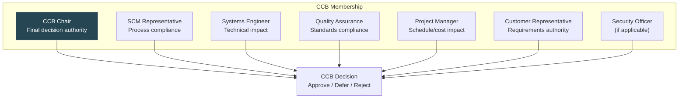
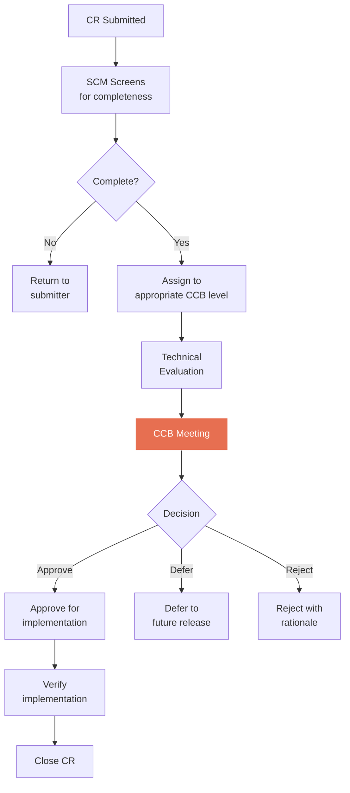
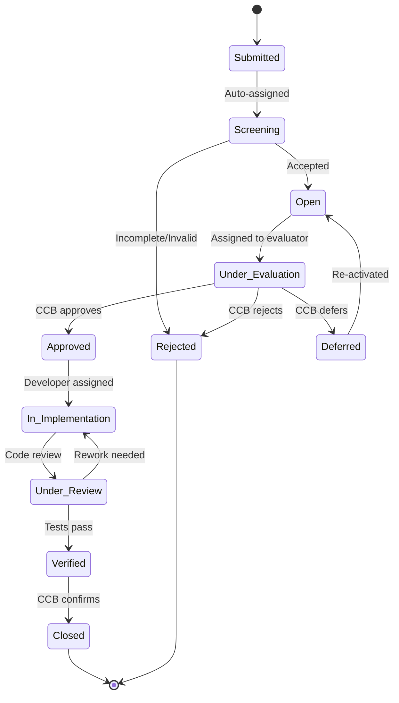
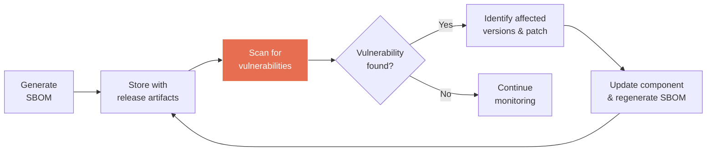
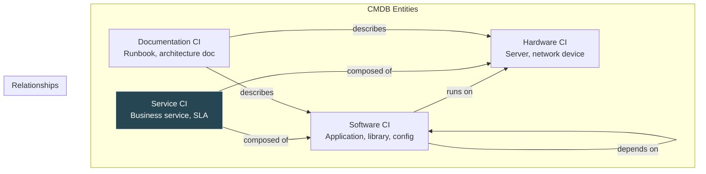
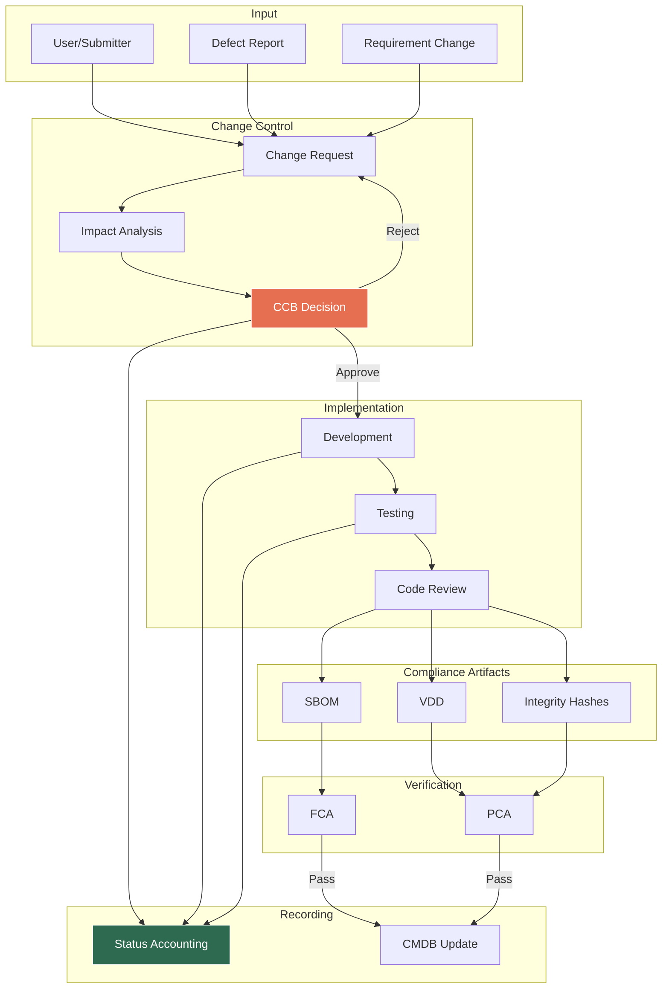

# Change Control and Compliance

Change control is the systematic process of evaluating, approving, and implementing changes to configuration items. SWEBOK v4 (KA 8.3, 8.6-8.7) covers the Configuration Control Board (CCB), Change Request (CR) workflows, and the compliance artifacts (SBOM, VDD, CMDB) that ensure configuration integrity. This note connects the governance machinery of change control to the [[07_SCSA_and_Status_Accounting|status accounting]] that records it and the [[08_Configuration_Auditing|audits]] that verify it.

> **Key Idea:** Change control ensures that every modification to a baseline is evaluated for impact, approved by the right authority, implemented correctly, and verified before closure.

---

## Configuration Control Board (CCB)

### Role and Authority

The CCB is the organizational body with authority to approve or reject changes to baselined configuration items. It is the **decision-making gate** in the change control process.

| Attribute | Description |
|-----------|-------------|
| **Purpose** | Evaluate and disposition change requests against baselined CIs |
| **Authority** | Approve, defer, or reject CRs; grant deviations and waivers |
| **Scope** | All baselined CIs under its jurisdiction |
| **Accountability** | Ensures changes are technically sound, risk-assessed, and properly documented |

### CCB Structure



### CCB Levels by Criticality

Not all changes require the same level of authority. Organizations typically establish multiple CCB levels:

| Level | Scope | Authority | Frequency |
|-------|-------|-----------|-----------|
| **Level 1: Executive CCB** | Architecture changes, major feature additions/removals, safety-critical modifications | Program/senior management | Monthly or ad hoc |
| **Level 2: Project CCB** | Requirement changes, interface modifications, significant design changes | Project manager + senior engineers | Weekly or biweekly |
| **Level 3: Engineering CCB** | Implementation changes, minor bug fixes, developer tool updates | Lead engineer + SCM rep | Daily or as needed |
| **Level 4: Developer Authority** | Cosmetic fixes, comments, formatting (within pre-approved scope) | Individual developer (pre-authorized) | Per commit |

### CCB Decision Process



### CCB Meeting Best Practices

- **Agenda prepared in advance** with all CRs to be reviewed
- **Quorum defined** (e.g., chair + 2 of 4 core members)
- **Minutes recorded** with decisions, rationale, and action items
- **Action items tracked** with owners and due dates
- **Decision records** stored in CSA for audit trail

---

## Change Request (CR) Workflow

### CR Lifecycle

Every CR follows a formal lifecycle from submission through closure. The specific states may vary by organization, but the standard flow is:



### CR Data Model

| Field | Description | Example |
|-------|-------------|---------|
| **CR ID** | Unique identifier | CR-2024-0142 |
| **Title** | Brief description | "Add SSO support to admin portal" |
| **Submitter** | Who raised the request | jsmith@company.com |
| **Date Submitted** | When the CR was created | 2024-06-15 |
| **Priority** | Urgency level | Critical / High / Medium / Low |
| **Category** | Type of change | Enhancement / Defect / Security / Regulatory |
| **Affected CIs** | Configuration items impacted | admin-portal, auth-service, SDD-003 |
| **Affected Baselines** | Baselines containing impacted CIs | BL-2024-003 |
| **Description** | Detailed change description | Full text with rationale |
| **Impact Analysis** | Technical, schedule, cost impact | See impact template |
| **Status** | Current lifecycle state | Under Evaluation |
| **Disposition** | CCB decision | Approved / Deferred / Rejected |
| **Assigned To** | Implementer | dev-team-alpha |
| **Target Release** | Planned release | v2.1.0 |
| **Verification** | How the change will be tested | Unit + integration + regression |
| **Closure Date** | When the CR was closed | 2024-07-20 |

### Impact Analysis Template

Every CR evaluated by the CCB should include an impact analysis:

```
┌─────────────────────────────────────────────────────┐
│              IMPACT ANALYSIS                         │
├─────────────────────────────────────────────────────┤
│ CR ID: CR-2024-0142                                 │
│                                                     │
│ TECHNICAL IMPACT                                    │
│   Affected modules: auth-service, admin-portal      │
│   Interface changes: OAuth2 redirect URI added      │
│   Data model changes: user_sessions table modified  │
│   Risk: Medium (new auth flow, existing tests)      │
│                                                     │
│ SCHEDULE IMPACT                                     │
│   Estimated effort: 5 developer-days                │
│   Dependencies: OAuth provider API available        │
│   Critical path: No                                 │
│                                                     │
│ COST IMPACT                                         │
│   Development cost: $X                              │
│   Testing cost: $Y                                  │
│   No new hardware/licenses required                 │
│                                                     │
│ QUALITY IMPACT                                      │
│   Test cases to add: 12                             │
│   Regression scope: Full auth module                │
│   Security review required: Yes                     │
│                                                     │
│ DOCUMENTATION IMPACT                                │
│   SRS update: Yes (new requirement REQ-089)         │
│   SDD update: Yes (new auth flow diagram)           │
│   User manual update: Yes (login instructions)      │
│   API docs update: Yes (new OAuth2 endpoints)       │
└─────────────────────────────────────────────────────┘
```

### CR Workflow in Agile Contexts

Agile teams adapt the formal CR workflow to fit sprint cadences:

| Formal Process | Agile Adaptation |
|---------------|-----------------|
| Formal CR submission | Issue in backlog (Jira, GitHub Issue) |
| CCB evaluation | Backlog refinement / sprint planning |
| CCB approval | Sprint commitment |
| Implementation | Sprint development |
| Verification | Sprint testing / acceptance criteria |
| Closure | Sprint review / issue closure |

Key principle: the *rigor* of the change control process should match the *risk* of the change, not the methodology label.

---

## Software Bill of Materials (SBOM)

### Definition

An SBOM is a formal, structured list of all components, libraries, and dependencies that make up a software product. It is the "ingredient list" for software, analogous to a materials list in manufacturing.

### Why SBOMs Matter

| Driver | SBOM Role |
|--------|-----------|
| **Security** | Rapidly identify if a vulnerable component (e.g., Log4Shell) affects your product |
| **License Compliance** | Track open-source licenses across all dependencies |
| **Regulatory** | US Executive Order 14028 (2021) requires SBOMs for government software |
| **Supply Chain** | Understand transitive dependency risks |
| **Auditing** | Provide configuration evidence for [[08_Configuration_Auditing|PCA]] |

### SBOM Formats

| Format | Maintainer | Key Features |
|--------|-----------|--------------|
| **SPDX** (Software Package Data Exchange) | Linux Foundation | ISO standard (ISO/IEC 5962:2021), license focus |
| **CycloneDX** | OWASP | Security-focused, VEX integration, lightweight |
| **SWID Tags** | ISO/IEC 19770-2 | Software identification, used in asset management |

### SBOM Content

An SBOM typically includes:

| Field | Description |
|-------|-------------|
| **Component Name** | Name of the library/package |
| **Version** | Specific version identifier |
| **Supplier** | Who provides the component |
| **License** | Open-source or commercial license |
| **Hash** | Cryptographic hash for integrity verification |
| **Dependencies** | Sub-components (transitive dependencies) |
| **Known Vulnerabilities** | CVE IDs associated with this version |
| **Relationship** | How this component relates to the parent (dependency, dev-only, etc.) |

### SBOM Generation Example

```bash
# Using Syft to generate SBOM in SPDX format
syft dir:/path/to/project -o spdx-json > sbom.spdx.json

# Using CycloneDX for npm project
cyclonedx-npm --output-file sbom.cdx.json

# Using Trivy for container image
trivy image --format cyclonedx --output sbom.cdx.json myapp:latest
```

### SBOM Lifecycle



### SBOM in SCM Context

The SBOM is itself a CI subject to [[09_Change_Control_and_Compliance|change control]]:

- Generated as part of the build pipeline (see [[07_SCSA_and_Status_Accounting|CSA in DevOps]])
- Baselined with each release
- Audited during [[08_Configuration_Auditing|PCA]] to verify component inventory
- Updated via CR when dependencies change

---

## Version Description Document (VDD)

### Purpose

The VDD formally describes a specific version or release of a software product. It is the definitive "what's in this release" document, typically required in government and defense contracts.

### VDD Structure

| Section | Content |
|---------|---------|
| **1. Scope** | What this document covers; version/release identifier |
| **2. Applicable Documents** | Referenced specifications, standards, and plans |
| **3. Version Description** | |
| 3.1 Configuration Items | List of all CIs in this version with identifiers and versions |
| 3.2 Baseline Description | Which baseline this version corresponds to |
| 3.3 Changes from Prior Version | Summary of CRs implemented since last release |
| 3.4 Known Problems | Known defects, deviations, and waivers |
| 3.5 Build Information | Compiler version, build environment, build date |
| **4. Installation** | How to install/deploy this version |
| **5. References** | Links to related documentation |
| **6. Notes** | Special instructions, limitations, environmental requirements |

### VDD Example Outline

```
VERSION DESCRIPTION DOCUMENT
Version 2.1.0 (BL-2024-005)
Date: 2024-08-01

3.1 Configuration Items:
┌──────────────┬───────────┬────────────────────────────┐
│ CI ID        │ Version   │ Description                │
├──────────────┼───────────┼────────────────────────────┤
│ admin-portal │ 2.1.0     │ Admin web application      │
│ auth-service │ 1.4.2     │ Authentication microservice│
│ api-gateway  │ 3.0.1     │ API gateway service        │
│ user-manual  │ 2.1.0     │ End-user documentation     │
│ SDD          │ 2.1.0     │ Software Design Document   │
│ test-suite   │ 2.1.0     │ Automated test suite       │
└──────────────┴───────────┴────────────────────────────┘

3.3 Changes from v2.0.0:
- CR-2024-0142: Added SSO support
- CR-2024-0156: Fixed session timeout bug
- CR-2024-0163: Updated API rate limiting

3.4 Known Problems:
- CR-2024-0171 (Deferred): CSV export truncates at 10K rows
  Waiver: W-2024-003, accepted 2024-07-28
```

### VDD Relationship to Other Artifacts

| Artifact | Relationship to VDD |
|----------|-------------------|
| **SBOM** | VDD references SBOM for component inventory |
| **Release Notes** | VDD is more formal; release notes are user-facing |
| **Baseline Record** | VDD describes the baseline contents in detail |
| **Build Manifest** | VDD includes or references build metadata |
| **Test Report** | VDD summarizes test status; full results in separate report |

---

## Configuration Management Database (CMDB)

### Definition

A CMDB is a repository of information about all significant entities in an IT environment (CIs), their attributes, and their relationships. While SCM focuses on *software* configuration, the CMDB provides the broader enterprise context.

### CMDB vs. SCM Repository

| Aspect | SCM Repository | CMDB |
|--------|---------------|------|
| **Scope** | Software CIs (code, docs, builds) | All IT assets (hardware, software, services, people) |
| **Primary Use** | Development and build management | IT operations and service management |
| **Lifecycle Focus** | Development through release | Deployment through decommission |
| **Framework** | SCM plan (IEEE 828) | ITIL / ISO 20000 |
| **Users** | Developers, SCM engineers | IT ops, service desk, change management |

### CMDB Concepts



### CMDB in Enterprise SCM

For large organizations, the CMDB bridges development-time SCM and operations-time configuration management:

1. **Development Phase**: SCM tools track source code, builds, and test artifacts
2. **Release Phase**: SBOM and VDD are generated and stored in CMDB
3. **Operations Phase**: CMDB tracks deployed instances, environments, and runtime configurations
4. **Change Phase**: CMDB provides impact analysis for proposed changes across the full stack

### CMDB Data Quality

| Dimension | Description | Metric |
|-----------|-------------|--------|
| **Completeness** | All CIs represented | % of known CIs in CMDB |
| **Accuracy** | Data matches reality | % of CIs verified in last audit |
| **Currency** | Data is up to date | Age of oldest unverified record |
| **Consistency** | No conflicting records | Duplicate/conflict count |

---

## Cryptographic Hashing for Integrity

### Purpose in SCM

Cryptographic hashes provide **integrity verification** for configuration items. A hash is a fixed-size digest computed from the CI content; any modification to the content changes the hash, enabling detection of tampering or corruption.

### Hash Algorithms in SCM Context

| Algorithm | Output Size | Status | SCM Use |
|-----------|------------|--------|---------|
| **SHA-256** | 256 bits | Recommended | CI integrity, artifact signing, SBOM hashes |
| **SHA-512** | 512 bits | Recommended | High-security environments |
| **SHA-1** | 160 bits | Deprecated (collisions found) | Git commit IDs (legacy); avoid for security |
| **MD5** | 128 bits | Broken (collisions found) | Checksums only, not security-sensitive |
| **SHA-3** | 224-512 bits | Modern alternative | Future-proof integrity verification |

### Hash Usage in Version Control

Git uses SHA-1 internally for commit and object identification:

```bash
# Every Git object has a SHA-1 hash
git cat-file -p HEAD
# commit a1b2c3d4e5f6...  (SHA-1 of commit object)

# Verify integrity of repository objects
git fsck --full
```

> **Note:** Git is migrating toward SHA-256. For security-critical applications, supplement Git's internal hashing with external SHA-256 checksums.

### Message Authentication Codes (MAC)

While hashes verify *integrity* (content unchanged), MACs verify *authenticity* (content came from the claimed sender):

| Mechanism | Verifies | Key Required | Use Case |
|-----------|----------|-------------|----------|
| **Hash (SHA-256)** | Integrity | No | Detect accidental corruption |
| **HMAC** | Integrity + Authenticity | Shared secret | Verify CI came from authorized source |
| **Digital Signature** | Integrity + Authenticity + Non-repudiation | Public/private key pair | Formal approval records, release signing |

### Integrity Verification in Practice

```bash
# Generate SHA-256 hash for a release artifact
sha256sum release-v2.1.0.tar.gz > release-v2.1.0.tar.gz.sha256

# Verify integrity on delivery
sha256sum -c release-v2.1.0.tar.gz.sha256
# Output: release-v2.1.0.tar.gz: OK

# Sign with GPG for authenticity
gpg --detach-sign --armor release-v2.1.0.tar.gz

# Verify signature
gpg --verify release-v2.1.0.tar.gz.asc release-v2.1.0.tar.gz
```

### Integrity in CI/CD Pipelines

```yaml
# Pipeline integrity chain
steps:
  - name: Build
    run: make build
  - name: Hash artifact
    run: sha256sum build/app > build/app.sha256
  - name: Sign artifact
    run: gpg --detach-sign build/app
  - name: Generate SBOM
    run: syft build/app -o spdx-json > build/sbom.spdx.json
  - name: Publish
    run: |
      # All artifacts travel together:
      # app, app.sha256, app.sig, sbom.spdx.json
      publish build/*
```

---

## Change Control Integration Model

The following diagram shows how all change control components work together:



---

## Practical Templates

### Change Request Form

```
CHANGE REQUEST FORM
═══════════════════════════════════════════════
CR ID:           _______________
Date Submitted:  _______________
Submitter:       _______________
Priority:        [ ] Critical  [ ] High  [ ] Medium  [ ] Low
Category:        [ ] Enhancement  [ ] Defect  [ ] Security  [ ] Regulatory  [ ] Other

Title:           _______________________________________________

Description:
_______________________________________________________________
_______________________________________________________________

Affected CIs:    _______________________________________________
Affected Baselines: ___________________________________________

Business Justification:
_______________________________________________________________

Impact Analysis:
  Technical: ___________________________________________________
  Schedule:  ___________________________________________________
  Cost:      ___________________________________________________
  Risk:      ___________________________________________________

Proposed Verification:
_______________________________________________________________

─── CCB USE ONLY ───────────────────────────────
Disposition:     [ ] Approved  [ ] Deferred  [ ] Rejected
CCB Level:       [ ] Executive  [ ] Project  [ ] Engineering
Decision Date:   _______________
Rationale:       _______________________________________________
Target Release:  _______________
Assigned To:     _______________
```

### CCB Meeting Minutes Template

```
CCB MEETING MINUTES
═══════════════════════════════════════════════
Date:            _______________
CCB Level:       _______________
Chair:           _______________
Attendees:       _______________
Quorum Met:      [ ] Yes  [ ] No

AGENDA:
1. Review of previous action items
2. New CRs for evaluation
3. Status of approved CRs in implementation
4. Deviations and waivers
5. Open items

CR DECISIONS:
┌──────────────┬────────┬──────────┬──────────────────────┐
│ CR ID        │Decision│ CCB Level│ Rationale            │
├──────────────┼────────┼──────────┼──────────────────────┤
│ CR-2024-0142 │Approved│ Project  │ Customer priority    │
│ CR-2024-0143 │Deferred│ Project  │ Awaiting vendor info │
│ CR-2024-0144 │Rejected│ Eng.     │ Duplicate of CR-0139 │
└──────────────┴────────┴──────────┴──────────────────────┘

ACTION ITEMS:
┌────┬───────────────────────┬──────────┬──────────┐
│ #  │ Action                │ Owner    │ Due Date │
├────┼───────────────────────┼──────────┼──────────┤
│ 1  │ Get vendor quote for  │ jsmith   │ 2024-07-01│
│    │ license upgrade       │          │          │
│ 2  │ Update SDD for CR-0142│ ajones   │ 2024-06-25│
└────┴───────────────────────┴──────────┴──────────┘

Next Meeting: _______________
```

---

## Summary

| Component | Purpose | SWEBOK Reference |
|-----------|---------|-----------------|
| **CCB** | Evaluate and approve/reject changes | KA 8.3 |
| **CR Workflow** | Formal lifecycle for managing changes | KA 8.3 |
| **SBOM** | Component inventory for security and compliance | KA 8.6 |
| **VDD** | Formal release description | KA 8.6 |
| **CMDB** | Enterprise configuration repository | KA 8.7 |
| **Cryptographic Hashes** | Integrity verification for CIs | KA 8.6 |

---

## Related Notes

- [[01_Master_Repository_Pattern]] -- Single source for change-controlled CIs
- [[02_Mainline_Pattern]] -- Baselines managed by CCB
- [[03_Active_Development_Line]] -- Where approved changes are implemented
- [[04_Private_Version_Control]] -- Developer workspaces before formal control
- [[05_Task_Level_Commit]] -- Commit-level change tracking
- [[07_SCSA_and_Status_Accounting]] -- Records change activity and compliance evidence
- [[08_Configuration_Auditing]] -- FCA/PCA verify change control effectiveness
- Version Control/ -- Tools supporting change control workflows
