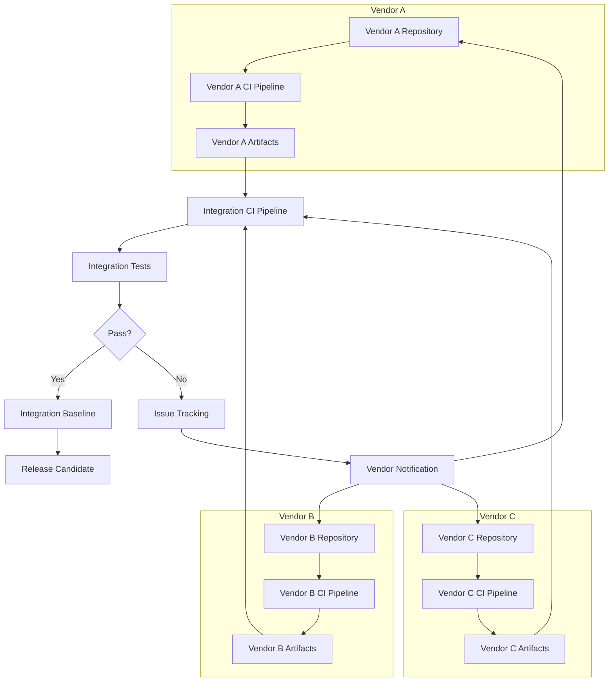
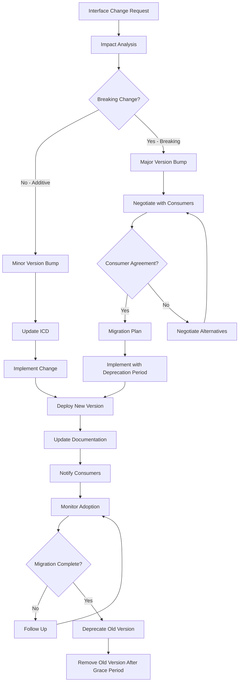
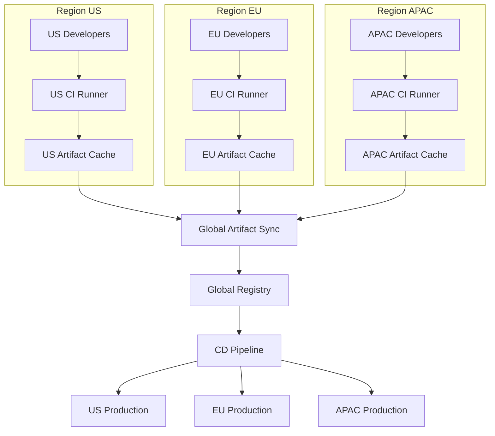
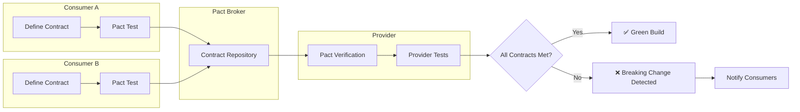

# Vendor and Interface Control in Software Configuration Management

> **SWEBOK KA 8.1, 8.3** - Addresses how SCM extends to vendor management, interface control, distributed teams, and modern microservice architectures.

## 1. Vendor and Subcontractor SCM Control

### 1.1 Vendor SCM Requirements in Contracts

When outsourcing development or maintenance, SCM requirements must be explicitly defined in contracts and statements of work.

| Contract Element | Description | Example Clause |
|-----------------|-------------|----------------|
| **SCM Plan Submission** | Vendor must submit SCM plan for approval | "Vendor shall deliver SCM plan within 30 days of contract award, subject to customer approval" |
| **Tool Requirements** | Specified SCM tools or compatibility requirements | "All deliverables shall be managed in Git with customer-accessible repositories" |
| **Baseline Procedures** | How baselines are created, reviewed, and approved | "Formal baselines require customer review and written approval prior to establishment" |
| **Change Control** | Change request process, approval authority, traceability | "All changes to baselined items shall follow the change control process defined in Section X" |
| **Deliverable Format** | Specific formats, packaging, and metadata requirements | "Source code shall be delivered with build scripts, test suites, and dependency specifications" |
| **Access and Visibility** | Customer access to vendor SCM repositories and status | "Customer shall have read access to all configuration item repositories and CI/CD pipelines" |
| **Audit Rights** | Customer right to audit vendor SCM practices | "Customer may conduct SCM audits with 10 business days written notice" |
| **Escalation Procedures** | How SCM issues are escalated and resolved | "SCM discrepancies shall be reported within 48 hours and resolved per the escalation matrix" |

### 1.2 SCM Audits of Vendors

| Audit Type | Purpose | Frequency | Scope |
|-----------|---------|-----------|-------|
| **Functional Configuration Audit (FCA)** | Verify deliverable meets functional requirements | At major milestones | Requirements traceability, test results, functional completeness |
| **Physical Configuration Audit (PCA)** | Verify deliverable matches documentation | At delivery | Build reproducibility, documentation accuracy, baseline integrity |
| **SCM Process Audit** | Verify vendor follows agreed SCM processes | Quarterly or semi-annually | Process compliance, tool usage, change control adherence |
| **Security Audit** | Verify SCM security practices | Annually or after incidents | Access controls, vulnerability scanning, dependency management |
| **Compliance Audit** | Verify regulatory/contractual compliance | As required | License compliance, data handling, regulatory requirements |

### 1.3 Multi-Vendor CI Coordination

When multiple vendors contribute to a single system, CI coordination becomes critical:



**Multi-Vendor CI Coordination Challenges:**

| Challenge | Impact | Mitigation |
|-----------|--------|------------|
| **Different build systems** | Integration failures, inconsistent artifacts | Standardized build tooling, containerized builds |
| **Dependency conflicts** | Version incompatibilities, runtime errors | Shared dependency registry, version policies |
| **API contract violations** | Breaking changes between vendor components | Contract testing, API versioning policies |
| **Test environment conflicts** | Flaky integration tests, environment drift | Infrastructure as code, isolated test environments |
| **Release coordination** | Delays waiting for vendor deliverables | Clear milestones, buffer time, parallel workstreams |
| **Communication overhead** | Misalignment, duplicated effort | Regular sync meetings, shared dashboards, clear ownership |

### 1.4 Subcontractor Deliverable Acceptance Criteria

| Deliverable | Acceptance Criteria | Verification Method |
|-------------|---------------------|---------------------|
| **Source Code** | Compiles without errors, passes linting, meets code coverage threshold | Automated build + test pipeline |
| **Documentation** | Complete, accurate, follows template, reviewed by SME | Document review checklist, peer review |
| **Test Artifacts** | Test cases cover requirements, tests pass, coverage meets threshold | Test execution report, coverage analysis |
| **Build Scripts** | Reproducible builds, documented dependencies, CI-compatible | Build verification in clean environment |
| **Configuration Files** | Environment-specific configs documented, secrets managed properly | Security scan, configuration review |
| **Release Notes** | Changes documented, known issues listed, upgrade instructions provided | Release note review, upgrade testing |
| **Data Migration Scripts** | Idempotent, reversible, tested with production-like data | Migration testing in staging environment |

## 2. Interface Control

### 2.1 Interface Control Documents (ICD)

An Interface Control Document (ICD) formally defines the interface between two or more systems or components.

**ICD Structure and Content:**

| Section | Content | Purpose |
|---------|---------|---------|
| **Introduction** | Scope, purpose, referenced documents, definitions | Context setting |
| **Interface Overview** | High-level interface description, system context diagram | Understanding the big picture |
| **Physical Interface** | Hardware connections, network topology, physical specifications | Physical implementation guidance |
| **Logical Interface** | Data formats, protocols, message structures, API specifications | Technical implementation guidance |
| **Data Dictionary** | All data elements, types, constraints, enumerations | Data reference |
| **Message/Request Formats** | Request structure, required/optional fields, examples | Implementation guidance |
| **Response Formats** | Response structure, status codes, error formats | Implementation guidance |
| **Error Handling** | Error codes, retry policies, fallback behaviors | Reliability guidance |
| **Security Requirements** | Authentication, authorization, encryption, data protection | Security implementation |
| **Performance Requirements** | Latency, throughput, rate limits, SLAs | Performance implementation |
| **Sequence Diagrams** | Interaction flows, timing, synchronization | Behavioral understanding |
| **Versioning Policy** | Version numbering, backward compatibility, deprecation process | Change management |
| **Testing Procedures** | Interface testing approach, test data, acceptance criteria | Verification guidance |

### 2.2 Interface Specification

#### API Contracts

| Specification Standard | Format | Strengths | Use Cases |
|----------------------|--------|-----------|-----------|
| **OpenAPI (Swagger)** | YAML/JSON | Wide tooling support, code generation, interactive docs | REST APIs |
| **GraphQL Schema** | SDL | Strong typing, introspection, flexible queries | GraphQL APIs |
| **gRPC / Protocol Buffers** | .proto files | High performance, strong typing, polyglot | Internal microservices |
| **AsyncAPI** | YAML/JSON | Event-driven architecture support | Message queues, event streams |
| **RAML** | YAML | Human-readable, modular | REST APIs (legacy) |
| **WSDL** | XML | SOAP standard, enterprise integration | SOAP web services |

#### Protocol Specifications

| Protocol Layer | Specification Elements | Examples |
|---------------|----------------------|---------|
| **Transport** | Protocol (TCP/UDP/HTTP/HTTPS), port, TLS requirements | HTTPS on port 443 with TLS 1.3 |
| **Application** | Method semantics, header requirements, content types | REST: GET/POST/PUT/DELETE with JSON payloads |
| **Message Format** | Structure, encoding, compression, chunking | JSON with UTF-8, gzip compression |
| **Session** | Connection management, keep-alive, session tokens | JWT tokens, OAuth 2.0 flows |
| **Reliability** | Retry policies, idempotency, circuit breakers | Exponential backoff, idempotency keys |

#### Message Formats

```json
{
  "message_schema": {
    "version": "2.1",
    "message_type": "OrderCreated",
    "payload": {
      "order_id": { "type": "string", "format": "uuid", "required": true },
      "customer_id": { "type": "string", "format": "uuid", "required": true },
      "items": {
        "type": "array",
        "items": {
          "product_id": { "type": "string", "required": true },
          "quantity": { "type": "integer", "minimum": 1, "required": true },
          "unit_price": { "type": "number", "minimum": 0, "required": true }
        },
        "minItems": 1
      },
      "total_amount": { "type": "number", "minimum": 0, "required": true },
      "currency": { "type": "string", "enum": ["USD", "EUR", "GBP"], "default": "USD" },
      "created_at": { "type": "string", "format": "iso8601", "required": true }
    },
    "metadata": {
      "correlation_id": { "type": "string", "format": "uuid" },
      "source_system": { "type": "string" },
      "schema_version": { "type": "string" }
    }
  }
}
```

### 2.3 Interface Versioning and Compatibility

| Versioning Strategy | Description | Pros | Cons |
|--------------------|-------------|------|------|
| **URI Versioning** | Version in URL path (`/api/v1/orders`) | Explicit, cacheable, easy routing | URL proliferation, breaks REST purity |
| **Header Versioning** | Version in custom header (`X-API-Version: 1`) | Clean URLs, flexible | Less visible, harder to test in browser |
| **Content Negotiation** | Version in Accept header (`Accept: application/vnd.api+json;version=1`) | REST-compliant, flexible | Complex, harder to debug |
| **Query Parameter** | Version in query string (`?version=1`) | Simple, visible | Can be missed, pollutes query string |
| **Semantic Versioning** | Major.Minor.Patch (MAJOR.MINOR.PATCH) | Clear compatibility signals | Requires discipline |

**Compatibility Rules:**

| Change Type | Version Impact | Backward Compatible? | Example |
|-------------|---------------|---------------------|---------|
| Add optional field | MINOR | Yes | Adding `metadata` to response |
| Add new endpoint | MINOR | Yes | Adding `GET /orders/{id}/history` |
| Remove field | MAJOR | No | Removing `customer_name` from response |
| Change field type | MAJOR | No | Changing `id` from integer to string |
| Change behavior | MAJOR | No | Changing sort order default |
| Deprecate field | MINOR (with notice) | Yes (temporarily) | Marking field as deprecated, removing in next MAJOR |
| Fix bug in behavior | PATCH | Depends | Correcting validation logic |

### 2.4 Interface Change Management



### 2.5 Cross-Team Interface Agreements

| Agreement Element | Description | Example |
|-------------------|-------------|---------|
| **Interface Ownership** | Who owns and maintains the interface specification | "Team A owns the Payment API interface specification" |
| **Change Authority** | Who can approve interface changes | "Changes require approval from both provider and consumer team leads" |
| **Communication Protocol** | How changes are communicated | "Interface changes announced via Slack #api-changes channel with 2-week notice" |
| **Testing Responsibilities** | Who tests what | "Provider tests functionality, consumers test integration" |
| **SLA Commitments** | Performance and availability guarantees | "99.9% availability, p99 latency < 200ms" |
| **Escalation Path** | How interface issues are escalated | "L1: Teams resolve directly, L2: Engineering manager, L3: VP Engineering" |
| **Review Cadence** | Regular interface review meetings | "Bi-weekly interface review for active interfaces, monthly for stable" |
| **Documentation Standards** | Format, completeness, update frequency | "OpenAPI 3.0 spec, updated within 1 sprint of changes" |

### 2.6 System-of-Systems Interface Management

In system-of-systems (SoS) environments, interface management becomes significantly more complex:

| SoS Challenge | Description | Management Approach |
|--------------|-------------|---------------------|
| **Independent Evolution** | Constituent systems evolve independently | Interface stability contracts, long deprecation periods |
| **Diverse Technologies** | Different tech stacks, protocols, data formats | Integration middleware, protocol translation, canonical data model |
| **Distributed Governance** | No central authority over all systems | Interface governance board, voluntary standards, bilateral agreements |
| **Emergent Behavior** | System interactions create unexpected behaviors | Integration testing, chaos engineering, monitoring |
| **Varying Lifecycles** | Systems on different release schedules | Interface versioning, backward compatibility requirements |
| **Scale** | Many systems with many interfaces | Interface registry/catalog, automated discovery, dependency mapping |

## 3. SCM for Distributed Teams

### 3.1 Branching Strategies for Multi-Site Development

| Strategy | Description | Pros | Cons | Best For |
|----------|-------------|------|------|----------|
| **Gitflow** | Long-lived develop and main branches, feature/release/hotfix branches | Clear structure, supports parallel releases, well-documented | Complex, slow integration, merge conflicts | Products with scheduled releases, multiple versions in production |
| **Trunk-Based Development** | All developers commit to main branch, short-lived feature branches (< 1 day) | Fast integration, minimal conflicts, continuous delivery | Requires feature flags, discipline, good CI | High-performing teams, continuous delivery |
| **GitHub Flow** | Main branch + feature branches, PR-based workflow | Simple, PR reviews, good for CI/CD | Less structure for releases | Web applications, SaaS products |
| **GitLab Flow** | Main + environment branches (staging, production) | Supports multiple environments, clear promotion path | Can get complex with many environments | Multi-environment deployments |
| **Release Flow** | Main branch + release branches for each version | Supports multiple versions, cherry-pick friendly | Maintenance overhead for old releases | Products with long support cycles |

**Comparison Matrix:**

| Factor | Gitflow | Trunk-Based | GitHub Flow | GitLab Flow | Release Flow |
|--------|---------|-------------|-------------|-------------|--------------|
| **Complexity** | High | Low | Low | Medium | Medium |
| **Integration Speed** | Slow | Fast | Fast | Medium | Medium |
| **Conflict Frequency** | High | Low | Low | Medium | Medium |
| **Release Flexibility** | High | Medium | Low | High | High |
| **CI/CD Compatibility** | Medium | High | High | High | Medium |
| **Team Size Suitability** | Large | Any | Small-Medium | Medium-Large | Large |
| **Multi-Site Suitability** | Medium | High (with discipline) | Medium | Medium | High |

### 3.2 Merge Conflict Resolution Policies

| Policy | Description | When to Use |
|--------|-------------|-------------|
| **Rebase Before Merge** | Rebase feature branch on latest main before merging | Feature branches, clean history preference |
| **Merge Commit** | Preserve merge commit for traceability | Long-lived branches, need to see integration points |
| **Squash and Merge** | Squash all feature commits into one merge commit | Clean main branch history, small features |
| **Conflict Ownership** | The person with the newer branch resolves conflicts | Prevents stale branches, encourages frequent integration |
| **Mandatory Review** | All conflict resolutions require peer review | High-quality codebases, regulated environments |
| **Automated Resolution** | Tools auto-resolve non-overlapping changes | High-velocity teams with good CI |
| **Integration Branch** | Shared integration branch for conflict detection | Multi-vendor, multi-team environments |

### 3.3 CI/CD Across Geographic Locations

| Challenge | Impact | Solution |
|-----------|--------|----------|
| **Build Time** | Long builds delay feedback across timezones | Distributed build cache, incremental builds, parallel test execution |
| **Test Environment Access** | Remote teams may have slow access to test environments | Cloud-based environments, regional test infrastructure |
| **Artifact Distribution** | Large artifacts slow to transfer globally | Artifact caching, CDN distribution, regional mirrors |
| **Pipeline Coordination** | Multiple teams triggering same pipeline | Pipeline queuing, priority lanes, dedicated pipelines per team |
| **Secret Management** | Different regions may have different security requirements | Centralized secret management with regional access controls |
| **Monitoring and Alerting** | Incidents may occur when the owning team is offline | Follow-the-sun on-call, automated escalation, runbooks |

**Distributed CI/CD Architecture:**



### 3.4 Code Ownership and Review Across Teams

| Model | Description | Pros | Cons |
|-------|-------------|------|------|
| **CODEOWNERS File** | File-pattern-based ownership definitions | GitHub/GitLab native, automatic reviewer assignment | Can become stale, rigid patterns |
| **Team-Based Ownership** | Teams own directories/modules | Clear boundaries, team autonomy | Cross-team changes require coordination |
| **Feature-Based Ownership** | Teams own features across directories | Aligns with product thinking | Complex ownership patterns |
| **Rotating Reviewers** | Reviewers rotate across teams | Knowledge spreading, fresh perspectives | Slower reviews, less expertise |
| **Specialized Reviewers** | Security, performance, architecture reviewers | Expert review quality | Bottleneck on specialists |

**Best Practices for Cross-Team Code Review:**

1. **Define clear ownership boundaries** - Use CODEOWNERS or equivalent to specify who reviews what
2. **Set review SLAs** - Define maximum time for first review response (e.g., 24 hours)
3. **Automate what you can** - Linters, formatters, security scans reduce human review burden
4. **Document review expectations** - What reviewers should look for, approval requirements
5. **Use review templates** - Consistent review checklist across teams
6. **Track review metrics** - Review time, review coverage, defect detection rate
7. **Escalation paths** - Clear process when reviews are blocked or disputed

## 4. SCM in Microservices Architecture

### 4.1 Per-Service Versioning

| Approach | Description | Pros | Cons |
|----------|-------------|------|------|
| **Independent Repositories** | Each service in its own repository | Team autonomy, independent deployment, clear boundaries | Cross-service changes harder, dependency management complex |
| **Monorepo** | All services in one repository | Atomic cross-service changes, shared tooling, code sharing | Build complexity, access control, repository size |
| **Multi-Repo with Shared Libraries** | Services in separate repos, shared code in library repos | Balance of autonomy and reuse | Library versioning complexity, update coordination |
| **Metarepo** | Thin orchestration repo that references service repos | Coordinated releases, cross-service testing | Additional tooling, sync complexity |

**Versioning Strategy per Service:**

```
┌─────────────────────────────────────────────────────────────────┐
│                    Service Version Matrix                        │
├─────────────────────────────────────────────────────────────────┤
│                                                                  │
│  Service          Version    API Version    Status               │
│  ─────────────    ───────    ───────────    ──────               │
│  User Service     2.4.1      v2             Active               │
│  Order Service    3.1.0      v3             Active               │
│  Payment Service  1.8.2      v1             Active               │
│  Inventory Svc    4.0.0-rc1  v4 (preview)   Release Candidate    │
│  Notification Svc 1.2.0      v1             Active               │
│  Legacy Auth      0.9.0      v0             Deprecated           │
│                                                                  │
│  Cross-Service Compatibility Matrix:                            │
│  ┌─────────────┬─────────┬─────────┬─────────┬─────────┐       │
│  │             │ User v2 │ Order v3│ Pay v1  │ Inv v4  │       │
│  ├─────────────┼─────────┼─────────┼─────────┼─────────┤       │
│  │ User v2     │    -    │   ✅    │   ✅    │   ✅    │       │
│  │ Order v3    │   ✅    │    -    │   ✅    │   ⚠️    │       │
│  │ Payment v1  │   ✅    │   ✅    │    -    │   ✅    │       │
│  │ Inv v4-rc1  │   ✅    │   ⚠️    │   ✅    │    -    │       │
│  └─────────────┴─────────┴─────────┴─────────┴─────────┘       │
│  ✅ = Tested Compatible  ⚠️ = Compatibility Unknown/Untested    │
└─────────────────────────────────────────────────────────────────┘
```

### 4.2 API Versioning Strategies for Microservices

| Strategy | Implementation | Example | Trade-offs |
|----------|---------------|---------|------------|
| **URI Versioning** | Version in URL path | `GET /api/v2/users/123` | Explicit, easy routing; URL proliferation |
| **Header Versioning** | Custom header | `X-API-Version: 2` | Clean URLs; less visible |
| **Content Negotiation** | Accept header | `Accept: application/vnd.myapp.v2+json` | REST-compliant; complex |
| **Query Parameter** | Query string | `GET /api/users/123?version=2` | Simple; can be missed |
| **Request Body Versioning** | Version in request body | `{"version": "2", "data": {...}}` | Simple for POST/PUT; not RESTful |
| **Semantic Versioning** | MAJOR.MINOR.PATCH per service | Service 2.4.1 | Clear compatibility signals |
| **Date-Based Versioning** | Version by date | `Stripe-Version: 2023-01-01` | Intuitive timeline; less granular |

### 4.3 Backward Compatibility Guarantees

| Guarantee | Description | Implementation |
|-----------|-------------|----------------|
| **Additive Changes Only** | New fields/endpoints can be added, existing ones cannot be changed | Schema validation, contract testing |
| **Deprecation Policy** | Minimum notice period before removing features | Deprecation headers, sunset dates, migration guides |
| **Graceful Degradation** | Older clients receive subset of new response | Default values, optional fields, response filtering |
| **Contract Testing** | Automated verification that API contracts are honored | Pact, Spring Cloud Contract, custom contract tests |
| **Consumer-Driven Contracts** | Consumers define expectations that providers verify | Pact framework, bidirectional contract testing |
| **API Gateway Translation** | Gateway transforms between API versions | API gateway with request/response transformation |
| **Feature Flags** | New behavior behind flags, old behavior as default | LaunchDarkly, Unleash, custom feature flag systems |

### 4.4 Consumer-Driven Contract Testing



**Contract Testing Benefits:**

| Benefit | Description |
|---------|-------------|
| **Fast Feedback** | Contract violations caught before integration testing |
| **Independent Deployment** | Services can deploy independently if contracts are met |
| **Living Documentation** | Contracts serve as up-to-date API documentation |
| **Breaking Change Detection** | Automatically detect when changes break consumers |
| **Reduced Integration Testing** | Fewer end-to-end tests needed when contracts are trusted |

### 4.5 Service Mesh Configuration Management

| Configuration Aspect | Management Approach | Tools |
|---------------------|---------------------|-------|
| **Traffic Routing** | Version-based routing, canary deployments, blue-green | Istio VirtualService, Linkerd TrafficSplit |
| **Retry Policies** | Automatic retries with backoff per service | Istio DestinationRule, Linkerd ServiceProfile |
| **Circuit Breaking** | Failure detection and isolation | Istio DestinationRule, Resilience4j |
| **Rate Limiting** | Per-service rate limits | Istio EnvoyFilter, Kong rate limiting |
| **mTLS Configuration** | Service-to-service encryption | Istio PeerAuthentication, Linkerd automatic mTLS |
| **Observability** | Distributed tracing, metrics, logging | Jaeger, Prometheus, OpenTelemetry |
| **Access Control** | Service-to-service authorization policies | Istio AuthorizationPolicy, OPA |

**Service Mesh Configuration as Code:**

```yaml
# Example: Istio VirtualService for API versioning
apiVersion: networking.istio.io/v1beta1
kind: VirtualService
metadata:
  name: order-service
spec:
  hosts:
    - order-service
  http:
    - match:
        - headers:
            x-api-version:
              exact: "v2"
      route:
        - destination:
            host: order-service
            subset: v2
    - route:
        - destination:
            host: order-service
            subset: v1
      # Default to v1 for backward compatibility
```

## 5. SCM Governance and Compliance

### 5.1 SCM Governance Framework

| Governance Area | Controls | Enforcement |
|----------------|----------|-------------|
| **Access Control** | Role-based access, least privilege, branch protection | IAM policies, repository settings |
| **Change Control** | PR reviews, approval requirements, CODEOWNERS | Branch protection rules, required reviews |
| **Audit Trail** | Commit history, change logs, who/what/when | Git history, SCM audit logs |
| **Compliance** | License scanning, security scanning, regulatory requirements | Automated scanning in CI/CD |
| **Release Management** | Release approval, sign-off, deployment gates | Release pipelines, approval stages |
| **Artifact Management** | Signed artifacts, provenance tracking, vulnerability scanning | Artifact registry, signing tools |

### 5.2 Compliance Requirements Matrix

| Requirement | SCM Control | Verification |
|-------------|-------------|--------------|
| **SOX (Sarbanes-Oxley)** | Change control, audit trail, access controls | Audit logs, change reports |
| **HIPAA** | Access controls, encryption, audit trail | Security scans, access reviews |
| **PCI DSS** | Secure development, vulnerability management, access control | Security scans, pen testing |
| **GDPR** | Data handling in code, right to erasure considerations | Code reviews, data flow analysis |
| **ISO 27001** | Information security management | ISMS audits, security controls |
| **SOC 2** | Security, availability, processing integrity | SOC 2 audits, control evidence |

## Summary

Effective vendor and interface control in SCM requires:

1. **Contractual clarity** - SCM requirements must be explicit in vendor contracts with clear acceptance criteria and audit rights
2. **Interface governance** - ICDs, versioning policies, and change management processes prevent integration failures
3. **Distributed team coordination** - Branching strategies, CI/CD architecture, and code ownership models must account for geographic distribution
4. **Microservice-specific practices** - Per-service versioning, contract testing, and service mesh configuration management are essential for microservice architectures
5. **Compliance integration** - SCM controls must support regulatory and organizational compliance requirements

## References

- SWEBOK v4, Chapter 8: Software Configuration Management
- IEEE 828: Standard for Configuration Management Plans
- ISO/IEC 24765: Systems and Software Engineering Vocabulary
- OpenAPI Specification: https://spec.openapis.org/oas/latest.html
- Pact Contract Testing: https://docs.pact.io/
- Istio Service Mesh: https://istio.io/
