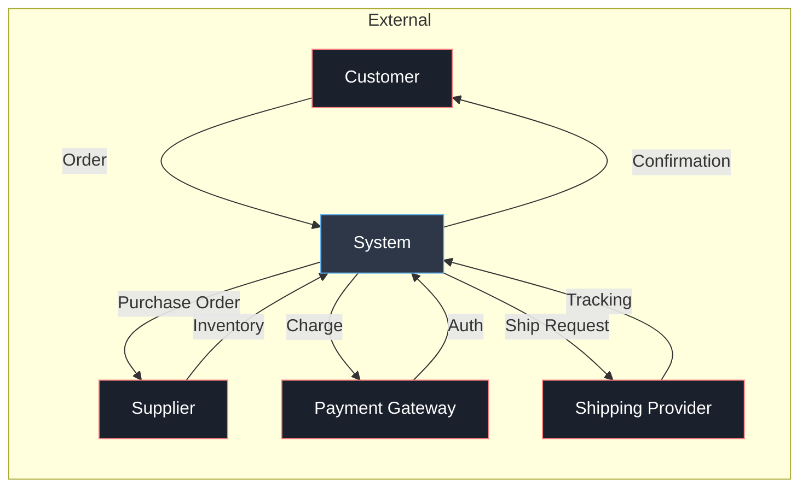
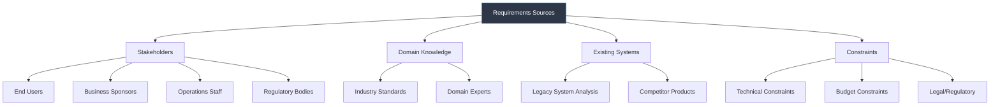
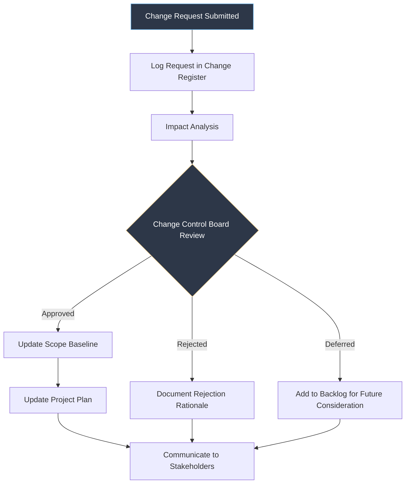

---
tags:
  - software-engineering
  - swebok
  - ka09
  - project-initiation
  - scope-management
  - feasibility-analysis
  - project-management
source: "SWEBOK v4 Chapter 09, PMBOK Ch04 (Integration), Ch05 (Scope)"
created: 2026-07-21
---

# Project Initiation and Scope Definition

> **SWEBOK KA 9.1:** Initiation and Scope Definition
> *"The first and most critical step in any software project is defining what needs to be built, why it needs to be built, and whether building it is feasible."*

---

## 1. Project Need Identification

Every software project begins with the recognition of a **need**: a business problem, an opportunity, or a gap that existing systems cannot address. The initiation phase establishes whether the need is real, whether it warrants a new project, and what the boundaries of the solution should be.

### Sources of Project Need

| Source | Example | Typical Trigger |
|---|---|---|
| **Business Opportunity** | Entering a new market segment | Market analysis, competitive pressure |
| **Regulatory Requirement** | Compliance with new data privacy law | Legislation, industry standards |
| **Operational Inefficiency** | Manual processes slowing throughput | Cost analysis, bottleneck identification |
| **Technology Upgrade** | Legacy system end-of-life | Vendor sunset, security vulnerabilities |
| **Customer Request** | New feature demand from key accounts | Feedback, support ticket trends |
| **Strategic Initiative** | Digital transformation program | Executive vision, board directive |

### Project Charter

The **project charter** formally authorizes the project and provides the project manager with authority to apply organizational resources. Per PMBOK, it documents:

```yaml
Project Charter:
  - Project title and description
  - Business need / justification
  - Measurable objectives and success criteria
  - High-level requirements
  - Assumptions and constraints
  - Assigned project manager and authority level
  - Sponsor name and authority
  - Summary milestone schedule
  - Summary budget
  - Stakeholder list
```

> [!important] Charter vs. Contract
> The charter is an **internal** authorization document. A contract is an **external** legal agreement. A project may have one or both, but the charter is always required.

---

## 2. Scope Definition

### What Is Scope?

**Project scope** defines all the work required, and only the work required, to deliver the product, service, or result with the specified features and functions. Scope has two dimensions:

| Dimension | Description | Managed By |
|---|---|---|
| **Product Scope** | Features and functions that characterize the product | Requirements documentation |
| **Project Scope** | Work that must be done to deliver the product | WBS and scope baseline |

### Context Diagrams

A **context diagram** (also called a system context diagram) is a high-level visualization that shows the system boundary and the external entities that interact with it. It is the simplest form of a data flow diagram and is invaluable for scope definition.



**Context diagram benefits:**
- Defines system boundaries unambiguously
- Identifies all external interfaces early
- Prevents scope creep by making "in" vs. "out" explicit
- Serves as a communication tool for non-technical stakeholders

### Model-Based Systems Engineering (MBSE)

Modern scope definition increasingly uses MBSE approaches where system models (not just documents) capture the system context. MBSE provides:

- **Executable models** that can be simulated before implementation
- **Traceability** from high-level needs down to design elements
- **Consistency checking** across views and perspectives
- **Reuse** of system models across projects with similar architectures

---

## 3. Feasibility Analysis

Before committing resources, the organization must evaluate whether the project is **feasible** across multiple dimensions. SWEBOK identifies four types of feasibility analysis:

### Feasibility Dimensions

| Type | Key Questions | Typical Analysis |
|---|---|---|
| **Technical** | Can we build it with available technology? Is the architecture viable? | Prototype, technology assessment, proof of concept |
| **Economic** | Does the return justify the investment? | Cost-benefit analysis, ROI, NPV, payback period |
| **Operational** | Will the organization adopt and use it? | Change readiness assessment, user acceptance analysis |
| **Schedule** | Can we deliver within the required timeframe? | Resource availability, constraint analysis, critical path |

### Technical Feasibility

Technical feasibility evaluates whether the proposed solution can be implemented with current technology, skills, and infrastructure.

**Assessment criteria:**
- Availability of required hardware and software platforms
- Team capability to use the required technology stack
- Performance requirements achievable with proposed architecture
- Integration requirements with existing systems
- Security and compliance requirements satisfiable

**Common techniques:**
- **Proof of Concept (PoC):** Build a minimal implementation of the riskiest component
- **Technology Spike:** Time-boxed exploration of an unknown technology
- **Benchmark Testing:** Evaluate candidate technologies against performance criteria

### Economic Feasibility

Economic feasibility determines whether the project delivers sufficient value to justify its cost.

| Metric | Formula | Interpretation |
|---|---|---|
| **ROI** | (Benefits - Costs) / Costs x 100% | Higher is better; compare to hurdle rate |
| **NPV** | Sum of (Cash Flow / (1+r)^t) | Positive NPV means the project adds value |
| **Payback Period** | Time until cumulative benefits exceed costs | Shorter is better; preferred < 3 years for software |
| **IRR** | Discount rate where NPV = 0 | Must exceed the organization's cost of capital |

> [!warning] The Intangibles Problem
> Many software benefits are intangible (improved customer satisfaction, faster decision-making, reduced risk). Economic feasibility that ignores intangibles systematically undervalues software projects. Use surrogate measures where possible.

### Operational Feasibility

Operational feasibility examines whether the solution will be used effectively once deployed.

**Key considerations:**
- Will users accept the new system or resist it?
- Does the solution fit existing business processes?
- What training is required?
- Are there organizational or cultural barriers?
- What is the migration path from the current system?

### Schedule Feasibility

Schedule feasibility determines whether the required delivery date is achievable.

**Factors to evaluate:**
- Hard deadlines (regulatory, contractual, market window)
- Resource availability and competing priorities
- Dependencies on external parties
- Technical risks that could cause delays
- Historical velocity of similar projects

---

## 4. Requirements Determination and Negotiation

### Requirements Determination

Requirements determination is the process of discovering, eliciting, and documenting stakeholder needs. It occurs during initiation but continues throughout the project.

**Sources of requirements:**



### Requirements Negotiation

When stakeholder requirements conflict (and they almost always do), the project manager must facilitate negotiation to reach a consensus on scope.

**Negotiation process:**

1. **Identify conflicts:** Map requirements from different stakeholders and flag overlaps, contradictions, and gaps
2. **Classify conflicts:** Distinguish between true conflicts (mutually exclusive requirements) and perceived conflicts (different wording for the same need)
3. **Evaluate trade-offs:** Use impact analysis to show the cost, schedule, and quality implications of each option
4. **Facilitate compromise:** Help stakeholders find mutually acceptable solutions
5. **Document decisions:** Record what was agreed, what was deferred, and what was rejected, along with rationale

> [!tip] The MoSCoW Method
> Categorize requirements for negotiation:
> - **Must have:** Non-negotiable; without these the project fails
> - **Should have:** Important but not critical; can be deferred if necessary
> - **Could have:** Desirable; included only if time and budget allow
> - **Won't have (this time):** Explicitly excluded from current scope

### Ongoing Requirements Review

Requirements are not static. SWEBOK emphasizes that scope definition must include a **process for ongoing requirements review and revision:**

| Activity | Frequency | Purpose |
|---|---|---|
| **Requirements Review** | At each phase gate | Validate requirements are still relevant and complete |
| **Change Request Review** | As needed | Evaluate proposed changes against scope baseline |
| **Stakeholder Check-in** | Regular (sprint review, milestone) | Confirm alignment with stakeholder expectations |
| **Traceability Audit** | Quarterly | Ensure all requirements are implemented and tested |
| **Scope Creep Detection** | Continuous | Identify unauthorized additions to scope |

---

## 5. Scope Baseline

The **scope baseline** is the approved version of the scope statement, WBS, and WBS dictionary. It is the reference point against which all scope changes are measured.

### Components

```
Scope Baseline
├── Project Scope Statement
│   ├── Product scope description
│   ├── Deliverables
│   ├── Acceptance criteria
│   ├── Exclusions (what is explicitly out of scope)
│   └── Assumptions and constraints
├── Work Breakdown Structure (WBS)
│   ├── Hierarchical decomposition of work
│   └── See: [[11_Project_Planning_and_Management]] for detailed WBS treatment
└── WBS Dictionary
    ├── Detailed description of each WBS element
    ├── Responsible person/team
    ├── Schedule milestones
    ├── Cost estimates
    ├── Acceptance criteria
    └── Quality requirements
```

### Scope Verification

Scope verification is the formal acceptance of completed project deliverables. It involves:

1. **Inspection:** Review deliverables against acceptance criteria
2. **Formal sign-off:** Stakeholder approval of completed work
3. **Documentation:** Record of what was accepted and any conditions

> [!note] Scope Verification vs. Quality Control
> Scope verification focuses on **acceptance** of deliverables (is this what we asked for?). Quality control focuses on **correctness** (is this built correctly?). Both are needed; neither substitutes for the other.

---

## 6. Scope Change Control

Changes to scope are inevitable. The change control process ensures they are managed systematically.

### Change Control Process



### Scope Creep vs. Gold Plating

| Term | Definition | Example | Prevention |
|---|---|---|---|
| **Scope Creep** | Uncontrolled expansion of scope without adjustments to time, cost, or resources | "While you're in there, can you also..." | Strict change control process |
| **Gold Plating** | Adding features not requested by stakeholders because the team thinks they'll be useful | "Users will love this extra feature we designed" | Stick to the scope baseline; deliver what was asked for |

---

## 7. Stakeholder Analysis for Scope

Understanding who cares about the project and how they influence scope decisions is critical.

### Stakeholder Power/Interest Grid

```
                    HIGH INTEREST
                         │
    Keep Satisfied ──────┼────── Manage Closely
    (High Power,         │      (High Power,
     Low Interest)       │       High Interest)
                         │
   ──────────────────────┼──────────────────── LOW POWER
                         │
    Monitor ─────────────┼────── Keep Informed
    (Low Power,          │      (Low Power,
     Low Interest)       │       High Interest)
                         │
                    LOW INTEREST
```

**Application to scope:**
- **Manage Closely:** These stakeholders define and approve scope
- **Keep Satisfied:** These stakeholders can veto scope decisions
- **Keep Informed:** These stakeholders use the system; their input shapes requirements
- **Monitor:** Minimal scope impact; watch for unexpected changes

---

## 8. Integration with Project Planning

Scope definition feeds directly into project planning. The outputs of initiation become the inputs to planning:

| Initiation Output | Planning Input |
|---|---|
| Project charter | Project management plan |
| Scope statement | WBS development |
| Requirements documentation | Effort estimation |
| Feasibility analysis | Risk identification |
| Stakeholder register | Communication planning |

> [!success] The Criticality of Initiation
> Studies consistently show that errors in project initiation are the most expensive to fix. A requirements error found during maintenance costs 100x more to fix than one found during initiation. Investing time in proper scope definition pays dividends throughout the project.

---

## Key Concepts Summary

| Concept | Core Point |
|---|---|
| **Project Charter** | Formal authorization document with objectives, scope, stakeholders |
| **Context Diagram** | Visualizes system boundary and external interactions |
| **Feasibility Analysis** | Technical, economic, operational, schedule assessment |
| **Requirements Negotiation** | Resolving conflicts between stakeholder needs |
| **Scope Baseline** | Approved scope statement + WBS + WBS dictionary |
| **Change Control** | Systematic process for evaluating and approving scope changes |
| **Scope Creep** | Uncontrolled scope expansion without plan adjustments |
| **MoSCoW** | Prioritization method: Must/Should/Could/Won't |

---

## Related

- [[07_Estimation_and_Planning]]: Next step: converting scope into estimates and plans
- [[08_Risk_Management_and_Control]]: Risk identification begins during initiation
- [[01_Managing_the_Human_Resource]]: Stakeholder and team dynamics
- [[Software Engineering Management Overview]]: Full KA 09 overview
- [[11_Project_Planning_and_Management]]: Detailed WBS, CPM, PERT treatment
