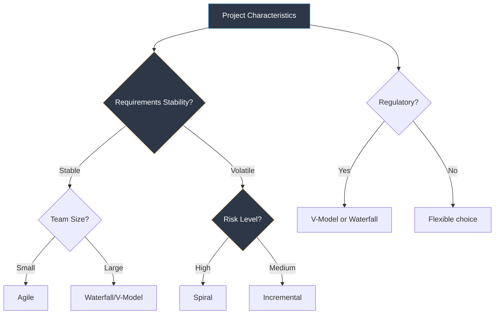
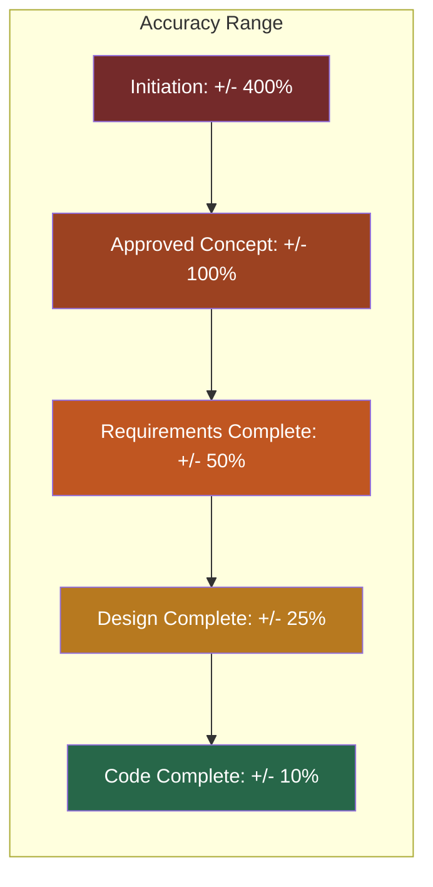
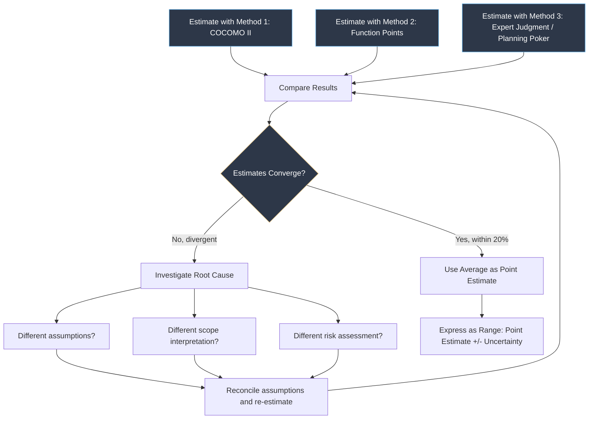

---
tags:
  - software-engineering
  - swebok
  - ka09
  - estimation
  - planning
  - cocomo
  - wbs
  - scheduling
  - project-management
source: "SWEBOK v4 Chapter 09, McConnell Software Estimation"
created: 2026-07-21
---

# Estimation and Planning

> **SWEBOK KA 9.2:** Software Project Planning
> *"Estimation is the process of forecasting the cost, effort, and schedule of a software project. Planning is the process of defining how the project will be executed, monitored, and controlled."*

> [!note] Deep Dive Reference
> For detailed treatment of WBS, CPM, PERT, and Gantt charts with worked examples, see the companion note: [[11_Project_Planning_and_Management]] (Engineering Foundation).

---

## 1. SDLC Model Selection for Planning

The choice of SDLC model fundamentally shapes how planning is done. Different models require different planning approaches, levels of detail, and estimation methods.

### SDLC Models and Planning Implications

| SDLC Model | Planning Horizon | Estimation Approach | Documentation Level | Best When |
|---|---|---|---|---|
| **Waterfall** | Entire project upfront | Detailed, upfront (COCOMO, function points) | Heavy | Requirements stable, well-understood domain |
| **V-Model** | Entire project upfront | Detailed with testing effort allocation | Heavy | Safety-critical, regulated systems |
| **Incremental** | Per increment | Top-down for overall, detailed per increment | Medium-High | Core requirements stable, features can be prioritized |
| **Spiral** | Per spiral cycle | Risk-driven; re-estimate each cycle | Medium | High-risk, large-scale projects |
| **Agile (Scrum)** | Sprint-level (1-4 weeks) | Relative sizing (story points, Planning Poker) | Light-Medium | Requirements evolving, small co-located teams |
| **SAFe** | Program increment (8-12 weeks) | Story points + velocity + WSJF | Medium | Large-scale agile, multiple teams |
| **DevOps/Continuous** | Per deployment | Flow metrics (lead time, throughput) | Minimal | Operations-intensive, continuous delivery |

> [!important] One Size Does Not Fit All
> The SDLC model should be chosen based on project characteristics (uncertainty, size, volatility, team experience), not organizational habit. A project with volatile requirements forced into waterfall planning will produce an estimate that is precisely wrong.

### Model Selection Criteria



---

## 2. Deliverables Determination

Before estimating effort, the team must identify what will be produced. Deliverables fall into two categories:

### Product Deliverables

| Deliverable | Description | Typical Format |
|---|---|---|
| Requirements Specification | What the system must do | SRS document, user stories |
| Architecture Document | System structure and design decisions | Views, diagrams, ADRs |
| Source Code | Executable implementation | Code repositories |
| Test Suite | Verification artifacts | Test cases, automation scripts |
| User Documentation | Help systems, manuals | Online help, PDF guides |
| Deployment Package | Installable/deployable system | Containers, installers, configs |

### Process Deliverables

| Deliverable | Description | Typical Format |
|---|---|---|
| Project Plan | How the project will be executed | Gantt chart, WBS, resource plan |
| Status Reports | Progress tracking | Dashboard, weekly report |
| Review Records | Inspection and review findings | Defect logs, action items |
| Risk Register | Identified risks and mitigations | Risk matrix, tracking log |
| Lessons Learned | Organizational knowledge capture | Retrospective notes |

---

## 3. Effort Estimation Techniques

### The Estimation Cone of Uncertainty

McConnell's Cone of Uncertainty illustrates how estimate accuracy improves as the project progresses:



> [!warning] Premature Precision
> Requesting a precise estimate early in the project is like asking "How long will it take to drive to the city?" before knowing which city, which car, or which route. Early estimates should be expressed as ranges, not point values.

---

### 3.1 Expert Judgment Methods

#### Wide Band Delphi

A structured estimation technique that harnesses collective expert wisdom while avoiding groupthink.

**Process:**
1. Present the estimation problem to a panel of 3-7 experts
2. Each expert independently and anonymously produces an estimate
3. A facilitator collects and presents all estimates (without attribution)
4. Experts discuss the rationale behind divergent estimates
5. Each expert revises their estimate based on the discussion
6. Repeat steps 3-5 until estimates converge (typically 2-3 rounds)
7. Final estimate = average of the last round

**Advantages:** Leverages diverse experience; reduces individual bias; builds team buy-in.

**Disadvantages:** Time-consuming; quality depends on expert selection.

#### Analogy-Based Estimation

Compare the new project to completed projects with known actual effort.

```
New Project Effort = Reference Project Effort x Similarity Factor

Where:
  Similarity Factor = f(size, complexity, team, technology, domain)
```

| Similarity Dimension | How to Assess |
|---|---|
| Size | Compare LOC, function points, or story count |
| Complexity | Compare algorithmic, integration, and UI complexity |
| Team | Compare experience level, domain knowledge |
| Technology | Compare platform, language, framework familiarity |
| Domain | Compare business domain knowledge |

> [!tip] Analogy Estimation Tip
> Use **multiple** reference projects and weight them by similarity. A single reference point is fragile; three reference points with a weighted average is robust.

---

### 3.2 Algorithmic Models

#### COCOMO II (Constructive Cost Model)

Boehm's COCOMO II is the most widely studied algorithmic estimation model. It uses a parametric equation:

$$E = a \cdot S^b \cdot \prod_{i=1}^{n} EM_i$$

Where:
- $E$ = effort in person-months
- $S$ = size (SLOC or function points)
- $a$ = calibration constant (typically 2.94)
- $b$ = scale factor exponent (1.01 to 1.23)
- $EM_i$ = effort multipliers (cost drivers)

**COCOMO II has three estimation stages:**

| Stage | Name | Size Measure | When to Use |
|---|---|---|---|
| 1 | Application Composition | Application Points | Very early; prototyping phase |
| 2 | Early Design | Function Points or SLOC | After requirements; architecture not yet defined |
| 3 | Post-Architecture | Function Points or SLOC | After architecture is defined; most accurate |

**Scale Factors (determine exponent b):**

| Scale Factor | Very Low | Low | Nominal | High | Very High | Extra High |
|---|---|---|---|---|---|---|
| PREC (Precedentedness) | 6.20 | 4.96 | 3.72 | 2.48 | 1.24 | 0.00 |
| FLEX (Flexibility) | 5.07 | 4.05 | 3.04 | 2.03 | 1.01 | 0.00 |
| RESL (Risk Resolution) | 7.07 | 5.65 | 4.24 | 2.83 | 1.41 | 0.00 |
| TEAM (Team Cohesion) | 5.48 | 4.38 | 3.29 | 2.19 | 1.10 | 0.00 |
| PMAT (Process Maturity) | 7.80 | 6.24 | 4.68 | 3.12 | 1.56 | 0.00 |

**Cost Driver Categories:**

| Category | Drivers | Range |
|---|---|---|
| **Product** | RELY, DATA, CPLX, RUSE, DOCU | 0.71 - 1.23 |
| **Platform** | TIME, STOR, PVOL | 0.87 - 1.17 |
| **Personnel** | ACAP, AEXP, PCAP, PEXP, LTEX | 0.78 - 1.42 |
| **Project** | TOOL, SITE, SCED | 0.80 - 1.43 |

#### Function Point Analysis (FPA)

Function points measure software size from the user's perspective, independent of technology.

**Five Function Types:**

| Function Type | Description | Weight (Low/Avg/High) |
|---|---|---|
| **EI** (External Input) | Data entering the system | 3/4/6 |
| **EO** (External Output) | Data leaving the system | 4/5/7 |
| **EQ** (External Inquiry) | Input-output pairs with no processing | 3/4/6 |
| **ILF** (Internal Logical File) | Data stored within the system | 7/10/15 |
| **EIF** (External Interface File) | Data referenced but stored externally | 5/7/10 |

**Calculation steps:**
1. Count each function type by complexity (Low/Average/High)
2. Multiply by the corresponding weight
3. Sum = **Unadjusted Function Points (UFP)**
4. Apply **Value Adjustment Factor (VAF)** based on 14 general system characteristics
5. **Adjusted FP = UFP x VAF**

$$VAF = 0.65 + 0.01 \times \sum_{i=1}^{14} C_i$$

Where each $C_i$ is rated 0-5, so VAF ranges from 0.65 to 1.35.

**Converting FP to effort:**
$$\text{Effort (person-months)} = \frac{\text{FP}}{\text{Productivity Factor (FP/PM)}}$$

Typical productivity: 8-20 FP/PM depending on team experience and tool support.

---

### 3.3 Agile Estimation Methods

#### Story Points

Story points are a **relative** measure of size, not an absolute measure of time. They capture the combined effect of:
- **Volume:** How much work is there?
- **Complexity:** How hard is the work?
- **Uncertainty:** How much is unknown?

| Story Point | Relative Size | Example |
|---|---|---|
| 1 | Trivial | Change a label on a form |
| 2 | Small | Add a simple validation rule |
| 3 | Medium | Create a new API endpoint with basic logic |
| 5 | Large | Implement a multi-step workflow |
| 8 | Very Large | Integrate with an external system |
| 13 | Huge | Should be broken down further |
| 21 | Epic | Must be decomposed before estimation |

#### Planning Poker

A consensus-based estimation technique for agile teams.

**Rules:**
1. The Product Owner presents a user story and answers questions
2. Each team member selects a card (Fibonacci scale: 1, 2, 3, 5, 8, 13, 21)
3. All cards are revealed simultaneously
4. If estimates diverge: the highest and lowest estimators explain their reasoning
5. Re-estimate until consensus (typically 2-3 rounds)
6. Record the agreed estimate

**Why it works:**
- Forces participation from all team members
- Prevents anchoring bias (simultaneous reveal)
- Exposes hidden assumptions through discussion
- Builds shared understanding of the work

```python
# Planning Poker Fibonacci deck
valid_points = [0, 0.5, 1, 2, 3, 5, 8, 13, 21, 34, 89, 100]

# Why Fibonacci? The increasing gaps force honest uncertainty:
# 1 vs 2: "Is this slightly bigger?"
# 5 vs 8: "Is this meaningfully bigger?"
# 13 vs 21: At this scale, precision is meaningless
```

#### Velocity-Based Planning

Once the team has an established velocity (average story points completed per sprint), forecasting becomes straightforward:

$$\text{Sprints to Completion} = \frac{\text{Remaining Story Points}}{\text{Average Velocity}}$$

| Metric | Calculation | Use |
|---|---|---|
| **Velocity** | Sum of completed story points per sprint | Capacity planning |
| **Commitment Velocity** | What the team confidently commits to | Sprint planning |
| **Burndown Rate** | Story points completed per day | Daily progress tracking |

---

## 4. Resource Allocation

Once effort is estimated, resources must be allocated to activities.

### Resource Types

| Resource | Allocation Considerations |
|---|---|
| **Personnel** | Skills, availability, learning curve, team composition |
| **Hardware** | Development servers, test environments, CI/CD infrastructure |
| **Software** | Licenses, tools, cloud services |
| **Facilities** | Office space, meeting rooms, remote access |
| **Budget** | Travel, training, contingency reserves |

### Resource Loading

Resource loading maps personnel assignments over time. Key principles:

- **Avoid overallocation:** No person should be assigned more than 100% capacity
- **Account for overhead:** Meetings, email, code reviews consume 15-25% of capacity
- **Respect specialization:** Match skills to tasks, don't assign randomly
- **Plan for ramp-up:** New team members need 2-4 weeks to become productive

> [!warning] The Mythical Man-Month
> Adding people to a late project makes it later (Brooks' Law). New people require training from existing team members, increasing communication paths, and not all work is parallelizable. Plan staffing early; avoid reactive hiring.

---

## 5. Work Breakdown Structure (WBS)

The WBS decomposes the total scope of work into manageable pieces organized in a hierarchy.

> [!note] Detailed Coverage
> For comprehensive WBS treatment with diagrams, examples, and best practices, see [[11_Project_Planning_and_Management]] (Engineering Foundation note).

### WBS Levels

| Level | Element | Description | Example |
|---|---|---|---|
| 0 | Project | The entire project | E-Commerce Platform |
| 1 | Phase / Deliverable | Major work grouping | Requirements, Design, Development, Testing |
| 2 | Work Package | Manageable unit of work | User Authentication Module |
| 3 | Activity | Specific task with effort and duration | Implement OAuth2 integration |

### WBS Creation Process

1. **Start with deliverables:** List all product and process deliverables
2. **Decompose each deliverable:** Break into progressively smaller pieces
3. **Apply the 100% rule:** The WBS must include 100% of the work defined by the scope
4. **Apply the 8/80 rule:** Work packages should take between 8 and 80 hours of effort
5. **Assign unique identifiers:** Each element gets a WBS code for tracking
6. **Create the WBS dictionary:** Document each element's description, acceptance criteria, assumptions, and responsible party

### WBS Dictionary Entry

```yaml
WBS Element: 1.3.2 - Implement OAuth2 Integration
  Description: Integrate OAuth2 authentication with Google and GitHub providers
  Responsible: Backend Team Lead
  Estimated Effort: 40 hours
  Duration: 2 weeks
  Dependencies: 1.3.1 (Database Schema), 1.2.3 (API Gateway Setup)
  Deliverables:
    - OAuth2 client configuration
    - Token management service
    - Unit tests (> 80% coverage)
    - Integration test suite
  Acceptance Criteria:
    - Users can sign in with Google and GitHub
    - Tokens are refreshed automatically
    - Failed auth returns appropriate error codes
  Risks: Third-party API rate limits may affect testing
```

---

## 6. Scheduling Techniques

### Activity Graphs and Dependencies

Activity graphs model the logical relationships between tasks:

| Dependency Type | Notation | Meaning |
|---|---|---|
| **Finish-to-Start (FS)** | A -> B | B cannot start until A finishes |
| **Start-to-Start (SS)** | A => B | B cannot start until A starts |
| **Finish-to-Finish (FF)** | A =>> B | B cannot finish until A finishes |
| **Start-to-Finish (SF)** | A ->> B | B cannot finish until A starts |

> [!note] Detailed Activity Graphs, CPM, and PERT
> For worked examples of activity graphs, critical path calculation, PERT analysis, and Gantt chart construction, see [[11_Project_Planning_and_Management]]. The companion note covers these topics with full numerical examples.

### Critical Path Method (CPM) Summary

```
Forward Pass (Earliest Start/Finish):
  ES(activity) = max(EF of all predecessors)
  EF(activity) = ES(activity) + Duration

Backward Pass (Latest Start/Finish):
  LF(activity) = min(LS of all successors)
  LS(activity) = LF(activity) - Duration

Slack:
  Total Slack = LS - ES = LF - EF
  Free Slack = min(ES of successors) - EF

Critical Path: Path where all activities have Total Slack = 0
```

### PERT Summary

PERT addresses uncertainty by using three time estimates:

$$t_e = \frac{t_o + 4t_m + t_p}{6}$$

$$\sigma = \frac{t_p - t_o}{6}$$

Where:
- $t_o$ = optimistic time
- $t_m$ = most likely time
- $t_p$ = pessimistic time
- $t_e$ = expected time
- $\sigma$ = standard deviation

**For the entire critical path:**

$$T_{project} = \sum t_e \text{ (of critical path activities)}$$

$$\sigma_{project} = \sqrt{\sum \sigma^2 \text{ (of critical path activities)}}$$

### Gantt Charts

Gantt charts visualize the schedule as horizontal bars:

```
Task                    | Jan | Feb | Mar | Apr | May | Jun |
------------------------|-----|-----|-----|-----|-----|-----|
Requirements Analysis   |████████████████|     |     |     |     |
Architecture Design     |     |████████████|     |     |     |     |
UI Development          |     |     |████████████████|     |     |
Backend Development     |     |     |████████████████████|     |
Integration Testing     |     |     |     |     |████████|     |
User Acceptance Testing |     |     |     |     |     |████████|

Legend: ████ = Duration  ▼ = Milestone  ══ = Critical Path
```

**Gantt chart enhancements:**
- **Milestones:** Diamond markers for key decision points
- **Dependencies:** Arrows showing task relationships
- **Resource names:** Assigned to each bar
- **Progress shading:** Filled portion shows % complete
- **Critical path highlighting:** Red bars for zero-slack activities

---

## 7. Reconciliation of Estimates

SWEBOK emphasizes that **multiple estimation methods should be used and their results reconciled.** No single method is reliable enough to use alone.

### Reconciliation Process



### Estimation Method Comparison

| Method | Accuracy | Effort to Apply | Best Stage | Strengths | Weaknesses |
|---|---|---|---|---|---|
| **COCOMO II** | Medium-High | Medium | Post-architecture | Calibrated, repeatable | Needs historical data, sensitive to inputs |
| **Function Points** | Medium-High | Medium | Requirements complete | Technology-independent | Subjective complexity ratings |
| **Planning Poker** | Medium | Low | Any (agile) | Fast, builds team buy-in | Anchored to team's experience |
| **Wide Band Delphi** | Medium-High | Medium | Any | Leverages multiple experts | Time-consuming |
| **Analogy** | Medium | Low | Any | Intuitive, fast | Hard to find good matches |
| **Story Points + Velocity** | Medium-High (after 3+ sprints) | Low | Iterative | Empirical, self-correcting | Needs stable team; not transferable |

---

## 8. Quality and Risk Planning Integration

Estimation and planning do not exist in isolation. They integrate with:

### Quality Planning
- Define quality standards and acceptance criteria
- Plan reviews, inspections, and testing activities
- Allocate effort for quality assurance activities (typically 20-40% of total effort)

### Risk Planning
- Identify risks during estimation (optimistic assumptions are risks)
- Plan risk mitigation activities and allocate budget for them
- Include contingency reserves in the schedule and budget

> [!success] The Planning Paradox
> The plan itself is less valuable than the **act of planning**. Planning forces the team to think through dependencies, risks, and trade-offs. Eisenhower said it best: *"Plans are useless, but planning is indispensable."*

---

## Key Concepts Summary

| Concept | Core Point |
|---|---|
| **Cone of Uncertainty** | Estimate accuracy improves as the project progresses |
| **COCOMO II** | Parametric model with scale factors and cost drivers |
| **Function Points** | Technology-independent size measure |
| **Story Points** | Relative sizing for agile teams |
| **Planning Poker** | Consensus-based estimation with Fibonacci scale |
| **Wide Band Delphi** | Structured expert estimation with anonymity |
| **WBS** | Hierarchical decomposition of all project work |
| **CPM** | Identifies the critical path and slack time |
| **PERT** | Probabilistic scheduling with three time estimates |
| **Gantt Chart** | Visual schedule with dependencies and progress |
| **Reconciliation** | Use multiple methods and compare results |

---

## Related

- [[06_Project_Initiation_and_Scope]]: Scope feeds into estimation and planning
- [[08_Risk_Management_and_Control]]: Risk management is integral to planning
- [[11_Project_Planning_and_Management]]: Detailed WBS, CPM, PERT, Gantt coverage
- [[01_Managing_the_Human_Resource]]: Team factors affecting estimation accuracy
- [[Software Engineering Management Overview]]: Full KA 09 overview
