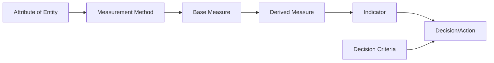
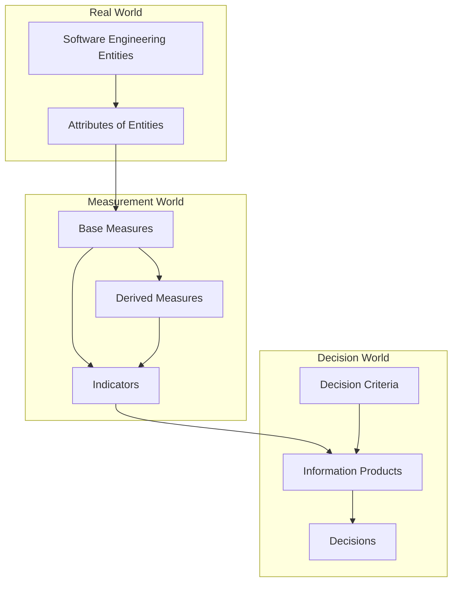
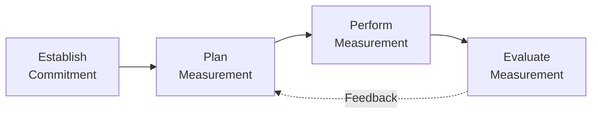
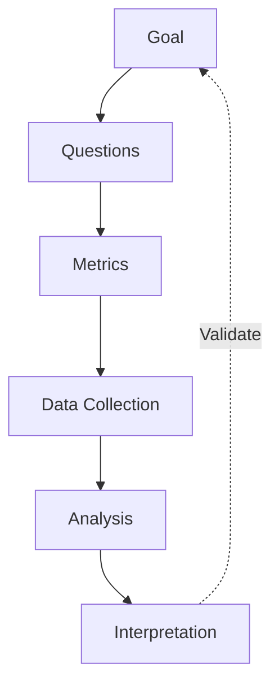
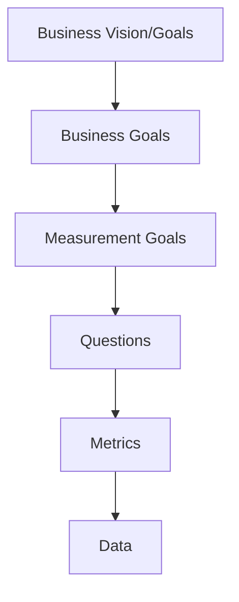
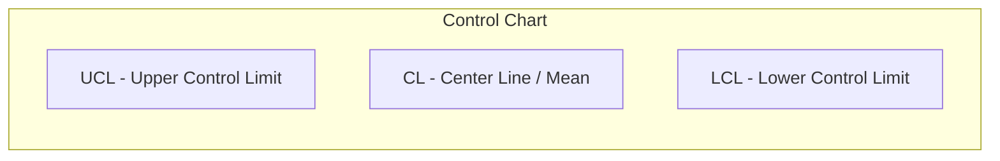
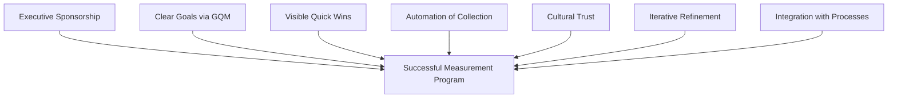

# Measurement and Metrics

## Overview

Software measurement provides a quantitative basis for planning, controlling, monitoring, and improving software development and maintenance activities. Without measurement, management decisions rely on intuition rather than evidence. The ISO/IEC/IEEE 15939 standard defines a measurement process applicable to all software engineering activities, while the Goal-Question-Metric (GQM) framework provides a structured approach to defining meaningful metrics aligned with organizational goals.

> [!important] Core Principle
> Measurement should serve decision-making. A metric that does not inform a decision or answer a question is waste.

## Measurement Fundamentals

### Base Measures vs Derived Measures

| Aspect | Base Measure | Derived Measure |
|--------|-------------|-----------------|
| Definition | A measure defined in terms of an attribute and the measurement method | A measure defined as a function of two or more base measures |
| Examples | Lines of code, defects found, effort hours, response time | Defect density (defects/KLOC), productivity (LOC/person-month), availability (uptime/total time) |
| Symbol | $\mu(A)$ where $A$ is an attribute | $D = f(\mu_1, \mu_2, \ldots)$ |
| Role | Raw data collection | Aggregated insight |

### Measurement Information Model (ISO/IEC/IEEE 15939)

The measurement information model connects real-world entities to information products:

**Key concepts:**
- **Entity**: An object to be measured (process, product, project, resource)
- **Attribute**: A property of an entity (size, complexity, reliability)
- **Measurement method**: The logical sequence of operations to quantify an attribute
- **Measurement function**: An algorithm to combine base measures into derived measures
- **Indicator**: A measure that provides insight for decision-making

## ISO/IEC/IEEE 15939 Measurement Process

The standard defines four activities within the measurement process:

### Activity 1: Establish and Sustain Measurement Commitment

| Task | Description |
|------|-------------|
| Commitment scope | Define organizational scope (program, division, enterprise) |
| Resources | Allocate staff, tools, training for measurement |
| Responsibilities | Assign measurement program owner and data stewards |
| Sponsorship | Secure executive sponsorship for measurement initiatives |

### Activity 2: Plan Measurement Process

| Task | Description |
|------|-------------|
| Identify information needs | Elicit stakeholder questions and decision requirements |
| Select measures | Map measures to information needs using GQM or similar |
| Define data collection | Specify what, when, how, and by whom data is collected |
| Define criteria | Establish decision criteria for interpreting measures |
| Review and validate | Confirm measures address real information needs |
| Provide resources | Ensure tools and procedures are in place |

### Activity 3: Perform Measurement

| Task | Description |
|------|-------------|
| Integrate procedures | Embed measurement into existing work processes |
| Collect data | Execute data collection per the plan |
| Analyze data | Apply measurement functions, generate indicators |
| Store data | Maintain data repository for historical analysis |
| Communicate results | Distribute information products to stakeholders |

### Activity 4: Evaluate Measurement

| Task | Description |
|------|-------------|
| Evaluate information products | Assess whether measures meet information needs |
| Evaluate measurement process | Identify improvement opportunities |
| Provide feedback | Update measures, procedures, and commitment as needed |

## GQM (Goal-Question-Metric) Framework

The GQM framework, developed by Victor Basili, provides a systematic approach to defining and implementing measurement programs. It ensures every metric traces back to a specific goal.

### GQM Process

**Three levels:**

1. **Conceptual level (Goal)**: Define what to achieve
   - Object of measurement (process, product, method, tool)
   - Purpose (characterize, evaluate, predict, motivate)
   - Quality focus (cost, correctness, reliability, maintainability)
   - Viewpoint (developer, manager, customer, tester)
   - Environment (context, constraints, assumptions)

2. **Operational level (Questions)**: Decompose the goal into quantifiable questions
   - Each question refines one aspect of the goal
   - Questions relate to the object and its attributes

3. **Quantitative level (Metrics)**: Define measures to answer each question
   - Base measures and derived measures
   - Data collection mechanisms

### GQM Example

| Element | Example |
|---------|---------|
| **Goal** | Analyze the *code review process* for the purpose of *evaluation* with respect to *defect detection effectiveness* from the viewpoint of *the project manager* in the context of *the current release* |
| **Question 1** | What percentage of defects are found during code review? |
| **Metric 1.1** | Defects found in review / Total defects found |
| **Question 2** | What is the cost per defect found in review vs. testing? |
| **Metric 2.1** | Review effort per defect vs. Test effort per defect |
| **Question 3** | How does review defect detection correlate with post-release defects? |
| **Metric 3.1** | Review detection rate vs. Post-release defect density |

### GQM+: Extending GQM

GQM+ adds organizational alignment:

GQM+ ensures measurement goals trace upward to business goals, preventing metric drift.

## RACI Model for Measurement Programs

The RACI (Responsible, Accountable, Consulted, Informed) model clarifies roles in measurement activities.

| Activity | Project Manager | Measurement Team | Development Team | Senior Management |
|----------|:-:|:-:|:-:|:-:|
| Define measurement goals | A | R | C | I |
| Select metrics | C | R | C | A |
| Collect data | I | C | R | I |
| Analyze data | I | R | C | I |
| Interpret results | C | R | C | A |
| Act on findings | R | C | C | A |

**R** = Responsible (does the work), **A** = Accountable (owns the outcome), **C** = Consulted (provides input), **I** = Informed (kept in the loop)

## Measurement Categories

### Organizational Measurement

| Metric Category | Examples | Purpose |
|----------------|----------|---------|
| Productivity | LOC/effort month, function points/effort month | Benchmark across projects |
| Quality | Defect density, customer-reported defects/KFP | Track organizational quality trends |
| Cost | Cost per FP, rework cost ratio | Financial planning |
| Maturity | CMMI level, process compliance rate | Process improvement tracking |

### Project Measurement

| Metric Category | Examples | Purpose |
|----------------|----------|---------|
| Size | FP, LOC, use case points, story points | Estimation and planning |
| Schedule | SPI (Schedule Performance Index), milestone variance | Schedule tracking |
| Effort | Actual vs. planned effort, ETC (Estimate to Complete) | Effort control |
| Risk | Risk exposure, risk resolution rate | Risk monitoring |

### Process Measurement

| Metric Category | Examples | Purpose |
|----------------|----------|---------|
| Efficiency | Process cycle time, waiting time | Identify bottlenecks |
| Effectiveness | Defect removal efficiency, first-pass yield | Assess process quality |
| Compliance | Process adherence rate, audit findings | Standards conformance |
| Capability | CMMI maturity levels, process performance baselines | Maturity assessment |

### Product Measurement

| Metric Category | Examples | Purpose |
|----------------|----------|---------|
| Size and complexity | Cyclomatic complexity, depth of inheritance, coupling | Predict maintainability |
| Reliability | MTBF, defect density, availability | Assess reliability |
| Performance | Response time, throughput, resource utilization | Performance assessment |
| Usability | Task completion rate, error rate, SUS score | User experience |

## Common Software Metrics

### Size Metrics

| Metric | Description | Strengths | Weaknesses |
|--------|-------------|-----------|------------|
| LOC (Lines of Code) | Physical lines of source code | Simple to count | Language-dependent, rewards verbosity |
| Function Points | Measures functional size from user perspective | Language-independent, early estimation | Complex counting rules, subjective weighting |
| Use Case Points | Size based on use cases and actors | Good for OO projects | Depends on use case granularity |
| Story Points | Relative sizing in agile | Fast, team-calibrated | Not comparable across teams |
| COSMIC FPs | ISO-standard functional size measurement | Precise, applicable to real-time systems | Learning curve |

### Quality Metrics

| Metric | Formula | Interpretation |
|--------|---------|----------------|
| Defect Density | Defects / Size (KLOC or KFP) | Lower is better; benchmark against historical data |
| Defect Removal Efficiency (DRE) | Defects removed before release / Total defects | Higher is better; target > 95% |
| Mean Time Between Failures (MTBF) | Total uptime / Number of failures | Higher is better for reliability |
| Mean Time To Repair (MTTR) | Total repair time / Number of repairs | Lower is better for maintainability |
| Availability | MTBF / (MTBF + MTTR) | Closer to 1.0 is better |
| Customer Satisfaction | Survey-based (e.g., NPS, CSAT) | Track trends over time |

### Productivity Metrics

| Metric | Formula | Notes |
|--------|---------|-------|
| Productivity | Size / Effort | Normalize by effort units |
| Cost Efficiency | Cost / Defects removed | Cost-effectiveness of quality activities |
| Rework Ratio | Rework effort / Total effort | Lower is better; typical range 30-50% |
| Schedule Variance | (Actual - Planned) / Planned | Negative is ahead of schedule |
| Effort Variance | (Actual - Planned) / Planned | Negative is under budget |

## Measurement Interpretation and Analysis

### Statistical Process Control

Control charts distinguish common-cause variation from special-cause variation:

**Rules for detecting special-cause variation:**
- Point beyond 3-sigma control limits
- 7 consecutive points on one side of the center line
- 7 consecutive points trending in one direction
- 2 of 3 consecutive points beyond 2-sigma limits

### Benchmarking

| Benchmark Type | Description | Example |
|---------------|-------------|---------|
| Internal | Compare across projects/teams within the organization | Team A vs. Team B defect density |
| Industry | Compare against published industry data | ISBSG repository, QSM SLIM database |
| Historical | Compare against past performance of the same team | Current release vs. previous release |

### Trend Analysis

Track metrics over time to identify:
- **Improving trends**: Quality metrics improving, productivity increasing
- **Deteriorating trends**: Increasing defect density, growing rework
- **Stable patterns**: Metrics within control limits (process in statistical control)
- **Anomalies**: Sudden changes requiring investigation

## Measurement Program Pitfalls

### Common Pitfalls

| Pitfall | Description | Mitigation |
|---------|-------------|------------|
| Measuring everything | Collecting data without clear purpose | Use GQM to focus on what matters |
| Rewarding the metric, not the goal | Goodhart's Law: "When a measure becomes a target, it ceases to be a good measure" | Use multiple complementary metrics |
| Ignoring context | Comparing metrics across different contexts without normalization | Normalize by size, complexity, domain |
| Collecting but not analyzing | Data gathered but never used for decisions | Tie metrics to specific decision points |
| Lack of trust | Teams fear metrics will be used punitively | Use metrics for improvement, not punishment |
| Inconsistent definitions | Different teams counting differently | Establish and enforce measurement definitions |
| Over-collection burden | Excessive data collection overhead | Automate collection where possible |
| Ignoring qualitative data | Relying solely on numbers | Supplement metrics with qualitative assessment |

### Success Factors for Measurement Programs

## Measurement Maturity Levels

| Level | Description | Characteristics |
|-------|-------------|-----------------|
| 0: Ad hoc | No formal measurement | Decisions based on intuition |
| 1: Initial | Some metrics collected | Inconsistent, project-level only |
| 2: Defined | Measurement process defined | Organization-wide standards, GQM applied |
| 3: Managed | Metrics drive management | Statistical process control, baselines established |
| 4: Optimizing | Continuous improvement | Predictive models, automated feedback loops |

## Measurement in Agile Contexts

### Agile-Friendly Metrics

| Metric | Description | Agile Fit |
|--------|-------------|-----------|
| Velocity | Story points completed per sprint | Sprint planning and capacity |
| Lead Time | Time from request to delivery | Flow efficiency |
| Cycle Time | Time from work-start to done | Bottleneck identification |
| Burndown/Burnup | Remaining/accumulated work over time | Sprint/release tracking |
| Defect Escape Rate | Defects found after sprint acceptance | Quality tracking |
| Cumulative Flow Diagram | Work-in-progress visualization | WIP management |

> [!warning] Agile Measurement Pitfall
> Do not use velocity to compare teams. Velocity is a team-specific planning tool, not a productivity metric.

## Summary

Effective software measurement transforms raw data into actionable information. The ISO/IEC/IEEE 15939 process provides the lifecycle for a measurement program, GQM ensures metrics align with goals, and the RACI model clarifies responsibilities. Avoid common pitfalls by focusing on a small set of well-defined metrics that directly support decision-making, and iteratively refine the measurement program based on feedback.
