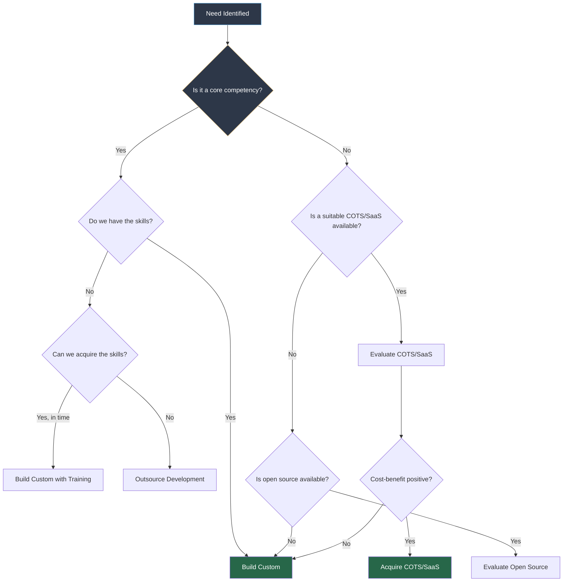
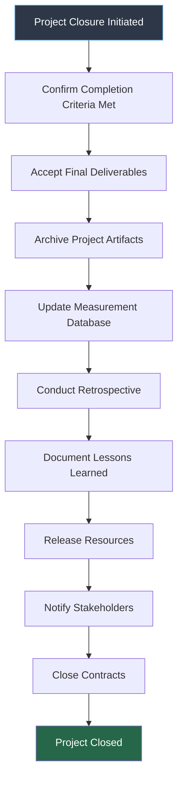
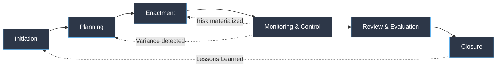

---
tags:
  - software-engineering
  - swebok
  - ka09
  - risk-management
  - project-control
  - earned-value
  - software-acquisition
  - project-closure
  - project-management
source: "SWEBOK v4 Chapter 09"
created: 2026-07-21
---

# Risk Management and Project Control

> **SWEBOK KA 9.3-9.5:** Software Project Enactment, Review and Evaluation, Closure
> *"The essence of risk management is not the elimination of risk, but the intelligent management of risk so that the rewards outweigh the dangers."*

---

## 1. Formal Risk Management

### What Is Risk?

A risk is a potential event or condition that, if it occurs, has a negative effect on one or more project objectives (scope, schedule, cost, or quality). Risk is characterized by:

$$\text{Risk Exposure} = \text{Probability} \times \text{Impact}$$

| Term | Definition |
|---|---|
| **Risk Event** | The uncertain event that may occur |
| **Risk Probability** | Likelihood of occurrence (0 to 1) |
| **Risk Impact** | Consequence if the risk materializes (cost, schedule, quality) |
| **Risk Exposure** | Expected value: Probability x Impact |
| **Risk Trigger** | Indicator that the risk is about to occur or has occurred |
| **Residual Risk** | Risk remaining after mitigation |
| **Secondary Risk** | New risk created by the mitigation strategy |

### Two Categories of Risk

| Category | Description | Examples |
|---|---|---|
| **Generic Risks** | Common to all software projects | Unstable requirements, staff turnover, schedule pressure |
| **Project-Specific Risks** | Unique to the particular project | Novel technology, unusual regulatory constraint, single-point-of-failure dependency |

---

## 2. Risk Identification

Risk identification is the systematic process of determining what risks might affect the project and documenting their characteristics.

### Risk Identification Techniques

| Technique | Description | Best For |
|---|---|---|
| **Brainstorming** | Group generates risks without filtering | Early identification, team engagement |
| **Checklist Analysis** | Use predefined risk checklists | Leveraging organizational experience |
| **SWOT Analysis** | Strengths, Weaknesses, Opportunities, Threats | Strategic risk perspective |
| **Decomposition** | Break the project into components and analyze each | Technical risks |
| **Assumption Analysis** | Challenge every assumption; each is a potential risk | Hidden risks |
| **Interviews** | Ask stakeholders and experts what keeps them up at night | Stakeholder-specific risks |
| **Root Cause Analysis** | Work backward from potential failures | Systematic risk discovery |
| **Lessons Learned** | Review similar past projects | Known recurring risks |

### Boehm's Top 10 Software Risk Items

| # | Risk Item | Risk Reduction Strategies |
|---|---|---|
| 1 | **Personnel shortfalls** | Staff with top talent; assign key roles early; team building; training; cross-training |
| 2 | **Unrealistic schedule and budget** | Multi-source estimation; incremental development; requirements prioritization |
| 3 | **Developing the wrong functions** | Organizational analysis; formal requirements methods; user surveys; prototyping |
| 4 | **Developing the wrong user interface** | Prototyping; scenarios; task analysis; user participation |
| 5 | **Gold plating** | Requirements trimming; cost-benefit analysis; change control |
| 6 | **Continuous requirements changes** | High change threshold; information hiding; incremental development; change control board |
| 7 | **Inadequate externally performed tasks** | Reference checks; pre-award audits; competitive design/build |
| 8 | **Inadequate externally supplied components** | Benchmarking; compatibility analysis; inspection; contract terms |
| 9 | **Real-time performance shortfalls** | Simulation; benchmarking; prototyping; tuning |
| 10 | **Straining computer science capabilities** | Technical analysis; cost-benefit analysis; prototyping; reference checks |

---

## 3. Risk Register

The risk register is the central document for tracking all identified risks throughout the project lifecycle.

### Risk Register Template

```yaml
Risk Register:
  Risk ID: R-001
  Title: Key developer departure
  Category: Personnel
  Description: Lead backend developer may leave due to
    market demand for their skills
  Probability: 0.3 (30%)
  Impact: High (4-week schedule delay, knowledge loss)
  Risk Exposure: 0.3 x 4 weeks = 1.2 weeks expected delay
  Risk Score: High (9/25 on probability x impact matrix)
  Trigger: Developer submits resignation or mentions job search
  Mitigation Strategy:
    - Cross-train second developer on critical modules
    - Document architecture decisions in ADRs
    - Maintain up-to-date code documentation
  Mitigation Cost: 2 person-weeks of cross-training
  Contingency Plan: Engage contractor from pre-approved vendor list
  Owner: Engineering Manager
  Status: Open
  Last Reviewed: 2026-07-21
  Next Review: 2026-08-04
```

---

## 4. Risk Assessment: Probability x Impact Matrix

### The Risk Matrix

The probability-impact matrix is the standard tool for prioritizing risks:

```
             IMPACT
             Very Low  Low    Medium  High   Very High
            (0.05)    (0.10) (0.20)  (0.40) (0.80)
           ┌─────────┬──────┬───────┬──────┬─────────┐
Very High  │   0.02  │ 0.04 │  0.08 │ 0.16 │   0.32  │
(0.90)     │  Medium │  Med │  High │  V.H │  V.High │
           ├─────────┼──────┼───────┼──────┼─────────┤
High       │   0.02  │ 0.03 │  0.06 │ 0.12 │   0.24  │
(0.70)     │  Medium │  Med │  Med  │ High │  V.High │
           ├─────────┼──────┼───────┼──────┼─────────┤
Medium     │   0.01  │ 0.02 │  0.04 │ 0.08 │   0.16  │
(0.50)     │   Low   │  Med │  Med  │ High │  V.High │
           ├─────────┼──────┼───────┼──────┼─────────┤
Low        │   0.01  │ 0.01 │  0.02 │ 0.04 │   0.08  │
(0.30)     │   Low   │ Low  │  Med  │  Med │  High   │
           ├─────────┼──────┼───────┼──────┼─────────┤
Very Low   │   0.005 │ 0.01 │  0.01 │ 0.02 │   0.04  │
(0.10)     │   Low   │ Low  │  Low  │ Low  │  Medium │
           └─────────┴──────┴───────┴──────┴─────────┘

PROBABILITY
```

### Risk Response Strategies

| Strategy | Description | When to Use |
|---|---|---|
| **Avoid** | Change the plan to eliminate the threat entirely | High-probability, high-impact risks that can be eliminated |
| **Transfer** | Shift the impact to a third party (insurance, outsourcing, contracts) | Risks that can be covered by another party |
| **Mitigate** | Reduce probability or impact (or both) | Most risks; the default strategy |
| **Accept** | Acknowledge the risk without proactive action | Low-priority risks; unavoidable risks |
| **Exploit** (positive risk) | Ensure the opportunity is realized | High-value opportunities |
| **Share** (positive risk) | Allocate ownership to a third party best able to capture the opportunity | Opportunities requiring external capability |

> [!tip] Risk Reduction Leverage
> Prioritize mitigation efforts by their leverage:
> $$\text{Risk Reduction Leverage} = \frac{\text{RE}_{before} - \text{RE}_{after}}{\text{Cost of Mitigation}}$$
> Invest in high-leverage mitigations first. A mitigation that costs more than the expected loss is not worth doing.

---

## 5. Risk Monitoring

Risk management is not a one-time activity. Risks must be continuously monitored and reassessed throughout the project.

### Risk Monitoring Activities

| Activity | Frequency | Purpose |
|---|---|---|
| **Risk Review Meeting** | Every 2-4 weeks | Assess status of top risks, identify new risks |
| **Risk Trigger Monitoring** | Continuous | Watch for indicators that risks are materializing |
| **Risk Audit** | At phase gates | Evaluate effectiveness of risk responses |
| **Status Reporting** | Weekly/Biweekly | Communicate risk status to stakeholders |
| **Retrospective** | End of sprint/phase | Identify emerging risks from recent work |

### Risk Burndown

A risk burndown chart tracks the total risk exposure over time. As risks are mitigated or materialize, the total exposure should decrease.

```
Total Risk Exposure
(Story Points or Cost)
│
│ █████████████████████
│ ██████████████████████████
│ ██████████████████████████████
│ ██████████████████████████████████
│ ████████████████████████████████████████
│ █████████████████████████████████████████████
│ ██████████████████████████████████████████████████
│ ░░░░░░░░░░░░░░░░░░░░░░░░░░░░░░░░░░░░░░░░░░░░░░░░░░░░░░░░░░
└──────────────────────────────────────────────────────────────→ Time
  Project  Sprint  Sprint  Sprint  Sprint  Sprint  Sprint  Release
  Start     1       2       3       4       5       6

  ████ = Unmitigated risk exposure
  ░░░░ = Target risk exposure trajectory
```

---

## 6. Software Acquisition Management

SWEBOK KA 9.3 addresses the management of software acquisition: the decision to build, buy, or reuse software components.

### Acquisition Strategies

| Strategy | Description | Pros | Cons |
|---|---|---|---|
| **Custom Development** | Build from scratch | Full control, exact fit to requirements | Expensive, time-consuming, maintenance burden |
| **COTS (Commercial Off-The-Shelf)** | Buy an existing commercial product | Fast deployment, vendor support, proven | May not fit exactly, vendor lock-in, licensing costs |
| **Open Source** | Use freely available software | No licensing cost, community support, auditable | No warranty, may need customization, security varies |
| **SaaS (Software as a Service)** | Subscribe to a cloud service | Minimal infrastructure, auto-updates, pay-per-use | Data sovereignty concerns, internet dependency, limited customization |
| **Outsourcing** | Hire external team to build | Access to specialized skills, variable cost | Communication overhead, IP risk, quality risk |

### Build vs. Buy Decision Framework



### Acquisition Management Activities

| Activity | Description |
|---|---|
| **Requirements Specification** | Define what the acquired component must do |
| **Vendor Evaluation** | Assess candidates against criteria (functionality, cost, support, risk) |
| **Contract Negotiation** | Define terms, SLAs, warranties, source code escrow |
| **Integration Planning** | Plan how the component interfaces with the rest of the system |
| **Acceptance Testing** | Verify the component meets requirements |
| **Vendor Management** | Ongoing relationship management, SLA monitoring |
| **License Compliance** | Track and comply with license terms (especially open source) |

### COTS Integration Risks

| Risk | Description | Mitigation |
|---|---|---|
| **Feature Gap** | COTS does not cover all requirements | Gap analysis early; accept workarounds or custom extensions |
| **Version Lock** | Upgrading breaks customizations | Minimize customizations; use extension points |
| **Vendor Viability** | Vendor goes out of business | Source code escrow; evaluate vendor financial health |
| **Data Migration** | Moving data in/out is difficult | Negotiate data portability; use standard formats |
| **Hidden Costs** | License, maintenance, training exceed budget | TCO analysis including 5-year horizon |

---

## 7. Monitoring, Controlling, and Reporting

### Earned Value Management (EVM)

EVM is the gold standard for integrated cost and schedule performance measurement.

**Three fundamental EVM measures:**

| Measure | Abbreviation | Definition |
|---|---|---|
| **Planned Value** | PV (or BCWS) | Budgeted cost of work scheduled (what we planned to spend by now) |
| **Earned Value** | EV (or BCWP) | Budgeted cost of work performed (what we actually completed, valued at budget) |
| **Actual Cost** | AC (or ACWP) | Actual cost of work performed (what we actually spent) |

**Derived EVM metrics:**

| Metric | Formula | Interpretation |
|---|---|---|
| **Cost Variance (CV)** | EV - AC | Positive = under budget; Negative = over budget |
| **Schedule Variance (SV)** | EV - PV | Positive = ahead of schedule; Negative = behind schedule |
| **Cost Performance Index (CPI)** | EV / AC | > 1.0 = under budget; < 1.0 = over budget |
| **Schedule Performance Index (SPI)** | EV / PV | > 1.0 = ahead of schedule; < 1.0 = behind schedule |
| **Estimate at Completion (EAC)** | BAC / CPI | Projected total cost based on current performance |
| **Estimate to Complete (ETC)** | EAC - AC | Remaining cost to complete the project |
| **Variance at Completion (VAC)** | BAC - EAC | Expected budget surplus or shortfall at completion |
| **To-Complete Performance Index (TCPI)** | (BAC - EV) / (BAC - AC) | Required CPI for remaining work to meet budget |

> [!example] EVM Worked Example
> Project Budget at Completion (BAC) = $1,000,000
> At month 6:
> - PV = $600,000 (we planned to complete $600K of work)
> - EV = $500,000 (we actually completed $500K worth of work)
> - AC = $550,000 (we actually spent $550K)
>
> Analysis:
> - CV = $500K - $550K = **-$50K** (over budget)
> - SV = $500K - $600K = **-$100K** (behind schedule)
> - CPI = $500K / $550K = **0.91** (spending $1.10 for every $1.00 of value)
> - SPI = $500K / $600K = **0.83** (completing only 83% of planned work)
> - EAC = $1M / 0.91 = **$1,099K** (projected to exceed budget by ~$100K)
>
> Conclusion: The project is both over budget and behind schedule. Corrective action is needed.

### EVM Trend Chart

```
Cost ($K)
│                                        / EAC ($1,099K)
│                                      /
│                              ╱ AC ──╱──── Actual Cost
│                            ╱       /
│                    ╱─────╱───────╱── BAC ($1,000K)
│                  ╱     ╱  ╱
│            ╱───╱────╱──╱  ← EV ── Earned Value
│          ╱   ╱   ╱
│    ╱───╱───╱── PV ── Planned Value
│  ╱   ╱
│╱
└────────────────────────────────────────────→ Time
  Month 1  2  3  4  5  6  7  8  9  10  11  12
```

### Variance Analysis

Variance analysis examines the **causes** of deviations from the plan. Key areas:

| Area | What to Analyze | Corrective Actions |
|---|---|---|
| **Schedule Variance** | Which tasks are behind? Why? | Re-sequence, add resources, reduce scope, fast-track |
| **Cost Variance** | Where is spending exceeding budget? | Reduce scope, negotiate costs, improve efficiency |
| **Scope Variance** | Is scope being added without approval? | Enforce change control, update baseline |
| **Quality Variance** | Are defect rates within limits? | Add testing, improve reviews, address root causes |
| **Resource Variance** | Are people available as planned? | Reallocate, hire, cross-train, adjust schedule |

### Status Reporting

Effective status reporting communicates the right information to the right audience at the right frequency.

| Report Type | Audience | Frequency | Content |
|---|---|---|---|
| **Daily Standup** | Team | Daily | What I did, what I'll do, blockers |
| **Sprint Review** | Team + Stakeholders | Per sprint | Demo, feedback, velocity |
| **Status Report** | Management | Weekly/Biweekly | Progress, issues, risks, metrics |
| **Dashboard** | Organization | Real-time | KPIs, health indicators, trends |
| **Steering Committee** | Executives | Monthly/Quarterly | Strategic progress, decisions needed, financials |

### Status Report Template

```yaml
Project Status Report:
  Date: 2026-07-21
  Project: E-Commerce Platform v2.0
  Overall Status: Yellow (At Risk)

  Summary:
    - Sprint 6 completed with 85% of committed stories
    - Integration testing delayed by 3 days due to API changes
    - Two new risks identified (vendor dependency, performance)

  Schedule: SPI = 0.92 (slightly behind)
  Cost: CPI = 0.97 (slightly over budget)
  Quality: Defect rate = 0.8 defects/story (target < 1.0)

  Key Accomplishments:
    - User authentication module completed
    - Payment gateway integration 80% complete

  Key Issues:
    - Third-party API changed without notice
    - Lead developer on leave for 2 weeks

  Risks:
    - R-003: Vendor API stability (Probability: High, Impact: Medium)
    - R-005: Performance degradation under load (Probability: Medium, Impact: High)

  Decisions Needed:
    - Approve additional budget for performance testing tools
    - Approve 1-week schedule extension for integration testing
```

---

## 8. Review and Evaluation

SWEBOK KA 9.4 covers systematic review and evaluation of project performance.

### Review Types

| Review Type | Focus | Participants | Timing |
|---|---|---|---|
| **Requirements Review** | Correctness, completeness of requirements | All stakeholders | After requirements phase |
| **Design Review** | Architecture and design quality | Technical leads, architects | After design phase |
| **Code Review** | Code quality, standards compliance | Developers, QA | During development |
| **Test Readiness Review** | Testability, test plan completeness | QA leads, developers | Before testing phase |
| **Phase Gate Review** | Overall phase completion and readiness | Management, stakeholders | End of each phase |
| **Post-Mortem / Retrospective** | Lessons learned, process improvement | Full team | End of project/phase |

### Evaluation Criteria

| Area | Metrics | Target |
|---|---|---|
| **Stakeholder Satisfaction** | NPS, satisfaction survey scores | > 80% satisfaction |
| **Requirements Coverage** | % of requirements implemented and tested | 100% |
| **Defect Density** | Defects per KLOC or per function point | Below industry baseline |
| **Schedule Performance** | SPI (Schedule Performance Index) | 0.95 - 1.05 |
| **Cost Performance** | CPI (Cost Performance Index) | 0.95 - 1.05 |
| **Team Productivity** | Story points per sprint, LOC per person-month | Improving trend |
| **Process Compliance** | % of activities following defined process | > 90% |

---

## 9. Project Closure

SWEBOK KA 9.5 addresses the activities required to formally close a project.

### Closure Activities



### Completion Criteria

Before closing, verify that all completion criteria are satisfied:

| Criterion | Verification Method |
|---|---|
| All requirements implemented | Requirements traceability matrix |
| All tests passed | Test execution report |
| All defects resolved or deferred (with approval) | Defect tracking system |
| Documentation complete | Document checklist |
| Training delivered | Training completion records |
| Deployment successful | Deployment verification checklist |
| Stakeholder acceptance obtained | Formal sign-off document |

### Archiving

Project artifacts must be preserved for future reference and organizational learning:

| Artifact | Storage Location | Retention Period |
|---|---|---|
| Source code | Version control system (tagged release) | Permanent |
| Project plan and schedule | Document management system | 5+ years |
| Requirements and design documents | Document management system | Life of the product |
| Test artifacts | Test management system | 3+ years |
| Meeting minutes and decisions | Document management system | 3+ years |
| Risk register | Document management system | 5+ years |
| Lessons learned | Organizational knowledge base | Permanent |
| Contracts and legal documents | Legal document store | Per legal requirements |
| Measurement data | Measurement database | Permanent |

> [!warning] Secure Destruction
> SWEBOK emphasizes that sensitive data (credentials, personal data, proprietary information) must be **securely destroyed** when no longer needed, not just archived. Compliance with data protection regulations (GDPR, CCPA) requires careful handling of personal data throughout and after the project.

### Retrospectives

The retrospective is the primary mechanism for organizational learning from projects.

**Retrospective Format (Start/Stop/Continue):**

| Category | Questions |
|---|---|
| **Start** | What should we begin doing that we didn't do? |
| **Stop** | What should we stop doing because it didn't add value? |
| **Continue** | What worked well and should be preserved? |

**Retrospective Best Practices:**
1. Hold the retrospective **soon after** the project ends (within 1-2 weeks)
2. Include all team members, not just leads
3. Create a **blame-free** environment; focus on process, not people
4. Document specific, actionable recommendations
5. Assign owners and due dates for improvement actions
6. Track improvement actions to completion in the next project

### Lessons Learned

Lessons learned capture both what went well and what went poorly:

```yaml
Lessons Learned:
  Project: E-Commerce Platform v2.0

  What Went Well:
    - Early prototyping reduced UI rework by 60%
    - Cross-training prevented knowledge silos during vacations
    - Daily standups kept blockers visible and resolved quickly

  What Could Improve:
    - Third-party API integration should have been prototyped earlier
    - Performance testing started too late; should begin with first sprint
    - Documentation was an afterthought; allocate time per sprint

  Recommendations:
    - Add API spike to Definition of Done for any external integration
    - Include performance acceptance criteria in all user stories
    - Allocate 10% of each sprint for documentation tasks
    - Maintain a living integration test environment from Sprint 1

  Quantitative Summary:
    - Planned Duration: 12 months | Actual: 13 months
    - Planned Budget: $1.2M | Actual: $1.35M
    - Planned Scope: 200 story points | Delivered: 185 story points
    - Final Quality: 0.6 defects/story point (target: < 1.0)
```

---

## 10. Integration: The Management Lifecycle

These activities form a continuous cycle, not a linear sequence:



> [!note] Dev/Sec/Ops Culture
> Modern software management increasingly integrates development, security, and operations into a single team culture focused on continuous incremental delivery. This reduces handoffs, shortens feedback loops, and makes security a shared responsibility rather than a gate.

---

## Key Concepts Summary

| Concept | Core Point |
|---|---|
| **Risk Exposure** | Probability x Impact; the expected value of the risk |
| **Risk Register** | Central tracking document for all identified risks |
| **Probability-Impact Matrix** | Visual tool for prioritizing risks |
| **Risk Response** | Avoid, Transfer, Mitigate, Accept |
| **CPI / SPI** | Cost and Schedule Performance Indices from EVM |
| **Earned Value** | Integrated measure of cost and schedule performance |
| **EAC** | Projected total cost based on current performance trends |
| **Software Acquisition** | Build vs. Buy decision; COTS, open source, SaaS evaluation |
| **Retrospective** | Structured reflection for continuous improvement |
| **Lessons Learned** | Organizational knowledge capture for future projects |
| **Project Closure** | Formal completion, archiving, resource release |

---

## Related

- [[06_Project_Initiation_and_Scope]]: Scope definition and feasibility analysis
- [[07_Estimation_and_Planning]]: Effort estimation and scheduling techniques
- [[01_Managing_the_Human Resource]]: Human factors in project management
- [[04_Growing_Productive_Teams]]: Team dynamics relevant to risk and closure
- [[Software Engineering Management Overview]]: Full KA 09 overview
- [[11_Project_Planning_and_Management]]: Detailed WBS, CPM, PERT treatment
