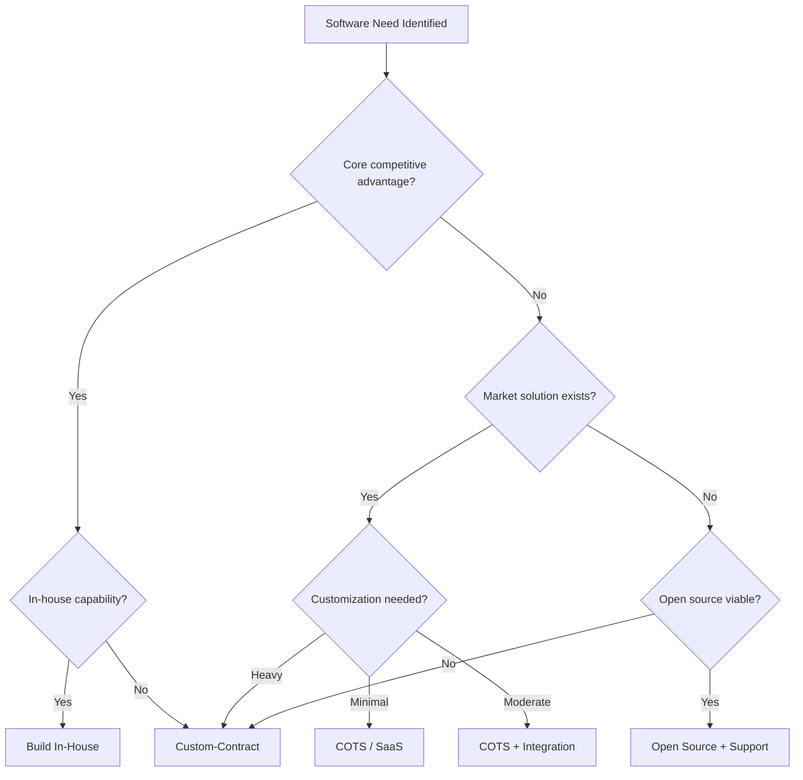
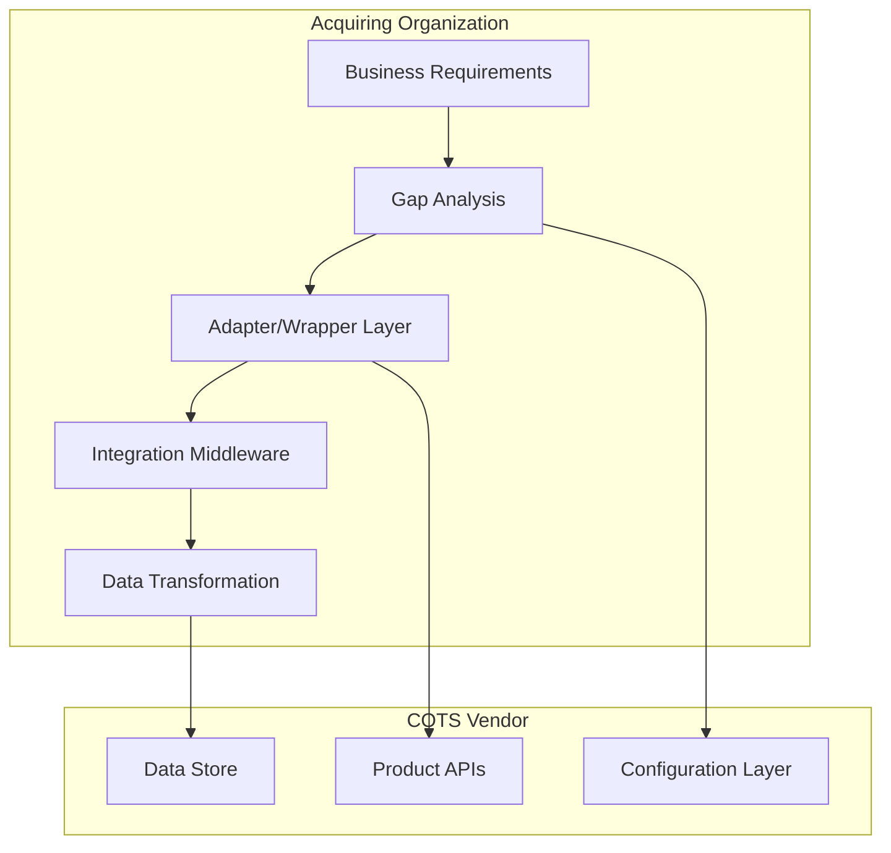
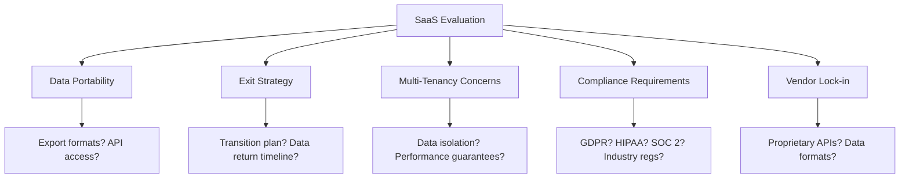
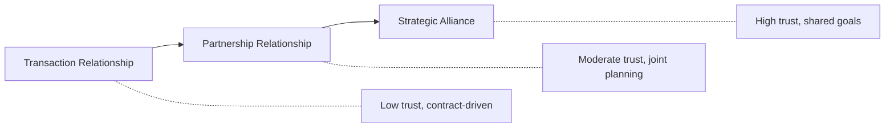

# Software Acquisition Management

**Knowledge Area:** KA 09 - Software Engineering Management (SWEBOK v4 Ch09, Section 09.3)
**Tags:** #software-engineering #swebok #ka09 #acquisition #procurement

---

## 1. Overview

Software acquisition management addresses the processes for obtaining software products and services from external sources. As modern software systems increasingly rely on externally sourced components, effective acquisition management has become a critical discipline within [[01_Overview|Software Engineering Management]].

> [!info] SWEBOK Reference
> Software acquisition management covers the full lifecycle from make/buy decisions through contract closure, encompassing vendor selection, contract management, integration, and ongoing supplier relationship management.

---

## 2. Software Acquisition Classes

Organizations source software through multiple channels, each with distinct management implications:

| Acquisition Class | Description | Typical Use Case | Key Risk |
|---|---|---|---|
| **COTS** (Commercial Off-The-Shelf) | Purchased commercial products with no modification | Email systems, ERP, databases | Customization limits |
| **Custom-Contracted** | Bespoke software built by external vendor to spec | Domain-specific systems | Requirements misunderstanding |
| **Open Source** | Freely available software with open licenses | Infrastructure, libraries, frameworks | Support and maintenance gaps |
| **Customer-Loaned Personnel** | Staff embedded from the acquiring org into vendor team | Knowledge transfer, oversight | Dual reporting conflicts |
| **SaaS** (Software as a Service) | Cloud-hosted subscription services | CRM, analytics, collaboration | Data portability and lock-in |
| **Hybrid** | Combination of two or more classes above | Enterprise platforms | Integration complexity |

### 2.1 Acquisition Class Selection Criteria



---

## 3. Acquisition Lifecycle

### 3.1 Make/Buy Decision Analysis

The acquisition lifecycle begins with the make/buy decision, documented in the [[03_Planning_and_Estimating|project plan]]:

| Factor | Make (In-House) | Buy (Acquire) |
|---|---|---|
| Strategic alignment | Core competency preserved | Focus on differentiators |
| Cost (short-term) | Higher initial investment | Lower upfront, recurring fees |
| Cost (long-term) | Potentially lower TCO | Vendor price escalation risk |
| Time to market | Slower | Faster |
| Control | Full | Limited by contract |
| Maintenance burden | Internal team | Vendor or community |
| Intellectual property | Owned | Licensed |
| Risk | Execution risk | Vendor dependency risk |

### 3.2 Market Research

Before issuing solicitations, conduct structured market research:

- **Technology landscape scan**: Identify available solutions and vendors
- **Request for Information (RFI)**: Solicit vendor capabilities without commitment
- **Industry benchmarking**: Compare solutions against peers
- **Proof of concept**: Evaluate shortlisted options with real scenarios
- **Reference checks**: Contact existing customers of candidate vendors

### 3.3 Solicitation Documents

| Document | Purpose | When to Use |
|---|---|---|
| **RFI** (Request for Information) | Market research, gather capabilities | Early exploration phase |
| **RFP** (Request for Proposal) | Detailed requirements, ask for solutions | Complex custom or integration work |
| **RFQ** (Request for Quotation) | Specific product/service pricing | Well-defined commodity purchases |

### 3.4 Vendor Evaluation and Selection

```mermaid
flowchart LR
    A[Define Evaluation Criteria] --> B[Weight Criteria]
    B --> C[Collect Vendor Proposals]
    C --> D[Technical Evaluation]
    D --> E[Commercial Evaluation]
    E --> F[Reference Checks]
    F --> G[Vendor Presentations/Demos]
    G --> H[Scoring and Ranking]
    H --> I[Selection Decision]
    I --> J[Contract Negotiation]
```



**Evaluation criteria typically include:**

- Technical fit and architecture alignment
- Total cost of ownership (TCO)
- Vendor financial stability and market position
- Support and maintenance offerings
- Compliance and security posture
- Integration complexity with existing systems (see [[06_Configuration_and_Change_Management|configuration management]])
- Scalability and performance benchmarks

### 3.5 Contract Types

| Contract Type | Risk Allocation | Best For |
|---|---|---|
| **Fixed-Price (FP)** | Vendor bears cost risk | Well-defined requirements |
| **Time-and-Materials (T&M)** | Acquirer bears cost risk | Evolving requirements |
| **Cost-Plus (CP)** | Acquirer bears most risk | Research/innovation projects |
| **Incentive Fee** | Shared risk/reward | Performance-driven outcomes |
| **Firm Fixed-Price (FFP)** | Maximum vendor risk | Commodity purchases |
| **Cost-Plus-Incentive-Fee (CPIF)** | Balanced risk sharing | Complex custom development |

### 3.6 Contract Negotiation and Closure

Key negotiation areas:
- Scope definition and change control procedures (see [[05_Monitoring_and_Control|monitoring and control]])
- Payment milestones tied to deliverables
- Intellectual property ownership
- Warranty and liability terms
- Service level agreements (SLAs)
- Exit and transition clauses
- Dispute resolution mechanisms

---

## 4. COTS Integration Challenges

COTS products require careful integration management:

### 4.1 Customization vs. Configuration

| Approach | Definition | Maintenance Impact |
|---|---|---|
| **Configuration** | Using built-in settings, parameters, options | Survives vendor upgrades |
| **Customization** | Modifying source code or adding extensions | Breaks on vendor upgrades |

> [!warning] The Customization Trap
> Deep COTS customization creates a fork that makes every vendor upgrade a manual merge. Organizations should exhaust configuration options before resorting to customization, and document all customizations for upgrade impact analysis.

### 4.2 COTS Integration Risk Matrix

| Challenge | Description | Mitigation |
|---|---|---|
| **Upgrade compatibility** | Vendor updates may break custom integrations | Regression test suites, staging environments |
| **Data migration** | Moving data between COTS versions or products | ETL pipelines, data validation scripts |
| **Vendor lock-in** | Dependency on proprietary formats/APIs | Abstract interfaces, data export requirements |
| **Interoperability** | COTS products from different vendors must work together | Standards-based integration, middleware |
| **Feature gaps** | COTS may not cover 100% of requirements | Gap analysis, complementary custom modules |
| **Licensing complexity** | Per-user, per-core, consumption-based models | License management tools, usage monitoring |

### 4.3 COTS Integration Architecture



---

## 5. Open Source Management

### 5.1 License Compliance

Open source licenses impose obligations that organizations must understand and track:

| License | Type | Key Obligation |
|---|---|---|
| **GPL v2/v3** | Copyleft (strong) | Derivative works must be GPL; source disclosure required |
| **LGPL** | Copyleft (weak) | Library usage allowed without disclosure; modifications to library itself must be LGPL |
| **MIT** | Permissive | Attribution only; no disclosure requirement |
| **Apache 2.0** | Permissive | Attribution + patent grant; no disclosure requirement |
| **BSD 2/3-Clause** | Permissive | Attribution; no endorsement clause |
| **MPL 2.0** | Copyleft (file-level) | Modified files must be MPL; unmodified files can use other licenses |
| **AGPL** | Copyleft (network) | Network use triggers disclosure obligation |

> [!tip] License Compatibility
> When combining open source components, ensure license compatibility. GPL code cannot be linked with proprietary code under most interpretations. Use license scanning tools (FOSSA, Black Duck, ScanCode) to automate compliance.

### 5.2 Open Source Management Practices

- **Inventory management**: Maintain a bill of materials (SBOM) for all open source components
- **Vulnerability tracking**: Subscribe to CVE feeds, use tools like Dependabot, Snyk
- **Community health assessment**: Evaluate project activity, maintainer responsiveness, bus factor
- **Contribution policies**: Define rules for contributing upstream and accepting community patches
- **License scanning**: Automate license detection in CI/CD pipelines (related to [[08_Measurement_and_Evaluation|measurement and evaluation]])
- **Version pinning**: Lock dependency versions to avoid supply chain attacks

---

## 6. SaaS Evaluation

### 6.1 SLA Negotiation Framework

| SLA Dimension | Key Metrics | Typical Target |
|---|---|---|
| **Availability** | Uptime percentage | 99.9% or higher |
| **Performance** | Response time, throughput | <200ms p95 latency |
| **Recovery** | RTO (Recovery Time Objective), RPO (Recovery Point Objective) | RTO <4h, RPO <1h |
| **Support** | Response time by severity | P1: 15min, P2: 4h, P3: 1 business day |
| **Security** | Certification, audit frequency | SOC 2 Type II, annual pen test |

### 6.2 SaaS Risk Assessment



### 6.3 Data Portability Checklist

- [ ] Data export in standard formats (CSV, JSON, XML)
- [ ] API access for automated extraction
- [ ] Bulk data download capability
- [ ] Documented data schema
- [ ] Transition/migration assistance included in contract
- [ ] Data retention period post-termination defined

---

## 7. Vendor Management

### 7.1 Vendor Performance Monitoring

Continuous vendor monitoring ensures contractual obligations are met:

| Activity | Frequency | Owner |
|---|---|---|
| SLA compliance review | Monthly | Project Manager |
| Deliverable quality assessment | Per milestone | Technical Lead |
| Invoice verification | Per billing cycle | Finance/Procurement |
| Risk register update | Bi-weekly | Risk Manager |
| Relationship review | Quarterly | Senior Management |
| Contract compliance audit | Annually | Legal/Compliance |

### 7.2 Vendor Relationship Management



### 7.3 Dispute Resolution Escalation

```
Level 1: Project-level negotiation (PM <-> Vendor PM)
Level 2: Management escalation (Director <-> Vendor Account Exec)
Level 3: Executive escalation (VP/C-level <-> Vendor VP)
Level 4: Mediation (Neutral third party)
Level 5: Arbitration/Litigation (Legal proceedings)
```

### 7.4 Contract Amendment Process

Contract changes follow a controlled process aligned with [[04_Tracking_and_Adjusting|project tracking]]:

1. Change request initiated (by either party)
2. Impact analysis (scope, cost, schedule, risk)
3. Negotiation of revised terms
4. Legal review and approval
5. Amendment execution
6. Baseline update in project records

---

## 8. Acquisition Risk Management

### 8.1 Common Acquisition Risks

| Risk | Likelihood | Impact | Mitigation |
|---|---|---|---|
| Vendor financial instability | Medium | High | Financial due diligence, escrow clauses |
| Requirements misunderstanding | High | High | Prototyping, iterative delivery, acceptance criteria |
| Integration failure | Medium | High | Architecture review, proof of concept |
| Vendor lock-in | High | Medium | Exit clauses, abstraction layers, standards |
| Schedule slippage | High | Medium | Incremental delivery, penalty clauses |
| Quality defects | Medium | High | Acceptance testing, warranty periods |
| Key personnel departure | Medium | Medium | Knowledge transfer, team size requirements |
| Scope creep (T&M) | High | Medium | Change control, budget caps |

### 8.2 Risk Response Strategies

- **Avoid**: Choose build-in-house over acquisition
- **Mitigate**: Proof of concept, phased rollout, escrow agreements
- **Transfer**: Warranty clauses, liability caps, insurance
- **Accept**: Documented risk acceptance by stakeholders

---

## 9. Relationship to Other Knowledge Areas

Software acquisition management intersects with multiple management disciplines:

- [[02_Initiation_and_Scope_Definition|Initiation and Scope Definition]]: Requirements drive make/buy decisions
- [[03_Planning_and_Estimating|Planning and Estimating]]: Acquisition timelines affect project schedules
- [[04_Tracking_and_Adjusting|Tracking and Adjusting]]: Vendor deliverables require monitoring
- [[05_Monitoring_and_Control|Monitoring and Control]]: Contract compliance oversight
- [[06_Configuration_and_Change_Management|Configuration and Change Management]]: COTS version and configuration tracking
- [[07_Risk_Management|Risk Management]]: Acquisition-specific risk identification and response
- [[08_Measurement_and_Evaluation|Measurement and Evaluation]]: Vendor performance metrics

---

## 10. Key Takeaways

1. **Match acquisition class to need**: COTS, custom, open source, SaaS, and hybrid each serve different contexts
2. **Structure the lifecycle**: RFI/RFP/RFQ, evaluation criteria, contract types, and negotiation are sequential and interdependent
3. **Manage COTS carefully**: Favor configuration over customization; plan for upgrade compatibility
4. **Open source has obligations**: License compliance, SBOM tracking, and vulnerability monitoring are mandatory
5. **SaaS requires exit planning**: Data portability and vendor lock-in are strategic concerns
6. **Vendor management is ongoing**: Performance monitoring, relationship building, and dispute resolution continue throughout the contract

---

## References

- SWEBOK v4, Chapter 9: Software Engineering Management, Section 9.3
- IEEE 1062: Recommended Practice for Software Acquisition
- ISO/IEC 25000: Systems and Software Quality Requirements and Evaluation
- CMMI-DEV: Supplier Agreement Management (SAM) process area
