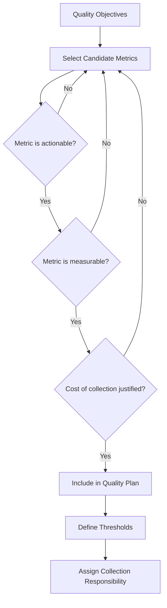
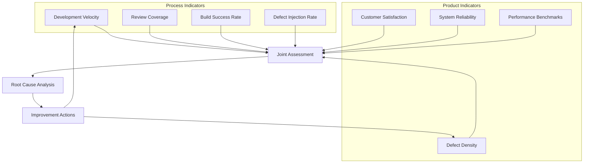
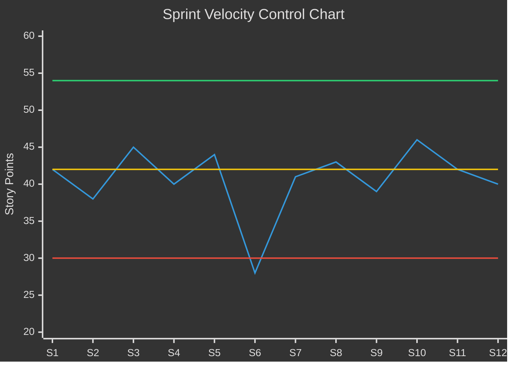
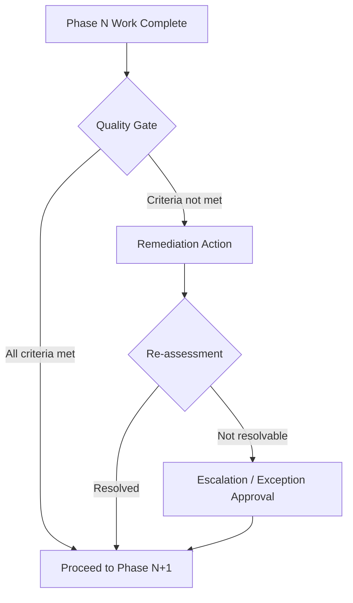

# Quality Planning and Process Monitoring

**Knowledge Area:** KA 09 - Software Engineering Management (SWEBOK v4 Ch09, Sections 09.4 and 09.6)
**Tags:** #software-engineering #swebok #ka09 #quality-planning #process-monitoring

---

## 1. Overview

Quality planning and process monitoring are complementary disciplines that ensure software products meet stakeholder expectations while engineering processes remain effective and improvable. Quality planning defines what "good" looks like; process monitoring measures whether the organization is getting there.

> [!info] SWEBOK Reference
> Section 09.4 covers quality planning in the project context, while Section 09.6 addresses the holistic relationship between process monitoring and product quality. Together they form the empirical foundation for [[01_Overview|software engineering management]].

---

## 2. Quality Planning in the Project Context

Quality planning translates organizational quality policy into project-specific objectives, metrics, and activities. It is performed during [[03_Planning_and_Estimating|project planning]] and maintained throughout [[05_Monitoring_and_Control|monitoring and control]].

### 2.1 Quality Objectives Definition

Quality objectives must be specific, measurable, and aligned with stakeholder expectations:

| Quality Characteristic | Example Objective | Measurement |
|---|---|---|
| **Reliability** | System uptime >= 99.9% | Monthly availability |
| **Performance** | API response time < 200ms p95 | Load testing results |
| **Security** | Zero critical vulnerabilities in production | Penetration test findings |
| **Usability** | Task completion rate >= 90% | User testing sessions |
| **Maintainability** | Code complexity < 15 (cyclomatic) | Static analysis |
| **Portability** | Deployment on 3 target environments | Environment test matrix |

### 2.2 Quality Metrics Selection

Select metrics that are actionable, traceable, and tied to quality objectives:



**Metric categories and examples:**

| Category | Metric | Target Example |
|---|---|---|
| **Defect metrics** | Defect density (defects/KLOC) | < 0.5 defects/KLOC |
| **Defect metrics** | Defect removal efficiency (DRE) | >= 95% |
| **Review metrics** | Code review coverage | 100% of changed code reviewed |
| **Review metrics** | Review defect detection rate | >= 30% of total defects found in reviews |
| **Test metrics** | Code coverage (line/branch) | >= 80% branch coverage |
| **Test metrics** | Test case pass rate | >= 97% at release |
| **Process metrics** | Cycle time (commit to deploy) | < 3 days |
| **Process metrics** | Build success rate | >= 95% |
| **Productivity** | Velocity (story points/sprint) | Stable within 20% variance |

### 2.3 Quality Assurance Activities Schedule

Quality assurance (QA) activities are scheduled across the project lifecycle:

| Phase | QA Activity | Purpose |
|---|---|---|
| **Requirements** | Requirements review | Verify completeness, consistency, testability |
| **Design** | Architecture review, design review | Validate design against requirements and quality attributes |
| **Implementation** | Code review, static analysis | Catch defects early, enforce coding standards |
| **Testing** | Test plan review, test execution | Verify product meets specifications |
| **Deployment** | Release readiness review | Confirm all quality gates passed |
| **Operations** | Post-deployment monitoring | Validate quality in production |

### 2.4 Quality Control Checkpoints

Quality control (QC) checkpoints are verification activities tied to [[08_Measurement_and_Evaluation|measurement and evaluation]]:


---

## 3. Defect, Review, and Test Coverage Targets

### 3.1 Defect Density Targets

Defect density varies by project type and domain criticality:

| Domain / Criticality | Target Defect Density | Rationale |
|---|---|---|
| Safety-critical (avionics, medical) | < 0.01 defects/KLOC | Standards mandate near-zero |
| Financial systems | < 0.1 defects/KLOC | High cost of failure |
| Enterprise applications | < 0.5 defects/KLOC | Industry benchmark |
| Web/mobile applications | < 1.0 defects/KLOC | Faster release cycles compensate |
| Prototypes/exploratory | < 5.0 defects/KLOC | Quality traded for speed |

### 3.2 Code Review Coverage Targets

| Practice | Target | Measurement |
|---|---|---|
| All production code reviewed | 100% | PR merge without review = 0% |
| Review turnaround time | < 4 hours | Time from PR creation to first review |
| Review participation | >= 2 reviewers for critical paths | Reviewer assignment tracking |
| Review checklist compliance | 100% | Checklist items addressed |

### 3.3 Test Coverage Targets

| Coverage Type | Minimum Target | Ideal Target | Notes |
|---|---|---|---|
| **Line coverage** | 70% | 90% | Basic execution coverage |
| **Branch coverage** | 60% | 80% | Decision point coverage |
| **Function/method coverage** | 80% | 95% | Entry point coverage |
| **Integration test coverage** | 70% of interfaces | 90% of interfaces | API and service boundaries |
| **Critical path coverage** | 100% | 100% | Non-negotiable for critical flows |

---

## 4. Process Monitoring and Product Quality Relationship

### 4.1 Joint Process/Product Assessment

Process performance directly influences product quality. A joint assessment examines both simultaneously:



### 4.2 Holistic Empirical Approach

The holistic empirical approach integrates multiple data sources for a complete quality picture:

| Data Source | What It Reveals | Example Signal |
|---|---|---|
| **Defect tracking** | Where defects originate and concentrate | 60% of defects in module X |
| **Version control** | Code churn, contributor patterns | High churn files correlate with defects |
| **CI/CD pipeline** | Build stability, deployment frequency | Build failures spike before releases |
| **Code review** | Review quality, knowledge sharing | Reviews with <2 comments correlate with escaped defects |
| **Customer support** | Production issues, user experience | Ticket volume by feature area |
| **Monitoring/APM** | Runtime behavior, performance degradation | Error rate increases after deployment |

### 4.3 Process Performance Baselines

Process performance baselines are established from historical data and serve as benchmarks:

| Metric | Baseline (Median) | Lower Control Limit | Upper Control Limit |
|---|---|---|---|
| Sprint velocity (story points) | 42 | 30 | 54 |
| Cycle time (days) | 4.5 | 2 | 8 |
| Defect escape rate | 8% | 2% | 15% |
| Code review coverage | 98% | 90% | 100% |
| Build failure rate | 5% | 0% | 12% |
| Deployment frequency (per week) | 3 | 1 | 5 |

> [!tip] Baseline Calibration
> Baselines should be recalibrated every 3-6 months or after significant process changes (new tools, team changes, methodology shifts). Stale baselines produce false alarms or mask genuine degradation.

### 4.4 Process Capability Analysis

Process capability measures how well a process performs relative to its specification limits:

**Capability indices:**

| Index | Formula | Interpretation |
|---|---|---|
| **Cp** | (USL - LSL) / 6σ | Process potential (spread vs. spec range) |
| **Cpk** | min((USL - μ) / 3σ, (μ - LSL) / 3σ) | Process centering + spread |

| Cpk Value | Capability Level | Action |
|---|---|---|
| < 0.67 | Inadequate | Process redesign required |
| 0.67 - 1.00 | Marginal | Improvement needed |
| 1.00 - 1.33 | Capable | Monitor and maintain |
| 1.33 - 1.67 | Highly capable | Process is well-controlled |
| > 1.67 | Excellent | Consider tightening specifications |

---

## 5. Statistical Process Control

### 5.1 Control Charts for Software Metrics

Statistical process control (SPC) charts distinguish between common cause variation (inherent in the process) and special cause variation (assignable to specific events).



**Common SPC chart types for software:**

| Chart Type | Metric | Purpose |
|---|---|---|
| **X-bar chart** | Sprint velocity, cycle time | Monitor central tendency over time |
| **R chart** | Range of cycle times within a sprint | Monitor process variability |
| **P chart** | Defect rate (defective/total) | Monitor proportion of defective items |
| **C chart** | Defects per unit (defects/release) | Monitor count of defects |
| **U chart** | Defects per KLOC | Monitor defect density when sample size varies |

### 5.2 Interpreting Control Chart Signals

A process is **out of control** (special cause present) when:

| Signal | Description | Response |
|---|---|---|
| Point beyond control limits | Single observation outside UCL or LCL | Investigate specific event |
| Run of 7+ points on one side | Systematic shift in process mean | Look for persistent factor |
| Trend of 7+ points in one direction | Gradual drift (improvement or degradation) | Identify driving factor |
| 2 of 3 points near same control limit | Early warning of limit breach | Monitor closely |
| Non-random patterns (cycles, clustering) | Periodic or grouped variation | Investigate systemic cause |

### 5.3 Process Dashboards

Process dashboards provide at-a-glance visibility into quality and process health:

| Dashboard Section | Metrics Displayed | Refresh Frequency |
|---|---|---|
| **Quality Health** | Defect density, DRE, escaped defects | Weekly |
| **Delivery Performance** | Velocity, cycle time, throughput | Per sprint |
| **Code Health** | Coverage, complexity, technical debt ratio | Daily (CI/CD) |
| **Process Stability** | Control charts for key metrics | Per sprint |
| **Risk Indicators** | Open risks, blockers, dependency status | Daily |

---

## 6. Quality Gates and Milestones

### 6.1 Quality Gate Definition

Quality gates are decision points where predefined criteria must be met before proceeding to the next phase or activity:



### 6.2 Entry/Exit Criteria by Phase

| Phase | Entry Criteria | Exit Criteria |
|---|---|---|
| **Requirements** | Business case approved, stakeholders identified | Requirements reviewed, traceability matrix complete, testable |
| **Design** | Requirements baseline established | Architecture reviewed, design reviewed, interfaces defined |
| **Implementation** | Design approved, development environment ready | Code reviewed, unit tests passing, static analysis clean |
| **Testing** | Code complete, test environment ready, test cases reviewed | All planned tests executed, critical defects resolved, test report approved |
| **Deployment** | Testing complete, release notes drafted, rollback plan ready | Deployment verified, smoke tests passing, monitoring active |
| **Operations** | Deployment complete | Post-deployment validation, incident monitoring baseline established |

### 6.3 Quality Gate Checklist Template

```markdown
## Quality Gate: [Gate Name]
**Date:** YYYY-MM-DD
**Decision:** [PASS / CONDITIONAL PASS / FAIL]
**Approver:** [Name/Role]

### Criteria
- [ ] All planned work items completed
- [ ] Code review coverage >= 100% of changes
- [ ] Unit test coverage >= 80% branch
- [ ] Integration tests passing
- [ ] No open P1/P2 defects
- [ ] Static analysis: 0 critical/blocker issues
- [ ] Performance benchmarks within acceptable range
- [ ] Security scan: no critical vulnerabilities
- [ ] Documentation updated
- [ ] Stakeholder sign-off obtained

### Exceptions (if CONDITIONAL PASS)
| Exception | Justification | Remediation Plan | Deadline |
|---|---|---|---|
| | | | |
```

### 6.4 Technical Debt Thresholds

Technical debt is tracked and gated to prevent uncontrolled accumulation:

| Metric | Green | Yellow | Red (Gate Blocked) |
|---|---|---|---|
| **Technical debt ratio** | < 5% | 5-10% | > 10% |
| **Code duplication** | < 3% | 3-5% | > 5% |
| **Cyclomatic complexity** | < 10 (avg) | 10-15 (avg) | > 15 (avg) |
| **Code smells per KLOC** | < 5 | 5-15 | > 15 |
| **TODO/FIXME count** | < 10 | 10-25 | > 25 |
| **Outdated dependencies** | 0 critical | 1-2 critical | > 2 critical |

### 6.5 Code Quality Thresholds

| Metric | Minimum Threshold | Description |
|---|---|---|
| **Maintainability rating** | A or B | SonarQube maintainability rating |
| **Reliability rating** | A | No bugs with high severity |
| **Security rating** | A | No security hotspots unresolved |
| **Duplicated lines** | < 3% | Code duplication percentage |
| **Cognitive complexity** | < 15 per method | Readability and understandability |
| **Technical debt** | < 5% of development time | Estimated remediation effort |

---

## 7. Continuous Improvement in Projects

### 7.1 Retrospectives as Quality Feedback

Retrospectives provide structured feedback loops for quality improvement:

| Retrospective Type | Frequency | Focus | Output |
|---|---|---|---|
| **Sprint retrospective** | End of each sprint | Process and collaboration | Action items for next sprint |
| **Release retrospective** | After each release | Product quality and delivery | Improvement initiatives |
| **Incident retrospective** | After significant incidents | Root cause and prevention | Corrective actions |
| **Project retrospective** | End of project | Lessons learned | Organizational knowledge base |

**Retrospective framework (What Went Well / What Needs Improvement / Action Items):**


### 7.2 Kaizen in Project Context

Kaizen (continuous improvement) applied to software projects:

| Kaizen Principle | Project Application |
|---|---|
| **Small, incremental changes** | Process tweaks each sprint rather than big-bang methodology changes |
| **Employee-driven improvement** | Team members propose and own improvement experiments |
| **Eliminate waste (Muda)** | Remove unnecessary handoffs, reduce wait times, automate repetitive tasks |
| **Standardize then improve** | Establish baselines before optimizing |
| **Go to the gemba (observe)** | Managers attend standups, review actual code, observe workflows |

**Common waste categories in software (adapted from Lean):**

| Waste | Software Example | Improvement |
|---|---|---|
| **Waiting** | Blocked on code review | Review WIP limits, async reviews |
| **Overproduction** | Features nobody uses | Validate with users before building |
| **Handoffs** | Requirements thrown over wall | Cross-functional teams |
| **Motion** | Context switching between projects | Limit WIP per person |
| **Defects** | Bugs found in production | Shift-left testing |
| **Over-processing** | Gold-plating, unnecessary documentation | Definition of done clarity |
| **Inventory** | Large backlog of unfinished work | Smaller batches |

### 7.3 Post-Project Quality Reviews

Post-project reviews capture quality insights for organizational learning:

**Review template:**

```markdown
## Post-Project Quality Review

### Quality Outcomes
- Final defect density: __ defects/KLOC
- Defect removal efficiency: __%
- Customer-reported defects (first 90 days): __
- Customer satisfaction score: __/5

### Quality Planning Effectiveness
- Were quality objectives achieved? [Yes/No/Partial]
- Were quality metrics useful for decision-making? [Yes/No]
- Were quality gates effective at catching issues? [Yes/No]
- Were quality thresholds appropriately calibrated? [Yes/No/Too strict/Too lenient]

### Process Performance
- Process capability (Cpk) for key metrics: __
- Control chart stability: [Stable/Unstable - explain]
- Most significant process improvement implemented: __
- Most significant process gap identified: __

### Lessons Learned
1. __
2. __
3. __

### Recommendations for Future Projects
1. __
2. __
3. __
```

---

## 8. Integrated Quality and Process Framework

### 8.1 Quality Planning to Process Monitoring Flow

```mermaid
flowchart TD
    subgraph Quality Planning
        A[Define Quality Objectives]
        B[Select Quality Metrics]
        C[Set Thresholds and Targets]
        D[Schedule QA Activities]
        E[Define Quality Gates]
    end
    subgraph Execution and Monitoring
        F[Execute QA Activities]
        G[Collect Process Metrics]
        H[Collect Product Metrics]
        I[Statistical Process Control]
    end
    subgraph Assessment and Improvement
        J[Joint Process/Product Assessment]
        K[Control Chart Analysis]
        L[Retrospectives]
        M[Post-Project Review]
    end
    
    A --> B --> C --> D --> E
    E --> F
    F --> G
    F --> H
    G --> I
    H --> I
    I --> J
    J --> K
    K --> L
    L --> M
    M -->|Feedback| A
    
    style A fill:#16213e,stroke:#e94560
    style E fill:#16213e,stroke:#e94560
    style J fill:#1a1a2e,stroke:#0f3460
    style M fill:#1a1a2e,stroke:#0f3460
```



### 8.2 Quality-Process Relationship Summary

| If Process Shows... | Product Quality May Show... | Action |
|---|---|---|
| Increasing velocity | Decreasing defect density | Positive trend, maintain practices |
| Increasing velocity | Increasing defect density | Quality sacrifice, slow down |
| Stable velocity | Increasing defect density | Process degradation, investigate |
| Decreasing velocity | Stable defect density | Team capacity issue, assess staffing |
| Out-of-control charts | Sporadic quality issues | Special cause investigation |
| In-control charts | Consistent quality | Process is stable, optimize if needed |

---

## 9. Relationship to Other Knowledge Areas

Quality planning and process monitoring connect across the management framework:

- [[01_Overview|Overview]]: Quality and process management as part of overall SE management
- [[03_Planning_and_Estimating|Planning and Estimating]]: Quality planning is embedded in project planning
- [[04_Tracking_and_Adjusting|Tracking and Adjusting]]: Process metrics feed project tracking
- [[05_Monitoring_and_Control|Monitoring and Control]]: Quality gates enforce control checkpoints
- [[07_Risk_Management|Risk Management]]: Quality risks require identification and mitigation
- [[08_Measurement_and_Evaluation|Measurement and Evaluation]]: Metrics program supports quality measurement
- [[09_Software_Acquisition_Management|Software Acquisition Management]]: Vendor quality monitoring

---

## 10. Key Takeaways

1. **Quality planning is proactive**: Define objectives, metrics, and thresholds before development begins
2. **Metrics must be actionable**: Select metrics tied to decisions, not just observation
3. **Process monitoring reveals root causes**: Joint process/product assessment explains why quality varies
4. **SPC distinguishes signal from noise**: Control charts prevent overreaction to common cause variation
5. **Quality gates enforce standards**: Entry/exit criteria prevent defects from propagating between phases
6. **Continuous improvement is systematic**: Retrospectives, Kaizen, and post-project reviews create feedback loops
7. **Technical debt must be gated**: Unchecked debt accumulation undermines long-term quality

---

## References

- SWEBOK v4, Chapter 9: Software Engineering Management, Sections 9.4 and 9.6
- ISO/IEC 25010: Systems and Software Quality Models
- IEEE 730: Software Quality Assurance Processes
- W. Edwards Deming, *Out of the Crisis* (statistical process control)
- Mary Poppendieck, *Implementing Lean Software Development* (Kaizen in software)
