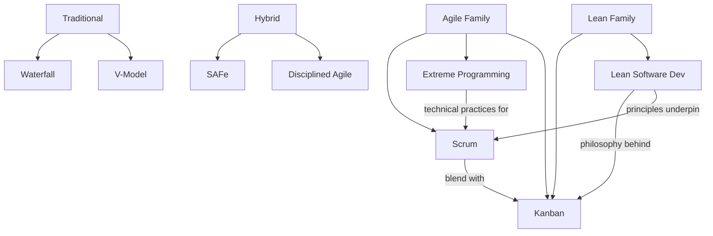

# Software Methodologies — Overview

> *Purpose: A practical comparison of major software development methodologies to help you choose the right approach for your project.*

## The Methodology Landscape

## Quick Decision Matrix

| If your situation is... | Consider | Why |
|---|---|---|
| Fixed scope, regulated, safety-critical | **V-Model** | Verification at every level, formal documentation |
| Fixed scope, well-understood requirements | **Waterfall** | Sequential, predictable, easy to manage |
| Evolving requirements, product development | **Scrum** | Fixed iterations, stakeholder feedback, velocity tracking |
| Continuous delivery, operations, support | **Kanban** | Flow-based, no sprint overhead, handles variable work |
| High technical risk, need for quality | **XP + TDD** | Technical discipline, pair programming, refactoring |
| Enterprise, multiple teams, coordination needed | **SAFe** | Scaled Agile, portfolio planning, PI planning |
| Transitioning from Waterfall, want incremental improvement | **Kanban** then **Scrum** | Least disruptive, evolutionary change |
| Startup, small team, fast iteration | **Scrum + XP** | Lightweight process + technical discipline |

## Methodology Comparison

### Waterfall
- **Origin:** Winston Royce (1970), though he actually criticized pure waterfall
- **Phases:** Requirements → Design → Implementation → Testing → Deployment
- **Strengths:** Simple, predictable, well-understood, good for fixed-scope contracts
- **Weaknesses:** Late feedback, high change cost, no working software until late
- **Best for:** Fixed requirements, regulated industries, government contracts
- **Documentation:** Heavy upfront (SRS, SDD, STD, SDD)

### V-Model
- **Origin:** German federal government (1980s), extension of Waterfall
- **Key insight:** Every development phase has a corresponding verification phase
  - Requirements ↔ Acceptance Testing
  - System Design ↔ System Testing
  - Architecture ↔ Integration Testing
  - Detailed Design ↔ Unit Testing
- **Strengths:** Early verification planning, traceability, formal documentation
- **Weaknesses:** Still sequential, high change cost
- **Best for:** Safety-critical systems (avionics, medical, automotive), regulated industries

### Scrum
- **Origin:** Ken Schwaber & Jeff Sutherland (1995), based on empirical process control
- **Core:** Fixed 1–4 week sprints, three roles, five events, three artifacts
- **Strengths:** Predictable cadence, stakeholder feedback, team empowerment
- **Weaknesses:** Can become rigid (Scrum-but), velocity gaming, no technical practices mandated
- **Best for:** Product development with evolving requirements, 5–9 person teams

### Extreme Programming (XP)
- **Origin:** Kent Beck (1999), radical discipline in technical practices
- **Core:** TDD, pair programming, refactoring, continuous integration, simple design
- **Strengths:** Highest code quality, collective ownership, fearless refactoring
- **Weaknesses:** Requires skilled developers, cultural resistance to pair programming
- **Best for:** High-quality software, teams committed to technical excellence

### Kanban
- **Origin:** Toyota Production System, adapted for software by David Anderson (2010)
- **Core:** Visualize workflow, limit WIP, manage flow, explicit policies, feedback loops
- **Strengths:** Minimal process overhead, continuous flow, evolutionary change, handles variable work
- **Weaknesses:** No prescribed roles, can lack structure for new teams
- **Best for:** Operations, support, continuous delivery, mixed planned/unplanned work

### Lean Software Development
- **Origin:** Mary & Tom Poppendieck (2003), applying TPS to software
- **Core:** Seven principles — eliminate waste, amplify learning, decide late, deliver fast, empower team, build integrity in, optimize the whole
- **Strengths:** Philosophy-level guidance, reduces waste, optimizes flow
- **Weaknesses:** Abstract, requires experience to apply
- **Best for:** Foundational mindset for any methodology

### SAFe (Scaled Agile Framework)
- **Origin:** Dean Leffingwell (2011), scaling Agile to enterprise
- **Core:** Portfolio → Large Solution → Program → Team levels, PI Planning, ARTs
- **Strengths:** Addresses multi-team coordination, portfolio management, governance
- **Weaknesses:** Heavy, bureaucratic, can feel anti-Agile
- **Best for:** Large enterprises (50+ teams), regulated industries needing Agile at scale

### Disciplined Agile (DAD)
- **Origin:** Scott Ambler (2012), process decision framework
- **Core:** Goal-driven approach, choose practices based on context
- **Strengths:** Flexible, context-aware, provides guidance without prescription
- **Weaknesses:** Less prescriptive, harder to adopt without experience
- **Best for:** Organizations wanting flexibility in methodology choice

## Choosing Your Methodology

### Step 1: Assess Your Context
| Factor | Scrum | Kanban | Waterfall | V-Model |
|---|---|---|---|---|
| Requirements stability | Evolving | Variable | Fixed | Fixed |
| Team size | 5–9 | Any | Any | Any |
| Regulatory needs | Low–Medium | Low–Medium | High | Very High |
| Delivery frequency | Every sprint | Continuous | End of project | End of project |
| Technical risk | Medium | Any | Low–Medium | High |

### Step 2: Start with What You Have
- Already doing Waterfall? → Add Kanban to visualize flow
- Already doing Scrum? → Add XP technical practices (TDD, CI)
- New to Agile? → Start with Scrum, add Kanban elements as you mature
- Operations team? → Start with Kanban

### Step 3: Evolve, Don't Transform
Big-bang methodology changes fail. Evolutionary change works:
1. Visualize current workflow (Kanban board)
2. Identify the biggest bottleneck
3. Run a small experiment to address it
4. Measure the result
5. Keep what works, revert what doesn't
6. Repeat

## Methodology Anti-Patterns

| Anti-Pattern | What It Looks Like | Fix |
|---|---|---|
| **Scrum-but** | "We do Scrum, but we don't do retrospectives" | Either do retrospectives or stop calling it Scrum |
| **Agile without engineering** | Sprints without TDD, CI, refactoring | Add technical practices — Agile without discipline is chaos |
| **Waterfall in sprints** | Long requirements phase, then "sprints" for implementation | Actually iterate; deliver working software each sprint |
| **Cargo cult Agile** | Standups, boards, sprints — but no actual agility | Focus on outcomes (fast feedback, working software), not ceremonies |
| **Process over people** | Following the process is more important than delivering value | Remember: individuals and interactions over processes and tools |

## Related

- [[00_Agile_Methodology]] — Deep dive on Agile, Scrum, XP, TDD
- [[01_Lean_Methodology]] — Lean principles and practices
- [[03_Kanban_and_Flow]] — Kanban as a Lean implementation
- [[04_Waterfall_and_V-Model]] — Traditional sequential methodologies
