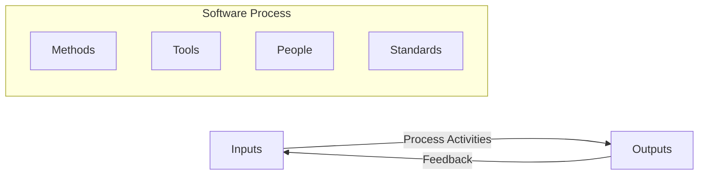
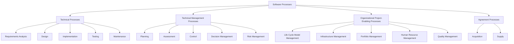
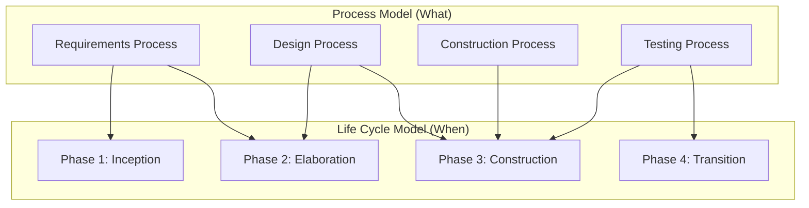
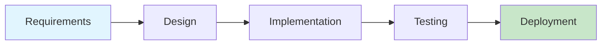
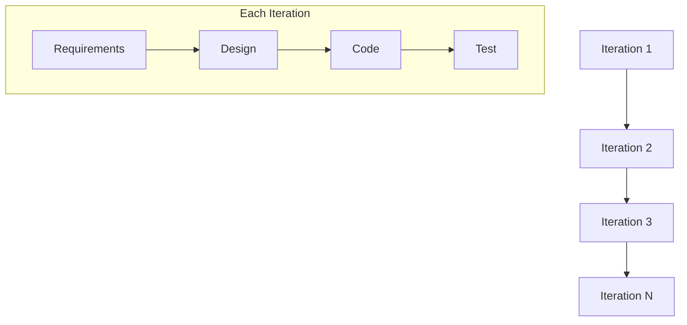
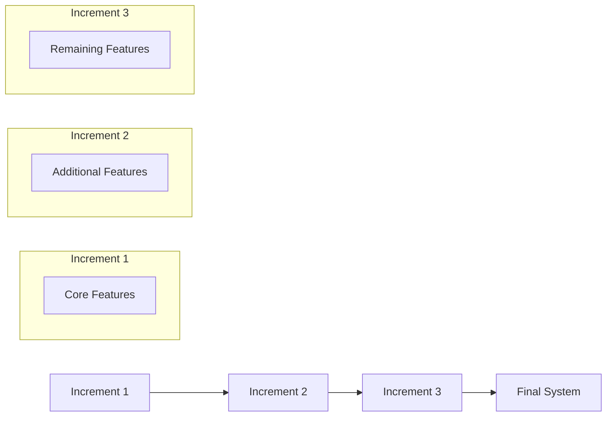
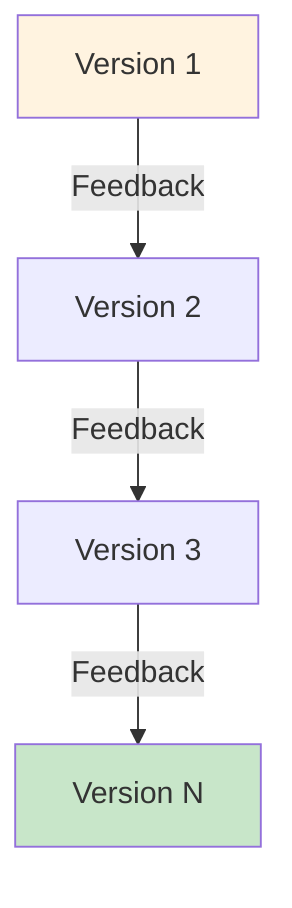
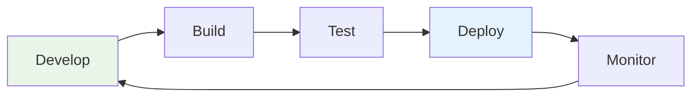
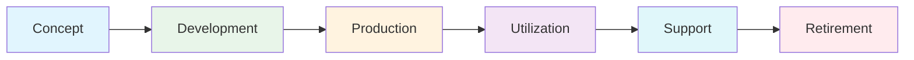
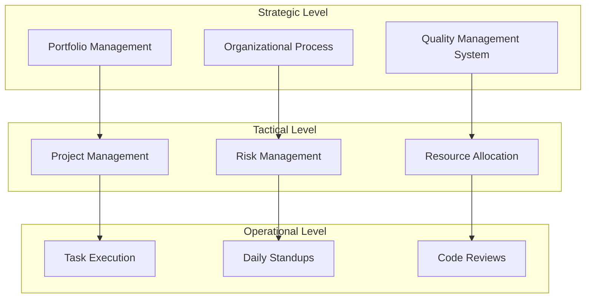

# Software Process Fundamentals

> **Source:** *Guide to the Software Engineering Body of Knowledge (SWEBOK), Version 4 — Chapter 10: Software Engineering Process*

---

## 1. What Is a Software Process?

### Definition

A **software process** is a set of activities, methods, practices, and transformations that people use to develop and maintain software and its associated products (e.g., project plans, design documents, code, test cases, and user manuals).

> **Key Distinction:** A software process is *what* gets done. A process model is a *representation* of that process. A life cycle model is a specific *sequencing* of process phases.

### Process Components

Every software process consists of three fundamental components:

| Component | Description | Examples |
|-----------|-------------|----------|
| **Inputs** | Work products consumed or transformed by the process | Requirements documents, design specifications, test plans, change requests |
| **Activities** | Actions performed to transform inputs into outputs | Analysis, design, coding, testing, reviews, deployment |
| **Outputs** | Work products generated by the process | Code artifacts, test results, documentation, release notes |

### Process Characteristics

A well-defined software process provides:

- **Visibility:** Stakeholders can see what is happening
- **Predictability:** Outcomes can be estimated with reasonable confidence
- **Improvement potential:** Measurable processes can be improved
- **Repeatability:** Successful practices can be replicated

---

## 2. Four Process Categories (ISO/IEC 12207)

SWEBOK and ISO/IEC 12207 classify software processes into four fundamental categories:

### Technical Processes

These processes define the fundamental activities of software engineering:

| Process | Purpose | Key Activities |
|---------|---------|----------------|
| **Stakeholder Requirements** | Define user needs | Elicitation, analysis, specification |
| **System Requirements** | Translate to technical requirements | Allocation, specification, validation |
| **Software Requirements** | Detailed specification | Functional/non-functional analysis |
| **Software Design** | Architecture and detailed design | Architectural design, interface design, database design |
| **Software Construction** | Implementation | Coding, unit testing, integration |
| **Software Integration** | Combine components | Integration testing, interface verification |
| **Software Testing** | Verify and validate | Test planning, execution, defect tracking |
| **Software Maintenance** | Post-delivery changes | Corrective, adaptive, perfective, preventive |
| **Software Disposal** | End-of-life | Data migration, archiving, decommissioning |

### Technical Management Processes

These processes ensure technical activities are properly managed:

- **Project Planning:** Define scope, schedule, resources, and milestones
- **Project Assessment and Control:** Monitor progress against plans
- **Decision Management:** Structured decision-making for technical choices
- **Risk Management:** Identify, analyze, and mitigate technical risks
- **Configuration Management:** Control changes to artifacts
- **Information Management:** Manage documentation and knowledge
- **Measurement:** Collect and analyze process/product metrics
- **Quality Assurance:** Ensure quality standards are met

### Organizational Project-Enabling Processes

These processes establish the organizational context:

- **Life Cycle Model Management:** Define and maintain the organization's process
- **Infrastructure Management:** Provide tools, environments, and resources
- **Project Portfolio Management:** Select and prioritize projects
- **Human Resource Management:** Staff and develop the workforce
- **Quality Management:** Organization-wide quality system
- **Knowledge Management:** Capture and share organizational learning

### Agreement Processes

These processes govern relationships between parties:

- **Acquisition:** Processes for acquiring software products or services
- **Supply:** Processes for providing software products or services

---

## 3. Process Models vs Life Cycle Models

### Key Distinction

| Aspect | Process Model | Life Cycle Model |
|--------|---------------|------------------|
| **Purpose** | Describes *how* work is performed | Describes *when* and in what *order* work phases occur |
| **Scope** | Focuses on activities and their relationships | Focuses on phases and transitions |
| **Abstraction** | Higher-level, organizational | More specific, project-level |
| **Example** | ISO/IEC 12207 process framework | Waterfall, Spiral, Agile iterations |
| **Relationship** | Provides the building blocks | Sequences those blocks into a timeline |

### Why the Distinction Matters

Understanding this distinction helps organizations:

1. **Select appropriate processes** independently of the life cycle approach
2. **Tailor processes** to specific project needs while maintaining consistency
3. **Improve processes** without changing the life cycle model
4. **Mix approaches** (e.g., use Agile iterations with formal verification processes)

---

## 4. Development Life Cycle Paradigms

SWEBOK identifies five fundamental life cycle paradigms, each suited to different project contexts:

### Paradigm Comparison

| Paradigm | Description | Best For | Risk Profile |
|----------|-------------|----------|--------------|
| **Predictive** | Complete plan upfront, sequential phases | Stable requirements, well-understood domain | Low risk if requirements stable |
| **Iterative** | Repeated refinement of full system | Complex systems, unclear requirements | Medium risk, learning reduces uncertainty |
| **Incremental** | Progressive delivery of functionality | Large systems, need early value | Low-medium risk, early feedback |
| **Evolutionary** | Continuous adaptation based on feedback | Highly uncertain, rapidly changing | Medium-high risk, high adaptability |
| **Continuous** | Ongoing deployment, no discrete versions | SaaS, web applications | Low risk per change, high change frequency |

### Predictive Life Cycle

- **Characteristics:** Linear progression, complete specification before coding
- **Assumptions:** Requirements are stable and well-understood
- **Advantages:** Simple, easy to manage, well-documented
- **Disadvantages:** Inflexible to change, late feedback, high cost of change
- **See also:** [[04_Waterfall_and_V-Model]]

### Iterative Life Cycle

- **Characteristics:** Repeated cycles, progressive refinement
- **Assumptions:** Requirements will evolve through learning
- **Advantages:** Early risk reduction, stakeholder feedback, learning
- **Disadvantages:** Requires discipline, architecture must support evolution

### Incremental Life Cycle

- **Characteristics:** Progressive addition of functionality
- **Assumptions:** System can be decomposed into independent increments
- **Advantages:** Early delivery, manageable complexity, user feedback
- **Disadvantages:** Requires careful architecture, integration challenges

### Evolutionary Life Cycle

- **Characteristics:** Continuous adaptation based on user feedback
- **Assumptions:** Requirements are highly uncertain and will change
- **Advantages:** High adaptability, user involvement, reduced risk
- **Disadvantages:** Difficult to plan, scope creep risk, architectural drift

### Continuous Life Cycle

- **Characteristics:** Ongoing development, frequent small releases
- **Assumptions:** Infrastructure supports continuous deployment
- **Advantages:** Rapid feedback, minimal release risk, always current
- **Disadvantages:** Requires mature DevOps, testing automation, monitoring

---

## 5. Six Generic Life Cycle Stages

SWEBOK defines six generic stages that apply across all paradigms:

### Stage Details

| Stage | Purpose | Key Activities | Primary Outputs |
|-------|---------|----------------|-----------------|
| **Concept** | Define the need and feasibility | Stakeholder analysis, feasibility study, concept exploration | Business case, feasibility report, initial requirements |
| **Development** | Design and build the system | Requirements, design, implementation, testing | Software product, documentation, test results |
| **Production** | Deploy and operationalize | Installation, configuration, data migration, training | Operational system, user manuals, training materials |
| **Utilization** | Operate and use the system | Daily operations, monitoring, user support | Usage data, feedback, operational reports |
| **Support** | Maintain and enhance | Bug fixes, enhancements, patches, performance tuning | Updated software, maintenance reports |
| **Retirement** | Decommission the system | Data archiving, migration, system shutdown | Archive, migration reports, decommissioning documentation |

### Stage Transitions

Each stage transition involves:

- **Entry criteria:** What must be true to begin the stage
- **Exit criteria:** What must be true to complete the stage
- **Deliverables:** Work products produced during the stage
- **Reviews:** Formal assessments at stage boundaries

---

## 6. Three Management Levels

Software processes operate at three distinct management levels:

### Strategic Level

- **Focus:** Organizational direction, process improvement, long-term planning
- **Timeframe:** Months to years
- **Responsibilities:**
  - Define organizational process assets
  - Establish quality management systems
  - Manage project portfolios
  - Set process improvement goals
- **Standards:** ISO 9001, CMMI, organizational process frameworks

### Tactical Level

- **Focus:** Project planning, coordination, and control
- **Timeframe:** Weeks to months
- **Responsibilities:**
  - Project planning and estimation
  - Risk identification and mitigation
  - Resource allocation and coordination
  - Stakeholder communication
- **Tools:** Project management tools, risk registers, status reports

### Operational Level

- **Focus:** Day-to-day task execution
- **Timeframe:** Hours to days
- **Responsibilities:**
  - Execute assigned tasks
  - Participate in team ceremonies
  - Conduct technical work
  - Report progress and issues
- **Practices:** Daily standups, pair programming, code reviews, testing

---

## 7. Process Definition and Representation

### Process Modeling Notations

Organizations use various notations to define and document their processes:

| Notation | Type | Strengths | Use Case |
|----------|------|-----------|----------|
| **BPMN** (Business Process Model and Notation) | Flowchart | Industry standard, rich semantics, executable | Process automation, workflow design |
| **IDEF0** (Integration DEFinition) | Functional | Hierarchical, input/output focus | System analysis, functional decomposition |
| **Petri Nets** | Mathematical | Formal analysis, concurrency modeling | Concurrent systems, protocol verification |
| **UML Activity Diagrams** | Object-oriented | Integration with UML, swimlanes | Software process modeling, use case flows |

### Process Assets

Organizations maintain process assets including:

- **Process descriptions:** How activities are performed
- **Templates:** Standard forms for work products
- **Guidelines:** Best practices and recommendations
- **Checklists:** Verification and validation criteria
- **Training materials:** How to perform processes

---

## 8. Relationship to Other Knowledge Areas

### Cross-References

| KA | Relationship |
|----|--------------|
| [[00_Agile_Methodology\|KA 10: Agile]] | Agile is a family of process approaches |
| [[04_Waterfall_and_V-Model\|KA 10: Waterfall]] | Waterfall is a predictive life cycle model |
| [[02_Methodologies_Overview\|KA 10: Methodologies]] | Overview of various process methodologies |
| [[Software Requirements\|KA 1: Requirements]] | Requirements processes feed into all stages |
| [[Software Design\|KA 3: Design]] | Design processes are part of Development stage |
| [[Software Testing\|KA 4: Testing]] | Testing processes span Development and Production |
| [[Software Configuration Management\|KA 7: CM]] | CM processes support all stages |
| [[Software Engineering Management\|KA 8: Management]] | Management processes operate at all levels |

---

## 9. Key Takeaways

1. A **software process** consists of inputs, activities, and outputs
2. **Four process categories:** Technical, Technical Management, Organizational Project-Enabling, Agreement
3. **Process models** describe *how* work is done; **life cycle models** describe *when* phases occur
4. **Five paradigms:** Predictive, Iterative, Incremental, Evolutionary, Continuous
5. **Six generic stages:** Concept, Development, Production, Utilization, Support, Retirement
6. **Three management levels:** Strategic, Tactical, Operational
7. Process representation uses notations like BPMN, IDEF0, Petri Nets, and UML

---

## 10. References

- SWEBOK Version 4, Chapter 10: Software Engineering Process
- ISO/IEC 12207:2017 Systems and software engineering: Software life cycle processes
- ISO/IEC 15288:2015 Systems and software engineering: System life cycle processes
- Boehm, B. W. (1988). A spiral model of software development and enhancement. *Computer*, 21(5), 61-72.
- Kruchten, P. (2003). *The Rational Unified Process: An Introduction* (3rd ed.). Addison-Wesley.
- Pressman, R. S., & Maxim, B. R. (2020). *Software Engineering: A Practitioner's Approach* (9th ed.). McGraw-Hill.
