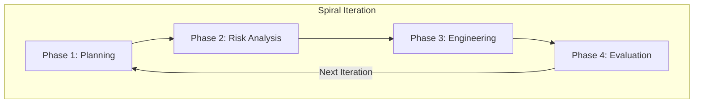
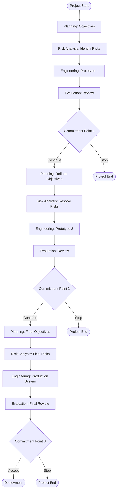
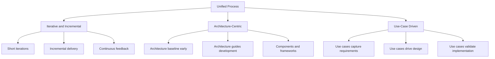
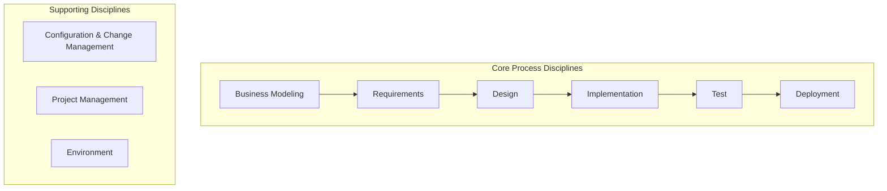
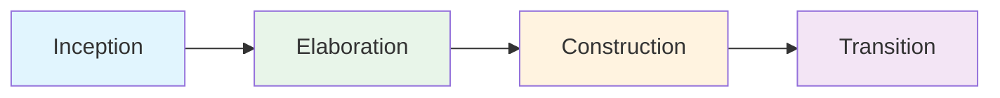
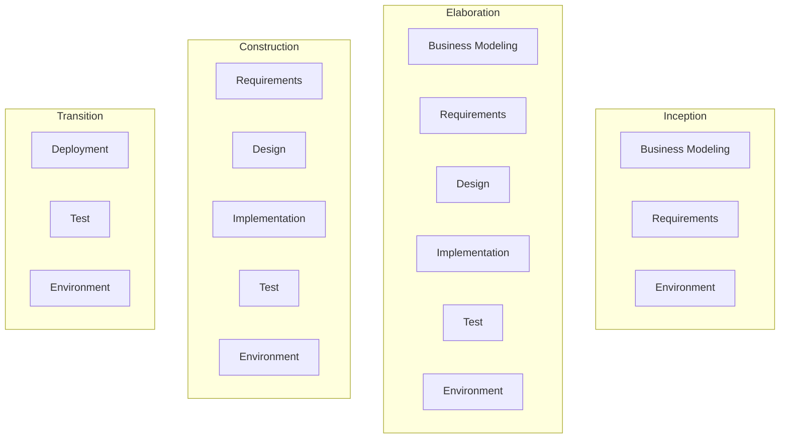
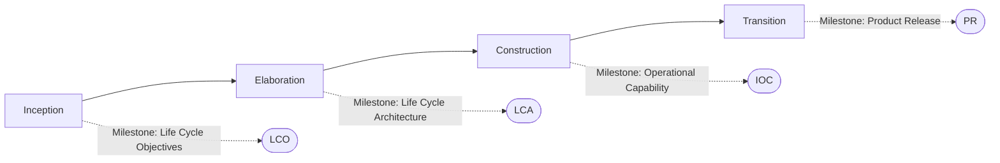
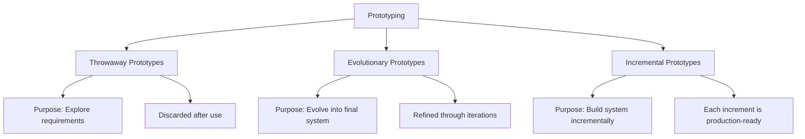
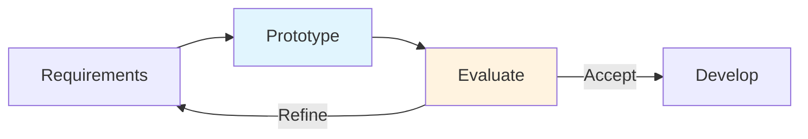

# Spiral Model and Unified Process

> **Source:** *Guide to the Software Engineering Body of Knowledge (SWEBOK), Version 4 — Chapter 10: Software Engineering Process, Section 10.6*

---

## 1. Boehm's Spiral Model

### Overview

The **Spiral Model**, introduced by Barry Boehm in 1988, is a risk-driven process model that combines elements of both design and prototyping in stages. Unlike linear models, the Spiral Model emphasizes iterative refinement with continuous risk analysis at each iteration.

### Key Characteristics

| Characteristic | Description |
|----------------|-------------|
| **Risk-Driven** | Each iteration begins with explicit risk identification and mitigation |
| **Iterative** | The system evolves through repeated cycles (spirals) |
| **Flexible** | Adapts to project needs; no fixed number of phases |
| **Prototyping-Oriented** | Early iterations often produce prototypes rather than production code |
| **Stakeholder-Involving** | Regular reviews with stakeholders at each spiral cycle |

### Four Phases of Each Spiral Iteration

#### Phase 1: Planning

- **Objective:** Define objectives, alternatives, and constraints
- **Activities:**
  - Gather requirements and constraints
  - Identify alternative solutions
  - Evaluate alternatives against objectives
  - Develop management plans
- **Deliverables:** Requirements document, project plan, risk management plan

#### Phase 2: Risk Analysis

- **Objective:** Identify and resolve risks
- **Activities:**
  - Identify technical and project risks
  - Analyze risk probability and impact
  - Develop risk mitigation strategies
  - Build prototypes to resolve critical risks
- **Deliverables:** Risk assessment report, prototypes, proof-of-concept

#### Phase 3: Engineering

- **Objective:** Develop the product
- **Activities:**
  - Design, implement, and test the software
  - Apply appropriate development methods
  - Conduct reviews and inspections
  - Produce deliverable work products
- **Deliverables:** Software increment, test results, documentation

#### Phase 4: Evaluation

- **Objective:** Review results and plan next iteration
- **Activities:**
  - Evaluate deliverables with stakeholders
  - Assess risk status
  - Plan next spiral iteration
  - Decide whether to continue, modify, or terminate
- **Deliverables:** Review reports, updated plans, commitment to next phase

### Spiral Model Diagram

### Advantages and Disadvantages

| Advantages | Disadvantages |
|------------|---------------|
| Explicit risk management | Complex management |
| Flexible to changing requirements | Requires risk assessment expertise |
| Early prototype validation | Difficult to define milestones |
| Stakeholder involvement | Expensive for small projects |
| Works well for large, complex, novel systems | Risk analysis may be insufficient |

### When to Use the Spiral Model

- **Large, complex systems** with significant technical uncertainty
- **High-risk projects** where early risk reduction is critical
- **Novel domains** where requirements are poorly understood
- **Long-duration projects** where requirements will evolve
- **Safety-critical systems** where thorough analysis is mandatory

---

## 2. Unified Process (UP)

### Overview

The **Unified Process (UP)** is an iterative, incremental, architecture-centric, and use-case driven software development process framework. It was developed by Ivar Jacobson, Grady Booch, and James Rumbaugh, and later refined into the Rational Unified Process (RUP).

### Core Principles

#### Iterative and Incremental Development

- **Iterations:** Time-boxed periods (typically 2-6 weeks) producing executable releases
- **Increments:** Each iteration adds functionality to the system
- **Feedback:** Regular stakeholder reviews at each iteration end

#### Architecture-Centric Approach

- **Architecture Baseline:** Established early in the project
- **Architectural Decisions:** Made consciously and documented
- **Component-Based:** System decomposed into components and interfaces
- **Frameworks:** Leverages architectural frameworks and patterns

#### Use-Case Driven Development

- **Requirements Capture:** Use cases document functional requirements
- **Design Driver:** Use cases drive the design process
- **Test Basis:** Use cases form the basis for acceptance testing
- **Communication:** Use cases provide a common language for stakeholders

### UP Disciplines

The Unified Process defines nine disciplines organized into core process and supporting disciplines:

#### Discipline Details

| Discipline | Phase | Purpose | Key Activities |
|------------|-------|---------|----------------|
| **Business Modeling** | Inception, Elaboration | Understand business context | Business process modeling, domain analysis |
| **Requirements** | Inception, Elaboration | Capture functional requirements | Use case modeling, supplementary specifications |
| **Design** | Elaboration, Construction | Define architecture and detailed design | Architectural design, class design, database design |
| **Implementation** | Construction | Implement the design | Coding, unit testing, integration |
| **Testing** | Construction, Transition | Verify and validate | Test planning, execution, defect tracking |
| **Deployment** | Transition | Deliver the product | Installation, configuration, training |
| **Configuration & Change Management** | All phases | Manage change | Version control, change requests, baselines |
| **Project Management** | All phases | Manage the project | Planning, monitoring, risk management |
| **Environment** | All phases | Provide process and tools | Process configuration, tool setup, training |

---

## 3. Rational Unified Process (RUP)

### Overview

The **Rational Unified Process (RUP)** is a specific implementation of the Unified Process, developed by Rational Software (now IBM). RUP provides detailed guidance, templates, and tools for implementing UP.

### Four Phases

#### Phase Characteristics

| Phase | Duration | Primary Objectives | Key Milestones |
|-------|----------|-------------------|----------------|
| **Inception** | ~10% of total | Define scope, establish business case | Lifecycle Objectives (LCO) |
| **Elaboration** | ~30% of total | Establish architecture baseline, mitigate risks | Lifecycle Architecture (LCA) |
| **Construction** | ~50% of total | Build the product | Initial Operational Capability (IOC) |
| **Transition** | ~10% of total | Deploy to users | Product Release (PR) |

#### Inception Phase

**Goal:** Achieve concurrence among stakeholders on the project's lifecycle objectives

- Define project scope and boundaries
- Establish the business case
- Identify critical risks
- Produce initial project plan

**Key Artifacts:**
- Vision document
- Initial use case model
- Initial risk assessment
- Business case
- Project plan (phase 1)

#### Elaboration Phase

**Goal:** Establish a stable architecture baseline that mitigates key risks

- Analyze core requirements (80% of use cases)
- Design, implement, and validate architecture
- Mitigate critical risks
- Produce detailed project plan

**Key Artifacts:**
- Architecture baseline
- Updated use case model
- Design model
- Implementation model
- Test plan

#### Construction Phase

**Goal:** Build the product iteratively

- Implement remaining requirements
- Develop all features and components
- Conduct comprehensive testing
- Prepare for deployment

**Key Artifacts:**
- Executable software increments
- Test results
- User documentation
- Training materials

#### Transition Phase

**Goal:** Deploy the product to users

- Conduct beta testing
- Train users
- Prepare deployment environment
- Finalize documentation

**Key Artifacts:**
- Released product
- Installation guides
- User manuals
- Release notes

### RUP Disciplines Workflow Across Phases

### RUP Best Practices

RUP embodies six best practices:

1. **Develop Iteratively:** Short, time-boxed iterations with concrete deliverables
2. **Manage Requirements:** Systematic requirements capture and change management
3. **Use Component Architectures:** Architecture-centric development with components
4. **Visually Model Software:** UML diagrams to communicate design
5. **Verify Software Quality:** Continuous testing throughout development
6. **Control Changes to Software:** Configuration and change management

---

## 4. OpenUP (Open Unified Process)

### Overview

**OpenUP** is a lightweight, open-source implementation of the Unified Process, designed for small teams (3-6 people) working on moderately complex projects. It is part of the Eclipse Process Framework (EPF).

### Key Characteristics

| Characteristic | Description |
|----------------|-------------|
| **Lightweight** | Minimal process overhead, essential practices only |
| **Agile-Compatible** | Incorporates Agile values and practices |
| **Iterative** | Short iterations (typically 2-4 weeks) |
| **Architecture-Centric** | Early architecture definition |
| **Use-Case Driven** | Use cases as primary requirements artifact |
| **Open Source** | Free, customizable, extensible |

### OpenUP Principles

1. **Balance competing priorities:** Manage stakeholder needs
2. **Collaborate to align interests:** Shared understanding
3. **Focus on architecture early:** Reduce risk
4. **Demonstrate value iteratively:** Working software
5. **Elevate the level of abstraction:** Reuse and patterns
6. **Focus on continuous quality:** Testing throughout

### OpenUP Phases

### OpenUP vs RUP Comparison

| Aspect | OpenUP | RUP |
|--------|--------|-----|
| **Team Size** | 3-6 people | 20+ people |
| **Complexity** | Moderate | High to very high |
| **Process Weight** | Lightweight | Heavyweight |
| **Documentation** | Minimal, essential | Comprehensive |
| **Roles** | Few, multi-skilled | Many, specialized |
| **Tools** | Any | Rational tools preferred |
| **Customization** | Easy, built-in | Complex, requires expertise |
| **Cost** | Free (open source) | Commercial license |

---

## 5. Rapid Prototyping Approaches

### Definition

**Rapid prototyping** is an approach to software development that emphasizes quickly building a working model of the system to gather feedback and refine requirements.

### Types of Prototypes

#### Throwaway Prototypes

- **Purpose:** Quickly explore requirements and design alternatives
- **Characteristics:**
  - Built rapidly, often with simplified code
  - Discarded after feedback is gathered
  - Focus on user interface and workflow
  - Minimal documentation
- **When to Use:**
  - Requirements are unclear
  - User interface design is critical
  - Multiple design alternatives need evaluation
  - Stakeholders need visual confirmation

#### Evolutionary Prototypes

- **Purpose:** Develop the system through continuous refinement
- **Characteristics:**
  - Initial prototype evolves into the final system
  - Feedback drives refinement
  - Architecture must support evolution
  - Continuous integration and testing
- **When to Use:**
  - Requirements will evolve significantly
  - Users need to see working software early
  - Architecture can accommodate changes
  - Long-term maintainability is important

#### Incremental Prototypes

- **Purpose:** Build the system in production-quality increments
- **Characteristics:**
  - Each increment is fully functional and tested
  - Increments are integrated into the growing system
  - Quality is maintained throughout
  - Users get working features early
- **When to Use:**
  - System can be decomposed into independent features
  - Users need some functionality quickly
  - Quality is paramount
  - Integration risks need early mitigation

### Prototyping Process

### Prototyping Techniques

| Technique | Description | Tools | Best For |
|-----------|-------------|-------|----------|
| **UI Mockups** | Static visual designs of the interface | Figma, Sketch, Balsamiq | User interface exploration |
| **Paper Prototypes** | Hand-drawn screens | Paper, markers | Early concept validation |
| **Wizard of Oz** | Simulated system with human behind the scenes | Manual processes | AI/complex logic testing |
| **Rapid Application Development (RAD)** | Visual development tools | Delphi, Visual Basic | Business applications |
| **Low-Fidelity Prototypes** | Simplified, non-interactive | PowerPoint, Keynote | Concept communication |
| **High-Fidelity Prototypes** | Interactive, realistic | React, Angular, Vue | Detailed user testing |

### Advantages and Disadvantages

| Advantages | Disadvantages |
|------------|---------------|
| Early user feedback | May set unrealistic expectations |
| Reduced risk of building wrong system | Can lead to poor architecture |
| Better requirement understanding | Users may resist changes to prototype |
| Increased stakeholder engagement | May delay actual development |
| Improved communication | Can be difficult to manage scope |

---

## 6. Comparison of Approaches

### Process Model Comparison

| Model | Risk Focus | Iterative | Architecture | Team Size | Complexity |
|-------|------------|-----------|--------------|-----------|------------|
| **Spiral** | High (primary) | Yes | Optional | Any | High |
| **RUP** | Medium | Yes | Essential | Large | High |
| **OpenUP** | Low-Medium | Yes | Important | Small | Moderate |
| **Prototyping** | Low | Yes | Minimal | Small | Low-Medium |
| [[00_Agile_Methodology\|**Agile**]] | Low-Medium | Yes | Emergent | Small-Medium | Low-High |
| [[04_Waterfall_and_V-Model\|**Waterfall**]] | Low | No | Upfront | Any | Low-Medium |

### Selection Criteria

| Criterion | Spiral | RUP | OpenUP | Prototyping |
|-----------|--------|-----|--------|-------------|
| **Requirements Stability** | Unstable | Evolving | Moderate | Very Unstable |
| **Risk Level** | High | Medium-High | Medium | Low-Medium |
| **Team Experience** | High | High | Moderate | Low-Medium |
| **Documentation Need** | Medium | High | Low | Low |
| **Stakeholder Involvement** | High | Medium | High | Very High |
| **Project Duration** | Long | Long | Short-Medium | Short |

---

## 7. Key Takeaways

1. The **Spiral Model** is risk-driven, with four phases per iteration: Planning, Risk Analysis, Engineering, Evaluation
2. **Unified Process** is iterative, architecture-centric, and use-case driven
3. **RUP** implements UP with four phases (Inception, Elaboration, Construction, Transition) and nine disciplines
4. **OpenUP** is a lightweight UP variant for small teams with moderate complexity
5. **Rapid prototyping** helps explore requirements and validate designs early
6. **Prototyping types:** Throwaway, Evolutionary, Incremental
7. **Selection depends on:** Risk level, requirements stability, team size, and stakeholder involvement

---

## 8. References

- Boehm, B. W. (1988). A spiral model of software development and enhancement. *Computer*, 21(5), 61-72.
- Kruchten, P. (2003). *The Rational Unified Process: An Introduction* (3rd ed.). Addison-Wesley.
- Jacobson, I., Booch, G., & Rumbaugh, J. (1999). *The Unified Software Development Process*. Addison-Wesley.
- Scott, K. (2002). *The Unified Process Explained*. Addison-Wesley.
- SWEBOK Version 4, Chapter 10: Software Engineering Process.
- Eclipse Process Framework. OpenUP. https://www.eclipse.org/epf/
- Pressman, R. S., & Maxim, B. R. (2020). *Software Engineering: A Practitioner's Approach* (9th ed.). McGraw-Hill.

---

## Related Notes

- [[05_Process_Fundamentals]]: Core process concepts and life cycle paradigms
- [[00_Agile_Methodology]]: Agile approaches and Scrum framework
- [[04_Waterfall_and_V-Model]]: Predictive life cycle models
- [[02_Methodologies_Overview]]: Overview of software methodologies
- [[01_Lean_Methodology]]: Lean principles and waste elimination
- [[03_Kanban_and_Flow]]: Kanban and flow-based process management
